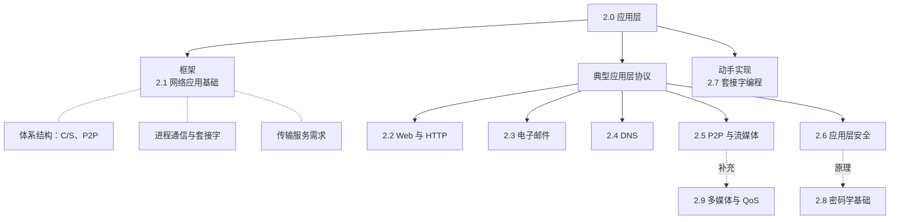

# 2.0 应用层

> 自顶向下方法从应用层讲起：先从我们每天都在用的网络应用（Web、邮件、视频）入手，理清"进程之间怎么通信"，再往下看传输层如何支撑这些通信。本章只负责把脉络串起来，协议细节放在各小节。

## 应用层在协议栈中的位置

应用层是协议栈的最顶层，运行在端系统（主机）上，不在网络核心的路由器/交换机里。应用进程把数据交给传输层（套接字），由下面各层负责真正送达。

```
   主机 A                                   主机 B
┌───────────┐                          ┌───────────┐
│  应用层    │  ← 报文 message →         │  应用层    │   进程↔进程，本章重点
├───────────┤                          ├───────────┤
│  传输层    │                          │  传输层    │   TCP / UDP（第3章）
├───────────┤      ……网络核心……          ├───────────┤
│  网络层    │   ┌────┐   ┌────┐         │  网络层    │
├───────────┤   │路由│ … │路由│         ├───────────┤
│  链路层    │   │器  │   │器  │         │  链路层    │
├───────────┤   └────┘   └────┘         ├───────────┤
│  物理层    │                          │  物理层    │
└───────────┘                          └───────────┘
```

> 注：路由器只处理到网络层（第3层）为止，不实现应用层和传输层。应用层协议（如 HTTP）是"端到端"的，只在两端主机上运行。

## 本章脉络

应用层这一章可以分成三块：先讲清通用框架（怎么设计一个网络应用），再逐个剖析典型协议，最后落到动手实现（套接字编程），中间穿插两篇原理性补充。



> 阅读顺序建议：2.1 先建立"应用如何用网络"的整体认识，再按 2.2→2.6 逐个看协议；2.7 把前面的概念落到代码；2.8、2.9 是补充原理，可按需阅读。

## 章节目录

- **[2.1 应用层：网络应用基础](2.1 应用层：网络应用基础.md)**
  - 网络应用体系结构：客户-服务器、P2P、混合
  - 进程通信与套接字接口
  - 传输层能提供的服务（可靠性、带宽、时延、安全）

- **[2.2 应用层：万维网和HTTP技术](2.2应用层：万维网和HTTP技术.md)**
  - HTTP/1.1：请求-响应、持久连接、方法与状态码
  - HTTP/2 与 HTTP/3 的演进
  - Cookie 与 Web 缓存（代理服务器、条件 GET）
  - WebSocket 实时通信

- **[2.3 应用层：电子邮件系统](2.3应用层：电子邮件系统.md)**
  - 邮件系统组成：用户代理、邮件服务器
  - SMTP（推送）与 POP3／IMAP（拉取）
  - MIME 扩展

- **[2.4 应用层：DNS域名系统](2.4应用层：DNS域名系统.md)**
  - 分层的域名空间与 DNS 服务器层次（根、TLD、权威）
  - 递归查询与迭代查询
  - 资源记录类型与 DNS 缓存

- **[2.5 应用层：P2P和流媒体技术](2.5应用层：P2P和流媒体技术.md)**
  - P2P 文件分发与扩展性分析
  - BitTorrent 机制
  - 视频流（DASH）与 CDN

- **[2.6 应用层：应用层安全](2.6应用层：应用层安全.md)**
  - TLS/SSL 握手与记录协议
  - HTTPS 与数字证书、PKI
  - 常见 Web 安全问题

- **[2.7 应用层：套接字编程](2.7应用层：套接字编程.md)**
  - 基于 UDP 与 TCP 的套接字编程模型
  - 客户端／服务器代码实例

补充阅读（书外延伸）：

- **[2.8 应用层：密码学基础](2.8应用层：密码学基础.md)** —— 对称/公钥加密、密钥交换、散列与数字签名，是 2.6 TLS 和 [4.6 IPsec](4.6网络层：IPsec与VPN.md) 的共同地基。
- **[2.9 应用层：多媒体网络与QoS](2.9应用层：多媒体网络与QoS.md)** —— VoIP、RTP/RTCP/SIP 与网络层 QoS 机制。

---

**开始学习：[2.1 网络应用基础](2.1 应用层：网络应用基础.md)**
