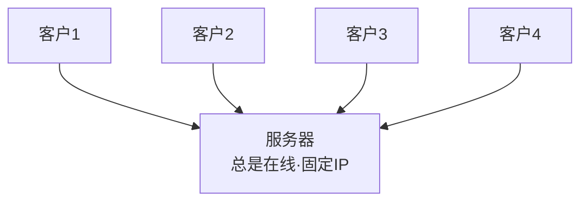
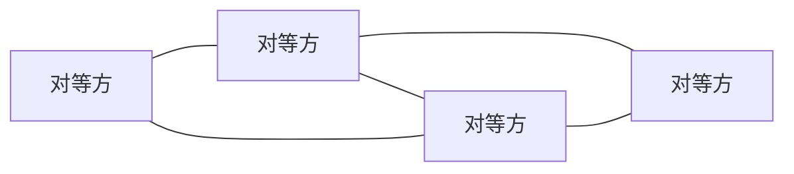
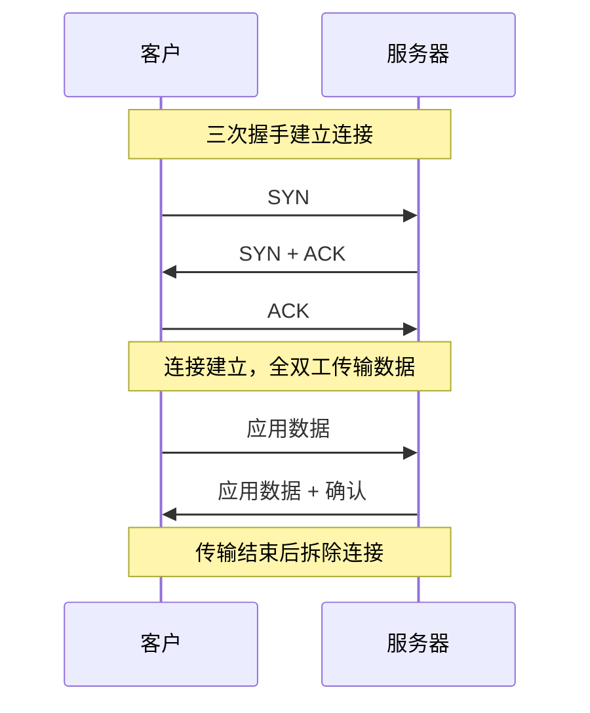

# 2.1 应用层：网络应用基础

> 应用层是协议栈的最高层，也是离用户最近的一层。本节先把网络应用开发的几个底层概念理清：应用怎么组织（体系结构）、进程之间怎么寻址通信（套接字与端口）、应用对传输层有哪些需求，以及因特网用 TCP/UDP 提供了什么。

## 目录

1. [网络应用程序体系结构](#网络应用程序体系结构)
2. [进程通信](#进程通信)
3. [传输层服务需求](#传输层服务需求)
4. [因特网传输服务](#因特网传输服务)
5. [应用层协议](#应用层协议)

---

## 网络应用程序体系结构

### 应用程序体系结构概述

网络应用程序由运行在不同端系统上的程序组成，这些程序通过网络相互通信。开发网络应用的核心，就是编写能运行在不同端系统上、并通过网络彼此通信的程序。

注意一个关键事实：我们**无需为网络核心设备（路由器、交换机）编写应用软件**。核心设备工作在网络层及以下，不运行用户应用程序；应用逻辑只存在于端系统。这正是分层设计带来的好处——应用开发者只需关心端系统，新应用得以快速开发和部署。

> **应用体系结构 vs 网络体系结构**
>
> 网络体系结构（如五层模型）对应用开发者是固定的；应用体系结构则由开发者自己设计，决定应用如何在端系统间组织。下面是两种主流选择。

### 客户-服务器体系结构

> **客户-服务器(Client-Server)体系结构**
> 
> 有一个总是打开的主机称为服务器，它服务于许多来自其他称为客户的主机的请求。客户之间不直接通信。



| 角色 | 特征 |
|------|------|
| 服务器 | 总是在线；拥有固定（周知）IP；常以服务器群集/数据中心形式扩展 |
| 客户 | 间歇性连接；IP 可能动态变化；彼此之间不直接通信 |

**典型应用**：Web、FTP、Telnet、电子邮件。

单台服务器难以承载海量并发请求，因此 Google、Facebook 等会用配备数十万台服务器的**数据中心**来支撑客户-服务器应用，这也带来了集中管理、数据一致、单点故障与扩展成本之间的权衡。

### P2P体系结构

> **P2P(Peer-to-Peer)体系结构**
> 
> 对总是打开的基础设施服务器有最小的（或者没有）依赖。应用程序在间断连接的主机对（称为对等方）之间使用直接通信。



P2P 最重要的性质是**自扩展性(self-scalability)**：每个新加入的对等方在带来服务请求的同时，也贡献出自己的服务能力——用户越多，系统总能力越强。它不依赖大型服务器基础设施，因而成本低、抗单点故障。

代价是难以管理：对等方 IP 动态变化、可用性不稳定，认证授权、版本更新都比集中式困难，也更容易被 ISP 的非对称带宽（上行远小于下行）所限制。

**典型应用**：BitTorrent（文件分发）、迅雷等。

### 混合体系结构

很多实际应用同时使用两种架构：用集中式服务器完成"定位/索引"，用 P2P 完成"实际数据传输"。

| 应用 | 集中式部分 | P2P 部分 |
|------|-----------|----------|
| 早期即时通信 | 服务器登记用户在线状态、定位对方 | 两用户间直接收发消息 |
| 文件共享 | 服务器/Tracker 提供内容索引 | 对等方之间直接传输文件块 |

> 注：现代大型应用（如视频分发）更多采用 CDN + 数据中心 的客户-服务器形态，纯 P2P 已不常见，但 P2P 的自扩展思想仍有价值。

---

## 进程通信

### 进程概念

> **进程(Process)**
> 
> 进程是在端系统中运行的程序。

**同一端系统上的进程通信**：
- 操作系统提供进程间通信机制
- 共享内存、管道、信号量、消息队列等
- 通过内核进行协调

**不同端系统上的进程通信**：
- 通过在计算机网络间交换报文通信
- 需要网络协议的支持
- 通过套接字接口实现

### 客户和服务器进程

> **客户和服务器进程的定义**
> 
> - **客户进程**：发起通信的进程
> - **服务器进程**：等待联系的进程

**重要说明**：
- 在P2P应用中，一个进程既可以是客户也可以是服务器
- 在给定的一对进程之间的通信会话中，发起会话的进程被标识为客户
- 等待联系以开始会话的进程是服务器

### 进程与计算机网络之间的接口

进程通过**套接字(Socket)**向网络发送报文、从网络接收报文。

> **套接字**
> 
> 套接字是同一台主机内应用层与传输层之间的接口，也是应用程序与网络之间的 API（应用程序编程接口）。

打个比方：进程是房子，套接字是房门。发送进程把报文推出门外，剩下的传输、寻路全交给门外的网络基础设施；接收进程在自己的门口取走报文。开发者能控制套接字应用层一侧的一切（选 TCP 还是 UDP、缓冲区大小等少量传输层参数），但无法控制门外的网络。

```
  主机 A                                    主机 B
┌──────────────┐                      ┌──────────────┐
│  发送进程     │                      │  接收进程     │
│  ┌────────┐  │                      │  ┌────────┐  │
│  │应用层   │  │                      │  │应用层   │  │
│  └───┬────┘  │                      │  └───▲────┘  │
│   socket(门) │                      │   socket(门) │
│  ┌───▼────┐  │      报文经网络       │  ┌───┴────┐  │
│  │传输层   │  │  ───────────────►   │  │传输层   │  │
│  │网络层   │  │                      │  │网络层   │  │
│  │链路/物理│  │                      │  │链路/物理│  │
│  └────────┘  │                      │  └────────┘  │
└──────────────┘                      └──────────────┘
        └────────── 由 OS / 网络承载 ──────────┘
```

**套接字地址**：为了把报文送达对端的某个特定进程，需要两样信息：

1. **主机地址**：IP 地址（IPv4 为 32 位，IPv6 为 128 位）。
2. **目的进程标识**：端口号（16 位，0~65535）。

**常用周知端口号**：

| 协议 | 端口 | 传输层 | 协议 | 端口 | 传输层 |
|------|------|--------|------|------|--------|
| HTTP | 80 | TCP | DNS | 53 | UDP/TCP |
| HTTPS | 443 | TCP | POP3 | 110 | TCP |
| FTP | 21（控制） | TCP | IMAP | 143 | TCP |
| SMTP | 25 | TCP | Telnet | 23 | TCP |

> 注：周知端口号（0~1023）由 IANA 统一分配。FTP 用 21 号端口传控制命令，数据传输另用 20 号端口（主动模式）。

---

## 传输层服务需求

不同应用对传输服务的要求差别很大。可以从四个维度来衡量一个应用"需要什么样的传输服务"：可靠数据传输、吞吐量、定时、安全性。

### 可靠数据传输

> **可靠数据传输**
> 
> 协议确保由应用程序一端发送的数据正确、完整地交付到另一端。

是否需要可靠传输，取决于应用能否容忍丢失：

- **不能容忍丢失**：文件传输、电子邮件、Web 文档、银行/电子商务、数据库等。哪怕丢一个字节都可能导致文件损坏或交易出错。
- **能容忍丢失（损耗容忍应用，loss-tolerant）**：实时音视频、在线游戏等。偶尔丢几个分组只是画质或音质略降，不会致命。

### 吞吐量

> **吞吐量要求**
>
> 传输层可承诺以某个确定速率（如 *r* bit/s）交付数据。

按对吞吐量的敏感程度，应用分两类：

- **带宽敏感应用(bandwidth-sensitive)**：有明确的吞吐量下限要求。如多媒体应用，因特网电话约几十 kbps、视频会议常需数 Mbps，低于阈值就无法正常工作。
- **弹性应用(elastic)**：能用多少带宽就用多少，多了更快、少了更慢，但都能完成。如电子邮件、文件传输、Web 浏览。

> 注：传统 PCM 话音采样率为 64 kbps（8000 样本/秒 × 8 bit），而因特网电话经压缩编码后通常只需几十 kbps。课本上"电话需要恒定速率"指的是这类压缩后的下限，而非固定的 32 kbps。

### 定时

> **定时要求**
> 
> 传输层可承诺时延上界，例如发送方送出的每个比特在若干毫秒内到达接收方。

定时敏感的多为**交互式实时应用**：因特网电话、视频会议、多人在线游戏、远程操控。衡量指标包括时延（端到端延迟）和抖动（时延的波动）。

> 注：ITU-T G.114 建议单向语音端到端时延不超过 150 ms 为佳；游戏、远程桌面同样对时延高度敏感。文件传输、邮件这类应用则几乎没有定时要求。

### 安全性

> **安全性要求**
> 
> 传输层（或其之上的安全层）可为应用提供加密、数据完整性和端点鉴别。

- **机密性**：发送方加密、接收方解密，防止被中间方窃听。
- **数据完整性**：检测数据是否被篡改。
- **端点鉴别**：确认通信对方的真实身份。

### 常见应用对传输服务的需求对比

| 应用 | 可靠性 | 吞吐量 | 时延敏感 |
|------|--------|--------|----------|
| 文件传输 / 电子邮件 | 必须 | 弹性 | 不敏感 |
| Web 文档 | 必须 | 弹性（KB~MB 级） | 不敏感 |
| 因特网电话 / 视频会议 | 容忍丢失 | 音频几十 kbps、视频几 Mbps | 敏感（百毫秒级） |
| 流式存储音视频 | 容忍丢失 | 同上 | 较敏感（几秒可缓冲） |
| 交互式游戏 | 容忍丢失 | 几 kbps 起 | 敏感 |
| 短报文交换（如即时消息） | 通常必须 | 弹性 | 视场景 |

> 易混：表中"容忍丢失"不等于"不在乎质量"——丢包仍会降质，只是不会让应用彻底失败。

---

## 因特网传输服务

因特网（确切说是 TCP/IP 协议栈）为应用提供两个传输层协议：**TCP** 和 **UDP**。应用开发者选其一，就接受了它对应的服务模型。

需要强调：**这两者都不提供吞吐量或时延保证**。因特网传输层并不承诺"定时"和"最低带宽"这两类需求——这也是为什么实时应用要在应用层自己想办法（缓冲、自适应码率等）。

### TCP服务

> **TCP(Transmission Control Protocol)** 提供面向连接的、可靠的字节流服务。

**面向连接**：通信前客户与服务器要先**握手**建立连接，连接是全双工的（双方可同时收发），数据传完后拆除连接。



**可靠数据传输**：保证无差错、按序、无丢失、无重复地交付字节流。靠的是接收方确认 + 发送方超时重传。

**流量控制**：通过滑动窗口让发送方速率匹配接收方处理能力，避免淹没接收缓冲区。

**拥塞控制**：当网络出现拥塞时压低发送速率。它是为**整个网络**服务的（防止网络崩溃），而非为某个应用谋利——这有时反而会拖慢实时应用。

> 注：TCP 本身不加密。HTTPS 的安全来自 **TLS**（旧称 SSL），TLS 工作在应用层与 TCP 之间（实现于应用层库中），提供加密、完整性与鉴别。即 HTTPS = HTTP over TLS over TCP。

### UDP服务

> **UDP(User Datagram Protocol)** 提供无连接、不可靠的数据报服务。

**无连接**：没有握手，发送方直接发数据报。

**不可靠**：不保证到达、不保证按序，可能丢失、乱序、重复；也没有流量控制和拥塞控制。

正因为"什么都不做"，UDP 才**轻量、快、可控**：开销小，且发送速率不受拥塞控制约束，应用能按自己的节奏发包。这对实时应用很有吸引力——它们宁愿丢几个包，也不愿因重传而卡顿。

**适用场景**：因特网电话/视频等实时多媒体、DNS 这类一问一答的简单查询、广播与多播。

### TCP vs UDP 对比

| 特性 | TCP | UDP |
|------|-----|-----|
| 连接 | 面向连接（先握手） | 无连接 |
| 可靠性 | 可靠、按序 | 不可靠、不保序 |
| 流量控制 | 有 | 无 |
| 拥塞控制 | 有 | 无 |
| 首部开销 | 最小 20 字节 | 8 字节 |
| 传输单位 | 字节流 | 数据报 |
| 典型应用 | HTTP、FTP、SMTP、IMAP | DNS、DHCP、实时音视频 |

> 易混：TCP/UDP 都不提供"时延/带宽保证"。实时应用选 UDP，不是因为 UDP 能保证实时，而是因为它不会因重传和拥塞控制而引入额外延迟。

---

## 应用层协议

> **应用层协议**
> 
> 应用层协议定义了运行在不同端系统上的应用程序进程如何相互传递报文。

### 应用层协议定义了什么

一个应用层协议通常规定四件事：

1. **报文类型**：交换哪些报文，如请求报文、响应报文。
2. **报文语法**：每类报文有哪些字段、字段如何分隔与描述。
3. **字段语义**：字段中信息的含义。
4. **规则**：进程在何时、如何发送报文与响应报文。

### 协议 ≠ 应用

> **重要区别**
> 
> 应用层协议只是网络应用的一部分。网络应用还包括用户界面、数据格式标准、本地软件实现等。

以 Web 为例：

- **应用层协议**：HTTP，定义报文格式与交换规则（RFC 9110 等）。
- **网络应用**：还包括浏览器、Web 服务器软件，以及 HTML/CSS/JavaScript 等格式标准。

### 协议分类

| 类型 | 特点 | 例子 |
|------|------|------|
| 公共域协议 | 由 RFC 定义，开放标准，任何人都可实现，保证互操作 | HTTP、SMTP、FTP、DNS |
| 专有协议 | 由特定组织开发控制，细节可能不公开 | Skype、微信等自有协议 |

---
 
**[下一节：2.2 万维网和HTTP技术](2.2应用层：万维网和HTTP技术.md)**
