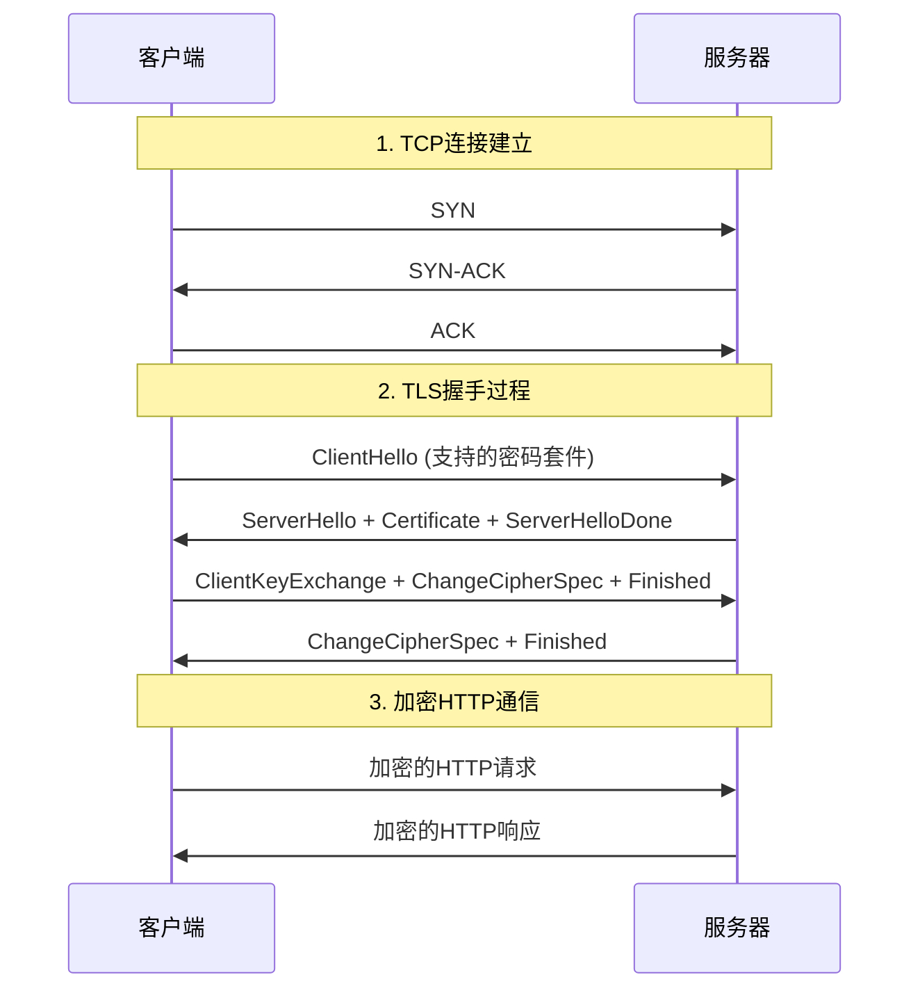

# 2.2 应用层：万维网和HTTP技术

## 目录

1. [万维网概述](#万维网概述)
2. [HTTP协议基础](#http协议基础)
3. [HTTP报文格式](#http报文格式)
4. [HTTPS协议详解](#https协议详解)
5. [HTTP协议演进](#http协议演进)
6. [Cookie技术](#cookie技术)
7. [Web缓存](#web缓存)
8. [Web API](#web-api)

---

## 万维网概述

> **万维网(World Wide Web, WWW)**
> 
> Web是一个因特网应用，它极大地增加了人们对因特网的兴趣。

### Web术语

- **Web页面**：由对象组成的文档
- **对象**：文件，如HTML文件、JPEG图像、Java小程序等
- **URL**：每个对象通过URL寻址
- **Web浏览器**：实现Web客户端的软件
- **Web服务器**：实现Web服务器端的软件

### URL格式

```
协议://主机名:端口/路径名
http://www.example.com:80/dir/page.html
```

**URL组成部分**：
- **协议**：http、https、ftp等
- **主机名**：域名或IP地址
- **端口**：可选，默认80(HTTP)或443(HTTPS)
- **路径名**：服务器上资源的位置

---

## HTTP协议基础

> **HTTP(HyperText Transfer Protocol)**
> 
> Web的应用层协议，是Web的核心。

### HTTP特点

- **客户-服务器体系结构**
- **使用TCP传输**：可靠数据传输
- **无状态协议**：服务器不维护客户的状态信息

### HTTP连接

#### 非持续连接

- 每个请求/响应对经一个单独的TCP连接发送
- HTTP/1.0使用非持续连接

#### 持续连接

- 多个请求/响应对经相同的TCP连接发送
- HTTP/1.1默认使用持续连接

**非持续连接的问题**：
1. 每个对象需要两个RTT（往返时间）
2. 操作系统需要为每个TCP连接分配资源
3. 浏览器通常打开并行TCP连接获取多个对象

---

## HTTP报文格式

### HTTP请求报文

**HTTP请求报文的通用格式**：
```
请求行
首部行
首部行
...
首部行
空行
实体主体
```

#### 请求行格式

```
方法 URL 版本
```

#### 典型HTTP请求报文

```http
GET /index.html HTTP/1.1
Host: www.example.com
Connection: close
User-Agent: Mozilla/5.0
Accept-Language: en-us

```

#### HTTP方法

- **GET**：请求对象
- **POST**：提交表单数据
- **PUT**：上传对象到指定路径
- **DELETE**：删除指定对象
- **HEAD**：类似GET，但服务器只返回首部
- **OPTIONS**：请求服务器告知支持的方法

### HTTP响应报文

**HTTP响应报文的通用格式**：
```
状态行
首部行
首部行
...
首部行
空行
实体主体
```

#### 状态行格式

```
版本 状态码 短语
```

#### 典型HTTP响应报文

```http
HTTP/1.1 200 OK
Connection: close
Date: Tue, 09 Aug 2022 15:44:04 GMT
Server: Apache/2.2.3 (CentOS)
Last-Modified: Tue, 09 Aug 2022 15:11:03 GMT
Content-Length: 6821
Content-Type: text/html

(data data data...)
```

### HTTP状态码

#### 1xx信息性状态码

- 100 Continue：客户应继续请求

#### 2xx成功状态码

- 200 OK：请求成功
- 201 Created：资源已创建
- 204 No Content：成功但无内容返回

#### 3xx重定向状态码

- 301 Moved Permanently：永久重定向
- 302 Found：临时重定向
- 304 Not Modified：资源未修改

#### 4xx客户端错误状态码

- 400 Bad Request：请求语法错误
- 401 Unauthorized：需要认证
- 403 Forbidden：服务器拒绝请求
- 404 Not Found：资源不存在

#### 5xx服务器错误状态码

- 500 Internal Server Error：服务器内部错误
- 502 Bad Gateway：网关错误
- 503 Service Unavailable：服务不可用

---

---

## HTTPS协议详解

> **HTTPS(HTTP Secure)**
> 
> 在HTTP基础上通过TLS/SSL协议提供加密通信的安全版本，是现代Web应用的标准。

### HTTP vs HTTPS详细对比

#### 基本区别

| 特性 | HTTP | HTTPS |
|------|------|-------|
| **全称** | HyperText Transfer Protocol | HTTP Secure / HTTP over TLS |
| **默认端口** | 80 | 443 |
| **安全性** | 明文传输，无加密 | TLS/SSL加密 |
| **数据完整性** | 无保障，可被篡改 | 消息认证码保护 |
| **身份认证** | 无服务器身份验证 | 数字证书验证服务器身份 |
| **性能开销** | 无加密开销 | 加密解密计算开销 |

#### 安全性对比

**HTTP安全风险**：
- **窃听攻击**：传输数据可被中间人截获并读取
- **篡改攻击**：数据在传输过程中可被恶意修改
- **伪装攻击**：无法验证服务器身份，容易受到钓鱼攻击
- **重放攻击**：恶意用户可重复发送截获的合法请求

**HTTPS安全保障**：
- **机密性**：使用对称加密保护数据内容
- **完整性**：使用消息认证码检测数据篡改
- **身份认证**：使用数字证书验证服务器身份
- **不可否认性**：数字签名提供操作证据

#### 性能对比分析

**连接建立时间**：
- **HTTP**：仅需TCP三次握手（1-RTT）
- **HTTPS**：需要TCP握手 + TLS握手（2-3 RTT）

**数据传输开销**：
- **HTTP**：无额外开销
- **HTTPS**：加密算法计算开销（现代硬件影响很小）

**现代HTTPS性能优化**：
- **会话复用**：减少握手开销
- **HTTP/2支持**：多路复用提升效率
- **硬件加速**：AES-NI指令集加速
- **TLS 1.3**：减少握手往返次数

### HTTPS工作原理

#### 完整的HTTPS通信流程



#### HTTPS连接建立详细步骤

**第1步：DNS解析和TCP连接**
```
1. DNS查询：www.example.com → 192.168.1.100
2. TCP连接：客户端:54321 → 服务器:443
3. 三次握手建立可靠连接
```

**第2步：TLS握手协商**
```
1. 客户端发送支持的加密算法列表
2. 服务器选择加密算法并发送数字证书
3. 客户端验证证书有效性
4. 双方协商生成会话密钥
5. 切换到加密通信模式
```

**第3步：HTTP数据传输**
```
1. 所有HTTP数据都经过对称加密
2. 每个数据包都有完整性保护
3. 服务器身份已通过证书验证
```

### HTTPS部署实践

#### 数字证书获取

**免费证书（Let's Encrypt）**：
```bash
# 使用certbot获取免费证书
sudo certbot --nginx -d www.example.com -d example.com

# 自动续期设置
echo "0 12 * * * /usr/bin/certbot renew --quiet" | sudo crontab -
```

**商业证书配置**：
```nginx
server {
    listen 443 ssl http2;
    server_name www.example.com;
    
    # SSL证书配置
    ssl_certificate /path/to/certificate.crt;
    ssl_certificate_key /path/to/private.key;
    ssl_trusted_certificate /path/to/ca-bundle.crt;
    
    # SSL安全配置
    ssl_protocols TLSv1.2 TLSv1.3;
    ssl_ciphers ECDHE+AESGCM:ECDHE+CHACHA20:DHE+AESGCM:DHE+CHACHA20:!aNULL:!MD5:!DSS;
    ssl_prefer_server_ciphers off;
    
    # HSTS安全头
    add_header Strict-Transport-Security "max-age=31536000; includeSubDomains" always;
}
```

#### HTTPS迁移策略

**步骤1：证书部署**
- 获取并安装SSL证书
- 配置Web服务器支持HTTPS
- 测试HTTPS连接正常工作

**步骤2：HTTP重定向**
```nginx
server {
    listen 80;
    server_name www.example.com;
    return 301 https://$server_name$request_uri;
}
```

**步骤3：安全头部配置**
```http
Strict-Transport-Security: max-age=31536000; includeSubDomains
Content-Security-Policy: upgrade-insecure-requests
```

#### 常见HTTPS配置问题

**混合内容警告**：
```html
<!-- 错误：HTTPS页面加载HTTP资源 -->


<!-- 正确：使用协议无关URL -->

```

**证书链不完整**：
```bash
# 检查证书链完整性
openssl s_client -connect www.example.com:443 -servername www.example.com

# 验证证书信息
openssl x509 -in certificate.crt -text -noout
```

### HTTPS性能优化技术

#### 连接优化

**HTTP/2启用**：
```nginx
listen 443 ssl http2;  # 启用HTTP/2
```

**会话缓存配置**：
```nginx
ssl_session_cache shared:SSL:10m;
ssl_session_timeout 1d;
ssl_session_tickets off;
```

#### 证书优化

**OCSP Stapling配置**：
```nginx
ssl_stapling on;
ssl_stapling_verify on;
ssl_trusted_certificate /path/to/ca-bundle.crt;
resolver 8.8.8.8 8.8.4.4 valid=300s;
```

**ECC证书使用**：
```bash
# 生成ECC私钥（比RSA更高效）
openssl ecparam -genkey -name prime256v1 -out ecc.key
openssl req -new -key ecc.key -out ecc.csr
```

---

## HTTP协议演进

### HTTP/2协议

> **HTTP/2**
> 
> HTTP协议的第二个主要版本，于2015年发布，旨在提高Web性能。

#### HTTP/2核心特性

1. **二进制协议**：
   - 使用二进制格式而非文本格式
   - 解析更高效，更紧凑
   - 减少解析错误

2. **多路复用(Multiplexing)**：
   - 单个TCP连接上并发处理多个请求/响应
   - 解决HTTP/1.1的队头阻塞问题
   - 消除域名分片的需要

3. **头部压缩(HPACK)**：
   - 使用HPACK算法压缩HTTP头部
   - 维护头部字段索引表
   - 显著减少头部开销

4. **服务器推送(Server Push)**：
   - 服务器主动向客户端推送资源
   - 减少往返次数
   - 改善页面加载性能

5. **流优先级(Stream Priority)**：
   - 客户端可以指定流的优先级
   - 重要资源优先传输
   - 改善用户体验

#### HTTP/2 vs HTTP/1.1性能对比

| 特性 | HTTP/1.1 | HTTP/2 |
|------|----------|--------|
| 连接复用 | 有限(6-8个) | 完全复用 |
| 队头阻塞 | 存在 | 解决 |
| 头部压缩 | 无 | HPACK |
| 服务器推送 | 无 | 支持 |
| 协议格式 | 文本 | 二进制 |

### HTTP/3协议

> **HTTP/3**
> 
> 基于QUIC传输协议的HTTP版本，解决了TCP层面的队头阻塞问题。

#### HTTP/3关键特性

1. **基于QUIC协议**：
   - 在UDP上实现可靠传输
   - 内置TLS 1.3加密
   - 连接迁移支持

2. **真正的多路复用**：
   - 流之间完全独立
   - 解决TCP队头阻塞
   - 单个流的丢包不影响其他流

3. **0-RTT连接建立**：
   - 利用之前的连接信息
   - 首次数据包即可携带应用数据
   - 显著降低连接延迟

4. **连接迁移**：
   - 支持IP地址变更后继续连接
   - 移动设备网络切换友好
   - 使用连接ID而非IP+端口

#### HTTP/3部署现状

**浏览器支持**：
- Chrome、Firefox、Safari、Edge全面支持
- 移动浏览器广泛支持
- 市场覆盖率超过95%（2024年）

**服务器端支持**：
- Cloudflare、Google、Facebook全面部署
- Nginx、Apache、LiteSpeed支持
- CDN提供商广泛采用

**性能提升**：
- 页面加载速度提升15-25%
- 移动网络环境下效果更明显
- 降低连接建立延迟50%以上

#### HTTP版本对比

| 特性 | HTTP/1.1 | HTTP/2 | HTTP/3 |
|------|----------|---------|---------|
| 传输层 | TCP | TCP | QUIC(UDP) |
| 多路复用 | 否 | 是 | 是 |
| 队头阻塞 | 应用层+传输层 | 传输层 | 无 |
| 连接建立 | 3次握手 | 3次握手+TLS | 1-RTT/0-RTT |
| 安全性 | 可选TLS | 可选TLS | 强制TLS |

### WebSocket协议

> **WebSocket**
> 
> 在单个TCP连接上提供全双工通信的应用层协议，适用于实时Web应用。

#### WebSocket特点

- **全双工通信**：客户端和服务器可以随时互相发送数据
- **持久连接**：建立连接后保持开放状态
- **低开销**：无需HTTP请求/响应头部
- **实时性**：适合聊天、游戏、实时数据推送

#### WebSocket握手过程

1. **客户端发起握手**：
```http
GET /chat HTTP/1.1
Host: example.com:8000
Upgrade: websocket
Connection: Upgrade
Sec-WebSocket-Key: dGhlIHNhbXBsZSBub25jZQ==
Sec-WebSocket-Version: 13
```

2. **服务器响应**：
```http
HTTP/1.1 101 Switching Protocols
Upgrade: websocket
Connection: Upgrade
Sec-WebSocket-Accept: s3pPLMBiTxaQ9kYGzzhZRbK+xOo=
```

#### WebSocket应用场景

- **在线聊天应用**：微信网页版、QQ空间
- **实时协作工具**：Google Docs、腾讯文档
- **在线游戏**：实时多人游戏
- **金融交易**：股价实时推送
- **监控仪表板**：系统状态实时显示

---

## Cookie技术

HTTP是无状态协议，但许多Web站点希望识别用户。Cookie技术解决了这个问题。

> **Cookie技术组成**
> 
> 1. HTTP响应报文中的cookie首部行
> 2. HTTP请求报文中的cookie首部行
> 3. 用户端系统中保留的cookie文件
> 4. Web站点的后端数据库

### Cookie工作过程

1. **首次访问**：
   ```http
   GET /index.html HTTP/1.1
   Host: www.amazon.com
   ```

2. **服务器响应**：
   ```http
   HTTP/1.1 200 OK
   Content-Type: text/html
   Set-Cookie: id=1678
   
   (content)
   ```

3. **后续请求**：
   ```http
   GET /book.html HTTP/1.1
   Host: www.amazon.com
   Cookie: id=1678
   ```

### Cookie应用

- 用户会话状态维护
- 购物车信息
- 用户偏好设置
- 用户行为跟踪

### Cookie安全和隐私

**安全属性**：
- **Secure**：仅通过HTTPS传输
- **HttpOnly**：防止JavaScript访问
- **SameSite**：控制跨站请求

**隐私问题**：
- 用户可能被跟踪
- 敏感信息可能泄露
- 需要隐私政策说明

---

## Web缓存

> **Web缓存(Web Cache)/代理服务器(Proxy Server)**
> 
> 代表原始Web服务器来满足HTTP请求的网络实体。

### Web缓存工作过程

1. 浏览器与Web缓存建立TCP连接
2. 浏览器向Web缓存发送HTTP请求
3. Web缓存检查本地是否有请求对象的副本
4. 如果有，Web缓存向浏览器返回对象
5. 如果没有，Web缓存打开与原始服务器的TCP连接，请求对象
6. Web缓存接收对象后，存储副本并向浏览器发送副本

### Web缓存优点

- **减少客户请求的响应时间**
- **大大减少机构接入链路上的Web流量**
- **互联网拥有大量缓存，可以减少Web流量**

### 条件GET

为确保缓存对象是最新的，HTTP有条件GET机制：

```http
GET /fruit/kiwi.gif HTTP/1.1
Host: www.exotiquecuisine.com
If-modified-since: Wed, 7 Sep 2022 09:23:24
```

如果对象未修改，服务器返回：
```http
HTTP/1.1 304 Not Modified
Date: Sat, 10 Sep 2022 15:39:29
Server: Apache/1.3.0 (Unix)

(empty entity body)
```

---

## Web API

### Server-Sent Events (SSE)

> **SSE**
> 
> 允许服务器向网页推送数据的技术，比WebSocket简单但只支持单向通信。

#### SSE特点

- **单向通信**：仅服务器到客户端
- **基于HTTP**：使用普通HTTP连接
- **自动重连**：连接断开后自动重连
- **事件流格式**：简单的文本格式

#### SSE示例

```javascript
// 客户端
const eventSource = new EventSource('/events');
eventSource.onmessage = function(event) {
    console.log('Received: ', event.data);
};

// 服务器响应格式
data: {"message": "Hello World"}

data: {"timestamp": "2023-12-01T10:00:00Z"}

```

### Fetch API

**HTTP请求API**：
```javascript
fetch('/api/data', {
    method: 'POST',
    headers: {
        'Content-Type': 'application/json',
    },
    body: JSON.stringify({key: 'value'})
})
.then(response => response.json())
.then(data => console.log(data));
```

### Service Workers

**离线Web应用支持**：
- 缓存管理
- 后台同步
- 推送通知
- 网络代理
 
---
 
**[下一节：2.3 电子邮件系统](2.3应用层：电子邮件系统.md)**
