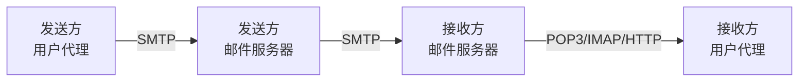
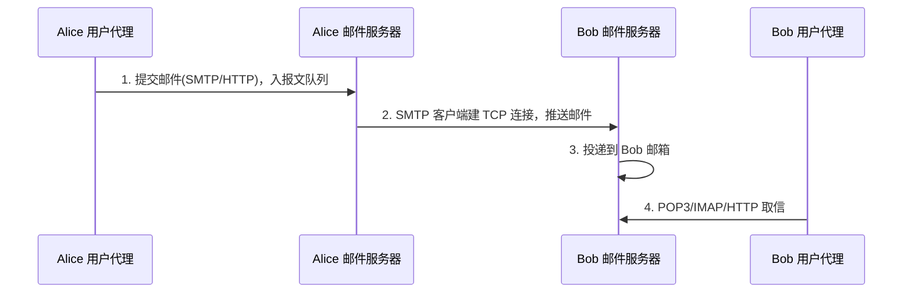
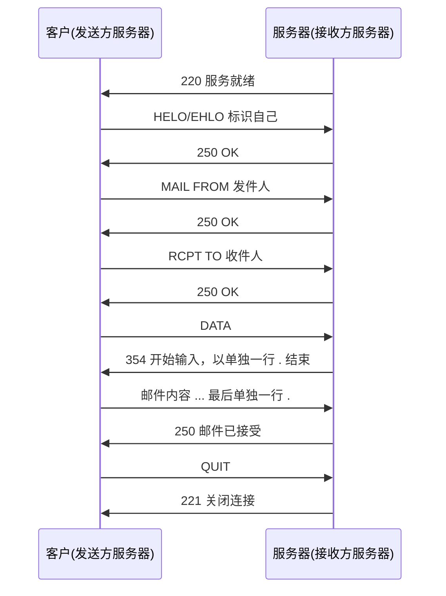
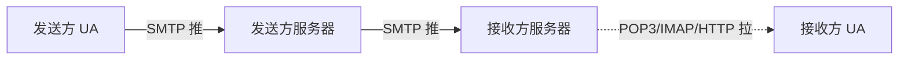

# 2.3 应用层：电子邮件系统

## 目录

1. [电子邮件系统概述](#电子邮件系统概述)
2. [SMTP协议](#smtp协议)
3. [邮件报文格式](#邮件报文格式)
4. [邮件访问协议](#邮件访问协议)
5. [邮件安全](#邮件安全)

---

## 电子邮件系统概述

电子邮件系统有三个核心组成部分：

> 1. **用户代理(User Agent, UA)**：用户编写、阅读、回复、转发、保存邮件的客户端
> 2. **邮件服务器(Mail Server)**：系统核心，维护用户邮箱并在服务器之间转发邮件
> 3. **SMTP(Simple Mail Transfer Protocol)**：服务器之间传送邮件的应用层协议



> 注：服务器之间一律用 SMTP（推），收信方从自己服务器取信则用 POP3/IMAP（拉）或 Web 邮件的 HTTP。

### 用户代理

负责编写、阅读、回复转发、管理（文件夹、搜索）邮件。常见形式：

- 桌面客户端：Outlook、Thunderbird、Apple Mail
- Web 邮件：Gmail、Outlook.com、网易邮箱
- 移动客户端：iPhone Mail、Android Gmail

### 邮件服务器

每个收信人在邮件服务器上有一个**邮箱(mailbox)**。服务器对外承担两件事：

- **邮箱**：存储、管理用户收到的邮件
- **报文队列(message queue)**：暂存等待发出的邮件，连接失败时反复重试

服务器内部常拆为两类组件：

- **MTA(Mail Transfer Agent)**：邮件传输代理，与其他服务器之间用 SMTP 收发邮件（如 Sendmail、Postfix）
- **MDA(Mail Delivery Agent)**：邮件投递代理，把 MTA 收下的邮件投递到本地用户邮箱

### 典型邮件发送过程

Alice 给 Bob 发邮件，端到端要经过下面几步：



1. Alice 用用户代理写好邮件，填上 Bob 的地址，提交到自己的邮件服务器，邮件进入报文队列
2. Alice 服务器上的 SMTP 客户端取出队列中的邮件，建立到 Bob 服务器（25 端口）的 TCP 连接并推送
3. Bob 服务器收下后将邮件放入 Bob 的邮箱
4. Bob 用用户代理通过 POP3/IMAP/HTTP 从自己的服务器取信阅读

> 注：第 1 步若 Bob 服务器暂时不可达，邮件会留在 Alice 服务器的报文队列里反复重试，并非立刻退信。

---

## SMTP协议

> **SMTP(Simple Mail Transfer Protocol)**
> 
> 因特网电子邮件的主要应用层协议，基于 TCP 提供可靠传输，定义于 RFC 5321。

### SMTP特点

- **推协议(push)**：由发送方服务器主动把邮件推向接收方服务器（对比 HTTP 主要是拉）
- **7 位 ASCII**：早期 SMTP 命令与报文都限定为 7 位 ASCII；非 ASCII 内容靠 MIME 编码后再传
- **持续连接**：同一条 TCP 连接上可连续发送多封邮件
- **直接交付**：尽量在发送方与接收方服务器之间直接建立连接，不经中间服务器中转

**端口**：

| 端口 | 用途 |
|------|------|
| 25 | 服务器之间（MTA→MTA）转发邮件 |
| 587 | 用户代理向服务器提交邮件（Submission，配合 STARTTLS 认证） |
| 465 | 用户代理提交邮件，连接建立即用 TLS（SMTPS） |

> 易混：25 端口是「服务器到服务器」的转发口；用户代理寄信时用的是 587/465 提交口（需认证）。教材常笼统说「SMTP 用 25 端口」，指的是服务器间转发那一段。

### SMTP工作过程

一次 SMTP 会话依次经过握手、传送、关闭三个阶段：



#### SMTP会话示例

```
S: 220 hamburger.edu
C: HELO crepes.fr
S: 250 Hello crepes.fr, pleased to meet you
C: MAIL FROM: <alice@crepes.fr>
S: 250 alice@crepes.fr... Sender ok
C: RCPT TO: <bob@hamburger.edu>
S: 250 bob@hamburger.edu ... Recipient ok
C: DATA
S: 354 Enter mail, end with "." on a line by itself
C: Do you like ketchup?
C: How about pickles?
C: .
S: 250 Message accepted for delivery
C: QUIT
S: 221 hamburger.edu closing connection
```

> 注：邮件正文以「单独一行只有一个句点 `.`」表示结束。若正文本身某行以 `.` 开头，发送端会把它转义成 `..`（点填充），避免被误判为结束符。

#### SMTP命令

- **HELO**：客户向服务器标识自己
- **EHLO**：扩展HELO，支持SMTP扩展
- **MAIL FROM**：指明邮件发送者
- **RCPT TO**：指明邮件接收者
- **DATA**：发送邮件数据
- **RSET**：重置会话
- **QUIT**：结束会话

#### SMTP响应码

- **2xx**：成功
  - 250：请求成功
  - 251：用户非本地，将转发

- **3xx**：需要更多信息
  - 354：开始邮件输入

- **4xx**：临时错误
  - 421：服务不可用
  - 450：邮箱忙

- **5xx**：永久错误
  - 500：命令语法错误
  - 550：邮箱不存在

### SMTP扩展

#### ESMTP (Extended SMTP)

**主要扩展**：
- **AUTH**：SMTP认证
- **STARTTLS**：传输层安全
- **SIZE**：邮件大小限制
- **8BITMIME**：8位MIME传输

**EHLO响应示例**：
```
250-mail.example.com Hello client.example.org
250-SIZE 52428800
250-8BITMIME
250-AUTH PLAIN LOGIN
250 STARTTLS
```

> 注：多行响应里前几行用 `250-`（带连字符）表示「后面还有行」，最后一行用 `250 `（带空格）表示结束。客户端据此知道服务器支持哪些扩展。

---

## 邮件报文格式

### RFC 5322标准

邮件报文分为首部和主体两部分，中间用一个空行隔开。注意区分两套格式：**信封(envelope)**由 SMTP 的 `MAIL FROM`/`RCPT TO` 决定实际投递路径；**报文首部**（`From`/`To` 等）是给人看的内容，二者可以不一致（垃圾邮件常借此伪造发件人）。

```
首部行(From、To、Subject ...)
<空行>
主体(邮件正文)
```

#### 典型邮件报文

```
From: alice@crepes.fr
To: bob@hamburger.edu
Subject: Searching for the meaning of life
Date: Mon, 07 Feb 2022 15:43:25 -0500
Message-ID: <1234@crepes.fr>

I think the answer is 42.
```

#### 重要首部行

- **From**：发送者邮箱地址
- **To**：接收者邮箱地址
- **Cc**：抄送
- **Bcc**：密送（首部中不显示）
- **Subject**：邮件主题
- **Date**：发送日期和时间
- **Message-ID**：邮件唯一标识符
- **Reply-To**：回复地址
- **Return-Path**：退信路径

### MIME扩展

> **MIME(Multipurpose Internet Mail Extensions)**
> 
> SMTP 只能传 7 位 ASCII，MIME 通过新增首部和编码规则，让邮件能携带非 ASCII 文本、图像、音频、视频和附件。

MIME 不改变 SMTP，而是在报文首部里声明内容类型与编码方式，再把二进制内容编码成 ASCII 后塞进主体。一封带附件的邮件结构大致如下：

```
报文首部
├─ MIME-Version: 1.0
├─ Content-Type: multipart/mixed; boundary="xxx"
│
└─ 主体（被 boundary 分成多段）
   ├─ 段1  text/plain        正文文本
   ├─ 段2  text/html         HTML 正文（与段1构成 alternative 时二选一显示）
   └─ 段3  image/jpeg + base64  图片附件
```

#### MIME首部

- **MIME-Version**：MIME版本
- **Content-Type**：内容类型
- **Content-Transfer-Encoding**：编码方式
- **Content-Disposition**：处置方式

#### 常见Content-Type

**文本类型**：
- text/plain：纯文本
- text/html：HTML文本
- text/csv：CSV文件

**多媒体类型**：
- image/jpeg：JPEG图像
- image/png：PNG图像
- audio/mpeg：MP3音频
- video/mp4：MP4视频

**应用程序类型**：
- application/pdf：PDF文档
- application/zip：ZIP压缩包
- application/json：JSON数据

#### 多部分邮件示例

```
MIME-Version: 1.0
Content-Type: multipart/mixed; boundary="boundary123"

--boundary123
Content-Type: text/plain

Hello, this is the text part.

--boundary123
Content-Type: image/jpeg
Content-Transfer-Encoding: base64

[base64编码的图像数据]
--boundary123--
```

#### 编码方式

**Content-Transfer-Encoding**：
- **7bit**：7位ASCII
- **8bit**：8位字符
- **binary**：二进制数据
- **base64**：Base64编码
- **quoted-printable**：可打印字符编码

---

## 邮件访问协议

为什么收信不用 SMTP？因为 SMTP 是**推**协议，要求发起方主动把邮件推到对方服务器。而收信人的服务器一直开机、收信人的机器却可能关机或在内网，没法被主动推送。所以最后一段「从自己的服务器取信」要用**拉**协议——POP3、IMAP，或 Web 邮件的 HTTP。



> 关键区分：实线（SMTP）是推，由发送端发起；虚线是拉，由收信端发起。整条链路上只有最后一段是拉。

### POP3协议

> **POP3(Post Office Protocol Version 3)**
> 
> 简单的邮件访问协议，定义于 RFC 1939，明文默认用 110 端口，加密（POP3S）用 995 端口。功能少但实现简单。

#### POP3工作阶段

1. **认证阶段**：用户代理发送用户名和密码
2. **事务处理阶段**：用户代理取回邮件，标记删除等
3. **更新阶段**：结束POP3会话后，邮件服务器删除标记的邮件

#### POP3会话示例

```
C: telnet mailServer 110
S: +OK POP3 server ready
C: user bob
S: +OK
C: pass hungry
S: +OK user successfully logged on
C: list
S: +OK 2 messages (320 octets)
S: 1 120
S: 2 200
S: .
C: retr 1
S: +OK 120 octets
S: <the POP3 server sends the message>
S: .
C: dele 1
S: +OK message 1 deleted
C: quit
S: +OK POP3 server signing off
```

#### POP3命令

**认证阶段**：
- **USER**：用户名
- **PASS**：密码

**事务处理阶段**：
- **LIST**：列出邮件
- **RETR**：检索邮件
- **DELE**：删除标记
- **STAT**：状态信息
- **TOP**：获取邮件头部

#### POP3特点

- 两种工作方式：**下载并删除**（取走后服务器删信，换设备就看不到旧邮件）、**下载并保留**（取走后服务器保留副本）
- 服务器**跨会话不保存状态**：每次会话内用 DELE 标记的删除会在更新阶段生效，但用户自定义的文件夹、已读标记等不会留在服务器上
- 不支持服务器端文件夹分类，适合单设备使用

### IMAP协议

> **IMAP(Internet Mail Access Protocol)**
> 
> 功能更强的邮件访问协议，定义于 RFC 3501，明文默认 143 端口，加密（IMAPS）用 993 端口。邮件始终保存在服务器上，支持远程管理。

#### IMAP特点

- **邮件保存在服务器**：允许多设备访问
- **支持文件夹**：用户可以组织邮件
- **部分获取**：可以只获取邮件首部或部分内容
- **搜索功能**：可以在服务器端搜索邮件
- **状态维护**：跨会话维护用户状态
- **离线同步**：支持离线操作和同步

#### IMAP命令示例

```
C: A001 LOGIN alice secret
S: A001 OK LOGIN completed
C: A002 SELECT INBOX
S: A002 OK SELECT completed
C: A003 SEARCH FROM "bob@example.com"
S: * SEARCH 2 84 882
S: A003 OK SEARCH completed
C: A004 FETCH 2 (FLAGS BODY[HEADER.FIELDS (DATE FROM)])
S: * 2 FETCH (FLAGS (\Seen) BODY[HEADER.FIELDS...
S: A004 OK FETCH completed
```

#### IMAP vs POP3对比

| 特性 | POP3 | IMAP |
|------|------|------|
| 默认端口 | 110 / 995(TLS) | 143 / 993(TLS) |
| 邮件主存储 | 取后默认在本地 | 始终在服务器 |
| 多设备同步 | 困难（各设备状态不一致） | 支持（已读、文件夹全设备一致） |
| 服务器端文件夹 | 不支持 | 支持 |
| 搜索 | 本地搜索已下载邮件 | 可在服务器端搜索全部邮件 |
| 按需获取 | 整封下载 | 可只取首部或某个 MIME 段 |
| 服务器存储占用 | 低（可删除） | 高（长期保留） |

> 注：POP3 适合「下载到本地、节省服务器空间」的单设备场景；IMAP 适合多设备同步。现代邮箱基本都用 IMAP 或 Web 邮件。

### 基于Web的电子邮件

Gmail、Outlook.com 等 Web 邮件，用户代理就是浏览器：

- 收信人浏览器与自己的邮件服务器之间用 **HTTP/HTTPS** 收发（取代了 POP3/IMAP，也用于提交邮件）
- 邮件服务器之间转发邮件**仍然用 SMTP**

也就是说，Web 邮件只是把「用户↔服务器」这一段换成了 HTTP，服务器之间的那段没有变。优点是跨平台、免装客户端、免维护。

---

## 邮件安全

SMTP 设计之初没有认证和加密，任何人都能伪造 `From`、明文窃听邮件内容。现代邮件安全主要从三个方向补救：发件人身份认证、传输/内容加密、垃圾邮件过滤。

### 发件人认证：SPF / DKIM / DMARC

三者层层配合，用来判断「这封邮件是不是真的由该域名授权发出」：

| 机制 | 验证什么 | 怎么做 |
|------|---------|--------|
| SPF | 发信 IP 是否被该域名授权 | 域名在 DNS 发布授权服务器列表，接收方比对发信 IP |
| DKIM | 邮件内容是否被篡改、是否来自该域名 | 发送方用私钥对邮件签名，接收方用 DNS 中的公钥验签 |
| DMARC | 在 SPF/DKIM 基础上做策略与对齐 | 规定验证失败时的处理（放行/隔离/拒收）并回送报告 |

**SPF 记录示例**（发布在 DNS TXT 记录中）：

```
v=spf1 ip4:192.168.1.1 include:_spf.google.com ~all
```

> 注：SPF 检查的是信封发件域，DKIM 检查的是签名与内容完整性，DMARC 再要求二者与报文 `From` 域「对齐」，三者合起来才能较好地防伪造。

### 邮件加密

- **传输加密**：STARTTLS 在已建立的 SMTP/IMAP/POP3 连接上升级为 TLS，加密传输过程；只能保护「这一跳」，服务器上仍是明文
- **端到端加密**：PGP/GPG、S/MIME 对邮件正文本身加密签名，全程只有收发双方能解密，服务器也看不到明文

### 垃圾邮件与病毒防护

- **内容过滤**：关键词、贝叶斯过滤、机器学习模型判别垃圾邮件
- **发件人信誉**：结合 SPF/DKIM/DMARC 与 IP/域名黑名单（RBL，Realtime Blackhole List）
- **附件安全**：附件病毒扫描、可疑链接检测、沙箱中预执行附件

---
 

**[下一节：2.4 DNS域名系统](2.4应用层：DNS域名系统.md)**
