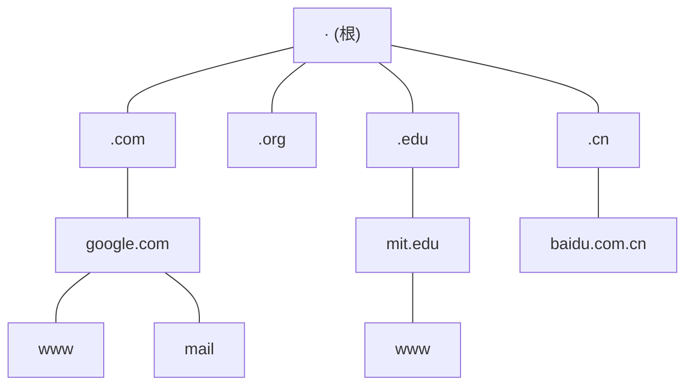
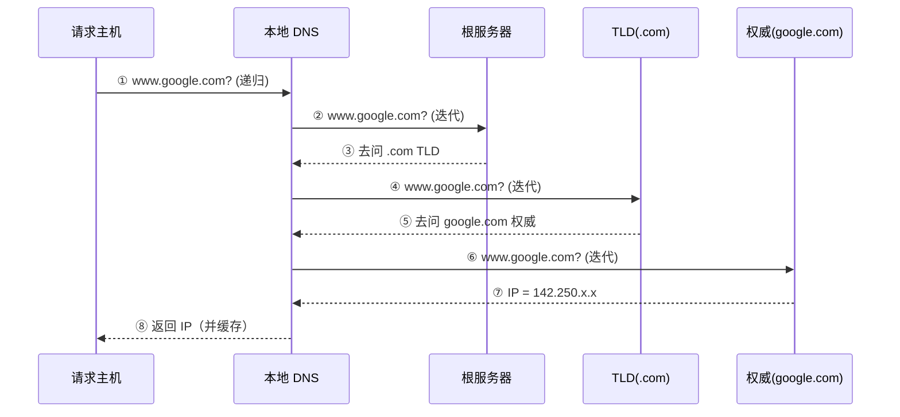

# 2.4 应用层：DNS域名系统

## 目录

1. [DNS概述](#dns概述)
2. [DNS层次结构](#dns层次结构)
3. [DNS工作原理](#dns工作原理)
4. [DNS资源记录](#dns资源记录)
5. [DNS查询过程](#dns查询过程)
6. [DNS缓存机制](#dns缓存机制)
7. [现代DNS技术](#现代dns技术)

---

## DNS概述

> **DNS(Domain Name System)**
> 
> 一个由分层 DNS 服务器实现的分布式数据库，以及一个让主机查询该数据库的应用层协议。核心功能是把主机名翻译成 IP 地址。

DNS 协议运行在 **UDP 之上，使用 53 端口**（响应过大或区域传送时退回 TCP），它本身不被用户直接调用，而是被 HTTP、SMTP 等应用"在幕后"调用：浏览器要访问 `www.google.com`，得先让 DNS 把它解析成 IP，TCP 才知道该和谁建立连接。

### 为什么需要 DNS

人和机器对"地址"的偏好不同：

- 人习惯记主机名，如 `www.google.com`
- 路由器只认定长的 IP 地址，如 `142.250.191.14`

DNS 就是夹在两者之间做转换的目录服务。

### DNS提供的服务

1. **主机名到 IP 地址转换**：最基本的服务
2. **主机别名**：把冗长的规范主机名映射到好记的别名（CNAME）
3. **邮件服务器别名**：通过 MX 记录定位某个域的邮件服务器
4. **负载分配**：同一主机名对应一组 IP，DNS 轮转返回不同次序，把请求分摊到多台服务器

### 为什么用分布式设计而不是单一服务器

集中式 DNS 看似简单，但有四个致命问题：单点故障、流量瓶颈、查询路径远（全球用户都访问一台机器）、难以维护。因此 DNS 采用分布式 + 分层设计，把数据和负载分散到大量服务器上。

服务器分四类（前三类构成层次结构）：根、顶级域(TLD)、权威，外加不在层次内、由 ISP 提供的本地 DNS 服务器。

---

## DNS层次结构

### 域名空间结构

域名空间是一棵倒挂的树，根在最上，越往下越具体：



### 域名组成

一个**完全限定域名(FQDN)**从右往左逐级展开：根 → 顶级域 → 二级域 → 子域。

```
www . google . com . 
 │      │       │   └─ 根域（通常省略的那个点）
 │      │       └───── 顶级域 TLD
 │      └───────────── 二级域
 └──────────────────── 主机名/子域
```

- **根域**：一个点 `.`，平时书写时省略
- **顶级域**：`.com`、`.org`、`.cn` 等
- **二级域**：`google.com`、`mit.edu`
- **子域/主机**：`www.google.com`、`mail.google.com`

### DNS服务器层次

#### 根 DNS 服务器

逻辑上有 **13 个根服务器（标识 A 到 M）**，但每个都不是单台机器，而是一个用 Anycast 技术对外提供同一 IP 的服务器集群，全球部署上千个实例。

根服务器是查询的起点，它不直接给出最终 IP，只负责告诉你"去找哪个 TLD 服务器"。

#### 顶级域(TLD) DNS 服务器

负责各顶级域，返回权威服务器的地址。常见分两类：

- **gTLD（通用顶级域）**：`.com`、`.org`、`.net`、`.edu` 等
- **ccTLD（国家代码顶级域）**：`.cn`、`.us`、`.uk`、`.jp` 等

如 `.com` 由 Verisign 管理，各 ccTLD 由对应国家/地区机构管理。

#### 权威 DNS 服务器

存放某个组织自有主机的 DNS 记录，对这些域名"说了算"，给出最终解析结果。一个组织可以自建，也可以托管给服务商。通常配主、从两台（从服务器从主服务器同步数据）以保证可用性。

#### 本地 DNS 服务器

严格说不属于上面的层次结构，但极其关键。每个 ISP 都有一台，主机的 DNS 配置（DHCP 下发或手工设置）指向它。它的角色是**递归解析器**：代替主机去层次结构里跑完整个查询，把结果带回来，并缓存下来供后续复用。

---

## DNS工作原理

### 查询类型：递归 vs 迭代

一次完整解析往往混用两种查询方式，区别在于"谁负责接着往下问"：

- **递归查询**：被问的服务器自己想办法拿到最终答案再返回，请求方只管等结果。
- **迭代查询**：被问的服务器若不知道答案，就回一句"你去问它"，把下一跳服务器地址告诉请求方，由请求方继续问。

实际中最常见的组合是：**主机到本地 DNS 用递归**（主机懒，把活全交给本地服务器），**本地 DNS 到其余各级用迭代**（本地服务器自己一级一级地问）。



> 上图共 8 次报文往返。原则上每一级都可以是递归或迭代，是否接受递归取决于服务器配置（首部里的 RD/RA 标志）。若本地 DNS 也对各级发起递归，则递归负担会层层下压，根服务器通常拒绝，所以现实中根/TLD 基本只支持迭代。

### DNS报文格式

查询报文和响应报文用同一种格式，由 5 个区段组成（首部 12 字节固定，其余区段长度可变）：

```
 0                   1                   2                   3
 0 1 2 3 4 5 6 7 8 9 0 1 2 3 4 5 6 7 8 9 0 1 2 3 4 5 6 7 8 9 0 1
+-+-+-+-+-+-+-+-+-+-+-+-+-+-+-+-+-+-+-+-+-+-+-+-+-+-+-+-+-+-+-+-+
|                      ID (标识符, 16位)                        |
+-+-+-+-+-+-+-+-+-+-+-+-+-+-+-+-+-+-+-+-+-+-+-+-+-+-+-+-+-+-+-+-+
|QR| Opcode  |AA|TC|RD|RA|  Z  |   RCODE   |   ← 标志字段 (16位) |
+-+-+-+-+-+-+-+-+-+-+-+-+-+-+-+-+-+-+-+-+-+-+-+-+-+-+-+-+-+-+-+-+
|         QDCOUNT (问题数)       |        ANCOUNT (回答数)       |
+-+-+-+-+-+-+-+-+-+-+-+-+-+-+-+-+-+-+-+-+-+-+-+-+-+-+-+-+-+-+-+-+
|        NSCOUNT (权威数)        |       ARCOUNT (附加数)        |
+-+-+-+-+-+-+-+-+-+-+-+-+-+-+-+-+-+-+-+-+-+-+-+-+-+-+-+-+-+-+-+-+
|                     Question  (问题区)                         |
+-+-+-+-+-+-+-+-+-+-+-+-+-+-+-+-+-+-+-+-+-+-+-+-+-+-+-+-+-+-+-+-+
|                     Answer  (回答区，RR)                       |
+-+-+-+-+-+-+-+-+-+-+-+-+-+-+-+-+-+-+-+-+-+-+-+-+-+-+-+-+-+-+-+-+
|                     Authority  (权威区，RR)                    |
+-+-+-+-+-+-+-+-+-+-+-+-+-+-+-+-+-+-+-+-+-+-+-+-+-+-+-+-+-+-+-+-+
|                     Additional  (附加区，RR)                   |
+-+-+-+-+-+-+-+-+-+-+-+-+-+-+-+-+-+-+-+-+-+-+-+-+-+-+-+-+-+-+-+-+
```

#### 首部字段（12 字节）

- **ID(16位)**：查询标识符，响应用同一 ID 与请求配对
- **标志字段(16位)**：包含若干控制位
  - **QR(1位)**：0=查询，1=响应
  - **Opcode(4位)**：操作类型（标准查询为 0）
  - **AA(1位)**：权威回答（响应来自权威服务器）
  - **TC(1位)**：截断标志（报文超长被截断，需改用 TCP）
  - **RD(1位)**：期望递归（请求方希望对方递归解析）
  - **RA(1位)**：递归可用（对方是否支持递归）
  - **Z(3位)**：保留
  - **RCODE(4位)**：响应码（0=无错，3=域名不存在 NXDOMAIN 等）
- **计数字段**：QDCOUNT/ANCOUNT/NSCOUNT/ARCOUNT 分别表示问题、回答、权威、附加四个区段各有几条记录

> 注：附加区常用来"搭便车"返回有用数据。例如 TLD 在权威区给出某域的 NS 名字时，会在附加区直接附上这些 NS 主机的 A 记录，省掉请求方再解析一次的开销。

---

## DNS资源记录

> **DNS资源记录(Resource Record, RR)**
> 
> DNS 数据库里存储的基本数据单位。Kurose 书中抽象为四元组 **(Name, Value, Type, TTL)**，Name 和 Value 的含义随 Type 而变。

### 记录格式

实际区文件里的一行记录写作：

```
Name    TTL    Class    Type    Value
```

- **Name**：域名
- **TTL**：生存时间，记录可被缓存的秒数
- **Class**：类别，互联网记录恒为 `IN`
- **Type**：记录类型，决定 Name/Value 怎么解读
- **Value**：记录值

### 常见记录类型一览

| Type  | Name 是什么 | Value 是什么 | 用途 |
|-------|-----------|------------|------|
| A     | 主机名     | IPv4 地址   | 主机名 → IPv4 |
| AAAA  | 主机名     | IPv6 地址   | 主机名 → IPv6 |
| NS    | 域名       | 该域权威服务器的主机名 | 把子域委派给权威服务器 |
| CNAME | 别名       | 规范主机名   | 给主机名起别名 |
| MX    | 域名       | 邮件服务器主机名（带优先级） | 定位收邮件的服务器 |
| PTR   | 反向域名    | 主机名      | IP → 主机名（反向解析） |
| TXT   | 域名       | 任意文本     | SPF/DMARC/域名验证等 |
| SOA   | 域名       | 区的管理参数  | 区的起始授权信息 |

下面逐个看。

#### A记录

**作用**：将主机名映射到IPv4地址

**示例**：
```
www.example.com.    300    IN    A    192.168.1.1
```

#### AAAA记录

**作用**：将主机名映射到IPv6地址

**示例**：
```
www.example.com.    300    IN    AAAA    2001:db8::1
```

#### CNAME记录

**作用**：把一个别名指向规范主机名，解析时会继续解析规范名

**示例**：
```
www.example.com.    300    IN    CNAME    example.com.
```

> 易混：CNAME 与 A 的区别。A 直接给 IP；CNAME 给的是另一个名字，解析器拿到后还要再去查那个名字的 A 记录。
>
> 注：一个名字上有了 CNAME，就不能再有其他类型的记录（这也是根域名 `example.com` 通常不能用 CNAME 的原因）。

#### MX记录

**作用**：指定域的邮件服务器

**示例**：
```
example.com.    300    IN    MX    10    mail.example.com.
example.com.    300    IN    MX    20    backup-mail.example.com.
```

**优先级**：数字越小优先级越高

#### NS记录

**作用**：指定域的权威名称服务器

**示例**：
```
example.com.    300    IN    NS    ns1.example.com.
example.com.    300    IN    NS    ns2.example.com.
```

#### PTR记录

**作用**：反向DNS查询，从IP地址查询主机名

**示例**：
```
1.1.168.192.in-addr.arpa.    300    IN    PTR    www.example.com.
```

#### TXT记录

**作用**：存储任意文本信息

**应用**：
- SPF记录：邮件发送授权
- DMARC记录：邮件认证策略
- 域名所有权验证

**示例**：
```
example.com.    300    IN    TXT    "v=spf1 include:_spf.google.com ~all"
```

#### SOA记录

**作用**：域的起始授权记录

**包含信息**：
- 主名称服务器
- 管理员邮箱
- 序列号
- 刷新间隔
- 重试间隔
- 过期时间
- 最小TTL

**示例**：
```
example.com. IN SOA ns1.example.com. admin.example.com. (
    2023120101 ; 序列号
    3600       ; 刷新间隔（1小时）
    1800       ; 重试间隔（30分钟）
    1209600    ; 过期时间（2周）
    86400      ; 最小TTL（1天）
)
```

---

## DNS查询过程

完整的迭代/递归过程见前文 [递归 vs 迭代](#查询类型递归-vs-迭代) 的时序图，这里补充主机侧的一个细节：浏览器并不是一上来就发 DNS 请求，而是先查一连串本地缓存，全都未命中才走网络。

### 客户端解析顺序

以解析 `www.example.com` 为例，请求依次经过：

```
浏览器 DNS 缓存  →  操作系统缓存  →  hosts 文件  →  本地 DNS 服务器
   (命中即返回)      (命中即返回)     (命中即返回)      (发起网络查询)
```

只要前面任一级命中就直接返回，不再继续。本地 DNS 拿到结果后会缓存并回送给主机，主机的 OS 和浏览器也会按 TTL 各自缓存一份。

---

## DNS缓存机制

缓存是 DNS 性能的关键：一条记录只要被某层缓存，后续相同查询就无需再走完整链路，既快又省了根/TLD 服务器的负载。任意一级服务器都可以缓存它学到的映射。

### 缓存层次

从主机到 ISP，DNS 记录被层层缓存：

| 层次 | 范围 | 特点 |
|------|------|------|
| 浏览器缓存 | 单个浏览器 | TTL 很短，清浏览器数据即清空 |
| 操作系统缓存 | 整机所有应用共享 | 重启或刷新 DNS 缓存时清空 |
| 本地 DNS 缓存 | ISP，服务大量用户 | 按 TTL 管理，命中率最高 |

> 注：因为缓存的存在，根服务器实际很少被访问——`.com`、`.cn` 这类热门 TLD 的地址几乎一直躺在本地 DNS 的缓存里。

### TTL机制

> **TTL(Time To Live)**
> 
> 记录可被缓存的时长（秒）。缓存到期后该记录被丢弃，下次查询重新解析。

TTL 是"新鲜度 vs 查询量"的权衡：

- **短 TTL**：改 IP 后能很快生效，但查询频繁
- **长 TTL**：查询少、负载低，但记录变更要等缓存过期才生效

典型取值：A 记录 300\~3600 秒，NS 记录则常设到一两天。

### 缓存污染防护

**DNS 缓存中毒（cache poisoning）**：攻击者抢在真权威应答之前，向本地 DNS 注入伪造记录，把用户导向恶意站点。由于早期 DNS 跑在无连接的 UDP 上、且只靠 16 位 ID 校验，伪造门槛较低。常见防护：

- **查询 ID 随机化 + 源端口随机化**：把攻击者要猜的熵从 16 位提到约 32 位
- **DNSSEC**：用数字签名验证应答的真实性（见下）
- **DoH / DoT**：加密信道，防止链路上被窥探和篡改

---

## 现代DNS技术

### DNS安全扩展(DNSSEC)

> **DNSSEC**
> 
> 给 DNS 记录加数字签名，提供来源认证和完整性校验的安全扩展。

每条记录都被权威服务器签名，解析器从根开始逐级验证签名，形成一条**信任链**，从而确认应答确实来自真权威、且未被篡改。涉及的记录类型：

- **DNSKEY**：发布该区的验证公钥
- **RRSIG**：某条记录集的签名
- **DS**：父区中保存的子区 DNSKEY 摘要，把信任从父区传递到子区
- **NSEC/NSEC3**：对"该名字/类型不存在"也给出可验证的证明

> 易混：DNSSEC 解决的是"真不真"（防伪造、防篡改），**不加密**查询内容；DoH/DoT 解决的是"看不看得见"（防窃听）。两者正交，可叠加使用。

### 加密DNS传输

传统 DNS 明文传输，链路上任何人都能看到你在查什么。两种加密方案：

- **DoH（DNS over HTTPS）**：走 HTTPS 的 **443 端口**，DNS 查询混进普通 Web 流量里，既加密又难以被识别和封锁。Firefox、Chrome 等浏览器已原生支持。
- **DoT（DNS over TLS）**：用 TLS 加密，走专用的 **853 端口**。端口独立，部署在系统层更清晰，但也更容易被网络识别。

### 智能 DNS

权威服务器可以根据查询来源返回不同的 IP，实现：

- **地理位置调度**：给用户返回最近的 CDN 节点
- **负载均衡**：结合服务器负载和健康检查动态分配流量

### Anycast 与预取

- **Anycast**：多台服务器共用同一 IP，路由把请求送到拓扑上最近的一台。根服务器和大型 CDN 普遍用它来兼顾低延迟和高可用。
- **DNS 预取**：浏览器提前解析页面里出现的域名，等真正点击时 IP 已就绪，减少加载等待。

---
 
**[下一节：2.5 P2P和流媒体技术](2.5应用层：P2P和流媒体技术.md)**
