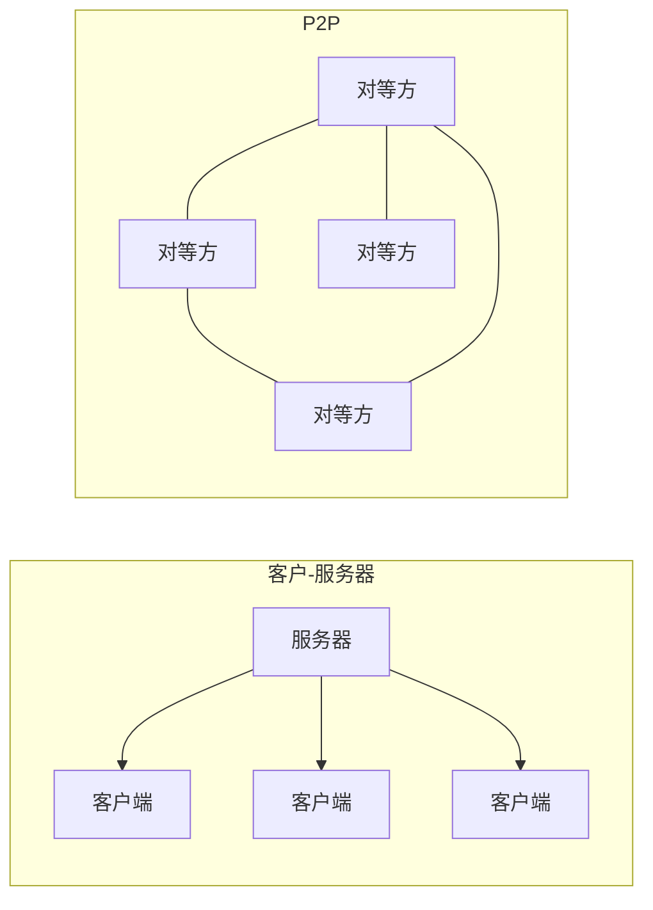
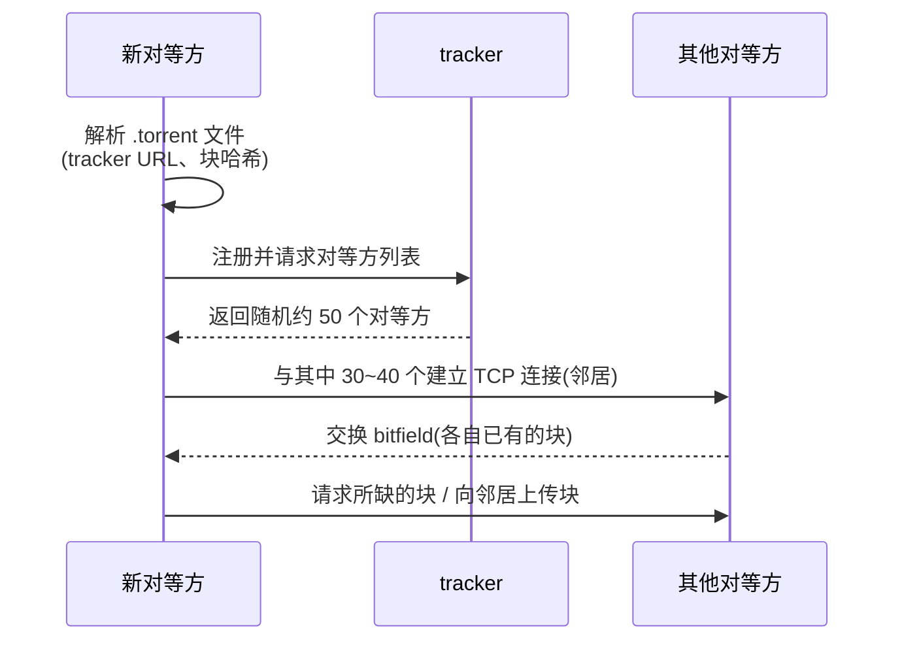
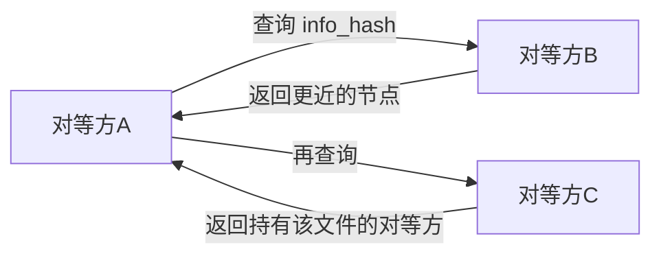
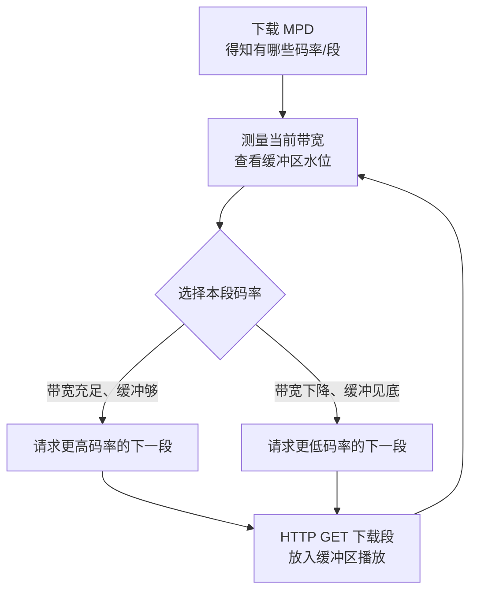
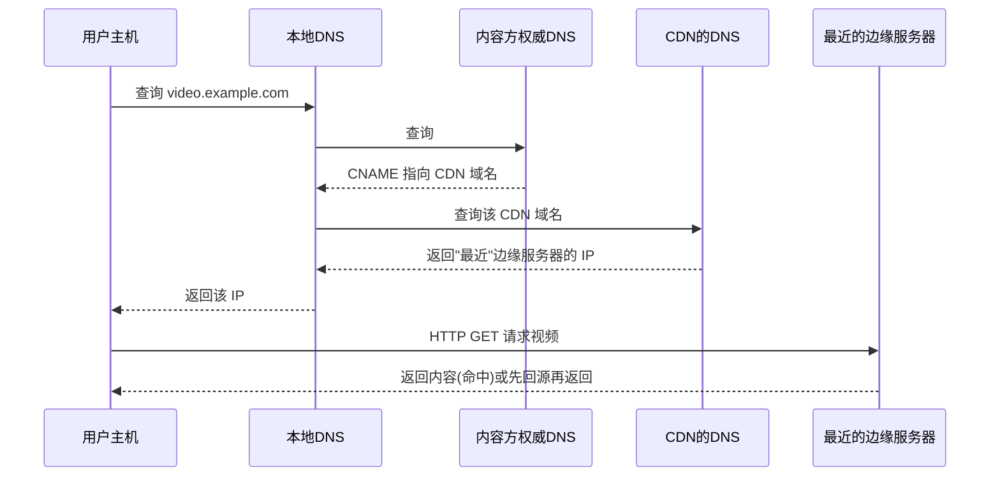

# 2.5 应用层：P2P和流媒体技术

## 目录

1. [P2P文件分发](#p2p文件分发)
2. [BitTorrent协议](#bittorrent协议)
3. [流媒体技术基础](#流媒体技术基础)
4. [视频流协议](#视频流协议)
5. [内容分发网络CDN](#内容分发网络cdn)
6. [流媒体应用的延伸](#流媒体应用的延伸了解)

---

## P2P文件分发

C/S 与 P2P 是两种相对的应用体系结构。前一节的 Web、邮件、DNS 都属于 C/S：服务器始终在线，客户端只向服务器要数据。P2P 则相反——参与者既下载也上传，几乎不依赖固定服务器。



C/S 中只有服务器一条上行链路在供货；P2P 中每个对等方都既是消费者又是供货者。这一差异直接决定了两者的扩展性。

### P2P的自扩展性

P2P 的核心优势是**自扩展性(self-scalability)**：每个新加入的对等方在消耗服务能力的同时，也用自己的上行带宽为系统贡献服务能力。因此用户越多，总服务能力越大，不需要庞大的服务器集群和带宽采购。

代价是：依赖间断连接、所有权分散的主机，安全、可管理性和激励机制都更复杂。

### 文件分发时间比较

设：文件大小 $F$（比特），服务器上载速率 $u_s$，第 $i$ 个对等方的上载/下载速率为 $u_i$、$d_i$，$d_{min}$ 为所有对等方中最小的下载速率，共 $N$ 个对等方各需要完整文件一份。分析的是把文件分发给全部 $N$ 个对等方所需的**最短时间下界**。

#### 客户-服务器体系结构

服务器必须逐份上传 $N$ 个副本，故服务器侧至少花 $NF/u_s$；同时下载最慢的对等方至少花 $F/d_{min}$。两个瓶颈取较大者：

$$D_{cs} \geq \max\left\{\frac{NF}{u_s},\ \frac{F}{d_{min}}\right\}$$

当 $N$ 较大时第一项主导，分发时间随 $N$ **线性增长**。

#### P2P体系结构

P2P 中每个对等方都能转发已下载的部分，分发时间有三个下界：

$$D_{P2P} \geq \max\left\{\frac{F}{u_s},\ \frac{F}{d_{min}},\ \frac{NF}{u_s + \sum_{i=1}^{N} u_i}\right\}$$

三项分别对应：服务器至少要把文件发出一次（$F/u_s$）；最慢的对等方下载一份（$F/d_{min}$）；以及系统总上载能力的约束——要分发的总数据量是 $NF$ 比特，系统总上载速率为 $u_s + \sum u_i$。

关键在第三项：分母随 $N$ 一起增长（每个新对等方都带来 $u_i$ 的上载能力）。所以即使 $N$ 很大，$D_{P2P}$ 的增长也很缓慢，趋于平稳。

> 注：上界 $D_{cs}$、$D_{P2P}$ 都是理论最优分发时间，假定可任意细分文件、链路无额外开销；真实系统因调度、协议开销达不到该下界，但增长趋势一致。

### P2P vs 客户-服务器性能对比

代入一组参数（取自 Kurose 教材例子）：$F = 15\text{ Gbit}$，$u_s = 30\text{ Mbps}$，每个对等方 $u_i = 1\text{ Mbps}$、$d_i = 5\text{ Mbps}$。代入两个公式（验算见下）：

| 用户数 $N$ | C/S 分发时间 | P2P 分发时间 |
|---------|-------------|-------------|
| 10      | 1.39 小时   | 1.04 小时   |
| 100     | 13.9 小时   | 3.21 小时   |
| 1000    | 139 小时    | 4.05 小时   |

C/S 随 $N$ 线性变长，P2P 几乎不再增长。两条曲线对比：

```
分发时间
  ↑
  │              C/S（随 N 线性增长）
  │           ╱
  │        ╱
  │     ╱
  │  ╱
  │╱________________  P2P（趋于平稳）
  └──────────────────→ N
```

> 易混：$u_s = 30\text{ Mbps}$（30 兆比特/秒），$F = 15\text{ Gbit}$（150 亿比特）。计算时统一用比特和秒，最后再换算成小时。例如 $N=1000$ 的 C/S：$\frac{1000 \times 15\times10^9}{30\times10^6} = 5\times10^5\text{ s} \approx 139\text{ h}$。

---

## BitTorrent协议

BitTorrent 是最成功的 P2P 文件分发协议。它的核心思想是把文件切成小块，让对等方互相交换缺失的块，并用激励机制鼓励上传。

### BitTorrent术语

- **torrent**：参与同一个文件分发的所有对等方的集合
- **chunk（块）**：文件被切成的等长小块，典型大小 256 KB
- **tracker**：追踪当前 torrent 内活跃对等方的基础设施节点
- **peer（对等方）**：参与分发的节点；**seed（种子）**指已有完整文件、只上传的对等方；**leecher** 指仍在下载的对等方
- **neighbor（邻居）**：与本节点建立了 TCP 连接、可直接交换块的对等方

### 加入torrent的过程



`.torrent` 文件本身不含数据，只含元数据：tracker 地址、文件名与大小、以及每个块的 SHA-1 哈希（用于校验下载到的块）。

### 文件下载策略：稀缺优先

对等方定期向每个邻居索取其拥有的块清单，然后**优先请求 torrent 中副本最少的块（rarest first）**。这样做的好处：

- 让稀缺块尽快扩散，避免某些块只存在于个别节点而随其离开消失
- 均衡各块的副本数，使整个 torrent 的供给更稳健

> 注：刚加入时本地一个块都没有，无法挑稀缺块，此时会先随机抓几个块，尽快攒出可供上传的内容，从而能参与下面的互惠交换。

### 文件上载策略：tit-for-tat

BitTorrent 用对等的"以牙还牙"机制激励上传，防止只下不传的搭便车：

- **互惠(tit-for-tat)**：每个对等方只向"当前给自己提供数据速率最高的 4 个邻居"回传数据（称为 unchoke，疏通），其余邻居被 choke（阻塞）。每 **10 秒**重新评估一次这 4 个对象。
- **乐观疏通(optimistic unchoking)**：每 **30 秒**额外随机挑一个被阻塞的邻居疏通。这给了新邻居证明自己上传能力的机会，也帮助新加入的对等方启动，并可能发现更划算的合作伙伴。

```
        A 的视角：选出回传速率最高的 4 个邻居
   ┌──────────────────────────────────────────────┐
   │   邻居B ──给A 高速率──→  unchoke(回传)         │
   │   邻居C ──给A 高速率──→  unchoke(回传)         │
   │   邻居D ──给A 高速率──→  unchoke(回传)         │  每 10s 重选
   │   邻居E ──给A 高速率──→  unchoke(回传)         │
   │   邻居F ──给A 低速率──→  choke(不回传)         │
   │   邻居G ──随机选中───→  乐观疏通              │  每 30s 一个
   └──────────────────────────────────────────────┘
```

互惠机制的效果是：上传越快的对等方，越容易被别人回传，从而下载也越快。这促使大家都尽力上传，整个 torrent 趋于高吞吐。

### 对等方间的消息（了解）

两个对等方建立 TCP 连接后先握手：

```
<pstrlen><pstr><reserved><info_hash><peer_id>
```

其中 `pstr` 是协议字符串 "BitTorrent protocol"，`info_hash` 是 torrent 元数据的 SHA-1（双方必须一致才属于同一 torrent），`peer_id` 标识对等方。

握手后交换两类消息：

| 类型 | 消息 | 含义 |
|------|------|------|
| 控制 | choke / unchoke | 阻塞 / 疏通对方（对应 tit-for-tat 的取舍） |
| 控制 | interested / not interested | 是否对对方持有的块感兴趣 |
| 控制 | have | 通告自己新拿到了某个块 |
| 控制 | bitfield | 一次性通告自己持有哪些块（连接初期发送） |
| 数据 | request / piece / cancel | 请求块的某段 / 发送块数据 / 取消请求 |

### 去中心化扩展

早期 BitTorrent 依赖中心化 tracker，存在单点故障。后续扩展逐步降低了这种依赖：

- **DHT（分布式哈希表）**：把"哪些对等方在分发某文件"的信息分散存储到所有节点上，用文件的 info_hash 作为键查找对等方，无需 tracker。
- **PEX（Peer Exchange）**：已连接的对等方互相交换各自已知的对等方列表，加速发现、减少对 tracker 的依赖。
- **UDP Tracker**：用 UDP 替代 HTTP 与 tracker 通信，降低连接开销、改善 NAT 穿透。



> DHT 把对等方信息分散存储在所有节点上，查询沿键空间逐跳逼近目标，无需中心 tracker。

---

## 流媒体技术基础

> **流媒体(Streaming Media)**
> 
> 音视频等多媒体内容边传输边播放、无需完整下载的技术。

流媒体的关键特点是**边收边放**：客户端不等整段下载完，收到开头部分就开始播，后续内容在播放的同时继续下载。这要求数据持续、稳定地到达，因而对带宽、延迟和抖动都很敏感。

为吸收网络波动，播放器在本地维护一个**客户端缓冲区**：先缓冲若干秒内容再起播，之后用缓冲区抵消下载速率的瞬时下降，避免卡顿。

### 两类流媒体

| | 直播(Live) | 点播(On-Demand) |
|---|---|---|
| 例子 | 赛事直播、视频会议、游戏直播 | Netflix、YouTube、B站、在线音乐 |
| 时间要求 | 严格，端到端延迟越低越好 | 宽松，可大量缓冲 |
| 内容准备 | 实时编码 | 可预先多码率编码 |
| 交互 | 几乎只能看当前进度 | 可暂停、快进、快退 |
| 容错 | 可牺牲部分质量换低延迟 | 追求高质量，可重传纠错 |

### 主要挑战

- **带宽随时间变化**：可用带宽随网络状况波动，需要自适应调整码率（见下文 DASH）。
- **延迟与抖动**：分组到达时间不均匀，靠客户端缓冲区平滑。
- **设备异构**：屏幕分辨率、解码能力、操作系统各不相同，需准备多种码率/分辨率版本。

---

## 视频流协议

### DASH：基于HTTP的自适应流

> **DASH (Dynamic Adaptive Streaming over HTTP)**
> 
> 把视频分段、并准备多个码率版本，由客户端按网络状况逐段挑选码率的流媒体协议。是当前主流方案。

DASH 的设计巧妙之处在于：**自适应逻辑放在客户端，服务器只是普通 HTTP 服务器**。这样就能直接复用现有的 HTTP/CDN/缓存设施，也能轻松穿过防火墙（走 80/443）。

**内容准备（服务器侧，离线完成）**：
1. 同一视频编码成多个码率版本（如 300 kbps ～ 5 Mbps）
2. 每个版本切成等长**段(segment)**，通常 2～10 秒
3. 生成清单文件 **MPD(Media Presentation Description)**，列出各码率、各段的 URL
4. 所有段与 MPD 存放在 HTTP 服务器上

**播放（客户端侧，逐段决策）**：



客户端每下载完一段，就根据**测得的带宽**和**缓冲区剩余量**为下一段重新选码率：网络好就升清晰度，网络差就降码率保流畅。整个过程对用户表现为"画质自动切换"。

### HLS

> **HLS (HTTP Live Streaming)**：Apple 提出的流媒体协议，思路与 DASH 类似（分段 + 多码率 + HTTP），iOS/Safari 原生支持。

播放列表用 `.m3u8` 文本文件描述，传统上视频段为 `.ts`：

```
#EXTM3U
#EXT-X-VERSION:3
#EXT-X-TARGETDURATION:10
#EXTINF:9.9,
segment1.ts
#EXTINF:9.9,
segment2.ts
#EXT-X-ENDLIST
```

**HLS 与 DASH 对比**：

| 特性 | HLS | DASH |
|------|-----|------|
| 来源 | Apple | 国际标准(MPEG) |
| 容器格式 | TS（也支持 fMP4） | MP4 / WebM |
| 清单文件 | M3U8 | MPD（XML） |
| 兼容性 | iOS/Safari 原生 | 通常需 JS 播放器 |
| 编解码绑定 | 不绑定特定编解码器 | 不绑定特定编解码器 |

> 两者都是"分段 + 多码率 + 走 HTTP 由客户端自适应"，差异主要在清单格式、容器格式和生态。

### WebRTC

> **WebRTC (Web Real-Time Communication)**：让浏览器之间直接进行实时音视频通信的开放标准。

与 DASH/HLS 不同，WebRTC 面向**双向、超低延迟**场景（视频通话、屏幕共享），尽量在对等方之间直连，必要时才借助中继：

| 分层 | 组件 | 作用 |
|------|------|------|
| 媒体 | 音频 Opus，视频 VP8/VP9/H.264/AV1 | 编解码 |
| 传输 | SRTP / DTLS | 媒体加密传输 |
| 连接 | ICE + STUN / TURN | NAT 穿透；STUN 探测公网地址，穿不过时用 TURN 中继 |
| 信令 | SDP（常配合 WebSocket） | 交换编解码、地址等会话参数 |

> 注：信令（交换连接参数）不属于 WebRTC 标准本身，需应用自己搭建（常用 WebSocket）；WebRTC 标准化的是媒体与传输部分。

---

## 内容分发网络CDN

视频点播这类海量、高带宽内容若全由单一数据中心提供，既会因距离远而延迟高，也会让源站带宽不堪重负。**CDN(Content Delivery Network)** 把内容副本分散部署到靠近用户的多处服务器，让用户就近取内容。

### CDN组成

- **边缘服务器(edge server)**：部署在靠近用户处（常驻 ISP 机房），缓存热点内容并直接响应用户请求。CDN 的服务能力主要由它承担。
- **源服务器(origin server)**：内容提供商保存原始内容的服务器。仅在边缘缓存未命中时被回源访问。

### CDN部署哲学：两种思路

| | Enter Deep（深入接入网） | Bring Home（驻留少数大集群） |
|---|---|---|
| 代表 | Akamai | Limelight 等 |
| 做法 | 在大量 ISP 内部署众多小集群 | 在少数关键位置部署大集群 |
| 优点 | 离用户最近，延迟最低 | 集群少，运维简单 |
| 缺点 | 集群多，管理复杂 | 离用户相对远 |

### 内容放置：Push 与 Pull

- **Pull（拉取，主流）**：边缘服务器按需回源拉取内容并缓存。首次访问慢，后续命中即快；存储利用率高。
- **Push（推送）**：内容方主动把内容预先推到边缘。适合可预测的热点（如新片首映），起播快但占存储、成本高。

### CDN如何把用户导向最近的服务器

CDN 通常借助 **DNS 重定向**完成服务器选择——这是 CDN 工作机制的核心。以用户访问 `video.example.com` 上一段视频为例：



关键在第 4 步：CDN 的 DNS 根据**请求来源的本地 DNS 地址**推断用户大致位置，再结合**网络距离与服务器负载**，挑一台合适的边缘服务器返回其 IP。

> 易混：CDN 选服务器看的是**本地 DNS 的位置**，不是用户主机本身。两者通常很近，但用户若使用了远端的公共 DNS（如 8.8.8.8），就可能被导向离 DNS 近、离自己远的服务器。

### 缓存淘汰

边缘服务器容量有限，需淘汰旧内容：

- **LRU**：淘汰最久未访问的内容，实现简单、应用最广。
- **LFU**：淘汰访问频次最低的内容，适合访问模式稳定的场景。
- **TTL**：按 HTTP 缓存头给定的存活时间过期，适合有明确时效的内容。

从用户到源站，请求会穿过多级缓存，任一级命中即返回：

```
用户 → 浏览器缓存 → CDN 边缘 → 源服务器
```

越靠前命中，延迟越低、对源站压力越小。

---

## 流媒体应用的延伸（了解）

几类对网络要求更苛刻的应用，本质都是前面机制在更高带宽或更低延迟下的延伸：

- **4K/8K 超高清**：码率显著提高（4K 约 25 Mbps 量级，8K 更高），更依赖高效编码（H.265、AV1、H.266）与 CDN 分发，仍走 DASH/HLS 式的自适应流。
- **VR 流媒体**：对延迟极敏感，"运动到光子"延迟过高会引发眩晕，常借助边缘计算就近处理；并用注视点渲染等手段压低带宽。
- **云游戏**：在云端 GPU 渲染并实时编码画面下发，用户输入实时上传，是双向超低延迟场景，更接近 WebRTC 一类的实时传输需求。

---

**[下一节：2.6 应用层：应用层安全](2.6应用层：应用层安全.md)**
