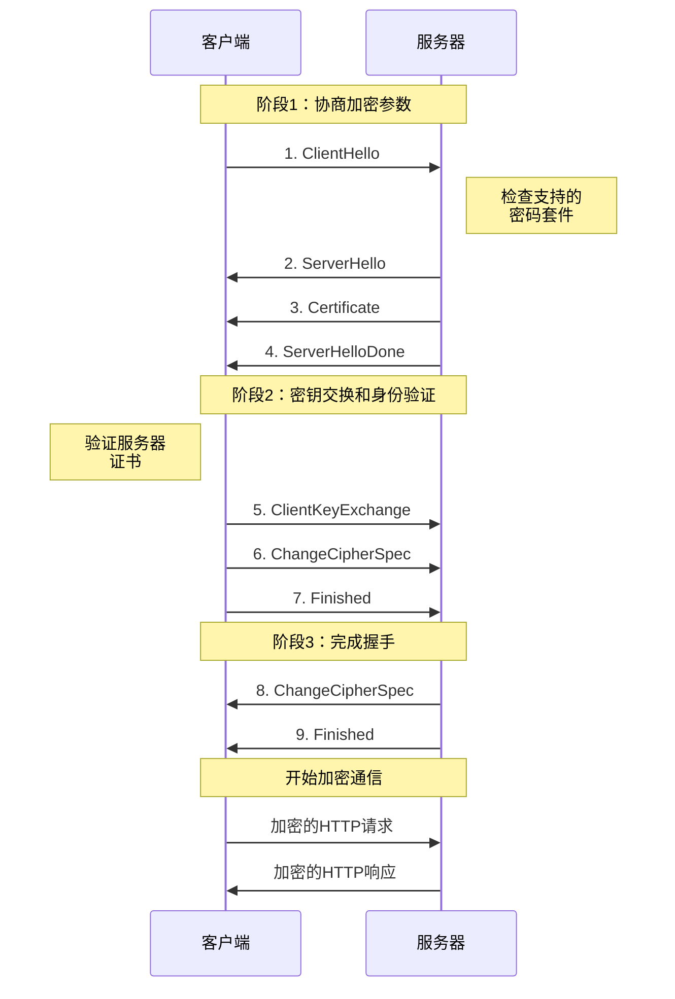

# 2.6 应用层：应用层安全

## 目录

1. [应用层安全概述](#应用层安全概述)
2. [TLS/SSL协议](#tlsssl协议)
3. [HTTPS协议](#https协议)
4. [数字证书和PKI](#数字证书和pki)
5. [应用层安全技术](#应用层安全技术)
6. [Web应用安全威胁](#web应用安全威胁)

---

## 应用层安全概述

现代网络应用必须考虑安全性问题，应用层安全主要通过加密协议来实现。

### 安全威胁分类

#### 被动攻击

**窃听(Eavesdropping)**：
- 截获网络通信内容
- 分析通信模式
- 获取敏感信息

**流量分析(Traffic Analysis)**：
- 分析通信频率和模式
- 推测通信内容
- 识别通信参与方

#### 主动攻击

**伪装(Masquerading)**：
- 冒充合法用户或服务器
- 欺骗通信对方
- 获取未授权访问

**重放攻击(Replay Attack)**：
- 重复发送截获的合法消息
- 欺骗接收方
- 执行未授权操作

**消息篡改(Message Modification)**：
- 修改传输中的消息内容
- 插入、删除或修改数据
- 破坏数据完整性

**拒绝服务(Denial of Service)**：
- 阻止合法用户访问资源
- 消耗系统资源
- 影响服务可用性

### 安全服务需求

#### 机密性(Confidentiality)

**数据保护**：
- 防止未授权的信息泄露
- 确保只有授权方能读取数据
- 通过加密技术实现

#### 完整性(Integrity)

**数据完整**：
- 检测数据是否被篡改
- 确保数据的准确性
- 使用消息摘要算法

#### 认证(Authentication)

**身份验证**：
- 验证通信对方的身份
- 防止伪装攻击
- 使用数字证书

#### 不可否认性(Non-repudiation)

**行为证明**：
- 防止发送方否认已发送的消息
- 防止接收方否认已接收的消息
- 使用数字签名

---

## TLS/SSL协议

> **TLS(Transport Layer Security)**
> 
> 位于应用层和传输层之间的安全协议，为应用层提供数据加密、完整性检验和身份认证服务。

### TLS发展历史

**协议演进**：
- **SSL 1.0**：从未发布（1994年）
- **SSL 2.0**：存在严重安全漏洞（1995年）
- **SSL 3.0**：广泛使用（1996年）
- **TLS 1.0**：等同于SSL 3.1（1999年）
- **TLS 1.1**：修复安全问题（2006年）
- **TLS 1.2**：目前主流版本（2008年）
- **TLS 1.3**：最新版本，性能和安全性大幅提升（2018年）

### TLS协议架构

#### 协议层次

**TLS记录层(Record Layer)**：
- 提供基本的安全服务
- 处理数据分片、压缩、加密
- 在TCP连接上工作

**TLS握手层**：
- **握手协议(Handshake Protocol)**：建立安全参数
- **密码规格变更协议(Change Cipher Spec)**：激活新的密码参数
- **警告协议(Alert Protocol)**：传递安全相关的警告
- **应用数据协议(Application Data)**：传输应用层数据

### TLS握手过程详解

#### TLS 1.2完整握手过程

> **TLS握手的核心目标**
> 
> 1. **协商加密算法**：确定双方都支持的密码套件
> 2. **交换密钥材料**：安全地建立共享密钥
> 3. **验证身份**：通过数字证书确认服务器身份
> 4. **建立安全通道**：为后续通信提供加密保护



#### 详细握手步骤分析

**步骤1：ClientHello消息**
```
客户端 → 服务器：ClientHello
{
    "protocol_version": "TLS 1.2",
    "random": "28位时间戳 + 28字节随机数",
    "session_id": "会话ID（用于会话恢复）",
    "cipher_suites": [
        "TLS_ECDHE_RSA_WITH_AES_256_GCM_SHA384",
        "TLS_ECDHE_RSA_WITH_AES_128_GCM_SHA256",
        "TLS_RSA_WITH_AES_256_CBC_SHA256"
    ],
    "compression_methods": ["null"],
    "extensions": {
        "server_name": "www.example.com",
        "supported_groups": ["secp256r1", "secp384r1"],
        "signature_algorithms": ["rsa_pss_rsae_sha256", "ecdsa_secp256r1_sha256"]
    }
}
```

**关键信息说明**：
- **客户端随机数**：32字节，用于生成最终密钥
- **密码套件列表**：按优先级排序的支持算法
- **扩展字段**：SNI、椭圆曲线支持等额外功能

**步骤2-4：服务器响应**
```
服务器 → 客户端：ServerHello
{
    "protocol_version": "TLS 1.2",
    "random": "32字节服务器随机数",
    "session_id": "new_session_12345678",
    "cipher_suite": "TLS_ECDHE_RSA_WITH_AES_256_GCM_SHA384",
    "compression_method": "null"
}

服务器 → 客户端：Certificate
{
    "certificate_chain": [
        "服务器证书 (www.example.com)",
        "中间CA证书",
        "根CA证书（可选）"
    ]
}

服务器 → 客户端：ServerHelloDone
{
    "message": "服务器Hello阶段完成"
}
```

**步骤5-7：客户端密钥交换**
```
客户端验证证书 → 生成预主密钥 → 发送加密的预主密钥

客户端 → 服务器：ClientKeyExchange
{
    "encrypted_premaster_secret": "使用服务器RSA公钥加密的48字节预主密钥"
}

密钥生成过程：
Master Secret = PRF(Pre-Master Secret, "master secret", 
                   Client Random + Server Random)

客户端 → 服务器：ChangeCipherSpec
{
    "message": "切换到加密模式"
}

客户端 → 服务器：Finished
{
    "verify_data": "前面所有握手消息的MAC验证"
}
```

**步骤8-9：服务器完成握手**
```
服务器 → 客户端：ChangeCipherSpec
{
    "message": "服务器也切换到加密模式"
}

服务器 → 客户端：Finished
{
    "verify_data": "服务器端握手消息的MAC验证"
}
```

#### 密钥生成详细过程

**主密钥生成算法**：
```
Pre-Master Secret (48字节)
    ↓
Client Random (32字节) + Server Random (32字节)
    ↓
Master Secret = PRF(Pre-Master Secret, "master secret", 
                   Client Random + Server Random)
    ↓
Key Block = PRF(Master Secret, "key expansion",
               Server Random + Client Random)
    ↓
分割密钥块：
- Client MAC Key
- Server MAC Key  
- Client Encryption Key
- Server Encryption Key
- Client IV
- Server IV
```

**伪随机函数(PRF)**：
- **TLS 1.2**：PRF = HMAC-SHA256（或密码套件指定的hash）
- **输入**：Secret + Label + Seed
- **输出**：任意长度的伪随机数据

#### 实际握手抓包分析

**Wireshark抓包示例**：
```
Frame 1: ClientHello
    TLS Version: TLS 1.2 (0x0303)
    Random: 507d2d4f1234567890abcdef...
    Cipher Suites Length: 54
    Cipher Suite: TLS_ECDHE_RSA_WITH_AES_256_GCM_SHA384 (0xc030)

Frame 2: ServerHello, Certificate, ServerHelloDone
    TLS Version: TLS 1.2 (0x0303)
    Random: 507d2d4f9876543210fedcba...
    Cipher Suite: TLS_ECDHE_RSA_WITH_AES_256_GCM_SHA384 (0xc030)
    
    Certificate Length: 1234 bytes
    Certificate: www.example.com
        Subject: CN=www.example.com, O=Example Corp
        Issuer: CN=DigiCert SHA2 Secure Server CA
        Validity: 2024-01-01 to 2025-01-01

Frame 3: ClientKeyExchange, ChangeCipherSpec, Finished
    Encrypted Premaster Secret Length: 256 bytes
    Encrypted Premaster Secret: a1b2c3d4e5f6...

Frame 4: ChangeCipherSpec, Finished
    [Encrypted Alert/Handshake Data]
```

#### TLS 1.3简化握手

**主要改进**：
1. **减少握手往返**：从2-RTT减少到1-RTT
2. **0-RTT模式**：支持会话恢复的零往返时间
3. **强制前向安全**：所有密钥交换算法都提供前向安全
4. **移除过时算法**：移除RSA密钥交换、SHA-1、MD5等
5. **加密更多握手信息**：增强隐私保护

**TLS 1.3握手流程**：
```
Client                                Server

ClientHello
+ KeyShare             -------->
                                  ServerHello
                                  + KeyShare
                                  + Certificate
                                  + CertificateVerify
                      <--------   + Finished
+ Finished            -------->
[Application Data]    <------->   [Application Data]
```

### TLS密码学组件

#### 对称加密算法

**流密码**：
- RC4（已废弃）
- ChaCha20

**块密码**：
- AES-128/256
- 3DES（已废弃）

**加密模式**：
- CBC（密码块链接）
- GCM（伽罗瓦计数模式）
- CCM（计数器与CBC-MAC）

#### 非对称加密算法

**密钥交换**：
- RSA（逐渐淘汰）
- ECDHE（椭圆曲线Diffie-Hellman）
- DHE（Diffie-Hellman）

**数字签名**：
- RSA签名
- ECDSA（椭圆曲线数字签名）
- EdDSA（Edwards曲线数字签名）

#### 消息摘要算法

**哈希函数**：
- SHA-256/384
- SHA-1（已废弃）
- MD5（已废弃）

**消息认证码(MAC)**：
- HMAC-SHA256
- AEAD（认证加密）

### TLS密码套件

**密码套件格式**：
```
TLS_ECDHE_RSA_WITH_AES_256_GCM_SHA384
```

**组成部分**：
- **TLS**：协议标识
- **ECDHE**：密钥交换算法
- **RSA**：身份认证算法
- **AES_256_GCM**：对称加密算法和模式
- **SHA384**：消息摘要算法

**TLS 1.3密码套件**：
```
TLS_AES_256_GCM_SHA384
TLS_CHACHA20_POLY1305_SHA256
TLS_AES_128_GCM_SHA256
```

### SSL/TLS安全配置最佳实践

#### 服务器端配置优化

**Apache配置示例**：
```apache
# 启用SSL模块
LoadModule ssl_module modules/mod_ssl.so

<VirtualHost *:443>
    ServerName www.example.com
    DocumentRoot /var/www/html
    
    # SSL基础配置
    SSLEngine on
    SSLCertificateFile /path/to/certificate.crt
    SSLCertificateKeyFile /path/to/private.key
    SSLCertificateChainFile /path/to/intermediate.crt
    
    # 安全协议版本
    SSLProtocol -all +TLSv1.2 +TLSv1.3
    
    # 密码套件配置（推荐配置）
    SSLCipherSuite ECDHE+AESGCM:ECDHE+CHACHA20:DHE+AESGCM:DHE+CHACHA20:!aNULL:!MD5:!DSS
    SSLHonorCipherOrder on
    
    # 会话配置
    SSLSessionCache shmcb:/var/cache/mod_ssl/scache(512000)
    SSLSessionCacheTimeout 300
    
    # HSTS配置
    Header always set Strict-Transport-Security "max-age=63072000; includeSubDomains; preload"
    
    # OCSP Stapling
    SSLUseStapling on
    SSLStaplingResponderTimeout 5
    SSLStaplingReturnResponderErrors off
</VirtualHost>
```

**Nginx配置示例**：
```nginx
server {
    listen 443 ssl http2;
    server_name www.example.com;
    
    # SSL证书配置
    ssl_certificate /path/to/fullchain.pem;
    ssl_certificate_key /path/to/privkey.pem;
    ssl_trusted_certificate /path/to/chain.pem;
    
    # SSL协议和密码套件
    ssl_protocols TLSv1.2 TLSv1.3;
    ssl_ciphers ECDHE+AESGCM:ECDHE+CHACHA20:DHE+AESGCM:DHE+CHACHA20:!aNULL:!MD5:!DSS;
    ssl_prefer_server_ciphers off;
    
    # SSL会话配置
    ssl_session_cache shared:SSL:10m;
    ssl_session_timeout 1d;
    ssl_session_tickets off;
    
    # OCSP Stapling配置
    ssl_stapling on;
    ssl_stapling_verify on;
    resolver 8.8.8.8 8.8.4.4 valid=300s;
    resolver_timeout 5s;
    
    # 安全头部
    add_header Strict-Transport-Security "max-age=31536000; includeSubDomains; preload" always;
    add_header X-Frame-Options DENY always;
    add_header X-Content-Type-Options nosniff always;
}
```

#### 常见SSL/TLS问题诊断

**问题1：证书链不完整**
```bash
# 检测方法
openssl s_client -connect www.example.com:443 -servername www.example.com

# 错误症状
verify error:num=21:unable to verify the first certificate

# 解决方案
# 确保服务器发送完整的证书链（包含中间CA证书）
ssl_certificate /path/to/fullchain.pem;  # Nginx
SSLCertificateChainFile /path/to/intermediate.crt  # Apache
```

**问题2：SNI配置缺失**
```bash
# 检测方法
openssl s_client -connect example.com:443  # 不带SNI
openssl s_client -connect example.com:443 -servername www.example.com  # 带SNI

# 症状：不带SNI时返回默认证书或连接失败
# 解决：确保服务器正确配置多个虚拟主机
```

**问题3：弱密码套件配置**
```bash
# 检测工具
nmap --script ssl-enum-ciphers -p 443 www.example.com
sslyze --regular www.example.com

# 危险配置示例
SSLCipherSuite ALL:!aNULL:!eNULL:!SSLv2  # 包含过时算法

# 安全配置示例
SSLCipherSuite ECDHE+AESGCM:ECDHE+CHACHA20:DHE+AESGCM:DHE+CHACHA20:!aNULL:!MD5:!DSS
```

#### SSL/TLS性能调优

**会话恢复优化**：
```nginx
# Session Cache优化
ssl_session_cache shared:SSL:10m;
ssl_session_timeout 1d;

# Session Tickets（注意安全风险）
ssl_session_tickets off;  # 推荐关闭以提供前向安全
```

**硬件加速配置**：
```bash
# 检查AES-NI支持
grep -m1 -o aes /proc/cpuinfo

# OpenSSL性能测试
openssl speed aes-256-gcm
openssl speed ecdh
```

### SSL/TLS攻击与防护

#### 常见攻击类型

**中间人攻击(MITM)**：
- **攻击原理**：攻击者截获并转发通信
- **防护措施**：证书锁定、HPKP、证书透明度
- **检测方法**：监控证书变化、CT日志审计

**降级攻击**：
- **攻击目标**：强制使用弱加密算法
- **防护措施**：禁用过时协议、正确配置密码套件优先级
- **示例配置**：
```nginx
ssl_protocols TLSv1.2 TLSv1.3;  # 仅允许安全版本
ssl_ciphers HIGH:!aNULL:!MD5:!3DES;  # 禁用弱算法
```

**重新协商攻击**：
- **攻击方式**：利用SSL重新协商漏洞
- **防护措施**：
```apache
SSLInsecureRenegotiation off  # Apache
```

#### 前向安全(Perfect Forward Secrecy)

**概念**：即使长期密钥泄露，历史通信仍然安全

**实现方式**：
- 使用临时密钥交换算法（ECDHE、DHE）
- 定期轮换会话密钥
- 避免RSA密钥交换

**配置示例**：
```nginx
# 优先使用ECDHE密码套件
ssl_ciphers ECDHE+AESGCM:ECDHE+CHACHA20:!RSA;
ssl_prefer_server_ciphers off;  # TLS 1.3推荐设置
```

### TLS 1.3新特性详解

#### 关键改进

**简化握手流程**：
```
TLS 1.2: 2-RTT握手
Client: ClientHello
Server: ServerHello, Certificate, ServerKeyExchange, ServerHelloDone
Client: ClientKeyExchange, ChangeCipherSpec, Finished
Server: ChangeCipherSpec, Finished

TLS 1.3: 1-RTT握手
Client: ClientHello + KeyShare
Server: ServerHello + KeyShare, {Certificate, CertificateVerify, Finished}
Client: {Finished}
```

**0-RTT数据传输**：
```nginx
# Nginx配置0-RTT（需谨慎使用）
ssl_early_data on;
proxy_set_header Early-Data $ssl_early_data;
```

**注意**：0-RTT存在重放攻击风险，仅用于幂等操作

**移除过时特性**：
- 移除RSA密钥交换
- 移除静态DH密钥交换
- 移除自定义DH参数
- 移除压缩功能
- 移除重新协商

### 典型考试题目解析

#### 题目1：TLS握手分析

> **例题**：分析下面的TLS握手流程，指出哪一步出现问题并说明原因。
> 
> 1. Client → Server: ClientHello
> 2. Server → Client: ServerHello, Certificate
> 3. Client → Server: ClientKeyExchange, Finished
> 4. Server → Client: Finished

**分析**：
- **问题**：缺少ChangeCipherSpec消息
- **原因**：在步骤3和4中，双方直接发送Finished消息而没有先发送ChangeCipherSpec来激活新的密码参数
- **正确流程**：应该在Finished之前发送ChangeCipherSpec

#### 题目2：密码套件选择

> **例题**：给定以下密码套件，按安全性从高到低排序：
> 1. TLS_RSA_WITH_AES_128_CBC_SHA
> 2. TLS_ECDHE_RSA_WITH_AES_256_GCM_SHA384
> 3. TLS_RSA_WITH_3DES_EDE_CBC_SHA
> 4. TLS_ECDHE_ECDSA_WITH_CHACHA20_POLY1305_SHA256

**答案**：4 > 2 > 1 > 3

**解析**：
- **第4名**：ECDHE+ECDSA（最佳前向安全）+CHACHA20（现代加密）
- **第3名**：ECDHE+RSA（前向安全）+AES-GCM（认证加密）
- **第2名**：RSA密钥交换（无前向安全）但使用AES
- **第1名**：RSA+3DES（过时的加密算法）

#### 题目3：证书验证

> **例题**：客户端访问https://mail.example.com时收到CN=*.example.com的通配符证书，这种情况下连接是否安全？为什么？

**分析**：
- **结论**：安全，连接可以建立
- **原因**：
  1. 通配符证书`*.example.com`可以匹配`mail.example.com`
  2. 通配符只匹配一级子域名
  3. 证书有效期内且由可信CA签发

**注意事项**：
- `*.example.com`不能匹配`sub.mail.example.com`（二级子域名）
- 通配符证书安全性略低于专用证书

### 实际部署检查清单

#### 部署前检查

**证书验证**：
```bash
# 验证证书和私钥匹配
openssl x509 -noout -modulus -in certificate.crt | openssl md5
openssl rsa -noout -modulus -in private.key | openssl md5

# 检查证书链
openssl verify -CAfile ca-bundle.crt certificate.crt

# 验证证书有效期
openssl x509 -in certificate.crt -noout -dates
```

**配置安全性检查**：
```bash
# 使用SSL Labs测试
curl -s "https://api.ssllabs.com/api/v3/analyze?host=www.example.com"

# 本地配置检查
testssl.sh www.example.com

# 密码套件测试
nmap --script ssl-enum-ciphers -p 443 www.example.com
```

#### 监控和维护

**证书过期监控**：
```bash
# 检查证书剩余天数
openssl x509 -in certificate.crt -noout -enddate | cut -d= -f 2 | xargs -I {} date -d "{}" +%s

# 自动化监控脚本
#!/bin/bash
CERT_FILE="/path/to/certificate.crt"
DAYS_TO_EXPIRE=$(openssl x509 -in "$CERT_FILE" -noout -enddate | cut -d= -f 2 | xargs -I {} date -d "{}" +%s)
CURRENT_DATE=$(date +%s)
DAYS_LEFT=$(( ($DAYS_TO_EXPIRE - $CURRENT_DATE) / 86400 ))

if [ $DAYS_LEFT -lt 30 ]; then
    echo "警告：证书将在 $DAYS_LEFT 天后过期"
fi
```

**安全配置审计**：
```bash
# 检查弱密码套件
openssl ciphers -v 'ALL' | grep -E '(NULL|ADH|EXP|DES|MD5|PSK|SRP|CAMELLIA)'

# 检查协议版本支持
for version in ssl2 ssl3 tls1 tls1_1 tls1_2 tls1_3; do
    echo -n "$version: "
    openssl s_client -connect www.example.com:443 -$version < /dev/null 2>&1 | grep -q "Cipher is" && echo "支持" || echo "不支持"
done
```

### HTTPS与TLS集成

> **HTTPS = HTTP + TLS**
> 
> HTTPS是HTTP协议在TLS安全层上的实现，详细的HTTPS工作原理和部署实践请参考：
> **[2.2 应用层：万维网和HTTP技术](2.2应用层：万维网和HTTP技术.md#https协议详解)**

#### HTTPS核心安全特性

**基于TLS的安全保障**：
- **机密性**：通过本节讲解的对称加密算法实现
- **完整性**：通过消息认证码（MAC）实现
- **身份认证**：通过数字证书和PKI体系实现
- **不可否认性**：通过数字签名实现

**TLS在HTTPS中的作用**：
```
HTTP请求/响应
    ↓
TLS加密层（本章重点）
    ↓  
TCP传输层
    ↓
IP网络层
```

#### HTTPS安全配置要点

**TLS版本选择**：
- 强制使用TLS 1.2或更高版本
- 推荐TLS 1.3以获得最佳安全性和性能
- 禁用所有SSL版本和TLS 1.0/1.1

**证书配置最佳实践**：
- 使用本节介绍的强密码套件
- 配置完整的证书链
- 启用OCSP Stapling
- 定期检查证书有效期

---

## 数字证书和PKI

### 公钥基础设施(PKI)

> **PKI(Public Key Infrastructure)**
> 
> 支持公钥密码学的基础设施，包括证书颁发、管理、分发、使用和撤销的完整体系。

#### PKI组成部分

**证书颁发机构(CA)**：
- 颁发和管理数字证书
- 验证证书申请者身份
- 维护证书撤销列表(CRL)
- 例如：DigiCert、Let's Encrypt、Symantec

**注册机构(RA)**：
- 代表CA接受证书申请
- 验证申请者身份信息
- 可以是CA的一部分

**证书存储库**：
- 存储已颁发的证书
- 提供证书查询服务
- 通常基于LDAP或HTTP

**证书撤销列表(CRL)**：
- 列出已撤销的证书
- 定期更新和分发
- 防止已撤销证书被使用

### 数字证书

#### X.509证书格式

**证书内容**：
- **版本**：证书格式版本
- **序列号**：CA分配的唯一标识
- **签名算法**：CA使用的签名算法
- **颁发者**：CA的识别名称
- **有效期**：证书的生效和过期时间
- **主体**：证书持有者信息
- **公钥信息**：主体的公钥
- **扩展**：可选的证书扩展信息
- **签名**：CA的数字签名

#### 证书扩展

**标准扩展**：
- **密钥用途(Key Usage)**：指定密钥的用途
- **扩展密钥用途(Extended Key Usage)**：特定应用的密钥用途
- **主体备用名称(Subject Alternative Name)**：额外的主体标识
- **基本约束(Basic Constraints)**：指示是否为CA证书

**示例扩展**：
```
Key Usage: Digital Signature, Key Encipherment
Extended Key Usage: TLS Web Server Authentication
Subject Alternative Name: 
    DNS:www.example.com
    DNS:mail.example.com
    DNS:ftp.example.com
```

### 证书链和信任模型

#### 证书链

**信任链构建**：
```
Root CA Certificate (自签名)
    ↓
Intermediate CA Certificate
    ↓
End Entity Certificate (www.example.com)
```

**验证过程**：
1. 验证服务器证书签名（使用中间CA公钥）
2. 验证中间CA证书签名（使用根CA公钥）
3. 验证根CA证书（预装在操作系统/浏览器中）
4. 检查证书有效期和撤销状态

#### 根证书存储

**预装根证书**：
- 操作系统证书存储（Windows、macOS、Linux）
- 浏览器证书存储（Chrome、Firefox、Safari）
- 移动设备证书存储

**信任决策**：
- 根CA的选择和管理
- 证书透明度日志
- 证书锁定技术

### 证书撤销机制

#### CRL(Certificate Revocation List)

**工作机制**：
- CA定期发布CRL
- 列出已撤销证书的序列号
- 客户端下载CRL检查证书状态

**CRL缺点**：
- 文件较大，下载耗时
- 更新不及时
- 隐私问题

#### OCSP(Online Certificate Status Protocol)

**实时查询**：
- 客户端向OCSP响应器查询证书状态
- 获得实时的撤销信息
- 减少网络开销

**OCSP Stapling**：
- 服务器预先获取OCSP响应
- 在TLS握手时一并发送给客户端
- 提高性能和隐私保护

---

## 应用层安全技术

### HTTP安全头部

#### 强制HTTPS

**Strict-Transport-Security (HSTS)**：
```http
Strict-Transport-Security: max-age=31536000; includeSubDomains; preload
```

**功能**：
- 强制浏览器使用HTTPS连接
- 防止协议降级攻击
- 支持子域名和预加载列表

#### 内容安全策略

**Content-Security-Policy (CSP)**：
```http
Content-Security-Policy: default-src 'self'; script-src 'self' 'unsafe-inline' https://apis.google.com; style-src 'self' 'unsafe-inline'
```

**防护目标**：
- 防止XSS攻击
- 控制资源加载来源
- 限制内联脚本执行

**CSP指令**：
- **default-src**：默认资源源
- **script-src**：脚本资源源
- **style-src**：样式资源源
- **img-src**：图像资源源
- **connect-src**：连接资源源

#### 其他安全头部

**X-Frame-Options**：
```http
X-Frame-Options: DENY
```
防止点击劫持攻击

**X-Content-Type-Options**：
```http
X-Content-Type-Options: nosniff
```
防止MIME类型嗅探

**Referrer-Policy**：
```http
Referrer-Policy: strict-origin-when-cross-origin
```
控制引荐来源信息的发送

### 现代认证技术

#### OAuth 2.0

> **OAuth 2.0**
> 
> 开放标准的授权框架，允许第三方应用访问用户资源而无需获得用户凭据。

**角色定义**：
- **资源所有者(Resource Owner)**：用户
- **客户端(Client)**：第三方应用
- **授权服务器(Authorization Server)**：颁发访问令牌
- **资源服务器(Resource Server)**：存储受保护资源

**授权流程**：
1. 客户端请求用户授权
2. 用户同意并返回授权码
3. 客户端使用授权码获取访问令牌
4. 使用访问令牌访问受保护资源

#### JWT(JSON Web Token)

**JWT结构**：
```
Header.Payload.Signature
```

**示例JWT**：
```
eyJhbGciOiJIUzI1NiIsInR5cCI6IkpXVCJ9.
eyJzdWIiOiIxMjM0NTY3ODkwIiwibmFtZSI6IkpvaG4gRG9lIiwiaWF0IjoxNTE2MjM5MDIyfQ.
SflKxwRJSMeKKF2QT4fwpMeJf36POk6yJV_adQssw5c
```

**JWT优势**：
- 自包含：包含所有必要信息
- 无状态：服务器不需要存储会话
- 跨域支持：适合分布式系统

#### OpenID Connect

**基于OAuth 2.0的身份认证层**：
- 在OAuth 2.0基础上增加身份认证
- 提供用户身份信息
- 标准化的身份提供商接口

### Web应用防火墙(WAF)

#### WAF功能

**攻击防护**：
- SQL注入检测和阻断
- XSS攻击过滤
- CSRF攻击防护
- DDoS攻击缓解

**访问控制**：
- IP白名单/黑名单
- 地理位置过滤
- 速率限制
- 用户代理过滤

#### WAF部署方式

**网络级WAF**：
- 部署在网络边界
- 硬件或虚拟设备形式
- 高性能和低延迟

**云WAF**：
- 云服务商提供
- 弹性扩展能力
- 全球分布节点

**应用级WAF**：
- 集成在Web服务器中
- 细粒度控制
- 与应用深度集成

---

## Web应用安全威胁

### OWASP Top 10

**2021年OWASP Top 10安全风险**：

#### A01:访问控制缺陷

**典型问题**：
- 未正确实施访问控制
- 权限提升漏洞
- 目录遍历攻击

**防护措施**：
- 实施最小权限原则
- 使用安全的访问控制框架
- 定期进行权限审查

#### A02:加密机制失效

**常见错误**：
- 使用弱加密算法
- 密钥管理不当
- 敏感数据未加密

**防护措施**：
- 使用强加密算法
- 实施密钥管理最佳实践
- 对敏感数据进行端到端加密

#### A03:注入攻击

**攻击类型**：
- SQL注入
- NoSQL注入
- 命令注入
- LDAP注入

**防护方法**：
- 使用参数化查询
- 输入验证和过滤
- 最小权限数据库账户

#### A04:不安全设计

**设计缺陷**：
- 威胁建模不足
- 安全控制设计缺陷
- 业务逻辑漏洞

**改进措施**：
- 安全设计原则
- 威胁建模
- 安全架构评审

#### A05:安全配置错误

**常见错误**：
- 默认账户和密码
- 不必要的功能启用
- 错误的安全设置

**防护策略**：
- 安全配置基线
- 定期安全审查
- 自动化配置管理

### 攻击技术详解

#### 跨站脚本(XSS)

**攻击类型**：
- **反射型XSS**：恶意脚本在响应中反射
- **存储型XSS**：恶意脚本存储在服务器
- **DOM型XSS**：客户端脚本修改DOM

**防护方法**：
- 输出编码
- 输入验证
- CSP策略
- HttpOnly Cookie

#### 跨站请求伪造(CSRF)

**攻击原理**：
- 利用用户已认证的会话
- 诱使用户执行非预期操作
- 在用户不知情下发送请求

**防护技术**：
- CSRF Token验证
- SameSite Cookie属性
- 双重Cookie验证
- 重要操作二次确认

#### 点击劫持

**攻击手段**：
- 使用透明iframe覆盖
- 诱导用户点击隐藏元素
- 执行未授权操作

**防护措施**：
- X-Frame-Options头部
- CSP frame-ancestors指令
- JavaScript frame检测

---
 
**[下一节：2.7 套接字编程](2.7应用层：套接字编程.md)**
