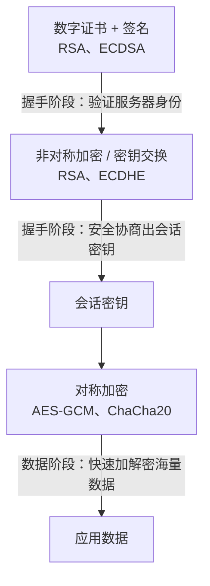
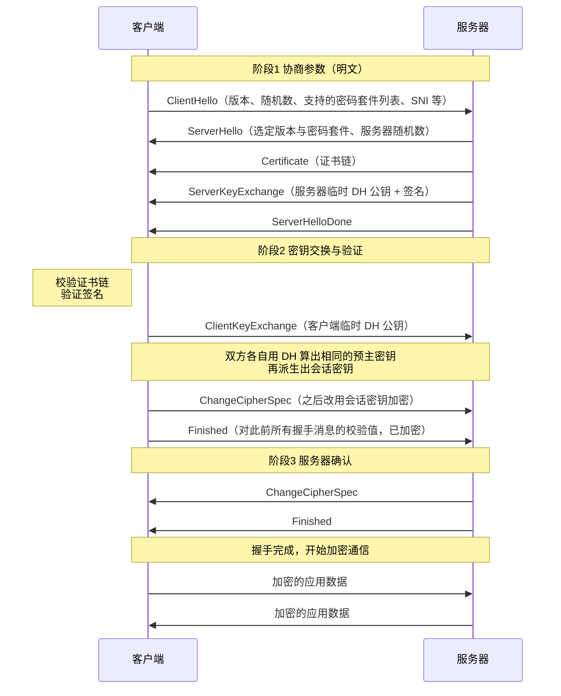
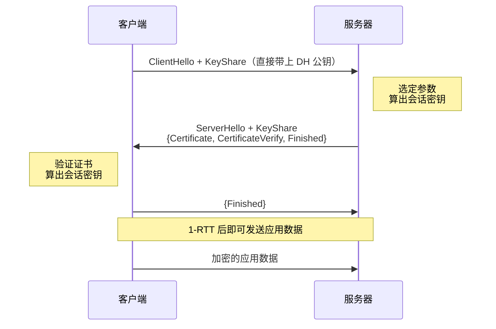
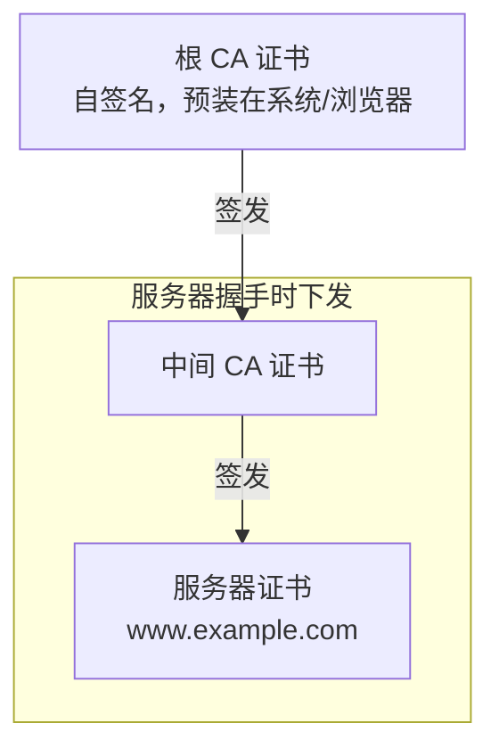
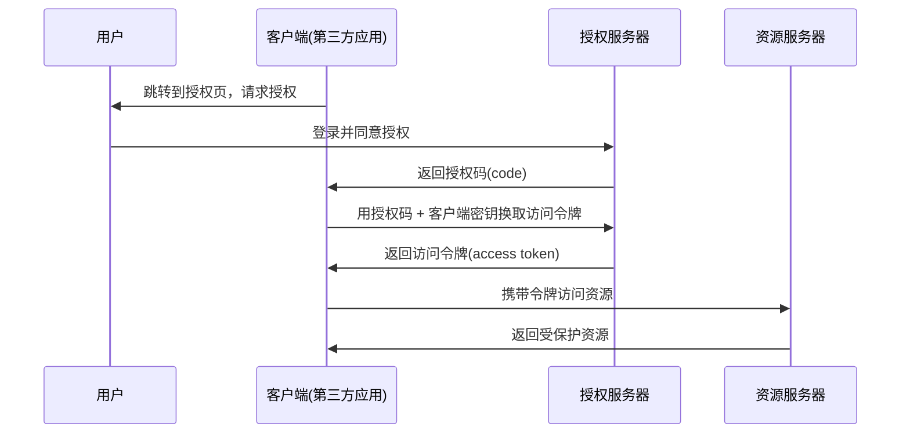

# 2.6 应用层：应用层安全

## 目录

1. [应用层安全概述](#应用层安全概述)
2. [TLS/SSL协议](#tlsssl协议)（含握手过程、密码套件、HTTPS）
3. [数字证书和PKI](#数字证书和pki)
4. [应用层安全技术](#应用层安全技术)
5. [Web应用安全威胁](#web应用安全威胁)

---

## 应用层安全概述

网络通信默认是"明文裸奔"的：IP 分组在沿途任何一跳都可能被窥探、篡改或伪造。应用层安全的目标，就是在不可信的网络之上，为应用数据建立一条机密、可验证、防篡改的通道——最典型的实现就是 TLS。

> 本节讲的是协议层面的"安全怎么落地"（TLS 握手、证书、PKI、HTTPS）。背后的加密原理（对称/非对称加密、散列、数字签名）见 **[2.8 应用层：密码学基础](2.8应用层：密码学基础.md)**。

### 安全威胁

按攻击者是否主动改动流量，分为两类。

**被动攻击**：只读不改，难以察觉，靠加密防范。
- **窃听(Eavesdropping)**：截获通信内容，读取敏感信息。
- **流量分析(Traffic Analysis)**：即便内容已加密，仍可从通信双方、频率、包长等元数据推测信息。

**主动攻击**：篡改或注入流量，靠认证与完整性校验防范。
- **伪装(Masquerading)**：冒充合法用户或服务器（如假冒网站）。
- **重放攻击(Replay)**：重复发送截获的合法消息，骗取重复操作。
- **篡改(Modification)**：修改传输中的数据，破坏完整性。
- **中间人(MITM)**：插在双方之间，同时对两端伪装，转发并可篡改流量。
- **拒绝服务(DoS)**：耗尽资源，使合法用户无法访问。

### 四类安全目标

| 目标 | 解决的问题 | 主要手段 |
|------|-----------|---------|
| 机密性(Confidentiality) | 数据不被第三方读取 | 对称/非对称加密 |
| 完整性(Integrity) | 数据未被篡改 | 散列、消息认证码(MAC) |
| 认证(Authentication) | 对方身份真实 | 数字证书、数字签名 |
| 不可否认性(Non-repudiation) | 事后无法抵赖 | 数字签名 |

注：TLS 同时提供前三项；不可否认性需要数字签名，TLS 本身的设计目标并不包含它（双方共享会话密钥，无法向第三方证明某条消息出自对端）。

---

## TLS/SSL协议

> **TLS(Transport Layer Security)**
> 
> 介于应用层与传输层之间的安全协议，为上层应用提供加密、完整性校验和身份认证。它工作在 TCP 之上，对应用（如 HTTP）几乎透明——HTTP 套上 TLS 就是 HTTPS。

### 一张图看懂 TLS 的密码学组合

TLS 把三类密码学工具组合起来用，各司其职（原理详见 [2.8 密码学基础](2.8应用层：密码学基础.md)）：


```mermaid
graph TD
    A[非对称加密 / 密钥交换<br/>RSA、ECDHE] -->|握手阶段：安全协商出会话密钥| K[会话密钥]
    K --> B[对称加密<br/>AES-GCM、ChaCha20]
    B -->|数据阶段：快速加解密海量数据| D[应用数据]
    C[数字证书 + 签名<br/>RSA、ECDSA] -->|握手阶段：验证服务器身份| A
```

一句话：**用慢但能解决"密钥分发"的非对称加密，安全地协商出一把对称密钥；之后用快的对称加密传数据；证书则保证"对端公钥确实属于它声称的身份"。** 这种"非对称协商密钥 + 对称传数据"的组合即**混合加密**。

> 易混：非对称加密慢，所以**不用它加密业务数据**，只用来在握手阶段交换/协商对称密钥。

### TLS 版本演进

| 版本 | 年份 | 状态 |
|------|------|------|
| SSL 1.0 | — | 未公开发布 |
| SSL 2.0 | 1995 | 已弃用（严重漏洞） |
| SSL 3.0 | 1996 | 已弃用（POODLE 攻击） |
| TLS 1.0 / 1.1 | 1999 / 2006 | 已弃用（2021 年起主流浏览器移除） |
| TLS 1.2 | 2008 | 广泛使用 |
| TLS 1.3 | 2018 | 当前推荐，握手更快、强制前向安全 |

注："SSL"是 TLS 的旧称，TLS 1.0 实际就是 SSL 3.1。今天口头说的"SSL 证书""SSL 配置"基本都指 TLS。

### TLS 协议架构

TLS 内部分两层：

- **记录层(Record Protocol)**：直接架在 TCP 上，负责把上层消息分片、加密、加 MAC，再交给 TCP。
- **握手层**：跑在记录层之上，包含四个子协议——
  - **握手协议(Handshake)**：协商版本与密码套件、交换密钥、验证身份。
  - **密码变更协议(Change Cipher Spec)**：通知对方"后续消息开始用新协商的密钥加密"（TLS 1.3 已取消）。
  - **告警协议(Alert)**：传递错误与关闭通知。
  - **应用数据协议(Application Data)**：承载加密后的应用层数据。

### TLS握手过程详解

#### TLS 1.2完整握手过程

握手要在不安全的信道上完成四件事：**协商密码套件、交换密钥材料、验证服务器身份、用 Finished 互相确认握手未被篡改**。

下图是 TLS 1.2 + ECDHE 密钥交换的完整握手（这是当前最常见的组合，因此服务器会发 ServerKeyExchange 携带临时 DH 公钥）：


```mermaid
sequenceDiagram
    participant C as 客户端
    participant S as 服务器

    Note over C,S: 阶段1 协商参数（明文）
    C->>S: ClientHello（版本、随机数、支持的密码套件列表、SNI 等）
    S->>C: ServerHello（选定版本与密码套件、服务器随机数）
    S->>C: Certificate（证书链）
    S->>C: ServerKeyExchange（服务器临时 DH 公钥 + 签名）
    S->>C: ServerHelloDone

    Note over C,S: 阶段2 密钥交换与验证
    Note left of C: 校验证书链<br/>验证签名
    C->>S: ClientKeyExchange（客户端临时 DH 公钥）
    Note over C,S: 双方各自用 DH 算出相同的预主密钥<br/>再派生出会话密钥
    C->>S: ChangeCipherSpec（之后改用会话密钥加密）
    C->>S: Finished（对此前所有握手消息的校验值，已加密）

    Note over C,S: 阶段3 服务器确认
    S->>C: ChangeCipherSpec
    S->>C: Finished

    Note over C,S: 握手完成，开始加密通信
    C->>S: 加密的应用数据
    S->>C: 加密的应用数据
```

> 注：上图是 ECDHE 套件。若用已淘汰的 RSA 密钥交换，则没有 ServerKeyExchange——客户端直接用证书里的服务器公钥加密预主密钥发过去。RSA 方式不具前向安全，TLS 1.3 已彻底移除。

#### 各消息的作用

| 消息 | 方向 | 关键内容与作用 |
|------|------|---------------|
| ClientHello | C→S | 支持的 TLS 版本、客户端随机数(32 字节)、按优先级排列的密码套件列表、扩展（SNI、supported_groups、signature_algorithms 等） |
| ServerHello | S→C | 服务器从客户端列表中**选定**的版本与密码套件、服务器随机数(32 字节) |
| Certificate | S→C | 服务器证书链（服务器证书 + 中间 CA 证书，根证书一般不发） |
| ServerKeyExchange | S→C | ECDHE 套件下携带服务器临时 DH 公钥，并用证书私钥签名（证明公钥确实出自证书持有者） |
| ServerHelloDone | S→C | 服务器本轮消息发送完毕 |
| ClientKeyExchange | C→S | ECDHE 下携带客户端临时 DH 公钥；RSA 下携带用服务器公钥加密的预主密钥 |
| ChangeCipherSpec | 双向 | 通知对方"后续消息改用刚协商的会话密钥加密" |
| Finished | 双向 | 对此前**所有握手消息**的校验值，已用会话密钥加密。任何一方算不对，说明握手被篡改，立即中断 |

> 客户端随机数 + 服务器随机数都是 32 字节明文，二者连同预主密钥一起参与派生会话密钥，确保即使预主密钥相同，每次会话的密钥也不同（抗重放）。

#### 会话密钥是怎么派生出来的

握手并不直接传输会话密钥，而是双方各自由相同的输入算出来：

```
预主密钥(Pre-Master Secret)
  · RSA 交换：客户端随机生成，用服务器公钥加密后发送
  · ECDHE 交换：双方用各自临时私钥 + 对方临时公钥，独立算出相同值（密钥从不上网）
            │
            ▼
主密钥(Master Secret) = PRF(预主密钥, "master secret", 客户端随机数 + 服务器随机数)
            │
            ▼
密钥块 Key Block = PRF(主密钥, "key expansion", 服务器随机数 + 客户端随机数)
            │
            ▼
切分出收发两个方向各自的：加密密钥、MAC 密钥、IV
```

其中 PRF（伪随机函数）在 TLS 1.2 基于 HMAC-SHA256（具体散列由密码套件决定）。

> ECDHE 的关键优势：双方的临时私钥握手后即丢弃，会话密钥无法事后重建。即使将来服务器长期私钥泄露，攻击者也无法解密历史流量——这就是**前向安全(Forward Secrecy)**。RSA 密钥交换则做不到，因为预主密钥是用长期公钥加密的，私钥一旦泄露，所有历史流量都能被解密。

#### TLS 1.3 简化握手

TLS 1.3 把握手从 **2-RTT 压到 1-RTT**：客户端在 ClientHello 里就**预先猜测**对方会选的密钥交换组并直接附上自己的 KeyShare（DH 公钥），省掉了 1.2 里"先协商组、再交换公钥"的一个来回。


```mermaid
sequenceDiagram
    participant C as 客户端
    participant S as 服务器

    C->>S: ClientHello + KeyShare（直接带上 DH 公钥）
    Note right of S: 选定参数<br/>算出会话密钥
    S->>C: ServerHello + KeyShare<br/>{Certificate, CertificateVerify, Finished}
    Note left of C: 验证证书<br/>算出会话密钥
    C->>S: {Finished}
    Note over C,S: 1-RTT 后即可发送应用数据
    C->>S: 加密的应用数据
```

> `{...}` 表示该消息已加密。TLS 1.3 从 ServerHello 之后就开始加密握手消息（连证书都加密），隐私更好；1.2 的证书是明文。

**相比 1.2 的主要变化**：
1. **握手提速**：常规握手 1-RTT；会话恢复支持 0-RTT（首个数据包零往返）。
2. **强制前向安全**：只保留 (EC)DHE，移除了 RSA、静态 DH 密钥交换。
3. **精简算法**：移除 SHA-1、MD5、RC4、CBC 模式、压缩、重新协商等历史包袱，密码套件只剩 5 个 AEAD 套件。
4. **更多内容加密**：证书等握手信息也加密，增强隐私。

> 易混：1-RTT 指**常规握手**只需一个往返；**0-RTT** 是会话恢复时的特例（用上次留下的密钥直接在第一个包里带数据），存在重放风险，仅适合幂等操作。

### TLS 用到的密码学算法

| 类别 | 推荐算法 | 已淘汰 |
|------|---------|--------|
| 密钥交换 | ECDHE、DHE（带前向安全） | RSA、静态 DH |
| 身份认证（签名） | RSA、ECDSA、EdDSA | — |
| 对称加密 | AES-GCM、ChaCha20-Poly1305 | RC4、3DES、CBC 模式 |
| 散列 / 完整性 | SHA-256/384、AEAD 内置 | MD5、SHA-1 |

注：AES-GCM 和 ChaCha20-Poly1305 都是 **AEAD（带认证的加密）**，加密与完整性校验一步完成，不再需要单独的 HMAC，这也是它们取代"CBC + HMAC"老组合的原因。

### 读懂密码套件

密码套件用一串名字声明这次连接用哪些算法。以 TLS 1.2 为例：

```
TLS_ECDHE_RSA_WITH_AES_256_GCM_SHA384
 │     │    │       │       │     │
协议  密钥  身份    对称   加密   PRF/完整性
     交换  认证   加密算法 模式   散列
```

- **ECDHE**：密钥交换用临时椭圆曲线 DH（前向安全）
- **RSA**：服务器用 RSA 证书做身份认证（签名）
- **AES_256_GCM**：数据用 256 位 AES 的 GCM 模式加密
- **SHA384**：用于密钥派生与完整性的散列

**TLS 1.3 的套件名简化了**——因为密钥交换和签名算法改由扩展单独协商，套件里只剩对称加密和散列：

```
TLS_AES_256_GCM_SHA384
TLS_AES_128_GCM_SHA256
TLS_CHACHA20_POLY1305_SHA256
```

### 安全配置要点

实际部署时，配置原则比具体的 Apache/Nginx 指令更值得记。一份合格的 TLS 配置应做到：

- **只开 TLS 1.2 / 1.3**，关掉所有 SSL 和 TLS 1.0/1.1。
- **优先选前向安全套件**（ECDHE/DHE + AEAD），禁用 RC4、3DES、CBC、MD5。
- **下发完整证书链**（服务器证书 + 中间 CA），否则部分客户端会因"无法验证第一张证书"而失败。
- **启用 HSTS**，强制浏览器后续一律走 HTTPS，防降级。
- **启用 OCSP Stapling**，由服务器代取证书吊销状态，省去客户端单独查询。

> 自查工具：浏览器开发者工具的安全面板、`openssl s_client -connect 域名:443`、以及在线的 SSL Labs 测试，都能快速看出版本、套件和证书链是否合规。

### 常见攻击与防护

| 攻击 | 原理 | 防护 |
|------|------|------|
| 中间人(MITM) | 攻击者插在双方之间，伪造证书冒充服务器 | 证书校验、证书透明度(CT)、（移动端）证书锁定 |
| 降级攻击 | 诱导双方协商更弱的协议/算法 | 禁用旧版本与弱套件；TLS 1.3 在握手中加入版本校验 |
| 重放攻击 | 重发截获的合法消息 | 随机数 + 序列号；TLS 1.3 的 0-RTT 数据需特别防范 |

**前向安全(Forward Secrecy)** 是这里反复出现的关键词：用 ECDHE/DHE 临时密钥交换，使长期私钥泄露也无法解密历史流量。这是禁用 RSA 密钥交换、推荐 ECDHE 的根本原因（详见前文密钥派生小节）。

### 典型例题

#### 题目1：TLS握手分析

> **例题**：分析下面的TLS握手流程，指出哪一步出现问题并说明原因。
> 
> 1. Client → Server: ClientHello
> 2. Server → Client: ServerHello, Certificate
> 3. Client → Server: ClientKeyExchange, Finished
> 4. Server → Client: Finished

**分析**：
- **问题**：缺少ChangeCipherSpec消息
- **原因**：在步骤3和4中，双方直接发送Finished消息而没有先发送ChangeCipherSpec来激活新的密码参数
- **正确流程**：应该在Finished之前发送ChangeCipherSpec

#### 题目2：密码套件选择

> **例题**：给定以下密码套件，按安全性从高到低排序：
> 1. TLS_RSA_WITH_AES_128_CBC_SHA
> 2. TLS_ECDHE_RSA_WITH_AES_256_GCM_SHA384
> 3. TLS_RSA_WITH_3DES_EDE_CBC_SHA
> 4. TLS_ECDHE_ECDSA_WITH_CHACHA20_POLY1305_SHA256

**答案**：4 > 2 > 1 > 3

**解析**（关键看两点：是否前向安全、对称算法是否现代 AEAD）：
- **4 最强**：ECDHE（前向安全）+ ECDSA + ChaCha20-Poly1305（现代 AEAD）。
- **2 次之**：ECDHE（前向安全）+ AES-256-GCM（AEAD），与 4 同级，仅算法选择不同。
- **1 较弱**：RSA 密钥交换，无前向安全；AES-128-CBC + SHA1 是已不推荐的老组合。
- **3 最弱**：RSA 无前向安全，且 3DES 已淘汰。

#### 题目3：证书验证

> **例题**：客户端访问https://mail.example.com时收到CN=*.example.com的通配符证书，这种情况下连接是否安全？为什么？

**分析**：连接可以建立。
- 通配符 `*.example.com` 能匹配 `mail.example.com`，证书有效期内且由可信 CA 签发，链路完整。
- 关键规则：**通配符只匹配一级子域名**——`*.example.com` 匹配 `mail.example.com`，但**不**匹配 `sub.mail.example.com`（二级），也不匹配裸域 `example.com`。

> 注：现代浏览器做域名匹配看的是证书 SAN 扩展，CN 已被忽略；题中 `CN=*.example.com` 是传统写法，实际签发时通配符也会写进 SAN。通配符证书一张覆盖多个子域，方便但安全性略弱于专用证书（一旦泄露影响面更大）。

### HTTPS：HTTP over TLS

HTTPS 就是把 HTTP 报文交给 TLS 加密后再走 TCP——协议栈里多插了一层：

```
HTTP 请求/响应
      │
   TLS 加密层（本节重点）
      │
   TCP / IP
```

对应用而言几乎透明：浏览器和服务器照常收发 HTTP，只是中间的字节都被 TLS 加密、加了完整性校验。HTTPS 的机密性、完整性、身份认证全部由 TLS 提供（即上文的对称加密、MAC/AEAD、证书与 PKI）。

> HTTPS 在 HTTP 层面的细节（端口 443、与 HTTP 的对比、迁移实践等）见 **[2.2 应用层：万维网和HTTP技术](2.2应用层：万维网和HTTP技术.md#https协议详解)**。

---

## 数字证书和PKI

### 公钥基础设施(PKI)

> **PKI(Public Key Infrastructure)**
> 
> 围绕"公钥到底属于谁"这个核心问题建立的一整套体系：由可信第三方（CA）为公钥与身份的绑定关系背书，并负责证书的颁发、分发、撤销与验证。

证书要解决的根本问题是：客户端拿到一个公钥，怎么确信它真的属于 `www.example.com` 而不是中间人伪造的？PKI 的答案是——让一个大家都信任的 CA 用自己的私钥给"公钥 + 身份"签名，签出来的就是数字证书。

**PKI 的主要角色**：

- **证书颁发机构(CA)**：验证申请者身份后签发证书，并维护吊销信息。常见 CA 如 DigiCert、Let's Encrypt（免费、自动化）。
- **注册机构(RA)**：代 CA 受理申请、核验身份，常作为 CA 的前端环节。
- **证书吊销机制(CRL / OCSP)**：证书在到期前若需作废（如私钥泄露），通过吊销列表或在线查询通知客户端。

### 数字证书

#### X.509 证书内容

数字证书采用 X.509 格式，核心字段可概括为"**谁的公钥、由谁担保、担保到什么时候、签名为证**"：

- **主体(Subject)**：证书持有者，含域名等身份信息。
- **公钥信息**：主体的公钥（握手时客户端就用它验证服务器）。
- **颁发者(Issuer)**：签发本证书的 CA。
- **有效期**：生效与过期时间。
- **序列号 / 签名算法**：CA 分配的唯一标识与所用签名算法。
- **扩展(Extensions)**：附加约束，常见的有：
  - **SAN（主体备用名称）**：证书覆盖的域名列表。**现代浏览器只看 SAN，不再看 CN**，是域名匹配的依据。
  - **Key Usage / Extended Key Usage**：限定公钥用途（如"仅用于 TLS 服务器认证"）。
  - **Basic Constraints**：标明这是否为 CA 证书（能否再签发下级证书）。
- **CA 的数字签名**：对以上全部内容签名，任何篡改都会导致验签失败。

```
Subject:            CN=www.example.com, O=Example Corp
Issuer:             CN=DigiCert TLS RSA SHA256 2020 CA1
Validity:           2024-01-01 ~ 2025-01-01
Subject Alt Name:   DNS:www.example.com, DNS:mail.example.com
Key Usage:          Digital Signature, Key Encipherment
Extended Key Usage: TLS Web Server Authentication
```

### 证书链与信任模型

浏览器不可能预存全世界每个网站的证书，只预存了少量**根 CA 证书**。其余证书通过"链式签名"逐级追溯到某个根 CA——这就是信任链：


```mermaid
graph TD
    R[根 CA 证书<br/>自签名，预装在系统/浏览器] -->|签发| I[中间 CA 证书]
    I -->|签发| E[服务器证书<br/>www.example.com]

    subgraph 服务器握手时下发
    I
    E
    end
```

> 根证书很宝贵，CA 一般不直接用根私钥签终端证书，而是先签出中间 CA，再由中间 CA 签终端证书。这样根私钥离线保存更安全，中间 CA 出问题也只需吊销一层。

**客户端的验证过程（自下而上）**：

1. 用证书链里中间 CA 的公钥，验证服务器证书的签名。
2. 用预装的根 CA 公钥，验证中间 CA 证书的签名。
3. 链条顶端的根 CA 在本机受信任列表里 → 信任建立。
4. 同时检查：**域名是否匹配**（证书 SAN 是否含访问的域名）、**是否在有效期内**、**是否被吊销**。

> 易混：证书"可信"不等于"安全"。即使证书链完整有效，若域名对不上（拿 `a.com` 的证书访问 `b.com`），浏览器照样报错——这正是防中间人冒充的关键一环。

根 CA 的信任由各操作系统/浏览器维护的**根证书库**决定（Windows、macOS、iOS/Android、Firefox 各有一套）。此外还有两道补强：**证书透明度(CT)** 要求 CA 把签发记录公开记账，便于发现误签/冒签；移动 App 可用**证书锁定(Pinning)** 只认特定证书，进一步收紧信任范围。

### 证书吊销机制

证书在到期前可能因私钥泄露等原因需要提前作废。客户端如何得知某证书已被吊销？有两种思路：

| 机制 | 做法 | 问题 |
|------|------|------|
| **CRL**（吊销列表） | CA 定期发布"已吊销序列号"清单，客户端下载比对 | 文件大、更新不及时 |
| **OCSP**（在线查询） | 客户端就单张证书实时向 OCSP 响应器查询状态 | 增加一次往返，且暴露用户访问了哪个站点（隐私） |

**OCSP Stapling** 是对 OCSP 的优化：由**服务器**预先向 CA 取得带时间戳签名的 OCSP 响应，在 TLS 握手时一并"钉"给客户端。客户端无需自己再去查询，既省一次往返，也避免隐私泄露。

---

## 应用层安全技术

### HTTP 安全响应头

服务器通过响应头指挥浏览器加固防护，是成本极低的一道防线：

| 响应头 | 作用 | 防御 |
|--------|------|------|
| `Strict-Transport-Security`(HSTS) | 强制浏览器今后只走 HTTPS | 协议降级、明文中间人 |
| `Content-Security-Policy`(CSP) | 限定脚本/样式/资源只能从白名单来源加载 | XSS |
| `X-Frame-Options` / CSP `frame-ancestors` | 禁止页面被嵌入 iframe | 点击劫持 |
| `X-Content-Type-Options: nosniff` | 禁止浏览器擅自猜测 MIME 类型 | MIME 嗅探 |
| `Set-Cookie: HttpOnly; Secure; SameSite` | Cookie 防脚本读取、只走 HTTPS、限制跨站携带 | XSS 窃取 Cookie、CSRF |

典型 HSTS 与 CSP 示例：

```http
Strict-Transport-Security: max-age=31536000; includeSubDomains; preload
Content-Security-Policy: default-src 'self'; script-src 'self' https://apis.google.com
```

### 现代认证技术

#### OAuth 2.0

> **OAuth 2.0**
> 
> 一个**授权**框架：让第三方应用在用户授权下访问其资源，而不必拿到用户的账号密码。例如某 App 想读你的相册，你授权后它拿到的是一个有限权限的"访问令牌"，而非你的密码。

涉及四个角色：**资源所有者**（用户）、**客户端**（第三方应用）、**授权服务器**（签发令牌）、**资源服务器**（存放受保护资源）。最常见的"授权码"流程如下：


```mermaid
sequenceDiagram
    participant U as 用户
    participant App as 客户端(第三方应用)
    participant Auth as 授权服务器
    participant API as 资源服务器

    App->>U: 跳转到授权页，请求授权
    U->>Auth: 登录并同意授权
    Auth->>App: 返回授权码(code)
    App->>Auth: 用授权码 + 客户端密钥换取访问令牌
    Auth->>App: 返回访问令牌(access token)
    App->>API: 携带令牌访问资源
    API->>App: 返回受保护资源
```

> 关键设计：用户密码只在授权服务器处输入，第三方应用全程拿不到；多用一步"授权码换令牌"，是为了让令牌经服务器后端而非浏览器 URL 传递，更安全。

#### JWT(JSON Web Token)

JWT 是一种自包含的令牌格式，常作为 OAuth/OIDC 的令牌载体，由三段 Base64 用 `.` 连接：

```
Header.Payload.Signature
  头部     载荷    签名
```

- **Header**：声明签名算法。
- **Payload**：存放声明（用户 ID、过期时间等），**仅 Base64 编码、未加密**，任何人可解读。
- **Signature**：对前两段的签名，防篡改。

> 易混：JWT 默认只签名不加密，所以**别往 Payload 里放敏感信息**。它的价值是"无状态"——服务器靠验证签名即可信任令牌内容，无需在服务端存会话，适合分布式/跨服务场景。

#### OpenID Connect (OIDC)

OAuth 2.0 本身只管**授权**（"能不能访问这个资源"），不解决**认证**（"你是谁"）。OIDC 在 OAuth 2.0 之上加了一层身份认证，签发携带用户身份信息的 ID Token（一个 JWT），是"用某某账号登录"这类第三方登录的标准。

> 易混：OAuth 2.0 解决授权，OIDC 在其上补充认证。

### Web 应用防火墙(WAF)

WAF 部署在客户端与 Web 服务器之间，按规则检查 HTTP 请求，拦截 SQL 注入、XSS 等已知攻击特征，并可做速率限制、IP 黑白名单等访问控制。它是应用代码自身安全之外的一道补充防线，不能替代代码层面的修复。常见形态有硬件/软件设备、云 WAF 和集成在服务器中的模块。

---

## Web应用安全威胁

### OWASP Top 10

OWASP Top 10 是业界公认的 Web 应用最严重安全风险榜单。2021 版完整十项如下：

| 编号 | 风险 | 核心问题 |
|------|------|---------|
| A01 | 失效的访问控制 | 用户能越权访问/操作本不该访问的资源 |
| A02 | 加密机制失效 | 敏感数据未加密、或用了弱算法/弱密钥 |
| A03 | 注入 | SQL/命令/LDAP 注入，未隔离用户输入与代码 |
| A04 | 不安全设计 | 设计阶段缺失安全考量、业务逻辑漏洞 |
| A05 | 安全配置错误 | 默认口令、多余功能开启、错误权限 |
| A06 | 易受攻击和过时的组件 | 使用了有已知漏洞的库/框架 |
| A07 | 身份认证与会话管理失效 | 弱口令、会话固定、凭证泄露 |
| A08 | 软件和数据完整性失效 | 不可信来源的更新/反序列化未校验 |
| A09 | 安全日志与监控失效 | 攻击未被记录或察觉 |
| A10 | 服务端请求伪造(SSRF) | 服务器被诱导向内网/任意地址发起请求 |

下面挑几个与应用层最相关、考试常考的具体攻击展开。

### 常见 Web 攻击

#### 注入攻击（以 SQL 注入为例）

把用户输入直接拼进 SQL 语句执行，攻击者便能改变查询语义：

```sql
-- 期望：SELECT * FROM users WHERE name='输入'
-- 输入 ' OR '1'='1 后变成：
SELECT * FROM users WHERE name='' OR '1'='1'   -- 恒真，绕过过滤
```

**根治办法是参数化查询（预编译）**——让数据永远作为参数而非代码，配合输入校验和最小权限数据库账户。

#### 跨站脚本(XSS)

攻击者把恶意脚本注入网页，在**其他用户**的浏览器里执行（窃取 Cookie、冒充操作）。

- **反射型**：脚本藏在 URL 参数里，随响应"反射"回来。
- **存储型**：脚本被存进服务器（如评论），所有访问者中招，危害最大。
- **DOM 型**：完全在前端 JS 操作 DOM 时引入，不经过服务器。

防护：**输出编码**（把 `<>` 等转义）是核心，辅以输入校验、CSP、给 Cookie 设 HttpOnly（使脚本读不到 Cookie）。

#### 跨站请求伪造(CSRF)

诱导**已登录**用户在不知情下，向目标站点发出带其身份的请求（如转账）。攻击利用的是浏览器会自动携带 Cookie 这一点。

防护：**CSRF Token**（请求需带服务器下发的随机令牌，攻击者拿不到）、Cookie 设 **SameSite** 属性、关键操作二次确认。

#### 点击劫持(Clickjacking)

用透明 iframe 把目标页盖在伪装界面之上，诱导用户"点空白处"，实际点的是目标页按钮。

防护：响应头 `X-Frame-Options: DENY` 或 CSP 的 `frame-ancestors`，禁止页面被嵌入 iframe。

> 易混：XSS 是"让受害者浏览器执行攻击者的脚本"；CSRF 是"借受害者的登录身份发请求"，攻击者并不需要执行脚本，也看不到响应。

---
 
**[下一节：2.7 套接字编程](2.7应用层：套接字编程.md)**
