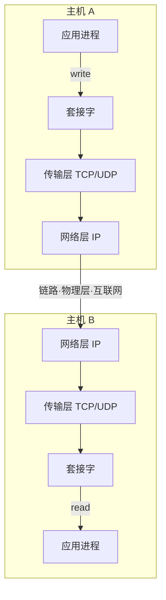
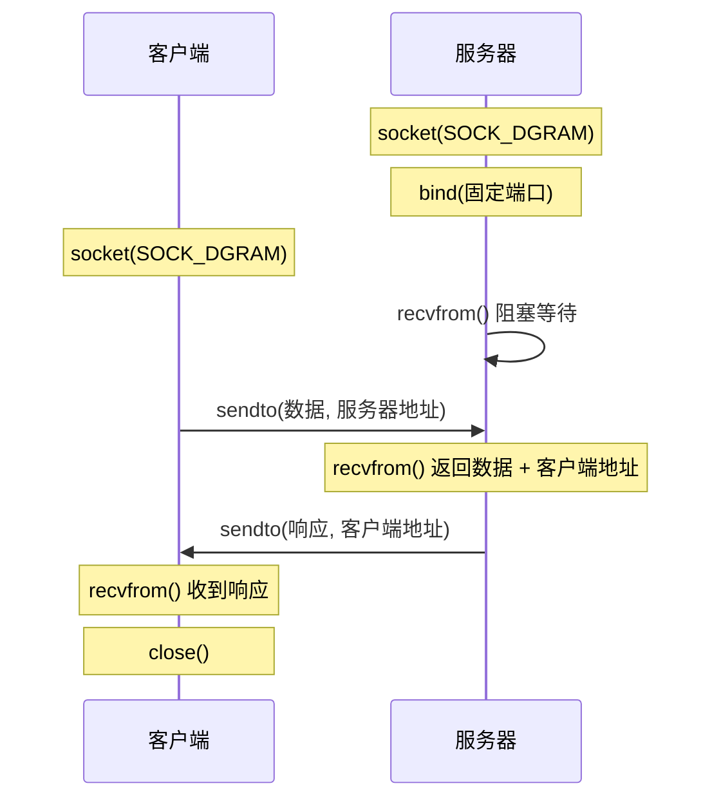
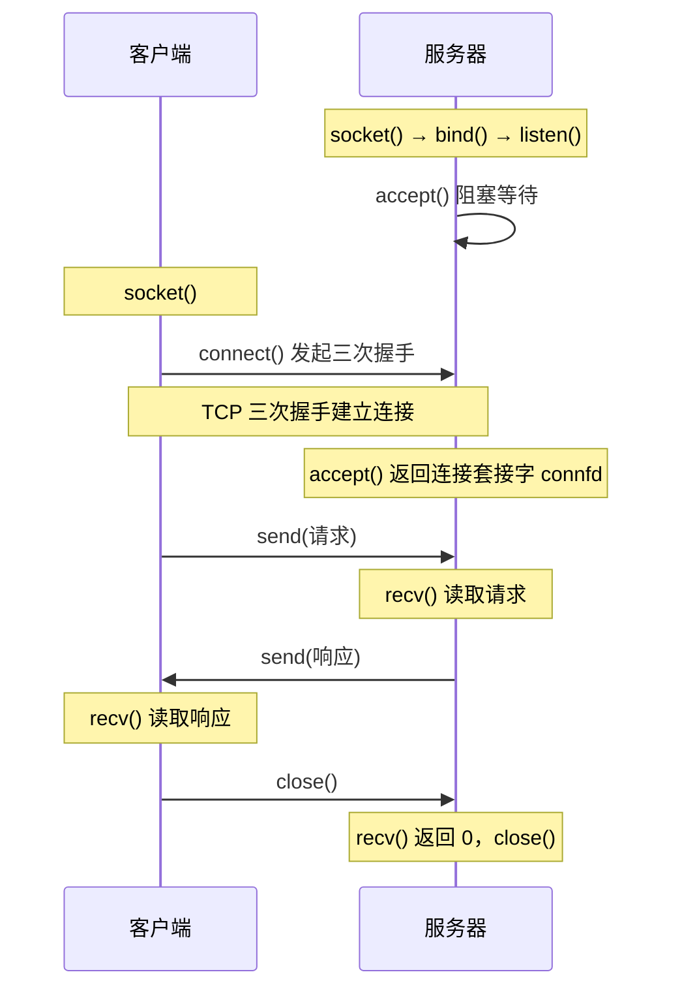

# 2.7 应用层：套接字编程

## 目录

1. [套接字编程基础](#套接字编程基础)
2. [UDP套接字编程](#udp套接字编程)
3. [TCP套接字编程](#tcp套接字编程)
4. [高级套接字编程](#高级套接字编程)
5. [网络编程实践](#网络编程实践)
6. [现代网络编程技术](#现代网络编程技术)

---

## 套接字编程基础

### 套接字概念

> **套接字(Socket)**
> 
> 套接字是应用进程与传输层协议之间的接口，是应用程序与网络之间的 API（应用程序编程接口）。

应用进程把要发送的数据写入套接字，数据经传输层、网络层、链路层送出；对端按相反顺序逐层上交，最终从套接字读出。套接字就是这道"门"，门里是应用进程，门外是由操作系统内核实现的传输设施。



> 注：套接字以**文件描述符**的形式存在，应用程序对它的读写和对文件的读写在接口上很相似，这也是"一切皆文件"思想的体现。

#### 套接字类型

**按协议分类**：
- **TCP套接字**：可靠、字节流服务 (SOCK_STREAM)
- **UDP套接字**：不可靠、数据报服务 (SOCK_DGRAM)

**按地址族分类**：
- **AF_INET**：IPv4地址族
- **AF_INET6**：IPv6地址族
- **AF_UNIX**：Unix域套接字（本地通信）

#### 套接字地址结构

**IPv4套接字地址**：
```c
struct sockaddr_in {
    sa_family_t     sin_family;     /* 地址族 AF_INET */
    in_port_t       sin_port;       /* 端口号 */
    struct in_addr  sin_addr;       /* IPv4地址 */
    char            sin_zero[8];    /* 填充字段 */
};
```

**通用套接字地址**：
```c
struct sockaddr {
    sa_family_t sa_family;          /* 地址族 */
    char        sa_data[14];        /* 地址数据 */
};
```

### 基本套接字函数

#### 套接字创建

**socket()函数**：
```c
int socket(int family, int type, int protocol);
```

**参数说明**：
- **family**：地址族（AF_INET、AF_INET6）
- **type**：套接字类型（SOCK_STREAM、SOCK_DGRAM）
- **protocol**：协议（通常为0，自动选择）

**返回值**：成功返回套接字描述符，失败返回-1

#### 地址转换函数

**inet_pton()函数**：
```c
int inet_pton(int family, const char *strptr, void *addrptr);
```
将字符串IP地址转换为网络字节序的二进制值

**inet_ntop()函数**：
```c
const char *inet_ntop(int family, const void *addrptr, char *strptr, size_t len);
```
将网络字节序的二进制地址转换为字符串

**示例**：
```c
struct sockaddr_in servaddr;
servaddr.sin_family = AF_INET;
servaddr.sin_port = htons(80);
inet_pton(AF_INET, "192.168.1.1", &servaddr.sin_addr);
```

#### 字节序转换

**网络字节序转换**：
```c
uint16_t htons(uint16_t host16bitvalue);    /* 主机到网络短整型 */
uint32_t htonl(uint32_t host32bitvalue);    /* 主机到网络长整型 */
uint16_t ntohs(uint16_t net16bitvalue);     /* 网络到主机短整型 */
uint32_t ntohl(uint32_t net32bitvalue);     /* 网络到主机长整型 */
```

网络字节序统一采用**大端**，而主机字节序依赖具体硬件架构（x86 是小端）。因此端口号、IP 地址等多字节字段在写入套接字地址结构前必须用上面的函数转换，否则两端解释不一致。

---

## UDP套接字编程

UDP 发送方和接收方之间没有连接，发送数据前没有握手；发送方为每段数据明确地附上目标地址，因此客户端不需要 `connect()`，每次发送都通过 `sendto()` 指定目的地。

### UDP编程模型

UDP 的 API 调用很简洁：服务器创建套接字、`bind()` 到固定端口后，就反复用 `recvfrom()` 收数据、`sendto()` 回数据；客户端连 `bind()` 都可以省略，直接 `sendto()` 即可（端口由内核临时分配）。`recvfrom()` 会同时返回发送方地址，服务器据此知道该把响应回给谁。



> 易混：UDP 没有连接，`recvfrom()/sendto()` 每次都带对端地址；下面的 TCP 则先建立连接，之后用 `send()/recv()` 不再重复指定地址。

### UDP服务器编程

#### 完整的UDP服务器示例

```python
import socket

def udp_server():
    # 创建UDP套接字
    server_socket = socket.socket(socket.AF_INET, socket.SOCK_DGRAM)
    
    # 绑定服务器地址和端口
    server_port = 12000
    server_socket.bind(('', server_port))
    
    print("UDP服务器已启动，等待数据...")  # UDP 无连接，这里等的是数据报而非连接
    print(f"服务器监听端口：{server_port}")
    
    while True:
        try:
            # 接收客户端数据
            message, client_address = server_socket.recvfrom(2048)
            print(f"接收到来自 {client_address} 的消息：{message.decode()}")
            
            # 处理数据（转换为大写）
            modified_message = message.decode().upper()
            
            # 发送响应给客户端
            server_socket.sendto(modified_message.encode(), client_address)
            print(f"已发送响应：{modified_message}")
            
        except KeyboardInterrupt:
            print("\n服务器正在关闭...")
            break
        except Exception as e:
            print(f"服务器错误：{e}")
    
    server_socket.close()

if __name__ == "__main__":
    udp_server()
```

#### C语言UDP服务器示例

```c
#include <sys/socket.h>
#include <netinet/in.h>
#include <arpa/inet.h>
#include <unistd.h>
#include <string.h>
#include <strings.h>    /* bzero */
#include <stdio.h>
#include <ctype.h>

#define MAXLINE 4096
#define SERV_PORT 12000

void str_echo(int sockfd, struct sockaddr *pcliaddr, socklen_t clilen) {
    int n;
    socklen_t len;
    char mesg[MAXLINE];
    
    for (;;) {
        len = clilen;
        n = recvfrom(sockfd, mesg, MAXLINE, 0, pcliaddr, &len);
        
        // 转换为大写
        for (int i = 0; i < n; i++) {
            mesg[i] = toupper(mesg[i]);
        }
        
        sendto(sockfd, mesg, n, 0, pcliaddr, len);
    }
}

int main() {
    int sockfd;
    struct sockaddr_in servaddr, cliaddr;
    
    // 创建套接字
    sockfd = socket(AF_INET, SOCK_DGRAM, 0);
    
    // 设置服务器地址
    bzero(&servaddr, sizeof(servaddr));
    servaddr.sin_family = AF_INET;
    servaddr.sin_addr.s_addr = htonl(INADDR_ANY);
    servaddr.sin_port = htons(SERV_PORT);
    
    // 绑定地址
    bind(sockfd, (struct sockaddr *)&servaddr, sizeof(servaddr));
    
    // 处理客户端请求
    str_echo(sockfd, (struct sockaddr *)&cliaddr, sizeof(cliaddr));
    
    return 0;
}
```

### UDP客户端编程

#### Python UDP客户端示例

```python
import socket

def udp_client():
    # 创建UDP套接字
    client_socket = socket.socket(socket.AF_INET, socket.SOCK_DGRAM)
    
    # 服务器地址和端口
    server_name = 'localhost'  # 或者使用具体的IP地址
    server_port = 12000
    
    try:
        while True:
            # 获取用户输入
            message = input('请输入要发送的消息（输入quit退出）：')
            
            if message.lower() == 'quit':
                break
            
            # 发送数据到服务器
            client_socket.sendto(message.encode(), (server_name, server_port))
            print(f"已发送：{message}")
            
            # 接收服务器响应
            modified_message, server_address = client_socket.recvfrom(2048)
            print(f"收到服务器响应：{modified_message.decode()}")
            print(f"服务器地址：{server_address}")
            print("-" * 40)
            
    except Exception as e:
        print(f"客户端错误：{e}")
    finally:
        client_socket.close()
        print("客户端已关闭")

if __name__ == "__main__":
    udp_client()
```

### UDP编程注意事项

#### 数据报特性

**无连接特性**：
- 每次发送都需要指定目标地址
- 接收时可以获得发送方地址
- 没有连接状态维护

**不可靠传输**：
- 数据可能丢失
- 数据可能乱序到达
- 数据可能重复
- 应用层需要处理这些问题

#### 缓冲区管理

**发送缓冲区**：
- UDP通常不缓冲发送数据
- 直接交给IP层处理
- 发送函数通常立即返回

**接收缓冲区**：
- 系统维护接收队列
- 应用程序及时读取避免溢出
- 缓冲区满时新数据被丢弃

---

## TCP套接字编程

TCP 是面向连接的：客户端必须先与服务器建立连接，才能收发数据。服务器进程必须先运行，并创建一个**欢迎套接字(welcoming socket)**等待客户端来敲门。

> 关键区别：服务器有两类套接字。`listenfd`（欢迎套接字）只负责接受连接请求；每当 `accept()` 成功，内核会新建一个**连接套接字** `connfd` 专门和这个客户端通信。一个欢迎套接字可以派生出多个连接套接字，对应多个并发客户端。

### TCP编程模型

服务器端的 API 调用比 UDP 多了 `listen()` 和 `accept()`；客户端则用 `connect()` 触发三次握手。`connect()` 与服务器的 `accept()` 配对完成握手后，双方就用同一对连接套接字、通过 `send()/recv()` 收发字节流，全程不再指定对端地址。



> 注：`accept()` 返回的是新的连接套接字，原欢迎套接字继续监听新连接。当对端 `close()` 后，本端 `recv()` 会返回 0（读到 EOF），这是判断连接关闭的标志。

### TCP服务器编程

#### Python TCP服务器示例

```python
import socket
import threading

def handle_client(client_socket, client_address):
    """处理单个客户端连接"""
    print(f"客户端 {client_address} 已连接")
    
    try:
        while True:
            # 接收客户端数据
            data = client_socket.recv(1024)
            if not data:
                break
            
            message = data.decode()
            print(f"收到来自 {client_address} 的消息：{message}")
            
            # 处理数据（转换为大写）
            response = message.upper()
            
            # 发送响应
            client_socket.send(response.encode())
            print(f"已向 {client_address} 发送响应：{response}")
            
    except Exception as e:
        print(f"处理客户端 {client_address} 时出错：{e}")
    finally:
        client_socket.close()
        print(f"客户端 {client_address} 连接已关闭")

def tcp_server():
    # 创建TCP套接字
    server_socket = socket.socket(socket.AF_INET, socket.SOCK_STREAM)
    
    # 设置套接字选项（允许地址重用）
    server_socket.setsockopt(socket.SOL_SOCKET, socket.SO_REUSEADDR, 1)
    
    # 绑定服务器地址和端口
    server_port = 12000
    server_socket.bind(('', server_port))
    
    # 监听连接（最大队列长度5）
    server_socket.listen(5)
    
    print("TCP服务器已启动，等待连接...")
    print(f"服务器监听端口：{server_port}")
    
    try:
        while True:
            # 接受客户端连接
            client_socket, client_address = server_socket.accept()
            
            # 创建新线程处理客户端
            client_thread = threading.Thread(
                target=handle_client, 
                args=(client_socket, client_address)
            )
            client_thread.daemon = True
            client_thread.start()
            
    except KeyboardInterrupt:
        print("\n服务器正在关闭...")
    finally:
        server_socket.close()

if __name__ == "__main__":
    tcp_server()
```

#### C语言TCP服务器示例

```c
#include <sys/socket.h>
#include <netinet/in.h>
#include <arpa/inet.h>
#include <unistd.h>
#include <string.h>
#include <strings.h>    /* bzero */
#include <stdio.h>
#include <stdlib.h>     /* exit */
#include <ctype.h>
#include <errno.h>      /* errno, EINTR */

#define MAXLINE 4096
#define LISTENQ 1024
#define SERV_PORT 12000

void str_echo(int sockfd) {
    ssize_t n;
    char buf[MAXLINE];
    
again:
    while ((n = read(sockfd, buf, MAXLINE)) > 0) {
        // 转换为大写
        for (int i = 0; i < n; i++) {
            buf[i] = toupper(buf[i]);
        }
        write(sockfd, buf, n);
    }
    
    if (n < 0 && errno == EINTR) {
        goto again;
    } else if (n < 0) {
        perror("str_echo: read error");
    }
}

int main() {
    int listenfd, connfd;
    pid_t childpid;
    socklen_t clilen;
    struct sockaddr_in servaddr, cliaddr;
    
    // 创建套接字
    listenfd = socket(AF_INET, SOCK_STREAM, 0);
    
    // 设置服务器地址
    bzero(&servaddr, sizeof(servaddr));
    servaddr.sin_family = AF_INET;
    servaddr.sin_addr.s_addr = htonl(INADDR_ANY);
    servaddr.sin_port = htons(SERV_PORT);
    
    // 绑定地址
    bind(listenfd, (struct sockaddr *)&servaddr, sizeof(servaddr));
    
    // 监听
    listen(listenfd, LISTENQ);
    
    printf("TCP服务器启动，监听端口 %d\n", SERV_PORT);
    
    for (;;) {
        clilen = sizeof(cliaddr);
        connfd = accept(listenfd, (struct sockaddr *)&cliaddr, &clilen);
        
        if ((childpid = fork()) == 0) {
            // 子进程处理客户端
            close(listenfd);
            str_echo(connfd);
            exit(0);
        }
        
        close(connfd);  // 父进程关闭连接套接字
    }
    
    return 0;
}
```

### TCP客户端编程

#### Python TCP客户端示例

```python
import socket

def tcp_client():
    # 创建TCP套接字
    client_socket = socket.socket(socket.AF_INET, socket.SOCK_STREAM)
    
    # 服务器地址和端口
    server_name = 'localhost'
    server_port = 12000
    
    try:
        # 连接服务器
        client_socket.connect((server_name, server_port))
        print(f"已连接到服务器 {server_name}:{server_port}")
        
        while True:
            # 获取用户输入
            message = input('请输入要发送的消息（输入quit退出）：')
            
            if message.lower() == 'quit':
                break
            
            # 发送数据
            client_socket.send(message.encode())
            print(f"已发送：{message}")
            
            # 接收响应
            response = client_socket.recv(1024)
            print(f"收到服务器响应：{response.decode()}")
            print("-" * 40)
            
    except Exception as e:
        print(f"客户端错误：{e}")
    finally:
        client_socket.close()
        print("客户端连接已关闭")

if __name__ == "__main__":
    tcp_client()
```

### TCP编程注意事项

#### 连接管理

**三次握手**：
- 连接建立过程自动完成
- connect()函数阻塞直到连接建立
- 连接建立失败返回错误

**四次挥手**：
- close()函数发起连接关闭
- 可能需要处理TIME_WAIT状态
- 使用SO_REUSEADDR选项复用地址

#### 数据传输

**字节流特性**：
- TCP 提供字节流服务，不保留消息边界
- 一次 `send()` 的数据可能被对端分多次 `recv()` 读到，多次 `send()` 也可能被一次读到（即"粘包/半包"）
- 应用层需自定义消息格式（如定长头部、分隔符或长度前缀）来切分消息

**缓冲区管理**：
- 发送和接收都有内核缓冲区，`send()/recv()` 可能只处理部分数据（返回值小于请求长度）
- 因此读写都要循环处理，直到凑齐预期字节数

下面的 `recv_all` 就是按指定长度循环读取，处理"半包"的典型写法：

```python
def recv_all(sock, n):
    """接收n个字节的数据"""
    data = b''
    while len(data) < n:
        packet = sock.recv(n - len(data))
        if not packet:
            return None
        data += packet
    return data
```

### TCP 与 UDP 编程对比

| 维度 | UDP | TCP |
|------|-----|-----|
| 套接字类型 | `SOCK_DGRAM` | `SOCK_STREAM` |
| 是否建立连接 | 否 | 是（三次握手） |
| 服务器额外调用 | 仅 `bind()` | `bind()` + `listen()` + `accept()` |
| 客户端调用 | 直接 `sendto()` | 先 `connect()` |
| 收发函数 | `sendto()` / `recvfrom()`（每次带对端地址） | `send()` / `recv()`（连接内不再指定地址） |
| 数据边界 | 保留报文边界（一个 datagram 一次收完） | 字节流，无边界，需自行切分 |
| 可靠性 | 不保证，丢失/乱序/重复由应用处理 | 内核保证按序、可靠、流量控制 |
| 服务器套接字数 | 一个套接字服务所有客户端 | 欢迎套接字 + 每连接一个连接套接字 |

> 易混：UDP 的 `recvfrom()` 一次只取一个完整数据报，天然有边界；TCP 是字节流，必须靠应用层协议（长度前缀、分隔符等）划分消息。

---

## 高级套接字编程

### I/O多路复用

前面的 TCP 服务器用多线程/多进程为每个客户端单独处理，连接数很多时开销大。I/O 多路复用让单个线程用一次系统调用同时监视多个套接字，哪个就绪就处理哪个，避免阻塞在某一个上，也省去大量线程的创建与切换开销。

常见机制：`select`/`poll` 每次调用都要把全部待监视描述符传入内核并线性扫描，描述符多时效率随之下降；Linux 的 `epoll` 在内核维护事件表，只返回就绪的描述符，适合大规模并发连接。

#### select()函数

**功能**：同时监视多个文件描述符的I/O状态

```python
import select
import socket

def echo_server_select():
    server_socket = socket.socket(socket.AF_INET, socket.SOCK_STREAM)
    server_socket.setsockopt(socket.SOL_SOCKET, socket.SO_REUSEADDR, 1)
    server_socket.bind(('', 12000))
    server_socket.listen(5)
    
    # 套接字列表
    sockets = [server_socket]
    
    print("服务器启动，使用select多路复用")
    
    while True:
        # 等待套接字就绪
        ready_sockets, _, _ = select.select(sockets, [], [])
        
        for sock in ready_sockets:
            if sock == server_socket:
                # 新的客户端连接
                client_socket, addr = server_socket.accept()
                print(f"客户端 {addr} 已连接")
                sockets.append(client_socket)
            else:
                # 客户端数据
                try:
                    data = sock.recv(1024)
                    if data:
                        response = data.decode().upper()
                        sock.send(response.encode())
                    else:
                        # 客户端断开连接
                        print(f"客户端断开连接")
                        sockets.remove(sock)
                        sock.close()
                except:
                    sockets.remove(sock)
                    sock.close()

if __name__ == "__main__":
    echo_server_select()
```

#### epoll（Linux）

epoll 由 `epoll_create`、`epoll_ctl`、`epoll_wait` 一组系统调用构成，内核维护事件表，`epoll_wait` 只返回已就绪的描述符，连接数很大时比 `select` 更高效。

```python
import socket
import select

def echo_server_epoll():
    server_socket = socket.socket(socket.AF_INET, socket.SOCK_STREAM)
    server_socket.setsockopt(socket.SOL_SOCKET, socket.SO_REUSEADDR, 1)
    server_socket.bind(('', 12000))
    server_socket.listen(5)
    server_socket.setblocking(0)
    
    # 创建epoll对象
    epoll = select.epoll()
    epoll.register(server_socket.fileno(), select.EPOLLIN)
    
    connections = {}
    
    print("服务器启动，使用epoll")
    
    try:
        while True:
            events = epoll.poll(1)
            
            for fileno, event in events:
                if fileno == server_socket.fileno():
                    # 新连接
                    client_socket, addr = server_socket.accept()
                    client_socket.setblocking(0)
                    epoll.register(client_socket.fileno(), select.EPOLLIN)
                    connections[client_socket.fileno()] = client_socket
                    print(f"客户端 {addr} 已连接")
                    
                elif event & select.EPOLLIN:
                    # 可读事件
                    try:
                        data = connections[fileno].recv(1024)
                        if data:
                            response = data.decode().upper()
                            connections[fileno].send(response.encode())
                        else:
                            # 连接关闭
                            epoll.unregister(fileno)
                            connections[fileno].close()
                            del connections[fileno]
                    except:
                        epoll.unregister(fileno)
                        connections[fileno].close()
                        del connections[fileno]
                        
    finally:
        epoll.unregister(server_socket.fileno())
        epoll.close()
        server_socket.close()

if __name__ == "__main__":
    echo_server_epoll()
```

### 非阻塞I/O

#### 套接字非阻塞模式

```python
import socket
import select
import errno

def nonblocking_client():
    client_socket = socket.socket(socket.AF_INET, socket.SOCK_STREAM)
    client_socket.setblocking(0)  # 设置为非阻塞模式
    
    try:
        client_socket.connect(('localhost', 12000))
    except socket.error as e:
        if e.errno != errno.EINPROGRESS:
            raise
    
    # 使用select检查连接状态
    ready = select.select([], [client_socket], [], 3)
    if ready[1]:
        error = client_socket.getsockopt(socket.SOL_SOCKET, socket.SO_ERROR)
        if error:
            raise socket.error(error, "Connection failed")
        print("连接建立成功")
    else:
        raise socket.error("Connection timeout")
    
    # 发送和接收数据
    message = "Hello, Server!"
    try:
        client_socket.send(message.encode())
        response = client_socket.recv(1024)
        print(f"收到响应：{response.decode()}")
    except socket.error as e:
        if e.errno == errno.EWOULDBLOCK:
            print("操作将阻塞，稍后重试")
    
    client_socket.close()
```

### 套接字选项

#### 常用套接字选项

```python
import socket

def set_socket_options():
    sock = socket.socket(socket.AF_INET, socket.SOCK_STREAM)
    
    # 地址重用选项
    sock.setsockopt(socket.SOL_SOCKET, socket.SO_REUSEADDR, 1)
    
    # 设置发送缓冲区大小
    sock.setsockopt(socket.SOL_SOCKET, socket.SO_SNDBUF, 8192)
    
    # 设置接收缓冲区大小
    sock.setsockopt(socket.SOL_SOCKET, socket.SO_RCVBUF, 8192)
    
    # 设置TCP_NODELAY（禁用Nagle算法）
    sock.setsockopt(socket.IPPROTO_TCP, socket.TCP_NODELAY, 1)
    
    # 设置SO_KEEPALIVE（启用keepalive）
    sock.setsockopt(socket.SOL_SOCKET, socket.SO_KEEPALIVE, 1)
    
    # 获取套接字选项
    sndbuf = sock.getsockopt(socket.SOL_SOCKET, socket.SO_SNDBUF)
    rcvbuf = sock.getsockopt(socket.SOL_SOCKET, socket.SO_RCVBUF)
    
    print(f"发送缓冲区大小：{sndbuf}")
    print(f"接收缓冲区大小：{rcvbuf}")
    
    sock.close()
```

---

## 网络编程实践

### 错误处理

#### 常见网络编程错误

**连接错误**：
- ECONNREFUSED：连接被拒绝
- ETIMEDOUT：连接超时
- EHOSTUNREACH：主机不可达
- ENETUNREACH：网络不可达

**I/O错误**：
- EWOULDBLOCK/EAGAIN：非阻塞I/O暂时不可用
- EINTR：系统调用被信号中断
- EPIPE：管道破裂（对端关闭连接）

#### 错误处理最佳实践

```python
import socket
import errno
import time

def robust_client():
    max_retries = 3
    retry_delay = 1
    
    for attempt in range(max_retries):
        try:
            client_socket = socket.socket(socket.AF_INET, socket.SOCK_STREAM)
            client_socket.settimeout(5)  # 设置超时
            client_socket.connect(('localhost', 12000))
            
            # 成功连接
            print("连接成功")
            
            # 发送数据
            message = "Hello, Server!"
            client_socket.sendall(message.encode())
            
            # 接收响应
            response = client_socket.recv(1024)
            print(f"收到响应：{response.decode()}")
            
            client_socket.close()
            return  # 成功退出
            
        except socket.timeout:
            print(f"连接超时，重试 {attempt + 1}/{max_retries}")
        except socket.error as e:
            if e.errno == errno.ECONNREFUSED:
                print(f"连接被拒绝，重试 {attempt + 1}/{max_retries}")
            else:
                print(f"网络错误：{e}")
                break
        except Exception as e:
            print(f"未知错误：{e}")
            break
        
        if attempt < max_retries - 1:
            time.sleep(retry_delay)
            retry_delay *= 2  # 指数退避
    
    print("连接失败，已达到最大重试次数")
```

### 性能优化

#### 缓冲区优化

```python
import socket

class BufferedSocket:
    def __init__(self, sock, buffer_size=8192):
        self.sock = sock
        self.buffer_size = buffer_size
        self.send_buffer = b''
        self.recv_buffer = b''
    
    def buffered_send(self, data):
        """缓冲发送"""
        self.send_buffer += data
        
        if len(self.send_buffer) >= self.buffer_size:
            self.flush_send()
    
    def flush_send(self):
        """刷新发送缓冲区"""
        if self.send_buffer:
            sent = self.sock.send(self.send_buffer)
            self.send_buffer = self.send_buffer[sent:]
    
    def buffered_recv(self, size):
        """缓冲接收"""
        while len(self.recv_buffer) < size:
            data = self.sock.recv(self.buffer_size)
            if not data:
                break
            self.recv_buffer += data
        
        result = self.recv_buffer[:size]
        self.recv_buffer = self.recv_buffer[size:]
        return result
    
    def close(self):
        self.flush_send()
        self.sock.close()
```

#### 连接池

```python
import socket
import queue
import threading

class ConnectionPool:
    def __init__(self, host, port, max_connections=10):
        self.host = host
        self.port = port
        self.max_connections = max_connections
        self.pool = queue.Queue(max_connections)
        self.lock = threading.Lock()
        
        # 预创建连接
        for _ in range(max_connections):
            conn = self._create_connection()
            self.pool.put(conn)
    
    def _create_connection(self):
        """创建新连接"""
        sock = socket.socket(socket.AF_INET, socket.SOCK_STREAM)
        sock.connect((self.host, self.port))
        return sock
    
    def get_connection(self):
        """获取连接"""
        try:
            return self.pool.get_nowait()
        except queue.Empty:
            return self._create_connection()
    
    def return_connection(self, conn):
        """归还连接"""
        try:
            self.pool.put_nowait(conn)
        except queue.Full:
            conn.close()
    
    def close_all(self):
        """关闭所有连接"""
        while not self.pool.empty():
            conn = self.pool.get()
            conn.close()
```

---

## 现代网络编程技术

### 异步编程

#### asyncio异步套接字

```python
import asyncio
import socket

async def handle_client(reader, writer):
    """异步处理客户端"""
    addr = writer.get_extra_info('peername')
    print(f"客户端 {addr} 已连接")
    
    try:
        while True:
            data = await reader.read(1024)
            if not data:
                break
            
            message = data.decode()
            print(f"收到来自 {addr} 的消息：{message}")
            
            # 处理数据
            response = message.upper()
            writer.write(response.encode())
            await writer.drain()
            
    except Exception as e:
        print(f"处理客户端 {addr} 时出错：{e}")
    finally:
        writer.close()
        await writer.wait_closed()
        print(f"客户端 {addr} 连接已关闭")

async def async_server():
    """异步TCP服务器"""
    server = await asyncio.start_server(
        handle_client, 
        'localhost', 
        12000
    )
    
    addr = server.sockets[0].getsockname()
    print(f"异步服务器启动，监听 {addr}")
    
    async with server:
        await server.serve_forever()

# 异步客户端
async def async_client():
    """异步TCP客户端"""
    reader, writer = await asyncio.open_connection(
        'localhost', 12000
    )
    
    try:
        # 发送数据
        message = "Hello Async Server!"
        writer.write(message.encode())
        await writer.drain()
        
        # 接收响应
        data = await reader.read(1024)
        print(f"收到响应：{data.decode()}")
        
    finally:
        writer.close()
        await writer.wait_closed()

if __name__ == "__main__":
    # 运行服务器
    # asyncio.run(async_server())
    
    # 运行客户端
    asyncio.run(async_client())
```

### WebSocket编程

#### 简单WebSocket服务器

```python
import asyncio
import websockets
import json

class WebSocketServer:
    def __init__(self):
        self.clients = set()
    
    async def register(self, websocket):
        """注册客户端"""
        self.clients.add(websocket)
        print(f"客户端已连接，当前连接数：{len(self.clients)}")
    
    async def unregister(self, websocket):
        """注销客户端"""
        self.clients.remove(websocket)
        print(f"客户端已断开，当前连接数：{len(self.clients)}")
    
    async def broadcast(self, message):
        """广播消息给所有客户端"""
        if self.clients:
            await asyncio.gather(
                *[client.send(message) for client in self.clients],
                return_exceptions=True
            )
    
    async def handle_client(self, websocket):
        """处理客户端连接（websockets >= 11 的处理函数只接收 websocket）"""
        await self.register(websocket)
        
        try:
            async for message in websocket:
                data = json.loads(message)
                print(f"收到消息：{data}")
                
                # 回显消息
                response = {
                    'type': 'echo',
                    'data': data.get('data', '').upper(),
                    'timestamp': data.get('timestamp')
                }
                
                await websocket.send(json.dumps(response))
                
        except websockets.exceptions.ConnectionClosed:
            pass
        except Exception as e:
            print(f"处理客户端时出错：{e}")
        finally:
            await self.unregister(websocket)

    async def start_server(self):
        """启动WebSocket服务器"""
        print("WebSocket服务器启动，监听端口8765")
        async with websockets.serve(self.handle_client, "localhost", 8765):
            await asyncio.Future()  # 永久运行

if __name__ == "__main__":
    server = WebSocketServer()
    asyncio.run(server.start_server())
```

### HTTP客户端编程

#### 使用requests库

```python
import requests
import json

def http_client_examples():
    # GET请求
    response = requests.get('https://httpbin.org/get')
    print(f"GET响应状态码：{response.status_code}")
    print(f"GET响应内容：{response.json()}")
    
    # POST请求
    data = {'key': 'value', 'name': 'test'}
    response = requests.post('https://httpbin.org/post', data=data)
    print(f"POST响应：{response.json()}")
    
    # JSON POST请求
    json_data = {'message': 'Hello, API!'}
    headers = {'Content-Type': 'application/json'}
    response = requests.post(
        'https://httpbin.org/post', 
        data=json.dumps(json_data), 
        headers=headers
    )
    print(f"JSON POST响应：{response.json()}")
    
    # 设置超时和重试
    from requests.adapters import HTTPAdapter
    from urllib3.util.retry import Retry
    
    session = requests.Session()
    retry_strategy = Retry(
        total=3,
        status_forcelist=[429, 500, 502, 503, 504],
        allowed_methods=["HEAD", "GET", "OPTIONS"]  # 旧版参数名为 method_whitelist，已弃用
    )
    adapter = HTTPAdapter(max_retries=retry_strategy)
    session.mount("http://", adapter)
    session.mount("https://", adapter)
    
    response = session.get('https://httpbin.org/get', timeout=5)
    print(f"带重试的响应：{response.status_code}")

if __name__ == "__main__":
    http_client_examples()
```

 