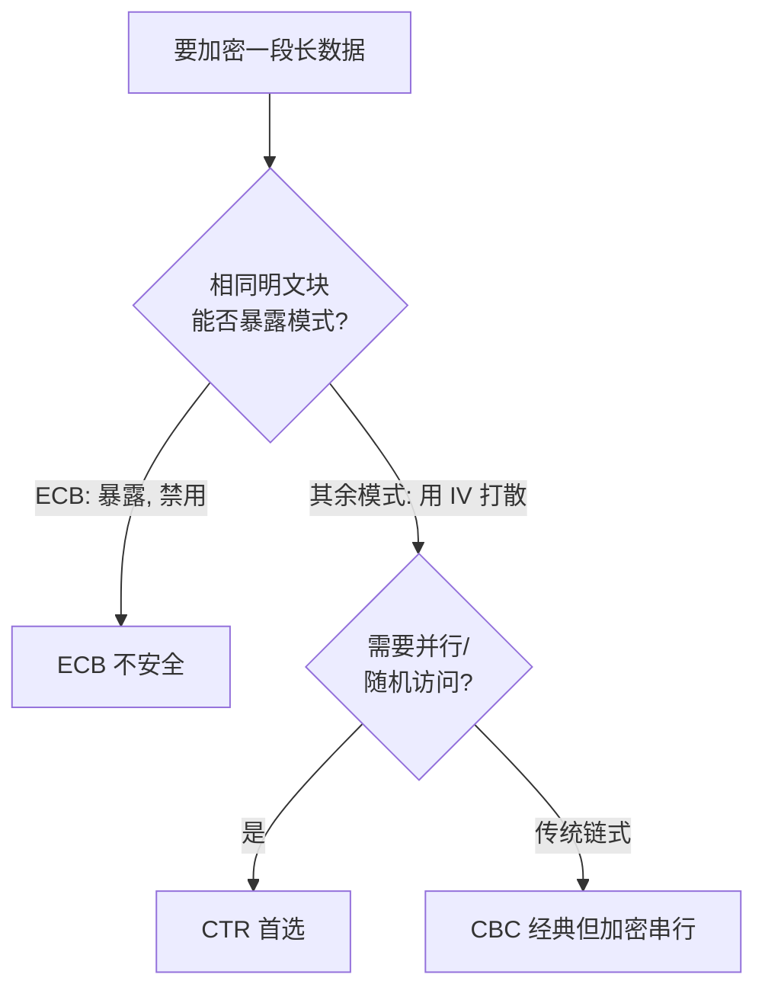
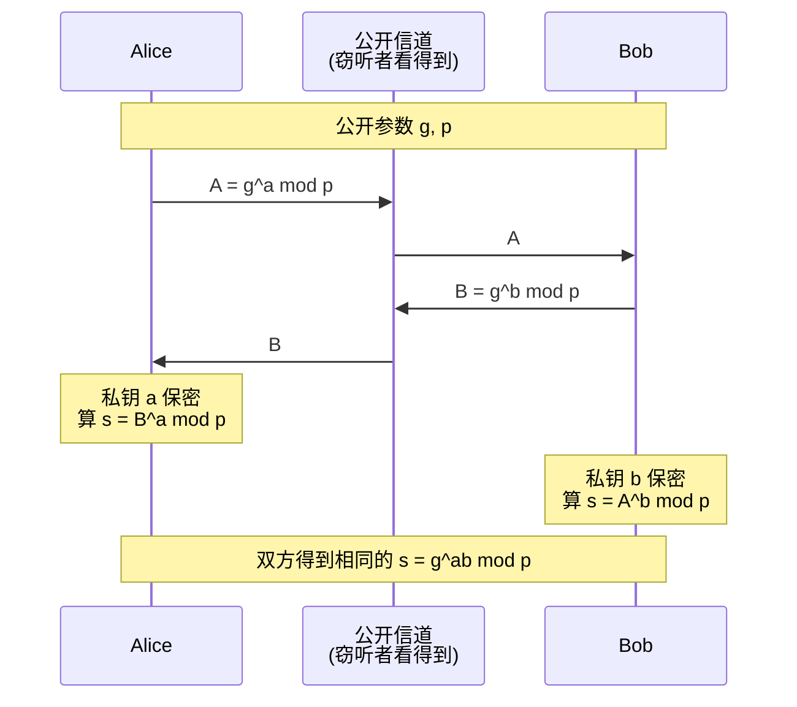
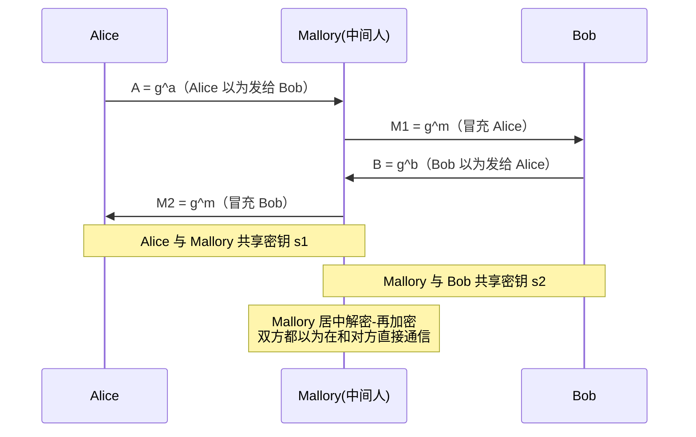
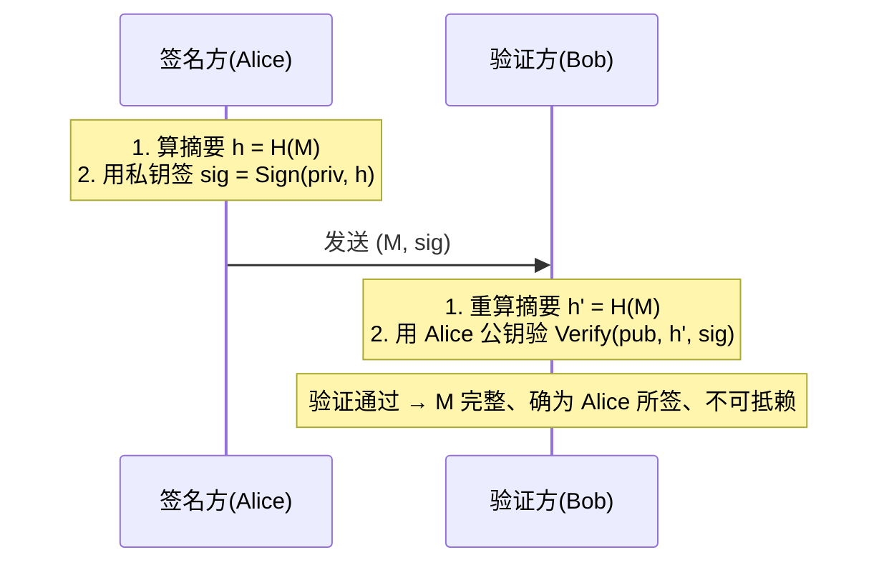
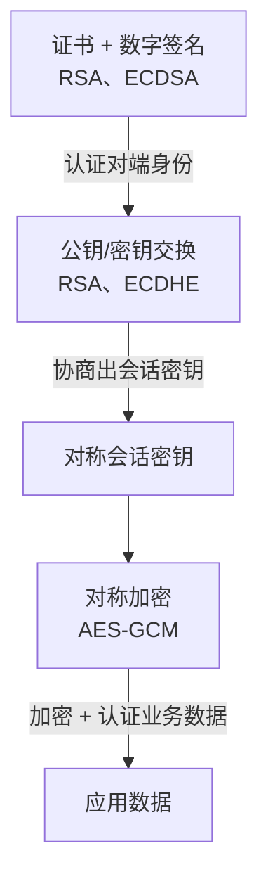

# 2.8 应用层：密码学基础

> 本文是对《计算机网络：自顶向下方法》安全部分的补充。[2.6 应用层安全](2.6应用层：应用层安全.md) 重点讲 TLS/PKI 的“用法”，但其背后的密码学原理（对称/公钥加密、密钥交换、散列、数字签名）才是 TLS、IPsec（见 [4.6](4.6网络层：IPsec与VPN.md)）等所有安全机制的共同地基。本文只讲**原理**，不讲某一种协议怎么配置——把这几块拼起来，就能看懂 2.6 的 TLS 握手和 4.6 的 IPsec 为什么是那样设计的。

## 目录

1. [密码学概述](#密码学概述)
2. [对称密钥加密](#对称密钥加密)
3. [公钥（非对称）加密](#公钥非对称加密)
4. [密钥交换](#密钥交换)
5. [散列函数与消息完整性](#散列函数与消息完整性)
6. [数字签名](#数字签名)
7. [综合：混合密码体制](#综合混合密码体制)
8. [典型例题](#典型例题)

---

## 密码学概述

### 四大安全目标

密码学不是为了“加密”这一个动作，而是服务于四个目标。看清楚“哪种工具解决哪个目标”，整篇文章的结构就立起来了。

| 目标 | 含义 | 主要手段 |
|------|------|---------|
| 机密性(Confidentiality) | 数据不被第三方读取 | 对称加密、公钥加密 |
| 完整性(Integrity) | 数据未被篡改 | 散列、消息认证码(MAC) |
| 认证(Authentication) | 确认对方身份真实 | 数字签名、MAC、证书 |
| 不可否认性(Non-repudiation) | 事后无法抵赖“这是我发的” | 数字签名（且只有它能做到） |

> 注：这四项不是层层包含的关系。加密只给机密性，不保证完整性——密文被改了照样能解出一段乱码，接收方未必察觉；要防篡改得另加 MAC 或签名。这也是后文“为什么不能只加密、还要带 MAC”的根源。

> 易混：**完整性 vs 认证 vs 不可否认性**。完整性回答“内容有没有被改”；认证回答“是不是它发的”；不可否认性回答“它能不能赖账”。MAC 能同时给完整性和认证（双方共享密钥），但**给不了不可否认性**——因为双方都持有同一把密钥，谁都可能伪造，无法向第三方证明是哪一方发的。要不可否认，必须用只有发送方独有的私钥来签，即数字签名。

### 密码体制的五要素

任何加密方案都可抽象成 $(M, C, K, E, D)$ 五个要素：

- **明文 $M$**：原始可读数据。
- **密文 $C$**：加密后的不可读数据。
- **密钥 $K$**：控制加解密的秘密参数。
- **加密算法 $E$**：$C = E_K(M)$。
- **解密算法 $D$**：$M = D_K(C)$，满足 $D_K(E_K(M)) = M$。

对称体制里加解密用同一把（或可互推的）密钥；公钥体制里加密用公钥、解密用私钥，是两把不同的钥匙。

### Kerckhoffs 原则

> **Kerckhoffs 原则**：一个密码系统应当即使算法的一切细节都被敌方知晓，只要密钥不泄露，就仍然安全。

通俗说就是“**算法公开，安全性只依赖密钥**”。它的现实意义：

- 不要指望“算法保密”（即“隐藏式安全”）。算法迟早会被逆向、泄露或被独立发现，到那时整套系统就裸奔了。
- 公开算法才能让全世界的密码学家长期审查，经得起公开审查的算法（AES、RSA、SHA-2）才值得信任。
- 因此真正需要保护、需要定期更换的，只有密钥。

### 攻击模型

评估算法强度，要先界定“攻击者能拿到什么”。能力由弱到强：

| 攻击模型 | 攻击者掌握的信息 | 难度 |
|---------|----------------|------|
| 唯密文(Ciphertext-only) | 只有若干密文 | 攻击者最弱，算法最易守 |
| 已知明文(Known-plaintext) | 一些“明文—密文”对（被动获得） | 中 |
| 选择明文(Chosen-plaintext, CPA) | 可让加密机加密任意自选明文，看其密文 | 强 |
| 选择密文(Chosen-ciphertext, CCA) | 可让解密机解密任意自选密文（除目标外），看其明文 | 攻击者最强，算法最难守 |

> 注：现代算法的安全标准定得很高——要求在“选择明文”甚至“选择密文”模型下都安全。直觉上看似不现实（“怎么会让攻击者随便加密”），但实际场景里它很常见：比如服务器对你提交的任意数据加密后返回，就给了你一台“加密机”。能扛住强攻击模型，弱模型自然不在话下。

---

## 对称密钥加密

对称加密：加密和解密用**同一把密钥**，速度快，适合加密海量数据。它分两大类。

### 流密码 vs 分组密码

| 维度 | 流密码(Stream Cipher) | 分组密码(Block Cipher) |
|------|----------------------|------------------------|
| 处理单位 | 逐比特/逐字节 | 固定长度的“块”（如 128 位） |
| 基本思路 | 用密钥生成伪随机密钥流，与明文逐位异或 | 对每个块整体做置换/代换 |
| 代表算法 | RC4(已废)、ChaCha20 | DES、3DES、AES |
| 特点 | 实现简单、速度快、无需填充 | 需把数据切块、不足要填充 |

流密码的核心是“密钥流不能重复”：若两段明文用同一段密钥流异或（$c_1 = m_1 \oplus k$，$c_2 = m_2 \oplus k$），攻击者算 $c_1 \oplus c_2 = m_1 \oplus m_2$ 就消掉了密钥流，明文关系直接暴露。这就是流密码必须配唯一 IV/nonce 的原因。

### 三个典型分组算法

| 算法 | 块长 | 密钥长度 | 结构 | 现状 |
|------|------|---------|------|------|
| DES | 64 位 | 56 位（有效） | 16 轮 Feistel 网络 | 已淘汰（密钥太短，可暴力破解） |
| 3DES | 64 位 | 112/168 位 | DES 连做三次（加—解—加） | 过渡方案，逐步淘汰（慢、块短） |
| AES | 128 位 | 128/192/256 位 | SPN（代换—置换网络），10/12/14 轮 | 当前标准，软硬件均高效 |

- **DES**：用 Feistel 结构——把块分左右两半，每轮拿一半经轮函数后异或到另一半，再交换。这种结构的妙处是加密和解密用同一套电路，只是轮密钥逆序使用。56 位有效密钥在今天可被专用硬件暴力穷举，已不安全。
- **3DES**：为延续 DES 硬件投资而生，对一个块做 $C = E_{K_3}(D_{K_2}(E_{K_1}(M)))$。“加—解—加”的中间用解密，是为了当 $K_1=K_2=K_3$ 时退化成单重 DES，兼容旧设备。块长仍只有 64 位，且三次运算慢，正被 AES 取代。
- **AES**：采用代换—置换网络（SPN），每轮做字节代换(SubBytes)、行移位(ShiftRows)、列混淆(MixColumns)、轮密钥加(AddRoundKey)四步。结构清晰、抗分析能力强，且现代 CPU 有 AES-NI 硬件指令，是今天对称加密的事实标准。

> 注：本文不要求记 AES 每一轮的字节运算细节。考试层面记住“块长 128 位、密钥 128/192/256 位、SPN 结构、轮数随密钥变 10/12/14”即可。

### 分组密码工作模式

分组算法本身只会加密**一个块**。一段长数据要切成多个块，怎么把它们逐块加密、串起来，就是“工作模式”要解决的问题。

下面用统一记号：明文块 $P_1,P_2,\dots$，密文块 $C_1,C_2,\dots$，块加密 $E_K(\cdot)$，初始向量 $IV$。

#### ECB（电子密码本）

最朴素的方式：每块独立加密，互不影响。

$$C_i = E_K(P_i)$$

- **致命缺陷**：**相同的明文块永远得到相同的密文块**。数据里的重复结构（图片大片同色区、固定格式报文）会原样泄露到密文中。
- 可并行：各块独立，加解密都能并行。

> **企鹅图（ECB 的经典反例）**：把一张 Linux 吉祥物 Tux 企鹅的位图用 ECB 加密，得到的“密文图”里企鹅的轮廓、眼睛、肚皮分区依然清晰可辨——因为图中大片相同颜色对应大量相同明文块，加密后仍是大片相同密文块，宏观图案被原样保留。这张图直观说明：**ECB 加密了每个块，却没隐藏块之间的模式**，因此从不用于加密有结构的数据。

#### CBC（密码块链接）

让每块在加密前先和**前一块密文**异或，把块之间“链”起来，相同明文块也会因上下文不同而得到不同密文：

$$C_i = E_K(P_i \oplus C_{i-1}), \qquad C_0 = IV$$

解密：$P_i = D_K(C_i) \oplus C_{i-1}$。

- **IV 的作用**：作为第一块的“前驱”，让同样的明文消息每次加密也不同（IV 需随机、不可预测，但可公开传输）。
- 加密**不能并行**（$C_i$ 依赖 $C_{i-1}$）；解密**可以并行**（每个 $P_i$ 只需 $C_i$ 和 $C_{i-1}$，都已在手）。

#### CFB / OFB / CTR（把分组密码当流密码用）

这三种模式都不直接加密明文，而是用 $E_K$ 生成一段密钥流，再和明文异或——本质上把分组密码变成了流密码，因此**无需填充**。

| 模式 | 密钥流生成 | 加密 | 能否并行 |
|------|-----------|------|---------|
| **CFB**（密码反馈） | 反馈上一块密文：$O_i=E_K(C_{i-1})$，$C_0=IV$ | $C_i = P_i \oplus O_i$ | 加密串行、解密并行 |
| **OFB**（输出反馈） | 反馈上一块密钥流：$O_i=E_K(O_{i-1})$，$O_0=IV$ | $C_i = P_i \oplus O_i$ | 均不可并行（链式生成） |
| **CTR**（计数器） | 加密递增计数器：$O_i=E_K(IV \Vert i)$ | $C_i = P_i \oplus O_i$ | **加解密均可并行** |

- **CTR 是现代首选**：密钥流只依赖计数器、与明文无关，可以提前算好、可随机访问任意块、可完全并行，性能极佳。AES-GCM（TLS 1.3 主力）的底层就是 CTR 模式再加上认证标签。
- OFB/CTR 中一旦 $(K, IV)$ 复用就会产生相同密钥流，重蹈流密码“密钥流重复”的覆辙，因此**IV/计数器绝不能重复**。

#### 模式对比小结

| 模式 | 是否需填充 | 加密并行 | 解密并行 | IV/计数器复用后果 | 备注 |
|------|-----------|---------|---------|------------------|------|
| ECB | 是 | 可 | 可 | —（本就泄露模式） | 不安全，禁用 |
| CBC | 是 | 不可 | 可 | 削弱安全性 | 经典，曾广泛用于 TLS |
| CFB | 否 | 不可 | 可 | 削弱安全性 | 较少用 |
| OFB | 否 | 不可 | 不可 | 密钥流重复，严重 | 较少用 |
| CTR | 否 | 可 | 可 | 密钥流重复，严重 | 现代首选，AEAD 基础 |

> 注：以上模式都只解决**机密性**，不保证完整性。实际系统会在加密之外再加 MAC，或直接用把加密与认证合一的 **AEAD** 模式（如 AES-GCM、ChaCha20-Poly1305），详见 [2.6 的 TLS 算法选择](2.6应用层：应用层安全.md#tls-用到的密码学算法)。

### 密钥分发难题

对称加密又快又安全，却有个绕不开的硬伤：**通信双方必须先共享同一把密钥，而这把密钥本身怎么安全送到对方手里？**

- 网络上明文传密钥 = 直接交给窃听者。
- 当 $n$ 个用户两两通信，需要 $\binom{n}{2}=\dfrac{n(n-1)}{2}$ 把密钥，规模一大就无法管理。

这就是“密钥分发难题”。它正是公钥加密与密钥交换被发明出来的根本动因——下两节登场。

---

## 公钥（非对称）加密

### 核心思想：陷门单向函数

公钥加密用**一对**密钥：**公钥**公开给所有人、用于加密；**私钥**自己保管、用于解密。任何人都能用你的公钥加密发给你，但只有持私钥的你能解开。

它的安全性建立在**陷门单向函数**上：

- **单向**：正向计算容易，反向求逆在计算上不可行（如大数相乘容易、把大合数分解回两个质因数极难）。
- **陷门**：知道一个秘密（陷门信息，即私钥）就能轻松求逆，不知道则做不到。

> 注：公钥加密的根基是“计算上困难”的数学难题，而非“理论上不可能”。它假设攻击者算力有限、且没有高效算法——这也是量子计算可能动摇 RSA/ECC 的原因（Shor 算法能高效分解大数和求离散对数）。

### RSA

RSA 是最经典的公钥算法，安全性基于**大整数分解难题**。

#### 密钥生成

1. 选两个大质数 $p,\ q$。
2. 计算模数 $n = p \cdot q$。
3. 计算欧拉函数 $\varphi(n) = (p-1)(q-1)$。
4. 选公钥指数 $e$，满足 $1 < e < \varphi(n)$ 且 $\gcd(e,\varphi(n))=1$（常取 $65537$）。
5. 算私钥指数 $d$，满足 $e \cdot d \equiv 1 \pmod{\varphi(n)}$，即 $d = e^{-1} \bmod \varphi(n)$（用扩展欧几里得算法求模逆）。

得到：**公钥 $(n,e)$**，**私钥 $(n,d)$**。$p,q,\varphi(n)$ 用完即销毁，绝不能泄露。

#### 加密与解密

$$c = m^{e} \bmod n, \qquad m = c^{d} \bmod n$$

其中明文 $m$ 须满足 $0 \le m < n$（更长的数据要分块或改用混合加密）。

#### 为什么解密能还原明文

解密正确性来自 $c^d = (m^e)^d = m^{ed} \bmod n$，而 $ed \equiv 1 \pmod{\varphi(n)}$，故 $ed = 1 + k\varphi(n)$。由**欧拉定理**：当 $\gcd(m,n)=1$ 时 $m^{\varphi(n)} \equiv 1 \pmod n$，于是

$$m^{ed} = m^{1+k\varphi(n)} = m \cdot \left(m^{\varphi(n)}\right)^{k} \equiv m \cdot 1^{k} = m \pmod n$$

（$\gcd(m,n)\ne 1$ 的边界情形用中国剩余定理也能证明成立，此处略。）

#### 数学基础：模幂运算

$m^e \bmod n$ 里 $e$ 可能上千位，直接算 $m^e$ 是天文数字。实际用**快速幂（平方—乘）**：把指数按二进制展开，边平方边按位取乘，每步都先取模。例如算 $9^7 \bmod 187$，因 $7 = 4+2+1$：

$$9^1 \equiv 9,\quad 9^2 \equiv 81,\quad 9^4 \equiv 81^2 \equiv 16 \pmod{187}$$
$$9^7 = 9^4 \cdot 9^2 \cdot 9^1 \equiv 16 \cdot 81 \cdot 9 \equiv 70 \pmod{187}$$

只需 $O(\log e)$ 次模乘，巨大的幂也能瞬间算完。完整 RSA 算例见[典型例题](#典型例题)。

### 椭圆曲线密码（ECC）

ECC 是另一类公钥体制，安全性基于**椭圆曲线离散对数难题**：在曲线上已知点 $G$ 和 $Q=kG$，求标量 $k$ 极难。

它最大的优势是**同等安全强度下密钥更短**：

| 安全强度（对称等价） | RSA 密钥长度 | ECC 密钥长度 |
|---------------------|-------------|-------------|
| 80 位 | 1024 位 | 160 位 |
| 128 位 | 3072 位 | 256 位 |
| 256 位 | 15360 位 | 512 位 |

密钥短意味着计算快、带宽省、存储小，特别适合移动端和物联网设备。今天的 TLS、SSH、加密货币大量使用 ECC（如 ECDSA 签名、ECDHE 密钥交换、Ed25519）。

### 对称 vs 非对称对比

| 维度 | 对称加密 | 非对称（公钥）加密 |
|------|---------|-------------------|
| 密钥 | 收发双方同一把（共享秘密） | 一对：公钥公开 + 私钥私藏 |
| 速度 | 快（约比公钥快 2~3 个数量级） | 慢 |
| 密钥分发 | 难（核心痛点） | 易（公钥可公开） |
| 密钥数量（$n$ 方） | $\dfrac{n(n-1)}{2}$ | $2n$（每人一对） |
| 典型用途 | 加密大量业务数据 | 交换/协商对称密钥、数字签名 |
| 代表算法 | AES、ChaCha20 | RSA、ECC |

> 易混：**为什么不直接用公钥加密所有数据？** 两个原因：① 公钥运算慢，加密海量数据性能不可接受；② RSA 单次只能加密小于模数 $n$ 的数据。所以实际做法是“**公钥加密只用来传一把对称密钥，真正的数据交给对称加密**”——这就是[混合密码体制](#综合混合密码体制)。

---

## 密钥交换

公钥加密能解决密钥分发，但还有一种更直接、更优雅的思路：双方**不传输密钥**，而是在公开信道上各自算出**同一个**共享密钥，全程不让密钥本身上网。这就是密钥交换，代表是 Diffie-Hellman。

### Diffie-Hellman（DH）

DH 是历史上第一个公钥密码思想的落地，安全性基于**离散对数难题**：已知 $g, p, y=g^x \bmod p$，求指数 $x$ 在计算上不可行。

**协议流程**（Alice 与 Bob）：

1. 双方公开约定大质数 $p$ 和生成元 $g$（这两个参数可公开）。
2. Alice 选私钥 $a$（保密），算公钥 $A = g^a \bmod p$，把 $A$ 发给 Bob。
3. Bob 选私钥 $b$（保密），算公钥 $B = g^b \bmod p$，把 $B$ 发给 Alice。
4. Alice 算 $s = B^a \bmod p$；Bob 算 $s = A^b \bmod p$。

两人算出的是**同一个值**：

$$B^a = (g^b)^a = g^{ab} = (g^a)^b = A^b \pmod p$$

> 注：窃听者能看到 $g,p,A,B$，却算不出 $s$——要从 $A=g^a$ 反推 $a$ 就是离散对数难题。私钥 $a,b$ 和共享密钥 $s$ 从不在网络上出现，这是 DH 的精妙之处。共享密钥 $s$ 一般再经一次 KDF（密钥派生函数）处理后作对称密钥。具体算例见[典型例题](#典型例题)。

### 中间人攻击与防御

原始 DH 有个致命弱点：**它只交换密钥，不认证身份**。攻击者 Mallory 可以插在中间，分别和两端各做一次 DH：

Alice 实际和 Mallory 协商出 $s_1$，Bob 和 Mallory 协商出 $s_2$，Mallory 居中转发并可任意读取/篡改。双方却毫无察觉。

**防御**：给 DH 公钥加上**身份认证**——让对方用其私钥**签名**自己的 DH 公钥（如 TLS 中服务器对 ServerKeyExchange 里的 DH 公钥签名），接收方用证书里的公钥验签，确认这个 DH 公钥确实来自真正的对端而非中间人。也就是说：**密钥交换解决“算出共享密钥”，身份认证解决“对方是谁”，两者必须配合。**

### ECDHE 与前向保密（PFS）

- **ECDHE**：DH 的椭圆曲线版本（ECDH），且其中 **E** 表示 **Ephemeral（临时）**——每次会话都现生成一对临时密钥，用完即弃。
- **前向保密（Forward Secrecy, PFS）**：即使服务器的**长期私钥**将来某天泄露，攻击者也**无法解密此前录下的历史流量**。

为什么临时密钥能带来前向保密？因为会话的对称密钥由**临时** DH 私钥算出，而临时私钥握手后立即销毁、从不落盘。事后即使长期私钥泄露，也重建不出当时的临时私钥，历史会话密钥便无从恢复。

> 对比：早期 TLS 的 RSA 密钥交换**没有前向保密**——客户端用服务器**长期公钥**加密预主密钥发出，私钥一旦泄露，所有被录下的历史流量都能解密。正因如此，TLS 1.3 干脆移除了 RSA 密钥交换，强制使用 (EC)DHE。这就是 ECDHE 成为 TLS 1.3 默认的根本原因（详见 [2.6 密钥派生小节](2.6应用层：应用层安全.md#会话密钥是怎么派生出来的)）。

---

## 散列函数与消息完整性

### 散列函数的性质

散列函数（哈希函数）$h = H(M)$ 把任意长度的输入压成固定长度的输出（摘要/指纹）。密码学安全的散列函数需满足：

- **单向性（抗原像）**：由摘要 $h$ 反推出任一满足 $H(M)=h$ 的 $M$ 不可行。
- **抗第二原像（抗弱碰撞）**：给定 $M_1$，找另一个 $M_2 \ne M_1$ 使 $H(M_1)=H(M_2)$ 不可行。
- **抗碰撞（抗强碰撞）**：找任意一对 $M_1 \ne M_2$ 使 $H(M_1)=H(M_2)$ 不可行。
- **雪崩效应**：输入改动哪怕 1 比特，输出也应有约一半比特翻转，让输出看不出与输入的关联。

> 注：抗强碰撞比抗弱碰撞更难达到。受**生日攻击**影响，要找到一对碰撞的期望工作量约为 $2^{n/2}$（$n$ 为摘要位数），而非 $2^n$。所以 128 位摘要的抗碰撞强度只有约 $2^{64}$——这正是 MD5（128 位）被攻破、现代要求至少 256 位（SHA-256）的原因。

### 典型散列算法

| 算法 | 输出长度 | 现状 |
|------|---------|------|
| MD5 | 128 位 | **已不安全**：可在数秒内构造碰撞，禁用于安全场景 |
| SHA-1 | 160 位 | **已废弃**：2017 年被实际碰撞攻破（SHAttered），证书/签名已停用 |
| SHA-2（SHA-256/384/512） | 256/384/512 位 | 当前主流，安全 |
| SHA-3（Keccak） | 可变 | 新标准，与 SHA-2 结构不同（海绵结构），作为备选/补充 |

> 易混：MD5/SHA-1 “不安全”指的是**抗碰撞性**被攻破（能构造两个不同文件同摘要），可用于伪造签名；其单向性尚未被破，但安全场景一律不该再用它们。校验下载文件是否损坏（非对抗场景）用 MD5 尚可，但凡涉及防伪造就必须换 SHA-2/3。

### 为什么“只发 hash(消息)”不能保证完整性

直觉上，发送方把 $H(M)$ 和 $M$ 一起发，接收方重算 $H(M)$ 比对，似乎就能验证“没被改”。**但这防不了主动攻击者**：散列算法是公开的，攻击者把 $M$ 改成 $M'$，重新算一个 $H(M')$ 一起替换上去，接收方比对照样通过，完全察觉不到。

根因：散列**没有密钥**，谁都能算。要做完整性校验，必须引入一个**只有收发双方才知道的秘密**——这就是 MAC。

### 消息认证码（MAC）与 HMAC

**MAC（Message Authentication Code）**：把**密钥**和**消息**一起输入，生成一个带密钥的“认证标签”：

$$\text{tag} = \text{MAC}(K, M)$$

发送方发送 $(M, \text{tag})$；接收方用同一把 $K$ 重算并比对。攻击者没有 $K$，改了消息就算不出正确的 tag，篡改即被发现。MAC 同时提供**完整性 + 认证**（能算出正确 tag 说明对方持有共享密钥）。

**HMAC** 是最常用的 MAC 构造，基于散列函数：

$$\text{HMAC}(K, M) = H\big((K \oplus opad) \,\Vert\, H((K \oplus ipad) \,\Vert\, M)\big)$$

其中 $ipad/opad$ 是两个固定填充常量，$\Vert$ 表示拼接。

> 注：HMAC 之所以套两层散列、而不是简单地 $H(K \Vert M)$，是为了抵御**长度扩展攻击**——对 MD5/SHA-1/SHA-2 这类 Merkle–Damgård 结构的散列，已知 $H(K \Vert M)$ 可在不知 $K$ 的情况下算出 $H(K \Vert M \Vert \text{padding} \Vert M')$，伪造出合法 tag。HMAC 的嵌套结构封死了这条路。

### 散列 vs MAC vs 数字签名

| 能力 | 散列 | MAC | 数字签名 |
|------|:----:|:---:|:--------:|
| 需要密钥 | 否 | 共享对称密钥 | 私钥签、公钥验 |
| 完整性 | 仅防意外损坏 | 提供 | 提供 |
| 认证（对方身份） | 不提供 | 提供（双方间） | 提供（对所有人） |
| 不可否认性 | 不提供 | 不提供 | 提供 |
| 速度 | 快 | 快 | 慢 |

这张表是本文的“总纲”：散列只给“指纹”、MAC 加了共享密钥能防主动篡改但赖账无法追究、签名用私钥实现了对全世界可验证的不可否认。下一节专讲签名。

---

## 数字签名

### 原理：私钥签、公钥验

数字签名把公钥加密的角色**反过来用**：

- **签名**：发送方用**自己的私钥**对消息（的摘要）运算，生成签名。
- **验证**：任何人用发送方的**公钥**验证签名是否匹配。

因为私钥只有签名者独有，能产出有效签名的只可能是他——这就同时给了**完整性**（内容被改则验签失败）、**认证**（确认是他签的）和**不可否认性**（他无法否认，因为别人没有他的私钥）。

### 为什么对“摘要”签名而非整条消息

直接对长消息做公钥运算又慢又受长度限制（同 RSA 加密的局限）。所以标准做法是**先散列再签名**：先把消息压成定长摘要 $h=H(M)$，再对 $h$ 做一次公钥运算。又快又不受消息长度限制，且因散列抗碰撞，对摘要签名和对原文签名同样可靠。

### 三种签名算法

| 算法 | 基础难题 | 特点 |
|------|---------|------|
| RSA 签名 | 大整数分解 | 用私钥 $d$ 对摘要做模幂 $s = h^d \bmod n$；验签 $h' = s^e \bmod n$，比对 $h'$ 是否等于 $H(M)$ |
| DSA | 离散对数 | 美国数字签名标准，签名较短，只能签不能加密 |
| ECDSA | 椭圆曲线离散对数 | DSA 的椭圆曲线版，密钥短、签名小，TLS/区块链广用 |

> 注：RSA 既能加密又能签名（同一套数学），DSA/ECDSA 专用于签名。注意签名的“私钥运算”和加密的“私钥解密”虽都用私钥，含义不同：加密保机密性、签名保真实性。RSA 签名小例见[典型例题](#典型例题)。

### 与 MAC 的本质区别：不可否认性

签名和 MAC 都能验完整性与认证，区别在密钥模型：

- **MAC 用共享对称密钥**：收发双方都持有 $K$。所以 Bob 能验证“消息没被外人改”，但**无法向第三方（法官）证明这条消息是 Alice 发的**——因为 Bob 自己也有 $K$，他同样能伪造。Alice 可以抵赖。
- **签名用非对称密钥**：只有 Alice 持私钥。Bob（及任何人）用 Alice 公钥验签成功，就能证明“只有 Alice 能签出它”。Alice **无法抵赖**——这就是不可否认性。

> 易混：一句话记牢——**MAC 是“我俩之间”的认证（共享秘密，可互相伪造，不可对外举证）；签名是“对全世界”的认证（私钥独有，任何人可验，签了赖不掉）。**

### 公钥真实性问题 → 证书与 PKI

签名验证依赖“用对方的**公钥**验签”，但这把公钥本身可信吗？如果攻击者把自己的公钥冒充成 Alice 的公钥给你，你验过的“Alice 签名”其实是攻击者签的。

所以必须先解决“**这把公钥确实属于声称的那个人**”——靠**数字证书**：由可信第三方（CA）用自己的私钥签名“某公钥 ↔ 某身份”的绑定关系，整套体系即 **PKI**。这正是 [2.6 数字证书和 PKI](2.6应用层：应用层安全.md#数字证书和pki) 的主题，本文不再展开。

---

## 综合：混合密码体制

把前面的工具拼起来，就是真实系统的做法。单用任何一种都不够：

- 只用对称加密 → 密钥分发难。
- 只用公钥加密 → 太慢、且单次只能加密小数据。

**混合密码体制**取长补短，分两个阶段：

1. **协商阶段（慢但解决密钥分发）**：用公钥手段（公钥加密传密钥，或 DH/ECDHE 协商）让双方安全地得到同一把**对称会话密钥**；同时用证书+签名认证对端身份。
2. **数据阶段（快）**：用这把对称密钥加密海量业务数据；再用 MAC（或 AEAD 自带的认证）保证完整性，必要时用签名提供不可否认性。

### 串一次 HTTPS（交叉引用 2.6）

以浏览器访问 `https://...` 为例，本文各机制各就各位：

1. **证书 + 签名**：服务器下发证书，浏览器用 PKI 链验证它，确认“这把公钥确实属于该域名”（防中间人）—— [数字签名](#数字签名) + [2.6 PKI](2.6应用层：应用层安全.md#数字证书和pki)。
2. **密钥交换**：双方用 ECDHE 协商出共享密钥，并对 DH 公钥签名以防中间人，获得前向保密 —— [密钥交换](#密钥交换)。
3. **派生会话密钥**：共享密钥经 KDF/PRF（基于 HMAC）派生出对称加密密钥 —— [散列/HMAC](#散列函数与消息完整性)。
4. **加密传输**：之后所有 HTTP 报文用 AES-GCM 这类 AEAD 对称加密，同时保机密性与完整性 —— [对称加密](#对称密钥加密)。

也就是说，**2.6 的整套 TLS 握手，就是本文这些密码学原语的一次工程组装**。IPsec（[4.6](4.6网络层：IPsec与VPN.md)）、安全邮件（PGP/S-MIME）走的也是同一套“非对称协商 + 对称传输 + 完整性校验”的混合思路。

---

## 典型例题

### 例题1：RSA 完整算例

> **题目**：取 $p=17$，$q=11$，公钥指数 $e=7$。
> (1) 求模数 $n$、欧拉函数 $\varphi(n)$ 和私钥 $d$；
> (2) 对明文 $m=88$ 加密，再对密文解密验证。

**解**：

(1) 密钥生成
- $n = p \cdot q = 17 \times 11 = 187$。
- $\varphi(n) = (p-1)(q-1) = 16 \times 10 = 160$。
- 求 $d$ 满足 $7d \equiv 1 \pmod{160}$。用扩展欧几里得（或试乘）：$7 \times 23 = 161 = 160 + 1 \equiv 1 \pmod{160}$，故 $d = 23$。
- 公钥 $(187,\,7)$，私钥 $(187,\,23)$。

(2) 加解密
- 加密：$c = m^e \bmod n = 88^7 \bmod 187 = 11$。
- 解密：$m = c^d \bmod n = 11^{23} \bmod 187 = 88$，还原成功。

> 验算（python3）：`pow(7,-1,160)` $=23$，`pow(88,7,187)` $=11$，`pow(11,23,187)` $=88$。再如 $m=9 \to c=70 \to 9$、$m=65 \to c=142 \to 65$ 均能还原。

### 例题2：Diffie-Hellman 算共享密钥

> **题目**：公开参数 $p=23$，$g=5$。Alice 私钥 $a=6$，Bob 私钥 $b=15$。求双方的公钥与最终共享密钥。

**解**：

- Alice 公钥：$A = g^a \bmod p = 5^6 \bmod 23 = 8$。
- Bob 公钥：$B = g^b \bmod p = 5^{15} \bmod 23 = 19$。
- Alice 算：$s = B^a \bmod p = 19^6 \bmod 23 = 2$。
- Bob 算：$s = A^b \bmod p = 8^{15} \bmod 23 = 2$。
- 双方一致，共享密钥 $s = 2$（亦等于 $g^{ab} \bmod p = 5^{90} \bmod 23 = 2$）。

> 验算（python3）：`pow(5,6,23)`=8，`pow(5,15,23)`=19，`pow(19,6,23)`=`pow(8,15,23)`=`pow(5,90,23)`=2。

### 例题3：RSA 数字签名小例

> **题目**：沿用例题1 的密钥（$n=187,\ e=7,\ d=23$）。设某消息的摘要 $h=4$，给出签名与验签过程。

**解**：

- 签名（私钥）：$s = h^d \bmod n = 4^{23} \bmod 187 = 64$。
- 验签（公钥）：$h' = s^e \bmod n = 64^7 \bmod 187 = 4$。
- $h' = h = 4$，验证通过，签名有效。

> 注：签名用私钥 $d$、验签用公钥 $e$，与加密时（公钥加密、私钥解密）的角色正好相反。验算（python3）：`pow(4,23,187)`=64，`pow(64,7,187)`=4。

### 例题4：分组工作模式辨析

> **题目**：以下说法是否正确，并说明理由。
> (1) ECB 模式加密同一张纯色图片不会泄露任何信息。
> (2) CTR 模式加密可以并行，CBC 模式加密不能并行。
> (3) OFB 模式中 $(K, IV)$ 复用没有安全影响。

**解**：

- (1) **错**。ECB 下相同明文块产生相同密文块，纯色大色块对应大量重复密文，图案轮廓会原样泄露（“企鹅图”现象）。
- (2) **对**。CTR 的每块密钥流只依赖计数器，可独立并行计算；CBC 加密时 $C_i = E_K(P_i \oplus C_{i-1})$ 依赖前一块密文，必须串行（注意 CBC **解密可并行**）。
- (3) **错**。OFB 密钥流由 $(K, IV)$ 决定，复用会产生相同密钥流，两段密文异或即消去密钥流、暴露明文关系，是严重漏洞。IV/计数器绝不能重复。

### 例题5：该用加密、MAC 还是数字签名？

> **题目**：为下列场景选择最合适的机制（加密 / MAC / 数字签名），并说明理由。
> (1) 两台内网服务器已用 DH 协商出共享密钥，要确保彼此间消息不被篡改，且无需对外举证。
> (2) 软件厂商发布安装包，要让任何用户都能验证“此包确实来自本厂商且未被篡改”。
> (3) 在公开 Wi-Fi 下传输登录密码，只关心不被窃听。

**解**：

- (1) **MAC（如 HMAC）**。双方已有共享对称密钥，MAC 既快又能保完整性与互相认证；“无需对外举证”说明不需要不可否认性，无须动用更慢的签名。
- (2) **数字签名**。受众是不特定的所有用户，且需防厂商抵赖/防伪造——只有签名能让任何人用厂商公钥验证、且厂商无法否认。MAC 做不到（无法把对称密钥安全分发给全体用户，也无法对外举证）。
- (3) **加密**。目标只是机密性（不被窃听），用对称加密即可；若还担心篡改/中间人，则应升级为完整的 TLS（加密 + 认证 + 完整性）。

---

**[上一节：2.7 套接字编程](2.7应用层：套接字编程.md)** ｜ **[返回 2.6 应用层安全](2.6应用层：应用层安全.md)**
