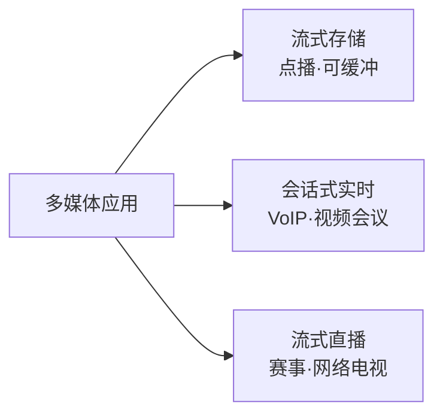
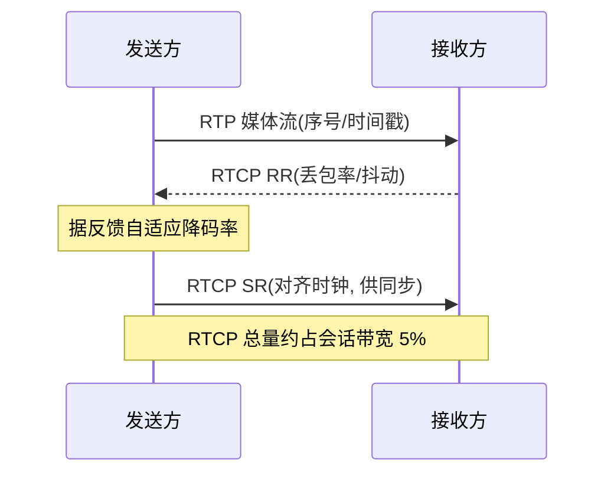
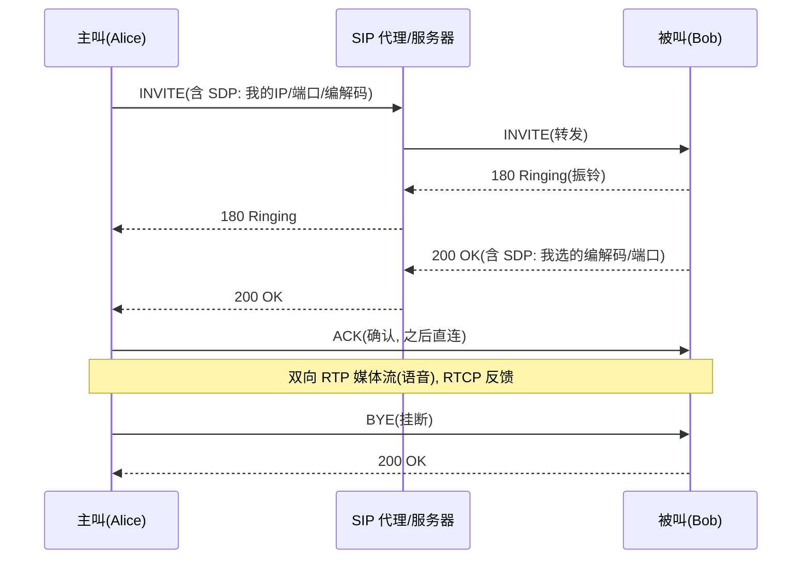

# 2.9 应用层：多媒体网络与 QoS

> 本文是对《计算机网络：自顶向下方法》的补充。第8版将“多媒体网络”一章拆散并入各章，本目录的 [2.5 P2P与流媒体](2.5应用层：P2P和流媒体技术.md) 已覆盖流式分发与 CDN；本篇补齐实时会话应用（VoIP）、RTP/RTCP 协议与网络层 QoS 机制这条主线。

## 目录

1. [多媒体网络概述](#多媒体网络概述)
2. [流式多媒体](#流式多媒体)
3. [实时会话应用与 VoIP](#实时会话应用与-voip)
4. [RTP/RTCP 与 SIP](#rtprtcp-与-sip)
5. [QoS 机制](#qos-机制)
6. [QoS 体系结构](#qos-体系结构)
7. [典型例题](#典型例题)

---

## 多媒体网络概述

多媒体应用指承载音频或视频的网络应用。和文本、文件传输相比，音视频的根本差异在于它们对**时间**敏感：数据必须在恰当的时刻、以恰当的速率到达并播放，迟到的分组往往等同于丢失。

### 三类多媒体应用

按内容来源和交互方式，多媒体应用分为三类：

- **流式存储音视频(streaming stored audio/video)**：内容已预先录制好存放在服务器上，用户按需点播（如视频网站点播、在线音乐）。可以暂停、快进、快退，对时延要求宽松，可大量缓冲。
- **会话式实时音视频(conversational/real-time)**：人与人实时交互（IP 电话 VoIP、视频会议）。对端到端时延极敏感——延迟过大会破坏对话节奏。
- **流式直播(streaming live)**：内容实时产生并分发给大量观众（赛事直播、网络电视）。观众之间无交互，但延迟要尽量低，且需面向海量用户分发。



> 注：本目录 [2.5](2.5应用层：P2P和流媒体技术.md) 已从“流式分发 + CDN”角度讲过点播与直播；本文聚焦第二类（会话式实时）以及承载它们的 RTP/RTCP/SIP 与网络层 QoS。

### 多媒体对网络的需求

不同类别的应用对网络的四项指标——带宽、端到端时延、抖动、丢包容忍——要求差异很大：

| 应用类别 | 带宽 | 端到端时延 | 抖动(jitter) | 丢包容忍 |
|---|---|---|---|---|
| 流式存储音视频 | 中~高，可自适应 | 宽松（几秒可接受） | 靠缓冲吸收，要求低 | 较敏感（追求画质，可重传） |
| 会话式实时（VoIP） | 低~中 | 严格（约 150 ms 内最佳） | 严格（需播放缓冲消除） | 可容忍（语音对零星丢包不敏感） |
| 流式直播 | 高 | 较严格（低延迟优先） | 靠缓冲吸收 | 可容忍少量 |

> 易混：**时延(delay)** 是分组从发到收花的时间；**抖动(jitter)** 是各分组时延的**波动**（到达时间忽快忽慢）。会话式应用既怕时延大，也怕抖动大——前者影响交互，后者破坏匀速播放。

### 尽力而为网络的挑战

互联网的网络层提供的是**尽力而为(best-effort)服务**：不对带宽、时延、抖动、丢包做任何承诺。分组可能延迟、乱序、丢失。这与多媒体应用的需求恰好相反，矛盾由此产生：

- **带宽无保证**：可用带宽随其他流量竞争而波动，可能不够编码码率。
- **时延无上界**：排队时延随拥塞剧烈变化，会话式应用难以保证及时。
- **抖动**：每个分组经历的排队不同，到达节奏不均匀。
- **丢包**：路由器队列溢出即丢弃，无重传保证。

应对思路分两个层次，构成本文主线：

1. **应用层自救**（不改网络）：客户端缓冲吸收抖动、自适应码率应对带宽波动、FEC/交织对抗丢包、RTP 时间戳支持同步。
2. **网络层增强**（改造网络提供 QoS）：分组调度、流量监管整形、准入控制，以及 IntServ/DiffServ 两种体系结构。

---

## 流式多媒体

流式多媒体的核心是**边收边放**，2.5 已介绍其基本思想与 CDN 分发；本节从传输方式与缓冲机制角度补充，不重复 CDN 内容。

### 三种流式传输方式

| 方式 | 传输协议 | 速率控制 | 特点 |
|---|---|---|---|
| UDP 流 | UDP + RTP | 服务器按编码码率推送 | 时延小、无 TCP 重传与拥塞抖动；但需自建拥塞控制，常被防火墙拦 |
| HTTP 流 | TCP（HTTP） | 服务器尽快发，客户端拉 | 复用 HTTP/CDN/缓存，穿防火墙易；TCP 重传与拥塞控制带来抖动 |
| DASH（自适应） | TCP（HTTP） | 客户端按带宽逐段选码率 | HTTP 流的演进，码率随网络自适应，当前主流 |

- **UDP 流**：服务器以视频编码速率向客户端推数据，客户端只缓冲很少（几百毫秒）。优点是时延低；缺点是 UDP 常被防火墙/NAT 拦截，且需在应用层自己实现速率与拥塞控制。
- **HTTP 流**：视频作为普通文件放在 HTTP 服务器上，客户端用 TCP 拉取并尽快填充缓冲。能直接复用 Web 基础设施（CDN、缓存、80/443 端口），但 TCP 的重传与拥塞控制会引入额外时延抖动，需要较大缓冲来平滑。
- **DASH**：见 2.5。把视频切段、多码率编码，客户端**每段**根据测得带宽与缓冲水位重选码率，自适应逻辑在客户端、服务器仍是普通 HTTP 服务器。

### 客户端缓冲的作用

无论哪种方式，客户端都在本地维护一个**播放缓冲区(playout buffer)**：先缓冲若干内容再起播，之后边播边续传。它同时解决两个问题：

```
填充速率(网络下载)    ┐
                   ├─►  [ 播放缓冲区 ]  ─►  排空速率(恒定播放)
                   ┘
   网络快/慢波动             蓄水池                 匀速消费
```

- **吸收抖动**：分组到达忽快忽慢，但缓冲区内已有存货，播放器仍能匀速取数据，不受瞬时波动影响。
- **应对带宽波动**：下载速率暂时低于播放速率时，靠缓冲区里的存量继续播；缓冲见底前若带宽未恢复，才会卡顿（或在 DASH 中降码率）。

> 注：缓冲是“以时延换平滑”——缓冲越大越抗波动，但起播等待越长、直播延迟越高。点播可大量缓冲，直播与会话式应用则要在平滑与低延迟间权衡。

---

## 实时会话应用与 VoIP

VoIP（IP 电话）是会话式实时应用的代表。发送端把语音按固定周期（如每 20 ms）采样、压缩成一个分组，经 UDP 发出；接收端解压并播放。它最能体现尽力而为网络对实时交互的三重冲击：时延、抖动、丢包。

### 时延、抖动、丢包对语音的影响

- **端到端时延**：人对会话延迟的容忍有阈值。经验上：
  - 小于约 **150 ms**：感知不到，体验自然；
  - 150~400 ms：可接受，但能感到迟滞；
  - 大于约 **400 ms**：严重影响交互（互相抢话、长时间停顿）。
- **抖动**：分组以恒定 20 ms 间隔发出，但经网络后到达间隔忽长忽短。若直接收到就播，声音会断续、变调。必须在接收端用**播放缓冲**重建匀速节奏。
- **丢包**：UDP 不重传（会话场景下重传来的分组也常已过播放时刻）。所幸语音对零星丢包有一定容忍，配合恢复手段，1%~10% 的丢包仍可获得可懂的语音。

### 抖动消除：接收端播放缓冲

接收端不立即播放每个到达的分组，而是先缓冲、推迟一段固定的**播放时延(playout delay)** $q$ 再开始，之后严格按发送节奏匀速播放。为此每个 RTP 分组都带**时间戳**，接收端据此知道每个分组“本应何时播放”。

设分组 $i$ 在发送端的生成时刻为 $t_i$（由时间戳给出），接收端选定一个相对量 $q$，则把该分组的播放时刻定为 $t_i + q$（加上一个固定基准）。只要 $q$ 大于等于网络时延的波动跨度，到期分组就都已到达，可连续播放。

- **固定播放时延**：$q$ 取一个固定值。简单，但取值难：$q$ 太小则抖动大时频繁丢弃迟到分组，$q$ 太大则端到端时延高。
- **自适应播放时延**：持续估计网络时延的均值与波动，在每段静默期（说话间隙）动态调整 $q$——网络抖动变大时增大 $q$ 保流畅，抖动变小时减小 $q$ 降时延。利用静默期调整，听感上不易察觉。

> 易混：增大播放缓冲 $q$ 能消除更多抖动、减少迟到丢弃，但会**增加**端到端时延。VoIP 的核心权衡就在“抗抖动”与“低时延”之间——这正是例题2 要算的量。

### 丢包恢复

UDP 无重传，VoIP 用以下手段在接收端**修复或掩盖**丢失：

- **前向纠错(FEC, Forward Error Correction)**：发送端额外发送冗余信息，接收端用它恢复丢失的分组，无需重传。
  - 简单方案：每 $n$ 个原始分组附带 1 个冗余分组（如这 $n$ 个的异或）。任意丢 1 个都能恢复，代价是带宽增加 $1/n$、时延增加（要等齐一组才能恢复）。
  - 另一方案：把每个分组的低质量副本搭载在下一个分组里。丢一个分组时，用其低质量副本顶替，音质下降但不中断。
- **交织(interleaving)**：不增加冗余，而是把相邻的小语音单元**打散**到不同分组中发送。这样丢一个分组只会让原本连续的声音出现多处**分散的小缺口**，而非一段连续的空白，听感上更容易被掩盖。代价是增加时延（要收齐若干分组才能解交织还原）。
- **基于接收端的修复（差错掩盖）**：用丢失分组前后的语音“猜”出缺失部分（如重复上一个分组、内插），不需发送端配合，但只对短时丢失有效。

```
交织前: [1 2 3 4][5 6 7 8][9 ...]   丢中间一包 -> 连续缺 5 6 7 8
交织后: [1 5 9 ..][2 6 ...][3 7 ...] 丢一包 -> 5,6,7,8 各缺一处, 分散可掩盖
```

> 注：FEC、交织都用**带宽或时延**换取**抗丢包**能力。会话式应用时延预算紧张，交织和大冗余受限；点播则可放心用更强的纠错。

---

## RTP/RTCP 与 SIP

UDP 本身只提供端口复用与差错检测，缺少多媒体所需的时间戳、序号、源标识。**RTP** 在 UDP 之上补齐这些；**RTCP** 提供配套的质量反馈；**SIP** 负责会话的建立与管理。三者分工：RTP 传媒体，RTCP 报质量，SIP 建会话。

### RTP：实时传输协议

> **RTP (Real-time Transport Protocol)**
>
> 运行在 UDP 之上，为音视频等实时数据提供时间戳、序号、载荷类型与同步源标识的封装协议。RTP 本身**不保证**及时交付，也不预留资源——它只是给媒体加上播放与同步所需的元信息。

RTP 报文 = RTP 头部 + 媒体载荷，整体作为 UDP 的数据部分。头部关键字段：

```
 0               1               2               3
 0 1 2 3 4 5 6 7 8 9 0 1 2 3 4 5 6 7 8 9 0 1 2 3 4 5 6 7 8 9 0 1
+-+-+-+-+-+-+-+-+-+-+-+-+-+-+-+-+-+-+-+-+-+-+-+-+-+-+-+-+-+-+-+-+
|V=2|P|X|  CC   |M|   PT(载荷类型)|       序号(sequence number)   |
+-+-+-+-+-+-+-+-+-+-+-+-+-+-+-+-+-+-+-+-+-+-+-+-+-+-+-+-+-+-+-+-+
|                      时间戳(timestamp)                         |
+-+-+-+-+-+-+-+-+-+-+-+-+-+-+-+-+-+-+-+-+-+-+-+-+-+-+-+-+-+-+-+-+
|         同步源标识 SSRC (identifies the source)               |
+-+-+-+-+-+-+-+-+-+-+-+-+-+-+-+-+-+-+-+-+-+-+-+-+-+-+-+-+-+-+-+-+
|         贡献源 CSRC 列表 (可选, 由 CC 个数指定)              |
+-+-+-+-+-+-+-+-+-+-+-+-+-+-+-+-+-+-+-+-+-+-+-+-+-+-+-+-+-+-+-+-+
```

- **载荷类型 PT(payload type)**：指明媒体的编码方式（如某号表示 PCM µ-law 音频、某号表示某视频编码），接收端据此选解码器。
- **序号(sequence number)**：每发一个 RTP 分组加 1。接收端用它**检测丢包**和**重排乱序**。
- **时间戳(timestamp)**：媒体采样时刻（按媒体时钟计，如音频按采样数递增）。是接收端**消除抖动、匀速播放、音视频同步**的依据。
- **SSRC(同步源标识)**：随机数，唯一标识一个媒体流的源。同一会话中区分不同发送者。

> 易混：**序号**按分组个数 +1，用于丢包/乱序检测；**时间戳**按媒体采样递增（不一定每包 +1），用于播放定时。两者都靠 RTP 头携带，缺一不可。

### RTCP：实时传输控制协议

> **RTCP (RTP Control Protocol)**：与 RTP 配套，周期性传输**控制与统计报文**，不携带媒体数据。用于反馈接收质量、参与者同步与会话成员管理。

RTCP 报文类型主要有：

- **发送方报告(SR, Sender Report)**：由正在发送媒体的源发出，含已发送分组数/字节数、以及把 RTP 时间戳与真实时钟对齐的信息（供**音视频同步**用）。
- **接收方报告(RR, Receiver Report)**：接收者反馈对某个流的接收质量——**丢包率、累计丢包数、抖动估计、最高序号**等。发送方据此**自适应调整编码码率**（网络差就降码率）。
- **源描述(SDES)**：携带参与者的标识信息（如名称），帮助成员识别。

**带宽约束（5% 约定）**：RTCP 报文与媒体争抢带宽，故规定 RTCP 总流量限制在 RTP 会话带宽的约 **5%**，并按参与者数量分摊到每个成员（人越多，每人发 RTCP 越稀疏），避免大型会议中控制流量喧宾夺主。



### SIP：会话发起协议

> **SIP (Session Initiation Protocol)**：应用层信令协议，负责**建立、修改、终止**多媒体会话（如发起一通 VoIP 呼叫）。它只管“怎么把通话接通、参数怎么协商”，不传媒体本身——媒体由 RTP 承载。

SIP 与 **SDP(Session Description Protocol)** 配合：SDP 是一段文本，描述会话的媒体参数（IP、端口、编解码列表等），作为 SIP 消息的消息体传递。呼叫建立的核心流程（经代理简化）：



- **INVITE / 200 OK / ACK**：三次握手式地建立会话，并通过双方各自的 SDP **协商编解码**（取交集）与媒体地址。
- 媒体地址协商完成后，**RTP 媒体流通常在双方之间直传**（不再经过 SIP 代理），代理只参与信令。
- **BYE** 终止会话。

> 注：SIP 解决的是“地址解析 + 呼叫建立 + 参数协商”，相当于电话网里的拨号与振铃信令；真正的“通话内容”走 RTP/RTCP。这与 2.5 提到的 WebRTC 信令是同一类角色（交换 SDP），只是 WebRTC 的信令不被标准化、可自选。

---

## QoS 机制

要让网络对多媒体提供超越尽力而为的**服务质量(QoS, Quality of Service)**保证，需要在路由器上引入三类机制：分组调度（决定谁先走）、流量监管与整形（约束流的形状）、准入控制（决定能否接纳新流）。

### 分组调度

链路输出端排着多个待发分组，**调度策略**决定下一个发哪个，直接影响各流的时延与带宽分配。

- **FIFO（先进先出）**：按到达顺序发送。简单，但无法区分优先级——一个突发大流会让后面的实时分组排长队。
- **优先级队列(Priority Queuing)**：分组按类别进不同优先级队列，**高优先级队列非空时优先发**。能保实时流低时延，但低优先级流可能长期饥饿。
- **轮询(Round Robin)**：在各类队列间轮流各取一个分组，公平但不区分分组大小。
- **加权公平排队(WFQ, Weighted Fair Queuing)**：给每条流（或每类）一个权重 $w_i$，在所有活动流间**按权重比例**分配链路带宽。流 $i$ 获得的带宽份额为

$$R_i = R \cdot \frac{w_i}{\sum_{j \in \text{active}} w_j}$$

其中 $R$ 是链路速率，分母只对当前有分组待发的活动流求和。WFQ 既保证按权重分带宽，又是**工作保持(work-conserving)**的：某条流空闲时，它的份额按权重比例再分给其余活动流，链路不空转。

```
        ┌─ 流1 (w=3) ─┐
输入流 ──┼─ 流2 (w=2) ─┼──► WFQ 调度器 ──► 输出链路 R
        └─ 流3 (w=1) ─┘     按 w_i 比例分带宽
```

### 流量监管与整形

QoS 要奏效，前提是限制每条流的“形状”，否则无序的突发会破坏对其他流的保证。两种工具：

- **监管(policing)**：检查流是否超约，**超出的分组直接丢弃或降级标记**。
- **整形(shaping)**：把不规则的流**缓冲并平滑**成符合约定的形状再放出。

常用两种漏算法描述与实现约束：

**漏桶(leaky bucket)**：分组像水进桶，桶以**恒定速率** $r$ 漏出（发送）。桶满则溢出（丢弃）。输出绝对平滑、无突发，但不允许任何突发通过——即使桶空，也只能以 $r$ 发送。

```
  分组流入(突发) ──► [ 漏桶, 容量有限 ] ──► 恒定速率 r 漏出(平滑)
                          满则溢出(丢弃)
```

**令牌桶(token bucket)**：以速率 $r$ 往桶里**加令牌**，桶最多存 $b$ 个令牌（$b$ 为桶深）。发一个分组需消耗对应数量令牌；桶里攒了令牌时**允许突发**，令牌耗尽则只能以 $r$ 的速率发。

```
  令牌按速率 r 生成 ──► [ 令牌桶, 桶深 b ]
                              │ 取令牌
  分组 ──► 有令牌则放行(可突发到 b) ──► 输出
          无令牌则等待/丢弃
```

令牌桶的关键性质：在任意时间区间 $t$ 内，最多可发送

$$\text{发送量} \le b + r \cdot t$$

即“满桶的瞬时突发 $b$” 加上“期间新生成的 $r t$”。这同时刻画了两件事：**短期允许突发 $b$，长期平均速率被限制在 $r$**。令牌桶比漏桶更灵活——既限均值又容突发，常与 WFQ 配合给出**时延上界**保证。

> 易混：漏桶限的是**输出**（绝对平滑、不容突发）；令牌桶限的是**输入许可**（容许大小为 $b$ 的突发，长期均值为 $r$）。考试常考令牌桶的 $b + rt$ 上界（见例题1）。

### 准入控制

对要求资源保证的流，网络需在它开始前判断：**接纳它会不会破坏已有流的保证？** 这就是**准入控制(admission control)**。新流声明自己的流量特性（如令牌桶参数 $r$、$b$）与所需 QoS（带宽、时延），网络沿路径检查每段链路是否仍有足够余量：有则接纳并预留资源，无则拒绝（“呼叫阻塞”）。电话网的忙音、IntServ 的 RSVP 都是这一思想的体现。

---

## QoS 体系结构

把上述机制组织成完整的网络服务，历史上有两种体系结构：综合服务 IntServ 追求**逐流的硬保证**，区分服务 DiffServ 追求**按类的可扩展软区分**。

### 综合服务 IntServ

> **IntServ (Integrated Services)**：为**每一条流**单独预留资源、提供端到端 QoS 保证的体系结构。

工作方式：应用在通信前用信令协议 **RSVP(Resource Reservation Protocol)** 沿路径向每台路由器**逐跳预留**带宽与缓冲；每台路由器对该流做准入控制，接纳后用 WFQ 等机制为它单独排队、兑现承诺。

- 优点：能提供**确定性/统计性的硬保证**（带宽、时延上界）。
- 致命缺点——**可扩展性差**：核心路由器要为**每条流**维护状态、单独调度。骨干网上同时有数百万条流，逐流维护状态在存储和处理上都不可行。


### 区分服务 DiffServ

> **DiffServ (Differentiated Services)**：不为每条流预留，而是把流量**归入少数几个类别**，核心网只按类别区别对待的体系结构。

核心思想是**复杂度下沉到边缘、核心保持简单**：

- **边缘(edge)**：网络入口的边缘路由器对分组做**分类**与**监管/整形**，并在 IP 头的 **DSCP(Differentiated Services Code Point)** 字段打上类别标记（DSCP 占用原 IPv4 的 ToS / IPv6 的流量类别字段）。
- **核心(core)**：核心路由器**只看 DSCP**，对每个类别执行预定义的**每跳行为 PHB(Per-Hop Behavior)**（如“加速转发”给低时延类、“确保转发”给不同丢弃优先级），无需维护逐流状态。


- 优点：核心无逐流状态，**可扩展性好**，易于在大网部署。
- 缺点：只提供**相对的、按类的**区分（“某类比某类好”），不像 IntServ 那样对单条流给出绝对的端到端硬保证。

### IntServ vs DiffServ 对比

| 维度 | IntServ | DiffServ |
|---|---|---|
| 粒度 | 每条流(per-flow) | 每类(per-class) |
| 状态保存 | 核心路由器保存逐流状态 | 核心无逐流状态，仅识别 DSCP |
| 信令 | 需 RSVP 逐跳预留 | 无需逐流信令，边缘打标记 |
| 保证强度 | 硬保证（带宽/时延上界） | 相对区分（软保证） |
| 复杂度分布 | 全网都复杂 | 边缘复杂、核心简单 |
| 可扩展性 | 差（流多即崩） | 好 |
| 部署现状 | 难大规模部署 | 更现实，被实际采用更多 |

> 注：两者并非取代尽力而为的全部，实际网络多在尽力而为基础上对**部分流量**用 DiffServ 做差异化；端到端硬 QoS 在公网上始终难以普及，这也是为什么应用层自救（缓冲、自适应、FEC）至今仍是多媒体的主力手段。

---

## 典型例题

**例题1（令牌桶：最大突发与平均速率）**

某流量整形器用令牌桶，令牌生成速率 $r = 2\text{ Mbps}$，桶深 $b = 10\text{ Mb}$，下游物理链路峰值速率 $P = 50\text{ Mbps}$。求：(1) 满桶时的瞬时最大突发量；(2) 任意 $1\text{ s}$ 区间内最多能发多少；(3) 长期平均速率上界；(4) 从满桶开始、以物理峰值 $P$ 连续发送，这种峰值突发最长能持续多久。

**解析**：令牌桶在区间 $t$ 内的发送量上界为 $b + r t$。

(1) 满桶瞬时可用令牌为 $b$，故瞬时突发上界 $= b = 10\text{ Mb}$。

(2) 取 $t = 1\text{ s}$：$b + r t = 10 + 2 \times 1 = 12\text{ Mb}$。

(3) 长期看 $t \to \infty$，$\dfrac{b + r t}{t} \to r$，故平均速率上界 $= r = 2\text{ Mbps}$。

(4) 以峰值 $P$ 发送时，令牌净消耗速率为 $P - r$，初始令牌 $b$，可持续时间

$$T = \frac{b}{P - r} = \frac{10}{50 - 2} \approx 0.2083\text{ s} \approx 208.3\text{ ms}$$

验算（python3）：

```
满桶瞬时突发 = b = 10 Mb
t=1.0s: 最多发送 b+rt = 10 + 2x1.0 = 12.0 Mb
长期平均速率上界 = r = 2 Mbps
峰值突发时间 T = b/(P-r) = 10/(50-2) = 208.33 ms
该突发发送量 = P*T = 10.42 Mb  (= b+r*T = 10.42 Mb, 一致)
```

> 关键：令牌桶**短期容突发到 $b$、长期限均值到 $r$**；峰值突发持续时间 $b/(P-r)$ 是常考点。

---

**例题2（播放缓冲：给定时延/抖动求所需缓冲）**

某 VoIP 应用每 $20\text{ ms}$ 生成一个语音分组（码率 $64\text{ kbps}$）。测得单向网络时延在 $[50, 110]\text{ ms}$ 间波动。接收端用固定播放时延去抖。求：(1) 抖动跨度；(2) 至少需要多大的播放缓冲提前量 $q$ 才能不卡顿；(3) 此时“嘴到耳”总时延是否满足 $150\text{ ms}$ 阈值；(4) 缓冲中暂存的分组数与数据量。

**解析**：

(1) 抖动跨度 $= 110 - 50 = 60\text{ ms}$。

(2) 以最快分组（时延 $50\text{ ms}$）到达时刻起算，最慢分组比它晚 $60\text{ ms}$ 到达。要保证播放时到期分组都已到，播放提前量 $q$ 须不小于抖动跨度，取 $q = 60\text{ ms}$。

(3) 以最快分组为基准，其“嘴到耳”$= d_{min} + q = 50 + 60 = 110\text{ ms} \le 150\text{ ms}$，满足。

(4) 缓冲分组数 $= q / \text{帧周期} = 60 / 20 = 3$ 个；数据量 $= 64\text{ kbps} \times 60\text{ ms} = 3840\text{ bit} = 480\text{ 字节}$。

验算（python3）：

```
抖动跨度 = 60 ms
播放缓冲提前量 q = 60 ms
嘴到耳 = d_min + q = 110 ms <= 150 ms? 是
缓冲分组数 = q/frame = 60/20 = 3 个
缓冲数据量 = 64k x 60ms = 3840 bit = 480 字节
```

> 关键：$q$ 越大越抗抖动，但端到端时延越高。$q$ 至少要覆盖时延波动跨度。

---

**例题3（WFQ 按权重分配带宽）**

链路容量 $C = 100\text{ Mbps}$，三条流经 WFQ 调度，权重 $w_1 : w_2 : w_3 = 3 : 2 : 1$。求：(1) 三流都持续有分组时各得多少带宽；(2) 若流3 暂时空闲，剩余两流各得多少。

**解析**：流 $i$ 的带宽 $= C \cdot \dfrac{w_i}{\sum w_j}$（分母只算活动流）。

(1) $\sum w = 6$：

$$R_1 = 100 \times \tfrac{3}{6} = 50,\quad R_2 = 100 \times \tfrac{2}{6} \approx 33.3,\quad R_3 = 100 \times \tfrac{1}{6} \approx 16.7\ (\text{Mbps})$$

(2) 流3 空闲，WFQ 工作保持，带宽在流1、流2 间按 $3:2$ 重分（$\sum w = 5$）：

$$R_1 = 100 \times \tfrac{3}{5} = 60,\quad R_2 = 100 \times \tfrac{2}{5} = 40\ (\text{Mbps})$$

验算（python3）：

```
全活动: 流1=50.00, 流2=33.33, 流3=16.67 Mbps
流3空闲: 流1=60.00, 流2=40.00 Mbps
```

> 关键：WFQ 按权重比例分带宽，且**工作保持**——空闲流的份额按权重再分给活动流，链路不空转。

---

**例题4（概念辨析：IntServ vs DiffServ）**

为何骨干网更倾向 DiffServ 而非 IntServ？

**解析**：IntServ 需核心路由器为**每条流**维护预留状态并单独调度，骨干网同时承载海量流，逐流状态在存储与处理上不可扩展。DiffServ 把复杂度下沉到边缘（分类、监管、打 DSCP 标记），核心只按少数类别执行 PHB、不保存逐流状态，因而**可扩展性好、易部署**，代价是只提供按类的相对区分而非逐流硬保证。

---

**下一节：[3.0 传输层](3.0 传输层.md)**
