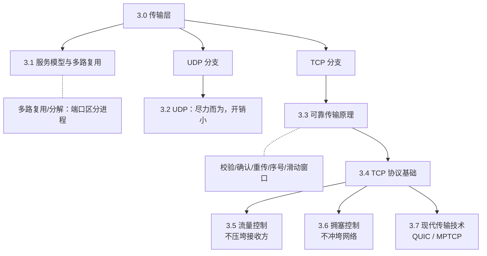

# 3.0 传输层

> 应用层把"进程怎么通信"理清后，往下就是传输层：它在两台主机的进程之间架起一条逻辑通信信道，让应用感觉像直接对话，而不必关心中间的网络细节。本章先把脉络串起来——为什么需要两种传输服务、可靠传输靠什么原理实现、TCP 如何把这些原理凑齐——细节放在各小节。

## 传输层在协议栈中的位置

传输层运行在端系统上，不在路由器里。它把应用交来的报文切成报文段（segment），交给网络层尽力而为地投递；网络层只保证主机到主机，传输层负责把"主机到主机"升级为"进程到进程"，并按需补上可靠性、流量控制、拥塞控制。

```
   主机 A                                  主机 B
┌───────────┐                          ┌───────────┐
│  应用层    │  进程↔进程               │  应用层    │
├───────────┤  ← 报文段 segment →       ├───────────┤
│  传输层    │  TCP / UDP（本章）        │  传输层    │
├───────────┤      ……网络核心……         ├───────────┤
│  网络层    │   ┌────┐   ┌────┐         │  网络层    │
├───────────┤   │路由│ … │路由│         ├───────────┤
│  链路层    │   │器  │   │器  │         │  链路层    │
├───────────┤   └────┘   └────┘         ├───────────┤
│  物理层    │                          │  物理层    │
└───────────┘                          └───────────┘
```

> 注：路由器只处理到网络层，不实现传输层。TCP/UDP 是端到端的，只在两端主机上运行。

## 本章脉络

传输层只有两种协议（UDP、TCP），但 TCP 之所以复杂，是因为它要在不可靠的网络上拼出一条可靠、不冲垮网络、也不压垮对端的连接。本章的主线就是这些机制如何层层叠加：



> 阅读顺序：3.1 先弄清多路复用（端口）这一两种协议共有的机制；3.2 看最简单的 UDP；3.3 抽象地讲"可靠传输怎么做"，是理解 TCP 的钥匙；3.4 看 TCP 如何落地这些原理，再分别用 3.5 流量控制（针对接收方）和 3.6 拥塞控制（针对网络）解决两类"发太快"的问题；3.7 是书外延伸。
>
> 易混：流量控制 vs 拥塞控制——前者防止发送方压垮**接收方**（看 rwnd），后者防止发送方冲垮**网络**（看 cwnd），实际发送窗口取两者较小值。

## 章节目录

- **[3.1 传输层：服务模型与多路复用](3.1传输层：服务模型与多路复用.md)**
  - 传输层的基本服务
  - 多路复用与多路分解机制
  - 端口号和套接字概念

- **[3.2 传输层：UDP协议与应用](3.2传输层：UDP协议与应用.md)**
  - UDP协议结构和特性
  - UDP的优势与局限性
  - UDP编程实例和应用场景

- **[3.3 传输层：可靠传输原理](3.3传输层：可靠传输原理.md)**
  - 可靠数据传输问题分析
  - 停等协议和滑动窗口
  - 错误检测和纠正机制

- **[3.4 传输层：TCP协议基础](3.4传输层：TCP协议基础.md)**
  - TCP段结构与首部字段
  - TCP连接建立与终止
  - TCP状态机分析

- **[3.5 传输层：TCP流量控制](3.5传输层：TCP流量控制.md)**
  - 接收窗口机制
  - 流量控制算法
  - Nagle算法和延迟确认

- **[3.6 传输层：TCP拥塞控制](3.6传输层：TCP拥塞控制.md)**
  - 拥塞控制基本原理
  - 慢启动和拥塞避免算法
  - 快速重传和快速恢复

- **[3.7 传输层：现代传输技术](3.7传输层：现代传输技术.md)**
  - QUIC协议详解
  - 多路径TCP (MPTCP)
  - TCP优化技术和未来发展

## 性能计算速查（408）

本章计算题大多围绕"窗口能否填满链路"和"信道利用率"展开。下面只列公式与一道典型例题，详细推导见 [3.3 可靠传输原理](3.3传输层：可靠传输原理.md) 与 [3.6 TCP拥塞控制](3.6传输层：TCP拥塞控制.md)。

**两个核心量**：

- 带宽时延积 $\text{BDP} = \text{带宽} \times \text{RTT}$，表示链路在一个 RTT 内能容纳的比特数，也就是"想填满链路所需的最小窗口"。
- 利用率：发送方窗口足够大时趋于 1，否则受窗口限制。停等协议把窗口压到一段，利用率最低。

**滑动窗口协议的信道利用率**（设 $a = \dfrac{\text{传播时延}}{\text{发送时延}}$，$N$ 为窗口大小，单位为帧）：

| 协议 | 利用率 | 说明 |
|------|--------|------|
| 停等协议 | $\dfrac{1}{1 + 2a}$ | 一次只发一帧，往返时延占比越大越吃亏 |
| 回退 N（GBN）/ 选择重传（SR） | $\min\left(1,\ \dfrac{N}{1 + 2a}\right)$ | 无差错时一次发 $N$ 帧；窗口足够大即可填满链路 |

**例**：带宽 1 Mbps、RTT 20 ms、滑动窗口 64 KB。

$$\text{BDP} = 1\text{ Mbps} \times 20\text{ ms} = 2\times10^4\text{ bit} = 2500\text{ 字节}$$

窗口 $64\text{ KB} = 65536$ 字节，远大于 BDP，故利用率 $\min\left(1,\dfrac{65536}{2500}\right) = 1$，窗口充足，链路被填满。

> 注：吞吐量受窗口约束时 $\text{吞吐量} \approx \dfrac{\text{窗口大小}}{\text{RTT}}$；窗口超过 BDP 后，瓶颈转为链路带宽本身。

---

**开始学习：[3.1 传输层：服务模型与多路复用](3.1传输层：服务模型与多路复用.md)**
