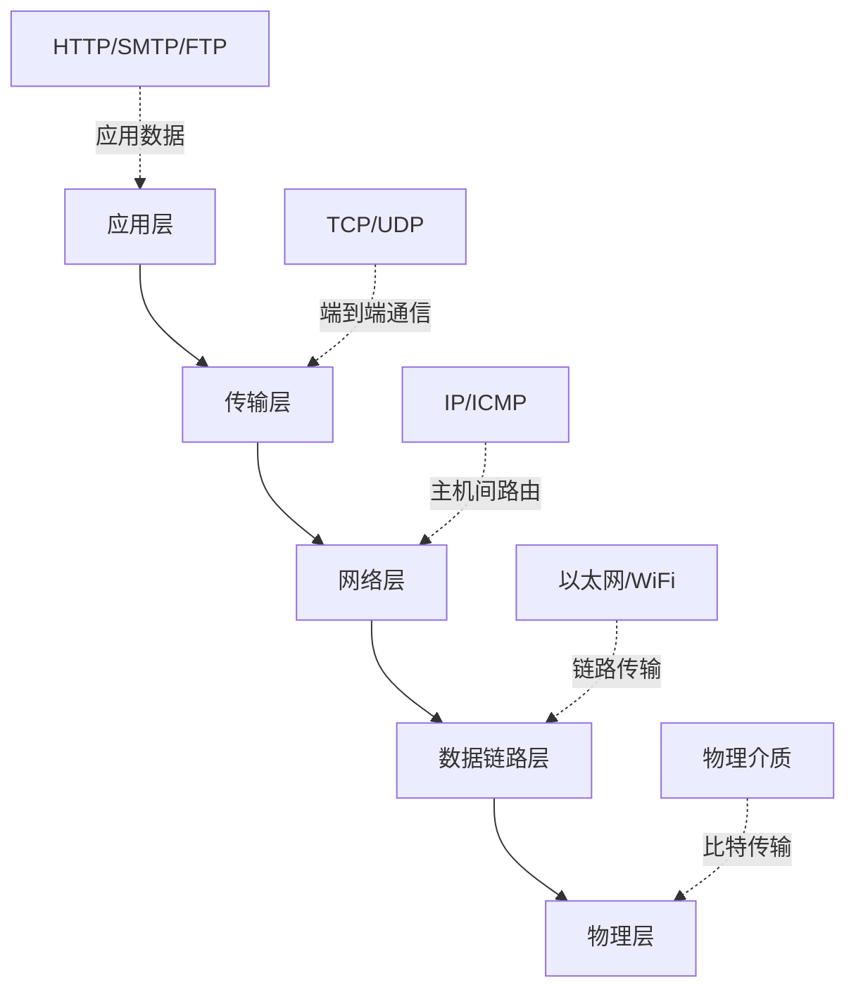
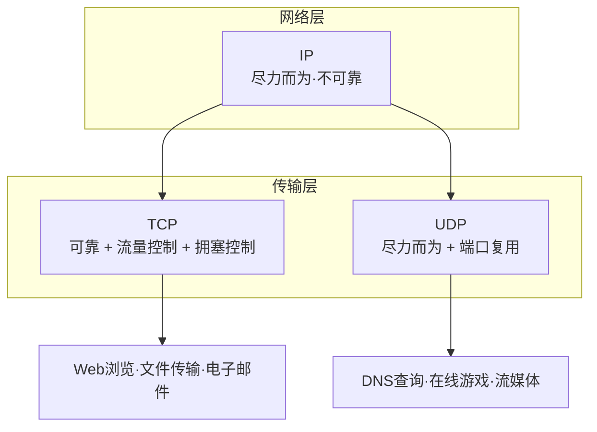
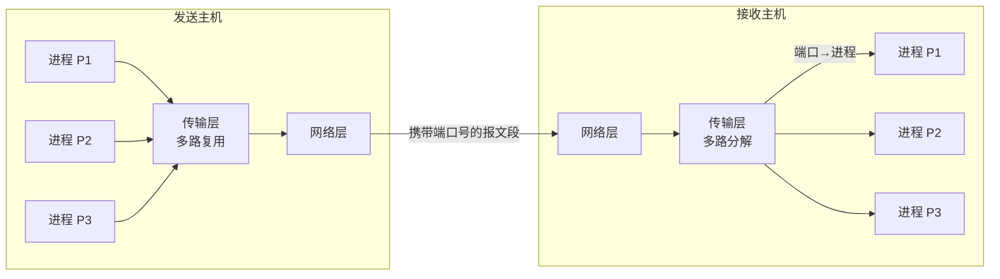
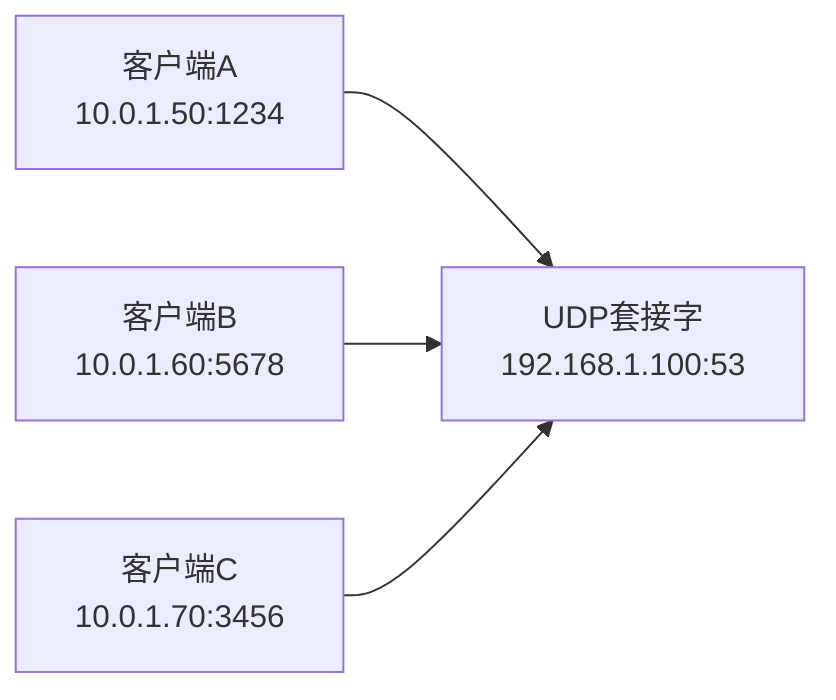
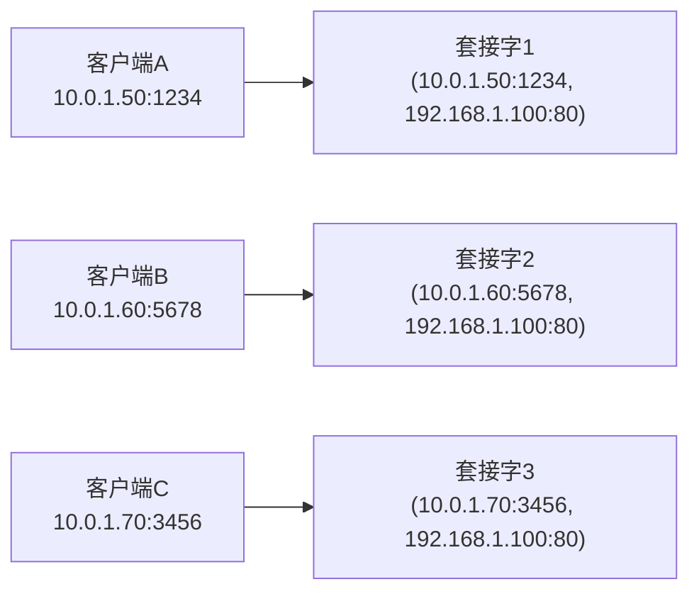
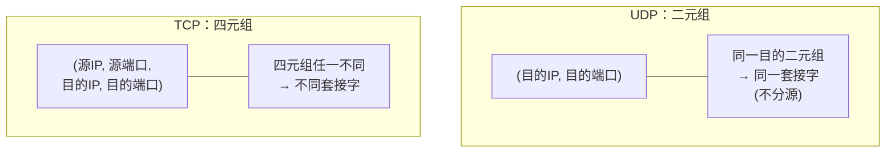
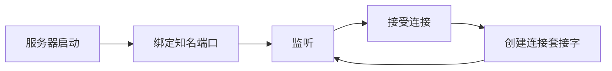
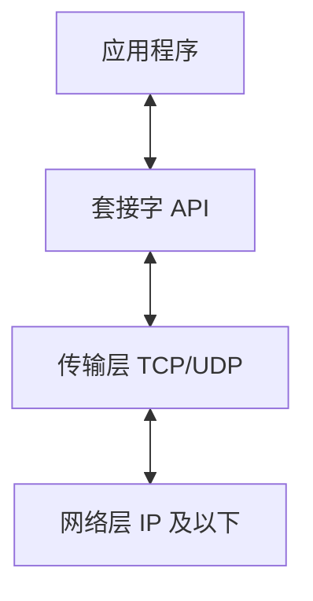
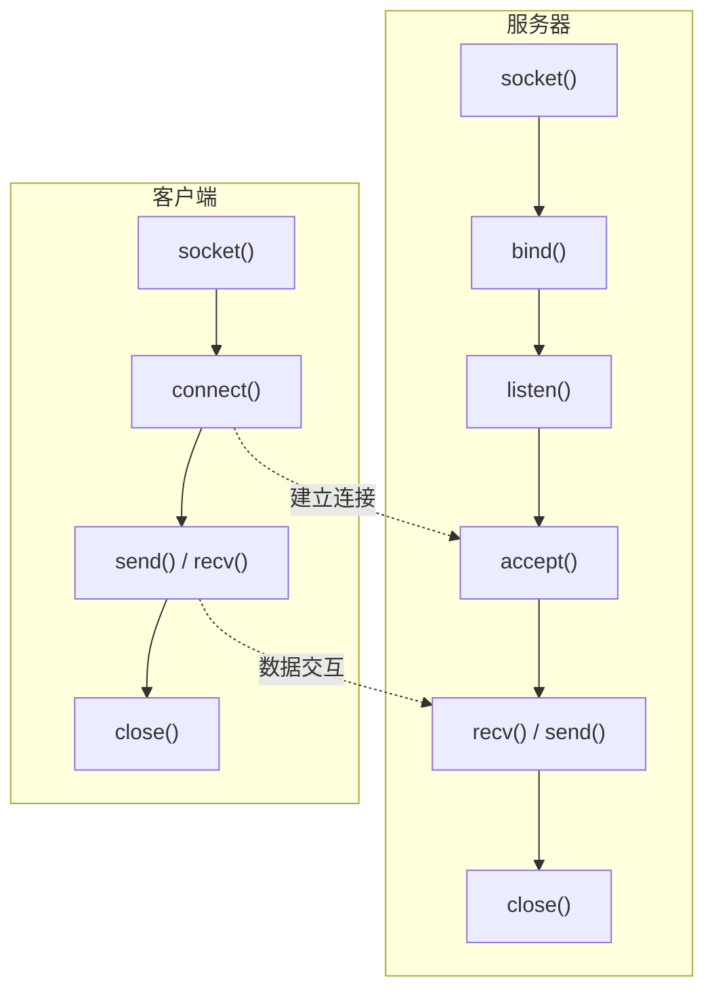

# 3.1 传输层：服务模型与多路复用

## 目录

1. [传输层概述](#传输层概述)
2. [传输层服务模型](#传输层服务模型)
3. [多路复用与多路分解](#多路复用与多路分解)
4. [端口号机制](#端口号机制)
5. [套接字概念](#套接字概念)

---

## 传输层概述

### 传输层的基本作用

> **传输层 (Transport Layer)**
> 
> 负责为运行在不同主机上的**应用进程**之间提供端到端的逻辑通信服务。

传输层是网络协议栈的第四层，它在网络层提供的主机到主机通信服务基础上，进一步提供进程到进程的通信服务。


```mermaid
graph TD
    A[应用层] --> B[传输层]
    B --> C[网络层]
    C --> D[数据链路层]
    D --> E[物理层]
    
    A1[HTTP/SMTP/FTP] -.->|应用数据| A
    B1[TCP/UDP] -.->|端到端通信| B
    C1[IP/ICMP] -.->|主机间路由| C
    D1[以太网/WiFi] -.->|链路传输| D
    E1[物理介质] -.->|比特传输| E
```

#### 传输层 vs 网络层的关键区别

| 比较维度 | 网络层 | 传输层 |
|---------|--------|--------|
| **通信端点** | 主机到主机 | 进程到进程 |
| **地址标识** | IP地址 | IP地址 + 端口号 |
| **主要功能** | 路由选择、数据转发 | 多路复用、可靠传输 |
| **服务质量** | 尽力而为服务 | 可提供可靠服务 |
| **协议举例** | IPv4、IPv6、ICMP | TCP、UDP、SCTP |

### 传输层的核心任务

传输层需要解决以下关键问题：

#### 1. 进程标识问题

**问题描述**：网络层只能将数据包送达目标主机，但一台主机上可能运行多个网络应用进程，如何准确定位目标进程？

**解决方案**：使用**端口号**来标识不同的应用进程
- 发送方：将多个应用进程的数据复用到网络连接上
- 接收方：根据端口号将数据分解到正确的应用进程

#### 2. 可靠性增强

**网络层限制**：IP协议提供的是"尽力而为"的不可靠服务
- 数据包可能丢失、重复、乱序、损坏
- 网络层不提供错误恢复机制

**传输层增强**：可以在不可靠网络层之上构建可靠服务
- **可靠数据传输**：确保数据无损失、无重复、按序到达
- **流量控制**：防止发送方发送速度过快
- **拥塞控制**：防止网络过载

---

## 传输层服务模型

传输层为应用程序提供两种截然不同的服务模型：

### 面向连接的可靠服务 (TCP)

> **TCP (Transmission Control Protocol)**
> 
> 提供面向连接、可靠、有序的数据传输服务。

#### TCP服务特点

| 服务特性 | 具体表现 | 实现机制 |
|----------|----------|----------|
| **面向连接** | 通信前需建立连接 | 三次握手建立，四次挥手释放 |
| **可靠传输** | 确保数据完整到达 | 序号、确认、超时重传 |
| **有序交付** | 数据按发送顺序到达 | 序号排序，缓存乱序数据 |
| **流量控制** | 控制发送速率 | 滑动窗口机制 |
| **拥塞控制** | 避免网络拥塞 | 慢启动、拥塞避免算法 |
| **全双工通信** | 双向同时传输 | 独立的发送和接收缓冲区 |

#### 适用场景
- 对数据完整性要求高：文件传输、网页浏览、电子邮件
- 大量数据传输：下载、流媒体传输
- 需要按序到达：数据库访问、远程登录

### 无连接的尽力服务 (UDP)

> **UDP (User Datagram Protocol)**
> 
> 提供无连接、不可靠、快速的数据报传输服务。

#### UDP服务特点

| 服务特性 | 具体表现 | 设计原因 |
|----------|----------|----------|
| **无连接** | 直接发送，无需建立连接 | 减少延迟和开销 |
| **不可靠** | 不保证数据到达 | 简化协议实现 |
| **无状态** | 不维护连接信息 | 减少内存开销 |
| **最大努力交付** | 尽力传输但不保证 | 降低网络负担 |
| **消息边界** | 保持应用层消息边界 | 数据报独立处理 |

#### 适用场景
- 实时性要求高：在线游戏、音视频通话
- 简单查询响应：DNS域名解析、SNMP网络管理
- 可容忍数据丢失：流媒体、传感器数据

### 服务模型对比


```mermaid
graph TB
    subgraph 网络层
        IP[IP<br/>尽力而为·不可靠]
    end
    subgraph 传输层
        TCP[TCP<br/>可靠 + 流量控制 + 拥塞控制]
        UDP[UDP<br/>尽力而为 + 端口复用]
    end
    IP --> TCP
    IP --> UDP
    TCP --> APP1[Web浏览·文件传输·电子邮件]
    UDP --> APP2[DNS查询·在线游戏·流媒体]
```

注：TCP、UDP 都建立在 IP 之上。IP 只把分组送达主机，是否可靠、是否控速则由传输层决定。

#### 选择依据

| 考虑因素 | 选择TCP | 选择UDP |
|----------|---------|---------|
| **数据可靠性** | 必须保证 | 可容忍丢失 |
| **传输延迟** | 可接受 | 要求极低 |
| **数据量大小** | 大文件传输 | 小数据包 |
| **连接持续时间** | 长连接 | 短暂交互 |
| **网络开销** | 可接受较高 | 要求最小 |

---

## 多路复用与多路分解

多路复用和多路分解是传输层最基本和最重要的功能，解决了多个应用进程共享网络连接的问题。

### 基本概念

> **多路复用 (Multiplexing)**
> 
> 在发送主机，传输层从多个应用进程接收数据，为每个数据段添加传输层头部（包含端口号等信息），然后传递给网络层。

> **多路分解 (Demultiplexing)**
> 
> 在接收主机，传输层根据传输层头部中的信息，将数据正确地交付给相应的应用进程。


```mermaid
graph LR
    subgraph 发送主机
        A1[进程 P1] --> MUX[传输层<br/>多路复用]
        A2[进程 P2] --> MUX
        A3[进程 P3] --> MUX
        MUX --> N1[网络层]
    end
    N1 -->|携带端口号的报文段| N3
    subgraph 接收主机
        N3[网络层] --> DEMUX[传输层<br/>多路分解]
        DEMUX -->|端口→进程| B1[进程 P1]
        DEMUX --> B2[进程 P2]
        DEMUX --> B3[进程 P3]
    end
```

复用是给每段数据贴上端口号汇入网络层；分解是接收端读端口号把数据投递给对应进程。两者一发一收，是同一机制的两端。

### 多路分解的实现机制

传输层如何知道将接收到的段交付给哪个应用进程？答案是通过**套接字**和**端口号**。

#### UDP的多路分解

UDP 套接字由**二元组**标识：

| 分解依据 | 作用 |
|----------|------|
| **目的IP地址** | 确定目标主机 |
| **目的端口号** | 确定目标套接字 |

特点：

- UDP 分解只看目的二元组，不关心源 IP 和源端口。
- 只要目的 IP、目的端口相同，来自不同源主机的报文段都被投递给同一个 UDP 套接字。

注：报文段头部仍携带源端口号，但它只用于对端回信的地址，不参与分解。

UDP 分解示例（一个套接字接收多个源）：


```mermaid
graph LR
    C1["客户端A<br/>10.0.1.50:1234"] --> S
    C2["客户端B<br/>10.0.1.60:5678"] --> S
    C3["客户端C<br/>10.0.1.70:3456"] --> S
    S["UDP套接字<br/>192.168.1.100:53"]
```

#### TCP的多路分解

TCP 套接字由**四元组**标识：

| 分解依据 | 作用 |
|----------|------|
| **源IP地址** | 发送方主机 |
| **源端口号** | 发送方进程 |
| **目的IP地址** | 接收方主机 |
| **目的端口号** | 接收方进程 |

特点：

- 四元组唯一标识一条 TCP 连接，每条连接对应一个独立的连接套接字。
- 同一个服务端口（如 80）可同时承载多条连接：只要四元组不同，就分解到不同套接字。

TCP 分解示例（同一服务端口分解到多个套接字）：


```mermaid
graph LR
    C1["客户端A<br/>10.0.1.50:1234"] --> K1["套接字1<br/>(10.0.1.50:1234, 192.168.1.100:80)"]
    C2["客户端B<br/>10.0.1.60:5678"] --> K2["套接字2<br/>(10.0.1.60:5678, 192.168.1.100:80)"]
    C3["客户端C<br/>10.0.1.70:3456"] --> K3["套接字3<br/>(10.0.1.70:3456, 192.168.1.100:80)"]
```

#### 二元组 vs 四元组分解（易混）


```mermaid
graph TB
    subgraph UDP分解["UDP：二元组"]
        U["(目的IP, 目的端口)"]
        UN["同一目的二元组<br/>→ 同一套接字<br/>(不分源)"]
        U --- UN
    end
    subgraph TCP分解["TCP：四元组"]
        T["(源IP, 源端口,<br/>目的IP, 目的端口)"]
        TN["四元组任一不同<br/>→ 不同套接字"]
        T --- TN
    end
```

注：差别只在分解是否看源地址。UDP 不看，所以一个套接字服务所有客户端；TCP 看，所以每条连接各有套接字。这正是 UDP 适合无连接请求响应、TCP 适合并发连接的根源。

### 实际应用场景

#### 场景1：DNS服务器 (UDP)

```
DNS服务器监听UDP端口53
┌─────────────────────────────────────┐
│  所有DNS查询 → 同一个UDP套接字      │
│  - 客户端A查询 google.com           │
│  - 客户端B查询 baidu.com            │
│  - 客户端C查询 github.com           │
└─────────────────────────────────────┘
```

#### 场景2：Web服务器 (TCP)

```
Web服务器监听TCP端口80
┌─────────────────────────────────────┐
│  每个HTTP连接 → 独立的TCP套接字     │
│  - 客户端A的连接 → 套接字1          │
│  - 客户端B的连接 → 套接字2          │
│  - 客户端C的连接 → 套接字3          │
└─────────────────────────────────────┘
```

---

## 端口号机制

端口号是传输层实现多路复用的关键机制，它将网络通信精确定位到具体的应用进程。

### 端口号基本概念

> **端口号 (Port Number)**
> 
> 16 位无符号整数（0–65535），用于标识主机上运行的特定应用进程或网络服务。

端口号的作用：

- **进程标识**：在单台主机内唯一标识一个网络应用。
- **服务定位**：客户端按约定的端口号找到所需服务（如 80 找 Web）。
- **多路复用 / 分解**：是传输层区分多个应用、多条连接的依据。

注：端口号只在单台主机内有意义，不同主机可以使用相同端口号。

### 端口号分类体系

#### 端口号范围划分

| 端口范围 | 类型名称 | 分配机制 | 主要用途 | 举例 |
|----------|----------|----------|----------|------|
| **0-1023** | 系统端口<br/>知名端口 | IANA官方分配 | 标准网络服务 | HTTP(80), HTTPS(443), DNS(53) |
| **1024-49151** | 注册端口<br/>用户端口 | IANA注册管理 | 特定应用服务 | MySQL(3306), MongoDB(27017) |
| **49152-65535** | 动态端口<br/>私有端口 | 系统动态分配 | 客户端临时端口 | 临时连接端口 |

#### 常见知名端口

| 端口号 | 协议 | 服务 | 用途 |
|--------|------|------|------|
| 20 / 21 | TCP | FTP | 文件传输（20 数据、21 控制） |
| 22 | TCP | SSH | 安全远程登录 |
| 23 | TCP | Telnet | 远程终端 |
| 25 | TCP | SMTP | 邮件发送 |
| 53 | UDP / TCP | DNS | 域名解析 |
| 67 / 68 | UDP | DHCP | 动态主机配置 |
| 80 | TCP | HTTP | Web 浏览 |
| 110 | TCP | POP3 | 邮件接收 |
| 143 | TCP | IMAP | 邮件访问 |
| 443 | TCP | HTTPS | 安全 Web |

### 端口号使用模式

**客户端**：端口由操作系统从动态端口范围（49152–65535）临时分配，连接结束后回收，不固定、客户端不必预知。

**服务器**：绑定固定的知名端口长期监听，客户端据此发起连接；每接受一个连接，再为其创建一个独立的连接套接字。


```mermaid
graph LR
    A[服务器启动] --> B[绑定知名端口] --> C[监听]
    C --> D[接受连接] --> E[创建连接套接字] --> C
```

### 套接字与端口的关系

套接字是端口号的具体实现形式，表示通信的端点。

#### 套接字标识格式

```
完整套接字地址 = IP地址 : 端口号

示例：
- Web服务器：192.168.1.100:80
- DNS服务器：8.8.8.8:53  
- 客户端连接：10.0.1.50:52341
```

#### 网络字节序

由于不同计算机体系结构可能使用不同的字节序，网络通信中统一规定：

> **网络字节序**
> 
> 网络传输中统一使用**大端字节序**（高位字节在前）。

| 字节序类型 | 特点 | 应用 |
|------------|------|------|
| **大端字节序** | 高位字节存储在低地址 | 网络传输标准 |
| **小端字节序** | 低位字节存储在低地址 | 部分计算机体系 |

### 典型应用场景

#### 场景1：Web浏览
```
客户端：192.168.1.50:52341 → 服务器：www.example.com:80
                             (客户端临时端口)     (HTTP标准端口)
```

#### 场景2：DNS查询
```  
客户端：10.0.1.100:51234 → DNS服务器：8.8.8.8:53
                            (临时端口)        (DNS标准端口)
```

#### 场景3：邮件发送
```
邮件客户端：172.16.1.10:49876 → SMTP服务器：mail.company.com:25
                                 (临时端口)              (SMTP标准端口)
```

### 端口号规划建议

1. **服务器应用**：优先使用标准知名端口，便于客户端访问
2. **企业应用**：在注册端口范围内选择固定端口
3. **客户端应用**：依赖系统自动分配，无需手动指定
4. **防火墙配置**：重点保护知名端口，限制不必要的端口访问

---

## 套接字概念

套接字是应用程序访问网络服务的编程接口，它抽象了网络通信的复杂细节。

### 套接字定义与作用

> **套接字 (Socket)**
> 
> 应用进程与传输层之间的编程接口，为应用程序提供网络通信能力的抽象。

#### 套接字的本质

套接字是应用进程与传输层之间的"门"：


```mermaid
graph TD
    APP[应用程序] <--> SOCKET[套接字 API]
    SOCKET <--> TRANSPORT[传输层 TCP/UDP]
    TRANSPORT <--> NETWORK[网络层 IP 及以下]
```

#### 套接字提供的抽象

| 抽象内容 | 具体表现 | 应用程序视角 |
|----------|----------|-------------|
| **地址抽象** | IP地址+端口号 | 逻辑地址，无需关心物理位置 |
| **通信抽象** | 可靠/不可靠传输 | 选择合适的服务质量 |  
| **数据抽象** | 字节流/数据报 | 按需选择数据传输方式 |
| **操作抽象** | 标准API函数 | 统一的编程接口 |

### 套接字类型分类

#### TCP套接字 (SOCK_STREAM)

> **流式套接字**
> 
> 提供可靠的、面向连接的字节流服务。

| 特性 | 详细说明 | 应用影响 |
|------|----------|----------|
| **面向连接** | 通信前需建立连接 | 有连接建立和释放开销 |
| **可靠传输** | 保证数据完整到达 | 适合重要数据传输 |
| **有序传输** | 数据按发送顺序到达 | 简化应用层数据处理 |
| **字节流服务** | 数据作为连续流处理 | 应用需要自己分割消息 |
| **全双工** | 可同时双向传输 | 支持交互式应用 |

**典型应用场景**：
- **Web服务**：HTTP/HTTPS协议
- **文件传输**：FTP、下载服务
- **远程访问**：SSH、Telnet
- **电子邮件**：SMTP、POP3、IMAP

#### UDP套接字 (SOCK_DGRAM)

> **数据报套接字**
> 
> 提供无连接的、不可靠的消息传输服务。

| 特性 | 详细说明 | 应用影响 |  
|------|----------|----------|
| **无连接** | 直接发送数据，无需建立连接 | 减少延迟，提高效率 |
| **不可靠** | 不保证数据到达 | 应用需处理丢失情况 |
| **消息边界** | 保持应用消息的完整性 | 接收时按完整消息处理 |
| **简单快速** | 协议开销小 | 适合实时应用 |

**典型应用场景**：
- **域名解析**：DNS查询
- **实时通信**：语音视频通话、在线游戏  
- **简单服务**：DHCP、NTP、SNMP
- **广播应用**：局域网发现服务

### 套接字地址结构

#### 套接字地址的组成

每个套接字都有一个唯一的地址标识：

```
套接字地址 = 协议族 + IP地址 + 端口号

例如：
- IPv4 TCP套接字：(AF_INET, 192.168.1.100, 80)
- IPv4 UDP套接字：(AF_INET, 8.8.8.8, 53)
```

#### 地址族类型

| 地址族 | 含义 | 使用场景 |
|--------|------|----------|
| **AF_INET** | IPv4网络 | 互联网通信 |
| **AF_INET6** | IPv6网络 | 新一代互联网 |
| **AF_UNIX** | 本地套接字 | 同主机进程间通信 |

### 套接字工作模式

TCP 通信中两端的调用流程（括号内为对应 API）：


```mermaid
graph TB
    subgraph 服务器
        SA["socket()"] --> SB["bind()"] --> SC["listen()"] --> SD["accept()"]
        SD --> SE["recv() / send()"] --> SF["close()"]
    end
    subgraph 客户端
        CA["socket()"] --> CB["connect()"] --> CC["send() / recv()"] --> CD["close()"]
    end
    CB -.建立连接.-> SD
    CC -.数据交互.-> SE
```

注：UDP 没有 `connect()` / `accept()` / `listen()`，两端 `socket()`、`bind()` 后直接用 `sendto()` / `recvfrom()` 收发。

### 套接字编程的重要概念

#### 1. 阻塞与非阻塞
- **阻塞模式**：操作未完成时程序等待
- **非阻塞模式**：操作立即返回，即使未完成

#### 2. 同步与异步  
- **同步**：程序主动查询操作状态
- **异步**：操作完成时系统主动通知程序

#### 3. 并发处理
- **多进程**：为每个连接创建独立进程
- **多线程**：为每个连接创建独立线程  
- **事件驱动**：单线程处理多个连接事件

---

## 本章小结与考点分析

### 核心概念回顾

#### 传输层的关键作用

1. **进程到进程通信**：弥补网络层只能做主机到主机通信的局限。
2. **多路复用与分解**：让一台主机上多个应用进程共享网络。
3. **服务质量增强**：在不可靠的网络层之上提供可靠或高效的传输。

#### 两种基本服务模型

| 对比维度 | TCP | UDP |
|----------|-----|-----|
| **连接性** | 面向连接 | 无连接 |
| **可靠性** | 可靠传输 | 尽力而为 |
| **效率** | 开销较大 | 开销很小 |
| **适用性** | 数据完整性要求高 | 实时性要求高 |

#### 多路复用机制

- **UDP 分解**：二元组（目的 IP，目的端口）。
- **TCP 分解**：四元组（源 IP，源端口，目的 IP，目的端口）。

### 重要知识点总结

#### 端口号体系

| 端口范围 | 类型 | 典型应用 |
|----------|------|----------|
| 0–1023 | 知名端口 | HTTP(80)、HTTPS(443)、DNS(53)、SSH(22) |
| 1024–49151 | 注册端口 | 应用专用端口 |
| 49152–65535 | 动态端口 | 客户端临时端口 |

#### 套接字概念

- **定义**：应用进程与传输层的编程接口
- **类型**：TCP套接字(SOCK_STREAM)、UDP套接字(SOCK_DGRAM)
- **地址**：协议族 + IP地址 + 端口号

### 典型例题与解析

#### 例题 3.1：多路复用

**题目**：主机 A 运行 Web 服务器（端口 80），同时有 3 个客户端连接：
- 客户端 1：10.1.1.100:5001
- 客户端 2：10.1.1.100:5002
- 客户端 3：10.1.2.200:5001

服务器如何区分这 3 个连接？

**解析**：TCP 以四元组标识连接：
- 连接 1：(10.1.1.100:5001, A:80)
- 连接 2：(10.1.1.100:5002, A:80)
- 连接 3：(10.1.2.200:5001, A:80)

客户端 1 与 3 源端口同为 5001，但源 IP 不同，四元组仍唯一，故能正确区分。

#### 例题 3.2：协议选择

**题目**：下列应用应选 TCP 还是 UDP？说明理由。
1. 实时音视频通话
2. 网上银行转账
3. 域名查询（DNS）
4. 文件下载

**解析**：
1. **实时音视频通话**：UDP。实时性优先，偶尔丢帧可接受，不能因重传而卡顿。
2. **网上银行转账**：TCP。数据完整性要求极高，不容丢失或错乱。
3. **域名查询**：UDP。一问一答的短报文，省去建连开销，响应更快。
4. **文件下载**：TCP。须保证文件完整、按序。

### 常见易错点

#### 易错点1：UDP的"不可靠"理解
- **错误理解**：UDP经常丢失数据，不能使用
- **正确理解**：UDP不保证数据到达，但在良好网络环境下丢包率很低
- **关键区别**：不可靠≠不能用，而是不提供可靠性保证机制

#### 易错点2：端口号的作用范围
- **错误理解**：端口号在整个网络中唯一
- **正确理解**：端口号只在单台主机内唯一标识进程
- **关键要点**：不同主机可以使用相同端口号

#### 易错点3：TCP连接的唯一性
- **错误理解**：相同的服务端口不能同时服务多个客户端
- **正确理解**：TCP 用四元组标识连接，同一服务端口可同时服务多个客户端

---

下一节：[3.2 传输层：UDP协议与应用](3.2传输层：UDP协议与应用.md)
