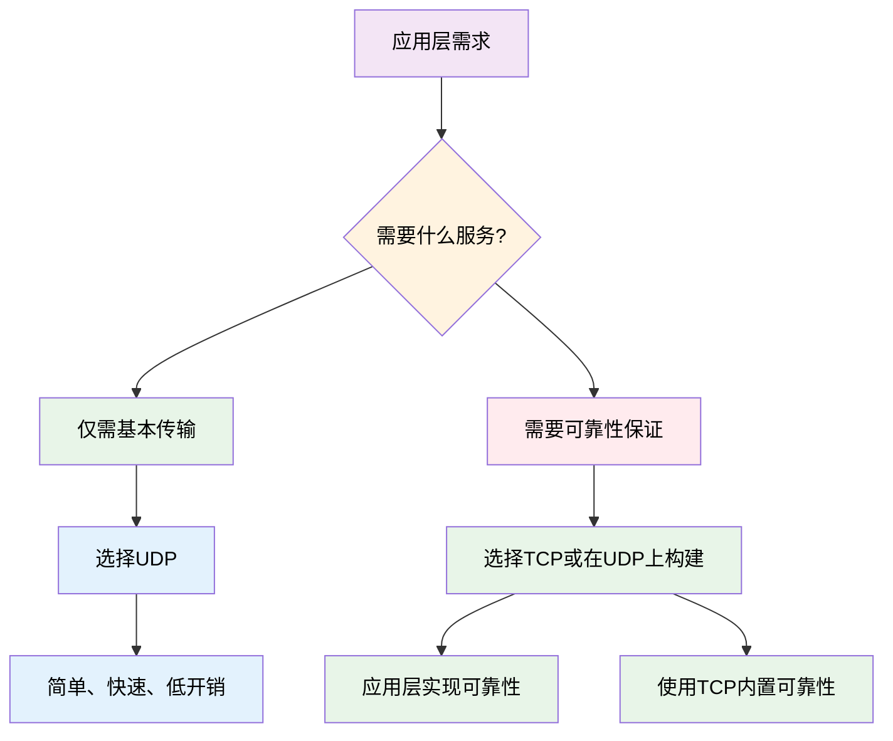
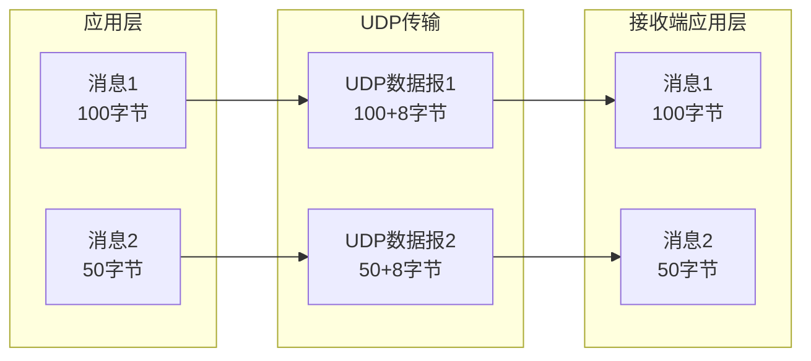
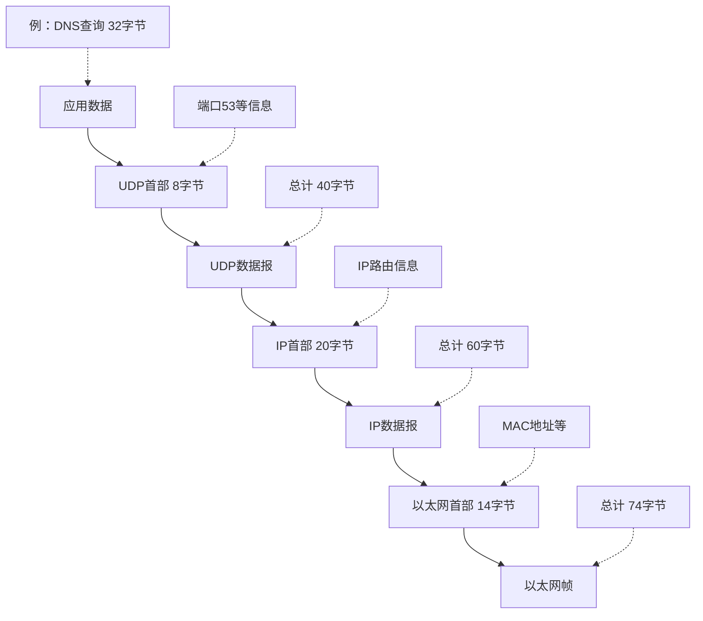
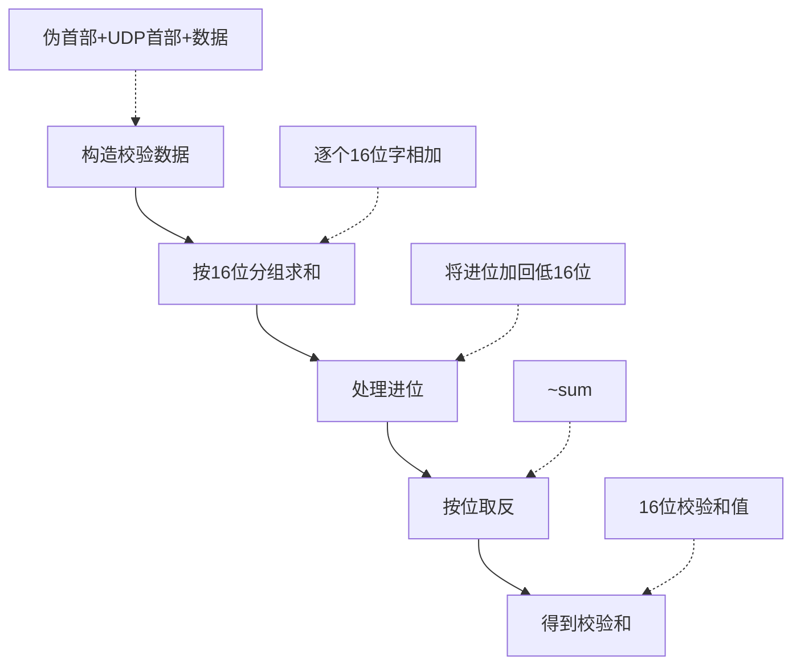
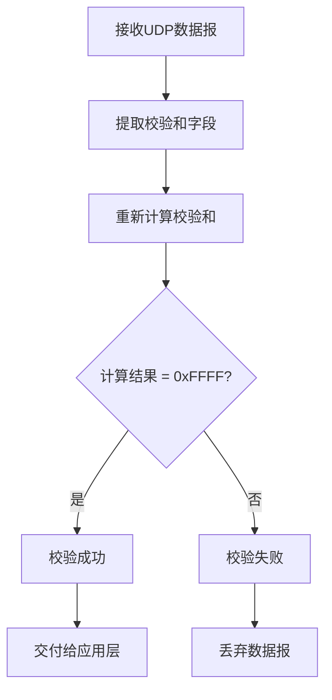
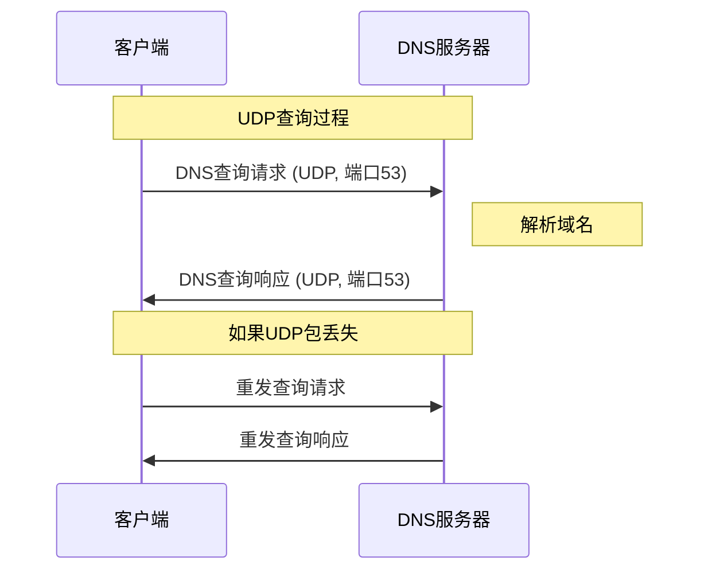
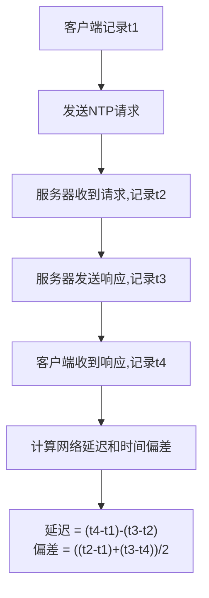
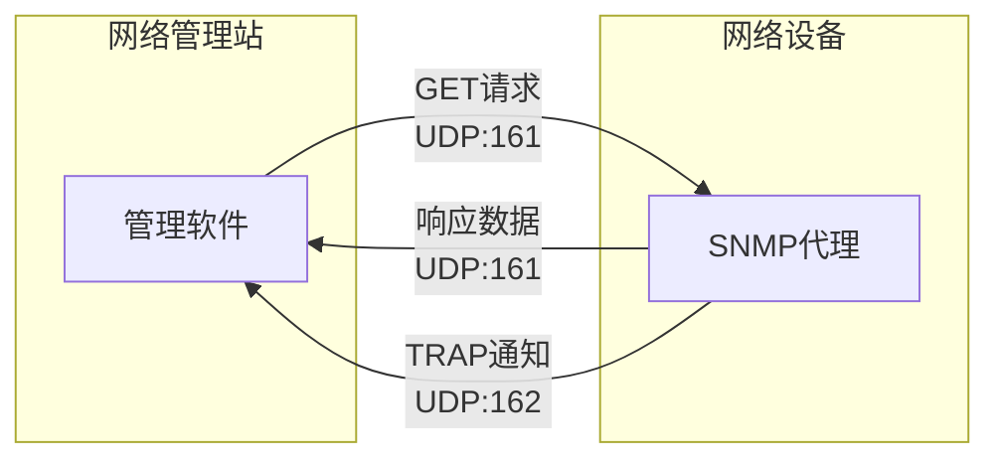
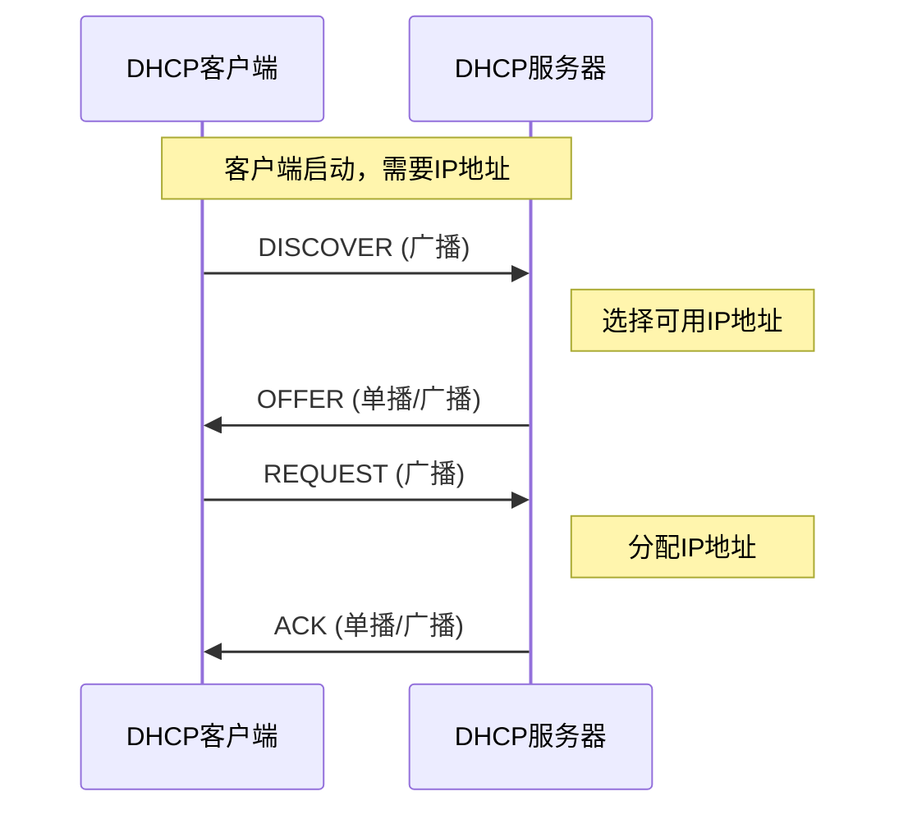
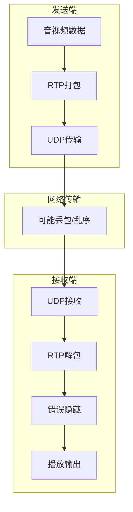

# 3.2 传输层：UDP协议与应用

## 学习目标

通过本节学习，应该能够：
- 深入理解UDP协议的设计理念和基本特性 ⭐⭐⭐⭐⭐  
- 掌握UDP报文段的格式和各字段含义 ⭐⭐⭐⭐
- 理解UDP校验和的计算和验证机制 ⭐⭐⭐
- 熟悉UDP的典型应用场景 ⭐⭐⭐⭐
- 能够分析UDP与TCP的适用性差异 ⭐⭐⭐⭐⭐

## 本章目录

1. [UDP协议概述](#udp协议概述)
2. [UDP报文段结构](#udp报文段结构)
3. [UDP校验和机制](#udp校验和机制)
4. [UDP典型应用](#udp典型应用)
5. [UDP性能特性](#udp性能特性)
6. [UDP vs TCP深度对比](#udp-vs-tcp深度对比)

---

## UDP协议概述

### UDP协议的设计哲学

> **用户数据报协议 (User Datagram Protocol, UDP)**
> 
> 提供无连接、不可靠但高效的传输层服务，体现了"保持简单"的设计哲学。

#### 核心设计原则

UDP的设计遵循**端到端原则**：网络核心保持简单，复杂性推向网络边缘。



### UDP的基本特性

#### 1. 无连接特性 ⭐⭐⭐⭐⭐

| 方面 | UDP特点 | 影响 |
|------|---------|------|
| **连接建立** | 无需建立连接 | 减少延迟，立即发送数据 |
| **连接状态** | 不维护连接信息 | 节省内存，简化实现 |
| **数据发送** | 直接发送到目标地址 | 支持一对多通信 |

#### 2. 不可靠特性 ⭐⭐⭐⭐⭐

> **重要理解**：不可靠≠不能用，而是不提供可靠性保证机制

| 不保证项目 | 具体表现 | 应对策略 |
|------------|----------|----------|
| **数据到达** | 数据包可能丢失 | 应用层重传或容忍丢失 |
| **到达顺序** | 可能乱序到达 | 应用层排序或无序要求 |
| **重复检测** | 可能收到重复数据 | 应用层去重 |
| **错误恢复** | 损坏数据被丢弃 | 依赖应用层处理 |

#### 3. 面向数据报 ⭐⭐⭐⭐



**关键特点**：
- **消息边界保持**：每个UDP数据报对应一个应用层消息
- **原子性传输**：数据报作为整体发送和接收
- **独立处理**：每个数据报独立路由和处理

#### 4. 简单高效 ⭐⭐⭐⭐

| 简单性体现 | 具体表现 | 效率优势 |
|------------|----------|----------|
| **协议开销** | 仅8字节头部 | 最小化带宽消耗 |
| **处理复杂度** | 无状态机制 | 快速处理，低CPU开销 |
| **实现难度** | 协议简单 | 易于实现和调试 |

### UDP vs IP：为什么不直接使用IP？

虽然UDP非常简单，但相比直接使用IP协议，UDP仍然提供了重要价值：

| UDP增加的功能 | 价值 | 重要性 |
|---------------|------|-------|
| **端口号** | 进程级别的多路复用 | ⭐⭐⭐⭐⭐ |
| **长度字段** | 数据报边界标识 | ⭐⭐⭐ |
| **校验和** | 基本错误检测 | ⭐⭐⭐⭐ |

### UDP的适用场景总结

#### 理想使用条件

1. **对延迟敏感**：实时性比可靠性更重要
2. **容忍数据丢失**：偶尔的数据丢失可以接受
3. **简单交互**：请求-响应模式，交互较少
4. **广播需求**：需要一对多通信
5. **资源受限**：内存、CPU或带宽有限

#### 不适合的场景

1. **关键数据传输**：金融交易、重要文件传输
2. **大量数据**：需要传输大文件或长时间数据流
3. **顺序要求**：数据必须按序处理
4. **复杂交互**：需要维护会话状态

---

## UDP报文段结构

### UDP首部格式 ⭐⭐⭐⭐

UDP协议的首部结构非常简洁，仅包含4个字段，总长度固定为8字节：

```
 0                   1                   2                   3
 0 1 2 3 4 5 6 7 8 9 0 1 2 3 4 5 6 7 8 9 0 1 2 3 4 5 6 7 8 9 0 1
+-+-+-+-+-+-+-+-+-+-+-+-+-+-+-+-+-+-+-+-+-+-+-+-+-+-+-+-+-+-+-+-+
|          源端口号              |         目的端口号             |
+-+-+-+-+-+-+-+-+-+-+-+-+-+-+-+-+-+-+-+-+-+-+-+-+-+-+-+-+-+-+-+-+
|            长度               |           校验和               |
+-+-+-+-+-+-+-+-+-+-+-+-+-+-+-+-+-+-+-+-+-+-+-+-+-+-+-+-+-+-+-+-+
|                                                               |
+                            应用数据                            +
|                             ...                               |
+-+-+-+-+-+-+-+-+-+-+-+-+-+-+-+-+-+-+-+-+-+-+-+-+-+-+-+-+-+-+-+-+
```

### 字段详细解析

#### 1. 源端口号 (Source Port) ⭐⭐⭐⭐

| 属性 | 值 | 说明 |
|------|----|----|
| **字段长度** | 16位 | 支持0-65535端口号 |
| **主要作用** | 标识发送进程 | 接收方回复时的目标端口 |
| **典型值** | 49152-65535 | 客户端临时端口范围 |

**使用特点**：
- **客户端**：操作系统自动分配临时端口
- **服务器**：通常设置为0（表示不关心响应端口）
- **值为0**：合法值，表示源端口信息不重要

#### 2. 目的端口号 (Destination Port) ⭐⭐⭐⭐⭐

| 属性 | 值 | 说明 |
|------|----|----|
| **字段长度** | 16位 | 支持0-65535端口号 |
| **主要作用** | 标识接收进程 | UDP多路分解的关键依据 |
| **重要性** | 最高 | 决定数据交付给哪个应用进程 |

**常见知名端口**：
| 端口号 | 协议 | 服务 | 应用场景 |
|--------|------|------|----------|
| 53 | UDP | DNS | 域名解析查询 |
| 67/68 | UDP | DHCP | 动态主机配置 |
| 69 | UDP | TFTP | 简单文件传输 |
| 123 | UDP | NTP | 网络时间同步 |
| 161 | UDP | SNMP | 网络管理 |

#### 3. 长度字段 (Length) ⭐⭐⭐

| 属性 | 值 | 说明 |
|------|----|----|
| **字段长度** | 16位 | 最大支持65535字节 |
| **计算方式** | UDP首部+数据 | 长度 = 8 + 数据字节数 |
| **最小值** | 8字节 | 仅包含UDP首部 |

**长度字段的作用**：


**计算示例**：
- DNS查询包：长度 = 8(UDP首部) + 32(DNS查询) = 40字节
- DHCP请求包：长度 = 8(UDP首部) + 240(DHCP数据) = 248字节

#### 4. 校验和 (Checksum) ⭐⭐⭐

| 属性 | IPv4 | IPv6 |
|------|------|------|
| **是否必需** | 可选(可设为0) | 必需 |
| **校验范围** | 伪首部+UDP首部+数据 | 伪首部+UDP首部+数据 |
| **算法** | 16位反码求和 | 16位反码求和 |

### UDP在协议栈中的封装

UDP数据报的完整封装过程：



### UDP首部开销分析

#### 开销效率对比

| 场景 | 应用数据 | UDP首部 | 总大小 | 开销比例 |
|------|----------|---------|--------|----------|
| DNS查询 | 32字节 | 8字节 | 40字节 | 20% |
| DHCP请求 | 240字节 | 8字节 | 248字节 | 3.2% |
| 语音包(G.711) | 160字节 | 8字节 | 168字节 | 4.8% |
| 视频包 | 1400字节 | 8字节 | 1408字节 | 0.6% |

**关键观察**：
- 小数据包的协议开销相对较高
- 大数据包的协议开销可以忽略
- UDP开销远小于TCP（TCP首部至少20字节）

### IP伪首部的作用

UDP校验和需要包含IP伪首部，确保数据报被正确路由：

#### IPv4伪首部格式

```
 0                   1                   2                   3  
 0 1 2 3 4 5 6 7 8 9 0 1 2 3 4 5 6 7 8 9 0 1 2 3 4 5 6 7 8 9 0 1
+-+-+-+-+-+-+-+-+-+-+-+-+-+-+-+-+-+-+-+-+-+-+-+-+-+-+-+-+-+-+-+-+
|                        源IP地址                               |
+-+-+-+-+-+-+-+-+-+-+-+-+-+-+-+-+-+-+-+-+-+-+-+-+-+-+-+-+-+-+-+-+
|                       目的IP地址                              |
+-+-+-+-+-+-+-+-+-+-+-+-+-+-+-+-+-+-+-+-+-+-+-+-+-+-+-+-+-+-+-+-+
|     零字段     |  协议号(17)  |         UDP长度               |
+-+-+-+-+-+-+-+-+-+-+-+-+-+-+-+-+-+-+-+-+-+-+-+-+-+-+-+-+-+-+-+-+
```

#### 伪首部的意义

| 字段 | 作用 | 重要性 |
|------|------|-------|
| **源/目的IP** | 验证IP层路由正确性 | 防止数据报被误投递 |
| **协议号17** | 确认是UDP协议 | 防止协议类型错误 |
| **UDP长度** | 双重长度验证 | 确保数据完整性 |

---

## UDP校验和机制

UDP校验和提供基本的错误检测功能，虽然简单但对于保证数据完整性很重要。

### 校验和的作用与重要性

#### 错误检测能力 ⭐⭐⭐

| 检测能力 | 说明 | 局限性 |
|----------|------|-------|
| **单比特错误** | 能够检测出所有单比特错误 | 无法纠正错误 |
| **双比特错误** | 大部分双比特错误可被检测 | 部分特殊模式检测不出 |
| **突发错误** | 短突发错误基本可以检测 | 长突发错误可能检测不出 |
| **随机错误** | 随机错误检测概率约为99.998% | 仍有极小概率漏检 |

#### IPv4 vs IPv6的差异

| 方面 | IPv4 | IPv6 |
|------|------|------|
| **校验和要求** | 可选（可设为0） | 强制必需 |  
| **设计考虑** | 依赖IP层校验和 | IP层无校验和 |
| **伪首部长度** | 12字节 | 40字节 |

### 校验和算法原理

#### 16位反码求和算法 ⭐⭐⭐

校验和使用经典的**16位反码求和算法**，这是Internet协议族的标准算法。

**算法步骤**：



#### 具体计算过程

以一个简单的DNS查询为例：

**第1步：构造校验数据**
- IP伪首部：12字节
- UDP首部（校验和字段暂设为0）：8字节  
- DNS数据：32字节
- 总计：52字节

**第2步：16位分组**
```
数据分组（十六进制）:
C0A8 0101  源IP: 192.168.1.1
C0A8 0102  目的IP: 192.168.1.2  
0011 0020  协议(17) + UDP长度(32)
04D2 0035  源端口(1234) + 目的端口(53)
0020 0000  UDP长度(32) + 校验和(0)
...        DNS查询数据
```

**第3步：累加求和**
```
Sum = C0A8 + 0101 + C0A8 + 0102 + ... + DNS数据
处理进位：如果Sum > 0xFFFF，则Sum = (Sum & 0xFFFF) + 1
```

**第4步：取反**
```
Checksum = ~Sum & 0xFFFF
```

#### 进位处理的重要性

进位处理确保了算法的**换序不变性**：

```
例如：A + B 和 B + A 产生相同的校验和
0x8000 + 0x8000 = 0x10000
处理进位：0x0000 + 1 = 0x0001
取反：~0x0001 = 0xFFFE
```

### 校验和验证过程

#### 接收端验证 ⭐⭐⭐

接收端的验证过程非常直接：



**验证原理**：
- 如果数据无错误，重新计算（包含原校验和）结果应该是0xFFFF
- 这是因为：(原数据和 + 校验和) ≡ 0xFFFF（反码运算）

#### 错误处理策略

| 处理方式 | IPv4 | IPv6 | 说明 |
|----------|------|------|------|
| **校验和=0** | 跳过校验 | 强制校验 | IPv6不允许0值 |
| **校验失败** | 丢弃数据报 | 丢弃数据报 | 不通知上层 |
| **错误统计** | 可选记录 | 建议记录 | 用于网络诊断 |

### IPv6中的特殊要求

#### 强制校验和的原因

IPv6取消了IP首部校验和，UDP校验和成为唯一的错误检测机制：

| 设计考虑 | IPv4 | IPv6 |
|----------|------|------|
| **IP首部校验** | 有 | 无 |
| **传输层责任** | 可选增强 | 必需保护 |  
| **性能考虑** | 双重校验 | 避免重复 |

#### IPv6伪首部格式

IPv6伪首部更长，但结构类似：

```
+-+-+-+-+-+-+-+-+-+-+-+-+-+-+-+-+-+-+-+-+-+-+-+-+-+-+-+-+-+-+-+-+
|                                                               |
+                      源IPv6地址 (16字节)                       +
|                                                               |
+-+-+-+-+-+-+-+-+-+-+-+-+-+-+-+-+-+-+-+-+-+-+-+-+-+-+-+-+-+-+-+-+
|                                                               |
+                      目的IPv6地址 (16字节)                      +
|                                                               |  
+-+-+-+-+-+-+-+-+-+-+-+-+-+-+-+-+-+-+-+-+-+-+-+-+-+-+-+-+-+-+-+-+
|                    UDP长度                    |  零  |下一首部|
+-+-+-+-+-+-+-+-+-+-+-+-+-+-+-+-+-+-+-+-+-+-+-+-+-+-+-+-+-+-+-+-+
```

### 校验和的工程考虑

#### 性能影响

| 因素 | 影响 | 优化策略 |
|------|------|----------|
| **计算复杂度** | O(n)线性 | 硬件加速 |
| **内存访问** | 需要扫描数据 | 缓存友好算法 |
| **处理延迟** | 微秒级 | 流水线处理 |

#### 实际部署考虑

1. **可选性权衡**：IPv4中允许关闭校验可以提高性能，但牺牲了可靠性
2. **硬件支持**：现代网卡通常提供校验和卸载功能
3. **应用需求**：关键应用应该启用校验和，非关键应用可考虑性能优化

---

## UDP典型应用

UDP的简单特性使其成为众多网络应用的首选传输协议。以下分析UDP在不同场景中的应用及其设计考虑。

### 域名解析服务 (DNS)

#### 为什么DNS选择UDP？ ⭐⭐⭐⭐⭐

| 考虑因素 | DNS需求 | UDP特性匹配 |
|----------|---------|-------------|
| **查询模式** | 简单请求-响应 | 无需维护连接状态 |
| **延迟要求** | 快速响应(<100ms) | 无连接建立开销 |
| **数据量** | 查询包通常<512字节 | 单包传输，无分片 |
| **服务器负载** | 需要处理海量查询 | 无状态，高并发 |

#### DNS工作流程



**关键设计点**：
- **单包传输**：大部分DNS查询响应都能在一个UDP包内完成
- **应用层重传**：客户端检测超时后重发查询
- **负载均衡**：可以向多个DNS服务器并发查询

### 网络时间协议 (NTP)

#### NTP的实时性需求 ⭐⭐⭐⭐

网络时间同步对延迟极其敏感，任何额外的协议开销都会影响时间精度。

| NTP特性 | UDP优势 |
|---------|---------|
| **时间戳精度** | 微秒级同步要求 | 最小化传输延迟 |
| **周期性同步** | 定期时间校准 | 无连接维护开销 |
| **多服务器** | 从多个时间源获取时间 | 支持广播和组播 |

#### NTP工作原理



### 简单网络管理协议 (SNMP)

#### SNMP的管理需求 ⭐⭐⭐

SNMP用于网络设备的监控和管理，通常采用UDP传输。

| SNMP操作 | 特点 | UDP适配性 |
|----------|------|----------|
| **GET操作** | 读取设备状态 | 简单请求响应，适合UDP |
| **SET操作** | 配置设备参数 | 少量数据，快速操作 |
| **TRAP操作** | 设备主动通知 | 异步通知，UDP广播支持 |

#### SNMP消息流



### 动态主机配置协议 (DHCP)

#### DHCP的引导需求 ⭐⭐⭐⭐

DHCP用于主机获取IP地址等网络配置，在主机启动阶段运行。

| DHCP阶段 | 特点 | UDP必要性 |
|----------|------|-----------|
| **发现阶段** | 广播寻找DHCP服务器 | UDP支持广播 |
| **提供阶段** | 服务器提供IP地址 | 无需维护连接 |
| **请求阶段** | 客户端请求特定地址 | 简单交互 |
| **确认阶段** | 服务器确认地址分配 | 快速完成 |

#### DHCP四步握手



### 实时多媒体应用

#### 音视频流传输 ⭐⭐⭐⭐⭐

实时音视频应用对延迟的要求远超对可靠性的要求。

| 应用类型 | 延迟要求 | 丢包容忍度 | UDP优势 |
|----------|----------|------------|---------|
| **VoIP通话** | <150ms | 1-3% | 无重传延迟 |
| **视频会议** | <200ms | 2-5% | 支持组播 |
| **在线游戏** | <50ms | 极低 | 极低延迟 |
| **直播流媒体** | <3s | 较高 | 高吞吐量 |

#### RTP over UDP架构



### 其他重要应用

#### 系统服务类

| 服务 | 端口 | 应用特点 |
|------|------|----------|
| **Syslog** | 514 | 日志传输，可容忍丢失 |
| **RADIUS** | 1812/1813 | 认证授权，简单交互 |
| **TFTP** | 69 | 简单文件传输 |
| **Wake-on-LAN** | 9 | 魔术包唤醒 |

#### 新兴应用

1. **物联网设备**：资源受限，需要低功耗协议
2. **CDN边缘计算**：快速内容分发
3. **微服务健康检查**：轻量级服务状态检测
4. **区块链P2P网络**：去中心化节点发现

---

## UDP性能特性

### 延迟性能分析

#### UDP vs TCP延迟对比 ⭐⭐⭐⭐

| 网络环境 | TCP首次数据延迟 | UDP首次数据延迟 | 延迟差异 |
|----------|-----------------|-----------------|----------|
| 局域网(1ms RTT) | 3-5ms | 0.5ms | 6-10倍 |
| 广域网(50ms RTT) | 150ms | 25ms | 6倍 |
| 卫星链路(300ms RTT) | 900ms | 150ms | 6倍 |

**延迟构成**：
- **TCP**：连接建立(1.5RTT) + 数据传输 + 连接释放
- **UDP**：直接数据传输

### 吞吐量特性

#### 协议开销对比

| 数据包大小 | UDP开销 | TCP开销 | UDP优势 |
|------------|---------|---------|---------|
| 64字节 | 11.1% | 23.8% | 2.1倍 |
| 512字节 | 1.5% | 3.8% | 2.5倍 |
| 1500字节 | 0.5% | 1.3% | 2.6倍 |

### 资源消耗

#### 内存使用

| 资源类型 | UDP | TCP | 说明 |
|----------|-----|-----|------|
| **连接状态** | 无 | 每连接~4KB | TCP维护连接信息 |
| **缓冲区** | 最小 | 发送+接收缓冲区 | TCP需要重传缓冲 |
| **并发连接** | 无限制 | 受内存限制 | UDP服务器扩展性好 |

---

## UDP vs TCP深度对比

### 全面特性对比 ⭐⭐⭐⭐⭐

| 特性维度 | UDP | TCP | 应用指导 |
|----------|-----|-----|----------|
| **连接性** | 无连接 | 面向连接 | 选择UDP：简单交互 |
| **可靠性** | 不可靠 | 可靠 | 选择TCP：关键数据 |
| **有序性** | 无序 | 有序 | 选择TCP：顺序重要 |
| **流控制** | 无 | 有 | 选择TCP：速度匹配 |
| **拥塞控制** | 无 | 有 | 选择TCP：网络友好 |
| **头部开销** | 8字节 | ≥20字节 | 选择UDP：小包传输 |
| **实时性** | 优秀 | 一般 | 选择UDP：实时应用 |
| **广播支持** | 支持 | 不支持 | 选择UDP：一对多 |

### 本章小结与考点分析

#### 核心知识点回顾

1. **UDP设计哲学** ⭐⭐⭐⭐⭐：简单、高效、端到端原则
2. **UDP报文格式** ⭐⭐⭐⭐：8字节固定头部，4个基本字段
3. **校验和机制** ⭐⭐⭐：16位反码求和，IPv6中强制
4. **典型应用** ⭐⭐⭐⭐：DNS、NTP、DHCP、流媒体
5. **性能特性** ⭐⭐⭐：低延迟、低开销、高并发

#### 典型例题与解析

**例题3.3：UDP适用性判断** ⭐⭐⭐⭐

**题目**：以下哪些应用最适合使用UDP协议？
A. 网上银行转账  B. DNS域名查询  C. 大文件下载  D. 视频直播

**解析**：B和D。DNS查询是简单的请求-响应，视频直播要求低延迟且能容忍丢包。

#### 常见易错点

1. **UDP"不可靠"的误解**：不可靠≠经常出错，而是不提供保证
2. **校验和作用**：只检测错误不纠正错误  
3. **应用选择**：关键在于理解业务需求vs协议特性

---

[3.3 可靠传输原理](3.3传输层：可靠传输原理.md) 
