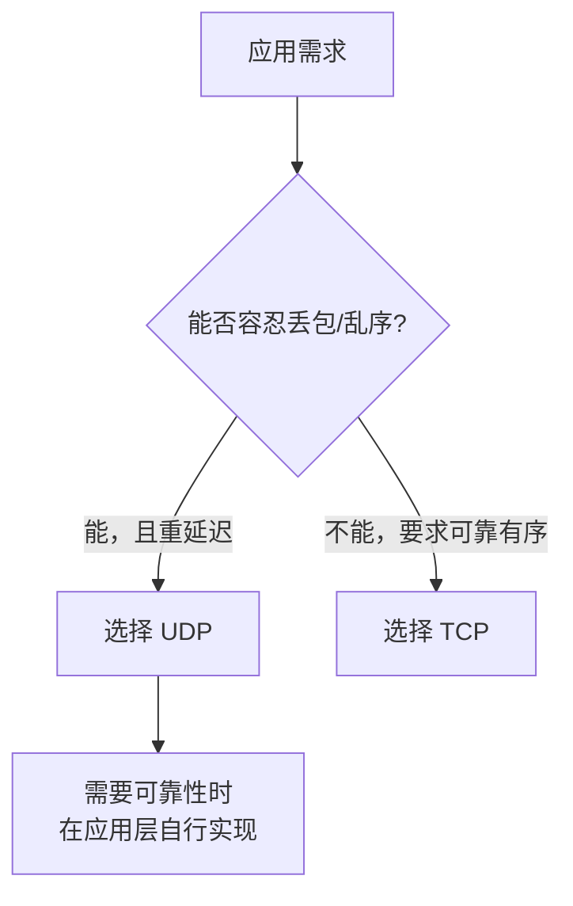
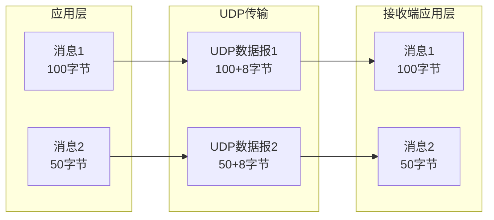
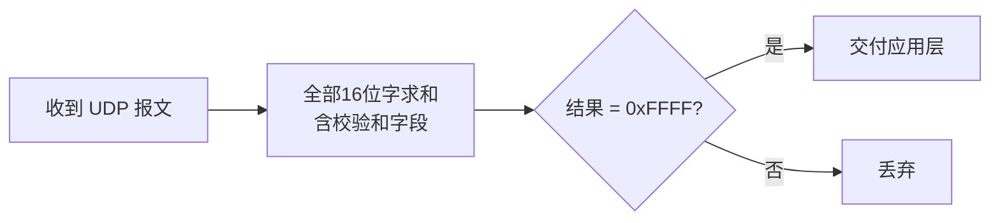
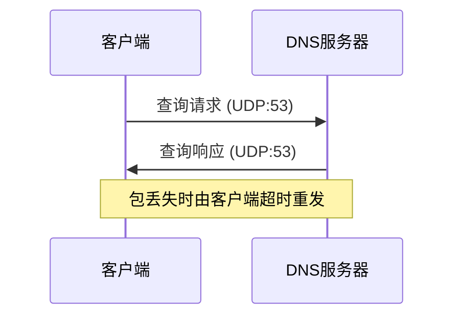
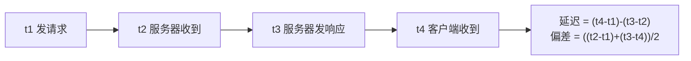
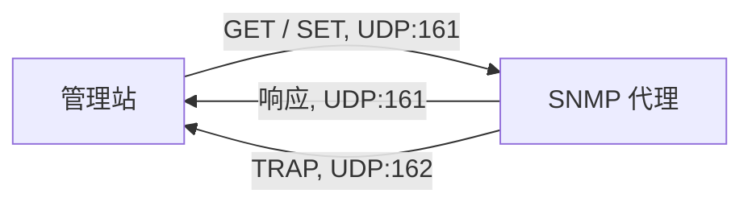
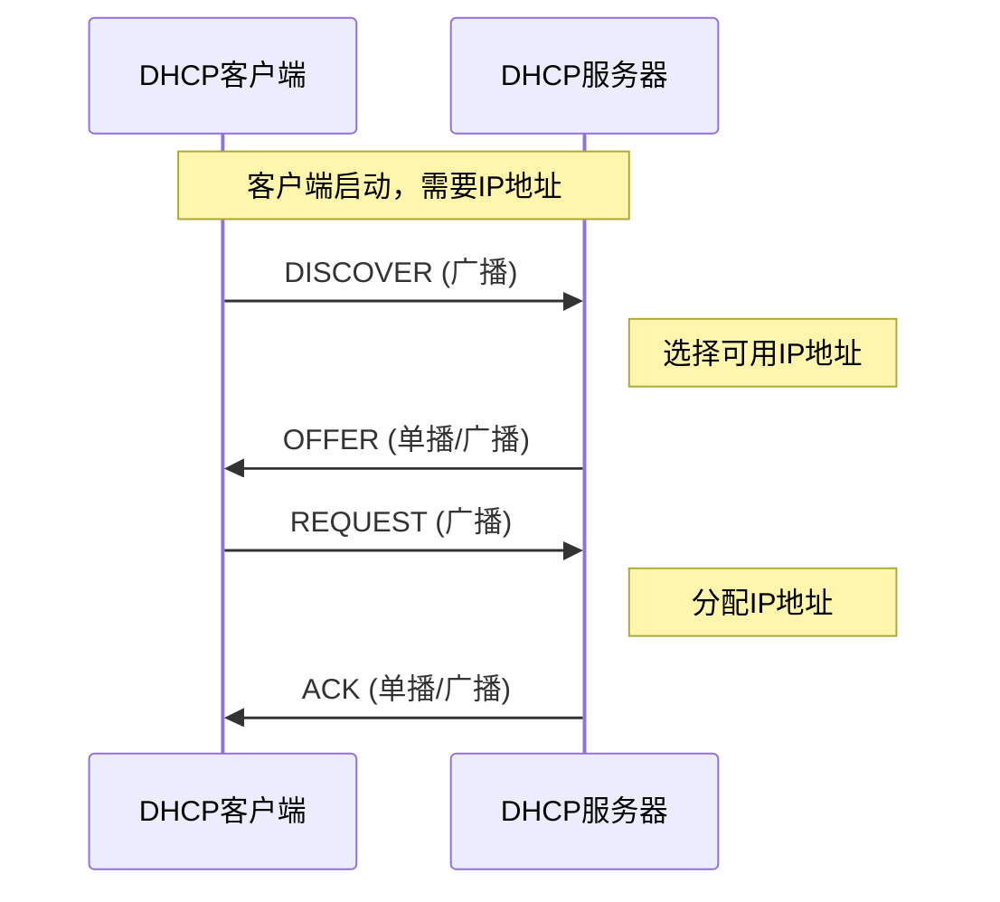
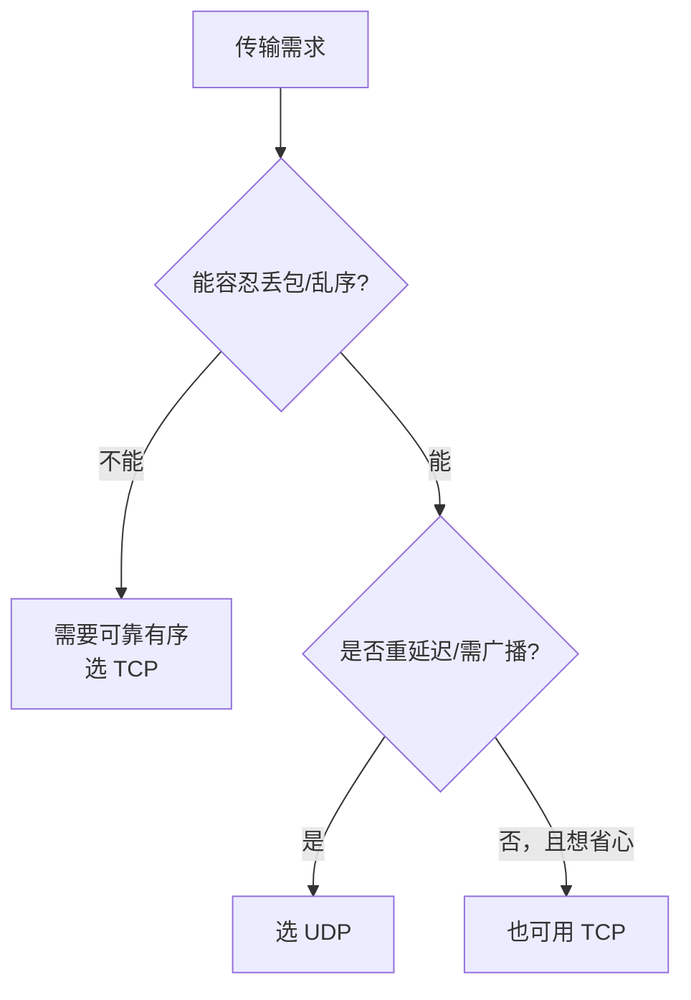

# 3.2 传输层：UDP协议与应用

## 目录

1. [UDP协议概述](#udp协议概述)
2. [UDP报文段结构](#udp报文段结构)
3. [UDP校验和机制](#udp校验和机制)
4. [UDP典型应用](#udp典型应用)
5. [UDP性能特性](#udp性能特性)
6. [UDP vs TCP](#udp-vs-tcp)
7. [典型例题](#典型例题)

---

## UDP协议概述

> **用户数据报协议 (User Datagram Protocol, UDP)**
> 
> 一种无连接、不可靠的传输层协议。除了多路复用/分解和少量差错检测外，它几乎没有在 IP 之上增添任何东西——发送报文段前不握手，也不维护连接状态。

UDP 遵循端到端原则：网络核心保持简单，可靠性等复杂功能交给应用按需实现。是否选 UDP，取决于应用对可靠性和延迟的取舍：


```mermaid
graph TD
    A[应用需求] --> B{能否容忍丢包/乱序?}
    B -->|能，且重延迟| C[选择 UDP]
    B -->|不能，要求可靠有序| D[选择 TCP]
    C --> E[需要可靠性时<br/>在应用层自行实现]
```

### UDP的基本特性

#### 1. 无连接

| 方面 | UDP特点 | 影响 |
|------|---------|------|
| **连接建立** | 无需建立连接 | 减少延迟，立即发送数据 |
| **连接状态** | 不维护连接信息 | 节省内存，简化实现 |
| **数据发送** | 直接发送到目标地址 | 支持一对多通信 |

#### 2. 不可靠

注：不可靠指不提供保证，并非"经常出错"。在低丢包网络中 UDP 也能稳定工作。

| 不保证项 | 表现 | 应对 |
|----------|------|------|
| 数据到达 | 报文段可能丢失 | 应用层重传或容忍丢失 |
| 到达顺序 | 可能乱序 | 应用层排序，或本就不要求有序 |
| 重复检测 | 可能收到重复 | 应用层去重 |
| 差错恢复 | 校验出错即丢弃 | 由应用层处理 |

#### 3. 面向数据报


```mermaid
graph LR
    subgraph "应用层"
        A1[消息1<br/>100字节]
        A2[消息2<br/>50字节]
    end
    
    subgraph "UDP传输"
        U1[UDP数据报1<br/>100+8字节]
        U2[UDP数据报2<br/>50+8字节]
    end
    
    subgraph "接收端应用层"
        B1[消息1<br/>100字节]
        B2[消息2<br/>50字节]
    end
    
    A1 --> U1 --> B1
    A2 --> U2 --> B2
```

- 消息边界保持：每个 UDP 数据报对应一个完整的应用层消息，接收方一次 recv 取出一整个报文（与 TCP 的字节流不同）
- 原子性：数据报整体发送、整体交付
- 独立处理：每个数据报独立路由

#### 4. 简单高效

首部仅 8 字节，无连接状态、无拥塞/流量控制，处理路径短，CPU 与带宽开销都很低。

### 为什么不直接用 IP

UDP 在 IP 之上增加了三样东西，这是它存在的理由：

| 增加项 | 作用 |
|--------|------|
| 端口号 | 进程级多路复用/分解，把数据交付到正确的应用进程 |
| 长度字段 | 标识数据报边界 |
| 校验和 | 端到端差错检测 |

其中端口号是关键——IP 只能把分组送到主机，UDP 才能送到主机上的具体进程。

### 适用与不适用场景

适用：

1. 对延迟敏感、实时性优先于可靠性（音视频、在线游戏）
2. 能容忍少量丢包
3. 简单的请求-响应交互（DNS）
4. 需要广播/组播
5. 服务器需高并发、不愿为每连接维护状态

不适用：

1. 关键数据传输（金融交易、文件传输）
2. 大流量、长时数据流，需要拥塞控制
3. 要求严格有序交付
4. 需维护会话状态的复杂交互

---

## UDP报文段结构

### UDP首部格式

UDP 首部固定 8 字节，仅 4 个字段，每个 16 位：

```
 0                   1                   2                   3
 0 1 2 3 4 5 6 7 8 9 0 1 2 3 4 5 6 7 8 9 0 1 2 3 4 5 6 7 8 9 0 1
+--------------------------------+--------------------------------+
|          源端口号 (16)         |        目的端口号 (16)         |
+--------------------------------+--------------------------------+
|           长度 (16)            |          校验和 (16)           |
+--------------------------------+--------------------------------+
|                                                                |
|                        应用数据 (变长)                         |
|                                                                |
+----------------------------------------------------------------+
```

- 源端口 + 目的端口：共 4 字节，用于多路复用/分解
- 长度：UDP 首部加数据的总字节数
- 校验和：差错检测

### 字段详解

#### 源端口号 (Source Port)

16 位，标识发送进程，供接收方回复时作目的端口。客户端通常由操作系统分配临时端口（一般在 49152–65535 范围）。若发送方不期待回复，源端口可置 0。

#### 目的端口号 (Destination Port)

16 位，标识接收进程，是接收端多路分解的依据，决定把数据交给哪个应用。

常见 UDP 知名端口：

| 端口 | 服务 | 用途 |
|------|------|------|
| 53 | DNS | 域名解析 |
| 67/68 | DHCP | 动态主机配置 |
| 69 | TFTP | 简单文件传输 |
| 123 | NTP | 时间同步 |
| 161/162 | SNMP | 网络管理 |

#### 长度字段 (Length)

16 位，值为 UDP 首部加数据的总字节数：

$$\text{长度} = 8 + \text{数据字节数}$$

最小值 8（仅首部、无数据）。理论最大 65535，但实际还受 IP 数据报与 MTU 限制。

示例：

- DNS 查询：8（首部）+ 32（数据）= 40 字节
- DHCP 请求：8 + 240 = 248 字节

#### 校验和 (Checksum)

16 位，覆盖伪首部、UDP 首部和数据，采用 16 位反码求和。

| | IPv4 | IPv6 |
|---|------|------|
| 是否必需 | 可选（置 0 表示未计算） | 必需 |
| 校验范围 | 伪首部 + UDP 首部 + 数据 | 同左 |
| 算法 | 16 位反码求和 | 16 位反码求和 |

### UDP在协议栈中的封装

以一个 32 字节的 DNS 查询为例，逐层封装后的总大小：

```
+----------------------------------------------------------+
| 以太网首部 14B |          以太网帧载荷            | FCS 4B |
+----------------+----------------------------------+-------+
                 | IP首部 20B |      IP载荷                |
                 +------------+----------------------------+
                              | UDP首部 8B | DNS数据 32B    |
                              +------------+----------------+

  UDP 数据报 = 8 + 32        = 40 字节
  IP  数据报 = 20 + 40       = 60 字节
  以太网帧   = 14 + 60 + 4   = 78 字节
```

### UDP首部开销分析

| 场景 | 应用数据 | 总大小 | UDP首部占比 |
|------|----------|--------|-------------|
| DNS 查询 | 32 字节 | 40 字节 | 20% |
| DHCP 请求 | 240 字节 | 248 字节 | 3.2% |
| 语音包 (G.711) | 160 字节 | 168 字节 | 4.8% |
| 视频包 | 1400 字节 | 1408 字节 | 0.6% |

数据量越小，首部占比越高；数据量大时可忽略。UDP 首部 8 字节，远小于 TCP 的至少 20 字节。

### IP伪首部的作用

计算校验和时，UDP 在真正的 UDP 首部之前临时拼上一个伪首部。伪首部不随报文发送，只参与校验和计算，目的是把 IP 层的关键信息（源/目的 IP、协议号）一并纳入校验，从而验证报文确实被投递到了正确的主机和协议。

IPv4 伪首部（12 字节）：

```
 0                   1                   2                   3  
 0 1 2 3 4 5 6 7 8 9 0 1 2 3 4 5 6 7 8 9 0 1 2 3 4 5 6 7 8 9 0 1
+----------------------------------------------------------------+
|                          源 IP 地址                            |
+----------------------------------------------------------------+
|                         目的 IP 地址                           |
+----------------+---------------+---------------------------------+
|    零 (8)      |   协议 (8)    |          UDP 长度 (16)          |
+----------------+---------------+---------------------------------+
```

| 字段 | 作用 |
|------|------|
| 源/目的 IP | 验证报文投递到正确主机，防止误投 |
| 协议号 (17) | 确认上层为 UDP |
| UDP 长度 | 与 UDP 首部中的长度互为校验 |

---

## UDP校验和机制

校验和用于检测报文段在传输（链路、路由器内存等环节）中是否发生比特翻转。它能检测错误但不能纠错——发现出错即丢弃。

### 检测能力与 IPv4/IPv6 差异

- 能检测所有单比特错误；多数双比特、突发错误也能检出
- 局限：某些位翻转可能相互抵消而漏检（如两个 16 位字对应位同时翻转），故 UDP 校验和只是轻量保护

| | IPv4 | IPv6 |
|---|------|------|
| 校验和 | 可选（置 0 表示未计算） | 强制 |
| IP 层校验 | IP 首部自带校验和 | 无，故 UDP 必须校验 |
| 伪首部长度 | 12 字节 | 40 字节 |

### 16位反码求和算法

发送端计算步骤：

1. 拼接伪首部 + UDP 首部（校验和字段先置 0）+ 数据
2. 按 16 位为一组逐字相加
3. 处理进位：把溢出的高位回卷加到低 16 位（即 `sum = (sum & 0xFFFF) + (sum >> 16)`，可能需重复一次）
4. 对结果按位取反，得到校验和

进位回卷使加法满足结合律与交换律（换序不变）。例如：

$$\texttt{0x8000} + \texttt{0x8000} = \texttt{0x10000} \xrightarrow{\text{回卷}} \texttt{0x0001} \xrightarrow{\text{取反}} \texttt{0xFFFE}$$

#### 完整计算示例

取一个携带 2 字节数据的 UDP 报文，各 16 位字（十六进制）如下（伪首部 + UDP 首部 + 数据）：

```
9819 2839   源 IP（两个16位字）
AB03 050B   目的 IP
0011 000A   零+协议(17) | UDP长度(10)
0438 0035   源端口(1080) | 目的端口(53)
000A 0000   UDP长度(10) | 校验和(置0)
4142        数据 "AB"
```

逐字相加并回卷进位后取反，得校验和 `0x49CA`（可用下方脚本复算）。

```python
def checksum16(words):
    s = sum(words)
    while s >> 16:
        s = (s & 0xFFFF) + (s >> 16)
    return (~s) & 0xFFFF

words = [0x9819,0x2839, 0xAB03,0x050B, 0x0011,0x000A,
         0x0438,0x0035, 0x000A,0x0000, 0x4142]
print(format(checksum16(words), '04X'))   # 49CA
```

### 接收端验证

接收端把收到的所有 16 位字（含校验和字段）一起按同样方式相加并回卷：

- 若无差错，结果应为全 1，即 `0xFFFF`（等价地，对其取反为 0）
- 否则判定出错，直接丢弃报文，不通知上层


```mermaid
graph LR
    A[收到 UDP 报文] --> B[全部16位字求和<br/>含校验和字段]
    B --> C{结果 = 0xFFFF?}
    C -->|是| D[交付应用层]
    C -->|否| E[丢弃]
```

错误处理：IPv4 中校验和为 0 表示发送方未计算，接收方跳过校验；IPv6 不允许 0 值，必须校验。

### IPv6 中校验和强制必需

IPv6 取消了 IP 首部校验和（为加快转发），UDP 校验和因而成为端到端唯一的差错检测手段，故必须计算、不允许为 0。

IPv6 伪首部（40 字节）：

```
+----------------------------------------------------------------+
|                                                                |
|                     源 IPv6 地址 (16 字节)                     |
|                                                                |
+----------------------------------------------------------------+
|                                                                |
|                    目的 IPv6 地址 (16 字节)                    |
|                                                                |
+----------------------------------------------------------------+
|                       UDP 长度 (32 位)                         |
+----------------------------------------------+-----------------+
|                   零 (24 位)                 |  下一首部 (8)   |
+----------------------------------------------+-----------------+
```

### 工程实现

- 算法为 O(n) 线性扫描，开销不大；现代网卡多支持校验和卸载（checksum offload），由硬件计算
- IPv4 下允许关闭校验和以省开销，但会牺牲差错检测；关键应用应启用

---

## UDP典型应用

### 域名解析 (DNS)

DNS 查询是 DNS 选 UDP 的典型理由：

| DNS 需求 | UDP 的匹配 |
|----------|------------|
| 简单请求-响应 | 无需建连、无连接状态 |
| 要求快速响应 | 省去握手延迟 |
| 查询/响应通常较小 | 多数情况单包完成 |
| 服务器需处理海量查询 | 无状态，高并发 |


```mermaid
sequenceDiagram
    participant C as 客户端
    participant D as DNS服务器
    C->>D: 查询请求 (UDP:53)
    D->>C: 查询响应 (UDP:53)
    Note over C,D: 包丢失时由客户端超时重发
```

注：响应过大（超过约 512 字节，或 EDNS 协商的更大值）或区域传送时，DNS 改用 TCP。重传由应用层（解析器）负责，可向多个服务器并发查询。

### 网络时间协议 (NTP)

时间同步对延迟敏感，无连接的 UDP 可最小化传输延迟，并支持广播/组播向多客户端授时。NTP 通过四个时间戳估算往返延迟与时钟偏差：


```mermaid
graph LR
    A["t1 发请求"] --> B["t2 服务器收到"]
    B --> C["t3 服务器发响应"]
    C --> D["t4 客户端收到"]
    D --> E["延迟 = (t4-t1)-(t3-t2)<br/>偏差 = ((t2-t1)+(t3-t4))/2"]
```

### 简单网络管理协议 (SNMP)

用于网络设备的监控与配置，多采用 UDP：

| 操作 | 说明 |
|------|------|
| GET | 读取设备状态，简单请求-响应 |
| SET | 配置参数，数据量小 |
| TRAP | 设备主动通知（端口 162），异步上报 |


```mermaid
graph LR
    NMS[管理站] -->|GET / SET, UDP:161| DEV[SNMP 代理]
    DEV -->|响应, UDP:161| NMS
    DEV -->|TRAP, UDP:162| NMS
```

### 动态主机配置协议 (DHCP)

主机启动时尚无 IP，需要广播寻找服务器——这正是必须用 UDP 的原因（TCP 无法广播）。

DHCP 四步交互（DORA）：


```mermaid
sequenceDiagram
    participant C as DHCP客户端
    participant S as DHCP服务器
    
    Note over C,S: 客户端启动，需要IP地址
    C->>S: DISCOVER (广播)
    Note right of S: 选择可用IP地址
    S->>C: OFFER (单播/广播)
    C->>S: REQUEST (广播)
    Note right of S: 分配IP地址
    S->>C: ACK (单播/广播)
```

### 实时多媒体

实时音视频对延迟的要求高于对可靠性的要求：重传带来的延迟反而比丢一帧更糟，因此普遍用 UDP（之上常配 RTP）。

| 应用 | 延迟要求 | 丢包容忍 |
|------|----------|----------|
| VoIP 通话 | < 150 ms | 1–3% |
| 视频会议 | < 200 ms | 2–5% |
| 在线游戏 | < 50 ms | 极低 |
| 直播 | 秒级 | 较高 |

RTP over UDP 的收发路径：


```mermaid
graph LR
    A[音视频] --> B[RTP 打包] --> C[UDP 发送]
    C -->|可能丢包/乱序| D[UDP 接收] --> E[RTP 解包]
    E --> F[丢包隐藏] --> G[播放]
```

### 其他应用

| 服务 | 端口 | 特点 |
|------|------|------|
| Syslog | 514 | 日志传输，可容忍丢失 |
| RADIUS | 1812/1813 | 认证授权 |
| TFTP | 69 | 简单文件传输 |
| Wake-on-LAN | 9 | 魔术包唤醒 |

此外，物联网（资源/功耗受限）、QUIC（在 UDP 之上自建可靠传输，见 3.7）等也建立在 UDP 之上。

---

## UDP性能特性

### 延迟

TCP 在传数据前要先三次握手（约 1.5 RTT 建连），UDP 直接发送，省去这段开销。RTT 越大，差距越明显：

| 网络环境 | TCP 首字节延迟 | UDP 首字节延迟 |
|----------|----------------|----------------|
| 局域网 (RTT 1 ms) | 数毫秒 | 约 0.5 ms |
| 广域网 (RTT 50 ms) | 约 150 ms | 约 25 ms |
| 卫星链路 (RTT 300 ms) | 约 900 ms | 约 150 ms |

注：表中数值为量级示意，含建连与首个响应。

### 协议开销

首部占比（仅计传输层首部，TCP 按 20 字节）：

| 数据大小 | UDP (8B) | TCP (20B) |
|----------|----------|-----------|
| 64 字节 | 11.1% | 23.8% |
| 512 字节 | 1.5% | 3.8% |
| 1500 字节 | 0.5% | 1.3% |

### 资源占用

| | UDP | TCP |
|---|-----|-----|
| 连接状态 | 无 | 每连接维护控制块 |
| 缓冲区 | 最小 | 收发缓冲，含重传缓冲 |
| 并发 | 不受连接数限制 | 受内存/状态限制 |

---

## UDP vs TCP

| 维度 | UDP | TCP | 选型倾向 |
|------|-----|-----|----------|
| 连接 | 无连接 | 面向连接 | 简单交互选 UDP |
| 可靠性 | 不可靠 | 可靠 | 关键数据选 TCP |
| 有序性 | 不保证 | 有序 | 要求有序选 TCP |
| 流量控制 | 无 | 有 | — |
| 拥塞控制 | 无 | 有 | 网络友好选 TCP |
| 首部 | 8 字节 | ≥ 20 字节 | 小包传输选 UDP |
| 实时性 | 好 | 受重传影响 | 实时应用选 UDP |
| 广播/组播 | 支持 | 不支持 | 一对多选 UDP |

选型可归结为一个判断：


```mermaid
graph TD
    A[传输需求] --> B{能容忍丢包/乱序?}
    B -->|不能| C[需要可靠有序<br/>选 TCP]
    B -->|能| D{是否重延迟/需广播?}
    D -->|是| E[选 UDP]
    D -->|否，且想省心| F[也可用 TCP]
```

易混：UDP "不可靠" 指不提供交付保证，不等于经常丢；校验和只检错不纠错；选型取决于应用对可靠性与延迟的权衡。

---

## 典型例题

**例**：以下哪些应用最适合使用 UDP？

A. 网上银行转账　B. DNS 域名查询　C. 大文件下载　D. 视频直播

解析：B、D。DNS 是简单请求-响应、追求低延迟；视频直播容忍丢包、重实时性。A 要求可靠（选 TCP），C 是大流量传输需要拥塞控制（选 TCP）。

---

[3.3 传输层：可靠传输原理](3.3传输层：可靠传输原理.md)
