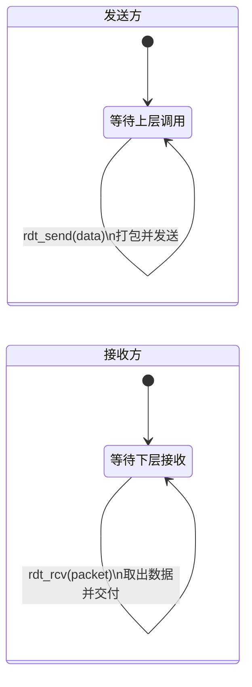
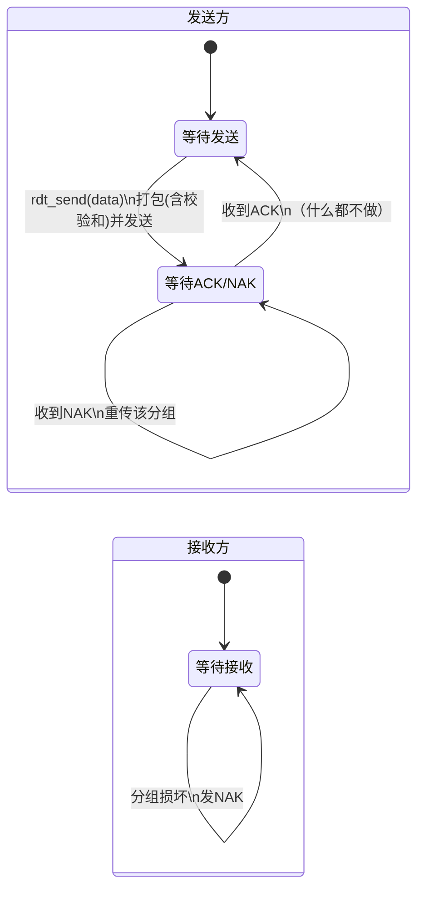
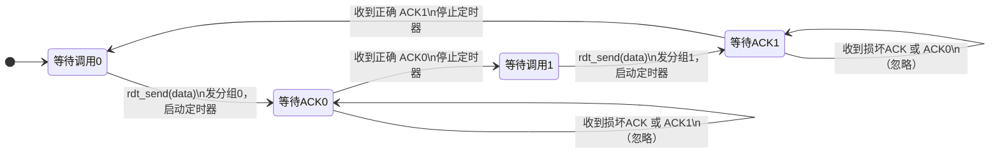

# 3.3 传输层：可靠传输原理

> 本节是《计算机网络：自顶向下方法》3.4 节的学习笔记。书中用 rdt（reliable data transfer）协议逐步构造的方式，从 rdt1.0 到 rdt3.0 一步步把不可靠信道封装成可靠通道，再过渡到流水线协议 GBN 与 SR。这条主线是 TCP 的理论基础。

## 目录

1. [可靠传输概述](#可靠传输概述)
2. [rdt 协议的逐步构造](#rdt-协议的逐步构造)
3. [停等协议与信道利用率](#停等协议与信道利用率)
4. [流水线与滑动窗口](#流水线与滑动窗口)
5. [回退N步协议（GBN）](#回退n步协议gbn)
6. [选择重传协议（SR）](#选择重传协议sr)
7. [窗口大小与序号空间](#窗口大小与序号空间)
8. [GBN 与 SR 对比](#gbn-与-sr-对比)

---

## 可靠传输概述

> **可靠传输**
> 
> 在不可靠的底层信道之上，向上层提供无差错、不丢失、不重复、按序的数据交付。

### 信道的不可靠之处

可靠传输要应对的底层信道问题有三类：

- **比特差错（corruption）**：分组在传输中发生比特翻转
- **分组丢失（loss）**：路由器缓冲溢出、链路故障导致分组消失
- **失序（reordering）**：不同路径时延不同，分组到达顺序与发送顺序不一致

注：链路层信道（如书中 rdt 假设的点到点信道）一般只会出现比特差错和丢失，不会失序；而传输层面对的网络层信道三种问题都可能出现，所以 TCP 要用序号同时处理这三件事。

### 可靠传输的目标

应对上述问题，可靠传输需保证四点：

| 目标 | 含义 | 对应机制 |
|------|------|----------|
| 无差错 | 数据内容正确 | 校验和 |
| 不丢失 | 所有数据都能到达 | 确认 + 超时重传 |
| 不重复 | 每个数据只交付一次 | 序号 |
| 保序 | 按发送顺序交付 | 序号 + 接收缓存 |

可靠性与效率是一对矛盾：停等协议最简单也最可靠，但信道利用率极低；流水线协议提高了利用率，却要付出更复杂的序号、缓存和重传管理。本节的协议演进就是在这两端之间权衡。

---

## rdt 协议的逐步构造

书中用 rdt 协议自底向上构造可靠传输：每假设信道多一种缺陷，就增加一种机制来弥补。每个版本用一对有限状态机（FSM）描述发送方和接收方，箭头标注"触发事件 / 采取动作"。

### rdt1.0：完全可靠的信道

假设底层信道完全可靠——不丢包、不出错。此时无需任何额外机制：发送方收到数据就打包发送，接收方收到就交付。



两端各只有一个状态，没有差错处理。这只是一个起点。

### rdt2.0：信道可能产生比特差错

信道开始可能翻转比特。引入三种机制处理差错：

- **校验和**：接收方据此判断分组是否出错
- **ACK / NAK**：接收方反馈"收到了"或"出错了"
- **重传**：发送方收到 NAK 就重发

这类基于"确认 + 重传"的协议统称 **ARQ（Automatic Repeat reQuest，自动重传请求）**。



发送方在"等待 ACK/NAK"状态时不能再发新数据，必须等反馈——这种协议称为**停等（stop-and-wait）协议**。

> 致命缺陷：上图没有考虑 **ACK/NAK 本身也可能损坏**。发送方收到一个读不懂的反馈时，无法判断该重传还是继续，这正是 rdt2.1 要解决的问题。

### rdt2.1：处理受损的 ACK/NAK

发送方收到损坏的反馈时一律重传当前分组。但重传会带来**重复分组**：接收方无法分辨"这是新分组"还是"上次 ACK 丢了导致的重发"。

解决办法是给分组加 **1 比特序号（0 / 1）**：

- 发送方：每个分组带序号 0 或 1，交替使用；收到损坏反馈或 NAK 就重传当前序号分组
- 接收方：记住期望的序号；收到重复序号说明是重传，丢弃数据但仍回 ACK

为什么 1 比特就够？停等协议下信道中最多只有一个未确认分组，发送方只需区分"当前分组"和"下一个分组"两种情况，0/1 交替即可。

### rdt2.2：用 ACK 序号取代 NAK

许多实际协议（如 TCP）不用 NAK。rdt2.2 让接收方在 ACK 里**带上最近正确收到分组的序号**：发送方收到对**上一个**分组的重复 ACK，效果等同于一个 NAK，于是重传。这样只用 ACK 一种反馈就能表达两种含义。

> 注：这里"重复 ACK 触发重传"的思路，正是后面 GBN/SR 乃至 TCP 快速重传的雏形。

### rdt3.0：信道还会丢包

信道现在既会出错也会丢包。分组或 ACK 一旦丢失，发送方将永远等不到反馈而死锁。引入**倒计数定时器**解决：

- 发送一个分组就启动定时器
- 在超时前收到正确 ACK：停止定时器，发下一个
- 超时：重传分组并重启定时器

由于可能"分组没丢只是慢了"，超时重传同样会产生重复分组，因此序号机制（rdt2.1 引入的 0/1）必须保留。rdt3.0 又称**比特交替协议（alternating-bit protocol）**，它在比特差错信道上是正确的，但效率很低——原因见下一节。

rdt3.0 发送方的 FSM 有四个状态：序号 0、1 各对应"等待上层调用"和"等待 ACK"两态，定时器在等待 ACK 时计数：



---

## 停等协议与信道利用率

rdt3.0 就是一个停等协议：发出一个分组后必须等到对应 ACK 才能发下一个。逻辑上它正确，但下面会看到它的性能问题。

### 正常流程

```
发送方                     接收方
  |                         |
  |-----> 分组0 ----------->|
  |                         | 校验无误，交付，发 ACK0
  |<----- ACK0 <-----------|
  |                         |
  |-----> 分组1 ----------->|
  |                         | 校验无误，交付，发 ACK1
  |<----- ACK1 <-----------|
  |                         |
```

### 三种异常的处理

序号 + 定时器 + 重传共同覆盖了丢包、ACK 丢失、比特差错三种情况：

**分组丢失**——定时器超时后重传：

```
发送方                     接收方
  |                         |
  |-----> 分组0 ------X     | （分组丢失）
  |   (超时)                |
  |-----> 分组0 ----------->| （重传）
  |<----- ACK0 <-----------|
```

**ACK 丢失**——发送方超时重传，接收方靠序号识别重复：

```
发送方                     接收方
  |                         |
  |-----> 分组0 ----------->|
  |   X<-- ACK0 <----------| （ACK 丢失）
  |   (超时)                |
  |-----> 分组0 ----------->| （重传）
  |                         | 序号重复，丢弃数据，重发 ACK0
  |<----- ACK0 <-----------|
```

**分组损坏**——接收方发现校验出错，重发上一个 ACK（rdt2.2 用重复 ACK 代替 NAK）：

```
发送方                     接收方
  |                         |
  |-----> 分组1 ----------->| 校验出错
  |<----- ACK0 <-----------| （重发上一个 ACK，即"NAK"）
  |-----> 分组1 ----------->| （重传）
  |<----- ACK1 <-----------|
```

注：若 ACK 只是被延迟、姗姗来迟，超时重传会产生重复分组，但 0/1 序号能保证接收方不会重复交付，协议依然正确——这正是停等协议只需 1 比特序号的根本原因。

### 信道利用率

停等协议的性能瓶颈在于：发送一个分组后，整条信道在一个 RTT 内几乎闲置。设：

- $L$：分组大小（bit）
- $R$：链路带宽（bps）
- $RTT$：往返时间（s）

一个分组的发送时间为 $L/R$，但发完后要空等一个 RTT 才能收到 ACK，整个周期约为 $RTT + L/R$。实际用于传数据的时间只占其中的 $L/R$：

$$U_{\text{停等}} = \frac{L/R}{RTT + L/R}$$

代入典型参数（$L = 8000$ bit，$R = 10$ Mbps，发送时间 $L/R = 0.8$ ms）：

| 场景 | RTT | 利用率 $U$ |
|------|-----|-----------|
| 局域网 | 1 ms | 44.4% |
| 广域网 | 100 ms | 0.79% |
| 卫星链路 | 500 ms | 0.16% |

RTT 越大，利用率越低：广域网上发送方约 99% 的时间在干等。

> 书中经典例子：$R = 1$ Gbps、$L = 8000$ bit、$RTT = 30$ ms 时，$U = \frac{0.008\text{ ms}}{30.008\text{ ms}} \approx 0.00027$，即只有 0.027%。链路速率再高，停等也用不起来。

解决思路只有一个：**不要发一个等一个，而是连续发多个再统一等确认**——这就是流水线。

---

## 流水线与滑动窗口

> **流水线（pipelining）**
> 
> 允许发送方在收到确认前连续发送多个分组，用"在途分组"填满信道，从而大幅提高利用率。

发送 $N$ 个分组再等待，利用率近似变为停等的 $N$ 倍（在 $N \cdot L/R \le RTT + L/R$ 范围内），瓶颈从 RTT 转回到带宽本身。流水线带来两个新需求：

1. **更大的序号空间**：在途分组多了，1 比特序号不够用
2. **缓存**：发送方要缓存所有未确认分组以便重传；接收方可能也要缓存乱序分组

实现流水线有两种经典方案：**回退 N 步（GBN）** 和 **选择重传（SR）**，区别在于如何处理丢失/出错的分组。

### 滑动窗口

两种协议都基于**滑动窗口**：发送方维护一个长度为 $N$ 的窗口，只允许窗口内的分组处于"已发送未确认"状态。

**发送窗口**：

```
序号:  0 1 2 │ 3 4 5 │ 6 │ 7 8 9 ...
            │←──  N=4  ──→│
      已确认 │已发送未确认│可发送│ 窗口外
            ↑           ↑     （不可发送）
           base    nextseqnum
```

- `base`：最早的未确认序号（窗口左沿）
- `nextseqnum`：下一个待发送序号；`[base, nextseqnum)` 已发送未确认，`[nextseqnum, base+N)` 可发送
- 收到对 `base` 的 ACK 后窗口右滑，腾出空间发新分组

**接收窗口**：接收方愿意接收的序号范围。GBN 的接收窗口恒为 1（只收按序分组）；SR 的接收窗口大小与发送窗口相同（可缓存乱序分组）。这一差异是两者的本质区别。

> 易混："发送窗口"是发送方一次能有多少未确认分组；"接收窗口"是接收方能缓存多少乱序分组。GBN 接收窗口=1，SR 接收窗口=N。

### 窗口该开多大

要让流水线填满信道，窗口至少要装下一个 RTT 内能在途的全部数据，即不小于**带宽时延乘积（BDP）**：

$$N \ge \frac{\text{带宽} \times RTT}{L}$$

例：带宽 10 Mbps、RTT 100 ms、分组 1000 字节时，

$$N \ge \frac{10 \times 10^6 \times 0.1}{1000 \times 8} = 125 \text{ 个分组}$$

窗口小于此值则信道仍有空闲。但窗口也不能无限大，实际还受三个因素约束：接收方缓存（流量控制）、网络承载力（拥塞控制）、以及**序号空间**——后者是有正确性要求的硬约束，见后文专节。

---

## 回退N步协议（GBN）

> **回退 N 步（Go-Back-N, GBN）**
> 
> 发送方可连续发送多个分组；一旦某分组超时，从它开始的所有已发送未确认分组全部重传。

GBN 的设计取向是"接收方尽量简单"——乱序分组一律丢弃，由发送方负责整窗重传。

### GBN 工作流程

无丢失时，每个分组按序到达，接收方逐一回累积 ACK：

```
发送方                          接收方
  |                              |
  |-----> 分组0 --------------->| 按序，交付，发 ACK0
  |-----> 分组1 --------------->| 按序，交付，发 ACK1
  |-----> 分组2 --------------->| 按序，交付，发 ACK2
  |-----> 分组3 --------------->| 按序，交付，发 ACK3
```

分组 1 丢失时，2、3 因乱序被丢弃，接收方反复回 ACK0；发送方超时后从分组 1 起整窗重传：

```
发送方                          接收方
  |                              |
  |-----> 分组0 --------------->| 按序，发 ACK0
  |-----> 分组1 ------X         | （分组1丢失）
  |-----> 分组2 --------------->| 乱序！丢弃，重发 ACK0
  |-----> 分组3 --------------->| 乱序！丢弃，重发 ACK0
  |<----- ACK0 <----------------|
  |<----- ACK0 <----------------| （重复 ACK）
  |<----- ACK0 <----------------| （重复 ACK）
  |   (分组1 超时)               |
  |-----> 分组1 --------------->| 按序，发 ACK1
  |-----> 分组2 --------------->| 按序，发 ACK2
  |-----> 分组3 --------------->| 按序，发 ACK3
```

可见即便分组 2、3 第一次已正确到达，也因 GBN 不缓存而被白白重传——这正是它的主要代价。

### GBN 的核心规则

**发送方**：

- 窗口未满就发新分组并缓存；为最早的未确认分组维护**一个**定时器
- 收到 ACK $n$：因为是累积确认，序号 $\le n$ 的分组全部视为已确认，窗口右滑
- 超时：重传从 `base` 到 `nextseqnum-1` 的**全部**未确认分组（这就是"回退 N 步"）

**接收方**（极简）：

- 只接受按序到达且无误的分组，交付后令期望序号 +1，回 ACK
- 任何乱序或受损分组一律**丢弃**，并重发对最近一个按序分组的 ACK（重复 ACK）
- 因此接收方无需缓存，只维护一个 `expectedseqnum`

> 关键：GBN 的 ACK 是累积的——ACK $n$ 表示"$n$ 及以前都收到了"。这让单个 ACK 丢失也无妨，后续 ACK 能覆盖它。代价是接收方丢弃乱序分组，造成大量重传。

### GBN 性能取舍

- 优点：接收方实现简单、不占缓存；累积确认对 ACK 丢失健壮
- 缺点：一个分组丢失会触发窗口内后续**所有**分组重传，在高带宽时延或高丢包链路上浪费严重

正是这个"一错全重传"的缺陷，催生了选择重传。

---

## 选择重传协议（SR）

> **选择重传（Selective Repeat, SR）**
> 
> 接收方逐个确认并缓存乱序到达的分组，发送方只重传真正丢失或出错的那一个分组。

GBN 一个分组出错就重传一窗口；SR 把"确认"和"重传"都精确到单个分组：

- **发送方**：为**每个**未确认分组各维护一个定时器；某分组超时只重传它自己
- **接收方**：在接收窗口内逐个确认（**逐个确认**而非累积），把乱序分组缓存起来，等缺口补齐后再按序交付

代价是复杂度上升——发送方要管多个定时器，接收方要管缓存，且双方窗口都要滑动。

### SR 工作流程

```
发送方                          接收方
  |                              |
  |-----> 分组0 --------------->| 收下、交付，发 ACK0
  |-----> 分组1 ------X         | （分组1丢失）
  |-----> 分组2 --------------->| 窗口内，缓存，发 ACK2
  |-----> 分组3 --------------->| 窗口内，缓存，发 ACK3
  |<----- ACK0 <----------------|
  |<----- ACK2 <----------------| 逐个确认 2
  |<----- ACK3 <----------------| 逐个确认 3
  |   (分组1 超时)               |
  |-----> 分组1 --------------->| 缺口补齐，
  |                              | 按序交付 1、2、3
  |<----- ACK1 <----------------|
```

注意接收方收到分组 2、3 时虽然缓存了，但**不能交付**，因为分组 1 还没到，按序交付的缺口卡在 1。等分组 1 重传到达，1、2、3 才一起上交应用层。

易混（GBN vs SR 的重传与确认）：

| | GBN | SR |
|---|---|---|
| 确认方式 | 累积确认（ACK $n$ = "$n$ 及以前都收到"） | 逐个确认（ACK $n$ 只确认 $n$） |
| 接收乱序分组 | 丢弃 | 缓存 |
| 一个分组丢失 | 重传该分组及其后全部 | 只重传该分组 |
| 定时器 | 1 个（管最早未确认） | 每个未确认分组各 1 个 |

### SR 接收方的边界判断（易错点）

SR 接收方收到分组后，要按序号落在哪个区间分三种情况处理：

- 落在**接收窗口**内：缓存、发 ACK，若补齐缺口则按序交付并右滑窗口
- 落在窗口**之前**（即 `[base-N, base-1]`，已交付过的旧分组）：仍要**重发 ACK**。否则发送方的该 ACK 若丢失会一直超时重传
- 其它（窗口之后）：丢弃

> 易错：第二种情况常被忽略。发送方与接收方的窗口**不一定对齐**——接收方可能已经把某分组交付并右滑，而发送方还在等它的 ACK。所以对窗口左侧的旧分组也必须回 ACK。正因为这种"窗口错位"，SR 的序号空间才有了下一节的约束。

### SR 实现要点

接收方逻辑（伪代码）：

```
收到 packet(seq):
    if 校验出错: 丢弃; return
    if base <= seq < base + N:        # 接收窗口内
        发 ACK(seq)
        缓存 packet（去重）
        while base in 缓存:           # 补齐缺口则按序交付
            交付(缓存.pop(base)); base += 1
    elif base - N <= seq < base:      # 窗口之前的旧分组
        发 ACK(seq)                    # 必须重发 ACK
    # 其余丢弃
```

发送方为每个分组单独计时，超时只重传该分组；收到 ACK 则标记对应序号已确认，当 `base` 被确认时窗口连续右滑。

### SACK（选择确认）

实际系统（如 TCP 的 SACK 选项）会在一个 ACK 里携带多个"已收到的不连续区间"，把分散的确认信息合并上报，让发送方一次看清接收方的全部缺口，从而更精准地重传。这是 SR 思想在工程上的落地。

---

## 窗口大小与序号空间

序号字段位数有限。设序号用 $k$ 比特，则序号空间大小 $N_{seq} = 2^k$，序号在 $0 \sim 2^k-1$ 间循环使用（回绕）。窗口大小 $W$ 不能太大，否则**新旧分组会被混淆**，破坏正确性。这是本节最重要、也最常考的一条约束。

### GBN：$W \le 2^k - 1$

GBN 接收窗口为 1，但发送窗口受序号回绕限制。若 $W = 2^k$（用满序号空间），考虑这种情况：发送方发出一窗口分组，接收方全部正确接收并发 ACK，但所有 ACK 全部丢失；发送方超时后重传这一整窗口的旧分组——由于序号已绕回，接收方无法区分"重传的旧分组"和"新一轮的新分组"。因此必须留一个序号余量：

$$W_{GBN} \le 2^k - 1$$

### SR：$W \le 2^{k-1}$（即序号空间的一半）

SR 的约束更严。因为接收方会缓存乱序分组，且发送方/接收方窗口可能错位，必须保证**发送窗口与接收窗口在序号空间上永不重叠**。两个大小均为 $W$ 的窗口要在 $2^k$ 个序号里不重叠，需要：

$$W_{SR} \le \frac{2^k}{2} = 2^{k-1}$$

**反例（理解为什么）**：设 $k=2$，$N_{seq}=4$，若取 $W=3$（违反 $W \le 2$）：

1. 发送方发分组 0、1、2，接收方全收下并交付，接收窗口滑到 `{3,0,1}`，发回 ACK0、ACK1、ACK2
2. 三个 ACK 全部丢失，发送方超时，重传旧分组 0
3. 接收方此刻期望的新分组 0（序号回绕后的"第二轮 0"）正好在窗口 `{3,0,1}` 内
4. 接收方把**重传的旧分组 0**误当成**新分组 0** 接收 —— 数据错乱

把 $W$ 降到 2，新旧窗口就不会在序号 0 上重叠，问题消失。

> 速记：序号空间为 $N$ 时，GBN 窗口最大 $N-1$，SR 窗口最大 $N/2$。停等是 $W=1$ 的特例，1 比特序号（$N=2$）即可，两条约束都满足。

| 协议 | 接收窗口 | 窗口上界（序号空间 $N=2^k$） |
|------|----------|------------------------------|
| 停等 | 1 | $W=1$（$N=2$ 即够） |
| GBN | 1 | $W \le N-1$ |
| SR | $N/2$ | $W \le N/2$ |

---

## GBN 与 SR 对比

| 方面 | GBN | SR |
|------|-----|----|
| 发送窗口 | $N$ | $N$ |
| 接收窗口 | 1 | $N$ |
| 接收乱序分组 | 丢弃 | 缓存 |
| 确认方式 | 累积确认 | 逐个确认 |
| 重传范围 | 丢失分组及其后全部 | 仅丢失分组 |
| 定时器 | 1 个 | 每分组 1 个 |
| 窗口上界 | $N_{seq}-1$ | $N_{seq}/2$ |
| 接收方复杂度 / 内存 | 低 | 高 |

选择上的直觉：

- **误码率低**时，GBN 很少触发整窗重传，其简单性更划算
- **带宽时延乘积大或丢包率高**时（如卫星、长肥管道、无线），GBN 的"一错全重传"代价高昂，SR 的精确重传明显更优

TCP 不是纯粹的 GBN 或 SR，而是两者的折中：基础采用累积确认（偏 GBN），但发送方对每个报文段单独计时、支持快速重传，并可用 SACK 选项实现接近 SR 的精确重传——这些将在后续 TCP 各节展开。

---

## 小结

可靠传输的演进是一条由信道假设驱动的主线：

| 阶段 | 信道假设 | 新增机制 |
|------|----------|----------|
| rdt1.0 | 完全可靠 | 无 |
| rdt2.0 | 有比特差错 | 校验和、ACK/NAK、重传（ARQ） |
| rdt2.1 | + ACK/NAK 也会损坏 | 1 比特序号 |
| rdt2.2 | 同上 | 用重复 ACK 代替 NAK |
| rdt3.0 | + 丢包 | 定时器、超时重传（停等） |
| GBN / SR | 流水线提速 | 滑动窗口、累积/逐个确认 |

几个高频要点：

- **停等利用率** $U = \dfrac{L/R}{RTT + L/R}$，RTT 一大就趋近于 0，因此需要流水线
- **GBN**：累积确认、接收方丢弃乱序分组、超时重传整窗，窗口上界 $N_{seq}-1$
- **SR**：逐个确认、接收方缓存乱序分组、只重传丢失分组，窗口上界 $N_{seq}/2$
- 误码低用 GBN 省事，带宽时延乘积大或丢包高用 SR 省带宽
- TCP 是两者折中：累积确认为主，叠加单独计时、快速重传与 SACK

---

[下一节：3.4 传输层：TCP协议基础](3.4传输层：TCP协议基础.md)
