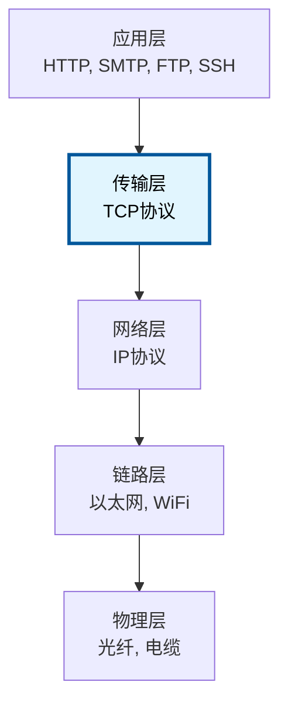
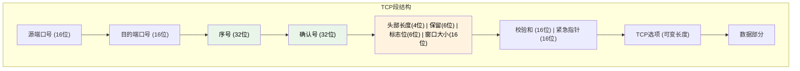
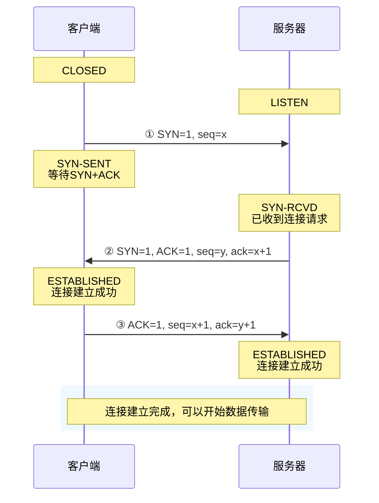
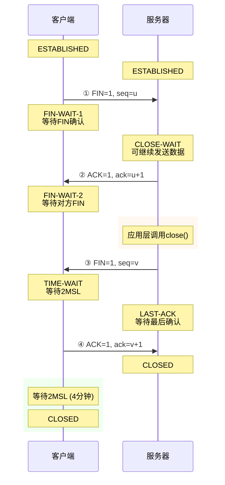
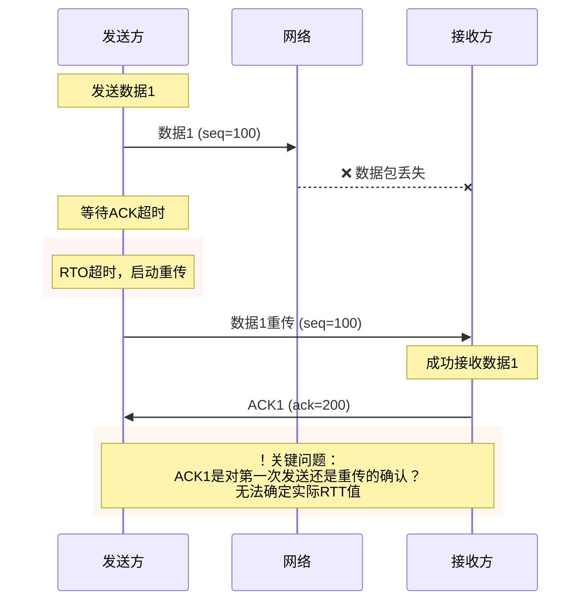
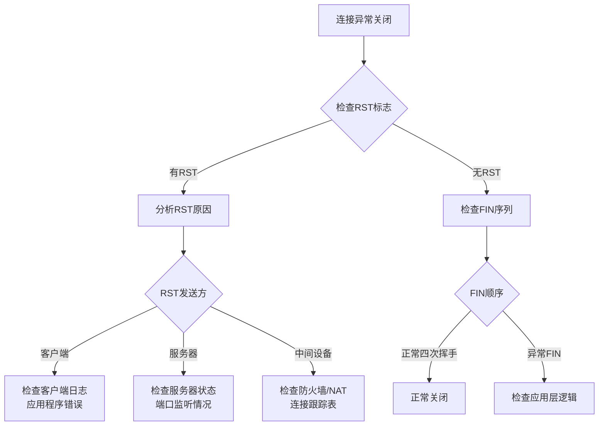

# 3.4 传输层：TCP协议基础

## 目录

1. [TCP协议概述](#tcp协议概述)
2. [TCP段结构详解](#tcp段结构详解)
3. [TCP连接管理](#tcp连接管理)
4. [TCP状态转换](#tcp状态转换)
5. [TCP序号机制](#tcp序号机制)
6. [TCP可靠传输机制](#tcp可靠传输机制)
7. [本章小结与考点分析](#本章小结与考点分析)

---

## TCP协议概述

### TCP基本特性 

> **传输控制协议 (Transmission Control Protocol, TCP)** 是一种面向连接的、可靠的传输层协议，提供全双工的字节流服务，是互联网应用最广泛的传输协议。

#### TCP核心特征对比

| 特征 | TCP | UDP | 说明 |
|------|-----|-----|------|
| **连接性** | 面向连接 | 无连接 | TCP需要建立连接后才能传输数据 |
| **可靠性** | 可靠传输 | 不可靠传输 | TCP保证数据正确、完整、有序到达 |
| **数据边界** | 字节流服务 | 数据报服务 | TCP不保留应用层消息边界 |
| **双工性** | 全双工 | 全双工 | 都支持双向同时通信 |
| **开销** | 较大 | 较小 | TCP头部20字节起，UDP头部8字节 |

#### TCP设计原则 

1. **在不可靠网络上提供可靠服务**
   - 网络层IP提供"尽力而为"的不可靠服务
   - TCP通过重传、确认、排序等机制实现可靠性
   - 对上层应用透明，屏蔽网络的不可靠性

2. **高效利用网络资源**
   - 流量控制：防止发送方压垮接收方
   - 拥塞控制：避免网络过载
   - 滑动窗口：提高传输效率

3. **适应复杂网络环境**
   - 自适应超时重传
   - 动态调整传输参数
   - 处理各种异常情况

### TCP在协议栈中的位置 



#### TCP与IP的协作关系

| 协议层 | 协议 | 功能 | 数据单位 | TCP的作用 |
|--------|------|------|----------|-----------|
| **应用层** | HTTP/FTP等 | 应用服务 | 应用数据 | 为应用提供可靠传输 |
| **传输层** | TCP | 端到端通信 | TCP段 | 本层核心协议 |
| **网络层** | IP | 路由转发 | IP数据包 | TCP段封装在IP包中 |
| **链路层** | 以太网 | 帧传输 | 帧 | 底层传输承载 |

**TCP与IP的分工**：
- **IP协议**：负责数据包的路由和转发（"尽力而为"服务）
- **TCP协议**：负责可靠传输和连接管理
- **协议号**：IP头部协议字段值为6表示TCP

---

## TCP段结构详解

### TCP段格式 



**TCP段的标准格式 (20字节基本头部)**：

```
 0                   1                   2                   3
 0 1 2 3 4 5 6 7 8 9 0 1 2 3 4 5 6 7 8 9 0 1 2 3 4 5 6 7 8 9 0 1
┌───────────────────────────────┬───────────────────────────────┐
  源端口号 (16位)                 目的端口号 (16位)
  发送方进程标识                   接收方进程标识
├───────────────────────────────────────────────────────────────┤
  序号 (32位) - Sequence Number
  TCP段数据部分第一个字节在整个字节流中的位置
├───────────────────────────────────────────────────────────────┤
  确认号 (32位) - Acknowledgment Number
  期望接收的下一个字节序号，累积确认机制
├───┬───┬─┬─┬─┬─┬─┬─┬───────────────────────────────────────────┤
 头长  保留 U A P R S F  窗口大小 (16位)
 度    (6) R C S S Y I  接收方愿意接收的字节数
(4位)     G K H T N N
├───────────────────────────────┬───────────────────────────────┤
  校验和 (16位)                   紧急指针 (16位)
  头部和数据的校验               紧急数据的偏移量
├───────────────────────────────────────────────────────────────┤
  选项 (变长，0-40字节) - 协议功能扩展选项
├───────────────────────────────────────────────────────────────┤
  数据 (变长) - 应用层数据载荷
                              ...
└───────────────────────────────────────────────────────────────┘
```

### TCP段字段详解 

#### 1. 端口号字段 (各16位)

| 字段 | 长度 | 作用 | 取值范围 |
|------|------|------|----------|
| **源端口号** | 16位 | 标识发送方进程 | 0-65535 |
| **目的端口号** | 16位 | 标识接收方进程 | 0-65535 |

**端口分类**：
- **知名端口** (0-1023)：HTTP(80)、HTTPS(443)、FTP(21)、SSH(22)
- **注册端口** (1024-49151)：用户进程或应用
- **动态端口** (49152-65535)：客户端临时使用

**TCP连接标识**：TCP连接由四元组唯一确定
- (源IP地址, 源端口号, 目的IP地址, 目的端口号)

#### 2. 序号字段 (Sequence Number, 32位) 

**基本功能**：
- 标识TCP段中数据的第一个字节在数据流中的位置
- 保证数据按顺序重组
- 32位可表示 0 ~ 4,294,967,295

**序号机制**：

| 情况 | 序号增量 | 说明 | 示例 |
|------|----------|------|------|
| **数据段** | 数据字节数 | 序号递增实际数据长度 | 发送100字节，seq增加100 |
| **SYN段** | 1 | SYN标志消耗1个序号 | SYN包seq=1000，下个seq=1001 |
| **FIN段** | 1 | FIN标志消耗1个序号 | FIN包seq=2000，下个seq=2001 |
| **纯ACK段** | 0 | 不消耗序号 | ACK包不改变发送方seq |

**初始序号选择** (ISN)：
- 连接建立时随机生成，增强安全性
- 避免旧连接的数据干扰新连接
- ISN随时间变化，防止序号预测攻击

#### 3. 确认号字段 (Acknowledgment Number, 32位) 

**基本功能**：
- 指示期望接收的下一个字节的序号
- 累积确认机制：确认该序号之前的所有数据
- 仅在ACK标志位置1时有效

**确认机制工作原理**：

| 数据到达情况 | 确认号设置 | 接收方行为 | 示例 |
|-------------|------------|------------|------|
| **按序到达** | 下一期望序号 | 立即确认，交付应用层 | 期望1001，收到1001-1100，ACK=1101 |
| **乱序到达** | 仍为期望序号 | 缓存数据，发重复ACK | 期望1001，收到1201-1300，ACK=1001 |
| **填补空隙** | 更新到新期望 | 交付连续数据 | 收到1001-1100，ACK=1301 |
| **重复数据** | 仍为期望序号 | 丢弃数据，发送ACK | 重复收到1001-1100，ACK=1101 |

**累积确认特点**：
- **优点**：实现简单，确认信息紧凑
- **缺点**：无法精确指示丢失位置，重传效率较低
- **改进**：选择确认(SACK)可精确指示已收到的数据块

#### 4. 头部长度字段 (4位)

**功能**：指示TCP头部长度，以4字节为单位计算

| 头部长度值 | 实际字节数 | 选项长度 | 说明 |
|------------|------------|----------|------|
| **5** | 20字节 | 0字节 | 最小头部，无选项 |
| **6** | 24字节 | 4字节 | 包含4字节选项 |
| **15** | 60字节 | 40字节 | 最大头部长度 |

**计算方式**：头部长度值 × 4 = 实际字节数
**填充要求**：头部总长度必须是4字节的倍数，不足时用0填充

#### 5. 控制标志位 (6位) 

**标志位定义与功能**：

| 标志位 | 全称 | 位置 | 功能 | 使用场景 |
|--------|------|------|------|----------|
| **FIN** | Finish | bit 0 | 连接终止 | 请求关闭连接，表示发送方没有更多数据 |
| **SYN** | Synchronize | bit 1 | 同步序号 | 连接建立时同步初始序号 |
| **RST** | Reset | bit 2 | 重置连接 | 强制关闭连接，处理异常情况 |
| **PSH** | Push | bit 3 | 推送数据 | 要求接收方立即交付数据给应用层 |
| **ACK** | Acknowledgment | bit 4 | 确认有效 | 指示确认号字段有效 |
| **URG** | Urgent | bit 5 | 紧急数据 | 指示存在紧急数据，紧急指针有效 |

**常见标志位组合**：

| 段类型 | 标志组合 | 用途 | 示例场景 |
|--------|----------|------|----------|
| **SYN段** | SYN=1 | 连接请求 | 三次握手第一步 |
| **SYN+ACK段** | SYN=1, ACK=1 | 连接确认 | 三次握手第二步 |
| **ACK段** | ACK=1 | 纯确认 | 三次握手第三步 |
| **FIN段** | FIN=1, ACK=1 | 连接关闭 | 四次挥手 |
| **RST段** | RST=1 | 连接重置 | 异常关闭连接 |
| **数据段** | ACK=1, PSH=1 | 数据传输 | 正常数据传输 |

#### 6. 窗口大小字段 (16位) 

**功能**：流量控制机制，指示接收方当前愿意接收的数据量

| 特性 | 说明 | 取值范围 |
|------|------|----------|
| **基本窗口** | 不使用窗口缩放选项 | 0 ~ 65535 字节 |
| **扩展窗口** | 配合窗口缩放选项 | 最大 1GB (2³⁰字节) |
| **零窗口** | 窗口大小为0 | 暂停发送数据 |

**窗口缩放选项** (RFC 1323)：
- **目的**：支持高带宽长延时网络
- **方法**：窗口大小左移n位，实际窗口 = 窗口字段 × 2ⁿ
- **协商**：仅在SYN段中协商，连接期间保持不变

#### 7. 校验和字段 (16位) 

**功能**：检测TCP段在传输过程中的错误

**校验和计算范围**：

| 组成部分 | 内容 | 说明 |
|----------|------|------|
| **伪头部** | 源IP + 目的IP + 协议号 + TCP长度 | 确保段到达正确目标 |
| **TCP头部** | 完整的TCP头部 | 检测头部字段错误 |
| **TCP数据** | 应用层数据 | 检测数据传输错误 |

**校验过程**：
- 发送方：计算校验和并填入校验和字段
- 接收方：重新计算校验和，与接收值比较
- 不一致则丢弃TCP段

#### 8. 紧急指针字段 (16位)

**功能**：指向紧急数据的结束位置，仅在URG=1时有效

| 特性 | 说明 | 应用场景 |
|------|------|----------|
| **指针含义** | 相对序号的偏移量 | 指向紧急数据最后一个字节 |
| **处理优先级** | 高优先级处理 | 中断信号、紧急通知 |
| **典型应用** | Telnet中断 (Ctrl+C) | 用户取消命令 |

**注意**：现代应用很少使用紧急数据机制

### TCP选项字段 

**选项字段特点**：
- 可变长度，0-40字节
- 必须填充到4字节边界
- 在连接建立时协商

**常用TCP选项**：

| 选项名称 | 类型值 | 长度 | 功能说明 | 使用时机 |
|----------|--------|------|----------|----------|
| **MSS** | 2 | 4字节 | 最大段大小，避免IP分片 | SYN段中协商 |
| **窗口缩放** | 3 | 3字节 | 支持大窗口 (>64KB) | SYN段中协商 |
| **SACK许可** | 4 | 2字节 | 启用选择确认功能 | SYN段中协商 |
| **SACK** | 5 | 变长 | 选择确认数据块 | 数据传输中使用 |
| **时间戳** | 8 | 10字节 | RTT测量与PAWS | 所有段中使用 |

**选项协商机制**：
- **连接建立时**：双方在SYN段中协商支持的选项
- **连接期间**：根据协商结果使用相应选项
- **向下兼容**：不支持某选项的一方会忽略该选项

---

## TCP连接管理

### 三次握手建立连接 

> **三次握手 (Three-Way Handshake)** 是TCP连接建立的标准过程，目的是同步双方的初始序号，确认双方的收发能力，协商连接参数。

#### 三次握手流程图



#### 三次握手详细步骤

| 步骤 | 发送方 | 段内容 | 发送方状态 | 接收方状态 | 目的 |
|------|--------|--------|------------|------------|------|
| **第1次** | 客户端 | SYN=1, seq=x | SYN-SENT | SYN-RCVD | 请求连接，发送初始序号x |
| **第2次** | 服务器 | SYN=1,ACK=1,seq=y,ack=x+1 | SYN-RCVD | ESTABLISHED | 确认连接，发送初始序号y |
| **第3次** | 客户端 | ACK=1, seq=x+1, ack=y+1 | ESTABLISHED | ESTABLISHED | 确认服务器序号，连接建立 |

#### 为什么需要三次握手？ 

**核心原因分析**：

| 原因 | 说明 | 如果只有两次握手的问题 |
|------|------|----------------------|
| **防止旧连接** | 避免失效连接请求导致错误连接 | 旧SYN到达可能建立无用连接 |
| **同步序号** | 双方必须知道对方的初始序号 | 无法确认双方序号同步 |
| **确认能力** | 验证双方收发数据的能力 | 无法确认客户端接收能力 |
| **参数协商** | 协商MSS、窗口缩放等选项 | 协商不完整 |

**经典场景 - 防止旧连接请求**：
```
场景：客户端发送SYN1，网络延迟很大
1. 客户端超时，重发SYN2并建立连接
2. 连接正常使用并关闭
3. 延迟的SYN1到达服务器

如果两次握手：
服务器收到SYN1 → 发送SYN+ACK → 建立连接
但客户端不会响应，造成资源浪费

三次握手的保护：
服务器发送SYN+ACK → 客户端不回应 → 连接不建立
```

### 四次挥手释放连接 

> **四次挥手 (Four-Way Handshake)** 是TCP连接释放的标准过程，确保双方数据传输完毕后优雅关闭连接。

#### 四次挥手流程图



#### 四次挥手详细步骤

| 步骤 | 发送方 | 段内容 | 发送方状态 | 接收方状态 | 说明 |
|------|--------|--------|------------|------------|------|
| **第1次** | 客户端 | FIN=1, seq=u | FIN-WAIT-1 | CLOSE-WAIT | 请求关闭连接 |
| **第2次** | 服务器 | ACK=1, ack=u+1 | CLOSE-WAIT | FIN-WAIT-2 | 确认关闭请求 |
| **第3次** | 服务器 | FIN=1, seq=v | LAST-ACK | TIME-WAIT | 服务器也请求关闭 |
| **第4次** | 客户端 | ACK=1, ack=v+1 | TIME-WAIT | CLOSED | 确认服务器关闭 |

#### 为什么需要四次挥手？ 

**TCP连接是全双工的**：
- 每个方向的数据流需要独立关闭
- 一方发送FIN只表示该方向不再发送数据
- 另一方可能还有数据要发送

**半关闭状态**：
- 第2次和第3次挥手之间存在半关闭状态
- 客户端不再发送数据，但仍可接收
- 服务器可以继续发送数据

#### TIME-WAIT状态 

**TIME-WAIT状态的必要性**：

| 原因 | 说明 | 时间 |
|------|------|------|
| **确保ACK到达** | 最后的ACK可能丢失，需要重传 | 2MSL |
| **清理旧数据** | 等待网络中旧数据包消失 | MSL = 2分钟 |
| **避免混淆** | 防止旧连接数据干扰新连接 | 总计4分钟 |

**MSL (Maximum Segment Lifetime)**：
- 数据包在网络中的最大生存时间
- 通常设置为2分钟
- TIME-WAIT = 2 × MSL = 4分钟

**TIME-WAIT的影响与解决**：

| 影响 | 问题 | 解决方案 |
|------|------|----------|
| **端口占用** | 高并发时端口耗尽 | SO_REUSEADDR选项 |
| **连接延迟** | 无法立即重建相同连接 | 修改端口或IP |
| **内存占用** | 大量TIME-WAIT连接 | 调整系统参数 |

---

## TCP状态转换

### TCP状态机 

**TCP连接的11个状态**：

| 状态 | 说明 | 角色 | 触发条件 |
|------|------|------|----------|
| **CLOSED** | 初始状态，无连接 | 两端 | 连接不存在或已关闭 |
| **LISTEN** | 监听状态 | 服务端 | 被动打开，等待连接请求 |
| **SYN-SENT** | SYN已发送 | 客户端 | 主动打开，已发送SYN |
| **SYN-RCVD** | SYN已接收 | 服务端 | 收到SYN，发送SYN+ACK |
| **ESTABLISHED** | 连接已建立 | 两端 | 三次握手完成 |
| **FIN-WAIT-1** | 等待FIN确认 | 主动关闭方 | 发送FIN，等待ACK |
| **FIN-WAIT-2** | 等待对方FIN | 主动关闭方 | 收到ACK，等待对方FIN |
| **CLOSE-WAIT** | 等待应用关闭 | 被动关闭方 | 收到FIN，等待应用调用close |
| **CLOSING** | 同时关闭 | 两端 | 双方同时发送FIN |
| **LAST-ACK** | 等待最后确认 | 被动关闭方 | 发送FIN，等待ACK |
| **TIME-WAIT** | 等待2MSL | 主动关闭方 | 收到FIN+ACK，等待2MSL |

### TCP状态转换图 

```mermaid
stateDiagram-v2
    [*] --> CLOSED : 初始状态
    
    %% 连接建立阶段
    CLOSED --> LISTEN : 被动打开(服务器)
    CLOSED --> SYN_SENT : 主动打开(客户端)
    
    LISTEN --> SYN_RCVD : 收到SYN
    SYN_SENT --> ESTABLISHED : 收到SYN+ACK
    SYN_RCVD --> ESTABLISHED : 收到ACK
    
    %% 数据传输阶段
    note for ESTABLISHED : 双向数据传输<br/>连接稳定状态
    
    %% 连接释放阶段  
    ESTABLISHED --> FIN_WAIT_1 : 主动关闭
    ESTABLISHED --> CLOSE_WAIT : 收到FIN
    
    FIN_WAIT_1 --> FIN_WAIT_2 : 收到ACK
    FIN_WAIT_1 --> CLOSING : 收到FIN(同时关闭)
    FIN_WAIT_2 --> TIME_WAIT : 收到FIN
    
    CLOSE_WAIT --> LAST_ACK : 发送FIN
    CLOSING --> TIME_WAIT : 收到ACK
    LAST_ACK --> CLOSED : 收到ACK
    
    TIME_WAIT --> CLOSED : 2MSL超时(4分钟)
    
    %% 异常处理
    SYN_SENT --> CLOSED : RST或超时
    SYN_RCVD --> CLOSED : RST
    LISTEN --> CLOSED : RST
    
    classDef stable fill:#e8f5e8,stroke:#4caf50,stroke-width:2px,color:#000000
    classDef waiting fill:#fff3e0,stroke:#ff9800,stroke-width:2px,color:#000000
    classDef final fill:#ffebee,stroke:#f44336,stroke-width:2px,color:#000000
    
    class ESTABLISHED stable
    class SYN_SENT,SYN_RCVD,FIN_WAIT_1,FIN_WAIT_2,CLOSE_WAIT,LAST_ACK,TIME_WAIT waiting
    class CLOSED,LISTEN final
```

### 异常处理 - RST复位 

**RST段的使用场景**：

| 场景 | 原因 | 发送方 | 效果 |
|------|------|--------|------|
| **端口未开** | 目标端口无监听进程 | 接收端系统 | 立即关闭连接 |
| **连接不存在** | 收到无效段 | 接收端系统 | 通知发送方 |
| **应用崩溃** | 进程异常终止 | 操作系统 | 强制关闭连接 |
| **安全拒绝** | 防火墙策略 | 防火墙设备 | 拒绝连接建立 |

**RST处理特点**：
- 立即生效，无需确认
- 不进入TIME-WAIT状态
- 释放所有资源

---

## TCP序号机制

### 初始序号选择 (ISN) 

**ISN生成原则**：

| 特性 | 要求 | 目的 |
|------|------|------|
| **随机性** | 基于时间和连接参数 | 防止序号预测攻击 |
| **唯一性** | 不同连接使用不同ISN | 避免数据混淆 |
| **单调性** | 时间推进时ISN增大 | 防止旧连接干扰 |

**安全考虑**：
- 防止序号猜测攻击
- 避免会话劫持
- 确保连接独立性

### 序号空间与回绕 

**32位序号空间特点**：
- 取值范围：0 ~ 4,294,967,295
- 约42亿个序号值
- 高速网络下可能回绕

**序号回绕处理**：

| 场景 | 序号1 | 序号2 | 关系判断 |
|------|-------|-------|----------|
| **正常情况** | 1000 | 2000 | seq1 < seq2 |
| **回绕情况** | 0xFFFFFFF0 | 0x00000010 | seq1 < seq2 (回绕) |
| **距离计算** | 使用模运算 | 考虑32位边界 | 正确比较 |

---

## TCP可靠传输机制

### RTT估计与超时重传 

> **往返时间（Round-Trip Time, RTT）**
> 
> 从发送一个数据段到收到其确认所经过的时间，是TCP进行超时重传的基础指标。

#### RTT测量与估计

**RTT测量的复杂性**：

```
网络RTT变化示例：
时间: 0s   1s   2s   3s   4s   5s
RTT:  50ms 45ms 80ms 60ms 55ms 120ms
      ↑    ↑    ↑    ↑    ↑    ↑
    正常  正常  拥塞  恢复  正常  重路由
```

**经典RTT估计算法（RFC 793）**：

$$EstimatedRTT = (1-\alpha) \times EstimatedRTT + \alpha \times SampleRTT$$

- $\alpha$：加权因子，推荐值为0.125（1/8）
- $SampleRTT$：当前测量的RTT样本
- $EstimatedRTT$：历史加权平均RTT

**RTT方差估计（RFC 2988）**：

$$DevRTT = (1-\beta) \times DevRTT + \beta \times |SampleRTT - EstimatedRTT|$$

- $\beta$：加权因子，推荐值为0.25（1/4）
- $DevRTT$：RTT的偏差估计

**超时重传时间（RTO）计算**：

$$RTO = EstimatedRTT + 4 \times DevRTT$$

#### Karn算法与重传歧义性

**重传歧义性问题**：



**Karn算法解决方案**：

1. **忽略重传段的RTT测量**：
   - 不使用重传段的RTT样本更新EstimatedRTT
   - 避免RTT估计的不准确性

2. **指数退避机制**：
   - 每次重传时，RTO翻倍
   - $RTO_{new} = 2 \times RTO_{old}$
   - 直到收到非重传段的ACK才恢复正常计算

**时间戳选项的改进**：

TCP时间戳选项（RFC 1323）解决了重传歧义性：
- 每个段携带发送时间戳
- 确认段回显接收到的时间戳
- 发送方可以准确计算RTT，即使发生重传

#### 超时重传机制实现

**重传定时器管理**：

| 定时器状态 | 触发条件 | 执行动作 | 定时器值 |
|------------|----------|----------|----------|
| **启动** | 发送数据段 | 开始计时 | 当前RTO |
| **重置** | 收到新ACK | 重新计时 | 重新计算RTO |
| **停止** | 所有数据确认 | 停止计时 | - |
| **超时** | 定时器到期 | 重传+退避 | RTO × 2 |

**快速重传 vs 超时重传**：

| 重传类型 | 触发条件 | 反应速度 | 网络推断 | RTO调整 |
|----------|----------|----------|----------|----------|
| **快速重传** | 3个重复ACK | ~1 RTT | 轻度拥塞 | 不调整 |
| **超时重传** | 定时器超时 | >1 RTO | 严重拥塞 | 指数退避 |

### 累积确认机制 

**累积确认原理**：
- 确认号指示下一个期望接收的字节序号
- 隐含确认该序号之前的所有数据
- 简单高效，但重传粒度较粗

**数据处理流程**：

| 到达情况 | 接收方行为 | 确认号 | 数据交付 |
|----------|------------|--------|----------|
| **按序到达** | 立即确认 | 更新到下一期望 | 立即交付应用层 |
| **乱序到达** | 缓存数据 | 保持期望序号 | 延迟交付 |
| **填补空隙** | 连续确认 | 跳跃式更新 | 批量交付 |
| **重复数据** | 丢弃重发ACK | 不变 | 不交付 |

### 选择确认 (SACK) 

**SACK机制优势**：
- 精确指示已接收的数据块
- 减少不必要的重传
- 提高带宽利用率

**SACK选项格式**：

| 字段 | 说明 | 作用 |
|------|------|------|
| **左边界** | 数据块起始序号 | 标识已接收数据段开始 |
| **右边界** | 数据块结束序号 | 标识已接收数据段结束 |
| **块数限制** | 最多4个SACK块 | TCP选项长度限制 |

**SACK工作示例**：
- 期望序号1000，收到[1200,1300)和[1400,1500)
- 发送ACK=1000，SACK块：[1200,1300),[1400,1500)
- 发送方只需重传[1000,1200)和[1300,1400)

---

## 本章小结与考点分析

### TCP协议核心特性总结 

| 特性 | 描述 | 408考查重点 |
|------|------|-------------|
| **面向连接** | 三次握手建立，四次挥手释放 | 握手挥手过程，状态转换 |
| **可靠传输** | 序号、确认、重传保证数据正确性 | 序号确认机制，SACK |
| **有序交付** | 数据按发送顺序到达应用层 | 乱序处理，缓存机制 |
| **流量控制** | 窗口机制防止接收方过载 | 滑动窗口，窗口缩放 |
| **全双工** | 双向同时通信 | 连接释放的半关闭状态 |

### 典型例题与解析

**例题1**：TCP三次握手过程中，若第三次握手的ACK段丢失，会发生什么？

**解析**：
- 服务器未收到ACK，保持在SYN-RCVD状态
- 服务器会重传SYN+ACK段
- 客户端已进入ESTABLISHED状态，会重新发送ACK
- 最终建立连接，不会影响数据传输

**例题2**：计算TCP段的序号。已知初始序号ISN=1000，发送以下数据段：
- 第1段：100字节数据
- 第2段：SYN标志
- 第3段：200字节数据

**解析**：
- 第1段：seq=1000，下一个seq=1100
- 第2段：seq=1100，SYN消耗1个序号，下一个seq=1101
- 第3段：seq=1101，下一个seq=1301

### 常见易错点

1. **序号计算错误**
   - SYN和FIN标志各消耗1个序号
   - 纯ACK段不消耗序号
   - 数据段序号递增数据字节数

2. **状态转换混淆**
   - 区分主动关闭和被动关闭的状态
   - TIME-WAIT状态的持续时间是2MSL
   - RST段可以从任何状态直接跳转到CLOSED

3. **确认号理解错误**
   - 确认号表示期望接收的下一个字节序号
   - 累积确认隐含确认之前所有数据
   - 重复ACK用于触发快速重传

4. **窗口大小混淆**
   - 基本窗口大小16位，最大65535字节
   - 窗口缩放选项可扩大到1GB
   - 零窗口表示暂停发送数据

### 408考研复习重点

**必须掌握** ：
- TCP段格式和各字段含义
- 三次握手和四次挥手详细过程
- TCP状态转换图
- 序号和确认号的计算
- 累积确认机制

**重要理解** ：
- TIME-WAIT状态的作用
- SACK选择确认机制
- 窗口缩放技术
- RST段的使用场景

**了解内容** ：
- ISN的生成原则
- 序号回绕处理
- TCP选项字段
- 紧急数据机制

---

## TCP问题诊断与故障排除

### 常见TCP连接问题分析 

#### 问题1：连接建立失败

**症状描述**：
- 客户端发送SYN后长时间无响应
- 连接超时错误
- 三次握手无法完成

**原因分析与诊断**：

| 故障现象 | 可能原因 | 诊断方法 | 解决方案 |
|----------|----------|----------|----------|
| **SYN无响应** | 服务器未运行/防火墙阻挡 | `telnet host port` | 检查服务状态和防火墙 |
| **SYN+ACK丢失** | 网络拥塞/路由问题 | `traceroute` | 检查网络路径 |
| **第三次握手失败** | 客户端问题/ACK丢失 | 抓包分析 | 重启客户端服务 |

**诊断命令示例**：
```bash
# 检查TCP连接状态
netstat -ant | grep :80

# 测试端口连通性  
telnet www.example.com 80

# 抓包分析握手过程
tcpdump -i eth0 -n "port 80 and tcp[tcpflags] & tcp-syn != 0"
```

#### 问题2：连接异常关闭

**RST连接重置的常见场景**：

1. **服务器主动重置**：
   ```
   客户端 → 服务器: SYN
   服务器 → 客户端: RST (端口未监听)
   ```

2. **连接超时重置**：
   ```
   连接空闲超过keepalive时间
   → 发送keepalive探测包
   → 无响应后发送RST
   ```

3. **异常数据重置**：
   ```
   收到不期望的数据包
   → 检查序号/确认号
   → 发现异常后发送RST
   ```

**故障排查流程**：


#### 问题3：性能问题诊断

**吞吐量低的诊断方法**：

**步骤1：基础参数检查**
```bash
# 检查TCP窗口大小
ss -i | grep -E "(ESTAB|cwnd|rtt)"

# 检查网络延迟
ping -c 10 target_host

# 检查带宽利用率
iftop -i eth0
```

**步骤2：TCP参数分析**
```bash
# 查看TCP拥塞控制算法
sysctl net.ipv4.tcp_congestion_control

# 查看TCP缓冲区设置
sysctl net.core.rmem_max net.core.wmem_max

# 查看TCP重传统计
ss -s | grep -E "(retrans|lost)"
```

**常见性能瓶颈**：

| 瓶颈类型 | 症状 | 诊断指标 | 优化方案 |
|----------|------|----------|----------|
| **窗口限制** | 吞吐量达不到带宽 | rwin < BDP | 增大接收缓冲区 |
| **拥塞控制** | 频繁丢包重传 | 重传率 > 1% | 调整拥塞算法参数 |
| **应用层阻塞** | 周期性停顿 | 应用读取延迟 | 优化应用处理逻辑 |
| **网络拥塞** | RTT变化大 | RTT抖动 > 20% | 更换网络路径或QoS |

### TCP状态异常分析

#### TIME_WAIT状态过多

**问题表现**：
```bash
$ netstat -an | grep TIME_WAIT | wc -l
2048  # 过多的TIME_WAIT连接
```

**影响和原因**：
- **影响**：消耗系统资源，可能导致端口耗尽
- **原因**：高并发短连接应用，服务器主动关闭连接

**解决方案**：
```bash
# 调整TIME_WAIT重用参数（谨慎使用）
sysctl -w net.ipv4.tcp_tw_reuse=1

# 启用连接复用（推荐）
# 应用层实现连接池

# 调整关闭超时
sysctl -w net.ipv4.tcp_fin_timeout=30
```

#### CLOSE_WAIT状态堆积

**问题分析**：
- **含义**：应用程序未正确关闭socket
- **危害**：资源泄露，最终导致服务不可用
- **排查**：检查应用程序的socket关闭逻辑

```bash
# 查找CLOSE_WAIT较多的进程
lsof -p $PID | grep TCP | grep CLOSE_WAIT
```

### 网络抓包分析技巧

#### 关键TCP标志位的抓包过滤

**抓取握手包**：
```bash
# 只抓SYN包
tcpdump -i eth0 "tcp[tcpflags] & tcp-syn != 0 and tcp[tcpflags] & tcp-ack == 0"

# 只抓SYN+ACK包  
tcpdump -i eth0 "tcp[tcpflags] & tcp-syn != 0 and tcp[tcpflags] & tcp-ack != 0"

# 抓取RST包
tcpdump -i eth0 "tcp[tcpflags] & tcp-rst != 0"
```

**分析重传和乱序**：
```bash
# 抓取重传包（相同序号）
tcpdump -i eth0 -w capture.pcap "tcp and host $TARGET"
# 然后用wireshark分析重传

# 检查乱序（在wireshark中使用专家系统）
```

#### Wireshark分析要点

**关键统计信息**：
1. **TCP流分析**：Statistics → TCP Stream Graphs
2. **重传统计**：Statistics → TCP Analysis
3. **窗口缩放**：查看TCP选项字段
4. **RTT测量**：使用Time Sequence Graph

**常见问题的包特征**：
- **零窗口**：TCP Window Size = 0
- **窗口更新**：纯ACK包，窗口大小变化
- **重传**：相同序号的多个包
- **快速重传**：连续3个duplicate ACK

### 408中的故障分析题型

#### 典型例题：连接建立分析

> **例题**：客户端向服务器建立TCP连接，发送SYN(seq=100)后收到RST响应。分析可能的原因。

**分析思路**：
1. **服务器状态**：目标端口是否有进程监听
2. **防火墙规则**：是否阻止了连接建立  
3. **网络配置**：路由是否可达
4. **系统资源**：服务器是否资源耗尽

**标准答案**：
- **最可能原因**：服务器端口未监听（端口关闭）
- **次要原因**：防火墙阻止、系统资源不足
- **排查方法**：检查服务状态、防火墙规则、系统日志

#### 典型例题：状态转换分析

> **例题**：某TCP连接处于ESTABLISHED状态，客户端突然断电。服务器端连接状态如何变化？

**分析过程**：
1. **初始状态**：服务器处于ESTABLISHED
2. **客户端断电**：无法发送FIN包正常关闭
3. **服务器行为**：
   - 继续保持ESTABLISHED状态
   - 发送数据时收不到ACK
   - keepalive机制探测连接
   - 超时后转为CLOSED状态

**关键知识点**：
- TCP连接的半开放问题
- keepalive机制的作用
- 异常断开的检测机制

---

**[下一节：3.5 TCP流量控制](3.5传输层：TCP流量控制.md)**
