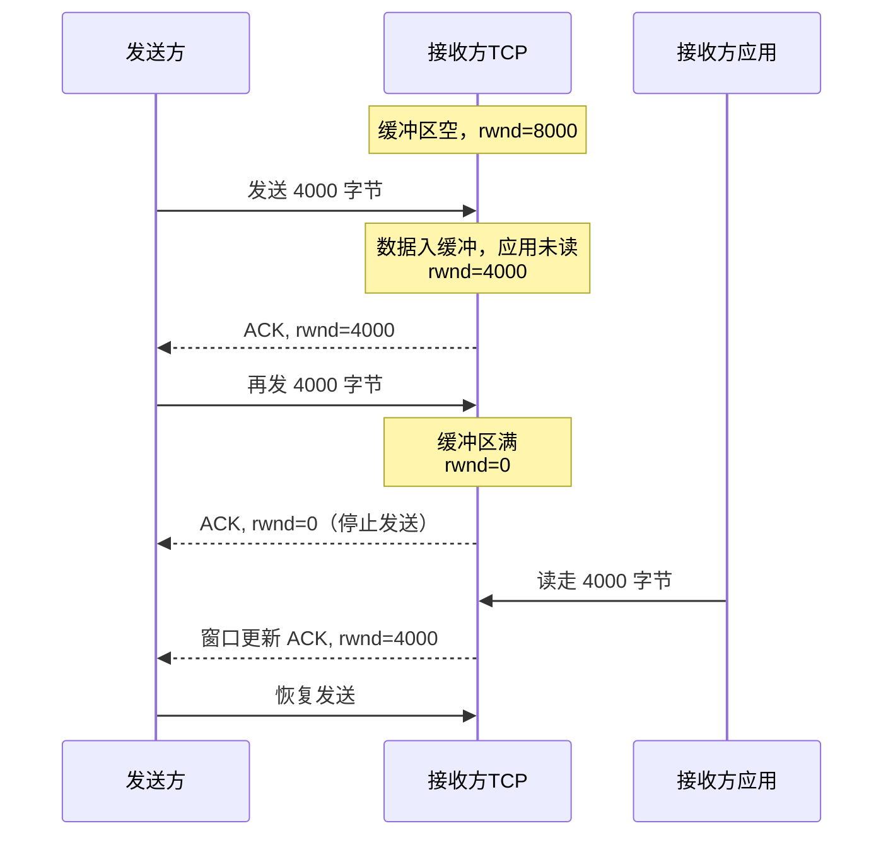
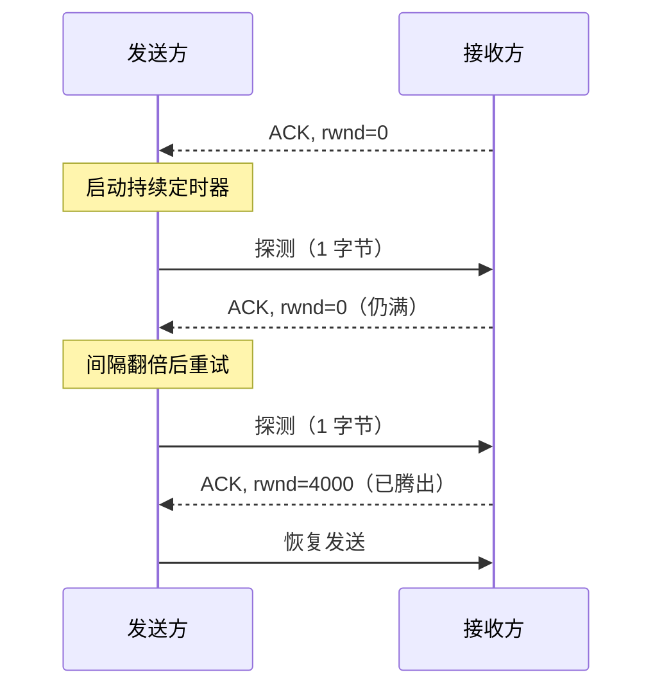

# 3.5 传输层：TCP流量控制

## 目录

1. [流量控制基本原理](#流量控制基本原理)
2. [滑动窗口机制](#滑动窗口机制)
3. [接收窗口管理](#接收窗口管理)
4. [零窗口问题与解决](#零窗口问题与解决)
5. [流量控制优化技术](#流量控制优化技术)
6. [现代实现中的优化](#现代实现中的优化)

---

## 流量控制基本原理

### 流量控制的核心概念

> **TCP流量控制 (Flow Control)**
> 
> 一种端到端的速率匹配机制：接收方动态通告自己的可用缓冲区，发送方据此约束发送速率，避免压垮接收方、造成缓冲区溢出丢包。

### 为什么需要流量控制

发送方与接收方的处理速率往往不匹配。若发送方持续高速发送，而接收方应用读取不及时，接收缓冲区会被填满，后续到达的数据只能丢弃：

```
发送方  ──高速数据──▶  接收缓冲区  ──应用慢速读取──▶  接收方应用
                      （填满则溢出丢包）
```

接收方通过**接收窗口 (Receive Window, rwnd)** 在 ACK 中通告剩余可用空间，发送方保证在途未确认数据不超过 rwnd，从而把发送速率压到接收方能消化的范围内。

常见的速率不匹配场景：服务器向 CPU/内存受限的移动设备推送、数据库高速导出而应用消费不及、高速 LAN 向低速高延迟 WAN 传输。

### 流量控制与拥塞控制的区别

易混：流量控制防止淹没**接收方**，拥塞控制防止压垮**网络**。两者目标、信息来源、控制参数都不同。

| 对比维度 | 流量控制 (Flow Control) | 拥塞控制 (Congestion Control) |
|----------|--------------------------------|----------------------------------|
| **控制目标** | 防止接收方缓冲区溢出 | 防止网络过载 |
| **信息来源** | 接收方显式通告 | 网络拥塞的隐式信号 |
| **控制参数** | 接收窗口 (rwnd) | 拥塞窗口 (cwnd) |
| **反馈机制** | 窗口大小通告 | 丢包、RTT、ECN 等指示 |
| **调整主体** | 接收方主导 | 发送方自适应 |

发送方实际可用的窗口由两者中的较小者决定，从而同时满足两个约束：

$$\text{发送窗口} = \min(\text{rwnd}, \text{cwnd})$$

---

## 滑动窗口机制

### 滑动窗口的基本概念

> **滑动窗口 (Sliding Window)**
> 
> 一种允许发送方在等待确认的同时连续发送多个数据段的机制，通过维护一个动态的"窗口"来平衡可靠性和效率。

### 窗口结构与状态

发送缓冲区分为四个区域，其中区域2、3合起来就是发送窗口（已发送未确认 + 可发送）：

```
字节序号: 1000      1200      1400      1600          1900
         ┌──────────┬──────────┬──────────┬────────────┐
数据状态: │ 已发送    │ 已发送    │ 可发送    │ 不可发送     │
         │ 已确认    │ 未确认    │ (窗口剩余) │ (超出窗口)   │
         └──────────┴──────────┴──────────┴────────────┘
            区域1       区域2      区域3        区域4
                       ↑          ↑          ↑
                   SendBase   NextSeqNum  WindowEnd
                    =1200      =1400       =1600
         ├──────────────────── 发送窗口 ───────────┤
                           （宽度 = 400 字节）

关键指针：
• SendBase   = LastByteAcked + 1 = 1200  最早未确认字节
• NextSeqNum = LastByteSent  + 1 = 1400  下一个待发送字节
• 发送窗口宽度 = min(rwnd, cwnd) = 400 字节
• WindowEnd  = SendBase + 窗口宽度 = 1600  窗口右边界
```

**关键状态变量**：

- **SendBase**：最早未确认字节的序号
- **NextSeqNum**：下一个要发送字节的序号
- **发送窗口宽度**：当前可在途的最大字节数，取 $\min(rwnd, cwnd)$

收到 ACK 时左边界右移（窗口"滑动"），收到新的窗口通告时右边界随之调整。

### 滑动窗口的数学模型

**窗口利用率计算**：

设网络带宽为 $B$ (bps)，往返时间为 $RTT$ (s)，窗口大小为 $W$ (bytes)，则：

- **带宽时延乘积**：$BDP = B \times RTT$ (bits) = $\frac{B \times RTT}{8}$ (bytes)
- **理论最大利用率**：$U = \min(1, \frac{W}{BDP})$

**关键结论**：
- 当 $W \geq BDP$ 时，可以达到100%的链路利用率
- 当 $W < BDP$ 时，利用率受窗口大小限制

**实际示例分析**：

| 网络条件 | 带宽 | RTT | BDP | 所需窗口 | MSS数量 |
|---------|------|-----|-----|----------|---------|
| **局域网** | 100 Mbps | 1 ms | 12.5 KB | ≥12.5 KB | ≥9个MSS |
| **广域网** | 10 Mbps | 50 ms | 62.5 KB | ≥62.5 KB | ≥43个MSS |
| **卫星链路** | 2 Mbps | 300 ms | 75 KB | ≥75 KB | ≥52个MSS |

*注：假设MSS=1460字节*

---

## 接收窗口管理

### 接收窗口的构成

接收缓冲区由三部分构成，rwnd 即可用空间，会随着应用读取（左边界右移）和数据到达（右边界左移）而变化：

```
                  接收缓冲区 RcvBuffer = 8000 字节
字节序号:  2000          2800             4400                       8000
          ├──────────────┼────────────────┼──────────────────────────┤
          │   已读取      │  已接收未读取    │       可用空间 rwnd        │
          │  应用已取走    │  待应用读取      │      尚未到达的数据可填     │
          └──────────────┴────────────────┴──────────────────────────┘
              800 字节         1600 字节              6400 字节
                         ↑                ↑
                  LastByteRead=2799  LastByteRcvd=4399
```

$$rwnd = RcvBuffer - (LastByteRcvd - LastByteRead) = 8000 - 1600 = 6400 \text{ 字节}$$

接收方在每个 ACK 中携带当前 rwnd，发送方据此约束在途数据量。下图展示 rwnd 随数据到达和应用读取的动态变化：



### 窗口通告机制

**窗口缩放 (Window Scaling)**：

TCP头部的窗口字段为16位，最大值为65535字节。对于现代高速网络，这个限制过小，因此引入了窗口缩放选项。

- **缩放公式**：$ActualWindow = AdvertisedWindow \times 2^{ScaleFactor}$
- **最大缩放因子**：14（理论最大窗口为1GB）

**窗口缩放示例**：

| 缩放因子 | 最大窗口大小 | 适用场景 |
|----------|-------------|----------|
| 0 | 64 KB | 低速网络 |
| 3 | 512 KB | 典型宽带 |
| 6 | 4 MB | 高速局域网 |
| 14 | 1 GB | 理论最大值 |

---

## 零窗口问题与解决

### 零窗口产生的原因

> **零窗口 (Zero Window)**
> 
> 接收方缓冲区完全被数据填满，无法接收更多数据时通告给发送方的窗口大小为0的状态。

**导致零窗口的典型场景**：

1. **应用程序处理慢**：数据库查询、文件I/O阻塞、CPU资源不足
2. **系统资源竞争**：内存不足、进程竞争、驱动繁忙
3. **应用设计问题**：单线程阻塞、缓冲区过小、同步处理

### 持续定时器机制

**问题**：接收方腾出空间后会发送窗口更新 ACK，但 ACK 是纯确认、不占序号、不会被重传。若它丢失，接收方以为已通知、发送方却仍认为 rwnd=0，双方互相等待，连接死锁。

**解决方案**：发送方收到零窗口通告后启动**持续定时器 (Persist Timer)**，定时发送只含 1 字节的**零窗口探测 (Zero Window Probe)**。接收方对探测的响应会捎带最新 rwnd，从而打破死锁。



探测间隔按指数退避，封顶 60 秒：

$$T_0 = 1\text{ s},\quad T_{\max} = 60\text{ s},\quad T_n = \min(T_0 \times 2^n,\ T_{\max})$$

即 1、2、4、8、…、60、60 秒，持续探测直至窗口打开。

---

## 流量控制优化技术

### Nagle算法

> **Nagle算法 (Nagle Algorithm)**
> 
> 通过延迟小数据包的发送来减少网络中小包的数量，提高网络效率。

**算法逻辑**：

```
如果 (数据大小 ≥ MSS) 则
    立即发送
否则如果 (无未确认数据) 则  
    立即发送并标记有未确认数据
否则
    缓存数据直到收到ACK或累积到MSS
```

### 延迟确认

> **延迟确认 (Delayed ACK)**
> 
> 接收方延迟发送ACK，希望能与回程数据一起发送或减少ACK数量。

**算法规则**：
- 延迟时间通常为200ms
- 最多延迟2个段的ACK
- 收到失序段时立即确认

**Nagle算法与延迟ACK的交互问题**：
当两者同时启用时，可能导致每个小包都有200ms的人为延迟。

---

## 现代实现中的优化

### 自适应缓冲区

固定大小的缓冲区难以兼顾不同网络。Linux 等系统支持缓冲区自动调优：根据测得的 RTT 和应用读取速度动态伸缩接收/发送缓冲区，使窗口接近 BDP，同时避免内存浪费。

### 硬件卸载

为降低高速链路下的 CPU 开销，网卡可分担部分协议处理：

- **TSO/GSO（发送方分段卸载）**：协议栈交付大段，网卡按 MSS 切分。
- **LRO/GRO（接收方分段合并）**：网卡或驱动合并连续小段，减少上层处理次数。

这些技术只改变分段的执行位置，不改变流量控制语义——rwnd 的计算和通告仍由 TCP 负责。

注：可编程内核（eBPF）等方向也在被用于定制化的窗口策略，但属于实现层面的演进，原理不变。

---

## 小结

- **rwnd**：接收方在 ACK 中通告 $rwnd = RcvBuffer - (LastByteRcvd - LastByteRead)$，发送方保证在途数据不超过它。
- **发送窗口**：取 $\min(rwnd, cwnd)$，分别受接收方和网络约束。
- **零窗口**：rwnd=0 时发送方靠持续定时器周期性发送零窗口探测，防止窗口更新 ACK 丢失导致死锁。
- **小包优化**：Nagle 算法合并小包、延迟 ACK 减少确认数，两者同开可能引入额外延迟。

---

**[下一节：3.6 TCP拥塞控制](3.6传输层：TCP拥塞控制.md)**
