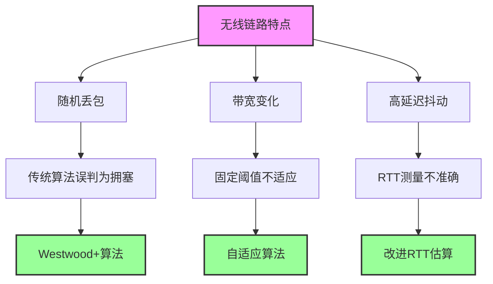

# 3.6 传输层：TCP拥塞控制

## 本章目录

1. [拥塞控制基本原理](#拥塞控制基本原理)
2. [经典拥塞控制算法](#经典拥塞控制算法)
3. [现代拥塞控制算法](#现代拥塞控制算法)
4. [拥塞控制性能分析](#拥塞控制性能分析)
5. [拥塞控制的演进与发展](#拥塞控制的演进与发展)

---

## 拥塞控制基本原理

### 拥塞控制的核心概念

> **TCP拥塞控制 (Congestion Control)**
> 
> 一种网络层面的速率控制机制，通过动态调整发送速率来防止网络过载，确保网络资源的高效利用和公平分配。

### 拥塞控制的原因与代价

> **网络拥塞 (Network Congestion)**
> 
> 当网络中对资源的需求超过了可用资源时，网络性能就要恶化，这种情况就是拥塞。

#### 拥塞产生的三种场景

**场景1：两个发送方和一台具有无限缓冲的路由器**

```
主机A ────┐        ┌──── 主机C
          │ λin,A  │
          ├────→[R]────→ λout
主机B ────┘        └──── 主机D
          λin,B
          
网络配置：
• 链路容量：R bps
• 路由器缓冲：无限大
• 重传：无
```

**理想情况分析**：
- 当 $λ_{in,A} + λ_{in,B} ≤ R$ 时，吞吐量 = 输入速率
- 当 $λ_{in,A} + λ_{in,B} > R$ 时，出现排队延迟
- **代价**：虽然无丢包，但排队延迟趋向无穷大

**场景2：两个发送方和一台具有有限缓冲的路由器**

```
主机A ────┐        ┌──── 主机C  
          │        │
          ├────→[R]────→ 输出链路：R
主机B ────┘        └──── 主机D
                   ↓
              有限缓冲区
                (丢包)
```

**重传影响分析**：
- **完美重传**：$λ'_{in} = λ_{in}$（仅重传丢失分组）
- **重复重传**：$λ'_{in} > λ_{in}$（重传未丢失分组）
- **过早超时**：$λ'_{in} >> λ_{in}$（重传已收到分组）

**代价量化**：
- 发送方必须执行重传以补偿因缓冲区溢出而丢弃的分组
- 不必要的重传会浪费链路带宽
- 最大吞吐量受限于：$λ_{out} ≤ R/2$（考虑重传开销）

**场景3：四个发送方和具有有限缓冲的多台路由器**

```
网络拓扑：
A ─────┐     ┌─ C
       │ R1  │
       └──┬──┘
          │ R (瓶颈链路)  
       ┌──┴──┐
       │ R2  │
B ─────┘     └─ D

拥塞传播：
1. A-C和B-D流量竞争中间链路
2. A流量增加导致B-D路径拥塞
3. R1处的缓冲浪费（B的分组最终在R2丢弃）
```

**多跳网络的拥塞代价**：
- **浪费上游传输容量**：被丢弃的分组已消耗上游链路资源
- **路径间相互影响**：一条路径的拥塞影响其他路径
- **吞吐量急剧下降**：随负载增加，有效吞吐量可能趋于零

### 拥塞控制方法分类

#### 端到端拥塞控制 vs 网络辅助拥塞控制

| 对比维度 | 端到端拥塞控制 | 网络辅助拥塞控制 |
|----------|----------------|------------------|
| **信息来源** | 端系统观察网络行为 | 网络层提供显式反馈 |
| **检测方法** | 丢包、延迟增加、重复ACK | 拥塞位、速率信息 |
| **响应速度** | 较慢（需推断） | 较快（直接通知） |
| **实现复杂度** | 简单 | 复杂（需网络支持） |
| **部署要求** | 仅需端系统升级 | 需要网络设备支持 |
| **典型例子** | TCP拥塞控制 | ATM ABR、ECN |

#### 端到端拥塞控制原理

**TCP的端到端方法**：
1. **拥塞推断**：
   - **丢包事件**：超时或3个重复ACK
   - **RTT增加**：排队延迟增长的指示
   - **吞吐量下降**：网络容量接近饱和

2. **控制策略**：
   - **慢启动**：指数增长探测容量
   - **拥塞避免**：线性增长维持稳定
   - **快速恢复**：快速响应轻度拥塞

3. **自适应机制**：
   - **AIMD算法**：保证收敛性和公平性
   - **动态调整**：根据网络状况调整参数

#### 网络辅助拥塞控制

**显式拥塞通知（ECN）机制**：

```
ECN工作原理：
1. 路由器检测拥塞（队列长度超过阈值）
2. 标记分组的ECN位而不丢弃分组
3. 接收方将ECN信息反馈给发送方  
4. 发送方像处理丢包一样响应ECN

优势：
• 避免不必要的分组丢失
• 更快的拥塞通知
• 更好的网络利用率
```

**ATM可用比特率（ABR）**：
- **RM信元**：资源管理信元携带拥塞信息
- **EFCI位**：显式前向拥塞指示
- **速率控制**：网络直接指定发送速率

### 网络拥塞现象分析

**拥塞的根本原因**：网络中的数据需求超过了网络的处理能力

```
网络性能随负载变化曲线：

吞吐量
  ↑
  │     ┌─── 理想情况
  │    ╱
  │   ╱
  │  ╱
  │ ╱        ┌─── 实际情况
  │╱        ╱│
  └────┬───╱─┼──────────→ 负载
       │  ╱  │
    膝点 ╱   崩溃点
       ╱
      ╱
     ╱
```

**网络负载与性能的关系**：

| 负载区间 | 网络状态 | 吞吐量特征 | 延迟特征 | 丢包率 |
|----------|----------|------------|----------|--------|
| **0-70%** | 正常运行 | 线性增长 | 稳定低延迟 | 接近0% |
| **70-90%** | 轻度拥塞 | 增长放缓 | 延迟开始增加 | <1% |
| **90-100%** | 重度拥塞 | 增长停滞 | 延迟急剧增加 | 1-10% |
| **>100%** | 拥塞崩溃 | 急剧下降 | 延迟极高 | >10% |

### 拥塞控制的设计目标

**四大核心目标**：

1. **效率性 (Efficiency)**：
   - 目标：最大化网络吞吐量
   - 指标：网络利用率接近但不超过容量
   - 挑战：准确估计网络容量

2. **公平性 (Fairness)**：
   - 目标：多个连接公平分享网络资源
   - 指标：Jain公平性指数接近1.0
   - 挑战：不同RTT的连接天然不公平

3. **稳定性 (Stability)**：
   - 目标：系统快速收敛到稳定状态
   - 指标：振荡幅度小，收敛时间短
   - 挑战：多连接间的相互影响

4. **鲁棒性 (Robustness)**：
   - 目标：适应各种网络环境
   - 指标：在不同条件下都能正常工作
   - 挑战：参数调整的复杂性

**公平性的数学定义**：

Jain公平性指数：

$$J(x_1, x_2, ..., x_n) = \frac{(\sum_{i=1}^{n} x_i)^2}{n \times \sum_{i=1}^{n} x_i^2}$$

其中 $x_i$ 是第i个连接的吞吐量。当所有连接获得相同吞吐量时，$J = 1$（完全公平）。

### 拥塞控制与流量控制的协同

**双重约束机制**：

TCP发送方必须同时遵守两个窗口限制：

$$SendingRate \leq \min\left(\frac{rwnd}{RTT}, \frac{cwnd}{RTT}\right)$$

**约束关系分析**：

- **流量控制主导**：当接收方处理能力是瓶颈时
  - 表现：rwnd < cwnd，发送速率受rwnd限制
  - 场景：移动设备接收大文件、应用程序处理慢

- **拥塞控制主导**：当网络容量是瓶颈时  
  - 表现：cwnd < rwnd，发送速率受cwnd限制
  - 场景：大多数正常网络传输情况

**动态切换示例**：

```
连接生命周期中的主导因子变化：

时间 →  慢启动  |  拥塞避免  |  应用处理慢  |  网络恢复
       ────────┼──────────┼────────────┼──────────
cwnd:    1→32   |   32→64   |     64     |   32→48
rwnd:     64    |    64     |   64→8→64  |    64
主导:   拥塞控制 |  拥塞控制  |   流量控制   |  拥塞控制
```

---

## 经典拥塞控制算法

### 慢启动算法 (Slow Start)

> **设计思想**：连接初期指数增长拥塞窗口，快速探测网络容量

**算法原理**：

1. **初始化**：cwnd = 1 MSS
2. **窗口增长**：每收到一个ACK，cwnd += 1 MSS  
3. **增长特性**：每个RTT后，cwnd翻倍（指数增长）
4. **结束条件**：cwnd达到ssthresh或检测到丢包

**数学模型**：

设第k个RTT后的拥塞窗口为 $cwnd_k$，则：

$$cwnd_k = cwnd_0 \times 2^k = 2^k \text{ MSS}$$

**慢启动性能分析**：

| RTT轮数 | 拥塞窗口(MSS) | 可发送段数 | 累积发送量 |
|---------|---------------|-----------|-----------|
| 0 | 1 | 1 | 1 |
| 1 | 2 | 2 | 3 |
| 2 | 4 | 4 | 7 |
| 3 | 8 | 8 | 15 |
| k | $2^k$ | $2^k$ | $2^{k+1}-1$ |

**达到网络容量的时间**：

若网络带宽时延乘积为BDP，则慢启动达到BDP所需RTT数：

$$RTT_{reach} = \lceil \log_2(BDP/MSS) \rceil$$

**慢启动阈值 (ssthresh)**：

- **初始值**：通常设为65535字节或发送窗口的最大值
- **更新时机**：检测到拥塞时更新
- **更新公式**：$ssthresh = \max(cwnd/2, 2 \times MSS)$

### 拥塞避免算法 (Congestion Avoidance)

> **设计思想**：当窗口达到一定大小后，谨慎地线性增长，避免引起拥塞

**算法原理**：

1. **启动条件**：cwnd ≥ ssthresh
2. **窗口增长**：每个RTT增加1个MSS
3. **实现方式**：每收到一个ACK，cwnd += MSS/cwnd
4. **增长特性**：线性增长（加性增长）

**数学模型**：

在拥塞避免阶段，第k个RTT后：

$$cwnd_k = ssthresh + k \times MSS$$

**AIMD算法原理**：

> **AIMD (Additive Increase Multiplicative Decrease)**
> 
> TCP拥塞控制的核心算法思想：线性增长，指数退避

**AIMD的数学表述**：

- **加性增长**：$cwnd(t+1) = cwnd(t) + \alpha$，通常 $\alpha = 1$ MSS
- **乘性减少**：$cwnd(t+1) = \beta \times cwnd(t)$，通常 $\beta = 0.5$

**AIMD收敛性分析**：

```
两个连接的AIMD收敛过程：

连接1吞吐量
     ↑
     │  ╲ 
     │   ╲ 拥塞点
     │    ╲ 
     │     ╲
     │      ╲
     │       ╲
     │        ╲______ 公平线
     │               ╲ (x₁=x₂)
     │                ╲
     │                 ╲
     └─────────────────→ 连接2吞吐量
                      效率线(x₁+x₂=C)
```

**AIMD公平性证明要点**：

1. **公平线收敛**：多次AIMD循环后，连接吞吐量趋向相等
2. **效率保证**：系统总吞吐量趋向网络容量
3. **稳定性**：振荡幅度随时间减小

### 快速重传算法 (Fast Retransmit)

> **设计目标**：快速检测丢包，不依赖超时重传

**算法原理**：

1. **触发条件**：收到3个重复ACK
2. **立即重传**：不等待RTO超时
3. **拥塞推断**：将重复ACK视为轻度拥塞信号
4. **窗口调整**：ssthresh = cwnd/2，cwnd = ssthresh + 3×MSS

**快速重传的时序分析**：

```
正常情况下的ACK序列：
发送: [1] [2] [3] [4] [5] [6]
接收: ACK1 ACK2 ACK3 ACK4 ACK5 ACK6

丢包情况下的ACK序列：
发送: [1] [2] [3] [4] [5] [6]
丢包:      X
接收: ACK1 ACK2 ACK2 ACK2 ACK2 (触发快速重传)
                 dup1 dup2 dup3
```

**快速重传的优势**：

- **时延优势**：检测时间约1个RTT vs 超时重传的RTO（通常数百ms到数s）
- **吞吐量提升**：避免长时间等待，维持数据流连续性
- **适应性强**：对网络重排序有一定容忍度

### 快速恢复算法 (Fast Recovery)

> **设计目标**：快速重传后快速恢复传输，避免慢启动的低效率

**算法流程**：

1. **进入条件**：检测到3个重复ACK
2. **设置阈值**：ssthresh = cwnd/2
3. **调整窗口**：cwnd = ssthresh + 3×MSS
4. **维持发送**：每收到重复ACK，cwnd += 1×MSS
5. **退出恢复**：收到新ACK时，cwnd = ssthresh

**快速恢复的设计逻辑**：

```
快速恢复的窗口变化：

cwnd
  ↑
  │     ┌─────┐ 临时膨胀
  │    ╱      ╲
  │   ╱        ╲
  │  ╱          ╲ 收缩到ssthresh
  │ ╱            ╲___
  │╱                 ╲___
  └─────────────────────→ 时间
   触发    快速    退出
   快速    恢复    恢复
   重传    阶段
```

**临时窗口膨胀的原因**：

- 每个重复ACK表示一个段已离开网络
- 临时增加cwnd允许发送新数据
- 维持管道中的数据量，避免吞吐量下降

---

## 现代拥塞控制算法

### TCP CUBIC算法

> **设计动机**：传统TCP在高带宽长延迟网络中收敛缓慢，CUBIC通过三次函数优化窗口增长

**核心思想**：

1. **记忆最大窗口**：记录丢包前的窗口大小 $W_{max}$
2. **三次函数增长**：使用三次函数逼近 $W_{max}$
3. **TCP友好性**：在低速网络中表现类似传统TCP

**CUBIC窗口函数**：

$$W(t) = C \times (t - K)^3 + W_{max}$$

其中：
- $t$：从丢包恢复开始的时间
- $K = \sqrt[3]{\frac{W_{max} \times \beta}{C}}$：恢复到 $W_{max}$ 的时间
- $C$：CUBIC参数，通常为0.4
- $\beta$：减少因子，通常为0.7

**CUBIC增长特性**：

```
CUBIC窗口增长曲线：

cwnd
  ↑
  │      ╱
  │     ╱
  │ ___╱___ Wmax
  │╱        
  │      Concave  │  Convex
  │     region    │  region  
  │               │
  └───────────────┼─────────→ 时间
                  K

增长速度：慢→快→慢
```

**CUBIC的优势**：

- **快速收敛**：在高BDP网络中快速达到最优窗口
- **RTT友好性**：不同RTT连接的竞争更公平
- **稳定性好**：窗口振荡幅度较小

### BBR算法

> **设计革命**：从基于丢包的拥塞控制转向基于带宽和RTT测量的模型驱动方法

**BBR核心理念**：

1. **最优工作点**：在BDP（带宽时延乘积）处工作
2. **主动测量**：持续测量瓶颈带宽和最小RTT
3. **模型驱动**：基于网络模型而非丢包信号控制

**BBR状态机**：

```
BBR四个状态的转换：

    STARTUP ──→ DRAIN ──→ PROBE_BW
        ↑                     │
        │                     ↓
        └────── PROBE_RTT ←────┘

各状态特点：
• STARTUP: 指数增长寻找带宽
• DRAIN: 排空多余数据  
• PROBE_BW: 周期性探测带宽
• PROBE_RTT: 定期测量最小RTT
```

**BBR关键测量**：

1. **瓶颈带宽估计**：
   $$BtlBw = \max_{recent}(\frac{delivered\_data}{delivery\_time})$$
   
   *测量窗口：通常为过去10个RTT的最大值*

2. **最小RTT估计**：
   $$MinRTT = \min_{recent}(RTT_{samples})$$
   
   *测量窗口：通常为过去10秒钟的最小值*

3. **目标发送速率**：
   $$pacing\_rate = pacing\_gain \times BtlBw$$
   
   *其中pacing_gain在不同状态下取不同值：STARTUP(2.89), DRAIN(1/2.89), PROBE_BW(1.0-1.25)*

4. **目标拥塞窗口**：
   $$cwnd = cwnd\_gain \times BDP$$
   其中 $BDP = BtlBw \times MinRTT$
   
   *cwnd_gain通常为2.0，确保管道充满*

**BBR与传统算法对比**：

| 特征 | 传统TCP(CUBIC) | BBR |
|------|----------------|-----|
| **拥塞信号** | 丢包 | 带宽/RTT测量 |
| **工作点** | 接近丢包边缘 | BDP最优点 |
| **缓冲区要求** | 需要大缓冲区 | 适应小缓冲区 |
| **收敛速度** | 较慢 | 快速 |
| **公平性** | 较好 | 有待改进 |

---

## 拥塞控制性能分析

### 算法性能指标

**关键性能指标**：

1. **吞吐量 (Throughput)**：
   - 定义：单位时间内成功传输的数据量
   - 测量：Goodput = 有效数据 / 总时间
   - 目标：接近网络容量

2. **延迟 (Latency)**：
   - 组成：传播延迟 + 处理延迟 + 排队延迟
   - 关键：排队延迟受拥塞控制直接影响
   - 目标：最小化排队延迟

3. **公平性 (Fairness)**：
   - Jain指数：衡量多连接间资源分配公平程度
   - RTT公平性：不同RTT连接的竞争公平性
   - 目标：Jain指数接近1.0

4. **稳定性 (Stability)**：
   - 收敛时间：达到稳定状态的时间
   - 振荡幅度：窗口变化的波动程度  
   - 目标：快速收敛，小幅振荡

### 不同网络环境下的算法表现

**网络环境分类与算法适应性**：

| 网络类型 | 特征 | 最佳算法 | 关键考虑 |
|----------|------|----------|----------|
| **数据中心网络** | 低延迟(μs级)<br/>高带宽<br/>浅缓冲区 | DCTCP<br/>BBR | 精确控制排队<br/>快速响应 |
| **广域网** | 中等延迟(10-100ms)<br/>中等带宽<br/>深缓冲区 | CUBIC<br/>BBR | 带宽利用率<br/>RTT公平性 |
| **卫星网络** | 超高延迟(300ms+)<br/>中低带宽<br/>变化大 | 修改的CUBIC<br/>专用算法 | 长管道填充<br/>误码处理 |
| **移动网络** | 变化延迟<br/>变化带宽<br/>高误码 | BBR<br/>自适应算法 | 快速适应<br/>误码区分 |

### 算法演进的驱动因素

**技术演进的推动力**：

1. **网络环境变化**：
   - 带宽增长：从Kbps到Gbps
   - 延迟多样化：从ms到μs和数百ms
   - 缓冲区变化：从深缓冲区到浅缓冲区

2. **应用需求变化**：
   - 实时应用增长：视频、游戏、VR
   - 大数据传输：云计算、CDN
   - 移动优先：无线网络特性

3. **硬件能力提升**：
   - CPU性能：支持复杂算法
   - 网卡智能化：硬件加速
   - 测量精度：高精度时间戳

**算法发展时间线**：

```
TCP拥塞控制算法演进：

1988   1990   1996   2001   2005   2016   2020
  │      │      │      │      │      │      │
Tahoe  Reno   NewReno SACK  CUBIC  BBR   BBR v2
  │      │      │      │      │      │      │
慢启动  快速   改进   选择   立方   模型   多目标
      重传   恢复   确认  增长   驱动   优化

关键改进：
• 1988-1996: 基础算法建立
• 1996-2005: 高速网络适配  
• 2005-2016: 智能算法兴起
• 2016-今:  模型驱动时代
```

---

## 拥塞控制的演进与发展

### 当前面临的挑战

**技术挑战**：

1. **多样化网络环境**：
   - 网络类型多样：有线、无线、卫星
   - 特性差异大：带宽、延迟、丢包特征不同
   - 单一算法难以适应所有环境

2. **应用需求复杂化**：
   - 实时性要求：低延迟vs高吞吐量的权衡
   - 公平性需求：不同优先级的流竞争
   - 能耗考虑：移动设备的电池限制

3. **网络基础设施更新**：
   - 缓冲区设计：从深缓冲区到浅缓冲区
   - 队列管理：AQM算法的部署
   - 硬件加速：智能网卡的普及

### 未来发展方向

**技术发展趋势**：

1. **BBR v2的重大改进 (2024)**：
   ```
   BBR v2相比BBR v1的关键改进：
   
   改进维度         BBR v1           BBR v2
   ┌──────────┐    ┌────────┐      ┌──────────┐
   │公平性问题 │    │竞争激进 │  →   │自适应调节 │
   │延迟控制  │    │延迟较高 │  →   │更低排队  │
   │收敛速度  │    │可能振荡 │  →   │平滑收敛  │
   │多流感知  │    │流间竞争 │  →   │协调优化  │
   └──────────┘    └────────┘      └──────────┘
   
   核心技术创新：
   • PROBE_RTT_CWND：动态调整探测窗口
   • 公平性算法：改进与传统TCP的共存
   • ECN集成：显式拥塞通知支持
   • 多径感知：支持多路径网络优化
   ```

### 显式拥塞通知（ECN）详解

> **显式拥塞通知 (Explicit Congestion Notification, ECN)**
> 
> RFC 3168定义的网络辅助拥塞控制机制，允许路由器通过标记数据包而不是丢弃数据包来通知端系统拥塞情况。

#### ECN的工作机制

**ECN标志位定义**：

TCP和IP头部中的ECN相关位：

```
IP头部ToS字段中的ECN位：
┌─────────────────┬───┬───┐
│   DSCP (6位)    │ECT│CE │
└─────────────────┴───┴───┘
                  0   1  (位位置)

ECN编码：
00: 不支持ECN (Not-ECT)
01: ECN有能力传输 (ECT(1))  
10: ECN有能力传输 (ECT(0))
11: 遇到拥塞 (CE - Congestion Experienced)

TCP头部ECN相关标志：
• ECE (ECN-Echo): 通知发送方网络拥塞
• CWR (Congestion Window Reduced): 确认收到ECE
```

**ECN协商过程**：

```
连接建立时的ECN协商：
客户端                    服务器
  │── SYN (ECE=1,CWR=1) ──→ │
  │                        │ (协商ECN支持)
  │←── SYN-ACK (ECE=1) ──── │
  │                        │
  │── ACK (ECE=0,CWR=0) ──→ │
                            
协商成功，连接支持ECN
```

#### ECN的端到端工作流程

**完整ECN处理流程**：

```
1. 数据传输阶段：
发送方 ──IP包(ECT=1)──→ 路由器1 ──→ 路由器2 ──→ 接收方
                        │拥塞检测│
                        │队列饱和│
                        ↓
                   标记CE位=1
                   (不丢弃包)

2. 拥塞反馈阶段：  
接收方收到CE标记的包
  ↓
在后续ACK中设置ECE=1
  ↓
发送方收到ECE=1的ACK
  ↓
执行拥塞控制(减半cwnd)
  ↓
在数据包中设置CWR=1确认
  ↓
接收方收到CWR=1后清除ECE标志
```

**ECN vs 丢包的对比**：

| 特征 | 传统丢包方式 | ECN方式 |
|------|-------------|--------|
| **信号传递** | 丢弃数据包 | 标记数据包 |
| **信息丢失** | 是（需重传） | 否（保留数据） |
| **反应时间** | 1个RTO或3个重复ACK | 1个RTT |
| **网络效率** | 较低（浪费带宽） | 较高（无重传开销） |
| **部署要求** | 无需网络支持 | 需要路由器支持ECN |

#### ECN的实现细节

**路由器ECN实现**：

1. **拥塞检测算法**：
   ```
   常用ECN标记策略：
   
   • RED with ECN：
     - 队列长度 < min_thresh：不标记
     - min_thresh ≤ 队列 < max_thresh：概率标记
     - 队列长度 ≥ max_thresh：全部标记
   
   • PIE with ECN：
     - 基于延迟的动态标记
     - 自适应调整标记概率
   
   • CoDel with ECN：
     - 检测持续排队时间
     - 超过目标延迟时开始标记
   ```

2. **标记策略选择**：
   - **保守标记**：仅在即将丢包时才标记
   - **激进标记**：提前标记以避免拥塞加剧
   - **自适应标记**：根据流量模式动态调整

**TCP发送方ECN处理**：

```
ECN响应算法：
if (收到ECE=1的ACK) {
    if (未在拥塞恢复状态) {
        // 执行与丢包相同的拥塞控制
        ssthresh = max(cwnd/2, 2*MSS)
        cwnd = ssthresh
        设置CWR=1  // 通知接收方已响应
        进入拥塞避免状态
    }
}

if (发送数据包) {
    if (需要确认CWR响应) {
        设置数据包CWR=1
        清除CWR响应标志
    }
}
```

#### ECN部署现状与挑战

**部署统计 (2024)**：

| 网络环境 | ECN支持率 | 主要障碍 |
|----------|----------|----------|
| **数据中心** | 95%+ | 几乎全面部署 |
| **CDN网络** | 80%+ | 积极部署中 |
| **公共互联网** | 60%+ | 中间盒问题 |
| **移动网络** | 40%+ | 设备兼容性 |
| **企业网络** | 30%+ | 设备升级成本 |

**部署挑战**：

1. **中间盒干扰**：
   - 某些防火墙/NAT设备清除ECN位
   - 深度包检测设备的兼容性问题
   - 负载均衡器的ECN处理不当

2. **网络设备支持**：
   - 老旧设备不支持ECN标记
   - 队列管理算法需要升级
   - 性能开销考虑

3. **端系统实现**：
   - 操作系统默认关闭ECN
   - 应用程序感知ECN的能力
   - 调试和监控工具缺乏

**ECN的性能收益**：

实测数据显示ECN的改善效果：
- **延迟降低**：平均减少15-30%的排队延迟  
- **吞吐量提升**：高负载下提升10-25%
- **丢包减少**：减少60-80%的不必要丢包
- **重传降低**：显著减少超时重传次数

2. **智能化拥塞控制**：
   ```
   机器学习在拥塞控制中的应用：
   
   输入特征          ML模型        输出决策
   ┌──────────┐    ┌────────┐    ┌──────────┐
   │• RTT变化  │    │强化学习│    │发送速率   │
   │• 带宽估计 │───→│神经网络│───→│窗口大小   │
   │• 丢包模式 │    │决策树  │    │状态转换   │
   │• 应用类型 │    └────────┘    └──────────┘
   └──────────┘
   
   2024年最新进展：
   • Google Gemini CC：基于大模型的拥塞控制
   • Meta Aurora：强化学习优化的CC算法
   • 华为HiCC：面向5G的智能拥塞控制
   ```

2. **多目标优化**：
   - **延迟敏感优化**：为实时应用优化
   - **能耗感知控制**：移动设备的电池考虑
   - **QoS差异化**：不同应用的个性化控制

3. **协议栈集成**：
   - **跨层优化**：与路由、MAC层协作
   - **应用感知**：根据应用特征调整策略
   - **网络感知**：利用SDN获取全局信息

### 新兴技术与拥塞控制

**5G/6G网络的影响**：

1. **网络切片**：
   - 不同切片的差异化拥塞控制
   - 端到端QoS保证
   - 资源隔离与共享

2. **边缘计算**：
   - 本地化拥塞控制决策
   - 减少控制环路延迟
   - 局部优化vs全局优化

3. **网络功能虚拟化**：
   - 动态部署拥塞控制算法
   - 软件定义的传输协议
   - 快速算法更新与部署

**量子网络时代的考虑**：

1. **量子信道特性**：
   - 极低延迟但易受干扰
   - 量子纠缠的特殊性质
   - 测量对信道状态的影响

2. **安全性要求**：
   - 量子密钥分发的特殊需求
   - 拥塞控制对安全性的影响
   - 侧信道攻击的防护

### 本章小结

#### 拥塞控制核心原理

1. **基本目标**：效率性、公平性、稳定性、鲁棒性的综合优化
2. **经典算法**：慢启动、拥塞避免、快速重传/恢复的AIMD框架
3. **现代算法**：CUBIC的立方增长和BBR的模型驱动方法
4. **性能权衡**：吞吐量、延迟、公平性之间的动态平衡

#### 技术发展脉络

- **1980s-1990s**：基础算法确立期，解决网络拥塞崩溃问题
- **1990s-2000s**：算法完善期，提高高速网络适应性
- **2000s-2010s**：智能算法期，针对特定环境优化
- **2010s-至今**：模型驱动期，从被动响应到主动控制

---

## 拥塞控制算法计算实例

### 408考研典型计算题 ⭐⭐⭐⭐⭐

#### 例题1：慢启动与拥塞避免计算

> **题目**：TCP连接初始拥塞窗口为1MSS，慢启动阈值为8MSS。网络在第12个RTT发生超时，采用Tahoe算法。计算前15个RTT的拥塞窗口大小。

**解答过程**：

**阶段分析**：
- RTT 1-4：慢启动阶段（cwnd < ssthresh）
- RTT 5-11：拥塞避免阶段（cwnd ≥ ssthresh）  
- RTT 12：超时发生，进入超时恢复
- RTT 13-15：重新慢启动

**详细计算**：

| RTT | 阶段 | cwnd变化 | ssthresh | 说明 |
|-----|------|----------|----------|------|
| 1 | 慢启动 | 1 → 2 | 8 | cwnd翻倍 |
| 2 | 慢启动 | 2 → 4 | 8 | cwnd翻倍 |
| 3 | 慢启动 | 4 → 8 | 8 | cwnd翻倍，达到阈值 |
| 4 | 拥塞避免 | 8 → 9 | 8 | cwnd += 1 |
| 5 | 拥塞避免 | 9 → 10 | 8 | cwnd += 1 |
| 6 | 拥塞避免 | 10 → 11 | 8 | cwnd += 1 |
| 7 | 拥塞避免 | 11 → 12 | 8 | cwnd += 1 |
| 8 | 拥塞避免 | 12 → 13 | 8 | cwnd += 1 |
| 9 | 拥塞避免 | 13 → 14 | 8 | cwnd += 1 |
| 10 | 拥塞避免 | 14 → 15 | 8 | cwnd += 1 |
| 11 | 拥塞避免 | 15 → 16 | 8 | cwnd += 1 |
| **12** | **超时** | **16 → 1** | **8** | **ssthresh = 16/2 = 8** |
| 13 | 慢启动 | 1 → 2 | 8 | 重新开始慢启动 |
| 14 | 慢启动 | 2 → 4 | 8 | cwnd翻倍 |
| 15 | 慢启动 | 4 → 8 | 8 | cwnd翻倍 |

#### 例题2：快速重传与快速恢复

> **题目**：TCP连接处于拥塞避免阶段，当前cwnd=20MSS，ssthresh=10MSS。收到3个重复ACK触发快速重传，使用Reno算法。计算快速恢复过程的窗口变化。

**解答步骤**：

**步骤1：检测到丢包**
```
收到第3个duplicate ACK
→ 检测到丢包
→ 进入快速重传阶段
```

**步骤2：快速重传处理**
```
ssthresh = cwnd / 2 = 20 / 2 = 10
cwnd = ssthresh + 3 = 10 + 3 = 13  (Reno算法)
重传丢失的段
```

**步骤3：快速恢复过程**
```
每收到一个duplicate ACK：cwnd += 1
假设收到2个额外的duplicate ACK：
cwnd = 13 + 2 = 15
```

**步骤4：恢复正常**
```
收到新的ACK（确认重传段）：
cwnd = ssthresh = 10
进入拥塞避免阶段
```

**算法对比**：
- **Tahoe**：快速重传后 cwnd = 1，重新慢启动
- **Reno**：快速重传后 cwnd = ssthresh，快速恢复
- **NewReno**：改进的快速恢复，处理多包丢失

### 拥塞控制算法性能对比

#### 不同算法的收敛特性

**仿真场景**：瓶颈带宽100Mbps，RTT=100ms，缓冲区=BDP

| 算法 | 收敛时间 | 稳态吞吐量 | 丢包敏感性 | 公平性 |
|------|----------|------------|------------|--------|
| **Tahoe** | 慢 | 中等 | 高 | 好 |
| **Reno** | 中等 | 好 | 中等 | 好 |
| **NewReno** | 中等 | 更好 | 中等 | 好 |
| **SACK** | 快 | 最好 | 低 | 好 |
| **CUBIC** | 快 | 最好 | 低 | 中等 |
| **BBR** | 最快 | 最好 | 最低 | 待观察 |

#### 网络环境适应性分析

**高带宽长延迟网络 (BDP > 64KB)**：

| 算法 | 表现 | 原因分析 | 推荐度 |
|------|------|----------|--------|
| **传统算法** | 差 | AIMD收敛太慢 | ❌ |
| **CUBIC** | 好 | 三次函数快速探测 | ✅ |
| **BBR** | 最好 | 基于带宽和延迟模型 | ⭐⭐⭐ |

**无线网络环境**：



### 拥塞控制参数调优

#### Linux系统TCP参数优化

**缓冲区调优**：
```bash
# 接收缓冲区 (字节)
net.core.rmem_default = 87380
net.core.rmem_max = 16777216

# 发送缓冲区 (字节)  
net.core.wmem_default = 65536
net.core.wmem_max = 16777216

# TCP缓冲区自动调节
net.ipv4.tcp_rmem = 4096 87380 16777216
net.ipv4.tcp_wmem = 4096 65536 16777216
```

**拥塞控制算法选择**：
```bash
# 查看可用算法
sysctl net.ipv4.tcp_available_congestion_control

# 设置默认算法
sysctl -w net.ipv4.tcp_congestion_control=cubic

# 针对特定应用选择
# 高吞吐量应用：cubic, bbr
# 低延迟应用：reno, vegas  
# 无线网络：westwood
```

**高级参数调优**：
```bash
# 启用窗口缩放
net.ipv4.tcp_window_scaling = 1

# 启用SACK
net.ipv4.tcp_sack = 1

# 启用时间戳
net.ipv4.tcp_timestamps = 1

# 启用快速打开
net.ipv4.tcp_fastopen = 3
```

### 拥塞控制的实践指导

#### 应用选择建议

**Web服务器优化**：
```bash
# 短连接优化
net.ipv4.tcp_congestion_control=cubic
net.ipv4.tcp_slow_start_after_idle=0

# 连接复用
net.ipv4.tcp_tw_reuse=1
```

**流媒体应用优化**：
```bash
# 低延迟优先
net.ipv4.tcp_congestion_control=vegas
net.ipv4.tcp_abc=0
```

**大数据传输优化**：
```bash  
# 高吞吐量优化
net.ipv4.tcp_congestion_control=bbr
# 增大缓冲区
echo 'net.core.rmem_max=134217728' >> /etc/sysctl.conf
```

#### 监控与诊断

**性能监控指标**：
```bash
# 查看拥塞窗口
ss -i dst target_ip

# 查看重传统计  
nstat -az | grep -i retrans

# 查看拥塞事件
netstat -s | grep -i cong
```

**问题诊断工具**：
```bash
# 实时监控
iftop -i eth0 -P

# 详细分析
tcptrace -S captured_packets.pcap

# 图形化分析  
wireshark capture.pcap
```

#### 未来发展展望

- **智能化**：机器学习驱动的自适应算法
- **个性化**：应用感知的差异化控制策略  
- **协同化**：多层次多维度的协同优化
- **标准化**：新算法的标准化和部署推广

---

**[下一节：3.7 现代传输技术](3.7传输层：现代传输技术.md)**
