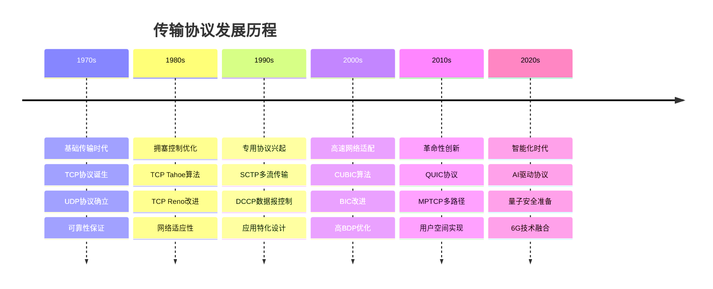
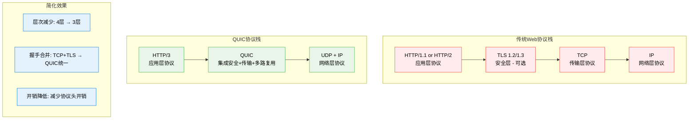
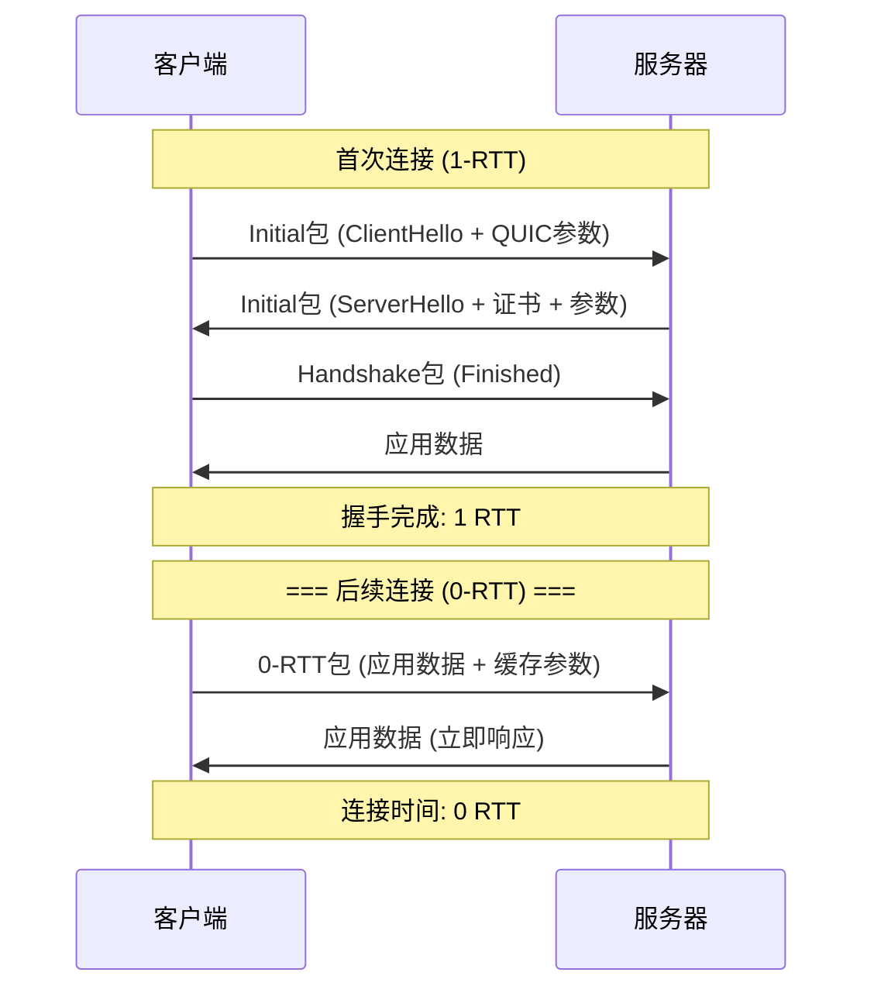
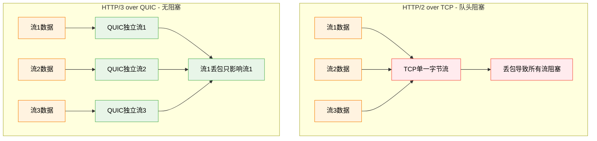
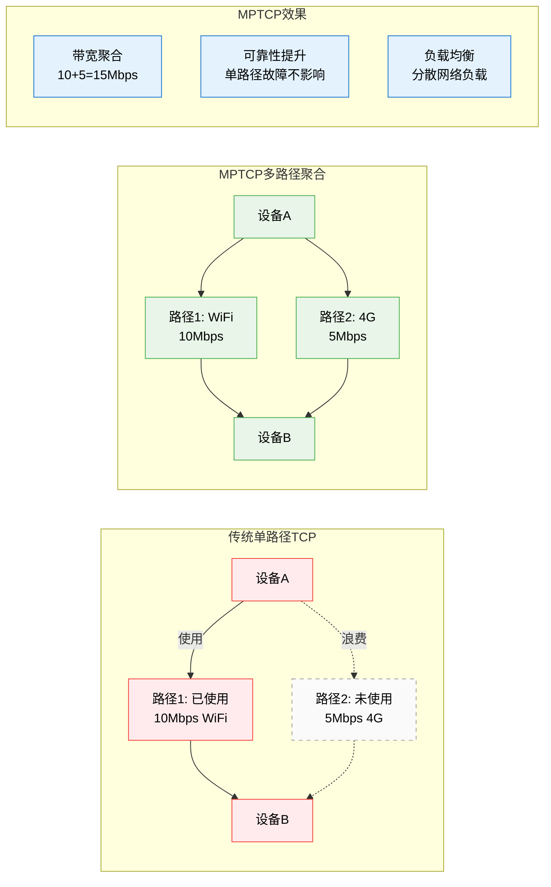
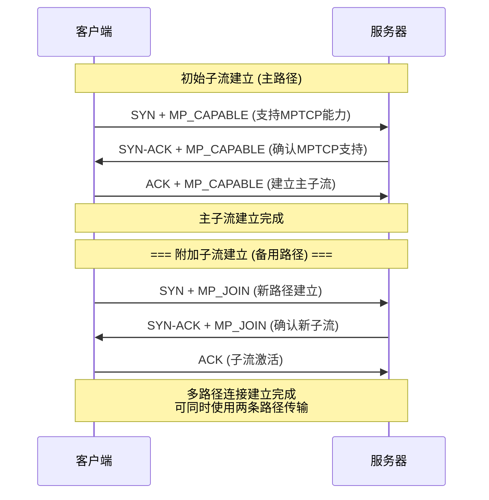
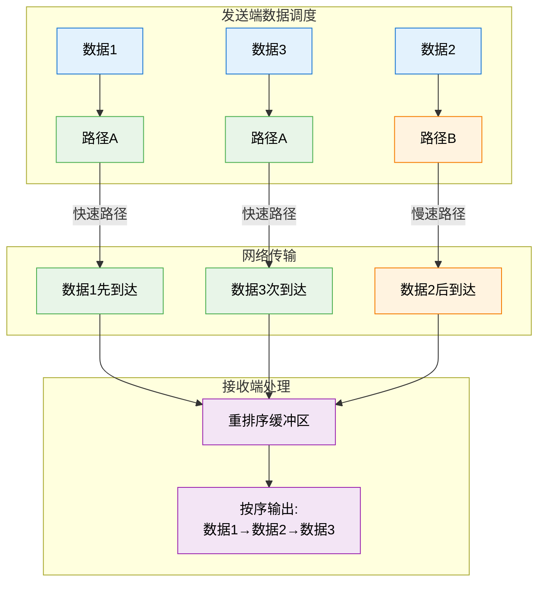
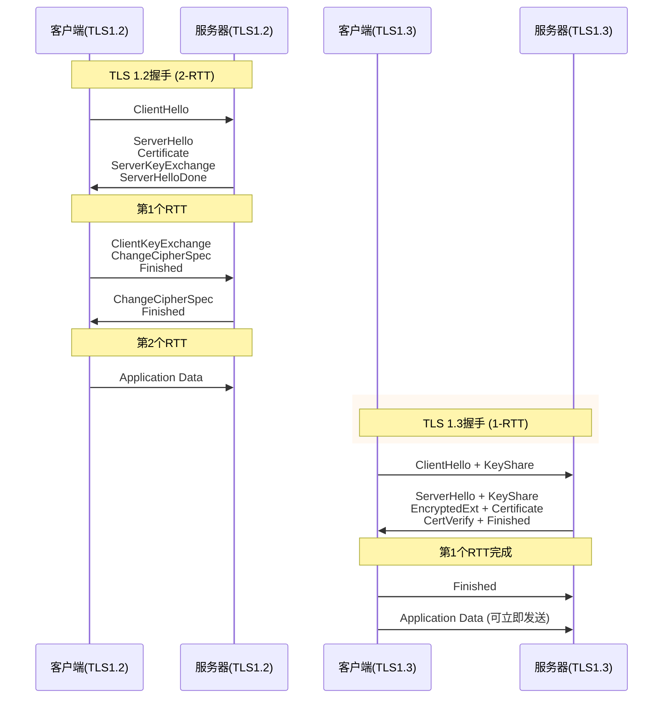
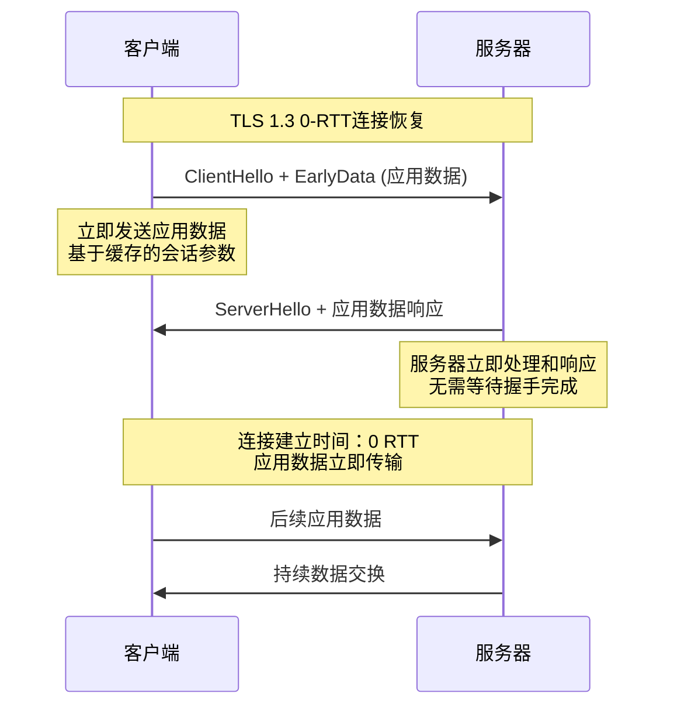
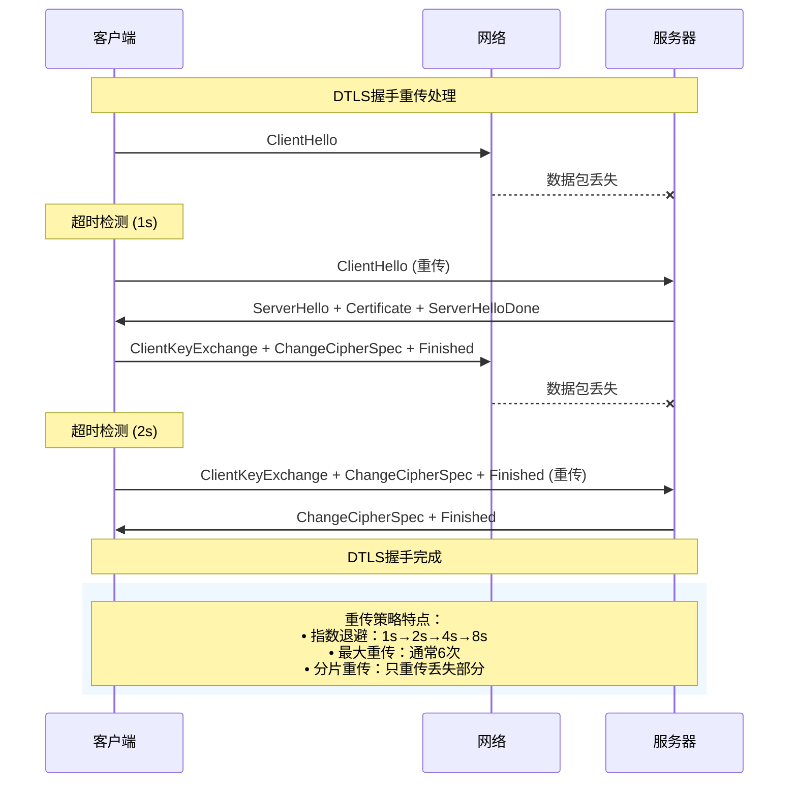

# 3.7 传输层：现代传输技术

## 目录

1. [传输协议演进概述](#传输协议演进概述)
2. [QUIC协议革新](#quic协议革新)
3. [多路径传输技术](#多路径传输技术)
4. [传输层安全演进](#传输层安全演进)
5. [新兴传输协议](#新兴传输协议)
6. [未来发展趋势](#未来发展趋势)

---

## 传输协议演进概述

### 传输协议发展的历史脉络

> **协议演进的驱动力**
> 
> 网络环境变化、应用需求升级、技术能力提升共同推动传输协议的持续演进

**传输协议发展的四个阶段**：

**传输协议演进时间线**：



**每代协议的特征对比**：

| 协议代次 | 时期 | 代表协议 | 核心特征 | 主要创新 | 适用场景 |
|----------|------|----------|----------|----------|----------|
| **第一代** | 1970s-1980s | TCP, UDP | 基础传输功能 | 可靠性保证 | 早期网络 |
| **第二代** | 1980s-1990s | TCP改进版 | 拥塞控制 | AIMD算法 | 互联网普及 |
| **第三代** | 1990s-2000s | SCTP, DCCP | 专门化设计 | 多流、部分可靠 | 特定应用 |
| **第四代** | 2000s-2010s | CUBIC, 快速重传 | 高速网络优化 | 高BDP适应 | 宽带时代 |
| **第五代** | 2010s-至今 | QUIC, MPTCP | 用户空间创新 | 0-RTT, 多路径 | 现代互联网 |
| **第六代** | 未来 | AI驱动协议 | 智能化自适应 | 机器学习 | 6G时代 |

### 现代传输协议的设计哲学

**设计原则的转变**：

1. **从内核到用户空间**：
   ```
   传统方式：应用 → 系统调用 → 内核TCP栈 → 网络
   现代方式：应用 → 用户空间协议栈 → 网络
   
   优势：
   • 快速迭代：无需内核更新
   • 定制优化：针对应用特化
   • 部署便利：软件升级即可
   ```

2. **从被动响应到主动控制**：
   - **传统TCP**：基于丢包的被动响应
   - **现代协议**：基于测量的主动控制
   - **未来趋势**：基于预测的智能决策

3. **从单一功能到集成服务**：
   - **分层设计** → **功能集成**
   - **协议分离** → **端到端优化**
   - **通用协议** → **应用特化**

**核心技术突破**：

| 技术维度 | 传统方法 | 现代创新 | 带来变革 |
|----------|----------|----------|----------|
| **连接建立** | 3-way握手 | 0-RTT连接 | 延迟降低50% |
| **多路复用** | 队头阻塞 | 流级复用 | 无阻塞传输 |
| **安全集成** | TLS叠加 | 内置加密 | 强制安全 |
| **路径利用** | 单路径 | 多路径聚合 | 带宽翻倍 |
| **拥塞控制** | 丢包驱动 | 模型驱动 | 性能提升30% |

---

## QUIC协议革新

### QUIC协议的设计理念

> **QUIC (Quick UDP Internet Connections)**
> 
> Google开发的基于UDP的现代传输协议，集成传输、安全、多路复用功能，代表传输协议的范式转变

**QUIC的革命性创新**：

1. **协议栈简化**：



2. **0-RTT连接建立**：
   
**QUIC连接建立过程对比**：



**QUIC多路复用的创新**：

**队头阻塞问题对比**：



### QUIC的核心技术特性

**连接迁移 (Connection Migration)**：

```
连接迁移场景：
WiFi环境 → 移动网络
IP: 192.168.1.100 → 10.0.0.50
端口: 12345 → 54321

传统TCP：
连接断开 → 重新建立 → 数据重传
中断时间：数秒

QUIC连接迁移：
连接ID不变 → 路径验证 → 继续传输
中断时间：<100ms
```

**核心优势分析**：

1. **性能优势**：
   - **连接延迟**：0-RTT vs TCP+TLS的2-3 RTT
   - **队头阻塞**：完全消除 vs HTTP/2的部分阻塞
   - **连接迁移**：毫秒级切换 vs 秒级重连

2. **部署优势**：
   - **用户空间**：快速更新部署
   - **UDP基础**：穿越NAT和防火墙
   - **向后兼容**：可降级到HTTP/1.1

3. **安全优势**：
   - **强制加密**：所有数据默认加密
   - **前向安全**：每个连接独立密钥
   - **连接认证**：防止连接劫持

### QUIC部署现状与挑战

**2024年全球部署状况**：

| 指标类别 | 数据 | 说明 |
|----------|------|------|
| **HTTP/3流量占比** | 30-40% | 全球Web流量中HTTP/3比例持续增长 |
| **主要网站采用** | Top 1000中70%+ | 包括Google、Facebook、Cloudflare等 |
| **CDN支持率** | 98%+ | Cloudflare、Akamai、AWS CloudFront全面支持 |
| **浏览器支持** | 100% | Chrome 85+、Firefox 88+、Safari 14+完全支持 |
| **企业采用** | 45%+ | 企业级应用开始大规模部署 |

**最新技术发展 (2024)**：

1. **HTTP/3优化特性**：
   - **多路径QUIC**：利用多个网络路径提高性能
   - **WebTransport API**：为Web应用提供更灵活的传输选择
   - **QUIC v2**：RFC 9369标准化，进一步优化性能

2. **性能监测改进**：
   - **qlog标准化**：RFC 9359提供统一的QUIC日志格式
   - **实时性能分析**：更精确的网络状况监测
   - **自适应算法**：基于机器学习的参数优化

**性能改进效果**：

| 应用场景 | 性能提升 | 主要原因 |
|----------|----------|----------|
| **移动网络** | 20-40% | 0-RTT连接+连接迁移 |
| **高延迟网络** | 30-50% | 首字节时间减少 |
| **不稳定网络** | 15-25% | 连接成功率提升 |
| **多媒体应用** | 40-60% | 启动时间减少 |

**面临的技术挑战**：

1. **网络基础设施适应**：
   - 企业防火墙对UDP流量的限制
   - 某些网络设备的兼容性问题
   - QoS策略需要更新

2. **协议优化空间**：
   - 拥塞控制算法持续改进
   - 多路径QUIC的标准化
   - 与5G/6G网络的深度集成

---

## 多路径传输技术

### MPTCP基本原理

> **MPTCP (Multipath TCP)**
> 
> 允许单个TCP连接同时使用多条网络路径，实现带宽聚合、路径冗余和负载均衡

**MPTCP的设计动机**：

**MPTCP多路径利用对比**：



**MPTCP连接建立过程**：



### MPTCP数据调度策略

**调度算法设计考虑**：

1. **路径特性感知**：
   ```
   路径评估矩阵：
   路径  │  带宽   │  RTT   │  丢包率  │  优先级
   ─────┼────────┼────────┼─────────┼────────
   WiFi │ 100Mbps│  10ms  │   0.1%  │   高
   4G   │  50Mbps│  30ms  │   0.5%  │   中
   5G   │ 200Mbps│   5ms  │   0.01% │   极高
   ```

2. **调度策略类型**：

   | 策略名称 | 原理 | 优势 | 缺点 | 适用场景 |
   |----------|------|------|------|----------|
   | **轮询调度** | 数据包轮流分配 | 简单公平 | 忽略路径差异 | 路径特性相似 |
   | **带宽比例** | 按带宽比例分配 | 充分利用带宽 | 可能导致乱序 | 大文件传输 |
   | **RTT感知** | 优先使用低延迟路径 | 减少重排序 | 可能浪费带宽 | 延迟敏感应用 |
   | **拥塞感知** | 避免拥塞路径 | 自适应优化 | 算法复杂 | 动态网络环境 |

**数据调度的数学模型**：

假设有n条路径，第i条路径的带宽为 $B_i$，RTT为 $R_i$，则最优数据分配比例：

$$\alpha_i = \frac{B_i / R_i}{\sum_{j=1}^{n} B_j / R_j}$$

这个公式平衡了带宽利用和延迟最小化的目标。

### 多路径传输的挑战与解决

**技术挑战**：

1. **接收端乱序处理**：



   **解决方案**：
   - **重排序缓冲区**：接收端维护重排序窗口
   - **序号空间分离**：每个子流独立序号
   - **选择性确认**：SACK机制处理乱序

2. **拥塞控制协调**：
   
   **问题**：多个子流如何协调避免网络拥塞？
   
   **解决方案 - 耦合拥塞控制**：
   ```
   传统方法：每个子流独立拥塞控制
   问题：可能对单路径TCP不公平
   
   MPTCP方法：LIA (Linked Increases Algorithm)
   原理：增长率与路径特性关联
   公式：cwnd_i += min(α/cwnd_total, 1/cwnd_i)
   效果：保证对单路径TCP的公平性
   ```

**MPTCP应用场景**：

| 应用领域 | 使用方式 | 主要收益 | 典型示例 |
|----------|----------|----------|----------|
| **移动设备** | WiFi+蜂窝并用 | 无缝切换+带宽聚合 | iPhone的多路径支持 |
| **数据中心** | 多网卡负载均衡 | 带宽聚合+容错 | 服务器间大数据传输 |
| **CDN网络** | 多源数据获取 | 加速下载+负载分散 | 多CDN节点并行下载 |
| **卫星通信** | 多卫星链路 | 提高可靠性+带宽 | 低轨卫星星座通信 |

---

## 传输层安全演进

### TLS协议的发展历程

**TLS版本演进与特性对比**：

| 版本 | 发布年份 | 主要特性 | 安全强度 | 握手RTT | 当前状态 |
|------|----------|----------|----------|---------|----------|
| **TLS 1.0** | 1999 | 基础加密功能 | 低 | 2-RTT | 已弃用 |
| **TLS 1.1** | 2006 | 改进CBC攻击防护 | 中 | 2-RTT | 已弃用 |
| **TLS 1.2** | 2008 | 强化密码套件 | 高 | 2-RTT | 广泛使用 |
| **TLS 1.3** | 2018 | 简化握手+前向安全 | 极高 | 1-RTT | 最新标准 |

### TLS 1.3的技术革新

**握手过程优化**：

**TLS握手过程优化对比**：



**0-RTT连接恢复**：

**TLS 1.3的0-RTT早期数据传输**：



**安全性改进**：

1. **强制前向安全**：
   - 移除RSA密钥交换
   - 仅支持完美前向安全(PFS)的密钥交换
   - 历史会话数据无法被解密

2. **简化密码套件**：
   ```
   TLS 1.2密码套件示例：
   TLS_ECDHE_RSA_WITH_AES_128_GCM_SHA256
   │    │     │    │     │   │   │
   │    │     │    │     │   │   └─ 哈希算法
   │    │     │    │     │   └───── 认证模式
   │    │     │    │     └────────── 加密算法
   │    │     │    └─────────────────── 加密密钥长度
   │    │     └───────────────────────── 身份认证
   │    └─────────────────────────────── 密钥交换
   └───────────────────────────────────── 协议版本
   
   TLS 1.3简化：
   TLS_AES_128_GCM_SHA256
   │   │   │   │   │
   │   │   │   │   └─ 哈希算法 (AEAD集成)
   │   │   │   └───── 认证模式 (AEAD集成)  
   │   │   └────────── 加密算法
   │   └───────────────── 密钥长度
   └────────────────────── 协议版本
   ```

### DTLS与UDP安全传输

> **DTLS (Datagram TLS)**
> 
> 为UDP数据报提供与TLS相同安全保证的协议变体，解决UDP传输的安全需求

**DTLS vs TLS关键差异**：

| 特性维度 | TLS | DTLS | 设计考虑 |
|----------|-----|------|----------|
| **传输基础** | TCP可靠流 | UDP不可靠报文 | 需要处理丢包和乱序 |
| **消息边界** | 流式传输 | 数据报边界 | 保持UDP的边界特性 |
| **重传机制** | TCP保证 | DTLS自实现 | 握手消息需要重传 |
| **序号处理** | 顺序保证 | 容忍乱序 | 接受一定范围的乱序 |
| **分片处理** | TCP自动 | DTLS处理 | 大握手消息需要分片 |

**DTLS握手重传机制**：



**DTLS应用场景**：

1. **VPN隧道**：
   - OpenVPN等VPN解决方案
   - IPSec的替代方案
   - 提供应用层安全隧道

2. **实时通信**：
   - WebRTC中的安全传输
   - SRTP密钥协商
   - 游戏数据加密

3. **物联网设备**：
   - CoAP over DTLS
   - 轻量级设备安全通信
   - 传感器数据保护

---


**[返回第3章目录](3.0 传输层.md)**
