# 3.7 传输层：现代传输技术

## 目录

1. [传输协议演进概述](#传输协议演进概述)
2. [QUIC协议革新](#quic协议革新)
3. [多路径传输技术](#多路径传输技术)
4. [传输层安全演进](#传输层安全演进)

> 拥塞控制算法（CUBIC、BBR 等）见 [3.6 TCP拥塞控制](3.6传输层：TCP拥塞控制.md)。

---

## 传输协议演进概述

### 传输协议发展的历史脉络

传输协议的演进由网络环境变化、应用需求升级和技术能力提升共同推动。

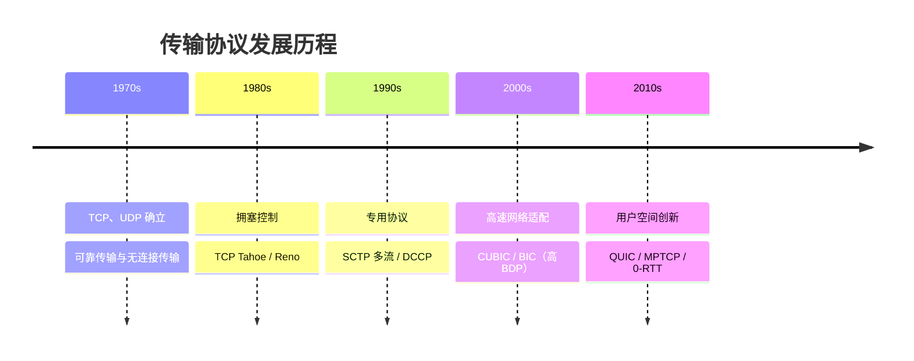
```mermaid
timeline
    title 传输协议发展历程
    1970s : TCP、UDP 确立
          : 可靠传输与无连接传输
    1980s : 拥塞控制
          : TCP Tahoe / Reno
    1990s : 专用协议
          : SCTP 多流 / DCCP
    2000s : 高速网络适配
          : CUBIC / BIC（高 BDP）
    2010s : 用户空间创新
          : QUIC / MPTCP / 0-RTT
```

**各阶段协议对比**：

| 时期 | 代表协议 | 核心特征 | 主要创新 |
|------|----------|----------|----------|
| 1970s | TCP、UDP | 基础传输功能 | 可靠传输 / 无连接 |
| 1980s | TCP Tahoe/Reno | 拥塞控制 | AIMD |
| 1990s | SCTP、DCCP | 专门化设计 | 多流、部分可靠 |
| 2000s | CUBIC、BIC | 高速网络优化 | 高 BDP 适应 |
| 2010s 至今 | QUIC、MPTCP | 用户空间实现 | 0-RTT、多路径 |

### 现代传输协议的设计哲学

**设计原则的转变**：

1. **从内核到用户空间**：

   ```
   传统：应用 → 系统调用 → 内核 TCP 栈 → 网络
   现代：应用 → 用户空间协议栈（如 QUIC）→ UDP → 网络
   ```

   在用户空间实现协议，可随应用一起升级，无需等待操作系统内核更新，迭代更快。

2. **从被动响应到主动测量**：传统 TCP 以丢包作为拥塞信号被动收缩；BBR 等现代算法主动测量瓶颈带宽与 RTT，按网络模型控制发送。

3. **从分层叠加到功能集成**：传统将传输（TCP）、安全（TLS）、多路复用（HTTP/2）分层叠加；QUIC 将三者集成于一层，减少握手往返与协议头开销。

**传统方法与现代创新对比**：

| 技术维度 | 传统方法 | 现代创新 |
|----------|----------|----------|
| 连接建立 | TCP 三次握手 + TLS 握手 | 1-RTT / 0-RTT |
| 多路复用 | TCP 字节流（队头阻塞） | 流级独立传输 |
| 安全 | TLS 叠加（可选） | 内置加密（强制） |
| 路径利用 | 单路径 | 多路径聚合 |
| 拥塞控制 | 丢包驱动 | 测量/模型驱动 |

---

## QUIC协议革新

### QUIC协议的设计理念

> **QUIC (Quick UDP Internet Connections)**
> 
> Google 提出、后由 IETF 标准化（RFC 9000）的传输协议。它运行在 UDP 之上，将可靠传输、拥塞控制、加密（TLS 1.3）和多路复用集成在一层，是 HTTP/3 的底层传输。

QUIC 的关键设计有四点：协议栈集成、连接建立加速、流级多路复用、连接迁移。

**协议栈对比**：HTTP/2 over TCP 需 TCP 与 TLS 两次独立握手；QUIC 将 TLS 1.3 直接内嵌，握手与传输层连接合一。

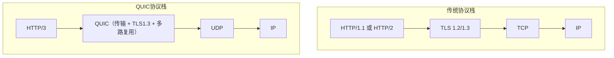
```mermaid
graph TD
    subgraph 传统协议栈
        A1[HTTP/1.1 或 HTTP/2]
        A2[TLS 1.2/1.3]
        A3[TCP]
        A4[IP]
        A1 --> A2 --> A3 --> A4
    end

    subgraph QUIC协议栈
        B1[HTTP/3]
        B2["QUIC（传输 + TLS1.3 + 多路复用）"]
        B3[UDP]
        B4[IP]
        B1 --> B2 --> B3 --> B4
    end
```

注：层数并未减少（HTTP/3 over QUIC over UDP over IP 仍是四层），变化在于 QUIC 把原本分属 TLS 与 TCP 的功能合并，从而把"TCP 握手 + TLS 握手"两次往返压缩为一次。

**连接建立过程对比**：

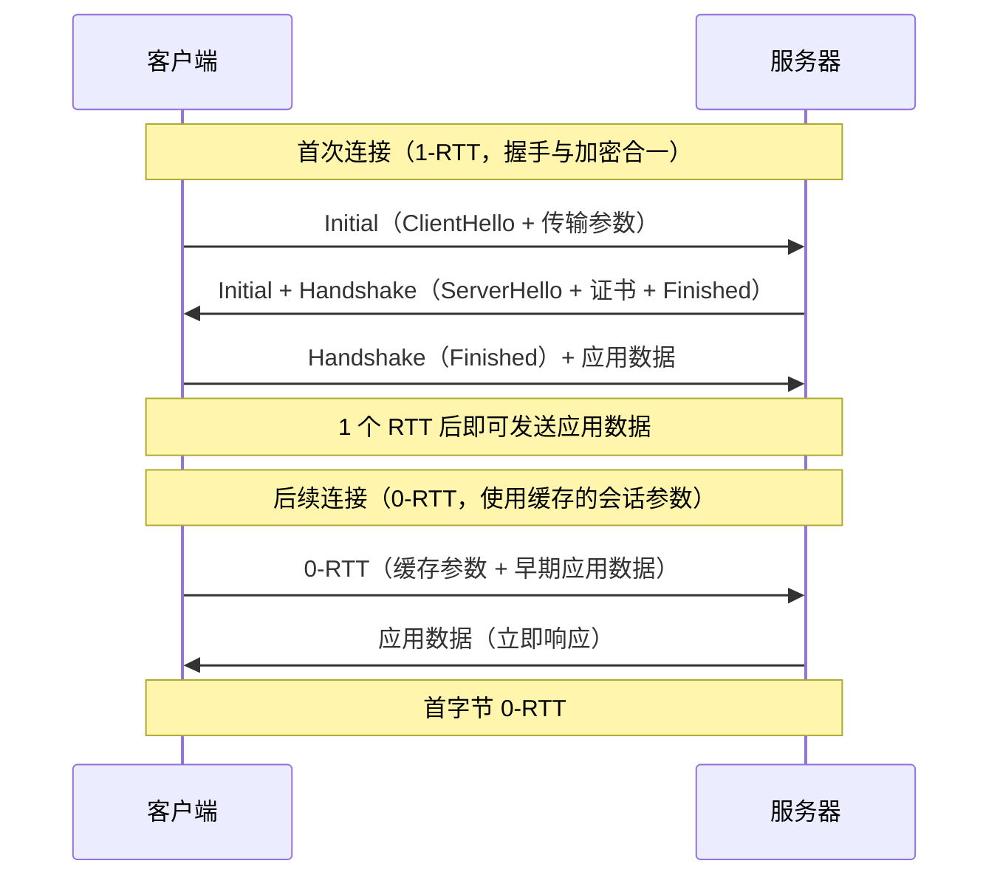
```mermaid
sequenceDiagram
    participant C as 客户端
    participant S as 服务器

    Note over C,S: 首次连接（1-RTT，握手与加密合一）
    C->>S: Initial（ClientHello + 传输参数）
    S->>C: Initial + Handshake（ServerHello + 证书 + Finished）
    C->>S: Handshake（Finished）+ 应用数据
    Note over C,S: 1 个 RTT 后即可发送应用数据

    Note over C,S: 后续连接（0-RTT，使用缓存的会话参数）
    C->>S: 0-RTT（缓存参数 + 早期应用数据）
    S->>C: 应用数据（立即响应）
    Note over C,S: 首字节 0-RTT
```

注：0-RTT 早期数据复用上一次连接缓存的密钥，无法抵御重放攻击，因此只应用于幂等请求（如 GET）。

**流级多路复用与队头阻塞**

HTTP/2 把多个流复用到单条 TCP 字节流上。TCP 按字节序交付，一旦某个分段丢失，其后所有已到达的字节（含其他流的数据）都被阻塞等待重传——这是 TCP 层的队头阻塞。

QUIC 在传输层内维护多个相互独立的流，每个流有独立的序号与重传。某个流丢包只阻塞该流，其余流照常交付。

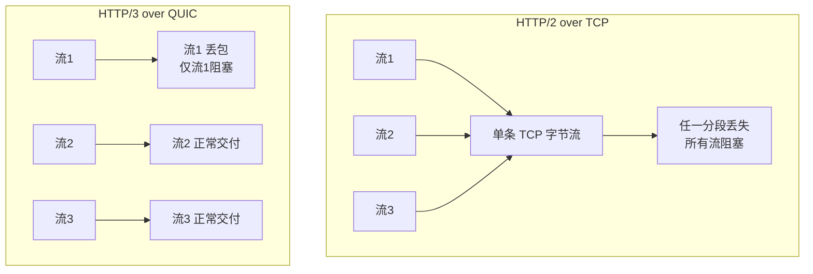
```mermaid
graph TD
    subgraph HTTP2_over_TCP[HTTP/2 over TCP]
        A1[流1] --> AT[单条 TCP 字节流]
        A2[流2] --> AT
        A3[流3] --> AT
        AT --> AX[任一分段丢失<br/>所有流阻塞]
    end

    subgraph HTTP3_over_QUIC[HTTP/3 over QUIC]
        B1[流1] --> BX[流1 丢包<br/>仅流1阻塞]
        B2[流2] --> BY[流2 正常交付]
        B3[流3] --> BZ[流3 正常交付]
    end
```

注：QUIC 消除的是 TCP 传输层队头阻塞；HTTP/2 中 HPACK 头部压缩引起的应用层队头阻塞，则由 HTTP/3 的 QPACK 解决。

### QUIC的核心技术特性

**连接迁移 (Connection Migration)**

TCP 连接由四元组（源 IP、源端口、目的 IP、目的端口）标识。客户端从 WiFi 切到蜂窝网络时 IP 改变，四元组失效，连接断开需重建。

QUIC 用独立的**连接 ID（Connection ID）**标识连接，与 IP/端口解耦。地址变化后，客户端用同一连接 ID 在新路径上发包，服务器经路径验证后继续传输，无需重新握手。

```
WiFi → 蜂窝：IP 由 192.168.1.100 变为 10.0.0.50

TCP：四元组失效 → 连接断开 → 重新握手 → 重传
QUIC：连接 ID 不变 → 新路径上路径验证 → 继续传输
```

**核心优势小结**：

| 维度 | QUIC | 对比 TCP + TLS |
|------|------|----------------|
| 连接建立 | 1-RTT，恢复时 0-RTT | TCP 握手 + TLS 握手，2~3 RTT |
| 队头阻塞 | 流级独立，仅消除传输层阻塞 | TCP 字节流，单点丢包阻塞全部 |
| 连接迁移 | 连接 ID 不变，无需重连 | 四元组变化即断开 |
| 部署 | 用户空间实现，随应用升级 | 内核 TCP 栈，依赖系统更新 |
| 安全 | 强制加密（内置 TLS 1.3） | TLS 可选叠加 |

### QUIC的拥塞控制

QUIC 不绑定特定拥塞控制算法。RFC 9002 给出一个类 NewReno 的默认算法，实现中也常用 CUBIC 或 BBR。由于在用户空间实现，更换或调优算法无需改动内核，这是相对内核 TCP 的一项优势。

```
QUIC 拥塞控制接口
        │
        ├─ 默认（RFC 9002，类 NewReno）
        ├─ CUBIC（丢包驱动）
        └─ BBR（带宽/RTT 测量驱动）
```

> CUBIC 与 BBR 的原理见 [3.6 TCP拥塞控制](3.6传输层：TCP拥塞控制.md)。BBR 不以丢包而以瓶颈带宽和最小 RTT 作为控制信号，在高丢包链路上通常优于 CUBIC。

### 部署现状与挑战

QUIC 已成为主流 Web 传输：主流浏览器（Chrome、Firefox、Safari 较新版本）和大型 CDN（Cloudflare、Akamai、AWS 等）均已支持 HTTP/3，Google、Meta 等大型站点广泛部署。

相关进展：

- **QUIC v2**（RFC 9369）：缓解协议僵化（防止中间设备依赖固定字段）。
- **Multipath QUIC**：在 QUIC 上实现多路径，正在 IETF 标准化中。
- **qlog / qvis**：标准化的 QUIC 日志格式与可视化工具，便于调试与分析。

主要挑战：

- 部分企业防火墙限制或屏蔽 UDP，使 QUIC 难以建连，此时需回退到 TCP。
- QUIC 大量加密、在用户空间收发包，CPU 开销高于内核 TCP；高吞吐场景下需依赖 UDP 分段卸载等优化。
- 中间设备难以观测加密的传输层信息，给运维和故障定位带来困难。

---

## 多路径传输技术

### MPTCP基本原理

> **MPTCP (Multipath TCP)**
> 
> 让单个 TCP 连接同时使用多条网络路径（如手机的 WiFi 与蜂窝），实现带宽聚合、路径冗余和负载均衡。对应用透明：上层仍是一个标准 TCP socket。

**设计动机**：手机常同时具备 WiFi 与蜂窝两条链路，但传统 TCP 一条连接只走一条路径，另一条闲置。MPTCP 把一个连接拆成多个子流（subflow），分别走不同路径并行传输。

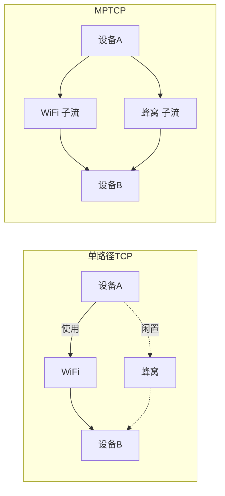
```mermaid
graph LR
    subgraph 单路径TCP
        A1[设备A] -->|使用| A3[WiFi]
        A3 --> A2[设备B]
        A1 -.->|闲置| A4[蜂窝] -.-> A2
    end

    subgraph MPTCP
        B1[设备A] --> B3[WiFi 子流]
        B1 --> B4[蜂窝 子流]
        B3 --> B2[设备B]
        B4 --> B2
    end
```

效果：带宽可聚合（两条路径之和）；一条路径故障时另一条继续传输，提升可靠性；流量可在路径间均衡。

**连接建立过程**：

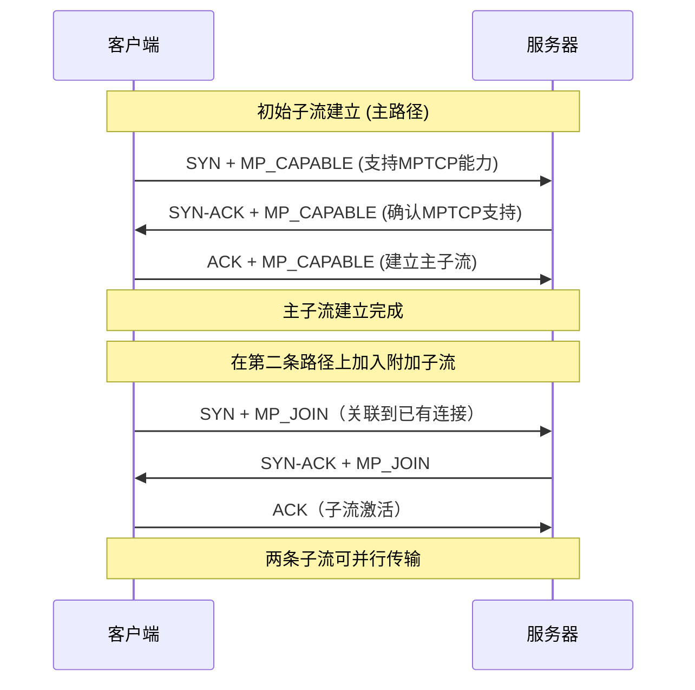
```mermaid
sequenceDiagram
    participant C as 客户端
    participant S as 服务器
    
    Note over C,S: 初始子流建立 (主路径)
    
    C->>S: SYN + MP_CAPABLE (支持MPTCP能力)
    S->>C: SYN-ACK + MP_CAPABLE (确认MPTCP支持)
    C->>S: ACK + MP_CAPABLE (建立主子流)
    
    Note over C,S: 主子流建立完成

    Note over C,S: 在第二条路径上加入附加子流
    C->>S: SYN + MP_JOIN（关联到已有连接）
    S->>C: SYN-ACK + MP_JOIN
    C->>S: ACK（子流激活）

    Note over C,S: 两条子流可并行传输
```

### MPTCP数据调度策略

**调度算法设计考虑**：

1. **路径特性感知**：
   ```
   路径评估矩阵：
   路径  │  带宽   │  RTT   │  丢包率  │  优先级
   ─────┼────────┼────────┼─────────┼────────
   WiFi │ 100Mbps│  10ms  │   0.1%  │   高
   4G   │  50Mbps│  30ms  │   0.5%  │   中
   5G   │ 200Mbps│   5ms  │   0.01% │   极高
   ```

2. **调度策略类型**：

   | 策略名称 | 原理 | 优势 | 缺点 | 适用场景 |
   |----------|------|------|------|----------|
   | **轮询调度** | 数据包轮流分配 | 简单公平 | 忽略路径差异 | 路径特性相似 |
   | **带宽比例** | 按带宽比例分配 | 充分利用带宽 | 可能导致乱序 | 大文件传输 |
   | **RTT感知** | 优先使用低延迟路径 | 减少重排序 | 可能浪费带宽 | 延迟敏感应用 |
   | **拥塞感知** | 避免拥塞路径 | 自适应优化 | 算法复杂 | 动态网络环境 |

**数据调度的简单模型**：设有 $n$ 条路径，第 $i$ 条带宽为 $B_i$、RTT 为 $R_i$，按"带宽除以 RTT"加权分配，可同时兼顾带宽利用与延迟：

$$\alpha_i = \frac{B_i / R_i}{\sum_{j=1}^{n} B_j / R_j}$$

实际调度器（如 minRTT、BLEST）还需考虑乱序、缓冲区占用等因素。

### 多路径传输的挑战与解决

**技术挑战**：

1. **接收端乱序**：不同路径 RTT 不同，数据到达次序被打乱，接收端需缓存并重排序。

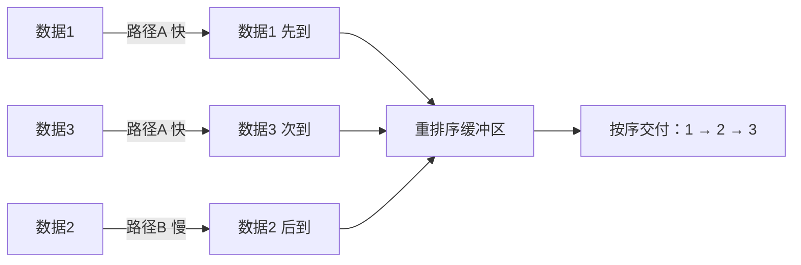
```mermaid
graph LR
    S1[数据1] -->|路径A 快| R1[数据1 先到]
    S3[数据3] -->|路径A 快| R3[数据3 次到]
    S2[数据2] -->|路径B 慢| R2[数据2 后到]

    R1 --> B[重排序缓冲区]
    R3 --> B
    R2 --> B
    B --> O[按序交付：1 → 2 → 3]
```

   关键机制：每个子流维护独立的子流序号用于路径内重传，另用连接级数据序号保证整体按序交付；接收端通过重排序缓冲区与 SACK 处理乱序。

2. **拥塞控制的公平性**：若每个子流各自独立做拥塞控制，多条子流并行就会在共享瓶颈处抢占比单路径 TCP 更多的带宽，对后者不公平。

   MPTCP 采用**耦合拥塞控制**，典型算法是 LIA（Linked Increases Algorithm）：把各子流的窗口增长关联起来，每收到一个 ACK，子流 $i$ 的窗口增量为

   $$\Delta\,cwnd_i = \min\left(\frac{\alpha}{cwnd_{total}},\ \frac{1}{cwnd_i}\right)$$

   其中 $cwnd_{total}$ 为所有子流窗口之和，$\alpha$ 为耦合系数。这样多子流在共享瓶颈上获得的总带宽不超过一条单路径 TCP，保证公平性。

**MPTCP应用场景**：

| 应用领域 | 使用方式 | 主要收益 |
|----------|----------|----------|
| 移动设备 | WiFi + 蜂窝并用 | 切换无缝、带宽聚合（如 Apple 在 Siri、Maps 等服务中使用 MPTCP） |
| 数据中心 | 多网卡负载均衡 | 带宽聚合、容错 |
| 接入冗余 | 多 ISP 链路 | 可靠性提升、负载分散 |

---

## 传输层安全演进

### TLS协议的发展历程

**TLS版本演进与特性对比**：

| 版本 | 发布年份 | 主要特性 | 安全强度 | 握手RTT | 当前状态 |
|------|----------|----------|----------|---------|----------|
| **TLS 1.0** | 1999 | 基础加密功能 | 低 | 2-RTT | 已弃用 |
| **TLS 1.1** | 2006 | 改进CBC攻击防护 | 中 | 2-RTT | 已弃用 |
| **TLS 1.2** | 2008 | 强化密码套件 | 高 | 2-RTT | 广泛使用 |
| **TLS 1.3** | 2018 | 简化握手+前向安全 | 极高 | 1-RTT | 最新标准 |

### TLS 1.3的技术革新

**握手过程优化**：TLS 1.2 需两个 RTT 才能发送应用数据；TLS 1.3 将密钥交换参数（KeyShare）提前到 ClientHello，握手压缩为一个 RTT。

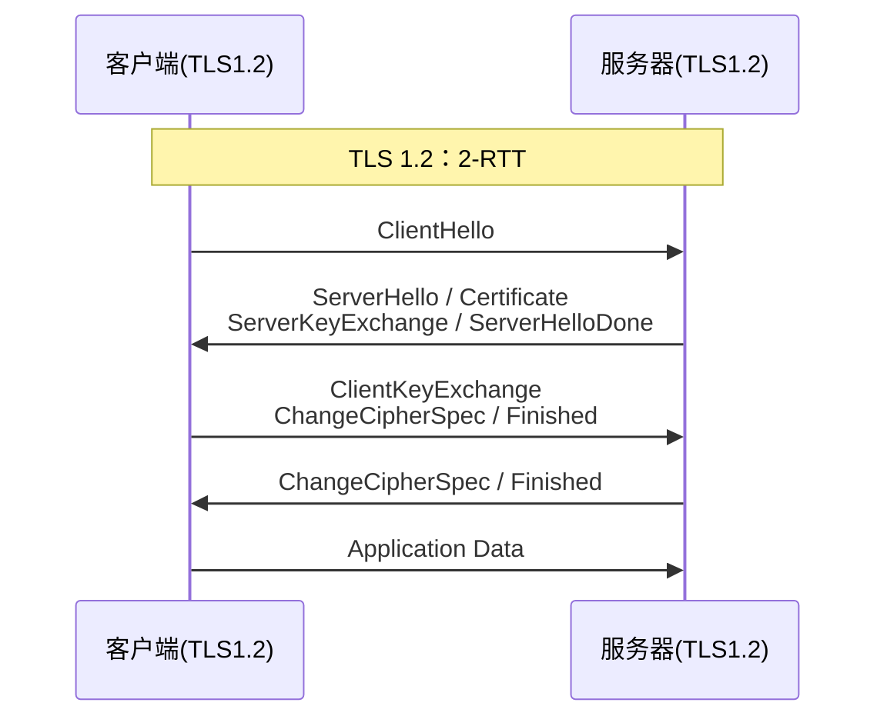
```mermaid
sequenceDiagram
    participant C1 as 客户端(TLS1.2)
    participant S1 as 服务器(TLS1.2)

    Note over C1,S1: TLS 1.2：2-RTT
    C1->>S1: ClientHello
    S1->>C1: ServerHello / Certificate<br/>ServerKeyExchange / ServerHelloDone
    C1->>S1: ClientKeyExchange<br/>ChangeCipherSpec / Finished
    S1->>C1: ChangeCipherSpec / Finished
    C1->>S1: Application Data
```

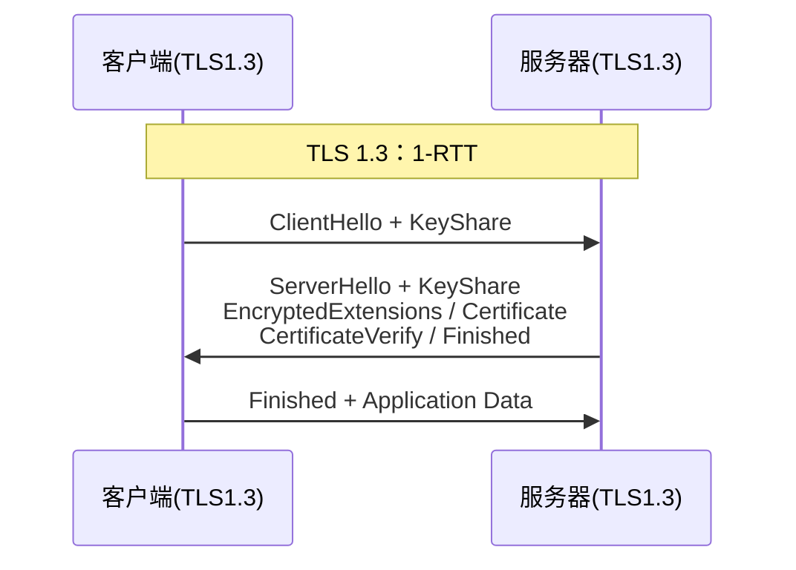
```mermaid
sequenceDiagram
    participant C2 as 客户端(TLS1.3)
    participant S2 as 服务器(TLS1.3)

    Note over C2,S2: TLS 1.3：1-RTT
    C2->>S2: ClientHello + KeyShare
    S2->>C2: ServerHello + KeyShare<br/>EncryptedExtensions / Certificate<br/>CertificateVerify / Finished
    C2->>S2: Finished + Application Data
```

**0-RTT 连接恢复**：客户端基于上次连接缓存的会话密钥，在 ClientHello 中直接携带早期数据（Early Data），首字节即可发送。

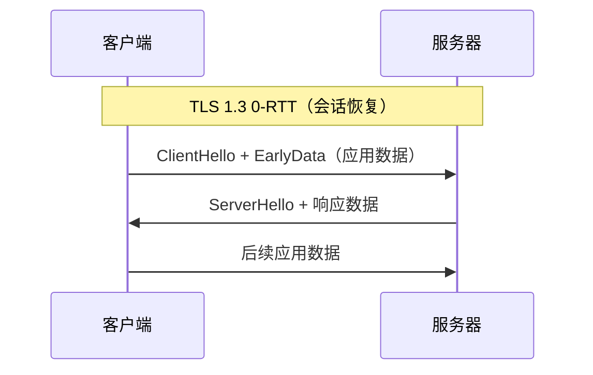
```mermaid
sequenceDiagram
    participant C as 客户端
    participant S as 服务器

    Note over C,S: TLS 1.3 0-RTT（会话恢复）
    C->>S: ClientHello + EarlyData（应用数据）
    S->>C: ServerHello + 响应数据
    C->>S: 后续应用数据
```

注：与 QUIC 0-RTT 同理，TLS 1.3 早期数据可被重放，仅适用于幂等请求。

**安全性改进**：

1. **强制前向安全**：
   - 移除RSA密钥交换
   - 仅支持完美前向安全(PFS)的密钥交换
   - 历史会话数据无法被解密

2. **简化密码套件**：
   ```
   TLS 1.2密码套件示例：
   TLS_ECDHE_RSA_WITH_AES_128_GCM_SHA256
   │    │     │    │     │   │   │
   │    │     │    │     │   │   └─ 哈希算法
   │    │     │    │     │   └───── 认证模式
   │    │     │    │     └────────── 加密算法
   │    │     │    └─────────────────── 加密密钥长度
   │    │     └───────────────────────── 身份认证
   │    └─────────────────────────────── 密钥交换
   └───────────────────────────────────── 协议版本
   
   TLS 1.3简化：
   TLS_AES_128_GCM_SHA256
   │   │   │   │   │
   │   │   │   │   └─ 哈希算法 (AEAD集成)
   │   │   │   └───── 认证模式 (AEAD集成)  
   │   │   └────────── 加密算法
   │   └───────────────── 密钥长度
   └────────────────────── 协议版本
   ```

### DTLS与UDP安全传输

> **DTLS (Datagram TLS)**
> 
> 为UDP数据报提供与TLS相同安全保证的协议变体，解决UDP传输的安全需求

**DTLS vs TLS关键差异**：

| 特性维度 | TLS | DTLS | 设计考虑 |
|----------|-----|------|----------|
| **传输基础** | TCP可靠流 | UDP不可靠报文 | 需要处理丢包和乱序 |
| **消息边界** | 流式传输 | 数据报边界 | 保持UDP的边界特性 |
| **重传机制** | TCP保证 | DTLS自实现 | 握手消息需要重传 |
| **序号处理** | 顺序保证 | 容忍乱序 | 接受一定范围的乱序 |
| **分片处理** | TCP自动 | DTLS处理 | 大握手消息需要分片 |

**DTLS握手重传机制**：

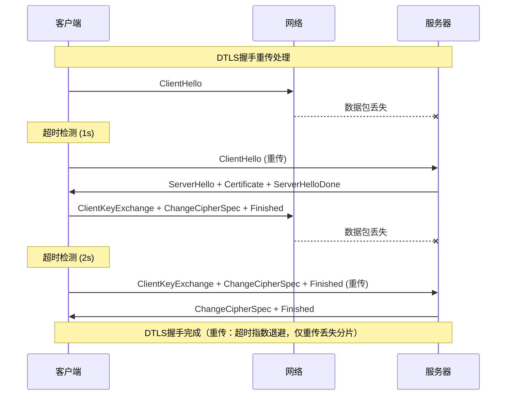
```mermaid
sequenceDiagram
    participant C as 客户端
    participant N as 网络
    participant S as 服务器
    
    Note over C,S: DTLS握手重传处理
    
    C->>N: ClientHello
    N--xS: 数据包丢失
    Note over C: 超时检测 (1s)
    
    C->>S: ClientHello (重传)
    S->>C: ServerHello + Certificate + ServerHelloDone
    
    C->>N: ClientKeyExchange + ChangeCipherSpec + Finished
    N--xS: 数据包丢失
    Note over C: 超时检测 (2s)
    
    C->>S: ClientKeyExchange + ChangeCipherSpec + Finished (重传)
    S->>C: ChangeCipherSpec + Finished

    Note over C,S: DTLS握手完成（重传：超时指数退避，仅重传丢失分片）
```

由于 UDP 不保证可靠传输，DTLS 自行处理握手消息的重传与分片：发送方为握手消息设超时定时器，丢失则重传，超时按指数退避增长，大消息分片后只重传丢失的分片。

**DTLS应用场景**：

- **VPN**：OpenVPN 等基于 DTLS 建立安全隧道。
- **实时通信**：WebRTC 用 DTLS 握手协商 SRTP 的媒体加密密钥（DTLS-SRTP）。
- **物联网**：CoAP over DTLS 为受限设备提供轻量级安全通信。

---

**[上一节：3.6 TCP拥塞控制](3.6传输层：TCP拥塞控制.md)** ｜ **[下一章：4.0 网络层：数据平面](4.0 网络层：数据平面.md)**
 