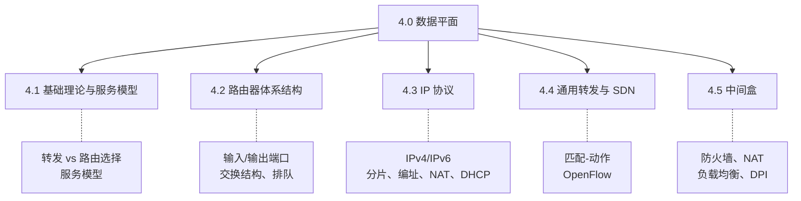

# 4.0 网络层：数据平面

> 传输层把"进程到进程"理清后，往下就靠网络层把分组真正从源主机送到目的主机。网络层的工作分成两半：**数据平面**决定单台路由器如何把到达的分组转发出去，**控制平面**决定全网的转发表怎么算出来。本章只讲数据平面——路由器内部的转发动作和 IP 协议；控制平面（路由算法、路由协议）放到第 5 章。

## 数据平面 vs 控制平面

网络层的核心功能是把分组从一台路由器送往下一台，这件事被拆成两个层面：

| | 数据平面（本章） | 控制平面（第 5 章） |
|---|---|---|
| 职责 | 转发：分组到达输入端口后，查表决定从哪个输出端口送出 | 路由选择：算出端到端路径，生成转发表 |
| 作用范围 | 单台路由器内部、局部动作 | 全网范围、整体视角 |
| 时间尺度 | 纳秒级，逐分组处理 | 毫秒到秒级，路由变化时更新 |
| 实现 | 路由器硬件（转发表 + 交换结构） | 路由算法，可在路由器内（传统）或集中控制器中（SDN） |

> 易混：转发（forwarding）vs 路由选择（routing）。转发是"分组进来了往哪个口送"，是数据平面的局部动作；路由选择是"先算好整条路径"，是控制平面的全局计算。转发表是两者的接口——控制平面写入，数据平面查询。

```
        控制平面：算出转发表（第 5 章）
                    │ 下发
                    ▼
   ┌─────────────────────────────────┐
   │            路由器                │
   │   输入端口 → 交换结构 → 输出端口   │   数据平面：查表转发（本章）
   └─────────────────────────────────┘
       ↑分组进                  分组出↓
```

## 本章脉络

本章先讲网络层提供什么服务、路由器长什么样，再深入 IP 这一核心协议，最后看转发如何走向"匹配-动作"的通用模型与 SDN：



> 阅读顺序：4.1 先弄清网络层提供什么服务、转发与路由选择的分工；4.2 看转发动作落在路由器的哪个部件上；4.3 是本章主体，IP 协议（编址、分片、IPv6、NAT、DHCP）；4.4 把"目的地址查表"推广成通用的"匹配-动作"，引出 SDN 数据平面；4.5 看网络中那些不止做转发的设备（中间盒）。

## 章节目录

- **[4.1 网络层：基础理论与服务模型](4.1网络层：基础理论与服务模型.md)**
  - 网络层概述与功能
  - 转发与路由选择的区别
  - 网络服务模型

- **[4.2 网络层：路由器体系结构](4.2网络层：路由器体系结构.md)**
  - 路由器硬件架构
  - 输入/输出端口处理
  - 交换结构与排队机制
  - 分组调度算法

- **[4.3 网络层：IP协议详解](4.3网络层：IP协议详解.md)**
  - IPv4 数据报格式、分片与编址
  - DHCP 动态地址配置
  - NAT 网络地址转换
  - IPv6 协议与地址体系
  - IPv4 到 IPv6 的过渡

- **[4.4 网络层：通用转发与SDN](4.4网络层：通用转发与SDN.md)**
  - 匹配-动作转发机制
  - OpenFlow 数据平面操作
  - 软件定义网络数据平面

- **[4.5 网络层：中间盒技术](4.5网络层：中间盒技术.md)**
  - 防火墙与包过滤
  - 负载均衡器
  - 深度包检测（DPI）

补充阅读（书外延伸）：

- **[4.6 网络层：IPsec与VPN](4.6网络层：IPsec与VPN.md)** —— 网络层安全协议 IPsec 及基于它的 VPN，密码学原理见 [2.8 密码学基础](2.8应用层：密码学基础.md)。

---

**开始学习：[4.1 网络层：基础理论与服务模型](4.1网络层：基础理论与服务模型.md)**
