# 4.2 网络层：路由器体系结构

## 本章目录

1. [路由器工作原理概述](#路由器工作原理概述)
2. [路由器硬件架构](#路由器硬件架构)
3. [输入端口处理](#输入端口处理)
4. [交换结构](#交换结构)
5. [输出端口处理](#输出端口处理)
6. [排队理论与分组调度](#排队理论与分组调度)

---

## 路由器工作原理概述

### 路由器的基本功能

> **路由器 (Router)**
> 
> 网络层设备，负责根据目标IP地址将分组从输入端口转发到正确的输出端口，是Internet的核心转发设备。

#### 路由器vs交换机区别

**功能对比**：

| 特征 | 路由器 | 交换机 |
|------|--------|--------|
| 工作层次 | 网络层(L3) | 数据链路层(L2) |
| 转发依据 | IP地址 | MAC地址 |
| 转发表 | 路由表 | MAC地址表 |
| 分组处理 | 需要处理IP头部 | 透明转发 |
| 网络范围 | 跨网络 | 单一网络 |
| 广播处理 | 不转发广播 | 泛洪广播 |
| 复杂度 | 高 | 较低 |

#### 路由器功能分离

**数据平面 vs 控制平面**：

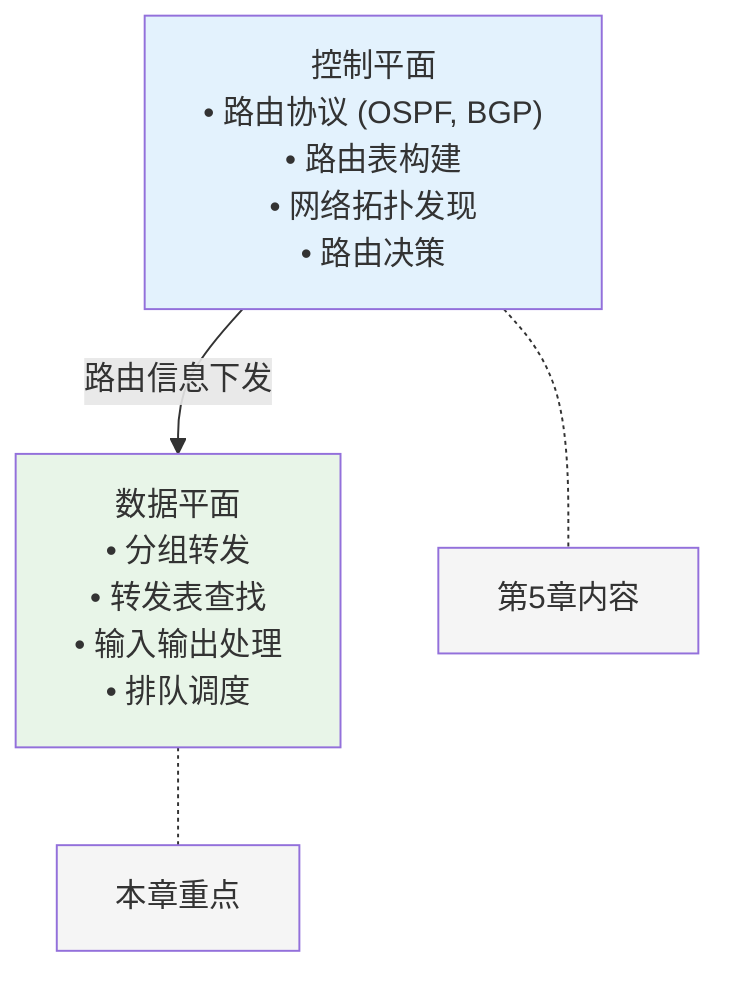

**时间尺度差异**：
- **控制平面**：秒级、分钟级（路由收敛）
- **数据平面**：纳秒级、微秒级（分组转发）

---

## 路由器硬件架构

### 通用路由器架构

#### 基本组件构成

**路由器内部结构**：

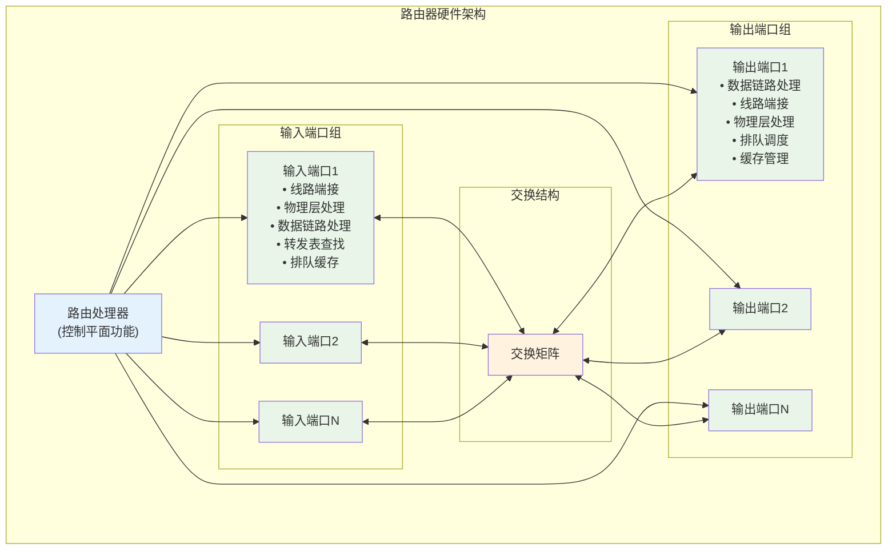

**关键特性**：
- **分布式处理**：每个端口独立处理
- **并行转发**：多个分组同时处理  
- **硬件加速**：ASIC/TCAM实现高速查找
- **缓存管理**：输入/输出端口排队

#### 路由器性能指标

**关键性能参数**：

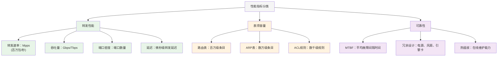

**典型设备规格 (2024年)**：
- **企业级路由器**：1-10 Gbps
- **运营商边缘路由器**：100 Gbps-1 Tbps  
- **核心路由器**：10-100 Tbps
- **数据中心交换机**：25.6-51.2 Tbps

---

## 输入端口处理

### 输入端口功能架构

#### 多层处理流程

**输入端口处理过程**：

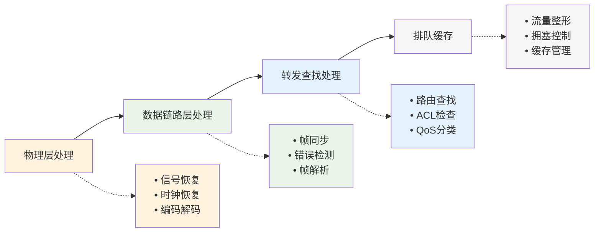

#### 转发表查找算法

**高速查找技术**：

```
转发表查找方法演进：
1. 线性查找 O(N)：
   for (每条路由表项):
       if (目标IP匹配前缀):
           return 下一跳
   
   问题：速度慢，不适用于大型路由表

2. 二分查找 O(log N)：
   对路由表按前缀长度排序
   使用二分查找算法
   
   问题：最长前缀匹配复杂

3. 前缀树 (Trie)：
   每个节点代表一位
   路径代表IP前缀
   叶子节点存储下一跳信息
   
   优点：支持最长前缀匹配
   缺点：内存使用量大

4. 内容可寻址存储器 (CAM/TCAM)：
   硬件并行查找
   纳秒级查找速度
   支持通配符匹配
   
   应用：现代高速路由器主流方案

TCAM查找示例：
目标IP: 192.168.1.100 (11000000.10101000.00000001.01100100)

TCAM表项：
192.168.0.0/16  → Port 1  (匹配16位)
192.168.1.0/24  → Port 2  (匹配24位) ← 最长匹配
0.0.0.0/0       → Port 3  (默认路由)

结果：选择Port 2 (最长前缀匹配)
```

#### 访问控制列表 (ACL)

**分组过滤处理**：

```
ACL处理流程：
分组到达 → 五元组提取 → ACL规则匹配 → 动作执行
           (src IP,      (并行匹配)   (允许/拒绝/
            dst IP,      (优先级排序)  标记/限速)
            src Port,
            dst Port,
            Protocol)

ACL规则示例：
规则1: permit ip 192.168.1.0/24 any eq 80
规则2: deny ip 10.0.0.0/8 any
规则3: permit ip any any

匹配过程：
1. 检查源IP是否为192.168.1.0/24且目标端口80
2. 检查源IP是否为10.0.0.0/8 (拒绝)
3. 默认允许其他流量

性能考虑：
• 规则数量：影响查找速度
• 规则顺序：按优先级排列
• 硬件加速：使用TCAM并行匹配
```

---

## 交换结构

### 交换结构类型

#### 三种主要架构

**交换结构对比**：

#### 1. 基于内存的交换

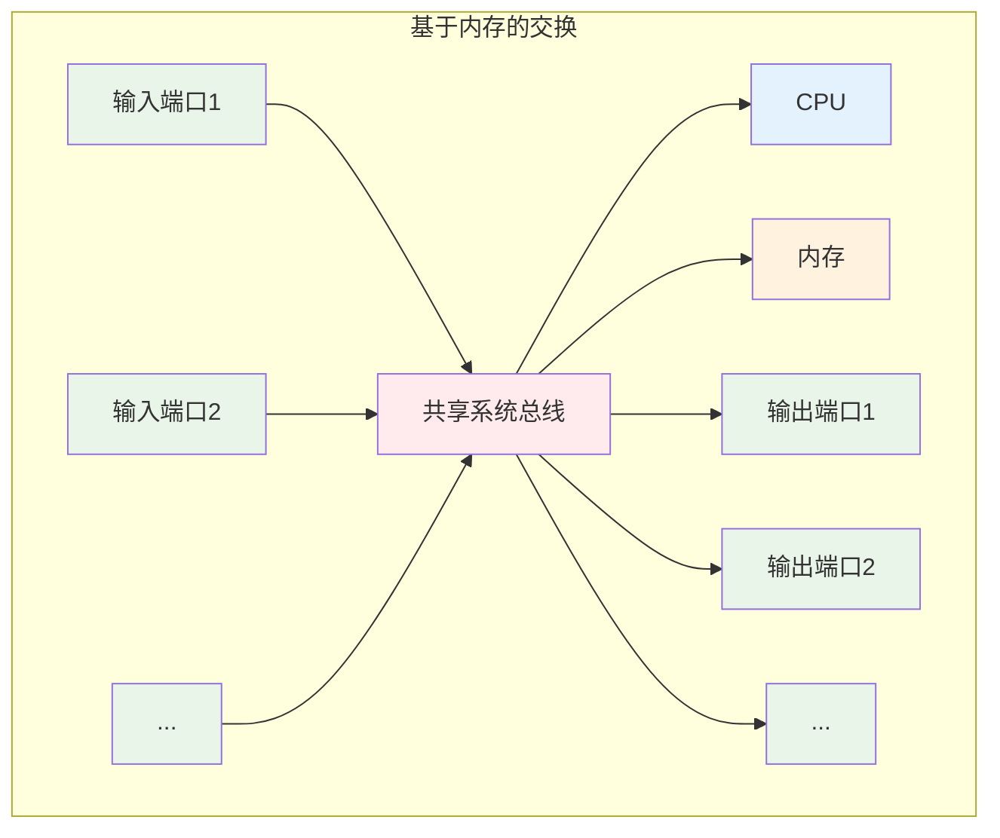

**特点**：
- 早期路由器设计
- CPU参与每个分组转发
- 速度受内存带宽限制
- 适用于低速设备

#### 2. 基于总线的交换
特点：
• 所有端口共享总线带宽
• 同时只能有一个传输
• 总线争用导致性能瓶颈
• 适用于中速设备


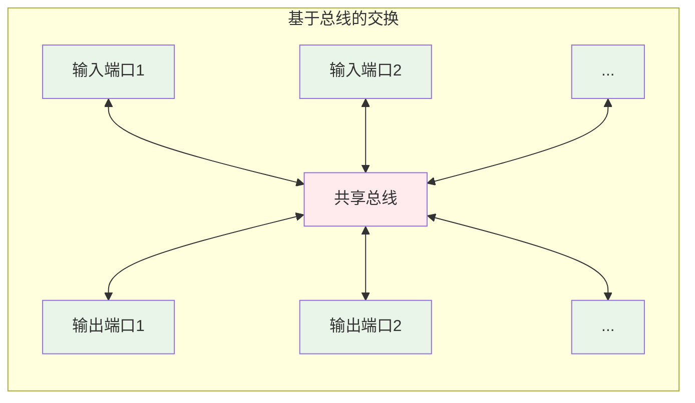

**特点**：
- 所有端口共享总线带宽
- 同时只能有一个传输
- 总线争用导致性能瓶颈
- 适用于中速设备

#### 3. 基于交叉开关的交换
```
输入端口                输出端口

  1 ──○────○────○──── 1
      │    │    │
  2 ──○────●────○──── 2  (●表示连接)
      │    │    │
  3 ──○────○────○──── 3
```
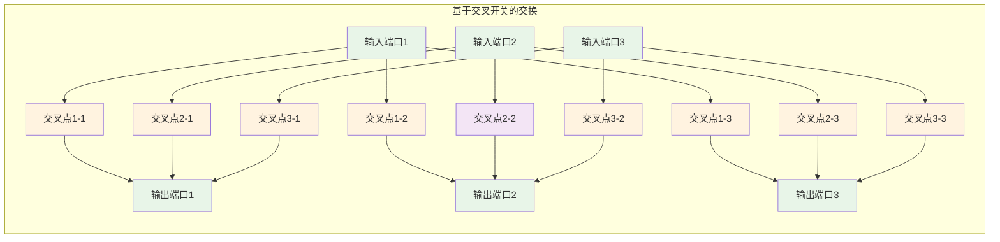

**特点**：
- 非阻塞交换架构
- 多个并行连接
- 最高性能方案
- 现代高速路由器标准

#### 交换结构调度算法

**并行传输调度**：

```
交叉开关调度问题：
多个输入端口可能同时要发送到同一输出端口

调度算法：
1. 最大权重匹配 (Maximum Weight Matching)：
   • 为每个输入-输出对分配权重
   • 寻找总权重最大的匹配
   • NP-hard问题，需要近似算法

2. 轮询仲裁 (Round-Robin Arbitration)：
   • 按顺序为每个输入端口分配服务
   • 公平性好，实现简单
   • 不考虑流量优先级

3. 虚拟输出队列 (Virtual Output Queues)：
   输入端口为每个输出端口维护单独队列
   避免队首阻塞 (Head-of-Line Blocking)
   
   传统单队列问题：
   输入队列: [to Port1] [to Port2] [to Port1]
                ↑        X         X
              Port1忙时，到Port2的分组被阻塞
   
   VOQ解决方案：
   到Port1队列: [分组1] [分组3]
   到Port2队列: [分组2]
   到Port3队列: []
   ...
   各队列独立调度，消除队首阻塞

现代实现：
• iSLIP算法：近似最大权重匹配
• PIM算法：并行迭代匹配  
• 硬件实现：纳秒级调度决策
```

---

## 输出端口处理

### 输出端口功能

#### 输出处理流程

**输出端口架构**：

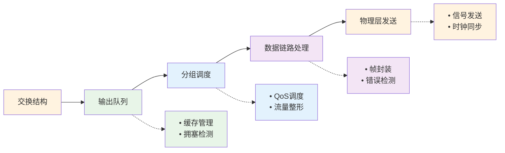


#### 服务质量 (QoS) 实现

**分组调度算法**：

```
QoS调度算法对比：

1. 先进先出 (FIFO)：
   ┌─────┬─────┬─────┬─────┐
   │ P1  │ P2  │ P3  │ P4  │ → 发送顺序
   └─────┴─────┴─────┴─────┘
   • 最简单的调度
   • 无差别服务
   • 无QoS保证

2. 优先级队列 (Priority Queuing)：
   高优先级: [Voice] [Voice] → 优先发送
   中优先级: [Video] [Video]
   低优先级: [Data ] [Data ] → 最后发送
   
   • 严格优先级
   • 可能饿死低优先级流量
   • 适用于实时应用

3. 加权公平队列 (WFQ)：
   队列1 (权重3): ●●● → 获得3/8带宽
   队列2 (权重3): ●●● → 获得3/8带宽  
   队列3 (权重2): ●●  → 获得2/8带宽
   
   • 按权重分配带宽
   • 防止饿死现象
   • 提供带宽保证

4. 基于类的加权公平队列 (CBWFQ)：
```

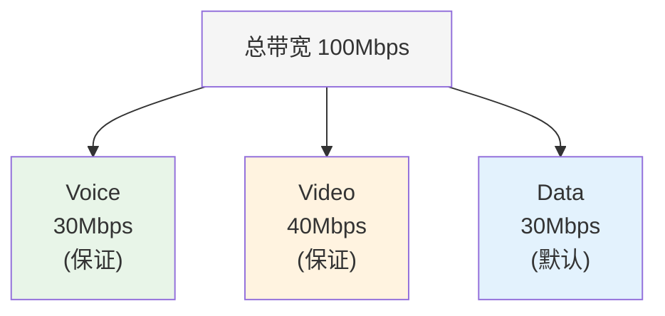
   
```
   • 分层QoS设计
   • 带宽保证+突发支持
   • 企业网络主流方案

实际配置示例：
class-map voice
  match protocol rtp
  
class-map video  
  match protocol http
  
policy-map qos-policy
  class voice
    priority 30000    # 30Mbps保证带宽
  class video
    bandwidth 40000   # 40Mbps保证带宽
  class class-default
    bandwidth 30000   # 剩余带宽
```

---

## 排队理论与分组调度

### 排队模型分析

#### 基本排队理论

**M/M/1/K排队模型**：

```
路由器端口排队模型：
• M: 泊松分组到达过程
• M: 指数分布服务时间
• 1: 单一服务器（输出链路）
• K: 有限缓存容量

关键参数：
• λ: 平均到达速率 (pps)
• μ: 平均服务速率 (pps)  
• ρ = λ/μ: 利用率
• K: 缓存容量 (分组数)

性能指标：
1. 平均队列长度:
   L = ρ/(1-ρ) * [1-(K+1)ρ^K+Kρ^(K+1)] / [1-ρ^(K+1)]

2. 平均等待时间:
   W = L/λ

3. 丢包概率:
   P_loss = ρ^K(1-ρ)/(1-ρ^(K+1))

数值示例：
λ = 8000 pps, μ = 10000 pps, K = 100
ρ = 0.8
L ≈ 4.0 packets
W ≈ 0.5 ms  
P_loss ≈ 0.01%
```

#### 缓存管理策略

**主动队列管理 (AQM)**：


缓存管理算法：

1. 尾丢弃 (Tail Drop)：
```
   ┌─────┬─────┬─────┬─────┬─────┐ ← 缓存满
   │ P1  │ P2  │ P3  │ P4  │ P5  │
   └─────┴─────┴─────┴─────┴─────┘
                               ↓
                        新分组被丢弃
```
   
   问题：全局同步，TCP流同时退避

2. **随机早期检测 (RED)**：

**工作原理**：
   - **队列监控**：持续监测队列平均长度
   - **早期预警**：队列长度接近阈值时开始随机丢包
   - **避免拥塞**：防止队列溢出和全局同步

**关键参数**：

| 参数 | 含义 | 作用 |
|------|------|------|
| **Tmin** | 最小阈值 | 低于此值：无丢包 |
| **Tmax** | 最大阈值 | 高于此值：100%丢包 |
| **Pmax** | 最大丢包概率 | Tmin-Tmax区间的最大丢包率 |

**丢包策略**：
   - **绿色区域** (队列长度 < Tmin)：正常转发，无丢包
   - **黄色区域** (Tmin ≤ 队列长度 < Tmax)：线性增加丢包概率
     - 丢包概率 = (当前队列长度 - Tmin) / (Tmax - Tmin) × Pmax
   - **红色区域** (队列长度 ≥ Tmax)：强制丢包，丢包率100%
   
   优点：避免全局同步，提前预警

3. 加权随机早期检测 (WRED)：
   为不同服务类别设置不同的RED参数
   
   Premium类：Tmin=80, Tmax=100
   Gold类：   Tmin=60, Tmax=80  
   Best-effort类：Tmin=40, Tmax=60
   
   高优先级流量享受更大的缓存空间

4. 蓝色算法 (BLUE)：
   基于链路利用率和丢包率动态调整
```
   if (队列空闲时间 > freeze_time):
       p_mark -= d1
   if (检测到缓存溢出):
       p_mark += d2
```
   自适应调整丢包概率


### 流量控制机制

#### 流量整形技术

**流量控制算法**：

**流量整形方法**：

1. **令牌桶 (Token Bucket)**：

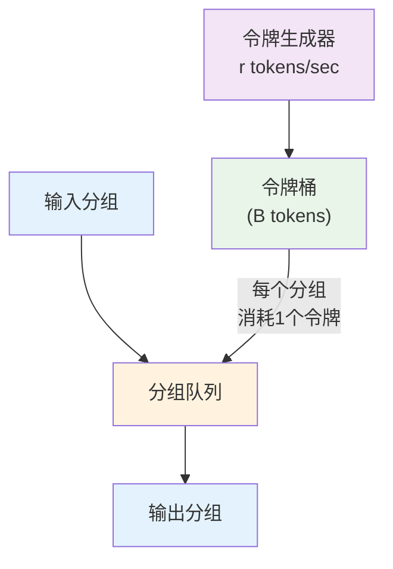
   
   参数：
   • r: 令牌填充速率 (bps)
   • B: 桶容量 (bytes)
   • 支持突发：最大B字节突发
   • 长期平均速率：r

2. **漏桶 (Leaky Bucket)**：
   分组输入 → ┌─────────────┐ → 固定速率输出
              │   缓存队列   │
              └─────────────┘
   
   • 严格限制输出速率
   • 平滑流量变化
   • 不支持突发传输

3. **双令牌桶 (Two-Token Bucket)**：

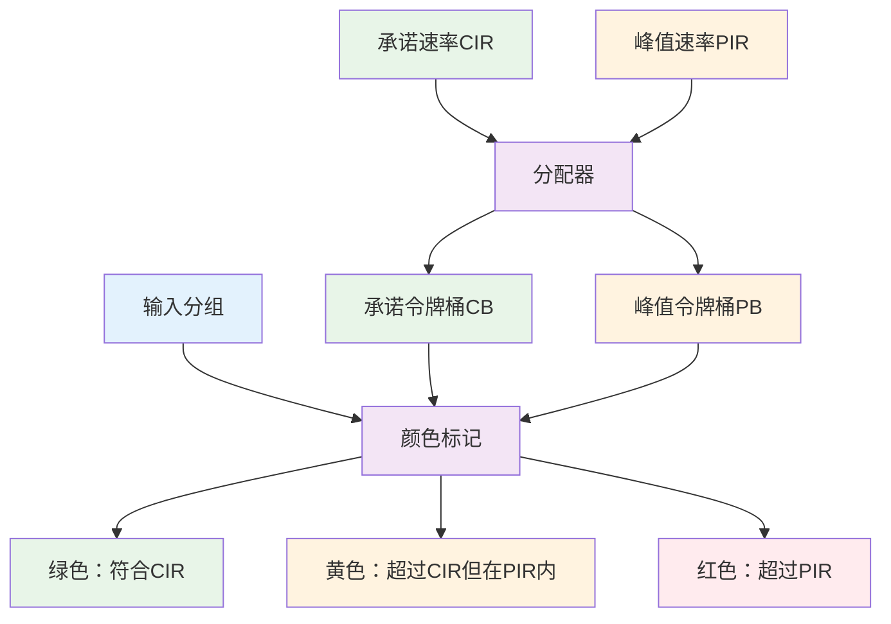

实际应用示例：
interface GigabitEthernet0/0
 rate-limit output 10000000 1875000 3750000 conform-action transmit exceed-action drop
 
参数解释：
• 10Mbps平均速率
• 1.875MB正常突发
• 3.75MB最大突发
• 符合速率：传输
• 超出速率：丢弃

---
 
**[下一节：4.3 Internet协议：IPv4与IPv6](4.3网络层：Internet协议IPv4技术.md)**
