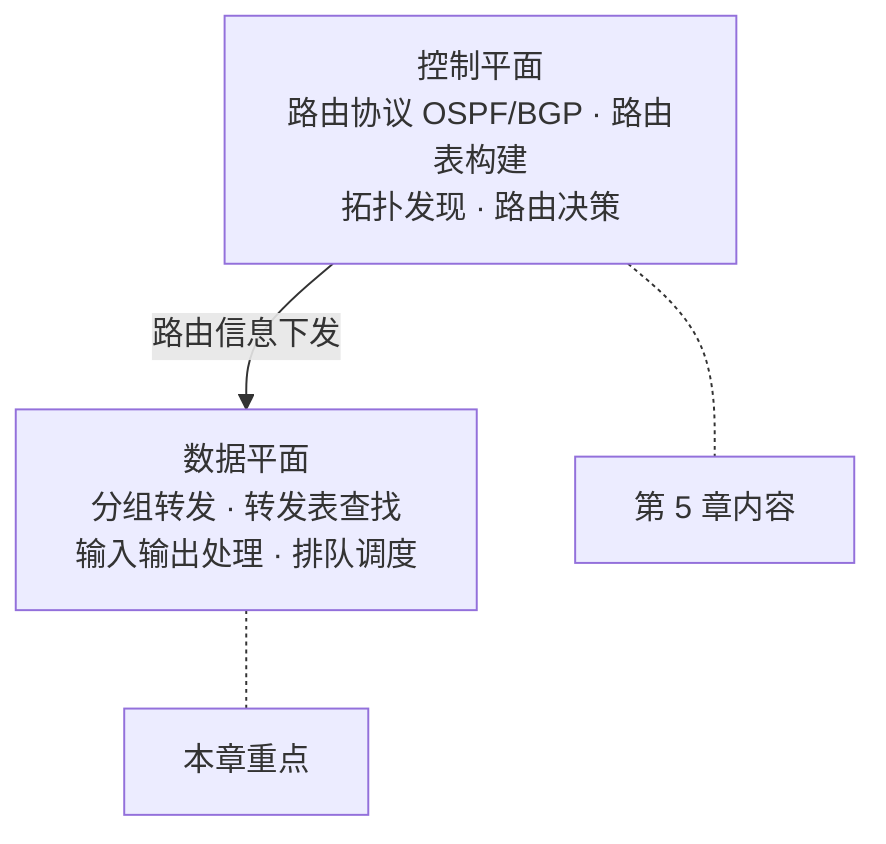
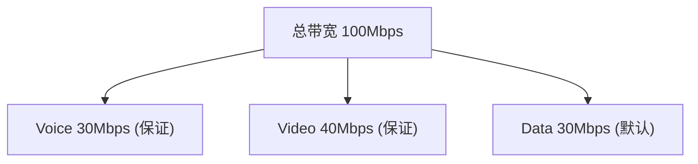
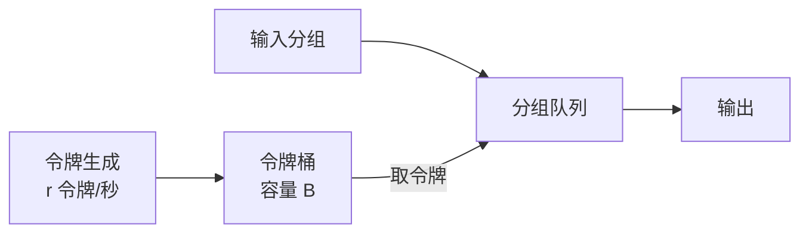

# 4.2 网络层：路由器体系结构

## 本章目录

1. [路由器工作原理概述](#路由器工作原理概述)
2. [路由器硬件架构](#路由器硬件架构)
3. [输入端口处理](#输入端口处理)
4. [交换结构](#交换结构)
5. [输出端口处理](#输出端口处理)
6. [排队理论与分组调度](#排队理论与分组调度)

---

## 路由器工作原理概述

### 路由器的基本功能

> **路由器 (Router)**
> 
> 网络层设备，负责根据目标IP地址将分组从输入端口转发到正确的输出端口，是Internet的核心转发设备。

#### 路由器vs交换机区别

**功能对比**：

| 特征 | 路由器 | 交换机 |
|------|--------|--------|
| 工作层次 | 网络层(L3) | 数据链路层(L2) |
| 转发依据 | IP地址 | MAC地址 |
| 转发表 | 路由表 | MAC地址表 |
| 分组处理 | 需要处理IP头部 | 透明转发 |
| 网络范围 | 跨网络 | 单一网络 |
| 广播处理 | 不转发广播 | 泛洪广播 |
| 复杂度 | 高 | 较低 |

#### 路由器功能分离

**数据平面 vs 控制平面**：


```mermaid
graph TD
    A["控制平面<br/>路由协议 OSPF/BGP · 路由表构建<br/>拓扑发现 · 路由决策"] -->|路由信息下发| B["数据平面<br/>分组转发 · 转发表查找<br/>输入输出处理 · 排队调度"]
    A -.- C["第 5 章内容"]
    B -.- D["本章重点"]
```

**时间尺度差异**：
- 控制平面：秒级、分钟级（路由收敛）
- 数据平面：纳秒级、微秒级（分组转发）

注：转发（forwarding）是数据平面的本地动作，把分组从输入端口送到输出端口；路由（routing）是控制平面的全局过程，决定分组端到端的路径。

---

## 路由器硬件架构

### 通用路由器架构

#### 基本组件构成

**路由器四大组件**：输入端口、交换结构、输出端口、路由处理器。前三者构成数据平面（硬件实现），路由处理器运行控制平面。

```
                ┌─────────────────────┐
                │      路由处理器        │  控制平面：路由协议、
                │  (Routing Processor)  │  转发表计算、管理（软件）
                └───────────┬───────────┘
                 下发转发表   │
   ┌───────┐                ▼               ┌───────┐
──▶│输入端口│──┐      ┌─────────────┐    ┌──▶│输出端口│──▶
   │   1   │  │      │             │    │   │   1   │
   └───────┘  ├─────▶│   交换结构   │───▶├   └───────┘
   ┌───────┐  │      │(Switch Fabric)│   │   ┌───────┐
──▶│输入端口│──┘      │             │    └──▶│输出端口│──▶
   │   N   │         └─────────────┘        │   N   │
   └───────┘                                └───────┘
  线路端接·物理/链路·                      链路调度·链路/物理·
  转发表查找（数据平面）                    线路端接（数据平面）
```

**关键特性**：
- 分布式处理：每个输入端口本地查转发表，无需经过路由处理器，避免集中瓶颈
- 硬件加速：ASIC/TCAM 实现线速查找
- 缓存与排队：输入、输出端口都可能排队（见后文）

#### 路由器性能指标

| 维度 | 指标 | 说明 |
|------|------|------|
| 转发性能 | 转发速率 (Mpps) | 每秒可转发的分组数 |
| | 吞吐量 (Gbps/Tbps) | 总带宽 |
| | 转发延迟 | 微秒级 |
| 表项容量 | 路由表 | 可达百万级条目 |
| | ACL 规则 | 千级 |
| 可靠性 | MTBF、冗余、热插拔 | 电源/风扇/引擎卡冗余，在线维护 |

**典型设备规格**：
- 企业级路由器：1–10 Gbps
- 运营商边缘路由器：100 Gbps–1 Tbps
- 核心路由器：10–100 Tbps

---

## 输入端口处理

### 输入端口功能架构

#### 多层处理流程

**输入端口处理过程**：


```mermaid
graph LR
    A["物理层端接<br/>信号/时钟恢复"] --> B["数据链路层<br/>帧同步/解析"]
    B --> C["转发表查找<br/>查目的IP定输出端口"]
    C --> D["排队缓存<br/>送入交换结构"]
```

注：转发表查找在输入端口本地完成（分布式），查得的输出端口决定分组经交换结构送往何处。

#### 转发表查找与最长前缀匹配

转发表用「地址前缀 → 输出端口」的形式存储。一个目的地址可能同时落入多条前缀，规则是**最长前缀匹配 (Longest Prefix Matching)**：选匹配位数最多的那条。

| 方法 | 复杂度 | 特点 |
|------|--------|------|
| 线性查找 | O(N) | 实现简单，大表太慢 |
| 前缀树 Trie | O(地址长度) | 天然支持最长前缀匹配，内存开销大 |
| TCAM | O(1) 并行 | 硬件一拍出结果，支持通配，高速路由器主流 |

**最长前缀匹配示例**（目的 IP = `192.168.1.100`）：

```
目的地址: 11000000.10101000.00000001.01100100  (192.168.1.100)

转发表前缀（按匹配位数）:
  192.168.0.0/16   11000000.10101000.*              → 端口1  匹配16位
  192.168.1.0/24   11000000.10101000.00000001.*     → 端口2  匹配24位 ← 最长
  0.0.0.0/0        默认路由                          → 端口3  匹配 0位

结果: /24 与 /16 都匹配，取最长 → 选端口2
```

注：默认路由 `0.0.0.0/0` 匹配 0 位，只在没有更具体前缀时兜底。TCAM 在硬件中并行比较所有表项，并按前缀长度优先返回，因此能一次给出最长匹配结果。

#### 访问控制列表 (ACL)

输入端口除转发查找外，常按五元组（源/目的 IP、源/目的端口、协议）做分组过滤。规则按顺序匹配，命中即执行对应动作（允许/拒绝/标记/限速）。

```
规则1: permit 192.168.1.0/24 any eq 80   允许该网段访问80端口
规则2: deny   10.0.0.0/8 any              拒绝该网段
规则3: permit any any                     兜底放行
```

注：ACL 是「首次命中即停」，规则顺序决定结果；高速场景用 TCAM 并行匹配以维持线速。

---

## 交换结构

### 三种交换结构

交换结构负责把分组从输入端口送到输出端口，是路由器内部的"网络"。按实现方式分为内存、总线、纵横（crossbar）三类，交换速率依次提升。

#### 1. 基于内存的交换

最早的路由器即由 CPU 控制：输入端口收到分组后中断 CPU，CPU 把分组从输入端口缓存拷入内存，查转发表，再拷到输出端口缓存。

```
   输入端口 ─┐                        ┌─ 输出端口
            │   ┌──────────────┐     │
   输入端口 ─┼──▶│ 系统总线/CPU │────▶┼─ 输出端口
            │   │     内存      │     │
   输入端口 ─┘   └──────────────┘     └─ 输出端口
            一个分组进出内存两次拷贝
```

特点：转发速率受**内存带宽**限制（每个分组两次跨总线读写），CPU 参与转发，只适用于低速设备。

#### 2. 基于总线的交换

输入端口经一条**共享总线**直接把分组送到输出端口，不经过路由处理器。

```
   输入端口 ─┐                  ┌─ 输出端口
   输入端口 ─┼──[ 共享总线 ]──┼─ 输出端口
   输入端口 ─┘                  └─ 输出端口
            同一时刻只能传一个分组
```

特点：实现简单，但同一时刻总线只能承载一个分组，交换速率受**总线带宽**限制（总线争用）。

#### 3. 基于纵横（crossbar）的交换

由 $2N$ 条总线构成 $N \times N$ 网格，每个交叉点是一个开关。控制器闭合交叉点即在某个输入与某个输出间建立通路。

```
              输出1   输出2   输出3
                │       │       │
   输入1 ───────┼───────●───────┼───   ● = 闭合（输入1→输出2）
                │       │       │
   输入2 ───────●───────┼───────┼───   ● = 闭合（输入2→输出1）
                │       │       │
   输入3 ───────┼───────┼───────●───   ● = 闭合（输入3→输出3）
```

特点：**非阻塞**——只要分组目的输出端口各不相同，多对输入-输出可同时转发，交换速率随端口数扩展。现代高速路由器普遍采用，常用多级 crossbar 互连以支持更大端口规模。

注：上图三条连接的目的输出端口互不相同，可并行进行；若两个输入同时要去同一输出，则只能串行——这正是下面输入排队要解决的问题。

#### 输入排队与队首阻塞 (HOL Blocking)

当交换结构速率跟不上输入端口聚合到达速率时，分组在**输入端口**排队。若输入端口用单条 FIFO 队列，会出现**队首阻塞 (Head-of-Line Blocking, HOL)**：队首分组因目的输出端口被占用而等待，即使队中后面的分组目的端口空闲，也被一并堵住。

```
输入端口1 队列(FIFO):  [→端口1] [→端口2] [→端口1]
                         队首
输入端口2 队列(FIFO):  [→端口1]
                         队首

  两个队首都要去 端口1 → 只能一个先走，另一个等
  输入1队列中第2个分组(→端口2，端口2空闲) 也被队首死死挡住
```

注：即使 crossbar 本身非阻塞，单 FIFO 输入队列也会因 HOL 损失吞吐——理论上随机流量下吞吐被限制在约 58%。

**虚拟输出队列 (VOQ)** 是标准解法：每个输入端口为**每个输出端口各维护一条队列**，调度器可越过被阻塞的队列去服务空闲输出，从而消除 HOL。

```
输入端口1:  →端口1 队列: [分组A] [分组C]
            →端口2 队列: [分组B]      ← 端口2空闲时可独立发出
            →端口3 队列: []
```

**调度算法**：交换结构每个时隙需在「哪些输入-输出对同时连通」之间做匹配。
- 最大权重匹配：以队列长度为权重求最优匹配，吞吐最优但计算复杂。
- 轮询仲裁、iSLIP（并行迭代轮询）：近似匹配，实现简单、可硬件化，纳秒级决策，是实际主流。

---

## 输出端口处理

### 输出端口功能

#### 输出处理流程

**输出端口架构**：

分组从交换结构到达输出端口后，进入输出队列，由调度器按策略选出下一个发送，再封装成帧由物理层发出。


```mermaid
graph LR
    A["交换结构"] --> B["输出队列<br/>缓存/拥塞检测"]
    B --> C["分组调度<br/>QoS/流量整形"]
    C --> D["数据链路处理<br/>帧封装"]
    D --> E["物理层发送"]
```

注：当多个输入同时把分组送到同一输出端口，而输出链路一次只能发一个，分组就在输出端口排队；缓存满则**丢包**。这是输出排队，与输入排队的 HOL 阻塞是两个不同位置的问题。

易混：**输入排队**的主要矛盾是队首阻塞（HOL），用 VOQ 解决；**输出排队**的主要矛盾是缓存溢出导致**丢包**，用 AQM/调度解决。

#### 服务质量 (QoS) 实现

**分组调度算法**（决定排队分组的发送次序）：

**1. 先进先出 (FIFO)**：按到达顺序发送，无差别服务，无 QoS 保证。

```
   ┌─────┬─────┬─────┬─────┐
   │ P1  │ P2  │ P3  │ P4  │ → 发送顺序
   └─────┴─────┴─────┴─────┘
```

**2. 优先级队列 (PQ)**：先发高优先级队列，严格优先。低优先级可能被"饿死"，适合实时流量。

```
   高优先级: [Voice][Voice] → 优先发送
   中优先级: [Video][Video]
   低优先级: [Data ][Data ] → 最后发送
```

**3. 加权公平队列 (WFQ)**：按权重分配带宽，避免饿死。权重 3:3:2 → 带宽 3/8、3/8、2/8。

**4. 基于类的加权公平队列 (CBWFQ)**：先把流量分类，再为每类保证一份带宽，空闲带宽可被其他类借用。


```mermaid
graph TB
    A["总带宽 100Mbps"] --> B["Voice 30Mbps (保证)"]
    A --> C["Video 40Mbps (保证)"]
    A --> D["Data 30Mbps (默认)"]
```

配置示例（Cisco IOS 语法）：

```
class-map voice
  match protocol rtp
class-map video
  match protocol rtsp
policy-map qos-policy
  class voice
    priority 30000     # 30Mbps，严格优先（低时延）
  class video
    bandwidth 40000    # 40Mbps 保证带宽
  class class-default
    bandwidth 30000    # 剩余带宽
```

---

## 排队理论与分组调度

### 排队模型分析

#### 基本排队理论

输出端口排队可用 **M/M/1/K** 模型刻画：泊松到达（M）、指数服务时间（M）、单服务器（1，即输出链路）、缓存容量 $K$。

参数：到达速率 $\lambda$、服务速率 $\mu$、利用率 $\rho=\lambda/\mu$。

平均队列长度（$\rho \ne 1$）：

$$L = \frac{\rho}{1-\rho}\cdot\frac{1-(K+1)\rho^{K}+K\rho^{K+1}}{1-\rho^{K+1}}$$

丢包概率（缓存满时新分组被丢）：

$$P_{\text{loss}} = \frac{\rho^{K}(1-\rho)}{1-\rho^{K+1}}$$

平均等待时间由小定律 $W = L/\lambda_{\text{eff}}$ 得出，其中有效到达率 $\lambda_{\text{eff}}=\lambda(1-P_{\text{loss}})$。

数值示例：$\lambda=8000$ pps，$\mu=10000$ pps，$K=100$，则 $\rho=0.8$。

$$L \approx 4.0\ \text{packets},\quad W \approx 0.5\ \text{ms},\quad P_{\text{loss}} \approx 4\times10^{-11}\ (\text{几乎为 }0)$$

注：$K=100$ 时缓存远大于平均队长，丢包可忽略。同样 $\rho=0.8$ 下，缓存压到 $K\approx34$ 时丢包才升到约 $0.01\%$，$K\approx10$ 时约 $2\%$。缓存越小，丢包越敏感。

#### 缓存管理：主动队列管理 (AQM)

**1. 尾丢弃 (Tail Drop)**：缓存满才丢新到分组，最简单。

```
   ┌─────┬─────┬─────┬─────┬─────┐ ← 缓存已满
   │ P1  │ P2  │ P3  │ P4  │ P5  │
   └─────┴─────┴─────┴─────┴─────┘
                                  ↓ 新分组被丢
```

问题：缓存满时同时丢掉多条 TCP 流的分组，导致它们一起退避、再一起增窗，造成**全局同步**，链路利用率振荡。

**2. 随机早期检测 (RED)**：按平均队长**提前、随机**丢包，让各 TCP 流错峰退避，避免全局同步。

```
丢包概率 p
  1 │                      ┌──────  队长 ≥ Tmax：必丢
    │                     /
Pmax│                 ___/        Tmin ≤ 队长 < Tmax：
    │            ____/             线性增长
  0 │___________/_________________  队长 < Tmin：不丢
    └──────────┴──────┴──────────▶ 平均队长
              Tmin   Tmax
```

黄色区间内：$p = \dfrac{\text{平均队长}-T_{\min}}{T_{\max}-T_{\min}}\times P_{\max}$。

**3. 加权 RED (WRED)**：为不同服务类设不同阈值，高优先级类阈值更高（更晚才丢），从而占用更多缓存。

**4. BLUE**：不看队长，而按丢包事件与链路空闲自适应调整丢包概率——溢出就增大、长时间空闲就减小。


### 流量整形

调度决定"先发谁"，整形决定"按什么速率发"，常用令牌桶和漏桶限制流量的速率与突发。

**1. 令牌桶 (Token Bucket)**：以速率 $r$ 向容量为 $B$ 的桶注入令牌，发一个分组需取走相应令牌；桶空则等待。


```mermaid
graph LR
    G["令牌生成<br/>r 令牌/秒"] --> K["令牌桶<br/>容量 B"]
    P["输入分组"] --> Q["分组队列"]
    K -->|取令牌| Q
    Q --> O["输出"]
```

- 长期平均速率上限为 $r$；
- 桶里攒下的令牌允许一次最多 $B$ 的**突发**——这是与漏桶的关键区别。

**2. 漏桶 (Leaky Bucket)**：无论到达多快，都按固定速率漏出。

```
   分组输入(突发) → ┌──────────┐ → 固定速率输出(平滑)
                    │ 缓存队列  │
                    └──────────┘
```

- 严格平滑输出、不支持突发；溢出则丢弃。

易混：令牌桶**允许突发**（攒令牌），漏桶**不允许突发**（恒速漏出）。

**3. 双速率三色标记 (CIR/PIR)**：用承诺速率 CIR 与峰值速率 PIR 给分组打色——符合 CIR 标绿、超 CIR 不超 PIR 标黄、超 PIR 标红，后续按颜色差别化转发或丢弃。

```
输入分组 ─▶ 令牌检查 ─▶ 绿 (≤ CIR)：转发
                       黄 (CIR~PIR)：拥塞时优先丢
                       红 (> PIR)：丢弃
```

配置示例（Cisco IOS，10Mbps 平均、1.875MB 正常突发、3.75MB 最大突发）：

```
interface GigabitEthernet0/0
 rate-limit output 10000000 1875000 3750000 \
   conform-action transmit exceed-action drop
```

---

**继续学习**：[4.3 网络层：IP协议详解](4.3网络层：IP协议详解.md)
