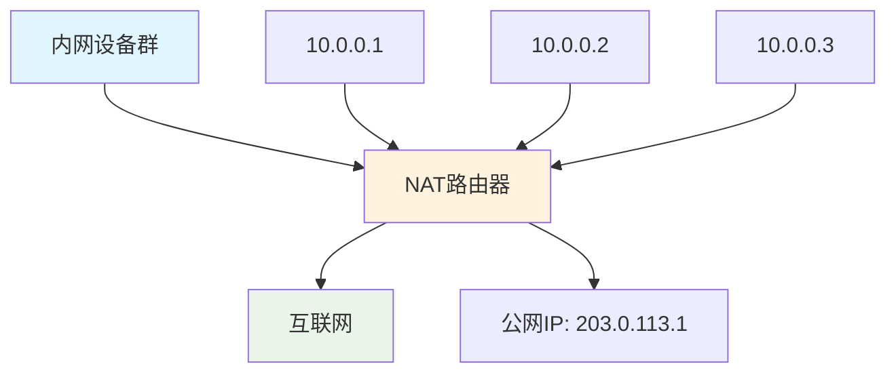
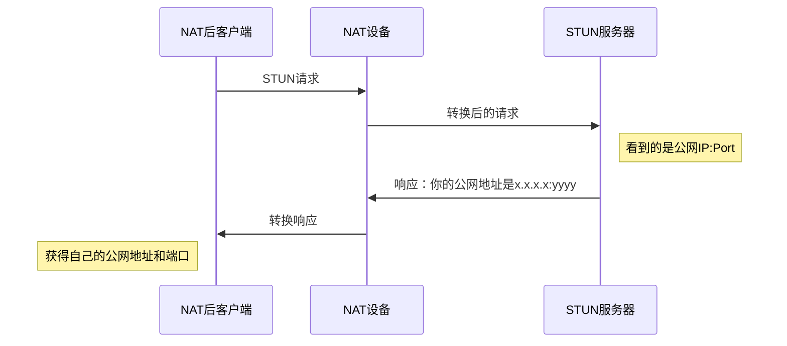
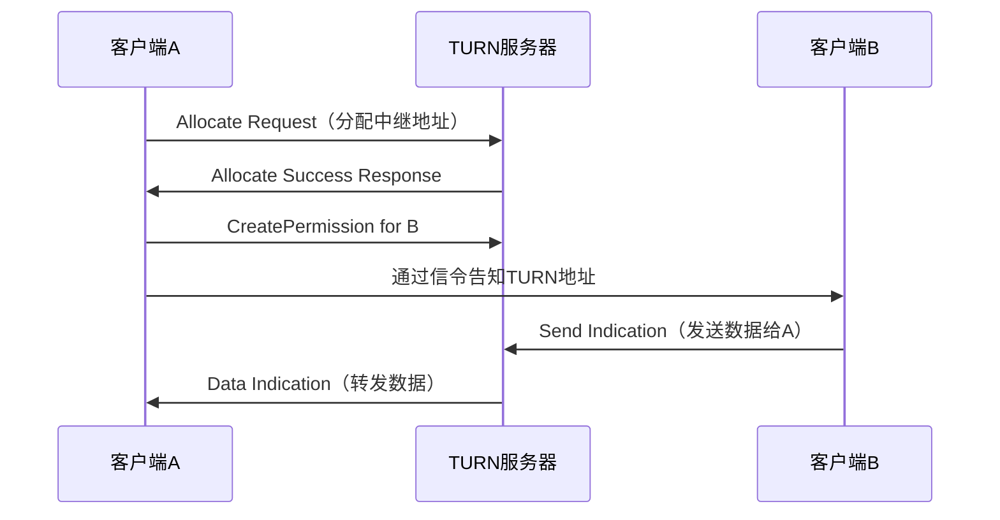
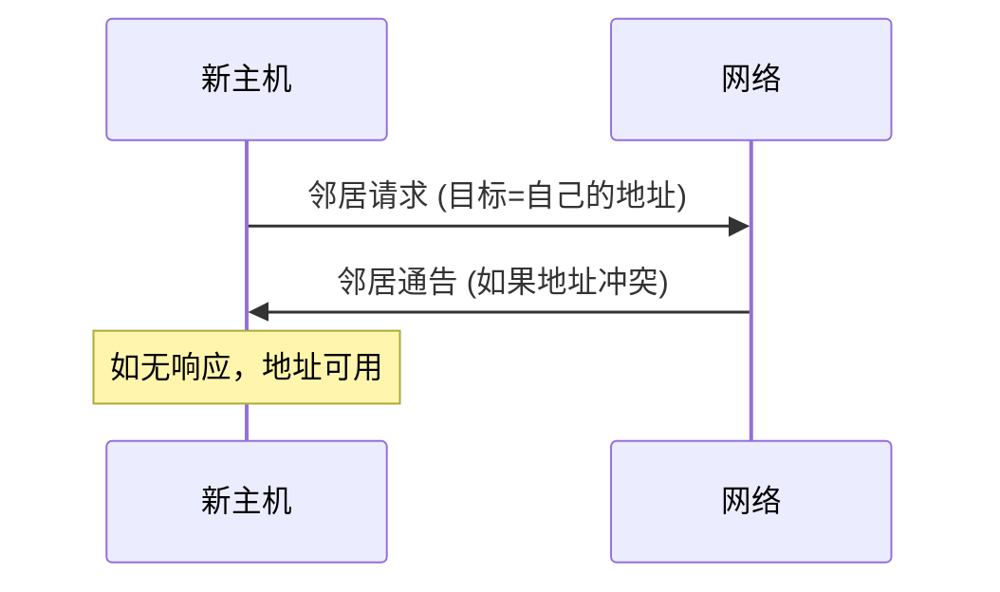
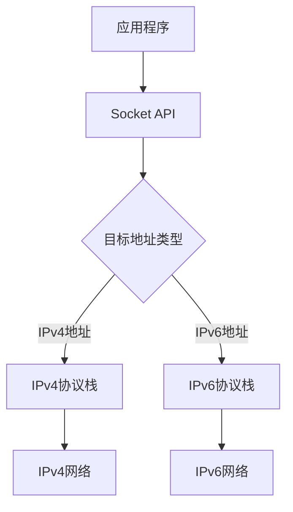

# 4.3 网络层：IP协议详解

## 目录

1. [IPv4数据报格式](#ipv4数据报格式)
2. [IPv4数据报分片](#ipv4数据报分片)
3. [IPv4编址](#ipv4编址)
4. [动态主机配置协议DHCP](#动态主机配置协议dhcp)
5. [网络地址转换NAT](#网络地址转换nat)
6. [典型例题解析](#典型例题解析)
7. [易错点分析](#易错点分析)

---

## IPv4数据报格式

Internet的网络层分组称为**数据报**。IPv4数据报格式如下所示：

```
 0                   1                   2                   3
 0 1 2 3 4 5 6 7 8 9 0 1 2 3 4 5 6 7 8 9 0 1 2 3 4 5 6 7 8 9 0 1
+-+-+-+-+-+-+-+-+-+-+-+-+-+-+-+-+-+-+-+-+-+-+-+-+-+-+-+-+-+-+-+-+
|Version|  IHL  |Type of Service|          Total Length         |
+-+-+-+-+-+-+-+-+-+-+-+-+-+-+-+-+-+-+-+-+-+-+-+-+-+-+-+-+-+-+-+-+
|         Identification        |Flags|      Fragment Offset    |
+-+-+-+-+-+-+-+-+-+-+-+-+-+-+-+-+-+-+-+-+-+-+-+-+-+-+-+-+-+-+-+-+
|  Time to Live |    Protocol   |         Header Checksum       |
+-+-+-+-+-+-+-+-+-+-+-+-+-+-+-+-+-+-+-+-+-+-+-+-+-+-+-+-+-+-+-+-+
|                    Source Address                             |
+-+-+-+-+-+-+-+-+-+-+-+-+-+-+-+-+-+-+-+-+-+-+-+-+-+-+-+-+-+-+-+-+
|                  Destination Address                          |
+-+-+-+-+-+-+-+-+-+-+-+-+-+-+-+-+-+-+-+-+-+-+-+-+-+-+-+-+-+-+-+-+
|                    Options                    |    Padding    |
+-+-+-+-+-+-+-+-+-+-+-+-+-+-+-+-+-+-+-+-+-+-+-+-+-+-+-+-+-+-+-+-+
```

### IPv4头部字段详解

**版本号(4比特)**：规定了数据报的IP协议版本。IPv4为4。

**首部长度(4比特)**：因为IPv4数据报可包含可变数量的选项，需要用这4个比特来确定IP数据报中载荷实际开始的地方。大多数IP数据报不包含选项，所以一般的IP数据报具有20字节的首部。

**服务类型(8比特)**：服务类型(TOS)比特用来区分不同类型的IP数据报。

**数据报长度(16比特)**：IP数据报的总长度（首部加上数据），以字节计。因为该字段长16比特，所以IP数据报的最大长度为65535字节。

**标识、标志、片偏移(16+3+13比特)**：这些字段与IP分片有关。

**寿命(8比特)**：寿命(TTL)字段用来确保数据报不会永远在网络中循环。每当一台路由器处理数据报时，该字段的值减1。若TTL字段减为0，则该数据报必须丢弃。

**协议(8比特)**：该字段只在一个IP数据报到达其最终目标时才会有用。该字段指示了IP数据报的数据部分应交给哪个特定的运输层协议。

> **常用协议号**
> - 6：TCP
> - 17：UDP  
> - 1：ICMP
> - 89：OSPF

**首部检验和(16比特)**：首部检验和用于帮助路由器检测收到的IP数据报中的比特错误。

**源和目标地址(各32比特)**：当源生成一个数据报时，它在源IP地址字段中插入它的IP地址，在目标IP地址字段中插入其最终目标的地址。

**选项**：选项字段允许IP首部被扩展。首部选项是为了满足某些情况下的特殊需求而设计的。

### IP数据报的有效载荷

IP数据报中的数据字段包含要交付给目标的运输层报文段(TCP或UDP)，或者其他数据，如ICMP报文。

---

## IPv4数据报分片

一个链路层帧能承载的最大数据量叫做**最大传送单元(MTU)**。

不同的链路层协议能承载不同大小的网络层分组：
- 以太网：1500字节
- 802.11：2312字节  
- 某些点对点链路：65535字节

### 分片的必要性

当IP数据报的长度超过链路的MTU时，就需要将IP数据报分片，然后通过链路发送这些片。这些片要在到达最终目标以前或者在目标主机中重新组装。

> **IP分片规则**
> 
> IPv4的设计者将重新组装数据报片的工作放在端系统中，而不是在网络路由器中。

### 分片机制

当需要分片时，一个数据报变成两个或更多个数据报，称这些较小的数据报为**片**。

**分片相关字段**：
- **标识字段**：发送主机通常将标识字段逐1递增地赋给它发送的每个数据报
- **标志字段**：3比特，但只有2比特实际使用
  - **DF(Don't Fragment)**：当DF=1时，表明不能对该数据报分片
  - **MF(More Fragment)**：除了最后一个片外，其他片都将该比特置1
- **片偏移字段**：13比特，指出该片在原数据报中的相对位置

### 分片示例

假设一个数据报长度为4000字节（含20字节IP首部），现需通过MTU为1500字节的链路：

**原始数据报**：
- 总长度：4000字节
- 数据：3980字节
- 标识：666
- DF=0, MF=0, 偏移=0

**分片结果**：

**第1片**：
- 长度：1500字节（含20字节首部）
- 数据：1480字节
- 标识：666
- DF=0, MF=1, 偏移=0

**第2片**：
- 长度：1500字节（含20字节首部）  
- 数据：1480字节
- 标识：666
- DF=0, MF=1, 偏移=185 (1480/8)

**第3片**：
- 长度：1040字节（含20字节首部）
- 数据：1020字节
- 标识：666
- DF=0, MF=0, 偏移=370 (2960/8)

注意：偏移字段以8字节为单位，因此每片的数据字段长度（除最后一片外）必须是8的整数倍。

---

## IPv4编址

### IP地址基础

主机和路由器接口的IP地址与该接口相关联。

> **接口**
> 
> 接口是主机/路由器和物理链路之间的边界。路由器通常有多个接口，主机通常只有一个或两个接口。

**IP地址格式**：IPv4地址长度为32比特（4字节），通常用**点分十进制记法**书写，如223.1.1.1。

### 子网

> **子网**
> 
> 为了理解子网，考虑图中由3台主机和一台路由器互连的网络部分。这4个接口的IP地址是223.1.1.xxx的形式，也就是说，它们的IP地址的最左侧24比特是相同的。这4个接口也通过不含路由器的网络相互连接。这种网络互连了若干台主机和一台路由器的多个接口，构成了一个**子网**。

#### 子网掩码

IP编址为这个子网分配一个地址223.1.1.0/24，其中/24记法，有时称为**子网掩码**，指示了32比特中的最左侧24比特定义了子网地址。

#### 确定子网

为了确定子网，分离主机和路由器的每个接口，产生若干个隔离的网络，每个隔离的网络都叫做一个子网。

### 无类别域间路由(CIDR)

Internet的地址分配策略被称为**无类别域间路由(CIDR)**。

> **CIDR**
> 
> CIDR将子网寻址策略的概念一般化了。当使用子网寻址时，32比特的IP地址被划分为两部分，并且具有点分十进制数形式a.b.c.d/x，其中x指示了地址的第一部分中的比特数，并且常常被称为该地址的**前缀**。

**地址聚合**：CIDR的使用能够显著减少转发表的长度，因为单个表项(a.b.c.d/x)就能够表示许多（具体讲是2^(32-x)个）主机。

### 获取主机地址

#### 获取地址块

一个组织通常从ISP的地址空间获得一块地址。例如，ISP拥有地址块200.23.16.0/20，组织需要8个地址，ISP可以分配200.23.16.0/29给该组织。

#### 获得Internet地址块

ISP从**Internet名字和编号分配机构(ICANN)**获得IP地址。ICANN不仅分配IP地址，还管理DNS根服务器，分配域名，解决域名争端。

#### 主机获得地址：DHCP

主机地址可以手工配置，但更多时候使用**动态主机配置协议(DHCP)**。

---

## 动态主机配置协议DHCP

DHCP允许主机自动获取一个IP地址。网络管理员能够配置DHCP，以使某给定主机每次与网络连接时能得到一个相同的IP地址，或者某主机将被分配一个**临时IP地址**。

> **DHCP功能**
> 
> DHCP协议是一个4个步骤的过程：
> 1. DHCP服务器发现
> 2. DHCP服务器提供
> 3. DHCP请求
> 4. DHCP ACK

### DHCP工作过程

**步骤1：DHCP服务器发现**
- 新到达的主机发送**DHCP发现报文**
- 发现报文是一个UDP分组，发送到端口67
- 源IP地址：0.0.0.0，目标IP地址：255.255.255.255
- 该报文广播到所有节点

**步骤2：DHCP服务器提供**
- DHCP服务器收到发现报文后，用**DHCP提供报文**向客户做出响应
- 该报文包含收到的发现报文的事务ID、向客户推荐的IP地址、网络掩码以及**地址租期**

**步骤3：DHCP请求**
- 新到达的客户从一个或多个服务器提供中选择一个，向选中的服务器响应**DHCP请求报文**

**步骤4：DHCP ACK**
- 服务器用**DHCP ACK报文**对DHCP请求报文进行响应，证实所要求的参数

### DHCP的优点

DHCP有许多优点：
- **动态分配**：允许主机加入和离开网络
- **移动性支持**：移动用户能够在新子网中获得地址
- **地址重用**：当主机离开时，地址可被重新使用

---

## 网络地址转换NAT

> **网络地址转换(NAT - Network Address Translation)**
> 
> NAT是一种在IP数据包通过路由器或防火墙时重写来源IP地址或目的IP地址的技术。这种技术被普遍使用在有多台主机但只通过一个公有IP地址访问互联网的私有网络中。

### NAT产生背景与意义 

#### IPv4地址短缺问题

**地址空间限制**：
- IPv4提供约43亿个地址（2³²）
- 实际可用地址更少（保留地址、多播地址等）
- 互联网快速发展导致地址耗尽
- 1990年代中期预计2005年左右耗尽

**传统解决方案的局限**：
- **CIDR**：提高地址分配效率，但治标不治本
- **IPv6**：根本解决方案，但部署缓慢
- **私有地址**：RFC 1918定义，但无法直接访问互联网

#### NAT的解决方案



### NAT类型详解 

#### 1. 静态NAT (Static NAT)

**定义**：内网IP与公网IP一对一固定映射

**工作机制**：
```
内网IP        公网IP
10.0.0.1  ←→  203.0.113.1
10.0.0.2  ←→  203.0.113.2  
10.0.0.3  ←→  203.0.113.3
```

**特点**：
- 映射关系固定不变
- 支持双向通信
- 需要多个公网IP
- 适用于服务器NAT

#### 2. 动态NAT (Dynamic NAT)

**定义**：内网IP动态映射到公网IP池中的地址

**工作机制**：
```
内网IP池：10.0.0.0/24 (254个地址)
公网IP池：203.0.113.1-203.0.113.10 (10个地址)

动态分配：
10.0.0.5  ←→  203.0.113.3 (临时映射)
10.0.0.12 ←→  203.0.113.7 (临时映射)
```

**特点**：
- 映射关系动态建立
- 公网IP可以复用
- 同时连接数受公网IP数量限制
- 外部无法主动建立连接

#### 3. 端口地址转换NAPT (Network Address Port Translation)

**定义**：也称PAT，多个内网地址共享一个公网地址，通过端口号区分

**工作原理**：
```
内网地址:端口        公网地址:端口
10.0.0.1:1234   →   203.0.113.1:5001
10.0.0.1:1235   →   203.0.113.1:5002  
10.0.0.2:1234   →   203.0.113.1:5003
10.0.0.3:80     →   203.0.113.1:5004
```

**转换表结构**：
| 内网IP | 内网端口 | 公网IP | 公网端口 | 协议 | 状态 | 超时时间 |
|--------|----------|--------|----------|------|------|----------|
| 10.0.0.1 | 1234 | 203.0.113.1 | 5001 | TCP | ESTABLISHED | 3600s |
| 10.0.0.2 | 53 | 203.0.113.1 | 5002 | UDP | ACTIVE | 300s |
| 10.0.0.3 | 80 | 203.0.113.1 | 5003 | TCP | SYN_SENT | 75s |

### NAT详细工作机制 

#### 出站数据包处理流程

**TCP连接建立过程**：

1. **内网客户端发起连接**：
```
原始数据包：
源IP: 10.0.0.5      源端口: 1234
目的IP: 8.8.8.8     目的端口: 80
```

2. **NAT路由器处理**：
   - 检查NAT表是否存在映射
   - 如果不存在，创建新的NAT映射
   - 分配外网端口（如5001）
   - 修改数据包源地址和端口
   - 重新计算校验和

3. **转换后数据包**：
```
转换数据包：
源IP: 203.0.113.1   源端口: 5001
目的IP: 8.8.8.8     目的端口: 80
```

#### 入站数据包处理流程

**响应数据包处理**：

1. **外部服务器响应**：
```
响应数据包：
源IP: 8.8.8.8       源端口: 80
目的IP: 203.0.113.1 目的端口: 5001
```

2. **NAT路由器查表转换**：
   - 根据目标端口5001查找NAT映射
   - 找到对应内网地址10.0.0.5:1234
   - 修改目标地址和端口
   - 更新映射活动时间
   - 重新计算校验和

3. **转换后投递给内网**：
```
转换数据包：
源IP: 8.8.8.8     源端口: 80
目的IP: 10.0.0.5   目的端口: 1234
```

### NAT穿透技术 

#### 1. STUN (Session Traversal Utilities for NAT)

**工作原理**：


#### 2. TURN (Traversal Using Relays around NAT)

**适用场景**：对称NAT无法直接P2P通信

**工作流程**：


#### 3. UPnP端口映射

**自动端口转发**：
- 应用程序自动请求NAT设备开放端口
- 支持临时和永久端口映射
- 广泛用于游戏和P2P软件

### NAT对应用的影响分析

#### 1. Web浏览 (HTTP/HTTPS)
**影响**：几乎无影响
- 客户端发起连接，NAT处理简单
- 使用标准端口80/443
- 连接状态清晰

#### 2. P2P应用
**影响**：严重影响
- 两个NAT后设备无法直接连接
- 需要中继服务器或穿透技术
- 连接建立复杂化

#### 3. VoIP应用
**影响**：较大影响
- SIP信令可能需要ALG支持
- RTP媒体流需要端口映射
- 音质可能受到影响

### 408考研NAT典型题目

#### 例题：NAT工作原理

> **题目**：某公司使用NAT技术，内网地址段为192.168.1.0/24，NAT路由器外网IP为203.0.113.1。内网主机192.168.1.10:1234向外网服务器8.8.8.8:80建立TCP连接。请描述NAT的完整工作过程。

**解答**：

**第一步：出站数据包转换**
```
原始数据包：
- 源IP：192.168.1.10    源端口：1234
- 目的IP：8.8.8.8       目的端口：80

NAT处理：
- 创建NAT表项：192.168.1.10:1234 ←→ 203.0.113.1:5001
- 修改源地址：203.0.113.1:5001
- 重新计算IP和TCP校验和

转换后数据包：
- 源IP：203.0.113.1     源端口：5001  
- 目的IP：8.8.8.8       目的端口：80
```

**第二步：入站数据包转换**
```
服务器响应：
- 源IP：8.8.8.8         源端口：80
- 目的IP：203.0.113.1   目的端口：5001

NAT处理：
- 查找NAT表：5001 → 192.168.1.10:1234
- 修改目标地址：192.168.1.10:1234
- 重新计算校验和

转换后数据包：
- 源IP：8.8.8.8         源端口：80
- 目的IP：192.168.1.10  目的端口：1234
```

### NAT的优缺点总结

#### 优点 
- **地址保护**：有效缓解IPv4地址短缺
- **安全隔离**：内网设备不直接暴露
- **灵活性**：便于网络重新规划
- **成本效益**：减少公网IP需求

#### 缺点 
- **协议限制**：破坏端到端透明性
- **应用兼容**：部分应用需要特殊处理
- **性能开销**：地址转换和状态维护
- **P2P困难**：点对点通信复杂化

#### 争议与讨论

**技术观点**：
- 支持者：实用的过渡方案，部署简单
- 反对者：违背互联网端到端原则，应该使用IPv6

**现实状况**：
- NAT已成为互联网基础设施的重要组成
- IPv6部署缓慢，NAT仍将长期存在
- 新技术（如NAT64）继续扩展NAT的应用范围

---

## 典型例题解析

### 例题4.5：IPv4数据报分片

**题目**：一个IP数据报长度为3820字节（包含20字节IP首部），现在要通过一个MTU为1500字节的网络。请给出分片结果。

**解析**：

**原数据报**：
- 总长度：3820字节
- 数据部分：3800字节  
- 标识：假设为100

**分片计算**：
- 每个片最多承载数据：1500 - 20 = 1480字节
- 但偏移以8字节为单位，所以每片数据必须是8的倍数
- 每片最多承载：1480 ÷ 8 × 8 = 1472字节

**分片结果**：

**第1片**：
- 总长度：1492字节（20+1472）
- 数据：1472字节
- 标识：100，DF=0，MF=1，偏移=0

**第2片**：
- 总长度：1492字节（20+1472）
- 数据：1472字节  
- 标识：100，DF=0，MF=1，偏移=184（1472/8）

**第3片**：
- 总长度：876字节（20+856）
- 数据：856字节
- 标识：100，DF=0，MF=0，偏移=368（2944/8）

### 例题4.6：子网划分

**题目**：给定IP地址块128.119.40.0/24，要求划分为4个相等的子网。

**解析**：

**原网络**：
- 地址：128.119.40.0/24
- 子网位数：24位
- 主机位数：32-24=8位

**划分要求**：4个子网，需要2位子网位（2² = 4）

**新的子网掩码**：24 + 2 = 26位，即/26

**子网划分**：

**子网1**：128.119.40.0/26
- 地址范围：128.119.40.0 - 128.119.40.63
- 可用主机地址：128.119.40.1 - 128.119.40.62（62个）

**子网2**：128.119.40.64/26
- 地址范围：128.119.40.64 - 128.119.40.127
- 可用主机地址：128.119.40.65 - 128.119.40.126（62个）

**子网3**：128.119.40.128/26
- 地址范围：128.119.40.128 - 128.119.40.191
- 可用主机地址：128.119.40.129 - 128.119.40.190（62个）

**子网4**：128.119.40.192/26
- 地址范围：128.119.40.192 - 128.119.40.255
- 可用主机地址：128.119.40.193 - 128.119.40.254（62个）

---

## 易错点分析

### 易错点1：IP分片中的偏移计算

**易错做法**：直接用字节数作为偏移值

**正确做法**：偏移字段以8字节为单位，需要将字节偏移量除以8

**记忆方法**：13位偏移字段最大值8191，如果以字节为单位最多只能表示8191字节，远小于65535字节的最大数据报长度

### 易错点2：子网地址和广播地址的识别

**易错理解**：认为所有地址都可分配给主机

**正确理解**：
- 网络地址：主机位全0，不能分配给主机
- 广播地址：主机位全1，不能分配给主机
- 可用主机地址：总地址数减去2

### 易错点3：CIDR中前缀长度的含义

**易错理解**：认为/24表示网络有24台主机

**正确理解**：/24表示前24位是网络部分，后8位是主机部分，可有2⁸-2=254台主机


---

## IPv6协议详解

### IPv6产生背景 

#### 地址空间危机

**IPv4地址耗尽**：
- 32位地址空间：约43亿地址
- 实际可用更少：保留地址、分类编址浪费
- 1990年代预计2010年左右耗尽
- 亚洲地区地址分配尤其紧张

**现有解决方案的局限**：
- **NAT**：解决私网访问，但破坏端到端连接
- **CIDR**：提高分配效率，但治标不治本  
- **IPv4地址回收**：效果有限

#### IPv6的设计目标

**主要目标**：
- **扩展地址空间**：128位地址，几乎无限
- **简化头部格式**：提高处理效率
- **增强安全性**：内置IPSec支持
- **支持服务质量**：流标签和优先级
- **便于移动性**：原生移动IPv6支持

### IPv6地址结构 

#### 地址格式

**基本格式**：128位，分为8组，每组4个十六进制数字
```
2001:0db8:85a3:0000:0000:8a2e:0370:7334
```

**简化规则**：
1. **前导零省略**：`0db8` 可写成 `db8`
2. **连续零块压缩**：连续的全零块可用`::` 表示（仅能用一次）
```
2001:0db8:0000:0000:0000:0000:0370:7334
简化为：2001:db8::370:7334
```

#### 地址类型

**单播地址(Unicast)**：
```
全局单播：2000::/3 (以001开头)
链路本地：fe80::/10  
回环地址：::1 (相当于IPv4的127.0.0.1)
未指定：:: (相当于IPv4的0.0.0.0)
```

**组播地址(Multicast)**：`ff00::/8`
```
ff02::1  (所有节点组播)
ff02::2  (所有路由器组播)  
ff02::1:ff00:0/104 (请求节点组播)
```

**任播地址(Anycast)**：
- 语法上与单播相同
- 路由到最近的目标
- 常用于服务器负载均衡

#### 地址分配结构

**层次化分配**：
```
   48位        16位      64位
|  全局前缀  | 子网ID | 接口标识符 |
|           |        |           |
ISP分配给组织  组织内部   EUI-64或随机
```

**EUI-64接口标识符生成**：
```
MAC地址：00:1B:77:49:54:FD
插入FFFE： 00:1B:77:FF:FE:49:54:FD  
反转U/L位：02:1B:77:FF:FE:49:54:FD
```

### IPv6数据报格式 

#### 基本头部格式

```
 0                   1                   2                   3
 0 1 2 3 4 5 6 7 8 9 0 1 2 3 4 5 6 7 8 9 0 1 2 3 4 5 6 7 8 9 0 1
+-+-+-+-+-+-+-+-+-+-+-+-+-+-+-+-+-+-+-+-+-+-+-+-+-+-+-+-+-+-+-+-+
|Version| Traffic Class |           Flow Label                  |
+-+-+-+-+-+-+-+-+-+-+-+-+-+-+-+-+-+-+-+-+-+-+-+-+-+-+-+-+-+-+-+-+
|         Payload Length        |  Next Header  |   Hop Limit   |
+-+-+-+-+-+-+-+-+-+-+-+-+-+-+-+-+-+-+-+-+-+-+-+-+-+-+-+-+-+-+-+-+
|                                                               |
+                                                               +
|                                                               |
+                        Source Address                         +
|                                                               |
+                                                               +
|                                                               |
+-+-+-+-+-+-+-+-+-+-+-+-+-+-+-+-+-+-+-+-+-+-+-+-+-+-+-+-+-+-+-+-+
|                                                               |
+                                                               +
|                                                               |
+                      Destination Address                      +
|                                                               |
+                                                               +
|                                                               |
+-+-+-+-+-+-+-+-+-+-+-+-+-+-+-+-+-+-+-+-+-+-+-+-+-+-+-+-+-+-+-+-+
```

#### 字段详解

**版本(Version, 4位)**：固定值6

**业务类别(Traffic Class, 8位)**：
- 类似IPv4的TOS字段
- 用于QoS标记和拥塞控制
- 前6位：DSCP（差分服务）
- 后2位：ECN（显式拥塞通知）

**流标签(Flow Label, 20位)**：
- 标识属于同一流的数据包
- 路由器可基于流进行特殊处理
- 0表示没有特殊流标识

**载荷长度(Payload Length, 16位)**：
- 载荷字节数（不包括基本头部40字节）
- 最大65535字节
- 超长数据包使用巨型载荷扩展头部

**下一头部(Next Header, 8位)**：
- 指示下一个头部类型
- 类似IPv4的协议字段
- 支持扩展头部链式连接

**跳数限制(Hop Limit, 8位)**：
- 类似IPv4的TTL
- 每经过一个路由器减1
- 为0时丢弃数据包

**源地址和目标地址**：各128位

#### IPv6扩展头部

**扩展头部类型**：

| Next Header值 | 扩展头部类型 | 用途 |
|---------------|--------------|------|
| 0 | 逐跳选项 | 每个节点都需要处理的选项 |
| 6 | TCP | TCP协议 |
| 17 | UDP | UDP协议 |
| 43 | 路由 | 源路由 |
| 44 | 分片 | 数据包分片信息 |
| 60 | 目标选项 | 目标节点处理的选项 |

**扩展头部链**：
```
IPv6基本头部 → 逐跳选项 → 路由头部 → 分片头部 → TCP头部 → 数据
     |           |         |         |        |
  Next=0     Next=43   Next=44   Next=6   实际数据
```

### IPv6地址配置 

#### 无状态地址自动配置(SLAAC)

**配置过程**：

1. **生成链路本地地址**：
```
前缀：fe80::/64
接口标识符：EUI-64或随机生成  
结果：fe80::接口标识符
```

2. **重复地址检测(DAD)**：


3. **路由器发现**：
```
主机发送：路由器请求 (ff02::2)
路由器响应：路由器通告，包含：
- 网络前缀信息
- 其他配置参数
- 默认路由器地址
```

4. **生成全局地址**：
```
网络前缀：2001:db8:1234::/64 (从路由器通告获得)
接口标识符：从链路本地地址使用相同的
全局地址：2001:db8:1234::接口标识符
```

#### DHCPv6

**有状态配置**：
- DHCPv6服务器分配地址
- 维护地址分配记录
- 支持地址回收和续期

**无状态配置**：
- 主机通过SLAAC获得地址
- DHCPv6仅提供其他配置信息
- DNS服务器、域名等

**DHCPv6消息类型**：

| 消息类型 | 方向 | 用途 |
|----------|------|------|
| Solicit | 客户端→服务器 | 寻找DHCPv6服务器 |
| Advertise | 服务器→客户端 | 响应Solicit |
| Request | 客户端→服务器 | 请求配置 |
| Reply | 服务器→客户端 | 提供配置信息 |

### IPv6与IPv4对比 

#### 主要改进

**地址空间**：
- **IPv4**：32位，约43亿地址
- **IPv6**：128位，约3.4×10³⁸地址

**头部格式**：
- **IPv4**：可变长度头部，需要处理选项
- **IPv6**：固定40字节头部，选项移到扩展头部

**分片处理**：
- **IPv4**：路由器可分片和重组
- **IPv6**：只有源节点可分片，路由器不分片

**校验和**：
- **IPv4**：头部校验和，每跳都需重算
- **IPv6**：无头部校验和，依赖下层协议

**配置方式**：
- **IPv4**：主要依赖DHCP
- **IPv6**：支持SLAAC自动配置

#### 对比表格

| 特性 | IPv4 | IPv6 |
|------|------|------|
| **地址长度** | 32位 | 128位 |
| **头部大小** | 20-60字节(可变) | 40字节(固定) |
| **地址表示** | 点分十进制 | 十六进制分组 |
| **广播** | 支持 | 不支持(用组播替代) |
| **分片** | 中间路由器可分片 | 仅源端分片 |
| **校验和** | 头部校验和 | 无头部校验和 |
| **ARP** | 使用ARP | 使用邻居发现 |
| **配置** | 手动/DHCP | SLAAC/DHCPv6 |
| **安全性** | 可选IPSec | 内置IPSec |
| **QoS** | TOS字段 | 业务类别+流标签 |

### IPv4到IPv6过渡技术 

#### 双栈技术(Dual Stack)

**工作原理**：
- 设备同时支持IPv4和IPv6协议栈
- 根据目标地址选择协议版本
- 应用程序透明使用



**优势**：
- 最简单的过渡方案
- 完全向后兼容
- 应用程序无需修改

**劣势**：
- 需要维护两套协议栈
- IPv4地址仍然稀缺
- 运维复杂度增加

#### 隧道技术

**6in4隧道**：
```
IPv6数据包封装在IPv4数据包中传输

[IPv4头部|IPv6头部|IPv6载荷]
```

**6to4隧道**：
- 使用特殊前缀2002::/16
- IPv4地址嵌入IPv6地址中
- 自动隧道，无需显式配置

**Teredo隧道**：
- 穿透NAT设备的IPv6隧道
- 使用UDP封装IPv6数据包
- 支持IPv6节点通过IPv4 NAT通信

#### 翻译技术

**NAT64**：
```
IPv6客户端 ←→ NAT64网关 ←→ IPv4服务器

IPv6地址: 2001:db8::/96 + IPv4地址(32位)
实际通信: IPv6 ←→ 网关转换 ←→ IPv4
```

**DNS64**：
- 为IPv4服务器合成AAAA记录
- IPv6客户端看到的是IPv6地址
- 实际访问IPv4服务器

### IPv6实际部署情况

#### 全球部署统计

**2024年IPv6部署现状**：
- 全球IPv6用户占比：约35-40%
- 主要国家IPv6普及率：
  - 印度：70%+
  - 美国：48%
  - 德国：65%
  - 中国：25%

#### 部署挑战

**技术挑战**：
- 设备和软件兼容性
- 网络管理工具适配
- 安全设备升级

**经济因素**：
- 硬件设备更新成本
- 人员培训成本
- NAT等临时方案降低迁移动力

**社会因素**：
- 用户感知不明显
- 内容提供商动力不足
- 标准和规范仍在完善

### 408考研IPv6典型题目

#### 例题1：IPv6地址表示

> **题目**：将下列IPv6地址进行标准化简写：
> `2001:0db8:0000:0000:0000:0000:0000:0001`

**解答步骤**：
1. 去除前导零：`2001:db8:0:0:0:0:0:1`
2. 压缩连续零块：`2001:db8::1`

#### 例题2：IPv6头部分析

> **题目**：某IPv6数据包的基本头部前8字节为：`6000 1234 05DC 06`，请解析各字段含义。

**解答**：
```
6000 1234：
- 版本 = 6 (IPv6)
- 业务类别 = 00 (无特殊处理)
- 流标签 = 01234 (流标识符)

05DC：载荷长度 = 1500字节

06：下一头部 = 6 (TCP协议)
```

#### 例题3：地址配置过程

> **题目**：描述IPv6主机通过SLAAC获得全局单播地址的完整过程。

**解答**：
1. **生成链路本地地址**：使用fe80::/64前缀+接口标识符
2. **重复地址检测**：发送邻居请求检查地址冲突
3. **路由器发现**：发送路由器请求获得网络前缀
4. **生成全局地址**：组合网络前缀+接口标识符
5. **地址验证**：再次进行重复地址检测

### IPv6的意义与展望

#### 技术意义
- **解决地址短缺**：根本解决IPv4地址耗尽问题
- **简化协议**：固定头部格式，提高处理效率
- **增强功能**：内置安全、QoS、移动性支持
- **面向未来**：支持物联网、5G等新兴应用

#### 实际影响
- **物联网发展**：每个设备都能有全球唯一地址
- **网络安全**：端到端加密成为可能
- **网络创新**：消除NAT限制，促进新应用发展
- **运维简化**：自动配置减少人工干预

---

**继续学习**：[4.4 通用转发与SDN数据平面](4.4网络层：通用转发与SDN.md)