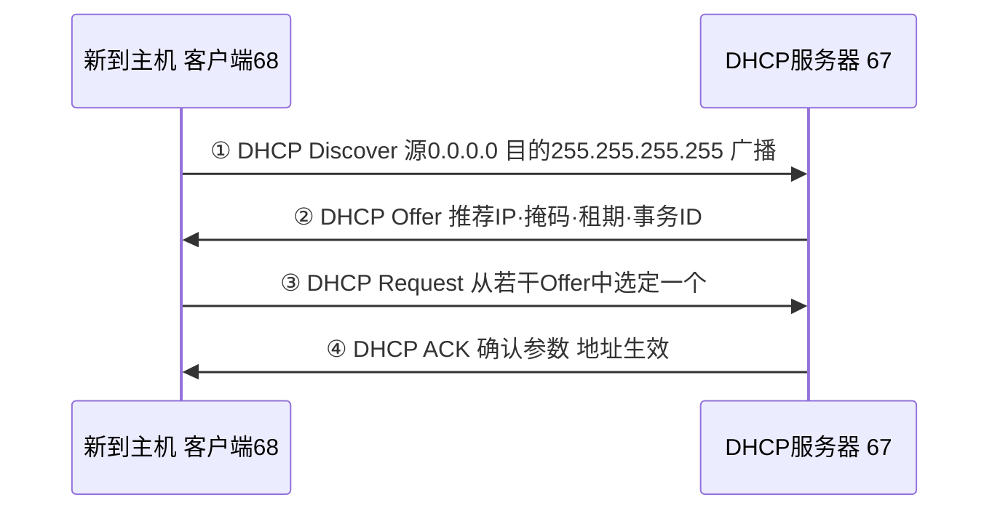

# 4.3 网络层：IP协议详解

## 目录

1. [IPv4数据报格式](#ipv4数据报格式)
2. [IPv4数据报分片](#ipv4数据报分片)
3. [IPv4编址](#ipv4编址)
4. [动态主机配置协议DHCP](#动态主机配置协议dhcp)
5. [网络地址转换NAT](#网络地址转换nat)
6. [典型例题解析](#典型例题解析)
7. [易错点分析](#易错点分析)
8. [IPv6协议](#ipv6协议)

---

## IPv4数据报格式

Internet的网络层分组称为**数据报**。IPv4数据报 = 固定 20 字节首部 + 可选选项（0–40 字节）+ 数据。下图每行 32 位，顶部刻度为比特位：

```
 0                   1                   2                   3
 0 1 2 3 4 5 6 7 8 9 0 1 2 3 4 5 6 7 8 9 0 1 2 3 4 5 6 7 8 9 0 1
+-------+-------+---------------+-------------------------------+
|版本(4)|首长(4)| 服务类型 (8)  |        总长度 (16)            |
+-------+-------+---------------+-----+-------------------------+
|         标识 (16)             |标志 |     片偏移 (13)         |
|                               |(3)  |                         |
+---------------+---------------+-----+-------------------------+
|   寿命 (8)    |   协议 (8)    |       首部检验和 (16)         |
+---------------+---------------+-------------------------------+
|                      源 IP 地址 (32)                          |
+---------------------------------------------------------------+
|                     目的 IP 地址 (32)                         |
+---------------------------------------------------------------+
|              选项 (0-40 字节，须补齐到 4 字节边界)            |
+---------------------------------------------------------------+
|                          数据 (变长)                          |
+---------------------------------------------------------------+
```

> 注：首部长度（IHL）以 **4 字节**为单位，最小 5（20 字节）、最大 15（60 字节），故选项最多 40 字节。片偏移以 **8 字节**为单位（见下文分片）。

### IPv4头部字段详解

**版本号(4比特)**：数据报使用的IP协议版本，IPv4为4。

**首部长度(4比特)**：以4字节为单位指出首部长度，用于确定数据部分的起始位置。无选项时为5（20字节）。

**服务类型(8比特)**：用来区分不同类型的IP数据报，现多用于DSCP差分服务与ECN显式拥塞通知。

**数据报长度(16比特)**：首部加数据的总长度，以字节计。字段16比特，故IP数据报最大长度为65535字节。

**标识、标志、片偏移(16+3+13比特)**：与IP分片有关，见下节。

**寿命TTL(8比特)**：确保数据报不会永远在网络中循环。每经过一台路由器减1，减为0时丢弃。

**协议(8比特)**：指示数据部分应交给哪个运输层协议，仅在数据报到达最终目标时使用。

> 常用协议号：6=TCP，17=UDP，1=ICMP，89=OSPF。

**首部检验和(16比特)**：帮助路由器检测首部中的比特错误。仅校验首部；因TTL逐跳变化，每跳都需重算。

**源和目的地址(各32比特)**：源在源地址字段填入自己的IP，在目的地址字段填入最终目标的IP。

**选项**：允许扩展首部，用于满足特殊需求，绝大多数数据报不含选项。

IP数据报的数据字段通常装载运输层报文段(TCP或UDP)，也可装载ICMP等其他数据。

---

## IPv4数据报分片

一个链路层帧能承载的最大数据量称为**最大传送单元(MTU)**。不同链路层协议的MTU不同：以太网1500字节，802.11约2300字节，某些点对点链路可达更大。

当IP数据报长度超过出链路的MTU时，需将其**分片(fragment)**后逐片发送。IPv4把分片的重组工作放在目标端系统，而不在中间路由器进行。

分片用到首部的三个字段：

- **标识(16比特)**：发送主机给每个数据报逐1递增赋值；同一数据报的所有片共享同一标识，供目标端拼装。
- **标志(3比特)**：仅2比特有效。
  - **DF（Don't Fragment）**：DF=1 表示禁止分片；若必须分片则丢弃并回送ICMP差错。
  - **MF（More Fragment）**：除最后一片外其余片置1，目标端据此判断是否收齐。
- **片偏移(13比特)**：该片数据在原数据报数据部分中的位置，**以8字节为单位**。

### 分片示例

数据报总长4000字节（含20字节首部，数据3980字节，标识=666），经MTU=1500的链路转发。

每片最多承载数据 = MTU − 首部 = 1500 − 20 = 1480 字节（1480 恰为8的倍数）。3980 字节按1480、1480、1020拆分：

```
原数据报: |首部20|========= 数据 3980 字节 =========|  标识=666 MF=0 偏移=0
                                  │
                                  ▼ 分片
片1: |首部20| 数据 1480 |   总长1500   MF=1  偏移=0     (字节 0~1479)
片2: |首部20| 数据 1480 |   总长1500   MF=1  偏移=185   (字节 1480~2959, 1480/8)
片3: |首部20| 数据 1020 |   总长1040   MF=0  偏移=370   (字节 2960~3979, 2960/8)
```

各片标识均为666、DF=0；MF逐片为1、1、0，目标端收到MF=0且偏移连续无缺口即完成重组。

> 易混：片偏移以**8字节**为单位，不是字节。故除最后一片外，每片的数据长度必须是8的整数倍。

---

## IPv4编址

### IP地址基础

主机和路由器接口的IP地址与该接口相关联。

> **接口**
> 
> 接口是主机/路由器和物理链路之间的边界。路由器通常有多个接口，主机通常只有一个或两个接口。

**IP地址格式**：IPv4地址长度为32比特（4字节），通常用**点分十进制记法**书写，如223.1.1.1，每个十进制数对应一个字节（0~255）。

> 易混：私有地址（RFC 1918）不在公网路由，仅用于内网，配合NAT访问互联网。三段为：
> - 10.0.0.0/8（10.0.0.0 ~ 10.255.255.255）
> - 172.16.0.0/12（172.16.0.0 ~ 172.31.255.255）
> - 192.168.0.0/16（192.168.0.0 ~ 192.168.255.255）

### 子网

> **子网**
> 
> 不经过路由器即可直接互连的一组接口构成一个**子网**。它们的IP地址有相同的高位前缀。

例如三台主机和一台路由器接口同处一个子网，地址形如 223.1.1.xxx，最左24比特相同：

```
        子网 223.1.1.0/24
 ┌──────────┬──────────┬──────────┐
 |223.1.1.1 |223.1.1.2 |223.1.1.3 |  ← 主机
 └────┬─────┴────┬─────┴────┬─────┘
      └──────────┴──────────┴── 223.1.1.4 (路由器接口) ── 其他子网
```

#### 子网掩码

子网地址记为 223.1.1.0/24。/24 是**前缀长度**，指出最左24比特为网络部分；等价的点分十进制**子网掩码**为 255.255.255.0（网络位为1、主机位为0）。

确定子网的方法：拆开每个主机/路由器接口，由直连互通的接口围成的每个孤立网络即为一个子网。

### 无类别域间路由(CIDR)

Internet的地址分配策略被称为**无类别域间路由(CIDR)**。

> **CIDR**
> 
> CIDR把32比特地址划分为前缀和主机两部分，记为 a.b.c.d/x，其中 x 是前缀比特数。前缀标识网络/子网，剩余 32−x 比特标识主机。

```
a.b.c.d / x
┌─────────────────────────┬────────────────────┐
│   网络前缀 (x 比特)      │  主机部分 (32-x 比特)│
└─────────────────────────┴────────────────────┘
 主机位全 0 → 网络地址      主机位全 1 → 广播地址
```

由此得到常用计算（设前缀长度为 x）：

$$\text{地址总数} = 2^{32-x},\qquad \text{可用主机数} = 2^{32-x} - 2$$

减2是因为主机位全0为网络地址、全1为广播地址，均不能分配给主机。

**地址聚合**：一个前缀 a.b.c.d/x 可在转发表中代表整块 $2^{32-x}$ 个地址，从而显著缩短转发表。多个连续子网若能合并为更短的前缀，即为CIDR聚合。

### 获取主机地址

#### 获取地址块

组织通常从ISP的地址空间获得一块地址。例如ISP拥有 200.23.16.0/20（$2^{12}=4096$ 个地址），可从中切出 200.23.16.0/29（8个地址，6个可用主机）分配给一个小型组织。

#### 获得Internet地址块

ISP从**Internet名字和编号分配机构(ICANN)**获得IP地址。ICANN不仅分配IP地址，还管理DNS根服务器，分配域名，解决域名争端。

#### 主机获得地址：DHCP

主机地址可以手工配置，但更多时候使用**动态主机配置协议(DHCP)**。

---

## 动态主机配置协议DHCP

DHCP允许主机自动获取IP地址。它建立在UDP之上：客户端口68，服务器端口67。配置时既可让某主机每次接入都得到固定IP，也可分配**临时IP地址**（带租期）。

DHCP交互分四步，常记作 **DORA**（Discover、Offer、Request、ACK）：


```mermaid
sequenceDiagram
    participant C as 新到主机 客户端68
    participant S as DHCP服务器 67
    C->>S: ① DHCP Discover 源0.0.0.0 目的255.255.255.255 广播
    S->>C: ② DHCP Offer 推荐IP·掩码·租期·事务ID
    C->>S: ③ DHCP Request 从若干Offer中选定一个
    S->>C: ④ DHCP ACK 确认参数 地址生效
```

| 步骤 | 报文 | 方向 | 关键内容 |
|------|------|------|----------|
| ① 发现 | Discover | 客户端广播 | 源 0.0.0.0，目的 255.255.255.255 |
| ② 提供 | Offer | 服务器→客户端 | 事务ID、推荐IP、掩码、地址租期 |
| ③ 请求 | Request | 客户端→服务器 | 从多个Offer中选定一个 |
| ④ 确认 | ACK | 服务器→客户端 | 证实参数，地址正式分配 |

DHCP的价值：支持主机即插即用地加入/离开网络，移动用户接入新子网时自动获址，离开后地址可被回收复用。

---

## 网络地址转换NAT

> **网络地址转换(NAT)**
> 
> NAT在数据报经过路由器时改写其源/目的IP地址（及端口），让内网多台主机共用少量公网IP访问互联网。

### 背景

IPv4地址约43亿（$2^{32}$），实际可用更少，1990年代起逐渐紧张。CIDR提升了分配效率、IPv6是根本方案但部署缓慢，NAT则借助私有地址段实现地址复用，成为最普及的过渡手段。

家用路由器即典型NAT设备：对内是私网网关（如10.0.0.0/24），对外只占用ISP分配的一个公网IP。

```
   内网 (私有地址)                NAT路由器              互联网
 10.0.0.1 ──┐
 10.0.0.2 ──┼──► [ 改写源IP:端口 ] ──► 公网IP 203.0.113.1 ──► 8.8.8.8 ...
 10.0.0.3 ──┘        NAT转换表
```

### NAT类型

**静态NAT**：内网IP与公网IP一对一固定映射，常用于对外发布内网服务器。需占用同样多的公网IP。

```
10.0.0.1 ←→ 203.0.113.1
10.0.0.2 ←→ 203.0.113.2
```

**动态NAT**：内网IP从公网IP池中临时借用一个地址，用完归还。公网IP可复用，但同时在线数受池大小限制。

**NAPT（端口地址转换，又称PAT）**：多个内网地址共享一个公网IP，靠端口号区分会话。这是家用/小型网络最常见的形态，也是平时所说"NAT"通常指的对象。

```
内网地址:端口        公网地址:端口
10.0.0.1:1234   →   203.0.113.1:5001
10.0.0.1:1235   →   203.0.113.1:5002
10.0.0.2:1234   →   203.0.113.1:5003
```

**NAT转换表**（每个会话一行，由出站首包建立、空闲超时后删除）：

| 内网IP:端口 | 公网IP:端口 | 协议 | 状态/超时 |
|-------------|-------------|------|-----------|
| 10.0.0.1:1234 | 203.0.113.1:5001 | TCP | ESTABLISHED |
| 10.0.0.2:53 | 203.0.113.1:5002 | UDP | 300s |
| 10.0.0.3:80 | 203.0.113.1:5003 | TCP | SYN_SENT |

### 工作机制

NAT靠转换表把"内网IP:端口"与"公网IP:端口"对应起来。出站首包到达时建表，入站包据表反向还原：

```
出站  10.0.0.5:1234 → 8.8.8.8:80
      └─ NAT改源 ──► 203.0.113.1:5001 → 8.8.8.8:80     (建表项, 重算校验和)

入站  8.8.8.8:80 → 203.0.113.1:5001
      └─ NAT查表改目的 ──► 8.8.8.8:80 → 10.0.0.5:1234   (重算校验和)
```

关键点：

- NAT改写IP/端口后必须**重算IP与TCP/UDP校验和**（校验和覆盖了被改的字段）。
- 出站包负责建立表项，入站包只能命中已有表项；因此外部主机**无法主动**发起到内网的连接（除非配置端口转发/DMZ）。

### NAT穿透

由于外部无法主动连入，P2P应用需借助穿透技术建立直连：

- **STUN**：客户端向STUN服务器发包，服务器回报其在NAT外侧的公网地址:端口，使客户端获知自己的映射地址。
- **TURN**：当双方NAT无法直连（如对称NAT）时，由TURN服务器中继转发全部流量，必然连通但占用中继带宽。
- **UPnP**：应用主动请求NAT设备开放并映射端口，常见于游戏和P2P软件。

> 易混：NAT**不是安全机制**。它隐藏内网拓扑只是副作用，本身不做访问控制；真正的防护来自防火墙。

### NAT对应用的影响

- **HTTP/HTTPS**：几乎无影响，客户端主动发起、端口固定。
- **P2P**：影响大，两端都在NAT后时无法直连，需STUN/TURN等穿透。
- **VoIP**：SIP信令携带的地址需ALG改写，RTP媒体流需端口映射，配置不当会单通或无声。

### 典型例题：NAT工作过程

> **题目**：某公司内网为192.168.1.0/24，NAT路由器外网IP为203.0.113.1。内网主机192.168.1.10:1234向外网服务器8.8.8.8:80建立TCP连接。描述NAT的完整工作过程。

**解答**：

**第一步：出站数据包转换**
```
原始数据包：
- 源IP：192.168.1.10    源端口：1234
- 目的IP：8.8.8.8       目的端口：80

NAT处理：
- 创建NAT表项：192.168.1.10:1234 ←→ 203.0.113.1:5001
- 修改源地址：203.0.113.1:5001
- 重新计算IP和TCP校验和

转换后数据包：
- 源IP：203.0.113.1     源端口：5001  
- 目的IP：8.8.8.8       目的端口：80
```

**第二步：入站数据包转换**
```
服务器响应：
- 源IP：8.8.8.8         源端口：80
- 目的IP：203.0.113.1   目的端口：5001

NAT处理：
- 查找NAT表：5001 → 192.168.1.10:1234
- 修改目标地址：192.168.1.10:1234
- 重新计算校验和

转换后数据包：
- 源IP：8.8.8.8         源端口：80
- 目的IP：192.168.1.10  目的端口：1234
```

### NAT的优缺点

**优点**：缓解IPv4地址短缺、内网设备不直接暴露、内网重新编号无需改动公网侧。

**缺点**：破坏端到端透明性（违背互联网端到端原则）、部分应用需ALG等特殊处理、转换与状态维护带来开销、P2P通信复杂化。

NAT虽被诟病违背端到端原则，但凭借部署简单已成为互联网基础设施的一部分；在IPv6完全普及前仍将长期存在，NAT64等技术还在继续扩展其用途。

---

## 典型例题解析

### 例题4.5：IPv4数据报分片

**题目**：一个IP数据报长度为3820字节（含20字节IP首部），通过MTU为1500字节的网络。给出分片结果（标识取100）。

**解析**：

数据部分 = 3820 − 20 = 3800字节。每片最多承载数据 = MTU − 首部 = 1500 − 20 = 1480字节，且 1480 是8的倍数，可直接用作前几片的载荷。3800 按 1480、1480、840 拆分：

| 片 | 数据(字节) | 总长 | 字节范围 | 片偏移 | MF |
|----|-----------|------|----------|--------|----|
| 1 | 1480 | 1500 | 0~1479 | 0 | 1 |
| 2 | 1480 | 1500 | 1480~2959 | 185 (1480/8) | 1 |
| 3 | 840 | 860 | 2960~3799 | 370 (2960/8) | 0 |

各片标识均为100、DF=0。注意片偏移按8字节计；前两片载荷恰为1480（8的倍数），无需向下取整到更小的8倍数。

### 例题4.6：子网划分

**题目**：给定IP地址块128.119.40.0/24，要求划分为4个相等的子网。

**解析**：

原网络 128.119.40.0/24 有8位主机位。划分4个子网需借2位主机位作子网号（$2^2=4$），前缀变为 24+2 = /26，每个子网含 $2^6=64$ 个地址、可用主机 $2^6-2=62$。

| 子网 | 网络地址/前缀 | 地址范围 | 可用主机 | 广播地址 |
|------|--------------|----------|----------|----------|
| 1 | 128.119.40.0/26 | .0 ~ .63 | .1 ~ .62 | .63 |
| 2 | 128.119.40.64/26 | .64 ~ .127 | .65 ~ .126 | .127 |
| 3 | 128.119.40.128/26 | .128 ~ .191 | .129 ~ .190 | .191 |
| 4 | 128.119.40.192/26 | .192 ~ .255 | .193 ~ .254 | .255 |

（范围列省略前缀 128.119.40.，每子网62个可用主机。）

---

## 易错点分析

**片偏移的单位**：偏移以**8字节**为单位，不是字节，需把字节偏移量除以8。13位偏移字段若以字节计最多表示8191字节，远小于65535的最大数据报长度，故只能以8字节为单位。除最后一片外，每片数据长度须为8的倍数。

**网络地址与广播地址不可用**：并非块内所有地址都能分给主机。主机位全0为网络地址、全1为广播地址，二者都不能分配，故可用主机数 = 地址总数 − 2。

**前缀长度的含义**：/24 表示前24位是网络部分、后8位是主机部分，可有 $2^8-2=254$ 台主机；不是"网络有24台主机"。

**NAT不是安全机制**：NAT隐藏内网拓扑只是副作用，本身不提供访问控制，安全防护应由防火墙承担。

---

## IPv6协议

IPv4地址（32位、约43亿）逐渐枯竭，NAT、CIDR只能缓解，IPv6把地址扩展到**128位**（约 $3.4\times10^{38}$）作为根本方案。除地址空间外，IPv6还简化了首部以加快转发、原生支持IPsec、用流标签支持QoS、改进了地址自动配置与移动性。

### IPv6地址结构

#### 地址格式

128位，分为8组、每组4个十六进制数字：
```
2001:0db8:85a3:0000:0000:8a2e:0370:7334
```

**简化规则**：
1. **前导零省略**：每组内的前导零可省，`0db8` 写成 `db8`。
2. **连续零块压缩**：连续的全零组用 `::` 代替，全文**仅能用一次**（否则无法还原零的数量）。

```
2001:0db8:0000:0000:0000:0000:0370:7334  →  2001:db8::370:7334
```

#### 地址类型

IPv6取消了广播，只有单播、组播、任播三类。

| 类型 | 典型地址/前缀 | 说明 |
|------|--------------|------|
| 单播 全局 | 2000::/3 | 公网可路由地址（以二进制001开头） |
| 单播 链路本地 | fe80::/10 | 仅在本链路有效，自动配置时使用 |
| 单播 回环 | ::1 | 等价于IPv4的127.0.0.1 |
| 单播 未指定 | :: | 等价于IPv4的0.0.0.0 |
| 组播 | ff00::/8 | ff02::1=所有节点，ff02::2=所有路由器 |
| 任播 | 同单播 | 语法同单播，路由到最近的一个成员 |

#### 地址分配与接口标识符

全局单播地址通常按层次划分：前48位全局前缀（ISP分配）+ 16位子网ID（组织内划分）+ 64位接口标识符。

接口标识符可用 **EUI-64** 从48位MAC地址导出：在MAC中间插入 `FFFE`，再翻转第7位（U/L位）。

```
MAC:      00:1B:77:49:54:FD
插入FFFE: 00:1B:77:FF:FE:49:54:FD
翻转U/L:  02:1B:77:FF:FE:49:54:FD   (首字节 00 → 02)
```

### IPv6数据报格式

IPv6首部**固定40字节**，去掉了IPv4的首部长度、标识/标志/片偏移、首部检验和等字段，选项移入扩展头部。每行32位：

```
 0                   1                   2                   3
 0 1 2 3 4 5 6 7 8 9 0 1 2 3 4 5 6 7 8 9 0 1 2 3 4 5 6 7 8 9 0 1
+-------+---------------+---------------------------------------+
|版本(4)| 业务类别 (8)  |            流标签 (20)                |
+-------+---------------+---------------+-------+---------------+
|        载荷长度 (16)          | 下一头部 (8)  | 跳数限制 (8)  |
+-------------------------------+---------------+---------------+
|                                                               |
+                      源地址 (128)                             +
|                                                               |
+---------------------------------------------------------------+
|                                                               |
+                     目的地址 (128)                            +
|                                                               |
+---------------------------------------------------------------+
```

> 对比IPv4：IPv6首部字段更少更整齐，路由器无需逐跳重算检验和、也不分片，转发更快。

#### 字段详解

**版本(Version, 4位)**：固定值6

**业务类别(Traffic Class, 8位)**：
- 类似IPv4的TOS字段
- 用于QoS标记和拥塞控制
- 前6位：DSCP（差分服务）
- 后2位：ECN（显式拥塞通知）

**流标签(Flow Label, 20位)**：标识同一流的数据报，便于路由器对流做统一处理，0表示无特殊流。

**载荷长度(Payload Length, 16位)**：基本头部之后的字节数，最大65535（更大时用逐跳选项中的超大载荷）。

**下一头部(Next Header, 8位)**：指明紧随其后的头部类型（扩展头部或运输层协议），取值与IPv4协议字段相同，可链式串联多个扩展头部。

**跳数限制(Hop Limit, 8位)**：等价于IPv4的TTL，每经一台路由器减1，为0时丢弃。

**源地址、目的地址**：各128位。

#### IPv6扩展头部

IPv4的选项被移到独立的**扩展头部**中，通过下一头部字段链式串联。Next Header 与IPv4协议号共用同一编号空间，因此既可指向扩展头部，也可指向上层协议：

| Next Header值 | 含义 | 类别 |
|---------------|------|------|
| 0 | 逐跳选项 | 扩展头部（每跳处理） |
| 43 | 路由 | 扩展头部（源路由） |
| 44 | 分片 | 扩展头部（分片信息，源端使用） |
| 60 | 目标选项 | 扩展头部（终点处理） |
| 6 | TCP | 上层协议 |
| 17 | UDP | 上层协议 |

扩展头部链示例：

```
IPv6基本头部 → 逐跳选项 → 路由头部 → 分片头部 → TCP数据
  Next=0       Next=43    Next=44     Next=6
```

### IPv6地址配置

#### 无状态地址自动配置(SLAAC)

主机无需DHCP即可自行配置地址，依赖邻居发现协议(NDP)：

1. 用 fe80::/64 加接口标识符生成**链路本地地址**；
2. 做**重复地址检测(DAD)**确认该地址在本链路唯一；
3. 发路由器请求(RS)，从路由器通告(RA)获得**全局前缀**与默认路由器；
4. 前缀加接口标识符组成**全局单播地址**。

其中DAD通过邻居请求/通告完成：

```mermaid
sequenceDiagram
    participant H as 新主机
    participant N as 本链路其他节点
    H->>N: 邻居请求 询问是否有人在用此地址
    N-->>H: 邻居通告 仅当地址已被占用
    Note over H: 收到通告则冲突放弃; 无响应则地址可用
```

#### DHCPv6

- **有状态**：DHCPv6服务器集中分配地址并维护分配记录，支持回收与续期。
- **无状态**：地址仍由SLAAC获得，DHCPv6只补充DNS服务器、域名等其他参数。

DHCPv6主要消息：Solicit（客户端找服务器）、Advertise（服务器响应）、Request（请求配置）、Reply（下发配置）。

### IPv6与IPv4对比

| 特性 | IPv4 | IPv6 |
|------|------|------|
| 地址长度 | 32位 | 128位 |
| 首部大小 | 20-60字节(可变) | 40字节(固定) |
| 地址表示 | 点分十进制 | 十六进制分组 |
| 广播 | 支持 | 不支持(用组播替代) |
| 分片 | 源端或中间路由器 | 仅源端 |
| 校验和 | 有首部检验和(逐跳重算) | 无首部检验和 |
| 地址解析 | ARP | 邻居发现(NDP) |
| 地址配置 | 手动/DHCP | SLAAC/DHCPv6 |
| QoS | TOS字段 | 业务类别+流标签 |

### IPv4到IPv6过渡技术

三类思路：双栈、隧道、翻译。

**双栈（Dual Stack）**：设备同时运行IPv4与IPv6两套协议栈，按目标地址类型选用对应版本，应用无需改动。最简单、兼容性最好，但要维护两套栈且仍占用IPv4地址。

**隧道（Tunneling）**：把IPv6数据报封装进IPv4数据报，穿越纯IPv4网络后再解封装，记为 `[IPv4首部 | IPv6首部 | IPv6载荷]`。常见有6to4（前缀2002::/16，把IPv4地址嵌入IPv6地址实现自动隧道）、Teredo（用UDP封装以穿越NAT）。

**翻译（Translation）**：在IPv6与IPv4之间直接转换协议头。NAT64在网关处把IPv6报文翻译为IPv4报文，配合DNS64为IPv4服务器合成AAAA记录，使纯IPv6客户端能访问IPv4服务器。

### IPv6部署现状

IPv6已在主干网、移动网络和主流操作系统中广泛支持，但全球普及仍在推进。推进缓慢的主要原因：

- 设备、网管工具与安全设备需升级，更新有成本；
- NAT等临时方案延长了IPv4寿命，削弱了迁移动力；
- 用户对IPv4/IPv6切换无感，内容方与运营方动力不足。

### IPv6典型例题

**例题1：地址简写**

> 将 `2001:0db8:0000:0000:0000:0000:0000:0001` 标准化简写。

去前导零得 `2001:db8:0:0:0:0:0:1`，再用 `::` 压缩最长的连续零块得 `2001:db8::1`。

**例题2：首部解析**

> 某IPv6数据报基本首部前8字节为 `6000 1234 05DC 06`，解析各字段。

```
6000 1234：版本=6，业务类别=0x00，流标签=0x01234
05DC：载荷长度 = 1500 字节
06：下一头部 = 6，即上层为 TCP
```

**例题3：SLAAC获址过程**

> 描述IPv6主机通过SLAAC获得全局单播地址的过程。

1. 用 fe80::/64 前缀加接口标识符生成链路本地地址；
2. 发邻居请求做重复地址检测(DAD)，确认地址未冲突；
3. 发路由器请求，从路由器通告中获得网络前缀；
4. 网络前缀加接口标识符生成全局单播地址，再次DAD验证。

---

**继续学习**：[4.4 通用转发与SDN数据平面](4.4网络层：通用转发与SDN.md)