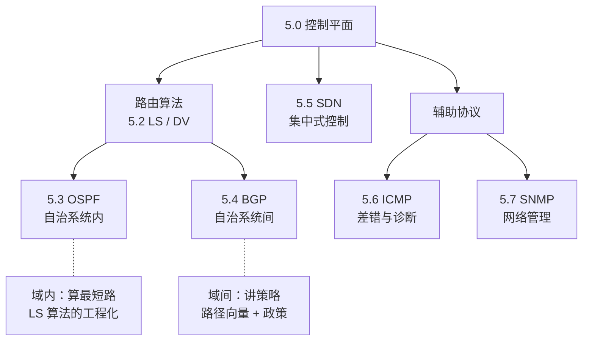

# 5.0 网络层：控制平面

> 第 4 章讲的数据平面，是单台路由器拿到分组后查表转发的局部动作。但转发表本身从哪来？这就是控制平面的事：在全网范围内算出每台路由器的转发表。本章先讲路由算法（链路状态 LS、距离向量 DV）这套数学内核，再看它落地成实际协议——域内的 OSPF、域间的 BGP；接着是把控制逻辑从路由器抽出、集中到控制器的 SDN；最后是两个辅助协议：报告差错的 ICMP 和管理网络的 SNMP。

## 数据平面 vs 控制平面（承接第 4 章）

| | 数据平面（第 4 章） | 控制平面（本章） |
|---|---|---|
| 职责 | 转发：分组到达后查表，送往某个输出端口 | 路由选择：算出端到端路径，生成转发表 |
| 作用范围 | 单台路由器、局部动作 | 全网范围、整体视角 |
| 时间尺度 | 纳秒级，逐分组处理 | 毫秒到秒级，拓扑变化时更新 |
| 实现 | 路由器硬件 | 路由算法，可在路由器内（传统）或集中控制器中（SDN） |

> 易混：转发（forwarding）vs 路由选择（routing）。转发是数据平面"分组进来往哪个口送"的局部动作；路由选择是控制平面"先算好整条路径"的全局计算。转发表是两者的接口——控制平面写入，数据平面查询。

控制平面有两种组织方式，本章都会讲：

```
传统（每路由器）              SDN（逻辑集中）
┌──────────┐                ┌──────────────┐
│ 路由器    │                │  远程控制器   │ ← 软件计算全部转发表
│ ┌──────┐ │                └──────┬───────┘
│ │路由算法│ │  路由器间                │ 下发流表
│ └──┬───┘ │  交换信息              ┌───┴───┐
│  转发表   │ ←──────→ …            转发表    转发表  （路由器只剩数据平面）
└──────────┘                      路由器     路由器
每台自己算，分布式协作          算法集中在控制器，路由器只执行
```

## 本章脉络



> 阅读顺序：5.1 先把控制平面的职责、两种组织方式（传统分布式 / SDN 集中式）讲清楚；5.2 是算法内核——LS（全局信息 + Dijkstra）与 DV（局部信息 + Bellman-Ford）；5.3、5.4 是算法的落地：OSPF 在一个自治系统内部算最短路，BGP 在自治系统之间按策略选路；5.5 看 SDN 如何把控制逻辑集中到控制器；5.6、5.7 是两个支撑协议，ICMP 报告差错（ping、traceroute 的底层），SNMP 用于网络管理。
>
> 注：LS/DV 是"算法"，OSPF/BGP 是"协议"。算法是思路，协议是把思路加上报文格式、定时器、邻居发现后能在真实网络跑起来的完整规范——OSPF 本质就是 LS 算法的工程实现。

## 章节目录

- **[5.1 网络层：控制平面概述](5.1网络层：控制平面概述.md)**
  - 控制平面的功能与作用
  - 路由选择算法分类
  - 传统路由 vs 软件定义网络

- **[5.2 网络层：路由选择算法](5.2网络层：路由选择算法.md)**
  - 链路状态（LS）算法：Dijkstra
  - 距离向量（DV）算法：Bellman-Ford
  - 两种算法的对比

- **[5.3 网络层：OSPF协议](5.3网络层：OSPF协议.md)**（自治系统内部路由）
  - OSPF 基本原理（LS 算法的落地）
  - 层次化 OSPF 设计
  - 消息类型与操作

- **[5.4 网络层：BGP协议](5.4网络层：BGP协议.md)**（自治系统间路由）
  - BGP 功能与特点
  - 路由通告与选择
  - 路由策略与政策控制
  - IP 任播

- **[5.5 网络层：SDN控制平面](5.5网络层：SDN控制平面.md)**
  - SDN 控制器与控制应用
  - 控制平面与数据平面的交互
  - SDN 的发展

- **[5.6 网络层：ICMP协议](5.6网络层：ICMP协议.md)**
  - ICMP 报文格式与类型
  - 网络诊断工具原理（ping、traceroute）
  - 差错报告与信息查询

- **[5.7 网络层：网络管理与SNMP](5.7网络层：网络管理与SNMP.md)**
  - 网络管理框架
  - SNMP 协议机制
  - 网络监控与故障诊断

---

**开始学习：[5.1 网络层：控制平面概述](5.1网络层：控制平面概述.md)**
