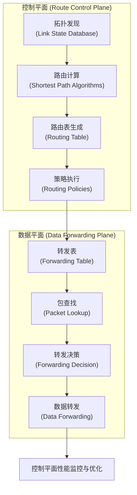
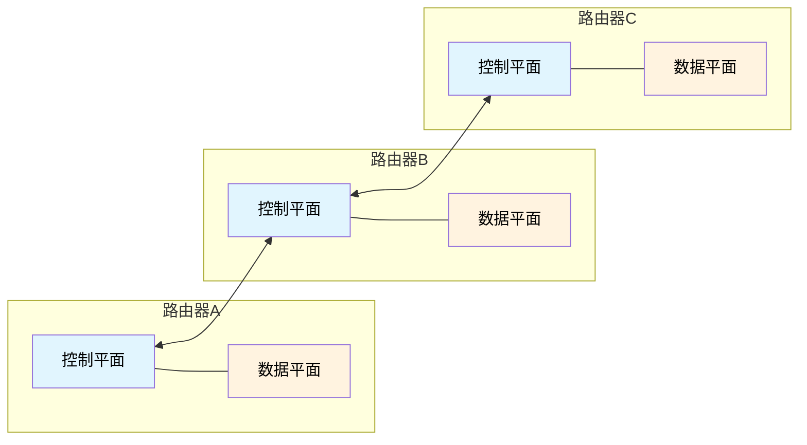
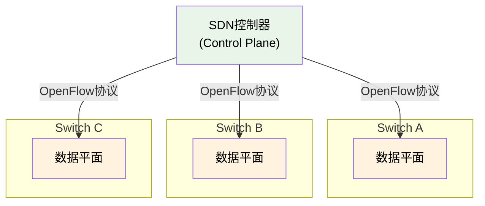
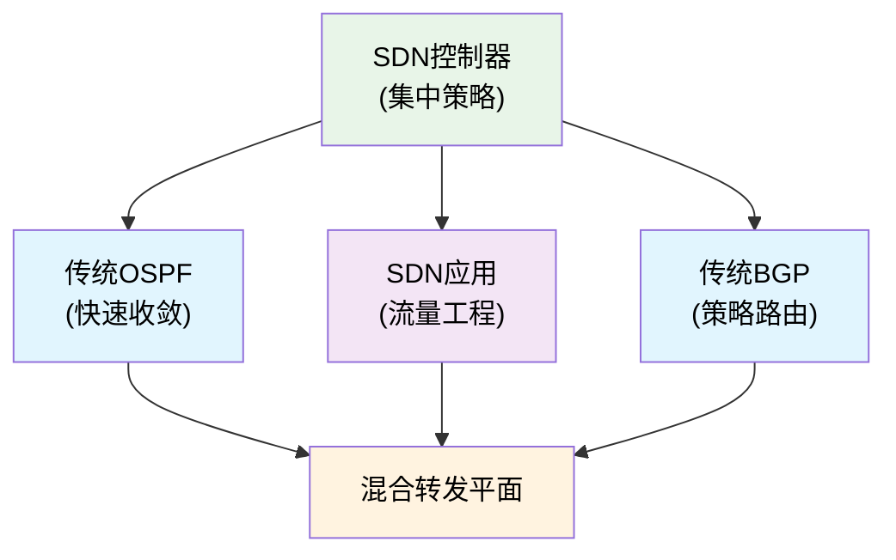

# 5.1 网络层：控制平面概述

## 目录

1. [控制平面的基本功能](#控制平面的基本功能)
2. [路由选择的基本概念](#路由选择的基本概念)
3. [路由算法的分类](#路由算法的分类)
4. [传统路由与SDN路由](#传统路由与sdn路由)


---

## 控制平面的基本功能

### 控制平面的定义与作用

> **网络层控制平面**
> 
> 负责确定数据包从源主机到目标主机应该采取的路径，是网络路由决策的核心，控制着整个网络的数据流向。

**控制平面的核心任务**：


数据包路由的完整过程：

```
主机A (192.168.1.100)
    ↓ 1. 路由查询
路由表 (控制平面决策结果)
    ↓ 2. 下一跳决策
路由器R1 → 路由器R2 → 路由器R3
    ↓ 3. 转发执行(数据平面)
主机B (192.168.2.200)
```

控制平面职责：
• 维护网络拓扑信息
• 计算最优路径
• 构建和更新路由表
• 处理网络变化


### 控制平面与数据平面的协同

**功能分工对比**：

| 功能维度 | 控制平面 | 数据平面 |
|----------|----------|----------|
| **主要任务** | 计算路由路径 | 转发数据包 |
| **时间尺度** | 秒到分钟级 | 纳秒到微秒级 |
| **处理频率** | 拓扑变化时 | 每个数据包 |
| **复杂度** | 算法复杂 | 查表简单 |
| **实现位置** | 软件实现 | 硬件加速 |
| **典型协议** | OSPF、BGP | IPv4转发 |

**协同工作机制**：



### 控制平面的组织方式

**两种主要控制模式**：

1. **传统分布式控制**：



**特点**：
- 每个路由器独立运行控制算法
- 通过路由协议交换信息
- 分布式决策，分布式执行

2. **SDN集中式控制**：



**特点**：
- 控制逻辑集中在控制器
- 交换机仅执行转发功能
- 全局视图，统一决策

---

## 路由选择的基本概念

### 路由与转发的区别

**概念辨析**：

| 概念 | 英文 | 定义 | 作用范围 | 时间特征 |
|------|------|------|----------|----------|
| **路由选择** | Routing | 确定数据包的传输路径 | 端到端路径 | 相对静态 |
| **转发** | Forwarding | 将数据包从输入端口移动到输出端口 | 单个路由器 | 实时动态 |

**形象比喻**：
- **路由选择**：就像GPS导航规划从北京到上海的完整路线
- **转发**：就像司机在每个路口根据指示牌选择具体出口

### 路由的基本要素

**路由决策的核心要素**：

1. **网络拓扑**：
   ```
   网络图表示：
   G = (V, E)
   • V: 顶点集合（路由器）
   • E: 边集合（链路）
   • W: 权重函数（链路代价）
   
   示例拓扑：
        A ──2── B
        │ \     │
        3   4   1
        │     \ │
        D ──1── C
   ```

2. **链路代价**：
   - **距离**：物理距离或跳数
   - **带宽**：链路容量的倒数  
   - **延迟**：传播时延和排队时延
   - **负载**：链路利用率
   - **可靠性**：链路错误率

3. **路由度量**：
   ```
   常用路由度量：
   • 跳数 (Hop Count): 简单但不精确
   • 带宽 (Bandwidth): 反映传输能力
   • 延迟 (Delay): 影响实时应用
   • 负载 (Load): 动态反映拥塞状况
   • 可靠性 (Reliability): 影响服务质量
   • 成本 (Cost): 综合多个因素
   ```

### 最优路由的含义

**最优性的不同定义**：

1. **最短路径**：总代价最小
   $$\text{Cost}(路径) = \sum_{i} w(e_i)$$

2. **最大带宽路径**：瓶颈带宽最大
   $$\text{Bandwidth}(路径) = \min_{i} BW(e_i)$$

3. **最小延迟路径**：端到端延迟最小
   $$\text{Delay}(路径) = \sum_{i} delay(e_i)$$

4. **负载均衡路径**：分散流量负载
   $$\text{Load}(路径) = f(\text{当前负载分布})$$

**多目标优化的挑战**：
不同的优化目标往往相互冲突，需要根据应用需求做出权衡选择。

---

## 路由算法的分类

### 按信息完整性分类

#### 1. 全局路由算法 (Global Routing Algorithm)

> **链路状态算法 (Link State Algorithm)**
> 
> 每个路由器都拥有完整的网络拓扑信息，基于全局信息计算最短路径。

**特征**：
- **信息获取**：通过链路状态通告(LSA)获得全网拓扑
- **计算方式**：每个节点独立运行Dijkstra算法
- **代表协议**：OSPF、IS-IS
- **优点**：收敛快速，无路由环路
- **缺点**：内存开销大，计算复杂度高

**工作原理**：
```
链路状态算法步骤：
1. 发现邻居 → 建立邻接关系
2. 测量链路代价 → 获得链路状态信息  
3. 洪泛LSA → 传播链路状态到全网
4. 构建拓扑数据库 → 形成全局网络视图
5. 运行SPF算法 → 计算最短路径树
6. 生成路由表 → 确定转发路径
```

#### 2. 分布式路由算法 (Distributed Routing Algorithm)

> **距离向量算法 (Distance Vector Algorithm)**
> 
> 每个路由器只知道到各目标的最佳距离和下一跳，通过与邻居交换距离信息逐步收敛。

**特征**：
- **信息获取**：仅从直接邻居处获得距离向量
- **计算方式**：基于Bellman-Ford方程进行分布式计算
- **代表协议**：RIP、BGP、EIGRP
- **优点**：简单实现，内存开销小
- **缺点**：收敛慢，可能产生路由环路

**Bellman-Ford方程**：
$$d_x(y) = \min_v \{c(x,v) + d_v(y)\}$$

其中：
- $d_x(y)$：从节点x到节点y的最小代价
- $c(x,v)$：从x到邻居v的链路代价
- $d_v(y)$：从邻居v到y的最小代价

### 按动态性分类

#### 1. 静态路由算法 (Static Routing Algorithm)

**特征**：
- 路由表手工配置，很少改变
- 不会自动适应网络拓扑变化
- 计算简单，开销小
- 适用于小型、稳定的网络

**应用场景**：
```
静态路由适用情况：
• 小型企业网络
• 网络拓扑简单且稳定
• 安全性要求高的网络
• 备份路径配置
```

#### 2. 动态路由算法 (Dynamic Routing Algorithm)

**特征**：
- 根据网络拓扑变化自动调整路由
- 需要运行路由协议交换信息
- 计算复杂，但适应性强
- 适用于大型、变化频繁的网络

**动态适应机制**：
```
网络变化的处理：
1. 链路故障检测
   ├── Hello消息超时
   ├── 接口状态变化
   └── BFD快速检测

2. 拓扑信息更新
   ├── 生成新的LSA
   ├── 洪泛到相关区域
   └── 更新拓扑数据库

3. 路由重新计算
   ├── 触发SPF计算
   ├── 生成新的路由表
   └── 安装最佳路由

4. 收敛完成
   ├── 网络状态稳定
   ├── 路由表一致
   └── 数据正常转发
```

### 按负载敏感性分类

#### 1. 负载敏感算法 (Load-Sensitive Algorithm)

**特征**：
- 链路代价反映当前流量负载
- 路由选择考虑实时网络状况
- 能够实现负载均衡
- 但可能导致路由振荡

**负载均衡策略**：
| 策略类型 | 实现方法 | 优点 | 缺点 |
|----------|----------|------|------|
| **等价路径负载均衡** | ECMP分发 | 简单有效 | 路径数量有限 |
| **不等价路径负载均衡** | 按比例分配 | 充分利用资源 | 实现复杂 |
| **动态负载均衡** | 实时调整权重 | 适应性强 | 可能振荡 |

#### 2. 负载不敏感算法 (Load-Insensitive Algorithm)

**特征**：
- 链路代价与当前负载无关
- 基于相对稳定的网络参数
- 避免因负载变化导致的路由振荡
- 大多数实际路由协议采用此方式

**代价计算示例**：
```
OSPF链路代价计算：
Cost = 参考带宽 / 接口带宽

示例：
• 参考带宽 = 100 Mbps
• GE接口 (1000 Mbps): Cost = 100/1000 = 1
• FE接口 (100 Mbps): Cost = 100/100 = 1  
• E1接口 (2 Mbps): Cost = 100/2 = 50
```

---

## 传统路由与SDN路由

### 传统分布式路由的特点

**优势**：
1. **鲁棒性强**：单点故障不影响整体网络
2. **扩展性好**：每个节点独立处理，无中心瓶颈
3. **标准化程度高**：OSPF、BGP等成熟协议
4. **部署简单**：无需额外的控制基础设施

**局限性**：
1. **管理复杂**：需要在每个设备上配置协议
2. **策略实施困难**：缺乏全局统一的策略视图
3. **创新受限**：协议标准化进程缓慢
4. **故障诊断难**：分布式状态难以统一监控

### SDN集中式路由的特点

**优势**：
1. **全局优化**：基于完整网络视图做出最优决策
2. **策略统一**：集中制定和实施网络策略
3. **快速创新**：软件实现便于功能扩展
4. **精确控制**：细粒度的流量工程能力

**挑战**：
1. **可靠性风险**：控制器成为单点故障
2. **扩展性限制**：控制器性能成为瓶颈
3. **实时性要求**：首包延迟和控制延迟
4. **部署复杂性**：需要重新设计网络架构

### 混合控制模式

**实际部署趋势**：



**优势互补**：
- 利用传统协议的稳定性
- 发挥SDN的灵活控制能力
- 渐进式网络演进路径

**应用场景分工**：

| 场景类型 | 推荐方案 | 主要考虑 |
|----------|----------|----------|
| **核心网络** | 传统路由 | 稳定性和性能 |
| **数据中心** | SDN路由 | 灵活性和效率 |
| **边缘网络** | 混合方案 | 成本和功能平衡 |
| **专用网络** | SDN路由 | 定制化需求 |


---

**[下一节：5.2 路由选择算法](5.2网络层：路由选择算法.md)**
