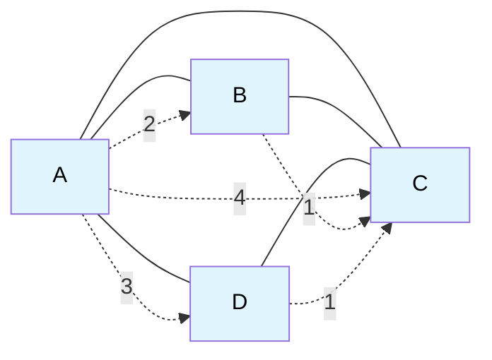
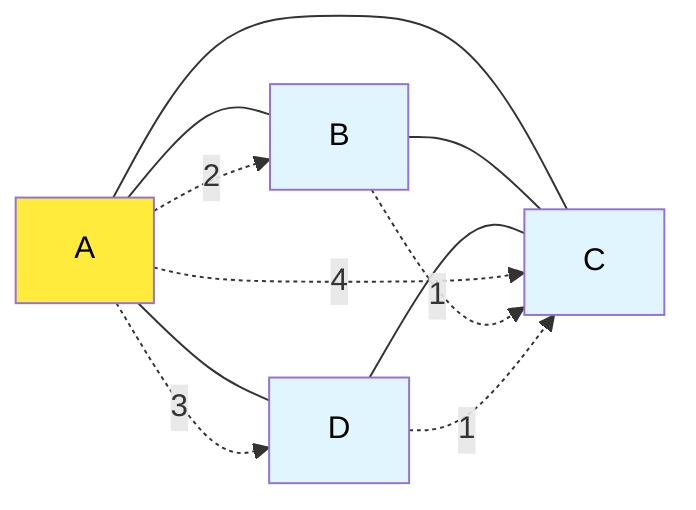
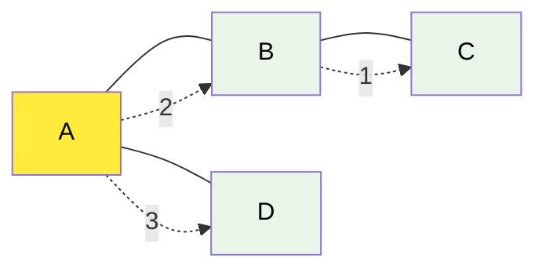
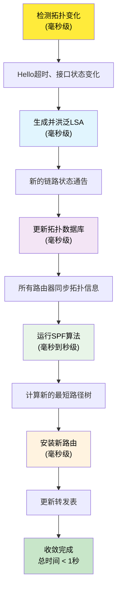
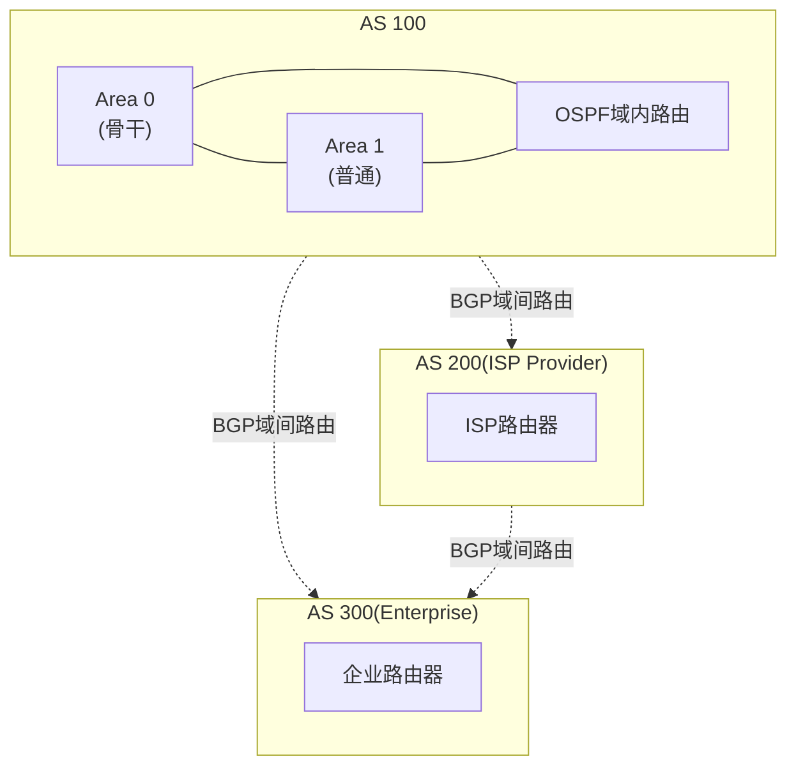

# 5.2 网络层：路由选择算法

## 本章目录

1. [链路状态路由选择算法](#链路状态路由选择算法)
2. [距离向量路由选择算法](#距离向量路由选择算法)
3. [两种算法的对比分析](#两种算法的对比分析)
4. [路由算法的收敛性分析](#路由算法的收敛性分析)
5. [实际应用中的考虑因素](#实际应用中的考虑因素)

---

## 链路状态路由选择算法

### Dijkstra算法基本原理

> **链路状态算法 (Link State Algorithm)**
> 
> 基于完整网络拓扑信息，使用Dijkstra算法计算从源节点到所有其他节点的最短路径，构建最短路径树(SPT)。

#### 算法基本思想

**核心概念**：
- **全局信息**：每个路由器都拥有完整的网络拓扑
- **最短路径**：计算到达每个目标的最小代价路径
- **逐步扩展**：从已知最短路径的节点向外扩展

#### Dijkstra算法步骤

**算法输入**：
- 网络图 $G = (V, E)$
- 链路代价函数 $c(x,y)$
- 源节点 $s$

**算法输出**：
- 从源节点到所有节点的最短路径距离
- 最短路径树

**详细步骤**：

```
Dijkstra算法伪代码：

1. 初始化：
   D(s) = 0                    // 源节点距离为0
   for all nodes v ≠ s:
       D(v) = ∞                // 其他节点距离初始化为无穷大
   N = {s}                     // 已确定最短路径的节点集合

2. 循环计算：
   while N ≠ V:                // 直到所有节点都加入N
       找到 w ∉ N 且 D(w) 最小的节点
       将 w 加入 N
       for w的每个邻居 v ∉ N:
           if D(v) > D(w) + c(w,v):
               D(v) = D(w) + c(w,v)    // 更新最短距离
               P(v) = w                // 记录前驱节点

3. 结束条件：
   所有节点的最短距离和路径都已确定
```

#### 详细计算示例

**网络拓扑**：



**链路代价矩阵**：
|   | A | B | C | D |
|---|---|---|---|---|
| A | 0 | 2 | 4 | 3 |
| B | 2 | 0 | 1 | ∞ |
| C | 4 | 1 | 0 | 1 |
| D | 3 | ∞ | 1 | 0 |

**从节点A开始的Dijkstra算法执行过程**：

**步骤0 (初始化)**：
```
N = {A}
D(A)=0, D(B)=∞, D(C)=∞, D(D)=∞

更新A的邻居：
D(B) = min(∞, 0+2) = 2,  P(B) = A
D(C) = min(∞, 0+4) = 4,  P(C) = A  
D(D) = min(∞, 0+3) = 3,  P(D) = A

当前状态：D(A)=0, D(B)=2, D(C)=4, D(D)=3
```

**步骤1**：
```
选择D(w)最小的节点：B (D(B)=2)
N = {A, B}

更新B的邻居：
D(C) = min(4, 2+1) = 3,  P(C) = B

当前状态：D(A)=0, D(B)=2, D(C)=3, D(D)=3
```

**步骤2**：
```
选择D(w)最小的节点：C或D (都是3，选择C)
N = {A, B, C}

更新C的邻居：
D(D) = min(3, 3+1) = 3,  P(D) = A (保持不变)

当前状态：D(A)=0, D(B)=2, D(C)=3, D(D)=3
```

**步骤3**：
```
选择剩余节点：D
N = {A, B, C, D}

算法结束
```

**最终结果**：
| 目标节点 | 最短距离 | 最短路径 | 下一跳 |
|----------|----------|----------|--------|
| A | 0 | A | - |
| B | 2 | A→B | B |
| C | 3 | A→B→C | B |
| D | 3 | A→D | D |

#### 算法复杂度分析

**时间复杂度**：
- **朴素实现**：$O(V^2)$
- **二叉堆优化**：$O((V+E)\log V)$
- **斐波那契堆**：$O(V\log V + E)$

**空间复杂度**：$O(V^2)$（存储完整拓扑信息）

### 链路状态算法的实现要点

#### 1. 拓扑信息的获取与维护

**链路状态通告 (Link State Advertisement, LSA)**：

LSA信息结构：
```
 LSA头部                         
─────────────────────────────────
 • 路由器ID                      
 • LSA类型                       
 • 序列号                        
 • 校验和                        
 • 生存时间                      
─────────────────────────────────
 链路状态信息                    
─────────────────────────────────
 • 邻居路由器ID                  
 • 链路类型                      
 • 链路代价                      
 • 其他TOS代价                   
─────────────────────────────────

```

**LSA洪泛机制**：
1. **触发条件**：链路状态变化、定期刷新
2. **洪泛范围**：整个区域或AS
3. **可靠传输**：确认重传机制
4. **环路避免**：序列号和校验和

#### 2. 最短路径树的构建

**SPT构建过程**：

**最短路径树示例 (从A开始)**：

**原始网络**：


**最短路径树**：


**SPT特点**：
- 每个节点有唯一路径到达根节点
- 树的总权重最小
- 包含所有可达节点

#### 3. 路由表的生成

**从SPT到路由表**：

```
基于SPT生成路由表：

目标网络    下一跳    接口    度量值    路由来源
10.1.1.0/24   B        eth0      2      OSPF
10.1.2.0/24   B        eth0      3      OSPF  
10.1.3.0/24   D        eth1      3      OSPF
0.0.0.0/0     B        eth0      2      Default
```

---

## 距离向量路由选择算法

### Bellman-Ford算法基本原理

> **距离向量算法 (Distance Vector Algorithm)**
> 
> 基于分布式计算的方法，每个节点维护到所有目标的距离向量，通过与邻居交换距离信息逐步收敛到最优解。

#### 算法理论基础

**Bellman-Ford方程**：
$$d_x(y) = \min_v \{c(x,v) + d_v(y)\}$$

其中：
- $d_x(y)$：从节点x到节点y的最短距离估计
- $c(x,v)$：从x到直接邻居v的链路代价
- $d_v(y)$：从邻居v到目标y的距离估计

**算法基本思想**：
- **分布式计算**：每个节点独立运行算法
- **信息交换**：仅与直接邻居交换距离向量
- **迭代收敛**：通过多次迭代逐步逼近最优解

#### 距离向量算法步骤

**算法流程**：

```
距离向量算法伪代码：

1. 初始化（在节点x执行）：
   for all destinations y in N:
       Dx(y) = c(x,y)     // 如果x和y直接相连
       Dx(y) = ∞          // 如果x和y不直接相连
   
2. 发送距离向量：
   定期将Dx发送给所有邻居

3. 接收距离向量更新：
   when 从邻居v接收到距离向量Dv:
       for each destination y:
           if c(x,v) + Dv(y) < Dx(y):
               Dx(y) = c(x,v) + Dv(y)
               下一跳[y] = v
       if Dx有更新:
           向所有邻居发送新的距离向量

4. 链路代价变化处理：
   when 链路代价改变:
       重新计算距离向量
       向邻居发送更新
```

#### 详细计算示例

**使用相同的网络拓扑**：


**初始化状态**：

| 节点 | 到A的距离 | 到B的距离 | 到C的距离 | 到D的距离 |
|------|----------|----------|----------|----------|
| A | 0 | 2 | 4 | 3 |
| B | 2 | 0 | 1 | ∞ |
| C | 4 | 1 | 0 | 1 |
| D | 3 | ∞ | 1 | 0 |

**第1轮迭代**：

节点A收到邻居的距离向量后更新：
```
A从B收到: DB = [2, 0, 1, ∞]
A从C收到: DC = [4, 1, 0, 1]  
A从D收到: DD = [3, ∞, 1, 0]

A更新计算：
DA(A) = 0 (保持)
DA(B) = min(2, 3+∞, 4+1, 3+∞) = 2 (保持)
DA(C) = min(4, 2+1, 4+0, 3+1) = 3 (更新，通过B)
DA(D) = min(3, 2+∞, 4+1, 3+0) = 3 (保持)

更新后：DA = [0, 2, 3, 3]
```

节点B收到邻居的距离向量后更新：
```
B从A收到: DA = [0, 2, 4, 3]
B从C收到: DC = [4, 1, 0, 1]

B更新计算：
DB(A) = min(2, 2+0, 1+4) = 2 (保持)
DB(B) = 0 (保持)
DB(C) = min(1, 2+4, 1+0) = 1 (保持)
DB(D) = min(∞, 2+3, 1+1) = 2 (更新，通过C)

更新后：DB = [2, 0, 1, 2]
```

**继续迭代直到收敛**：

经过几轮迭代后，所有节点的距离向量收敛：

| 节点 | 最终距离向量 |
|------|-------------|
| A | [0, 2, 3, 3] |
| B | [2, 0, 1, 2] |
| C | [3, 1, 0, 1] |
| D | [3, 2, 1, 0] |

### 距离向量算法的问题

#### 1. 路由环路问题

**无穷计数问题**：

```
问题场景：
初始状态：A──1──B──1──C
         (1)   (2)

如果链路A-B断开：
A的路由表: 到C距离=∞
B的路由表: 到C距离=2 (通过C)
C的路由表: 到A距离=3 (通过B)

错误更新过程：
1. A从B学到：到C距离=2+1=3
2. B从A学到：到C距离=3+1=4  
3. A从B学到：到C距离=4+1=5
4. ... 无穷递增
```

#### 2. 解决方案

**毒性逆转 (Poison Reverse)**：
```
规则：如果A通过B到达C，则A向B通告到C的距离为∞

示例：
A通过B到达C，距离为3
A向B发送的距离向量：[..., DC=∞, ...]
这样B就不会通过A到达C，避免环路
```

**水平分割 (Split Horizon)**：
```
规则：不向学习到路由的邻居再发送该路由信息

示例：
A从B学到到C的路由
A不向B发送到C的路由信息
```

**触发更新 (Triggered Updates)**：
```
规则：拓扑变化时立即发送更新，不等待定期更新

优点：加快收敛速度
缺点：可能产生更新风暴
```

---

## 两种算法的对比分析

### 综合性能对比

| 对比维度 | 链路状态算法 | 距离向量算法 |
|----------|-------------|-------------|
| **信息需求** | 全局拓扑信息 | 邻居距离信息 |
| **计算复杂度** | O(V²) 或更优 | O(V·E) |
| **存储空间** | O(V²) | O(V) |
| **收敛速度** | 快 | 较慢 |
| **收敛性** | 保证收敛 | 可能振荡 |
| **路由环路** | 不会产生 | 可能产生 |
| **通信开销** | 较大(LSA洪泛) | 较小(邻居交换) |
| **实现复杂度** | 复杂 | 简单 |
| **代表协议** | OSPF, IS-IS | RIP, BGP |

### 适用场景分析

**链路状态算法适用场景**：
```
优势场景：
• 大型企业网络
• 需要快速收敛的网络
• 拓扑变化频繁的网络  
• 对路由精度要求高的场景

典型应用：
• OSPF在企业内部网络
• IS-IS在运营商骨干网
• 数据中心网络路由
```

**距离向量算法适用场景**：
```
优势场景：
• 小型网络
• 资源受限的设备
• 拓扑相对稳定的网络
• 简单配置需求

典型应用：
• RIP在小型局域网
• BGP在互联网边界
• 嵌入式网络设备
```

---

## 路由算法的收敛性分析

### 收敛性的定义

> **路由收敛**
> 
> 指网络拓扑变化后，所有路由器的路由表重新达到稳定状态，不再发生变化的过程。

#### 收敛性指标

1. **收敛时间**：从拓扑变化到路由稳定的时间
2. **收敛正确性**：收敛后的路由是否为最优路由
3. **收敛过程稳定性**：收敛过程中是否产生环路或振荡

#### 影响收敛的因素

**网络拓扑因素**：
```
收敛时间 ∝ f(网络直径, 节点数量, 链路数量)

• 网络直径：信息传播的最大距离
• 节点密度：影响算法复杂度
• 网络层次：分层网络收敛更快
```

**算法参数因素**：
- **更新间隔**：影响信息传播速度
- **触发阈值**：决定何时发送更新
- **抑制机制**：防止频繁更新

### 链路状态算法的收敛分析

#### 收敛过程



#### 收敛优化技术

**增量SPF (Incremental SPF)**：
- 仅重新计算受影响的路径
- 大幅减少计算开销
- 提高大型网络的收敛速度

**LSA抑制**：
```
抑制机制参数：
• 初始延迟：5ms
• 最大延迟：5s  
• 增长因子：2

目的：防止LSA风暴，减少CPU负载
```

### 距离向量算法的收敛分析

#### 收敛过程特点

```
DV算法收敛特点：
• 收敛时间不确定
• 可能产生路由环路
• 收敛时间与网络直径成正比
• 坏消息传播慢（无穷计数问题）

典型收敛时间：
• 好消息：O(直径)轮迭代
• 坏消息：O(最大路径代价)轮迭代
```

#### 收敛优化方法

**路径向量机制**：
```
BGP的路径向量：
• 携带完整AS路径信息  
• 可以检测和防止环路
• 提供更多的策略控制能力

AS路径示例：
AS 100 → AS 200 → AS 300 → 目标网络
```

**快速外部故障切换 (BFD)**：
- 毫秒级故障检测
- 独立于路由协议的快速检测机制
- 触发快速重新收敛

---

## 实际应用中的考虑因素

### 网络分层与路由层次

#### 两层路由架构



**分层优势**：
1. **扩展性**：减少路由表大小和计算复杂度
2. **管理性**：不同层次可以采用不同策略
3. **稳定性**：局部变化不影响全局路由
4. **安全性**：隐藏内部网络拓扑细节

### 多路径路由

#### 等价多路径 (ECMP)

```
ECMP负载均衡：

源网络到目标网络有多条等代价路径：
Path 1: A → B → D (Cost: 10)
Path 2: A → C → D (Cost: 10)

负载分担方式：
• 按流分担：5元组哈希
• 按包分担：轮询方式
• 按权重分担：带宽比例

优势：
• 提高网络利用率
• 增加网络容错能力  
• 改善整体性能
```

#### 不等价多路径 (UECMP)

```
UECMP应用场景：

Path 1: A → B → D (Cost: 10, BW: 100M)
Path 2: A → C → D (Cost: 15, BW: 200M)

流量分配比例：
Traffic_Ratio = f(Cost, Bandwidth)
• 考虑路径代价
• 考虑链路带宽
• 动态调整权重
```

### 路由策略与过滤

#### BGP路由策略

```
路由策略控制：

1. 路由导入策略：
   • 接受/拒绝特定路由
   • 修改路由属性
   • 设置本地优先级

2. 路由导出策略：  
   • 选择通告的路由
   • 修改路由度量
   • 添加社区属性

3. 路径选择策略：
   • Local Preference
   • AS Path Length  
   • MED (Multi-Exit Discriminator)
```

### 故障恢复机制

#### 快速重路由 (FRR)

```
FRR保护机制：

主路径：A → B → C → D
备份路径：A → E → F → D

故障检测到切换时间：< 50ms

实现方式：
• 预计算备份路径
• 检测到故障立即切换
• 后台运行路由收敛
```

#### BFD双向故障检测

```
BFD参数配置：
• Detection Time: 50ms
• Transmission Interval: 10ms  
• Detection Multiplier: 5

工作原理：
1. 建立BFD会话
2. 发送定期检测包
3. 超时检测故障
4. 通知路由协议
5. 触发快速收敛
```

### 本章小结

#### 核心算法原理

1. **链路状态算法**：基于全局信息的Dijkstra最短路径算法
2. **距离向量算法**：基于分布式计算的Bellman-Ford算法  
3. **算法特点**：收敛性、复杂度、适用场景各有差异
4. **实际应用**：OSPF vs RIP的选择考虑

#### 关键技术要点

- **收敛优化**：快速检测、增量计算、抑制机制
- **环路避免**：毒性逆转、水平分割、路径向量
- **分层路由**：域内域间分离、区域划分
- **负载均衡**：等价多路径、流量工程

#### 实际部署考虑

- **网络规模**：影响算法选择和参数调优
- **性能要求**：收敛时间、计算开销、内存使用
- **管理复杂度**：配置难度、故障诊断、策略控制
- **发展趋势**：SDN集中控制、AI优化路由

掌握这两种基本路由算法的原理和特点，是理解现代路由协议和网络设计的重要基础。

---

**[下一节：5.3 自治系统内部路由：OSPF](5.3网络层：OSPF协议.md)**
