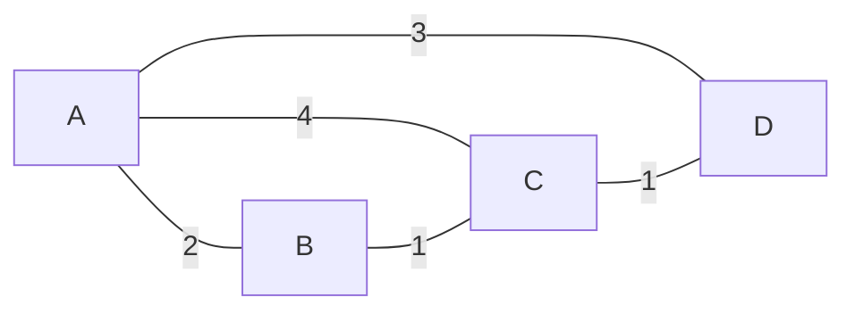
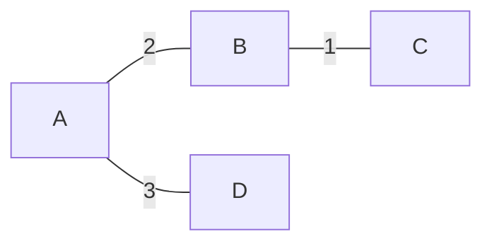
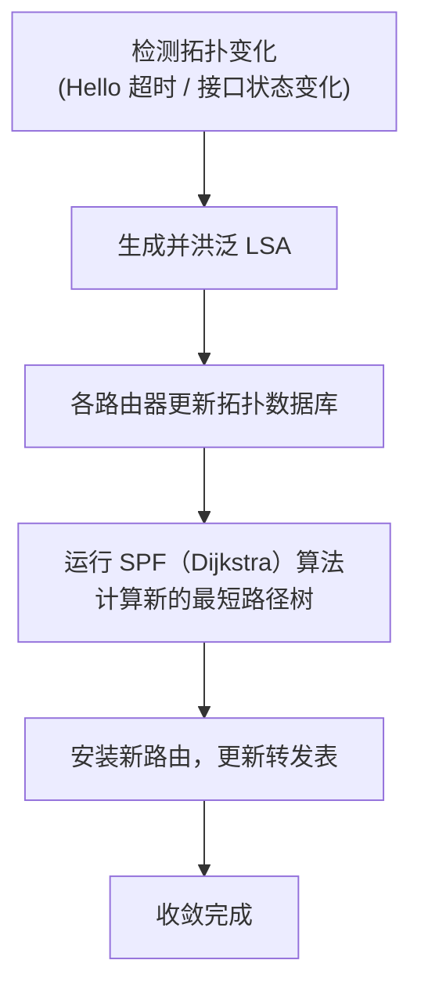
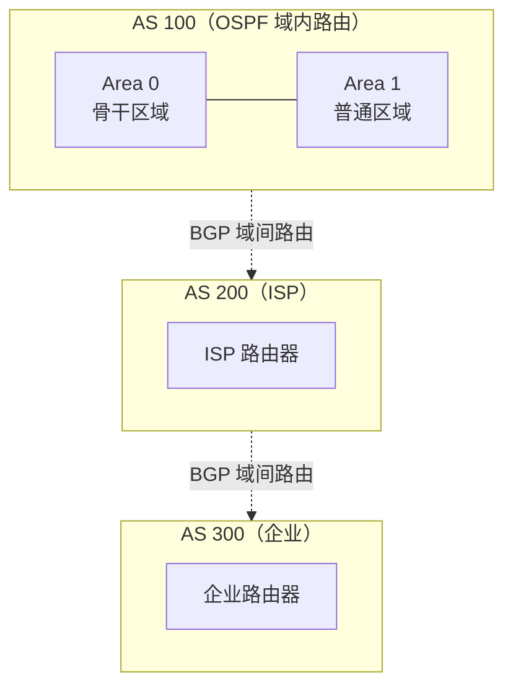

# 5.2 网络层：路由选择算法

> 本节是《计算机网络：自顶向下方法》5.2 节的学习笔记。路由选择算法分两大类：链路状态（LS）算法依赖全局拓扑，集中用 Dijkstra 算出最短路径；距离向量（DV）算法基于分布式的 Bellman-Ford 迭代，只与邻居交换信息。两者分别是 OSPF 和 RIP 的理论基础。

## 目录

1. [链路状态路由选择算法](#链路状态路由选择算法)
2. [距离向量路由选择算法](#距离向量路由选择算法)
3. [两种算法的对比分析](#两种算法的对比分析)
4. [路由算法的收敛性分析](#路由算法的收敛性分析)
5. [实际应用中的考虑因素](#实际应用中的考虑因素)

---

## 链路状态路由选择算法

### Dijkstra 算法基本原理

> **链路状态算法（Link State Algorithm）**
> 
> 每个节点掌握完整的网络拓扑，独立用 Dijkstra 算法算出到所有其他节点的最短路径，构成最短路径树（SPT）。

核心特征：

- **全局信息**：每个路由器都拥有完整的网络拓扑（通过 LSA 洪泛得到）
- **集中式计算**：拿到全局拓扑后，单点即可算出全部最短路径
- **逐步扩展**：从源节点出发，每轮把当前距离最小的节点并入已确定集合

注：LS 是"全局信息、本地计算"——信息靠洪泛同步到全网，计算各自独立完成。

#### Dijkstra 算法步骤

**算法输入**：
- 网络图 $G = (V, E)$
- 链路代价函数 $c(x,y)$
- 源节点 $s$

**算法输出**：
- 从源节点到所有节点的最短路径距离
- 最短路径树

**详细步骤**：

```
Dijkstra 算法（源点 s）：

1. 初始化：
   N' = {s}                       // 已确定最短路径的节点集合
   for all nodes v:
       if v 是 s 的邻居:
           D(v) = c(s,v),  P(v) = s
       else:
           D(v) = ∞               // 其余节点暂不可达

2. 循环：
   while N' ≠ V:                   // 直到所有节点都并入
       选 N' 外 D(w) 最小的节点 w，并入 N'
       for w 的每个邻居 v ∉ N':    // 松弛
           if D(w) + c(w,v) < D(v):
               D(v) = D(w) + c(w,v)
               P(v) = w            // 记录前驱

3. 结束：所有节点距离和前驱确定，前驱链即最短路径树
```

#### 详细计算示例

**网络拓扑**（边上数字为链路代价）：


```mermaid
graph LR
    A ---|2| B
    A ---|4| C
    A ---|3| D
    B ---|1| C
    C ---|1| D
```

**链路代价矩阵**（∞ 表示不直接相连）：

|   | A | B | C | D |
|---|---|---|---|---|
| A | 0 | 2 | 4 | 3 |
| B | 2 | 0 | 1 | ∞ |
| C | 4 | 1 | 0 | 1 |
| D | 3 | ∞ | 1 | 0 |

**从节点 A 开始的 Dijkstra 执行过程**：用 $D(v)$ 记当前到 $v$ 的最短距离估计，$N'$ 记已确定最短路径的节点集合。每步选出 $N'$ 外 $D$ 最小的节点并入，再松弛其邻居。

| 步骤 | 本步并入 | $N'$ | D(B),P(B) | D(C),P(C) | D(D),P(D) |
|------|---------|------|-----------|-----------|-----------|
| 0 | A（初始化） | {A} | 2,A | 4,A | 3,A |
| 1 | B | {A,B} | — | **3,B** | 3,A |
| 2 | C（与 D 同为 3，取 C） | {A,B,C} | — | — | 3,A |
| 3 | D | {A,B,C,D} | — | — | — |

逐步说明：

- 步骤 0：$D(A)=0$，对 A 的邻居松弛得 $D(B)=2,\ D(C)=4,\ D(D)=3$，前驱均为 A。
- 步骤 1：选 $D$ 最小的 B（=2）并入 $N'$。松弛 B 的邻居 C：$D(C)=\min(4,\ 2+1)=3$，前驱改为 B。
- 步骤 2：C 与 D 当前都是 3，按字母序选 C 并入。松弛 D：$\min(3,\ 3+1)=3$，不变。
- 步骤 3：只剩 D，并入后所有节点最短路径确定，算法结束。

注：D 的最短路径是直连的 A→D（代价 3），不是经 C 的 A→B→C→D（代价 4）；C 与 D 同为 3 时谁先并入不影响最终结果。

**最终结果**：

| 目标节点 | 最短距离 | 最短路径 | 下一跳 |
|----------|----------|----------|--------|
| A | 0 | A | — |
| B | 2 | A→B | B |
| C | 3 | A→B→C | B |
| D | 3 | A→D | D |

#### 算法复杂度分析

设节点数为 $n$、链路数为 $E$：

- **朴素实现**：每轮线性扫描找最小值，共 $n$ 轮，时间 $O(n^2)$。书中给出的就是这一界。
- **二叉堆优化**：用优先队列取最小值，$O((n+E)\log n)$，稀疏图更优。
- **斐波那契堆**：$O(n\log n + E)$。

空间复杂度 $O(n^2)$（存储完整拓扑）。

### 链路状态算法的实现要点

#### 1. 拓扑信息的获取与维护

**链路状态通告 (Link State Advertisement, LSA)**：

LSA信息结构：
```
 LSA头部                         
─────────────────────────────────
 • 路由器ID                      
 • LSA类型                       
 • 序列号                        
 • 校验和                        
 • 生存时间                      
─────────────────────────────────
 链路状态信息                    
─────────────────────────────────
 • 邻居路由器ID                  
 • 链路类型                      
 • 链路代价                      
 • 其他TOS代价                   
─────────────────────────────────

```

**LSA洪泛机制**：
1. **触发条件**：链路状态变化、定期刷新
2. **洪泛范围**：整个区域或AS
3. **可靠传输**：确认重传机制
4. **环路避免**：序列号和校验和

#### 2. 最短路径树的构建

Dijkstra 算完后，每个节点记录的前驱 $P(v)$ 串起来就是以源点为根的最短路径树（SPT）。上例从 A 出发，前驱为 $P(B)=A,\ P(C)=B,\ P(D)=A$，树中只保留 A–B、B–C、A–D 三条边（A–C 直连边代价 4，被经 B 的路径替代而不入树）：


```mermaid
graph LR
    A ---|2| B
    A ---|3| D
    B ---|1| C
```

SPT 的性质：从根到每个节点的路径唯一且最短；树覆盖所有可达节点（注意是各源点最短路径树，并非全网总权重最小的最小生成树）。

#### 3. 路由表的生成

**从SPT到路由表**：

```
基于SPT生成路由表：

目标网络    下一跳    接口    度量值    路由来源
10.1.1.0/24   B        eth0      2      OSPF
10.1.2.0/24   B        eth0      3      OSPF  
10.1.3.0/24   D        eth1      3      OSPF
0.0.0.0/0     B        eth0      2      Default
```

---

## 距离向量路由选择算法

### Bellman-Ford 算法基本原理

> **距离向量算法（Distance Vector Algorithm）**
> 
> 每个节点维护一张到所有目标的距离向量，只与直接邻居交换该向量，反复套用 Bellman-Ford 方程更新，直到收敛。

#### 算法理论基础

**Bellman-Ford 方程**：

$$d_x(y) = \min_v \{c(x,v) + d_v(y)\}$$

其中：

- $d_x(y)$：从节点 $x$ 到节点 $y$ 的最短距离
- $c(x,v)$：$x$ 到直接邻居 $v$ 的链路代价
- $d_v(y)$：邻居 $v$ 到目标 $y$ 的距离（由 $v$ 通告而来）

含义：$x$ 到 $y$ 的最短路必然经过某个邻居 $v$，故取所有邻居中"到 $v$ 的代价 + $v$ 到 $y$ 的距离"的最小值。

注：DV 是"本地信息、分布式计算"，与 LS 的"全局信息、本地计算"正好相反——每个节点只知道到邻居的代价和邻居发来的向量，靠迭代逐步逼近全局最优。

#### 距离向量算法步骤

**算法流程**：

```
距离向量算法伪代码：

1. 初始化（在节点x执行）：
   for all destinations y in N:
       Dx(y) = c(x,y)     // 如果x和y直接相连
       Dx(y) = ∞          // 如果x和y不直接相连
   
2. 发送距离向量：
   定期将Dx发送给所有邻居

3. 接收距离向量更新：
   when 从邻居v接收到距离向量Dv:
       for each destination y:
           if c(x,v) + Dv(y) < Dx(y):
               Dx(y) = c(x,v) + Dv(y)
               下一跳[y] = v
       if Dx有更新:
           向所有邻居发送新的距离向量

4. 链路代价变化处理：
   when 链路代价改变:
       重新计算距离向量
       向邻居发送更新
```

#### 详细计算示例

沿用上面的拓扑（A–B=2、A–C=4、A–D=3、B–C=1、C–D=1）。每个节点的距离向量初值为：到自己为 0、到直连邻居为链路代价、到其余节点为 ∞。向量按 [到A, 到B, 到C, 到D] 排列。

**初始向量**（每行为一个节点的 $D_x$）：

| 节点 | 到A | 到B | 到C | 到D |
|------|-----|-----|-----|-----|
| A | 0 | 2 | 4 | 3 |
| B | 2 | 0 | 1 | ∞ |
| C | 4 | 1 | 0 | 1 |
| D | 3 | ∞ | 1 | 0 |

**第 1 轮**：各节点收到邻居的初始向量后，逐个目标套用 Bellman-Ford 方程更新。

节点 A（邻居 B、C、D）：

```
DA(B) = min{2, c(A,B)+DB(B), c(A,C)+DC(B), c(A,D)+DD(B)}
      = min{2, 2+0, 4+1, 3+∞} = 2   (不变)
DA(C) = min{4, 2+1, 4+0, 3+1} = 3   (经 B 更新)
DA(D) = min{3, 2+∞, 4+1, 3+0} = 3   (不变)
→ DA = [0, 2, 3, 3]
```

节点 B（邻居 A、C）：

```
DB(A) = min{2, c(B,A)+DA(A), c(B,C)+DC(A)} = min{2, 2+0, 1+4} = 2  (不变)
DB(C) = min{1, 2+4, 1+0} = 1                                       (不变)
DB(D) = min{∞, 2+3, 1+1} = 2                                       (经 C 更新)
→ DB = [2, 0, 1, 2]
```

C、D 同理更新。本例规模小，**1 轮即收敛**，再交换一次向量已无变化：

| 节点 | 收敛后向量 [到A, 到B, 到C, 到D] |
|------|-------------------------------|
| A | [0, 2, 3, 3] |
| B | [2, 0, 1, 2] |
| C | [3, 1, 0, 1] |
| D | [3, 2, 1, 0] |

结果与 Dijkstra 一致：两种算法在拓扑稳定时收敛到相同的最短路径。

### 距离向量算法的问题

#### 1. 无穷计数问题（count-to-infinity）

DV 的"坏消息传播慢"会引发路由环路与无穷计数。注：此问题仅出现在 DV，LS 因掌握全局拓扑不会发生。

考虑三节点链：

```
   1        1
X ───── Y ───── Z
```

各节点关心到 Z 的距离，稳定时：$D_Y(Z)=1$（直连），$D_X(Z)=2$（经 Y）。

现链路 **Y–Z 故障**（代价变 ∞）。Y 发现直连断了，但此刻 X 仍在通告 $D_X(Z)=2$。Y 据此误判"可经 X 到 Z"：

```
1. Y 收到 X 的旧通告 DX(Z)=2 → DY(Z) = c(Y,X)+2 = 1+2 = 3   (经 X，实为环路)
2. Y 通告 DY(Z)=3 → X 更新 DX(Z) = 1+3 = 4
3. X 通告 DX(Z)=4 → Y 更新 DY(Z) = 1+4 = 5
4. ……两者交替递增，直到逼近"无穷"（实现中以某个最大值代表 ∞，如 RIP 取 16）
```

根因：Y 不知道 X 到 Z 的路径其实是经过自己的，于是接受了一条绕回自身的"幻路"。坏消息（不可达）要经过许多轮才能传开。

#### 2. 缓解方法

**毒性逆转（Poison Reverse）**：

```
规则：若 X 经 Y 到达 Z，则 X 向 Y 通告 DX(Z)=∞（谎报"我到不了 Z"）

效果：Y 不会再误以为能经 X 到 Z，上例的两节点环路被打破。
局限：只能消除两节点环路，三个及以上节点构成的环仍可能发生无穷计数。
```

**水平分割（Split Horizon）**：

```
规则：从邻居 Y 学到的到 Z 的路由，不再向 Y 通告

毒性逆转可视为水平分割的加强版（不仅不通告，还主动报 ∞）。
```

**触发更新（Triggered Updates）**：

```
规则：拓扑变化时立即发送更新，不等定期周期

优点：加快收敛速度
缺点：可能产生更新风暴
```

---

## 两种算法的对比分析

### 综合性能对比

| 对比维度 | 链路状态算法（LS） | 距离向量算法（DV） |
|----------|-------------|-------------|
| **信息掌握** | 全局拓扑（本地计算） | 仅邻居距离（分布式计算） |
| **报文交换** | 每节点向全网洪泛 LSA | 每节点只与邻居交换向量 |
| **计算复杂度** | $O(n^2)$ 或更优 | 每次迭代 $O(\text{邻居数})$ |
| **存储空间** | $O(n^2)$（全拓扑） | $O(n)$（一张向量） |
| **收敛速度** | 较快 | 较慢，存在无穷计数 |
| **路由环路** | 不会产生 | 可能产生 |
| **故障敏感性** | 节点报错代价局部 | 错误代价可能扩散全网 |
| **实现复杂度** | 较复杂 | 较简单 |
| **代表协议** | OSPF、IS-IS | RIP |

注：BGP 用的是路径向量（path vector），可看作 DV 的扩展——通告里携带完整 AS 路径，从而能检测并避免环路，与基础 DV 不同。

### 适用场景

- **LS**：适合规模较大、对收敛速度和路由精度要求高的网络。代表协议 OSPF（企业内网）、IS-IS（运营商骨干）。
- **DV**：实现与配置简单、占用资源少，适合小型或拓扑稳定的网络。代表协议 RIP（小型局域网）。

---

## 路由算法的收敛性分析

### 收敛性的定义

> **路由收敛**
> 
> 指网络拓扑变化后，所有路由器的路由表重新达到稳定状态，不再发生变化的过程。

#### 收敛性指标

1. **收敛时间**：从拓扑变化到路由稳定的时间
2. **收敛正确性**：收敛后的路由是否为最优路由
3. **收敛过程稳定性**：收敛过程中是否产生环路或振荡

#### 影响收敛的因素

**网络拓扑因素**：
```
收敛时间 ∝ f(网络直径, 节点数量, 链路数量)

• 网络直径：信息传播的最大距离
• 节点密度：影响算法复杂度
• 网络层次：分层网络收敛更快
```

**算法参数因素**：
- **更新间隔**：影响信息传播速度
- **触发阈值**：决定何时发送更新
- **抑制机制**：防止频繁更新

### 链路状态算法的收敛分析

#### 收敛过程


```mermaid
graph TD
    A["检测拓扑变化<br/>(Hello 超时 / 接口状态变化)"] --> C["生成并洪泛 LSA"]
    C --> E["各路由器更新拓扑数据库"]
    E --> G["运行 SPF（Dijkstra）算法<br/>计算新的最短路径树"]
    G --> I["安装新路由，更新转发表"]
    I --> K["收敛完成"]
```

#### 收敛优化技术

**增量SPF (Incremental SPF)**：
- 仅重新计算受影响的路径
- 大幅减少计算开销
- 提高大型网络的收敛速度

**LSA抑制**：
```
抑制机制参数：
• 初始延迟：5ms
• 最大延迟：5s  
• 增长因子：2

目的：防止LSA风暴，减少CPU负载
```

### 距离向量算法的收敛分析

#### 收敛过程特点

```
DV算法收敛特点：
• 收敛时间不确定
• 可能产生路由环路
• 收敛时间与网络直径成正比
• 坏消息传播慢（无穷计数问题）

典型收敛时间：
• 好消息：O(直径)轮迭代
• 坏消息：O(最大路径代价)轮迭代
```

#### 收敛优化方法

**路径向量机制**：
```
BGP的路径向量：
• 携带完整AS路径信息  
• 可以检测和防止环路
• 提供更多的策略控制能力

AS路径示例：
AS 100 → AS 200 → AS 300 → 目标网络
```

**快速外部故障切换 (BFD)**：
- 毫秒级故障检测
- 独立于路由协议的快速检测机制
- 触发快速重新收敛

---

## 实际应用中的考虑因素

### 网络分层与路由层次

#### 两层路由架构


```mermaid
graph TD
    subgraph AS100 ["AS 100（OSPF 域内路由）"]
        Area0["Area 0<br/>骨干区域"]
        Area1["Area 1<br/>普通区域"]
        Area0 --- Area1
    end
    subgraph AS200 ["AS 200（ISP）"]
        ISP200["ISP 路由器"]
    end
    subgraph AS300 ["AS 300（企业）"]
        ENT300["企业路由器"]
    end
    AS100 -.->|BGP 域间路由| AS200
    AS200 -.->|BGP 域间路由| AS300
```

**分层优势**：
1. **扩展性**：减少路由表大小和计算复杂度
2. **管理性**：不同层次可以采用不同策略
3. **稳定性**：局部变化不影响全局路由
4. **安全性**：隐藏内部网络拓扑细节

### 多路径路由

#### 等价多路径 (ECMP)

```
ECMP负载均衡：

源网络到目标网络有多条等代价路径：
Path 1: A → B → D (Cost: 10)
Path 2: A → C → D (Cost: 10)

负载分担方式：
• 按流分担：5元组哈希
• 按包分担：轮询方式
• 按权重分担：带宽比例

优势：
• 提高网络利用率
• 增加网络容错能力  
• 改善整体性能
```

#### 不等价多路径 (UECMP)

```
UECMP应用场景：

Path 1: A → B → D (Cost: 10, BW: 100M)
Path 2: A → C → D (Cost: 15, BW: 200M)

流量分配比例：
Traffic_Ratio = f(Cost, Bandwidth)
• 考虑路径代价
• 考虑链路带宽
• 动态调整权重
```

### 路由策略与过滤

#### BGP路由策略

```
路由策略控制：

1. 路由导入策略：
   • 接受/拒绝特定路由
   • 修改路由属性
   • 设置本地优先级

2. 路由导出策略：  
   • 选择通告的路由
   • 修改路由度量
   • 添加社区属性

3. 路径选择策略：
   • Local Preference
   • AS Path Length  
   • MED (Multi-Exit Discriminator)
```

### 故障恢复机制

#### 快速重路由 (FRR)

```
FRR保护机制：

主路径：A → B → C → D
备份路径：A → E → F → D

故障检测到切换时间：< 50ms

实现方式：
• 预计算备份路径
• 检测到故障立即切换
• 后台运行路由收敛
```

#### BFD双向故障检测

```
BFD参数配置：
• Detection Time: 50ms
• Transmission Interval: 10ms  
• Detection Multiplier: 5

工作原理：
1. 建立BFD会话
2. 发送定期检测包
3. 超时检测故障
4. 通知路由协议
5. 触发快速收敛
```
 
---

**[下一节：5.3 网络层：OSPF协议](5.3网络层：OSPF协议.md)**
