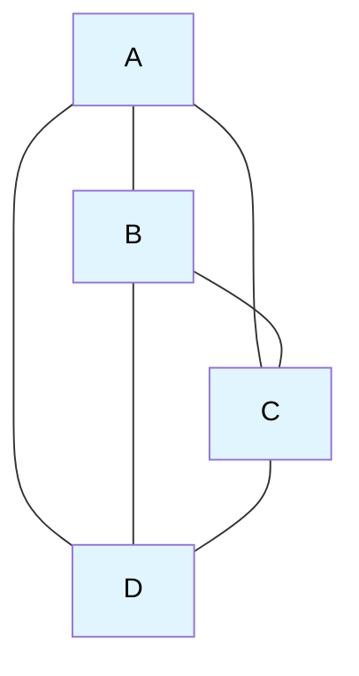
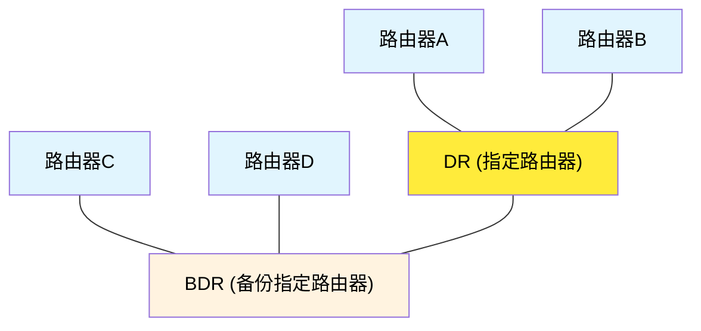
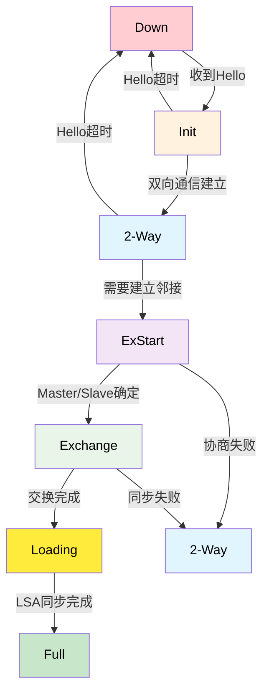
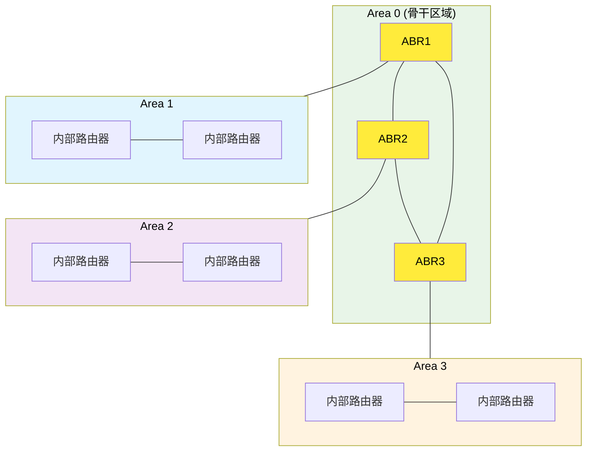

# 5.3 网络层：OSPF协议

## 本章目录

1. [OSPF协议概述](#ospf协议概述)
2. [OSPF工作原理](#ospf工作原理)
3. [OSPF消息类型与格式](#ospf消息类型与格式)
4. [OSPF邻居关系与邻接关系](#ospf邻居关系与邻接关系)
5. [OSPF链路状态通告LSA](#ospf链路状态通告lsa)
6. [OSPF区域架构](#ospf区域架构)
7. [OSPF路由计算过程](#ospf路由计算过程)
8. [OSPF配置与故障排除](#ospf配置与故障排除)

---

## OSPF协议概述

### OSPF基本概念

> **OSPF (Open Shortest Path First)**
> 
> 一种基于链路状态算法的内部网关协议(IGP)，使用Dijkstra算法计算最短路径，支持层次化网络设计和快速收敛。

#### OSPF的主要特点

**技术特性**：

| 特性类别 | OSPF特点 | 优势说明 |
|----------|----------|----------|
| **算法基础** | 链路状态算法 | 快速收敛，无环路 |
| **协议开放性** | 开放标准(RFC 2328) | 多厂商互操作 |
| **网络层次** | 支持区域划分 | 分层路由，减少开销 |
| **路由类型** | 多种路由类型 | 灵活的路由策略 |
| **负载均衡** | 等价多路径(ECMP) | 提高链路利用率 |
| **认证机制** | 支持多种认证 | 增强网络安全 |

#### OSPF vs RIP对比

**协议对比分析**：

| 对比维度 | OSPF | RIP |
|----------|------|-----|
| **算法类型** | 链路状态 | 距离向量 |
| **最大跳数** | 无限制 | 15跳 |
| **收敛速度** | 快(秒级) | 慢(分钟级) |
| **网络规模** | 大型网络 | 小型网络 |
| **CPU开销** | 较高 | 较低 |
| **内存需求** | 较大 | 较小 |
| **路由精度** | 精确 | 粗略 |
| **标准化** | 开放标准 | 开放标准 |

### OSPF的网络应用

#### 适用场景

**OSPF最佳实践场景**：

```
典型OSPF部署场景：

企业总部网络 (Area 0)
├── 分支机构1 (Area 1)
├── 分支机构2 (Area 2)  
└── 数据中心 (Area 3)

网络特点：
• 节点数：50-1000台路由器
• 链路类型：千兆以太网为主
• 拓扑变化：相对稳定，偶有变化
• QoS需求：不同业务优先级不同
```

#### 部署考虑因素

**设计原则**：
1. **区域规划**：每个区域不超过50台路由器
2. **骨干区域**：Area 0必须连通所有其他区域
3. **LSA控制**：控制LSA泛洪范围，减少开销
4. **认证策略**：启用MD5或SHA认证增强安全性

---

## OSPF工作原理

### OSPF基本工作流程

**OSPF运行的五个阶段**：

```
OSPF工作流程：

1. 邻居发现 (Neighbor Discovery)
   └── Hello协议 → 建立邻居关系

2. 建立邻接 (Adjacency Formation)  
   └── Master/Slave选举 → 同步LSA数据库

3. 链路状态同步 (LSA Synchronization)
   └── 数据库描述 → LSR → LSU → LSAck

4. 路由计算 (Route Calculation)
   └── SPF算法 → 构建最短路径树

5. 路由安装 (Route Installation)
   └── 路由表更新 → 转发表生成
```

#### 详细工作步骤

**1. Hello协议运行**：

```
Hello包功能：
• 发现邻居路由器
• 维持邻居关系  
• 选举DR/BDR
• 确保双向通信

Hello包发送频率：
• 广播/P2P网络：10秒
• NBMA网络：30秒
• 死亡间隔：Hello间隔 × 4
```

**2. 邻接关系建立**：

```
邻接状态机：
Down → Init → 2-Way → ExStart → Exchange → Loading → Full

关键状态转换：
• Init: 收到第一个Hello包
• 2-Way: 在Hello包中看到自己的Router-ID
• ExStart: 选举Master/Slave，开始数据库同步  
• Exchange: 交换数据库描述包(DD)
• Loading: 请求缺失的LSA
• Full: 数据库完全同步
```

**3. LSA洪泛机制**：

```
LSA传播过程：
1. 路由器生成LSA
2. 在接口上洪泛LSA
3. 邻居接收并确认LSA  
4. 邻居转发LSA到其他接口
5. 更新链路状态数据库
6. 重新计算路由表

可靠洪泛保证：
• 序列号机制
• 校验和验证
• 确认重传机制
• 老化超时机制
```

### OSPF路由器类型

#### 四种路由器角色

**1. 内部路由器 (Internal Router)**：
```
特点：
• 所有接口属于同一区域
• 只维护该区域的LSA数据库
• 路由计算相对简单

示例：
Area 1中的普通路由器
只处理Area 1的路由信息
```

**2. 区域边界路由器 (ABR - Area Border Router)**：
```  
特点：
• 连接多个区域
• 必须有接口在Area 0
• 运行多个SPF实例
• 负责区域间路由汇总

功能：
• 生成Type-3 LSA (网络汇总LSA)
• 过滤路由信息传播
• 实现区域间负载均衡
```

**3. 自治系统边界路由器 (ASBR - AS Boundary Router)**：
```
特点：
• 连接OSPF AS和外部网络
• 引入外部路由到OSPF
• 生成Type-5 LSA (外部LSA)

外部路由类型：
• Type-1 External: 外部代价+内部代价
• Type-2 External: 仅考虑外部代价(默认)
```

**4. 骨干路由器 (Backbone Router)**：
```
特点：
• 至少有一个接口在Area 0
• 负责区域间路由传递
• 确保网络连通性

要求：
• Area 0必须连通
• 所有区域必须连接到Area 0
```

### 指定路由器选举

#### DR/BDR选举机制

**选举目的**：
在多路访问网络中减少LSA洪泛开销，避免n²个邻接关系。

**无DR情况**：


**有DR/BDR情况**：


**效果对比**：
- 无DR情况：邻接数量 = n(n-1)/2 = 6
- 有DR情况：邻接数量 = n-1 = 3
- LSA洪泛次数大幅减少

**选举规则**：

1. **优先级比较**：
   ```
   Router Priority (0-255)：
   • 0: 不参与DR/BDR选举
   • 1: 默认优先级
   • 255: 最高优先级
   
   优先级相同时比较Router ID
   ```

2. **Router ID规则**：
   ```
   Router ID选择顺序：
   1. 手工配置的Router ID
   2. 最大的Loopback接口IP
   3. 最大的物理接口IP
   
   Router ID必须唯一
   ```

3. **选举过程**：
   ```
   选举步骤：
   1. 首先选举BDR (优先级最高，Router ID次之)
   2. 然后选举DR (除BDR外优先级最高)
   3. DR故障时，BDR升级为DR
   4. 重新选举新的BDR
   
   注意：DR不会被抢占
   ```

---

## OSPF消息类型与格式

### OSPF包头格式

**通用OSPF包头**：

**OSPF包头结构 (24字节)**：

```
 0                   1                   2                   3
 0 1 2 3 4 5 6 7 8 9 0 1 2 3 4 5 6 7 8 9 0 1 2 3 4 5 6 7 8 9 0 1
┌───────────────────┬───────────────────┬───────────────────────────┐
  版本 (8位)           类型 (8位)           包长度 (16位)
├───────────────────────────────────────────────────────────────────┤
  路由器ID (32位) - 发送方唯一标识符
├───────────────────────────────┬───────────────────────────────────┤
  区域ID (32位)                   校验和 (16位)
├───────────────────────────────┬───────────────────────────────────┤
  认证类型 (16位)
├───────────────────────────────┼───────────────────────────────────┤
  认证数据 (64位) - 根据认证类型填充
└───────────────────────────────┴───────────────────────────────────┘
```

**字段说明**：
- **版本**：OSPF版本号 (当前为2)
- **类型**：消息类型 (1-5)
- **路由器ID**：发送方唯一标识
- **区域ID**：所属OSPF区域
- **认证类型**：0(无)、1(简单)、2(MD5)

### 五种OSPF消息类型

#### 1. Hello消息 (Type 1)

**功能**：邻居发现、邻居维护、DR/BDR选举

**Hello消息格式**：

```
┌─────────────────────────────────────────────────────────┐
  OSPF通用包头 (24字节) - 版本|类型|长度|Router ID等
├─────────────────────────────────────────────────────────┤
  网络掩码 (32位) - 接口网络掩码
├─────────────────────────────────────────────────────────┤
  Hello间隔 (16位)              死亡间隔 (16位)
├─────────────────────────────────────────────────────────┤
  选项 (8) │ 优先级 (8) │        DR路由器ID (32位)
├─────────────────────────────────────────────────────────┤
  BDR路由器ID (32位) - 备份指定路由器标识
├─────────────────────────────────────────────────────────┤
  邻居路由器ID_1 (32位) - 第一个邻居标识
├─────────────────────────────────────────────────────────┤
  邻居路由器ID_2 (32位) - 第二个邻居标识
├─────────────────────────────────────────────────────────┤
                        ...
└─────────────────────────────────────────────────────────┘
```

**关键字段功能**：
- **Hello间隔/死亡间隔**：定时器参数，控制邻居发现频率
- **优先级**：DR/BDR选举权重 (0-255，0表示不参与选举)
- **DR/BDR**：当前指定路由器和备份指定路由器ID
- **邻居列表**：已知邻居的Router ID，确保双向通信

**Hello协议参数匹配**：
```
邻居建立要求：
✓ Area ID相同
✓ 网络掩码相同
✓ Hello间隔相同
✓ 死亡间隔相同
✓ 选项字段兼容
✓ 认证通过

不匹配时无法建立邻居关系
```

#### 2. 数据库描述消息 (Type 2)

**功能**：同步链路状态数据库概要信息

**数据库描述消息格式**：

```
┌─────────────────────────────────────────────────────────┐
  OSPF通用包头 (24字节) - 标准OSPF头部
├─────────────────────────────────────────────────────────┤
  接口MTU (16位) │ 选项 (8位) │ 标志位 (8位)
├─────────────────────────────────────────────────────────┤
  DD序列号 (32位) - 数据库同步序列控制
├─────────────────────────────────────────────────────────┤
  LSA头部_1 (20字节) - 第一个LSA摘要信息
├─────────────────────────────────────────────────────────┤
  LSA头部_2 (20字节) - 第二个LSA摘要信息
├─────────────────────────────────────────────────────────┤
                        ...
└─────────────────────────────────────────────────────────┘
```

**关键标志位**：
- **I (Initial)**：标识第一个DD包，开始同步过程
- **M (More)**：表示后续还有更多DD包需要发送  
- **MS (Master/Slave)**：Master路由器设置为1，控制交换过程

**工作流程**：
1. **Master/Slave选举** - Router ID大的成为Master
2. **序列号控制** - Master控制DD包交换序列
3. **摘要信息交换** - 传输LSA头部摘要，不包含详细内容
4. **差异识别** - 对比数据库，确定需要请求的LSA

#### 3. 链路状态请求消息 (Type 3)

**功能**：请求具体的LSA详细信息

**链路状态请求消息格式**：

```
┌─────────────────────────────────────────────────────────┐
  OSPF通用包头 (24字节) - 标准OSPF头部
├─────────────────────────────────────────────────────────┤
  LS类型(32) │ LS标识(32) │ 通告路由器(32) ──── LSA请求1
├─────────────────────────────────────────────────────────┤
  LS类型(32) │ LS标识(32) │ 通告路由器(32) ──── LSA请求2
├─────────────────────────────────────────────────────────┤
                        ...
└─────────────────────────────────────────────────────────┘
```

**请求处理流程**：
1. **比较分析** - 对比DD包中的LSA头部与本地数据库
2. **差异发现** - 识别数据库中缺失或过期的LSA
3. **请求生成** - 构造LSR消息，精确指定需要的LSA
4. **响应等待** - 等待对方发送LSU消息提供详细信息

#### 4. 链路状态更新消息 (Type 4)

**功能**：传输LSA的详细内容，实现LSA洪泛

**链路状态更新消息格式**：

```
┌─────────────────────────────────────────────────────────┐
  OSPF通用包头 (24字节) - 标准OSPF头部
├─────────────────────────────────────────────────────────┤
  LSA数量 (32位) - 本消息包含的LSA个数
├─────────────────────────────────────────────────────────┤
  LSA_1 (变长) - 第一个完整的链路状态通告
├─────────────────────────────────────────────────────────┤
  LSA_2 (变长) - 第二个完整的链路状态通告
├─────────────────────────────────────────────────────────┤
                        ...
└─────────────────────────────────────────────────────────┘
```

**可靠洪泛机制**：
- **序列号递增** - 防止旧LSA覆盖新LSA，确保信息时效性
- **校验和验证** - 检测传输错误，保证数据完整性
- **定期刷新** - 30分钟周期性重新发送，维持数据库一致性
- **老化机制** - 60分钟后LSA过期删除，清理无效信息

#### 5. 链路状态确认消息 (Type 5)

**功能**：确认收到LSA，保证可靠洪泛

**链路状态确认消息格式**：

```
┌─────────────────────────────────────────────────────────┐
  OSPF通用包头 (24字节) - 标准OSPF头部
├─────────────────────────────────────────────────────────┤
  LSA头部_1 (20字节) - 第一个被确认的LSA头部
├─────────────────────────────────────────────────────────┤
  LSA头部_2 (20字节) - 第二个被确认的LSA头部
├─────────────────────────────────────────────────────────┤
                        ...
└─────────────────────────────────────────────────────────┘
```

**确认传输机制**：
- **单播确认** - 点到点链路使用单播方式发送确认
- **组播确认** - 多路访问网络使用组播地址224.0.0.6
- **延迟确认** - 短时间内批量确认多个LSA，提高效率
- **重传保障** - 发送方未收到确认时启动重传机制，确保可靠性

---

## OSPF邻居关系与邻接关系

### 邻居与邻接的区别

**概念区分**：

| 概念 | 定义 | 建立条件 | 状态 |
|------|------|----------|------|
| **邻居关系** | Hello协议发现的相邻路由器 | Hello参数匹配 | 2-Way |
| **邻接关系** | 完全同步LSA数据库的邻居 | 数据库同步完成 | Full |

### OSPF状态机详解

#### 邻居状态转换



#### 关键状态说明

**1. Down状态**：
```
初始状态：
• 未收到邻居Hello包
• 邻居被认为不可达
• 不发送任何信息给邻居
```

**2. Init状态**：
```
单向通信：
• 收到邻居的Hello包  
• 但Hello包中不包含本路由器ID
• 开始向邻居发送Hello包
```

**3. 2-Way状态**：
```
双向通信：
• 在邻居Hello包中看到自己的Router ID
• 确认双向通信正常
• 如果需要建立邻接则进入ExStart
• 否则停留在2-Way状态
```

**4. ExStart状态**：
```
邻接初始化：
• 开始建立邻接关系
• 进行Master/Slave选举
• Router ID较大的成为Master
• 开始DB交换过程
```

**5. Exchange状态**：
```
数据库摘要交换：
• 交换数据库描述包(DD)
• Master控制交换序列
• 了解对方的LSA数据库摘要
• 生成需要请求的LSA列表
```

**6. Loading状态**：
```
详细信息同步：
• 发送LSR请求缺失的LSA
• 接收LSU获得详细LSA信息
• 发送LSAck确认收到的LSA
• 逐步同步完整数据库
```

**7. Full状态**：
```
完全邻接：
• LSA数据库完全同步
• 可以进行正常的LSA洪泛
• 参与SPF计算
• 稳定的邻接关系
```

### 不同网络类型的邻接策略

#### 邻接建立策略

**1. 点到点网络 (Point-to-Point)**：
```
P2P网络特点：
• 只有两个路由器
• 所有邻居建立Full邻接
• 无需DR/BDR选举
• Hello包组播发送(224.0.0.5)

典型应用：
• WAN连接 (PPP, HDLC)
• 以太网P2P链路
```

**2. 广播多路访问网络 (Broadcast Multi-Access)**：
```
广播网络特点：
• 多个路由器在同一网段
• 选举DR和BDR
• 只与DR/BDR建立Full邻接
• Hello包组播发送

典型应用：
• 以太网交换机
• 无线局域网
```

**3. 非广播多路访问网络 (NBMA)**：
```
NBMA网络特点：
• 多个路由器，但不支持广播
• 需要静态配置邻居
• 选举DR/BDR  
• Hello包单播发送

典型应用：
• Frame Relay
• ATM网络
```

**4. 点到多点网络 (Point-to-Multipoint)**：
```
P2MP网络特点：
• 将NBMA当作多个P2P链路
• 所有邻居建立Full邻接
• 无需DR/BDR选举
• Hello包单播发送

优势：
• 配置简单
• 收敛快速
• 适应拓扑变化
```

---

## OSPF链路状态通告LSA

### LSA基本概念

> **LSA (Link State Advertisement)**
> 
> OSPF中用于描述路由器链路状态信息的数据结构，是构建网络拓扑图和计算最短路径的基础。

#### LSA通用头部格式

**LSA头部结构 (20字节)**：

```
 0                   1                   2                   3
 0 1 2 3 4 5 6 7 8 9 0 1 2 3 4 5 6 7 8 9 0 1 2 3 4 5 6 7 8 9 0 1
┌───────────────────────────┬───────────┬───────────────────────────┐
  LS Age (16位)              选项 (8位)   LS类型 (8位)
├───────────────────────────────────────────────────────────────────┤
  链路状态ID (32位) - LSA的唯一标识符
├───────────────────────────────────────────────────────────────────┤
  通告路由器 (32位) - 生成此LSA的路由器ID
├───────────────────────────────────────────────────────────────────┤
  LS序列号 (32位) - LSA版本号防止环路
├───────────────────────────┬───────────────────────────────────────┤
  LS校验和 (16位)             长度 (16位)
└───────────────────────────┴───────────────────────────────────────┘
```

**关键字段功能**：
- **LS Age**：LSA的年龄 (0-3600秒)，用于老化控制
- **LS类型**：LSA类型标识 (1-5及扩展类型)
- **链路状态ID**：LSA的唯一标识，含义根据类型不同
- **通告路由器**：生成此LSA的路由器ID
- **LS序列号**：LSA版本号 (0x80000001-0x7FFFFFFF)，防止环路

### OSPF LSA类型详解

#### Type 1 LSA - 路由器LSA (Router LSA)

**功能**：描述路由器的接口信息和连接关系

**Router LSA结构**：

```
┌─────────────────────────────────────────────────────────┐
  LSA通用头部 (20字节) - LS Age, 类型, ID等
├─────────────┬─────────────┬─────────────────────────────┤
  标志 (8位)    保留 (8位)    链路数量 (16位)
├─────────────────────────────────────────────────────────┤
  链路ID (32位) - 根据链路类型不同含义不同          ┐
├─────────────────────────────────────────────────────────┤   │
  链路数据 (32位) - 链路描述数据                    │ 链路1
├─────┬─────────┬───────────────────────────────────────┤   │
  类型  TOS数    代价 (16位) - 链路代价值             ┘
├─────────────────────────────────────────────────────────┤
  TOS 0代价 (可选) - 不同服务类型的代价
├─────────────────────────────────────────────────────────┤
                        ...
└─────────────────────────────────────────────────────────┘
```

**关键标志位**：
- **V位**：虚连接端点标识
- **E位**：外部路由能力 (ASBR标识) 
- **B位**：区域边界路由器 (ABR标识)

**链路类型定义**：
- **Type 1 (P2P)**：点到点连接
- **Type 2 (Transit)**：连接到多路访问网络
- **Type 3 (Stub)**：末端网络连接
- **Type 4 (Virtual)**：虚连接

**链路类型说明**：
| 链路类型 | 数值 | 链路ID | 链路数据 | 描述 |
|----------|------|--------|----------|------|
| **Point-to-Point** | 1 | 邻居Router ID | 接口IP地址 | P2P链路 |
| **Transit** | 2 | DR的IP地址 | 接口IP地址 | 连接到多路访问网络 |
| **Stub** | 3 | 网络地址 | 网络掩码 | 末端网络 |
| **Virtual** | 4 | 邻居Router ID | 接口IP地址 | 虚连接 |

#### Type 2 LSA - 网络LSA (Network LSA)

**功能**：由DR生成，描述多路访问网络上的路由器列表

**Network LSA结构**：

```
┌─────────────────────────────────────────────────────────┐
  LSA通用头部 (20字节) - LS Age, 类型=2, ID等
├─────────────────────────────────────────────────────────┤
  网络掩码 (32位) - 多路访问网络的子网掩码
├─────────────────────────────────────────────────────────┤
  连接的路由器_1 (32位) - 第一个连接路由器的Router ID
├─────────────────────────────────────────────────────────┤
  连接的路由器_2 (32位) - 第二个连接路由器的Router ID
├─────────────────────────────────────────────────────────┤
                        ...
└─────────────────────────────────────────────────────────┘
```

**Network LSA特点**：
- **仅由DR生成** - 指定路由器负责生成和洪泛
- **链路状态ID** - 设置为DR的接口IP地址
- **连通性描述** - 列出所有连接到该网络的路由器ID
- **网络抽象** - 将多路访问网络抽象为单个节点

#### Type 3 LSA - 网络汇总LSA (Network Summary LSA)

**功能**：由ABR生成，将一个区域的网络信息通告到其他区域

**Summary LSA结构**：

```
┌─────────────────────────────────────────────────────────┐
  LSA通用头部 (20字节) - LS Age, 类型=3, ID等
├─────────────────────────────────────────────────────────┤
  网络掩码 (32位) - 汇总网络的子网掩码
├─────────┬───────────────────────────────────────────────┤
  保留(8)   度量值 (24位) - 到达目标网络的代价
├─────────┬───────────────────────────────────────────────┤
  TOS(8)   TOS度量值 (24位) - 可选的服务类型代价
├─────────────────────────────────────────────────────────┤
                        ...
└─────────────────────────────────────────────────────────┘
```

**Summary LSA特点**：
- **ABR生成** - 区域边界路由器负责生成和传播
- **跨区域传播** - 将一个区域的网络信息通告给其他区域
- **链路状态ID** - 设置为目标网络地址
- **路由汇总** - 支持区域间路由聚合，减少LSA数量

#### Type 4 LSA - ASBR汇总LSA

**功能**：由ABR生成，通告ASBR的位置信息

```
ASBR Summary LSA：
• 链路状态ID = ASBR的Router ID
• 度量值 = 到达ASBR的代价
• 帮助其他区域找到ASBR位置
• 为Type 5 LSA提供路径计算基础
```

#### Type 5 LSA - 外部LSA (AS External LSA)

**功能**：由ASBR生成，描述外部路由信息

**External LSA结构**：

```
┌─────────────────────────────────────────────────────────┐
  LSA通用头部 (20字节) - LS Age, 类型=5, ID等
├─────────────────────────────────────────────────────────┤
  网络掩码 (32位) - 外部网络的子网掩码
├─┬─────────┬───────────────────────────────────────────────┤
  E  TOS(7)   度量值 (24位) - 外部路由代价
├─────────────────────────────────────────────────────────┤
  转发地址 (32位) - 数据包转发的下一跳地址
├─────────────────────────────────────────────────────────┤
  外部路由标记 (32位) - 外部路由的策略标记
└─────────────────────────────────────────────────────────┘
```

**E位定义**：
- **E=0**: Type-1外部路由，度量值累加内部代价
- **E=1**: Type-2外部路由，度量值保持外部代价不变(默认)

**外部路由计算方式**：
- **Type-1**: 总代价 = 外部代价 + 内部到ASBR代价
- **Type-2**: 总代价 = 外部代价 (更常用)

### LSA数据库管理

#### LSA老化机制

**生命周期管理**：

```
LSA生命周期：
生成(Age=0) → 洪泛传播 → 定期刷新(30分钟) → 老化删除(60分钟)

关键时间点：
• 0秒: LSA生成
• 1800秒 (30分钟): 生成路由器刷新LSA
• 3600秒 (60分钟): LSA到达最大年龄，被删除

老化处理：
• MaxAge LSA立即洪泛
• 其他路由器删除该LSA
• 重新运行SPF算法
```

#### LSA同步机制

**可靠洪泛保证**：

```
LSA同步要素：
1. 序列号机制：
   • 初始序列号: 0x80000001  
   • 序列号递增: 避免旧LSA覆盖新LSA
   • 序列号回绕: 防止序列号溢出

2. 校验和验证：
   • Fletcher校验和算法
   • 检测LSA传输错误
   • 错误LSA被丢弃

3. 确认重传：
   • LSA必须被显式确认
   • 超时重传未确认的LSA  
   • 保证LSA可靠传递
```

---

## OSPF区域架构

### OSPF层次化设计

#### 区域概念与优势

> **OSPF区域 (OSPF Area)**
> 
> 将大型OSPF网络划分为较小的管理域，减少LSA洪泛范围，降低路由计算复杂度，提高网络可扩展性。

**分层设计优势**：

```
层次化收益：
1. LSA洪泛控制：
   • Type 1/2 LSA仅在区域内洪泛
   • Type 3/4/5 LSA跨区域传播
   • 减少LSA数据库大小

2. SPF计算优化：
   • 每个区域独立运行SPF  
   • 计算复杂度从O(N²)降为O(n²×k)
   • N=全网节点数, n=区域节点数, k=区域数

3. 故障隔离：
   • 区域内故障不影响其他区域  
   • 提高网络稳定性
   • 简化故障诊断
```

#### 骨干区域 Area 0

**骨干区域的特殊作用**：



**骨干区域规则**：
- 所有ABR必须连接Area 0
- 区域间路由必须经过Area 0
- Area 0必须保持连通性
- 虚连接可用于连接分离的Area 0

**虚连接 (Virtual Link)**：

```
虚连接应用场景：
情况1: Area 0分离
  Area 1 ─ ABR1 ─ Area 0a ─ ABR2 ─ Area 0b ─ ABR3 ─ Area 2
              └─────── Virtual Link ──────┘

情况2: 区域无法直接连接Area 0  
  Area 0 ─ ABR1 ─ Area 1 ─ ABR2 ─ Area 2
              └─────── Virtual Link ──────┘
                      (穿越Area 1)

虚连接配置：
• 两端必须是ABR
• 穿越区域必须有完整拓扑信息
• 虚连接被视为Area 0的一部分
```

### OSPF特殊区域类型

#### Stub区域

**设计目的**：减少区域内的LSA数量，降低内存和CPU开销

```
Stub区域特点：
• 不接收Type 5 LSA (外部路由)
• ABR生成缺省路由 (0.0.0.0/0)
• 不能包含ASBR
• 不能配置虚连接

LSA过滤：
Normal Area: Type 1,2,3,4,5 LSA
Stub Area:   Type 1,2,3 LSA + 缺省路由

内存节省：
大型网络中可节省30-50%的LSA存储
```

#### Totally Stubby区域

**进一步优化**：连区域间路由也被过滤

```
Totally Stubby特点：
• 不接收Type 3,4,5 LSA  
• 仅有缺省路由用于区域外通信
• 最大程度减少LSA数量

LSA构成：
Totally Stubby: Type 1,2 LSA + 缺省路由

适用场景：
• 分支机构网络
• 资源受限的设备
• 仅需访问总部的网络
```

#### NSSA区域 (Not-So-Stubby Area)

**设计需求**：Stub区域需要引入外部路由的场景

```
NSSA特点：
• 不接收Type 5 LSA
• 可以生成Type 7 LSA (NSSA External)
• ABR将Type 7转换为Type 5
• 可以包含ASBR

Type 7 LSA转换：
ASBR生成Type 7 LSA → 区域内洪泛 → ABR转换为Type 5 → 其他区域

应用场景：
• 需要引入外部路由的分支机构
• 存在Internet连接的Stub区域
```

### 区域设计最佳实践

#### 区域规划原则

**设计指导原则**：

```
区域设计建议：
1. 区域大小：
   • 每个区域路由器数量: 10-50台
   • 骨干区域可适当增大: 50-100台
   • LSA数量控制在合理范围内

2. 区域连接：
   • 保证Area 0连通性
   • 合理使用虚连接
   • 避免过深的区域层次

3. 地理分布：
   • 按照地理位置划分区域
   • 考虑链路特性和带宽
   • 便于管理和维护

4. 业务需求：
   • 考虑业务流量模式  
   • 隔离不同安全域
   • 支持QoS策略
```

#### 区域间路由汇总

**路由汇总配置**：

```
汇总原理：
Area 1 Networks:        汇总为:
10.1.1.0/24   ┐
10.1.2.0/24   ├─────→   10.1.0.0/16
10.1.3.0/24   │
10.1.4.0/24   ┘

汇总优势：
• 减少Type 3 LSA数量
• 降低路由表规模  
• 提高收敛速度
• 隐藏区域内细节

汇总注意事项：
• 确保汇总路由覆盖所有子网
• 避免路由黑洞
• 合理设置汇总代价
```

---

## OSPF路由计算过程

### SPF算法在OSPF中的应用

#### 路由计算的触发条件

**SPF计算触发事件**：

```
触发SPF重计算的情况：
1. LSA变化：
   • 收到新的LSA
   • 现有LSA内容改变
   • LSA到达MaxAge被删除

2. 拓扑变化：
   • 邻居关系状态变化
   • 接口状态变化  
   • 区域配置变更

3. 外部因素：
   • 手工触发SPF计算
   • 路由重分发变化
   • 管理距离调整

SPF计算抑制：
• 最小间隔: 5秒
• 最大延迟: 10秒  
• 避免频繁计算造成CPU过载
```

#### OSPF路由计算步骤

**详细计算过程**：

```
OSPF路由计算算法：

1. 构建SPF树 (区域内路由)：
   输入：LSA数据库 (Type 1, Type 2)
   算法：Dijkstra最短路径算法
   输出：以本路由器为根的SPT

2. 计算区域间路由 (Type 3 LSA)：
   for each Type 3 LSA:
       cost = LSA中的度量值 + 到ABR的代价
       if cost < 当前路由代价:
           安装新路由到路由表

3. 计算ASBR路由 (Type 4 LSA)：
   计算到达各ASBR的最短路径
   为Type 5 LSA计算提供基础

4. 计算外部路由 (Type 5 LSA)：
   for each Type 5 LSA:
       if Type-1 External:
           cost = external_cost + internal_cost_to_ASBR
       else (Type-2 External):
           cost = external_cost
       安装外部路由到路由表
```

#### 路由优先级

**OSPF路由类型优先级**：

```
路由优先级顺序 (从高到低)：
1. 区域内路由 (Intra-area)
   └── 通过Type 1/2 LSA学到的路由

2. 区域间路由 (Inter-area)  
   └── 通过Type 3 LSA学到的路由

3. 外部路由Type-1 (External Type-1)
   └── 度量值包含内部代价

4. 外部路由Type-2 (External Type-2)
   └── 度量值仅为外部代价

路径选择逻辑：
• 优先选择优先级高的路由类型
• 同类型路由选择代价最小的路径
• 相同代价路径进行负载均衡
```

### OSPF路由表分析

#### 路由表条目格式

**OSPF路由表信息**：

```
OSPF路由表示例：
Code: O-OSPF, IA-Inter Area, E1-External Type 1, E2-External Type 2

O    192.168.1.0/24 [110/20] via 10.1.1.2, FastEthernet0/0
IA O 192.168.2.0/24 [110/30] via 10.1.1.2, FastEthernet0/0  
E1 O 172.16.1.0/24 [110/50] via 10.1.1.2, FastEthernet0/0
E2 O 172.16.2.0/24 [110/20] via 10.1.1.2, FastEthernet0/0

字段含义：
• 路由代码: 路由类型标识
• 目标网络: 目标网络地址/掩码
• [110/30]: [管理距离/度量值]
• via: 下一跳地址
• interface: 出接口
```

#### 等价多路径负载均衡

**ECMP实现**：

```
OSPF负载均衡：
到达目标网络有多条等代价路径时：

Destination: 192.168.100.0/24
Path 1: via 10.1.1.2, cost=20
Path 2: via 10.1.2.2, cost=20  
Path 3: via 10.1.3.2, cost=20

负载均衡方式：
• 基于流的负载均衡 (推荐)
• 基于数据包的负载均衡
• 最大并发路径数: 通常4-16条

负载均衡算法：
hash = f(src_ip, dst_ip, src_port, dst_port, protocol)
path = hash % path_count
```

### OSPF收敛性能优化

#### 快速收敛技术

**收敛优化策略**：

```
OSPF收敛优化：

1. Hello/Dead定时器调优：
   • 默认: Hello=10s, Dead=40s
   • 快速: Hello=1s, Dead=3s  
   • 超快: Hello=200ms, Dead=800ms
   
   注意：过快的定时器可能导致闪断

2. LSA生成抑制：
   • 控制LSA生成频率
   • 避免LSA风暴
   • 减少CPU开销

3. SPF计算抑制：
   • 最小间隔控制
   • 指数退避算法
   • 批量处理LSA变化

4. 增量SPF：
   • 仅重新计算变化部分
   • 大幅提高计算效率
   • 适用于大型网络
```

#### BFD集成

**双向故障检测**：

```
OSPF + BFD部署：
• BFD检测时间: 50ms  
• OSPF Hello保持: 10s
• 故障检测加速: 40s → 50ms
• 收敛时间缩短: 10倍以上改善

BFD会话建立：
1. OSPF邻居建立Full状态
2. 协商BFD会话参数
3. 开始BFD快速检测
4. BFD故障时立即通知OSPF
5. OSPF快速重新计算路由
```

---

## OSPF配置与故障排除

### OSPF基本配置

#### 路由器基本配置

**基本OSPF配置步骤**：

```
1. 启用OSPF进程：
   router ospf <process-id>
   
2. 配置Router ID：
   router-id <ip-address>
   
3. 宣告网络：
   network <network> <wildcard-mask> area <area-id>
   
4. 配置接口参数：
   interface <interface>
   ip ospf cost <cost>
   ip ospf hello-interval <seconds>
   ip ospf dead-interval <seconds>

配置示例：
router ospf 1
 router-id 1.1.1.1
 network 192.168.1.0 0.0.0.255 area 0
 network 10.1.1.0 0.0.0.255 area 1
```

#### 区域和特殊区域配置

```
区域配置示例：

1. Stub区域配置：
   router ospf 1
    area 1 stub
    
2. Totally Stubby配置：
   router ospf 1  
    area 1 stub no-summary
    
3. NSSA配置：
   router ospf 1
    area 1 nssa
    
4. 虚连接配置：
   router ospf 1
    area 1 virtual-link 2.2.2.2
```

### OSPF故障诊断

#### 常见OSPF问题

**邻居关系问题**：

```
邻居无法建立的常见原因：
1. Hello参数不匹配：
   • 检查: show ip ospf interface
   • Hello间隔、死亡间隔必须相同
   • 区域ID必须匹配

2. 认证配置错误：
   • 检查认证类型和密钥
   • 确保两端配置一致

3. 网络类型不匹配：
   • 检查: show ip ospf interface
   • 确保网络类型配置正确

4. MTU不匹配：
   • 检查接口MTU设置
   • DD包交换可能失败

诊断命令：
• show ip ospf neighbor
• debug ip ospf hello
• debug ip ospf adj
```

**路由信息问题**：

```
路由缺失的排查步骤：
1. 检查LSA数据库：
   show ip ospf database
   
2. 验证SPF计算：
   show ip ospf spf-log
   
3. 检查路由表：
   show ip route ospf
   
4. 分析LSA详细信息：
   show ip ospf database router <router-id>

常见问题：
• 区域分割导致路由不可达
• ABR配置错误影响区域间路由
• 外部路由重分发配置问题
```

#### 性能优化监控

**OSPF性能监控**：

```
关键监控指标：
1. 邻居稳定性：
   • 邻居状态变化频率  
   • Hello包丢失率
   • 收敛时间统计

2. LSA数据库健康：  
   • LSA数量趋势
   • LSA刷新频率
   • 数据库同步状态

3. SPF计算性能：
   • SPF运行频率
   • 计算耗时统计  
   • CPU利用率

4. 内存使用情况：
   • OSPF进程内存占用
   • LSA数据库大小
   • 路由表规模

监控命令：
• show ip ospf statistics
• show ip ospf database database-summary
• show processes cpu | include ospf
```

### 本章小结

#### OSPF核心特性

1. **技术优势**：基于链路状态算法，快速收敛，支持大规模网络
2. **层次化设计**：区域架构减少路由开销，提高可扩展性
3. **丰富功能**：认证、负载均衡、路由汇总等企业级特性
4. **开放标准**：RFC标准化，多厂商互操作性好

#### 关键技术要点

- **邻居发现**：Hello协议自动建立邻居关系
- **数据库同步**：可靠的LSA洪泛机制
- **SPF计算**：Dijkstra算法计算最短路径
- **区域设计**：合理的区域规划和特殊区域应用

#### 实际部署要点

- **网络规划**：合理的区域划分和层次设计
- **参数调优**：根据网络特点调整定时器和度量值
- **监控维护**：持续监控网络状态和性能指标
- **故障处理**：掌握常见问题的诊断和解决方法

OSPF作为现代网络中最重要的IGP协议，其复杂的特性和强大的功能为大规模企业网络提供了可靠的路由基础。深入理解OSPF的工作原理和实现细节，对于网络设计和运维具有重要价值。

---

**[下一节：5.4 自治系统间路由：BGP](5.4网络层：BGP协议.md)**
