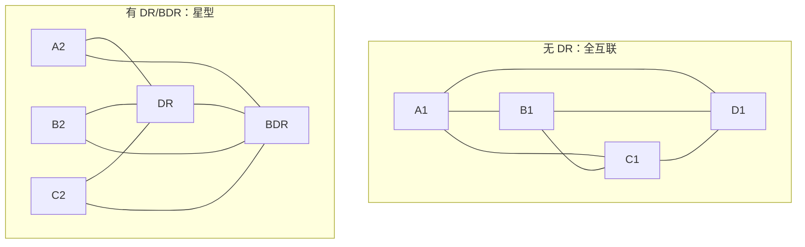
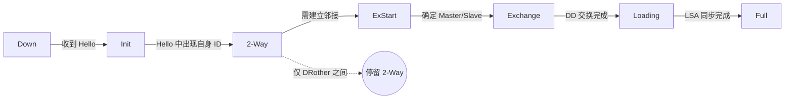
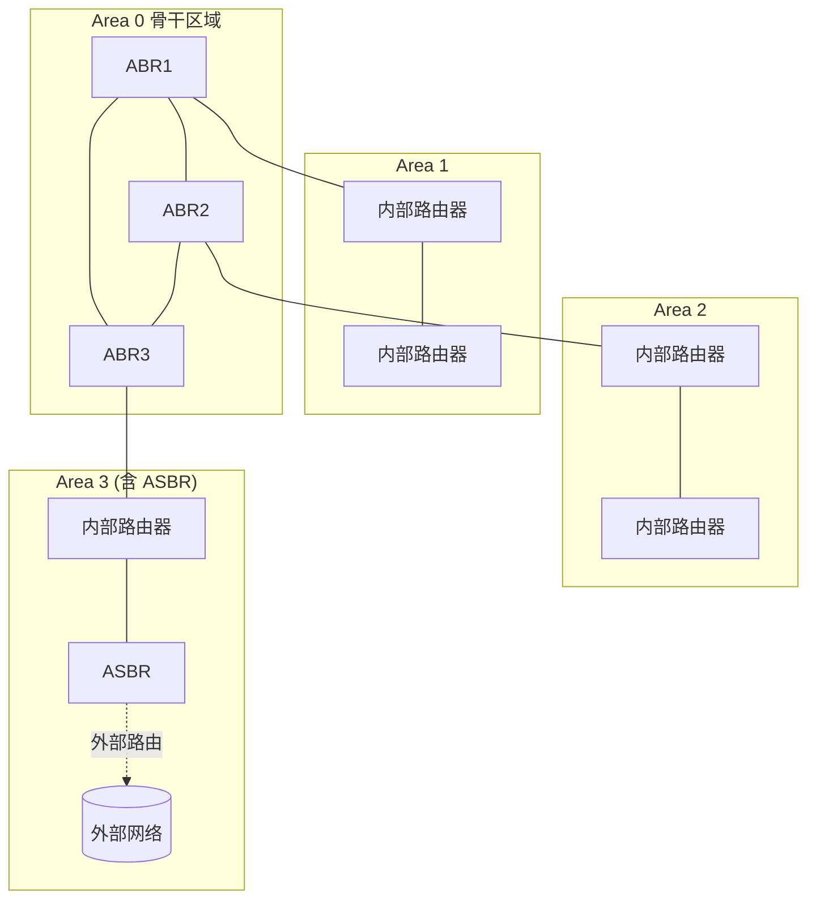

# 5.3 网络层：OSPF协议

## 本章目录

1. [OSPF协议概述](#ospf协议概述)
2. [OSPF工作原理](#ospf工作原理)
3. [OSPF消息类型与格式](#ospf消息类型与格式)
4. [OSPF邻居关系与邻接关系](#ospf邻居关系与邻接关系)
5. [OSPF链路状态通告LSA](#ospf链路状态通告lsa)
6. [OSPF区域架构](#ospf区域架构)
7. [OSPF路由计算过程](#ospf路由计算过程)

---

## OSPF协议概述

### OSPF基本概念

> **OSPF (Open Shortest Path First，开放最短路径优先)**
>
> 基于链路状态算法的内部网关协议(IGP)，由 RFC 2328 (OSPFv2) 定义。每台路由器通过泛洪链路状态信息建立全网拓扑，再用 Dijkstra 算法计算最短路径树。

OSPF 是 5.2 节链路状态算法的工程实现，核心机制有三层：

- **链路状态泛洪**：路由器把自身链路状态通告(LSA)可靠地泛洪到整个区域，使每台路由器拥有一致的拓扑数据库。
- **SPF 计算**：以本机为根运行 Dijkstra，得到到各网络的最短路径。
- **层次化区域**：把网络划分为区域，限制 LSA 泛洪范围，降低数据库规模和计算开销。

#### OSPF 与 RIP 的区别

| 对比维度 | OSPF | RIP |
|----------|------|-----|
| 算法类型 | 链路状态 | 距离向量 |
| 度量 | 基于带宽的 Cost | 跳数 |
| 网络直径 | 无硬性限制 | 最大 15 跳 |
| 收敛速度 | 快(秒级) | 慢(分钟级) |
| 环路抑制 | 全局拓扑，天然无环 | 水平分割/毒性逆转等 |
| 层次结构 | 支持区域划分 | 平面结构 |
| 适用规模 | 大中型网络 | 小型网络 |
| 开销 | CPU/内存较高 | 较低 |

注：OSPF 是**域内**(AS 内部)路由协议；跨 AS 的域间路由由 BGP 负责(见 5.4 节)。

---

## OSPF工作原理

### OSPF基本工作流程

OSPF 运行可分为五个阶段：

```
1. 邻居发现   Hello 协议 → 建立邻居关系
2. 建立邻接   Master/Slave 选举 → 准备同步
3. 数据库同步 DD → LSR → LSU → LSAck
4. SPF 计算   Dijkstra → 构建最短路径树
5. 路由安装   写入路由表 → 生成转发表
```

#### Hello 协议

Hello 包周期性发送，用于发现邻居、维持邻居关系、选举 DR/BDR，并确认双向通信。

- 广播/点到点网络：默认 Hello 间隔 10 秒
- NBMA 网络：默认 Hello 间隔 30 秒
- 死亡间隔(Dead Interval) = 4 × Hello 间隔，超时未收到 Hello 则判定邻居失效

邻居建立要求双方下列参数一致：Area ID、网络掩码、Hello 间隔、死亡间隔、认证信息，以及选项字段兼容。任一不匹配都无法形成邻居。

#### LSA 泛洪

```
LSA 传播：生成 LSA → 接口泛洪 → 邻居确认(LSAck) → 邻居继续转发 → 更新数据库 → 触发 SPF
```

可靠泛洪依靠四个机制：序列号(区分新旧)、校验和(检错)、显式确认与超时重传、老化超时(MaxAge 删除)。

### OSPF路由器类型

按接口所在区域和外部连接，OSPF 路由器分为四类(同一台路由器可兼具多种角色)：

| 角色 | 标志位 | 特征 |
|------|--------|------|
| **内部路由器** (Internal Router) | — | 所有接口属于同一区域，只维护该区域数据库 |
| **骨干路由器** (Backbone Router) | — | 至少有一个接口在 Area 0 |
| **区域边界路由器** (ABR) | B 位 | 连接多个区域、至少接入 Area 0；为每个区域运行独立 SPF，生成 Type-3/4 LSA 做区域间汇总 |
| **自治系统边界路由器** (ASBR) | E 位 | 连接 OSPF 域与外部(其他协议/静态路由)，引入外部路由并生成 Type-5 LSA |

注：ABR 必须连接 Area 0，是区域间路由的中转点；ASBR 可位于任意区域，是外部路由的注入点。

### 指定路由器选举

**选举目的**：在广播/多路访问网络上，若所有路由器两两建立 Full 邻接，邻接数随节点数平方增长，LSA 泛洪冗余严重。引入指定路由器(DR)和备份指定路由器(BDR)后，其余路由器只与 DR/BDR 建立 Full 邻接，DR 负责代表本网段泛洪 LSA。

n 台路由器的邻接数对比：

- 无 DR：两两邻接，需 $n(n-1)/2$ 个邻接
- 有 DR：每台只与 DR、BDR 邻接，约 $2n-3$ 个邻接



注：DR/BDR 是**针对每个多路访问网段**选举的，不是全网唯一；点到点和点到多点网络不选举 DR/BDR。

**选举规则**：

1. **优先级优先**：接口优先级(0–255)最高者当选，0 表示不参与选举，默认值 1。
2. **Router ID 决胜**：优先级相同时，Router ID 大者当选。Router ID 选取顺序为：手工配置 > 最大 Loopback 接口 IP > 最大物理接口 IP，全域内必须唯一。
3. **选举顺序**：先选 BDR，再从其余路由器选 DR。
4. **非抢占**：DR 选定后不被更高优先级的新路由器抢占；DR 失效时由 BDR 顶替，再补选新 BDR。

---

## OSPF消息类型与格式

OSPF 消息直接封装在 IP 之上(协议号 89)，不经 TCP/UDP，可靠性由协议自身保证。所有消息共用 24 字节通用包头。

### OSPF通用包头 (24字节)

```
 0                   1                   2                   3
 0 1 2 3 4 5 6 7 8 9 0 1 2 3 4 5 6 7 8 9 0 1 2 3 4 5 6 7 8 9 0 1
┌───────────────┬───────────────┬───────────────────────────────┐
│  版本 (8位)    │  类型 (8位)    │       包长度 (16位)            │
├───────────────┴───────────────┴───────────────────────────────┤
│              路由器 ID (32位) - 发送方 Router ID               │
├───────────────────────────────────────────────────────────────┤
│              区域 ID (32位) - 所属 OSPF 区域                   │
├───────────────────────────────┬───────────────────────────────┤
│       校验和 (16位)            │       认证类型 (16位)          │
├───────────────────────────────┴───────────────────────────────┤
│              认证数据 (64位) - 按认证类型填充                  │
└───────────────────────────────────────────────────────────────┘
```

字段要点：版本固定为 2 (OSPFv2)；类型取 1–5；认证类型 0(无)、1(简单口令)、2(MD5)。

### 五种消息类型

| 类型 | 名称 | 缩写 | 功能 |
|------|------|------|------|
| 1 | Hello | Hello | 发现/维护邻居，选举 DR/BDR |
| 2 | 数据库描述 | DD | 交换 LSA 头部摘要，比对数据库 |
| 3 | 链路状态请求 | LSR | 请求缺失/过期的具体 LSA |
| 4 | 链路状态更新 | LSU | 携带完整 LSA，实现泛洪 |
| 5 | 链路状态确认 | LSAck | 确认收到 LSU，保证可靠泛洪 |

数据库同步顺序为 **DD → LSR → LSU → LSAck**。

#### Hello (Type 1)

通用包头之后携带：网络掩码、Hello/死亡间隔、选项、优先级、DR/BDR 的 Router ID，以及已知邻居 Router ID 列表。其中邻居列表用于确认双向通信(在对方 Hello 中看到自己即进入 2-Way)。

#### 数据库描述 DD (Type 2)

携带接口 MTU、选项、标志位、DD 序列号，以及一组 LSA 头部(仅摘要，不含 LSA 正文)。三个标志位：

- **I (Initial)**：首个 DD 包
- **M (More)**：后续还有 DD 包
- **MS (Master/Slave)**：Master 置 1，由 Master 控制序列号递增

ExStart 阶段先比 Router ID 选出 Master(大者为 Master)，再由 Master 主导 DD 交换。

#### 链路状态请求 LSR (Type 3)

对比 DD 摘要后，对本地缺失或较旧的每个 LSA 发出请求，请求项由三元组 (LS 类型, 链路状态 ID, 通告路由器) 唯一标识。

#### 链路状态更新 LSU (Type 4)

携带 LSA 数量字段和若干条完整 LSA，是 LSA 泛洪的载体。可作为对 LSR 的响应，也可在拓扑变化时主动泛洪。

#### 链路状态确认 LSAck (Type 5)

携带被确认 LSA 的头部，实现可靠泛洪。点到点链路用单播，多路访问网络用组播确认。发送方在重传定时器超时仍未收到确认时重传。

注：OSPF 使用两个保留组播地址——`224.0.0.5` (AllSPFRouters，所有 OSPF 路由器)和 `224.0.0.6` (AllDRouters，仅 DR/BDR)。

---

## OSPF邻居关系与邻接关系

### 邻居与邻接的区别

**概念区分**：

| 概念 | 定义 | 建立条件 | 状态 |
|------|------|----------|------|
| **邻居关系** | Hello协议发现的相邻路由器 | Hello参数匹配 | 2-Way |
| **邻接关系** | 完全同步LSA数据库的邻居 | 数据库同步完成 | Full |

### 邻接建立状态机

邻居关系从 Down 逐步演进到 Full，对应数据库同步的各个阶段：



| 状态 | 含义 |
|------|------|
| **Down** | 尚未收到邻居 Hello，邻居不可达 |
| **Init** | 收到邻居 Hello，但其中不含本机 Router ID(单向) |
| **2-Way** | 在邻居 Hello 中看到本机 ID，双向通信确认 |
| **ExStart** | 协商 Master/Slave 和初始 DD 序列号 |
| **Exchange** | 交换 DD 包，比对数据库，生成待请求 LSA 列表 |
| **Loading** | 发 LSR 请求、收 LSU、回 LSAck，补齐缺失 LSA |
| **Full** | 数据库完全同步，邻接建立，参与泛洪与 SPF |

注：2-Way 是邻居关系的稳定状态。在广播网络上，两台 DRother(都不是 DR/BDR)之间停留在 2-Way、不再前进；只有与 DR/BDR 之间才推进到 Full。

### 网络类型与邻接策略

OSPF 按链路是否多路访问、是否支持广播，区分四种网络类型，决定是否选举 DR/BDR：

| 网络类型 | 选举 DR/BDR | 邻接范围 | Hello 方式 | 典型链路 |
|----------|-------------|----------|------------|----------|
| 点到点 (P2P) | 否 | 双方 Full | 组播 224.0.0.5 | PPP、HDLC |
| 广播多路访问 | 是 | 仅与 DR/BDR Full | 组播 | 以太网 |
| NBMA | 是 | 仅与 DR/BDR Full | 单播(需配邻居) | 帧中继、ATM |
| 点到多点 (P2MP) | 否 | 各邻居 Full | 单播 | 部分星型 WAN |

注：P2MP 把 NBMA 当作多条 P2P 链路处理，免去 DR/BDR 选举，配置简单且适应拓扑变化。

---

## OSPF链路状态通告LSA

### LSA基本概念

> **LSA (Link State Advertisement)**
> 
> OSPF中用于描述路由器链路状态信息的数据结构，是构建网络拓扑图和计算最短路径的基础。

#### LSA通用头部格式

**LSA头部结构 (20字节)**：

```
 0                   1                   2                   3
 0 1 2 3 4 5 6 7 8 9 0 1 2 3 4 5 6 7 8 9 0 1 2 3 4 5 6 7 8 9 0 1
┌───────────────────────────┬───────────┬───────────────────────────┐
  LS Age (16位)              选项 (8位)   LS类型 (8位)
├───────────────────────────────────────────────────────────────────┤
  链路状态ID (32位) - LSA的唯一标识符
├───────────────────────────────────────────────────────────────────┤
  通告路由器 (32位) - 生成此LSA的路由器ID
├───────────────────────────────────────────────────────────────────┤
  LS序列号 (32位) - LSA版本号防止环路
├───────────────────────────┬───────────────────────────────────────┤
  LS校验和 (16位)             长度 (16位)
└───────────────────────────┴───────────────────────────────────────┘
```

**关键字段功能**：
- **LS Age**：LSA 年龄(0–3600 秒)，用于老化控制
- **LS 类型**：LSA 类型标识(常用 1–5，另有 Type 7 等扩展)
- **链路状态 ID**：含义随类型而异(详见下表)
- **通告路由器**：生成此 LSA 的 Router ID
- **LS 序列号**：版本号，从 `0x80000001` 递增到 `0x7FFFFFFF`，用于区分新旧、防止环路

每条 LSA 由三元组 (LS 类型, 链路状态 ID, 通告路由器) 唯一标识。

### LSA 类型一览

| 类型 | 名称 | 生成者 | 泛洪范围 | 描述内容 |
|------|------|--------|----------|----------|
| 1 | 路由器 LSA (Router) | 每台路由器 | 本区域内 | 本机各接口的链路、代价 |
| 2 | 网络 LSA (Network) | DR | 本区域内 | 多路访问网段上连接的路由器列表 |
| 3 | 网络汇总 LSA (Summary) | ABR | 跨区域 | 通告其他区域的网络前缀及代价 |
| 4 | ASBR 汇总 LSA | ABR | 跨区域 | 通告到达 ASBR 的代价 |
| 5 | 外部 LSA (AS External) | ASBR | 全 AS(Stub 除外) | 引入的外部路由 |
| 7 | NSSA 外部 LSA | NSSA 内 ASBR | 本 NSSA 内 | NSSA 中引入的外部路由，由 ABR 转为 Type 5 |

注：Type 1/2 只在区域内泛洪，是区域内拓扑的全部信息；Type 3/4/5 跨区域传播，但只携带"前缀+代价"而非完整拓扑，因此区域间路由本质上是距离向量式的。

### LSA类型详解

#### Type 1 LSA - 路由器LSA (Router LSA)

**功能**：描述路由器的接口信息和连接关系

**Router LSA结构**：

```
┌─────────────────────────────────────────────────────────┐
  LSA通用头部 (20字节) - LS Age, 类型, ID等
├─────────────┬─────────────┬─────────────────────────────┤
  标志 (8位)    保留 (8位)    链路数量 (16位)
├─────────────────────────────────────────────────────────┤
  链路ID (32位) - 根据链路类型不同含义不同          ┐
├─────────────────────────────────────────────────────────┤   │
  链路数据 (32位) - 链路描述数据                    │ 链路1
├─────┬─────────┬───────────────────────────────────────┤   │
  类型  TOS数    代价 (16位) - 链路代价值             ┘
├─────────────────────────────────────────────────────────┤
  TOS 0代价 (可选) - 不同服务类型的代价
├─────────────────────────────────────────────────────────┤
                        ...
└─────────────────────────────────────────────────────────┘
```

头部标志位：**V** 位标识本机为虚连接端点，**E** 位标识 ASBR，**B** 位标识 ABR。每条链路项含链路类型、链路 ID、链路数据和代价：

| 链路类型 | 数值 | 链路 ID | 链路数据 | 说明 |
|----------|------|---------|----------|------|
| Point-to-Point | 1 | 邻居 Router ID | 接口 IP | 点到点链路 |
| Transit | 2 | DR 的接口 IP | 本接口 IP | 连接多路访问网络 |
| Stub | 3 | 网络地址 | 网络掩码 | 末端网络 |
| Virtual | 4 | 邻居 Router ID | 接口 IP | 虚连接 |

#### Type 2 LSA - 网络LSA (Network LSA)

**功能**：由DR生成，描述多路访问网络上的路由器列表

**Network LSA结构**：

```
┌─────────────────────────────────────────────────────────┐
  LSA通用头部 (20字节) - LS Age, 类型=2, ID等
├─────────────────────────────────────────────────────────┤
  网络掩码 (32位) - 多路访问网络的子网掩码
├─────────────────────────────────────────────────────────┤
  连接的路由器_1 (32位) - 第一个连接路由器的Router ID
├─────────────────────────────────────────────────────────┤
  连接的路由器_2 (32位) - 第二个连接路由器的Router ID
├─────────────────────────────────────────────────────────┤
                        ...
└─────────────────────────────────────────────────────────┘
```

仅由 DR 生成，链路状态 ID 取 DR 的接口 IP，列出该网段上所有路由器的 Router ID。作用是把多路访问网络抽象成 SPF 图中的一个"伪节点"，避免把网段建模成全互联。

#### Type 3 LSA - 网络汇总LSA (Network Summary LSA)

**功能**：由ABR生成，将一个区域的网络信息通告到其他区域

**Summary LSA结构**：

```
┌─────────────────────────────────────────────────────────┐
  LSA通用头部 (20字节) - LS Age, 类型=3, ID等
├─────────────────────────────────────────────────────────┤
  网络掩码 (32位) - 汇总网络的子网掩码
├─────────┬───────────────────────────────────────────────┤
  保留(8)   度量值 (24位) - 到达目标网络的代价
├─────────┬───────────────────────────────────────────────┤
  TOS(8)   TOS度量值 (24位) - 可选的服务类型代价
├─────────────────────────────────────────────────────────┤
                        ...
└─────────────────────────────────────────────────────────┘
```

由 ABR 生成，链路状态 ID 为目标网络地址，携带前缀掩码与到该前缀的代价。ABR 可在此做区域间路由汇总，减少 Type 3 LSA 数量。

#### Type 4 LSA - ASBR汇总LSA

由 ABR 生成，链路状态 ID 为 ASBR 的 Router ID，度量值为到达该 ASBR 的代价。其他区域的路由器靠它定位 ASBR，从而正确计算 Type 5 外部路由。

#### Type 5 LSA - 外部LSA (AS External LSA)

**功能**：由ASBR生成，描述外部路由信息

**External LSA结构**：

```
┌─────────────────────────────────────────────────────────┐
  LSA通用头部 (20字节) - LS Age, 类型=5, ID等
├─────────────────────────────────────────────────────────┤
  网络掩码 (32位) - 外部网络的子网掩码
├─┬─────────┬───────────────────────────────────────────────┤
  E  TOS(7)   度量值 (24位) - 外部路由代价
├─────────────────────────────────────────────────────────┤
  转发地址 (32位) - 数据包转发的下一跳地址
├─────────────────────────────────────────────────────────┤
  外部路由标记 (32位) - 外部路由的策略标记
└─────────────────────────────────────────────────────────┘
```

头部 **E 位**区分两种外部度量：

- **E=0(Type-1 外部路由)**：总代价 = 外部代价 + 到 ASBR 的内部代价，会随路径变化
- **E=1(Type-2 外部路由，默认)**：总代价 = 外部代价，不计内部代价

易混：这里的 Type-1/Type-2 指外部路由的**度量类型**，与 LSA 的"类型号"无关。

### LSA数据库管理

#### 老化机制

LSA 头部的 LS Age 从 0 开始随时间增长：

- **0 秒**：LSA 生成
- **1800 秒(30 分钟)**：原始通告路由器刷新该 LSA(序列号递增重新泛洪)，保持数据库一致
- **3600 秒(MaxAge，60 分钟)**：若未被刷新则达到最大年龄。路由器把 Age 置为 MaxAge 立即泛洪，各路由器据此删除该 LSA 并触发 SPF 重算

#### 可靠泛洪三要素

- **序列号**：从 `0x80000001` 递增，收到同一 LSA 时序列号大者为新，防止旧 LSA 覆盖新 LSA
- **校验和**：用 Fletcher 算法对 LSA(LS Age 除外)校验，损坏的 LSA 被丢弃
- **确认重传**：每条泛洪的 LSA 必须被 LSAck 确认，超时未确认则重传

---

## OSPF区域架构

### OSPF层次化设计

#### 区域概念与优势

> **OSPF区域 (OSPF Area)**
> 
> 将大型OSPF网络划分为较小的管理域，减少LSA洪泛范围，降低路由计算复杂度，提高网络可扩展性。

分层带来三方面收益：

- **泛洪控制**：Type 1/2 LSA 只在区域内泛洪，Type 3/4/5 携带摘要跨区域，单台路由器的数据库随之缩小。
- **SPF 局部化**：每台路由器只对所在区域运行完整 Dijkstra；某区域拓扑波动不会触发全网 SPF 重算。
- **故障隔离**：区域内的链路抖动被 ABR 屏蔽，不外溢到其他区域。

#### 区域结构与 Area 0

OSPF 采用两级层次：所有非骨干区域都必须与**骨干区域 Area 0** 相连，区域间流量经 Area 0 中转。ABR 横跨 Area 0 与某个非骨干区域。



**Area 0 规则**：所有 ABR 必须接入 Area 0；区域间路由必须经过 Area 0(防止区域间环路)；Area 0 自身必须保持连通。当某区域无法物理连到 Area 0、或 Area 0 被分割时，用虚连接补救。

**虚连接 (Virtual Link)**：穿越一个非骨干区域、把两端 ABR 逻辑上接入 Area 0 的隧道。两端都须是 ABR，被穿越区域(传输区域)不能是 Stub。常用于两种场景：连接被分割的 Area 0，或把无法直连 Area 0 的区域接入骨干。

```
某区域无法直连 Area 0：
  Area 0 ── ABR1 ── Area 1 ── ABR2 ── Area 2
              └──── Virtual Link ────┘   (穿越 Area 1)
```

### 特殊区域类型

通过在 ABR 处过滤更多 LSA、改用缺省路由替代，可进一步压缩区域内数据库。常见特殊区域如下：

| 区域类型 | 接收的 LSA | 外部路由处理 | 可含 ASBR |
|----------|------------|--------------|-----------|
| 普通区域 | 1,2,3,4,5 | 完整接收 Type 5 | 是 |
| **Stub** | 1,2,3 + 缺省路由 | 不收 Type 4/5，用缺省路由出区 | 否 |
| **Totally Stubby** | 1,2 + 缺省路由 | 连 Type 3 也过滤，仅留缺省路由 | 否 |
| **NSSA** | 1,2,3,7 + 缺省路由 | 不收 Type 5，但本区可生成 Type 7 | 是 |

要点：

- **Stub**：屏蔽外部路由(Type 5)，由 ABR 注入一条缺省路由代替，适合不需要明细外部路由的分支区域。Stub 区域不能配置虚连接、不能含 ASBR。
- **Totally Stubby**：在 Stub 基础上再屏蔽区域间路由(Type 3)，区域内只保留区内明细加一条缺省路由，数据库最小。
- **NSSA**：解决"Stub 区域内又恰好有 ASBR 需引入外部路由"的矛盾。区域内 ASBR 生成 **Type 7 LSA** 在本区泛洪，到达 ABR 后转换为 Type 5 通告到其他区域(`ASBR 生成 Type 7 → NSSA 内泛洪 → ABR 转 Type 5 → 全 AS`)。

### 区域间路由汇总

ABR 可把一个区域内的多条明细前缀聚合成一条 Type 3 LSA 向外通告：

```
Area 1:  10.1.1.0/24  10.1.2.0/24  10.1.3.0/24  ──汇总──>  10.1.0.0/16
```

汇总减少 Type 3 LSA 数量、缩小路由表、隐藏区域内明细的抖动。注意汇总前缀须恰好覆盖所有明细，否则可能产生路由黑洞或误吸引流量。

---

## OSPF路由计算过程

### 链路代价 Cost

OSPF 的度量是接口 **Cost**，与带宽成反比，一条路径的代价为沿途各出接口 Cost 之和：

$$\text{Cost} = \frac{\text{参考带宽}}{\text{接口带宽}}$$

参考带宽默认 100 Mbps，得数向下取整且最小为 1。例如 100 Mbps 接口 Cost=1，10 Mbps 接口 Cost=10。

注：默认参考带宽下，所有 ≥100 Mbps 的接口 Cost 都为 1，无法区分千兆与万兆。实际网络通常调高参考带宽来恢复区分度，也可手工指定接口 Cost。

### SPF 计算

每台路由器以本机为根，在区域内 LSA(Type 1/2)构成的拓扑图上运行 Dijkstra，得到区域内最短路径树，再叠加跨区域/外部路由：

1. **区域内路由**：对 Type 1/2 LSA 跑 Dijkstra，得到到区域内各网络的最短路径。
2. **区域间路由(Type 3)**：到目标的代价 = LSA 中的度量值 + 本机到通告该 LSA 的 ABR 的代价，取最小。
3. **ASBR 定位(Type 4)**：算出到各 ASBR 的代价，为外部路由做准备。
4. **外部路由(Type 5)**：Type-1 外部 = 外部代价 + 到 ASBR 内部代价；Type-2 外部 = 外部代价(默认)。

SPF 由 LSA 变化、邻居/接口状态变化等触发。为避免拓扑抖动导致频繁计算，OSPF 对 SPF 设置最小间隔并采用指数退避。

### 路由优先级

同一前缀有多种来源时，按下列顺序优选(高者优先)，同级再比 Cost：

1. 区域内路由(Intra-area，Type 1/2)
2. 区域间路由(Inter-area，Type 3)
3. 外部路由 Type-1(计内部代价)
4. 外部路由 Type-2(仅外部代价)

到同一目标存在多条等代价路径时，OSPF 支持等价多路径(ECMP)负载均衡。

---

## 本章小结

- **协议性质**：链路状态型 IGP(RFC 2328)，是 5.2 节 Dijkstra 算法的工程实现，用 LSA 泛洪 + SPF 计算得到无环最短路径。
- **邻居与邻接**：Hello 协议发现邻居(2-Way)，经 ExStart→Exchange→Loading 完成数据库同步后达到 Full；广播网络选举 DR/BDR 以减少邻接数和泛洪冗余。
- **LSA 与区域**：Type 1/2 描述区域内拓扑、只在区域内泛洪；Type 3/4/5 携带摘要跨区域。区域划分限制泛洪范围、局部化 SPF；Area 0 为骨干，所有区域须与之相连。
- **路由计算**：度量为基于带宽的 Cost；路由按 区域内 > 区域间 > 外部 Type-1 > 外部 Type-2 优选。
- **易混点**：DR/BDR 是每个多路访问网段的角色，非全网唯一；外部路由 Type-1/Type-2 指度量类型，与 LSA 类型号无关；OSPF 解决**域内**路由，**域间**路由见 5.4 节 BGP。

---

**[下一节：5.4 自治系统间路由：BGP](5.4网络层：BGP协议.md)**
