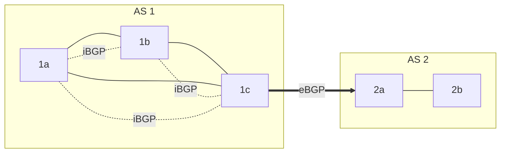
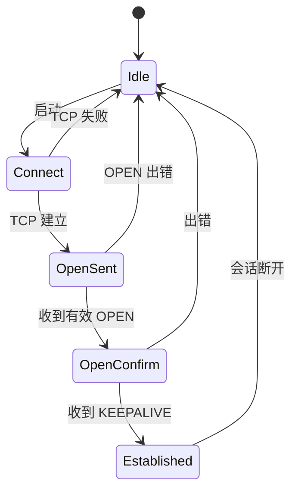
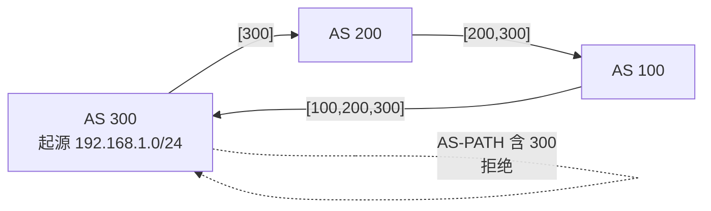
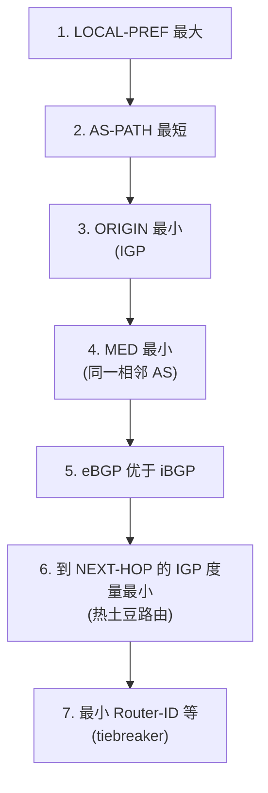
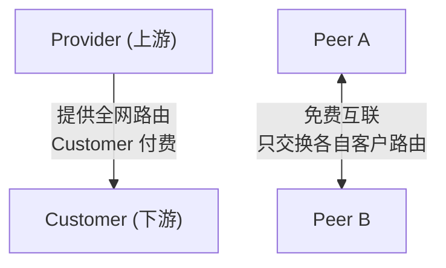
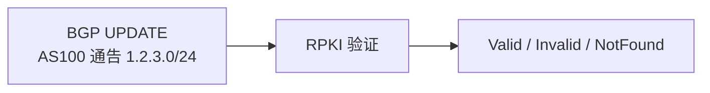

# 5.4 网络层：BGP协议

## 本章目录

1. [BGP协议概述](#bgp协议概述)
2. [BGP基本工作原理](#bgp基本工作原理)
3. [BGP消息类型与格式](#bgp消息类型与格式)
4. [BGP路径属性](#bgp路径属性)
5. [BGP路由选择过程](#bgp路由选择过程)
6. [自治系统关系模型](#自治系统关系模型)
7. [互联网层次结构与IXP](#互联网层次结构与ixp)
8. [IP任播技术](#ip任播技术)
9. [BGP安全](#bgp安全)

---

## BGP协议概述

### 基本概念

> **BGP (Border Gateway Protocol，边界网关协议)**
>
> 互联网的域间路由协议，用于在自治系统(AS)之间交换路由可达性信息。当前标准为 BGP-4 (RFC 4271)。

互联网由数万个自治系统组成。每个 AS 内部用 IGP(OSPF、IS-IS、RIP)计算最短路径；AS 之间则用 BGP 交换路由。BGP 的核心目标不是"找最短路径"，而是**按照各 AS 的商业策略控制路由**——谁的流量走哪条链路，往往由付费关系而非跳数决定。

### BGP 与 IGP 的区别

| 维度 | BGP (域间) | IGP / OSPF、IS-IS (域内) |
|------|-----------|--------------------------|
| 适用范围 | AS 之间 | AS 内部 |
| 算法类型 | 路径向量 | 链路状态 / 距离向量 |
| 优化目标 | 策略优先 | 最短路径优先 |
| 路由信息 | 完整 AS 路径 + 多种属性 | 度量值 |
| 规模 | 全球(数十万前缀) | 单个 AS |
| 商业关系 | 核心考量 | 不涉及 |

注：BGP 是**路径向量(path vector)协议**——它在距离向量的基础上，让每条路由携带完整的 AS 路径列表，从而既能检测环路，又能支持策略路由。

### eBGP 与 iBGP

BGP 会话运行在 TCP(端口 179)之上，分两类：



- **eBGP (external BGP)**：连接**不同 AS** 的边界路由器，跨越 AS 边界传播路由。
- **iBGP (internal BGP)**：连接**同一 AS 内部**的 BGP 路由器，把从 eBGP 学到的外部路由分发给本 AS 的其他路由器。

| | eBGP | iBGP |
|---|------|------|
| 对等体所在 AS | 不同 AS | 同一 AS |
| 物理连接 | 通常直连 | 可跨多跳(经 IGP) |
| 防环机制 | AS-PATH 检测 | 不向其他 iBGP 邻居转发(见下) |

**iBGP 全连接(full mesh)要求**：从一个 iBGP 邻居学到的路由，不会再转发给其他 iBGP 邻居(防止 AS 内环路)。因此一个 AS 内的 $n$ 个 BGP 路由器若两两建会话，需要 $n(n-1)/2$ 条 iBGP 连接。规模大时用**路由反射器(Route Reflector)**或**联邦(Confederation)**缓解，由反射器统一向客户端转发路由。

---

## BGP基本工作原理

### 会话建立与状态机

两台路由器先建立 TCP 连接，再通过交换 OPEN 消息协商参数(BGP 版本、AS 号、保持时间 Hold Time)，之后用 KEEPALIVE 维持会话。BGP 有限状态机的主要状态：



进入 **Established** 后才开始交换路由(UPDATE 消息)。会话维持依赖两个定时器:KEEPALIVE 周期(默认 60 秒)和 Hold Timer(默认 180 秒，超时未收到任何消息则断开)。

### 路径向量算法与环路检测

每条 BGP 路由都携带 **AS-PATH**——记录该路由从源 AS 到本地依次经过的所有 AS。这与距离向量(只记距离)的关键区别在于:完整路径让环路检测变得直接。

```
距离向量 (RIP):  目标网络      距离  下一跳
                10.1.0.0/16    2    R2

路径向量 (BGP):  目标网络      AS-PATH        下一跳   LOCAL-PREF
                10.1.0.0/16   [200,300]      R2       100
```

**环路检测规则**:路由器收到一条路由时，检查 AS-PATH 是否已包含自己的 AS 号——若包含，说明这条路由曾经过本 AS，必然成环，直接丢弃。



每次经 eBGP 向外通告时，本 AS 把自己的 AS 号**前插(prepend)**到 AS-PATH 头部；iBGP 传播时 AS-PATH 保持不变。

### 路由通告规则

- **eBGP 通告**:向外部邻居前插自己的 AS 号，并把 NEXT-HOP 改为本路由器的对接接口地址。
- **iBGP 通告**:AS-PATH 与 NEXT-HOP 均保持不变。因此要求 AS 内部 IGP 能够到达该 NEXT-HOP(否则路由不可用)。
- **iBGP 水平分割**:从 iBGP 邻居学到的路由不再转发给其他 iBGP 邻居(防环)。

---

## BGP消息类型与格式

### 通用消息头(19 字节)

所有 BGP 消息共用 19 字节头部:

```
| 标记 (Marker, 16 字节) | 长度 (2 字节) | 类型 (1 字节) |
```

- **标记**:16 字节(早期用于同步/认证，现固定为全 1)。
- **长度**:整个消息长度(19–4096 字节)。
- **类型**:1=OPEN，2=UPDATE，3=NOTIFICATION，4=KEEPALIVE。

### 四种消息

| 类型 | 名称 | 功能 |
|------|------|------|
| 1 | OPEN | 建立会话，协商版本、AS 号、Hold Time、能力(Capability) |
| 2 | UPDATE | 通告新路由、撤销失效路由(核心消息) |
| 3 | NOTIFICATION | 报告错误并关闭会话 |
| 4 | KEEPALIVE | 维持会话活跃(仅 19 字节，无数据) |

**UPDATE 消息**是 BGP 的核心，结构为:

```
| 撤销路由长度 | 被撤销前缀 (变长) | 路径属性长度 | 路径属性 (变长) | NLRI (变长) |
```

- **被撤销前缀**:从对端路由表删除的前缀。
- **路径属性**:AS-PATH、NEXT-HOP、LOCAL-PREF 等(下一节)。
- **NLRI (Network Layer Reachability Information)**:本次通告的可达前缀，以 `<前缀长度, 前缀>` 表示(支持 CIDR)。

一条 UPDATE 中所有 NLRI 前缀共享同一组路径属性;撤销和通告可同时出现。

---

## BGP路径属性

每条路由附带一组**路径属性(path attribute)**，是 BGP 实现策略的关键。属性按两个维度分类:

- **知名(well-known) vs 可选(optional)**:前者所有 BGP 实现必须识别。
- **传递(transitive) vs 非传递(non-transitive)**:是否向下一个 AS 继续传播。

| 属性 | 类型 | 作用 |
|------|------|------|
| AS-PATH | 知名强制 | 记录经过的 AS 序列，用于防环和选路 |
| NEXT-HOP | 知名强制 | 到达目标的下一跳 IP |
| LOCAL-PREF | 知名自主 | AS 内部优选(仅 iBGP 传播) |
| MED | 可选非传递 | 向相邻 AS 暗示入站偏好 |
| ORIGIN | 知名强制 | 路由起源类型(IGP / EGP / INCOMPLETE) |
| COMMUNITY | 可选传递 | 路由打标签，便于批量策略 |

### AS-PATH

记录路由经过的 AS 序列，例如 `[100, 200, 300]`。两个作用:**防环**(见前)和**选路**(路径越短越优)。

路径段有两种类型:`AS_SEQUENCE`(有序序列)和 `AS_SET`(无序集合，用于聚合路由)。计算路径长度时，每个 AS_SEQUENCE 成员计 1，整个 AS_SET 计 1。

### NEXT-HOP

指示到达目标网络的下一跳 IP。

```
AS100  R1(1.1.1.1) ──── R2(2.2.2.2)  AS200
```

- eBGP 通告时:R1 发给 R2 的 NEXT-HOP = 1.1.1.1(自己的接口)。
- iBGP 传播时:NEXT-HOP 不变。AS 内的路由器必须能通过 IGP 到达该地址，否则该路由不可用。

### LOCAL-PREF

AS **内部**用来表达"我希望本 AS 的出站流量走哪个出口"的优先级。**数值越大越优先**，默认 100。

```
            AS 100
   R1 ── ISP-A(AS200)   ← 对某前缀设 LOCAL-PREF=200(主用)
   R2 ── ISP-B(AS300)   ← 同前缀 LOCAL-PREF=100(备用)
```

R1、R2 把各自的偏好通过 iBGP 传遍全 AS，于是整个 AS 一致地优选 R1 出口。

易混:**LOCAL-PREF 只在 AS 内部(iBGP)传播，不会通过 eBGP 传出本 AS**——它影响的是"本 AS 的出站流量"。

### MED (Multi-Exit Discriminator)

当两个 AS 之间有多条链路时，一个 AS 用 MED 向对端**暗示**自己更希望对方从哪条链路把流量送进来。**数值越小越优先**，默认 0。

```
   AS200                       AS100
    R3 ◄──── (MED=50) ──────  R1
    R4 ◄──── (MED=100) ─────  R2
```

AS100 通过给两条链路设不同 MED，告诉 AS200"请优先从 MED=50 的链路把流量发过来"。

MED 与 LOCAL-PREF 对比:

| | LOCAL-PREF | MED |
|---|-----------|-----|
| 影响方向 | 本 AS 出站流量 | 相邻 AS 入站流量 |
| 传播范围 | 仅 AS 内部 | 仅相邻 AS |
| 优先方向 | 越大越好 | 越小越好 |

注:MED 默认只比较**来自同一相邻 AS** 的多条路由，不同 AS 的 MED 不可比。

### ORIGIN

标识路由如何进入 BGP:`IGP(0)` < `EGP(1)` < `INCOMPLETE(2)`，选路时数值小者优。IGP 表示由本地显式注入(network 宣告)，INCOMPLETE 表示由其他协议重分发而来。

### COMMUNITY

给路由打一个 32 位标签(常写作 `AS号:值`，如 `100:80`)，便于在邻居间批量执行策略，是可选传递属性。几个知名值:

- `NO_EXPORT (65535:65281)`:不向 eBGP 邻居通告。
- `NO_ADVERTISE (65535:65282)`:不向任何邻居通告。

---

## BGP路由选择过程

当路由器对同一前缀收到多条路由时，依次按下列规则**逐级筛选**，直到剩下唯一的最佳路由。考研/教材层面只需掌握前几条主干即可。



主干逻辑:**先看策略(LOCAL-PREF)，再看路径长度(AS-PATH)，最后才看成本(IGP 度量)**。这正体现了 BGP "策略优先于最短路径" 的本质。

> 注:实际厂商实现(如 Cisco)会在最前面加一条私有的 Weight，且把"本地起源优先"插在 LOCAL-PREF 之后。这些属于实现细节，标准 BGP 决策的核心是上图前几步。

### 决策示例

R1 对前缀 192.168.1.0/24 收到三条路由:

| 路由 | 来源 | LOCAL-PREF | AS-PATH | MED |
|------|------|-----------|---------|-----|
| A | eBGP(AS200) | 100 | [200,300] | 50 |
| B | eBGP(AS300) | 100 | [300] | 100 |
| C | iBGP | 150 | [400,500] | 10 |

第 1 步比较 LOCAL-PREF:C(150) > A、B(100)，**直接选 C**。即便 C 的 AS-PATH 更长、是 iBGP 学来的，LOCAL-PREF 更高就胜出——再次说明策略优先。

### 热土豆路由 (Hot-Potato Routing)

当 LOCAL-PREF、AS-PATH 等都无法分出胜负、剩下多个等价出口时，BGP 选**到 NEXT-HOP 的 IGP 度量最小**的那个出口——也就是用本 AS 内部成本最低的路径，**尽快把分组甩出本 AS**，把转发负担丢给下游 AS。

```
        ┌──────── AS 内部 ────────┐
        │   d1=2                  │
   入口节点 ───────► 出口 X ──► 目标(经 NEXT-HOP a)
        │   d2=5                  │
        └──────────► 出口 Y ──► 目标(经 NEXT-HOP a)
```

上图入口节点对同一目标有两个等价出口，IGP 度量 d1=2 < d2=5，于是选出口 X。

易混:**热土豆 = "尽早把流量扔出本 AS"**，只看本 AS 内部到出口的代价，不关心出 AS 之后的总路径长短，因此不一定是端到端最优。

---

## 自治系统关系模型

### 三种商业关系

互联网由 AS 之间的商业合同连接，主要有两类(加上同属一家公司的兄弟关系):



- **Provider–Customer(提供商–客户)**:Customer 向 Provider **付费**购买全网传输服务。Provider 把全网路由给 Customer;Customer 只把自己及其下游客户的路由给 Provider。
- **Peer–Peer(对等)**:双方**免费互联**，只交换各自(及各自客户)的路由，互不为对方提供穿透(transit)服务。常见于流量大致对等、能省下转接费的两家网络之间。

### Gao–Rexford 路由输出规则

商业关系决定了一个 AS 愿意把路由通告给谁。核心动机:**只为能赚钱(自己起源)或客户(付费)的流量提供穿透。**

| 路由来自 | 通告给 Provider | 通告给 Customer | 通告给 Peer |
|----------|:---:|:---:|:---:|
| 自己起源 | 是 | 是 | 是 |
| Customer | 是 | 是 | 是 |
| Provider | 否 | 是 | 否 |
| Peer | 否 | 是 | 否 |

直观理解:**从 Customer 学到的路由谁都给(因为客户付费，转接它的流量本就是收入);从 Provider/Peer 学到的只给自己的 Customer**——否则就等于免费替别人扛流量却赚不到钱。

### Valley-Free(无谷)路径

上述规则的结果是合法路径满足"无谷":AS 路径形如**先一路向上(Customer→Provider)，可选地经过一个 Peer→Peer 横跳，再一路向下(Provider→Customer)**。中途不会出现"下去又上来"的谷。路由泄露(route leak)往往就是违反了无谷约束。

```
Customer ─► Provider ─► [Peer ─ Peer] ─► Customer ─► Customer
        上行             横跳            下行
```

---

## 互联网层次结构与IXP

### Tier-1 / Tier-2 / Tier-3

ISP 按规模与商业地位大致分三层:

```
Tier-1 (全球骨干，互为 Peer，无需付费上游)
   │  例:Level3、AT&T、NTT 等少数几家
   ▼
Tier-2 (区域 ISP，既有上游 Provider，也有下游 Customer)
   │
   ▼
Tier-3 (本地 ISP / 接入网，主要作为 Customer)
```

判定标准:**Tier-1 不需要为 IP 传输向任何人付费**(全靠免费对等覆盖全网);Tier-2 既买上游又卖下游;Tier-3 主要靠购买上游接入。

### IXP(互联网交换点)

**IXP (Internet Exchange Point)** 是一个公共交换设施，让众多 AS 在一处直接对等互联，绕开向 Tier-1 付费转接，从而**降低成本、缩短路径、提升性能**。

```
传统转接:  AS-A ──付费──► Provider ──付费──► AS-B

经 IXP:    AS-A ──┐
                 ├── IXP ──┤
           AS-B ──┘        └── AS-C
           (彼此直接对等，免转接费)
```

大型 IXP 常提供 **Route Server**:成员只需与 Route Server 建立一条 BGP 会话即可与所有其他成员交换路由，把所需会话数从 $O(n^2)$ 降到 $O(n)$。

---

## IP任播技术

### 任播服务模型

> **IP 任播 (IP Anycast)**
>
> 让**多个服务器实例共享同一个 IP 地址**;客户端发往该地址的请求，被路由系统自动送到"最近"的实例。

与其他寻址方式对比:

| 模式 | 目标 | 说明 |
|------|------|------|
| 单播 Unicast | 一对一 | 唯一目标地址 |
| 广播 Broadcast | 一对全部 | 仅限本地网络 |
| 组播 Multicast | 一对一组 | 组成员订阅 |
| 任播 Anycast | 一对最近 | 多实例共用地址，路由就近选择 |

**实现机制**:每个实例所在的 AS 都用 BGP 通告**相同的前缀**。其他路由器收到来自不同位置的同一前缀，按 BGP 选路规则各自选出"最近"的那一份，于是不同地区的客户端自然被导向不同实例。客户端对此无感知。

### 应用场景

- **DNS 根服务器**:13 个根服务器标识(A–M)各对应大量任播实例，全球数百个节点共享同一组 IP。查询被就近应答，既降延迟又抗单点故障。
- **CDN 内容分发**:用任播地址替代基于 DNS 的节点选择，省去 DNS 解析环节，并能就近接入、自动容灾。
- **DDoS 缓解**:攻击流量被任播自然分散到多个清洗节点就近处理，单点被打垮不影响整体。

### 任播的局限

任播在路由层做"就近"，但对**有状态连接**不友好:路由一旦变化，后续分组可能被导向另一个实例，导致 TCP 连接中断。因此任播多用于:

- 无状态或短连接服务(DNS UDP 查询、CDN 首跳调度)。
- 配合无状态服务设计或外部会话存储，避免把连接状态绑死在单个实例上。

---

## BGP安全

BGP 设计之初默认互信，缺乏对"谁有权通告某前缀"的验证，存在几类典型威胁:

- **前缀劫持(prefix hijacking)**:某 AS 通告了不属于自己的前缀，把他人流量吸引过来。
  例:合法的 `1.2.3.0/24` 属于 AS100，但 AS200 也通告它，部分流量被错误导向 AS200。
- **路由泄露(route leak)**:违反 Gao–Rexford 规则把不该传的路由传出去(如把从一个 Provider 学到的路由通告给另一个 Provider)，破坏无谷约束，造成绕路或流量黑洞。

历史上的 2008 年巴基斯坦误通告导致 YouTube 全球不可达，就是典型的前缀劫持/误配置事件。

### RPKI

**RPKI (Resource Public Key Infrastructure)** 用公钥体系为"前缀–AS 绑定"提供可验证的授权,缓解前缀劫持。

- **ROA (Route Origin Authorization)**:由前缀持有者签发的声明"前缀 P 可由 AS X 起源通告"。
- **起源验证(ROV)**:路由器收到一条路由后，比对 ROA 得到三种结果——
  - `Valid`:存在匹配的 ROA;
  - `Invalid`:存在 ROA 但起源 AS 不符(典型劫持特征，可丢弃);
  - `NotFound`:无相关 ROA(无法判定，通常仍接收)。



注:RPKI 只验证"起源 AS 是否合法"，并不能保证整条 AS-PATH 真实。验证完整路径需要更重的 **BGPsec**(对 AS-PATH 逐跳签名)，目前部署很少。

---

## 本章小结

- **定位**:BGP 是互联网的域间路由协议，运行在 TCP 之上，目标是按**商业策略**而非最短路径来控制 AS 间路由。
- **路径向量**:每条路由携带完整 AS-PATH，既用于**环路检测**(拒绝含自己 AS 号的路由)，也用于选路。
- **eBGP / iBGP**:eBGP 跨 AS 传播并前插 AS 号、改 NEXT-HOP;iBGP 在 AS 内分发外部路由，保持属性不变，受全连接/水平分割约束。
- **路径属性**:LOCAL-PREF(域内、控出站、越大越好、不出 AS)、MED(对相邻 AS、控入站、越小越好)、AS-PATH、NEXT-HOP、ORIGIN、COMMUNITY。
- **选路决策**:LOCAL-PREF → AS-PATH → ORIGIN → MED → eBGP 优先 → 热土豆(IGP 度量最小)。
- **商业关系**:Provider–Customer、Peer–Peer 决定路由输出(Gao–Rexford)，结果是 Valley-Free 路径。
- **任播**:多实例共用一个前缀，靠 BGP 就近选路，用于 DNS 根、CDN、DDoS 缓解。
- **安全**:前缀劫持与路由泄露是主要威胁;RPKI/ROA 验证起源 AS 合法性。

---

**[下一节：5.5 SDN控制平面架构](5.5网络层：SDN控制平面.md)**
