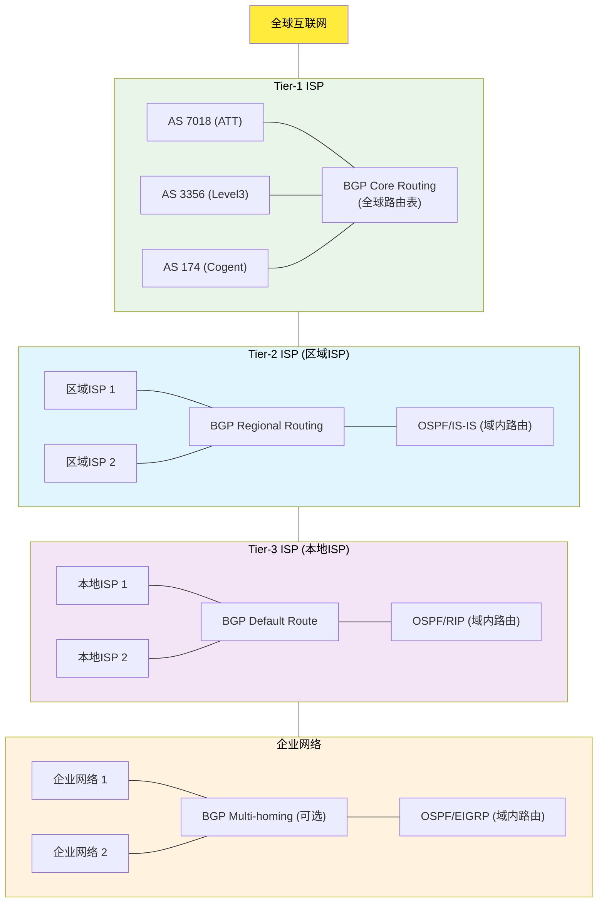
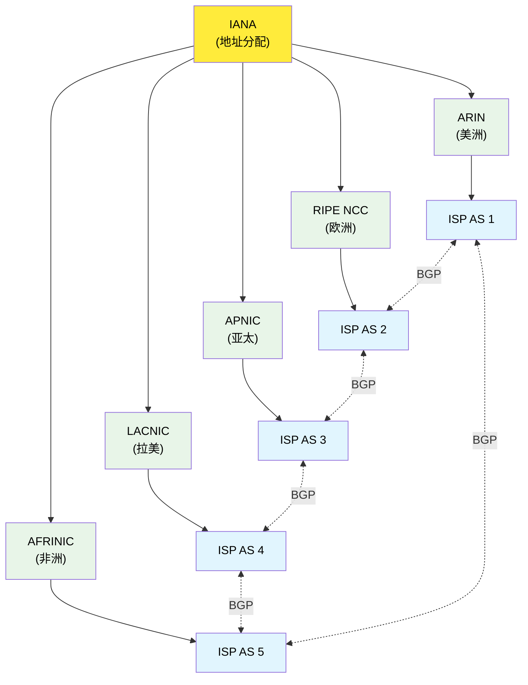
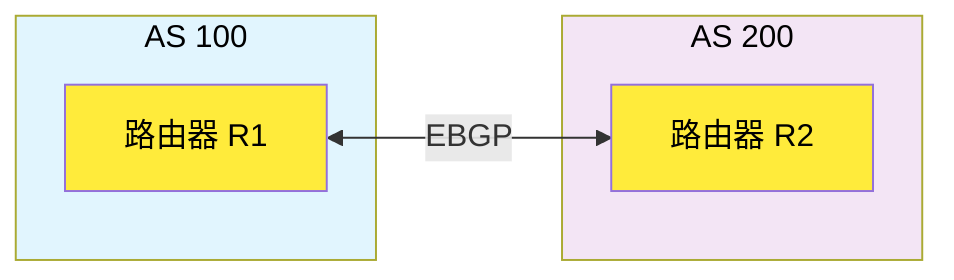
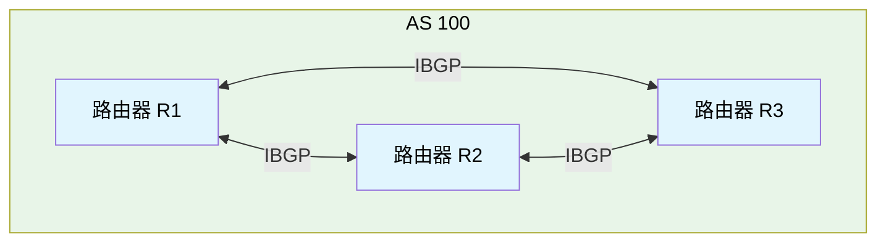
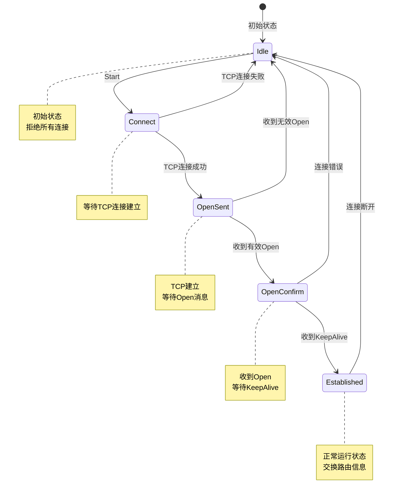
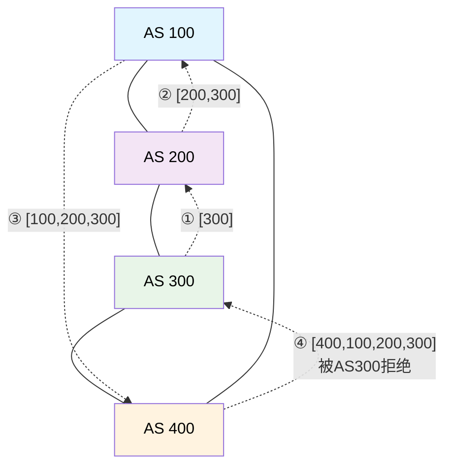

# 5.4 网络层：BGP协议

## 本章目录

1. [BGP协议概述](#bgp协议概述)
2. [BGP基本工作原理](#bgp基本工作原理)
3. [BGP消息类型与格式](#bgp消息类型与格式)
4. [BGP路径属性详解](#bgp路径属性详解)
5. [BGP路由选择过程](#bgp路由选择过程)
6. [BGP路由策略与控制](#bgp路由策略与控制)
7. [自治系统关系模型](#自治系统关系模型)
8. [IP任播技术](#ip任播技术)
9. [BGP在互联网中的实现](#bgp在互联网中的实现)

---

## BGP协议概述

### BGP基本概念

> **BGP (Border Gateway Protocol)**
> 
> 互联网核心路由协议，用于自治系统(AS)之间交换路由信息，是维持全球互联网连通性的关键协议。

#### BGP的重要地位

**互联网路由架构**：



**BGP应用层次**：
- 域间路由协议 (EGP)
- 策略路由控制
- 商业关系实现
- 全球路由表管理

#### BGP vs IGP对比

**协议特性对比**：

| 对比维度 | BGP | IGP (OSPF/IS-IS) |
|----------|-----|------------------|
| **适用范围** | 自治系统间 | 自治系统内 |
| **算法类型** | 路径向量 | 链路状态/距离向量 |
| **优化目标** | 策略优先 | 最短路径优先 |
| **收敛特性** | 慢收敛 | 快速收敛 |
| **扩展能力** | 全球规模 | 区域规模 |
| **路由信息** | 路径+策略 | 度量值 |
| **商业考虑** | 重要 | 不考虑 |

#### BGP版本演进

**BGP历史版本**：

```
BGP版本发展：
• BGP-1 (RFC 1105, 1989): 最初版本
• BGP-2 (RFC 1163, 1990): 改进错误处理
• BGP-3 (RFC 1267, 1991): 增加CIDR支持
• BGP-4 (RFC 4271, 1995-2006): 当前标准版本

BGP-4核心特性：
✓ 路径向量算法
✓ CIDR和路由聚合
✓ 多种路径属性
✓ 策略路由支持
✓ 环路检测机制
✓ 增量更新机制
```

### BGP的作用和重要性

#### 解决互联网规模化问题

**BGP核心功能**：

1. **可扩展性 (Scalability)**：
   ```
   全球BGP路由表规模 (2024)：
   • IPv4前缀数量: ~900,000条
   • IPv6前缀数量: ~180,000条
   • AS数量: ~75,000个
   • BGP路由器数量: ~800,000台
   
   扩展性机制：
   • 路由聚合减少路由条目
   • 路径属性优化选择过程
   • 增量更新减少通信开销
   ```

2. **策略控制 (Policy Control)**：
   ```
   策略路由示例：
   • 流量工程: 控制入站/出站流量
   • 多宿主: 实现负载分担和冗余
   • 商业关系: 实现Provider/Customer/Peer关系
   • 安全过滤: 防止路由泄露和劫持
   ```

3. **环路避免 (Loop Prevention)**：
   ```
   BGP环路检测：
   • AS-Path属性记录完整路径
   • 拒绝包含自己AS号的路由
   • 路径向量算法天然防环
   • Split Horizon规则
   ```

#### BGP在互联网治理中的作用

**互联网路由治理**：



**治理机制**：
- AS号码分配和管理
- IP地址空间分配
- 路由策略协调
- 安全威胁应对

---

## BGP基本工作原理

### BGP会话建立

#### 邻居关系类型

**BGP对等体分类**：

**EBGP (External BGP)**：


**EBGP特点**：
- 连接不同AS的路由器
- 通常直连或跨越一跳
- TTL=1 (默认)
- AD值=20

**IBGP (Internal BGP)**：


**IBGP特点**：
- 连接同一AS内的路由器
- 通常非直连 (可跨多跳)
- TTL=255
- AD值=200

#### TCP连接建立

**BGP会话建立过程**：

```
BGP会话建立步骤：

1. TCP连接建立 (端口179)：
   Client ──SYN──────► Server (端口179)
   Client ◄─SYN+ACK── Server
   Client ──ACK──────► Server
   
2. BGP Open消息交换：
   R1 ──Open Message──► R2
   R1 ◄─Open Message─── R2
   
3. 参数协商：
   • BGP版本号 (必须为4)
   • AS号码验证
   • Hold Time协商
   • 可选参数 (Capability)
   
4. KeepAlive交换：
   R1 ◄────KeepAlive────► R2
   
5. 进入Established状态

会话维持：
• KeepAlive: 60秒 (默认)
• Hold Timer: 180秒 (默认)
• Connect Retry: 120秒 (默认)
```

#### BGP有限状态机

**BGP状态转换**：



**状态转换触发事件**：
- 管理启动/停止
- TCP连接成功/失败
- BGP消息接收
- 定时器超时

### BGP路径向量算法

#### 路径向量基本原理

**算法特点**：

```
路径向量 vs 距离向量：

距离向量 (如RIP)：
目标网络    距离    下一跳
10.1.0.0/16   2      R2
10.2.0.0/16   3      R3

路径向量 (BGP)：
目标网络      AS路径        下一跳    属性
10.1.0.0/16   [200,300]     R2       LP=100
10.2.0.0/16   [200,400,500] R3       LP=200

路径向量优势：
• 包含完整路径信息
• 天然的环路检测
• 支持策略路由
• 提供路径多样性
```

#### AS-Path环路检测

**环路检测机制**：



**BGP环路检测示例**：

**路由传播过程**：
1. AS300通告: 192.168.1.0/24, AS-Path=[300]
2. AS200收到: AS-Path=[300], 转发时变为[200,300]
3. AS100收到: AS-Path=[200,300], 转发时变为[100,200,300]
4. AS400收到: AS-Path=[100,200,300]

环路检测：
• AS400要将路由发送给AS300
• AS300检查AS-Path=[400,100,200,300]
• 发现自己的AS号(300)在路径中
• 拒绝接受此路由，防止环路

检测规则：
if (my_as_number in received_as_path):
    reject_route()
else:
    accept_route()
```

### BGP路由通告规则

#### EBGP通告规则

**外部BGP传播**：

```
EBGP路由传播规则：

1. 向EBGP邻居通告：
   • 本地起源的路由
   • 从其他EBGP邻居学到的路由
   • 从IBGP邻居学到的路由
   
2. AS-Path处理：
   • 通告路由时在AS-Path前面加上自己的AS号
   • 接收路由时检查AS-Path是否包含自己的AS号
   
3. Next-Hop处理：
   • 通告给EBGP邻居时，Next-Hop设置为自己的接口地址

示例：
AS100(R1) ──► AS200(R2): 
原始Next-Hop: 10.1.1.1
AS-Path: [100,300]
传播后Next-Hop: R1到R2的接口地址
AS-Path: [200,100,300]
```

#### IBGP通告规则

**内部BGP传播**：

```
IBGP路由传播规则：

1. IBGP Split-Horizon:
   从IBGP邻居学到的路由不会通告给其他IBGP邻居
   
   原因：防止AS内部路由环路
   
2. Full-Mesh要求：
   ┌─────────────────────────────────┐
   │            AS 100               │
   │  R1 ◄────────► R2              │
   │  │ ╲          ╱ │               │
   │  │   ╲      ╱   │               │
   │  │     ╲  ╱     │               │
   │  ↓       ╱╲     ↓               │
   │  R4 ◄──╱────╲──► R3             │
   └─────────────────────────────────┘
   
   n个IBGP路由器需要n(n-1)/2个会话
   
3. Next-Hop不变：
   IBGP传播时保持原始Next-Hop不变
   要求AS内部IGP必须能到达该Next-Hop
```

#### 路由反射器解决方案

**Route Reflector (RR)**：

```
路由反射器架构：

传统Full-Mesh (6个会话):        RR架构 (4个会话):
    R1 ◄──► R2                      R1 ───► RR ◄─── R2
    │ ╲    ╱ │                       │              │
    │   ╲╱   │              ────►    │              │
    │   ╱╲   │                       │              │
    │ ╱    ╲ │                       └──── Client ──┘
    R4 ◄──► R3                            (R3, R4)

RR规则：
1. Client-to-Client: 反射所有路由
2. Client-to-Non-Client: 反射所有路由
3. Non-Client-to-Client: 反射所有路由
4. Non-Client-to-Non-Client: 不反射

RR优势：
• 减少IBGP会话数量
• 提高网络可扩展性
• 简化配置管理
• 降低CPU和内存开销
```

---

## BGP消息类型与格式

### BGP消息结构

#### 通用消息头部

**BGP消息格式**：

**BGP消息通用头部 (19字节)**：

```
 0                   1                   2                   3
 0 1 2 3 4 5 6 7 8 9 0 1 2 3 4 5 6 7 8 9 0 1 2 3 4 5 6 7 8 9 0 1
┌───────────────────────────────────────────────────────────────────┐
  标记字段 (128位全1) - 消息同步和帧边界检测
                     0xFF FF FF FF FF FF FF FF
                     FF FF FF FF FF FF FF FF
├───────────────────────────────┬───────────────┬───────────────────┤
  长度 (16位)                    类型 (8位)     版本 (8位)
  消息总长度(19-4096字节)         消息类型       BGP版本(=4)
└───────────────────────────────┴───────────────┴───────────────────┘
```

**字段功能说明**：
- **标记**: 16字节的0xFF，用于消息同步和帧边界识别
- **长度**: 整个BGP消息长度，范围19-4096字节
- **类型**: BGP消息类型 (1=Open, 2=Update, 3=Notification, 4=KeepAlive)
- **版本**: BGP协议版本号，当前标准为4

### 四种BGP消息类型

#### 1. Open消息 (Type 1)

**功能**：建立BGP会话，协商参数

**Open消息格式**：

```
┌─────────────────────────────────────────────────────────┐
  BGP通用头部 (19字节) - 标记、长度、类型=1、版本=4
├─────────┬─────────────────┬───────────────────────────┤
  版本(8)   本地AS号(16位)    保持时间(16位)
  必须为4    发送方AS号码      建议保持时间(0或≥3秒)
├─────────────────────────────────────────────────────────┤
  BGP标识符 (32位) - 本路由器的唯一标识符(Router ID)
├─────────────┬───────────────────────────────────────────┤
  可选参数     可选参数数据 (变长)
  长度(8位)    Capability扩展能力参数
└─────────────┴───────────────────────────────────────────┘
```

**关键字段说明**：
- **版本**: 必须为4，表示BGP-4协议
- **本地AS号**: 发送方的AS号码，用于身份验证
- **Hold Time**: 建议的保持时间，0或≥3秒
- **BGP标识符**: 32位Router ID，通常使用最大的接口IP
- **可选参数**: 扩展能力协商，如多协议支持、路由刷新等

**主要Capability类型**：
- **Multiprotocol Extensions** - IPv6/VPN支持
- **Route Refresh** - 动态路由刷新能力
- **4-Byte AS Number** - 支持4字节AS号
- **Graceful Restart** - 优雅重启能力

#### 2. Update消息 (Type 2)

**功能**：通告或撤销路由信息

**Update消息格式**：

```
┌─────────────────────────────────────────────────────────┐
  BGP通用头部 (19字节) - 标记、长度、类型=2、版本=4
├─────────────────────────────────────────────────────────┤
  不可达路由长度 (16位) - 撤销路由信息的字节数
├─────────────────────────────────────────────────────────┤
  撤销的路由前缀 (变长) - 要从路由表中删除的NLRI
├─────────────────────────────────────────────────────────┤
  路径属性总长度 (16位) - 所有路径属性的字节数
├─────────────────────────────────────────────────────────┤
  路径属性数据 (变长) - AS-Path、Next-Hop等属性
├─────────────────────────────────────────────────────────┤
  可达路由前缀 (变长) - 新通告的NLRI网络信息
└─────────────────────────────────────────────────────────┘
```

**三种Update消息类型**：

1. **路由通告**:
   - 不可达路由长度 = 0
   - 包含完整路径属性
   - 包含可达的NLRI前缀

2. **路由撤销**:
   - 包含要撤销的前缀
   - 路径属性长度 = 0
   - 可达路由前缀为空

3. **组合消息**:
   - 同时撤销和通告路由
   - 先处理撤销，再处理通告

**NLRI格式** (Network Layer Reachability Information):
- 前缀长度 (8位) - 网络前缀的位长度
- 网络前缀 (变长) - 实际的网络地址

#### 3. Notification消息 (Type 3)

**功能**：报告错误，关闭BGP会话

**Notification消息格式**：

```
┌─────────────────────────────────────────────────────────┐
  BGP通用头部 (19字节) - 标记、长度、类型=3、版本=4
├─────────────────┬───────────────────────────────────────┤
  错误代码 (8位)   错误子代码 (8位)
  主错误类型       具体错误子类型
├─────────────────────────────────────────────────────────┤
  错误数据 (变长) - 与错误相关的诊断信息
└─────────────────────────────────────────────────────────┘
```

**主要错误代码分类**：

1. **消息头部错误 (Code=1)**:
   - 连接未同步 (子代码1)
   - 错误的消息长度 (子代码2)
   - 错误的消息类型 (子代码3)

2. **Open消息错误 (Code=2)**:
   - 不支持的版本号 (子代码1)
   - 错误的AS号码 (子代码2)
   - 错误的BGP标识符 (子代码3)
   - 不支持的可选参数 (子代码4)

3. **Update消息错误 (Code=3)**:
   - 格式错误的属性列表 (子代码1)
   - 不可识别的知名属性 (子代码2)
   - 缺少知名属性 (子代码3)
   - 属性标志错误 (子代码4)

4. **Hold Timer超时 (Code=4)**

5. **有限状态机错误 (Code=5)**

6. **停止 (Cease) (Code=6)**

#### 4. KeepAlive消息 (Type 4)

**功能**：维持BGP会话活跃

**KeepAlive消息格式**：

```
┌─────────────────────────────────────────────────────────┐
  BGP通用头部 (19字节) - 标记、长度=19、类型=4、版本=4
└─────────────────────────────────────────────────────────┘
                     (无额外数据)
```

**KeepAlive消息特点**：
- **最小BGP消息** - 仅19字节，无额外数据
- **定期发送** - 默认60秒间隔，维持会话活跃
- **确认功能** - 确认收到的Open消息
- **状态维护** - 保持BGP会话在Established状态
- **定时器重置** - 重置对方的Hold Timer

**发送时机**：
- **会话建立** - Open消息交换成功后立即发送
- **定期维护** - 按KeepAlive Timer周期发送
- **延迟发送** - 收到Update消息后可适当延迟

---

## BGP路径属性详解

### 路径属性分类

#### 属性类别

**路径属性分类标准**：

```
属性分类维度：

1. 知名度分类：
   • Well-known (知名属性): 所有BGP实现必须支持
   • Optional (可选属性): BGP实现可以选择支持

2. 传递性分类：
   • Transitive (传递): 必须传递给其他BGP Speaker
   • Non-transitive (非传递): 不传递给其他BGP Speaker

3. 完整性分类：
   • Mandatory (强制): 每个Update消息必须包含
   • Discretionary (可选): 可选择性包含

| 属性分类 | Transitive | Non-transitive |
|----------|------------|----------------|
| **Well-known** | Mandatory<br>(如AS-Path) | Discretionary<br>(如Local Pref) |
| **Optional** | (如Community) | (如MED) |
```

#### 属性标志位

**路径属性标志字段**：

**路径属性标志字段 (8位)**：

```
 7   6   5   4   3   2   1   0
┌───┬───┬───┬───┬───┬───┬───┬───┐
  O   T   P   E       保留(0000)
└───┴───┴───┴───┴───┴───┴───┴───┘
```

**标志位定义**：
- **O (Optional)**: 0=知名属性, 1=可选属性
- **T (Transitive)**: 0=非传递, 1=传递属性
- **P (Partial)**: 0=完整, 1=部分 (仅对可选传递属性有效)
- **E (Extended)**: 0=1字节长度字段, 1=2字节长度字段
- **保留位**: 必须设置为0000

### 核心路径属性

#### 1. ORIGIN属性 (Type 1)

**功能**：指示路由的起源类型

```
ORIGIN属性值：
• IGP (0): 通过network命令注入BGP
• EGP (1): 通过EGP协议学习 (已废弃)
• INCOMPLETE (2): 通过重分发注入BGP

优先级顺序：IGP > EGP > INCOMPLETE

应用示例：
router bgp 100
 network 192.168.1.0 mask 255.255.255.0     ! ORIGIN = IGP
 redistribute ospf 1                         ! ORIGIN = INCOMPLETE

影响路由选择：
• 其他条件相同时，ORIGIN值小的路由优先
• IGP起源的路由比重分发的路由优先
```

#### 2. AS-PATH属性 (Type 2)

**功能**：记录路由传播经过的AS路径

```
AS-PATH结构：
Path Segment Type (8) + Length (8) + AS Numbers...

Segment类型：
• AS_SET (1): 无序AS集合 {100,200,300}
• AS_SEQUENCE (2): 有序AS序列 [100,200,300]

AS-PATH处理：
1. EBGP发送: 在路径前加自己的AS号
2. IBGP发送: 保持AS-PATH不变
3. 接收处理: 检查是否包含自己的AS号

路径长度计算：
• AS_SEQUENCE: 每个AS号计为1
• AS_SET: 整个集合计为1

示例：
AS-PATH: [100, 200, {300,400}, 500]
路径长度 = 1 + 1 + 1 + 1 = 4
```

#### 3. NEXT-HOP属性 (Type 3)

**功能**：指示到达目标网络的下一跳地址

```
NEXT-HOP处理规则：

1. EBGP场景：
   AS100 ─ R1(1.1.1.1) ──── R2(2.2.2.2) ─ AS200
   
   R1发送给R2: NEXT-HOP = 1.1.1.1
   R2发送给R1: NEXT-HOP = 2.2.2.2

2. IBGP场景：
   AS100: R1 ── IBGP ── R2 ── EBGP ── R3(AS200)
   
   R2发送给R1: NEXT-HOP = R2到R3的接口地址
   R1必须能通过IGP到达此NEXT-HOP

3. Multi-Access网络：
   AS100(R1) ──┐
               ├── Ethernet ── AS300(R3)
   AS200(R2) ──┘
   
   R3通告给R1: NEXT-HOP = R3的以太网接口
   R3通告给R2: NEXT-HOP = R3的以太网接口
   (第三方下一跳优化)

NEXT-HOP可达性检查：
• BGP路由安装前必须验证NEXT-HOP可达
• 通过IGP路由表检查可达性
• 递归查找到出接口
```

#### 4. LOCAL-PREF属性 (Type 5)

**功能**：AS内部路由优选，仅IBGP使用

```
LOCAL-PREF特点：
• 仅在AS内部传播
• EBGP会话中不携带
• 默认值：100
• 数值越大优先级越高

应用场景：
AS100有两个出口：
┌─────────────────────────────────┐
│          AS 100                 │
│  R1(Primary) ── ISP-A(AS200)   │
│  │                              │
│  R2(Backup) ─── ISP-B(AS300)   │
└─────────────────────────────────┘

策略配置：
R1配置：针对特定路由设置LOCAL-PREF=200
R2配置：针对相同路由设置LOCAL-PREF=100

结果：AS100内部优选通过R1的路径

配置示例：
route-map PREFER_ISP_A permit 10
 match ip address PREFIX_LIST_1
 set local-preference 200

neighbor 200.1.1.1 route-map PREFER_ISP_A in
```

#### 5. MULTI-EXIT-DISC属性 (Type 4)

**功能**：影响外部AS的入站流量路径选择

```
MED (Multi-Exit Discriminator) 特性：
• 可选非传递属性
• 默认值：0
• 数值越小优先级越高
• 仅在相邻AS间有效

应用场景：
AS200想控制AS100的出站流量：

AS100                    AS200
 R1 ────────────────────► R3 (MED=50)
 │                        │
 R2 ────────────────────► R4 (MED=100)

R3通告路由时设置MED=50
R4通告路由时设置MED=100
AS100优选MED值较小的路径 (通过R1→R3)

MED比较规则：
• 仅比较来自同一邻居AS的路由
• 不同AS的MED不进行比较
• always-compare-med可改变此行为

配置示例：
route-map SET_MED_50 permit 10
 set metric 50

neighbor 100.1.1.1 route-map SET_MED_50 out
```

#### 6. COMMUNITY属性 (Type 8)

**功能**：路由标记，支持灵活的策略控制

```
COMMUNITY属性格式：
• 32位值：AS号:值 (如 100:80)
• 多个community值可并存
• 传递属性，支持策略匹配

知名Community值：
• internet (0:0): 通告给所有邻居
• no-export (65535:65281): 不向EBGP通告
• no-advertise (65535:65282): 不向任何邻居通告
• local-AS (65535:65283): 不传出联邦

应用示例：
1. 流量工程标记：
   100:10 - 高优先级流量
   100:20 - 普通流量
   100:30 - 备份路径

2. 地理位置标记：
   100:1 - 北京节点
   100:2 - 上海节点  
   100:3 - 广州节点

3. 客户类别标记：
   100:100 - 金牌客户
   100:200 - 银牌客户
   100:300 - 普通客户

策略应用：
route-map SET_COMMUNITY permit 10
 match ip address GOLD_CUSTOMERS
 set community 100:100

route-map POLICY_OUT permit 10
 match community GOLD_CUSTOMERS
 set local-preference 200
```

### 扩展路径属性

#### AS4-PATH和AS4-AGGREGATOR

**4字节AS号支持**：

```
4字节AS号扩展：
• 原BGP仅支持2字节AS号 (1-65535)
• 4字节扩展支持AS号到4,294,967,295
• 向下兼容旧设备

属性处理：
• AS4-PATH (Type 17): 4字节AS路径
• AS4-AGGREGATOR (Type 18): 4字节聚合器信息
• 新旧设备间的转换机制

AS号表示方法：
• Asplain: 直接数字 (如 65536)
• Asdot: 点分表示 (如 1.0 = 65536)
```

#### LARGE-COMMUNITY属性

**扩展Community支持**：

```
LARGE-COMMUNITY (Type 32):
• 12字节值: Global:Local1:Local2
• 每个字段4字节
• 支持更大的AS号和更多标记值

格式：
Global Administrator (32位): AS号
Local Data Part 1 (32位): 本地定义
Local Data Part 2 (32位): 本地定义

应用优势：
• 支持4字节AS号
• 提供更大的标记空间
• 更灵活的策略控制
```

---

## BGP路由选择过程

### BGP决策过程

#### 路由选择算法

**BGP最佳路径选择步骤**：

```
BGP路由选择流程 (按优先级顺序)：

1. Highest Weight (Cisco专有)
   ├─ 本地路由器配置的权重值
   ├─ 默认值：本地生成路由=32768，其他=0
   └─ 数值越大越优先

2. Highest Local Preference
   ├─ AS内部优选参数
   ├─ 默认值：100
   └─ 数值越大越优先

3. Locally Originated (本地生成)
   ├─ network命令 > redistribute > 邻居学习
   └─ 本地生成的路由优于学习的路由

4. Shortest AS-PATH
   ├─ AS路径长度最短
   ├─ AS_SET计为1，AS_SEQUENCE每个AS计为1
   └─ 路径越短越优先

5. Lowest ORIGIN Type
   ├─ IGP(0) > EGP(1) > INCOMPLETE(2)
   └─ 数值越小越优先

6. Lowest MED (同一邻居AS)
   ├─ 多出口鉴别器
   ├─ 仅比较来自同一AS的路由
   └─ 数值越小越优先

7. EBGP over IBGP
   ├─ 外部路由优于内部路由
   └─ 管理距离：EBGP=20，IBGP=200

8. Closest IGP Metric to Next-Hop
   ├─ 到达Next-Hop的IGP度量值最小
   └─ 热土豆路由 (Hot Potato Routing)

9. Oldest Route (最老路由)
   ├─ 路由稳定性考虑
   └─ 减少路由振荡

10. Lowest BGP Router-ID
    ├─ 发起路由的BGP Router-ID最小
    └─ 最后的tiebreaker

11. Shortest Cluster List
    ├─ RR环境下的路径选择
    └─ 避免RR环路

12. Lowest Neighbor Address
    ├─ 邻居IP地址最小
    └─ 最终决定因素
```

#### 决策过程示例

**实际路径选择案例**：

```
假设路由器R1收到三条到达192.168.1.0/24的路由：

Route A (从EBGP邻居AS200学到):
├─ Local-Pref: 100 (默认)
├─ AS-Path: [200, 300]
├─ Origin: IGP
├─ MED: 50
└─ Next-Hop: 10.1.1.2

Route B (从EBGP邻居AS300学到):
├─ Local-Pref: 100 (默认)  
├─ AS-Path: [300]
├─ Origin: IGP
├─ MED: 100
└─ Next-Hop: 10.1.2.2

Route C (从IBGP邻居学到):
├─ Local-Pref: 150 (配置)
├─ AS-Path: [400, 500]
├─ Origin: INCOMPLETE
├─ MED: 10
└─ Next-Hop: 10.1.3.2

决策过程：
步骤1 (Weight): 都为0，继续
步骤2 (Local-Pref): Route C (150) > Route A,B (100)
结果：选择Route C

即使Route C的AS-PATH更长，MED更小，
但Local-Pref优先级更高，所以选择Route C
```

### 路由聚合和抑制

#### 路由聚合机制

**BGP聚合路由**：

```
聚合路由的目的：
• 减少BGP路由表大小
• 降低路由更新频率
• 隐藏内部网络细节
• 提高路由稳定性

聚合方法：

1. 自动聚合 (已废弃):
   auto-summary命令
   按照网络类边界自动汇总

2. 手工聚合:
   aggregate-address 192.168.0.0 255.255.252.0

聚合示例：
具体路由：
├─ 192.168.1.0/24
├─ 192.168.2.0/24  
├─ 192.168.3.0/24
└─ 192.168.4.0/24

聚合后：192.168.0.0/22

聚合路由属性：
• AS-PATH: 聚合路径信息
• ORIGIN: 通常为INCOMPLETE
• NEXT-HOP: 聚合路由器地址
• ATOMIC-AGGREGATE: 标记聚合路由
```

#### 聚合路由选项

**聚合参数控制**：

```
聚合配置选项：

1. summary-only:
   aggregate-address 192.168.0.0 255.255.252.0 summary-only
   ├─ 仅通告聚合路由
   └─ 抑制具体路由通告

2. suppress-map:
   aggregate-address 192.168.0.0 255.255.252.0 suppress-map MAP1
   ├─ 选择性抑制具体路由
   └─ 通过route-map控制

3. advertise-map:
   aggregate-address 192.168.0.0 255.255.252.0 advertise-map MAP2
   ├─ 存在特定路由时才生成聚合
   └─ 条件性聚合

4. attribute-map:
   aggregate-address 192.168.0.0 255.255.252.0 attribute-map MAP3
   ├─ 设置聚合路由属性
   └─ 如Community、Local-Pref等

聚合路由状态：
show ip bgp 192.168.0.0/22
Status codes: s suppressed, * valid, > best, i internal
   *>  192.168.0.0/22    0.0.0.0         0    32768 i
   s   192.168.1.0/24    10.1.1.2        0    200 300 i
   s   192.168.2.0/24    10.1.1.2        0    200 300 i
```

### BGP路由过滤

#### 路由过滤机制

**BGP路由过滤方法**：

```
路由过滤技术：

1. Prefix-List过滤:
   ip prefix-list FILTER permit 192.168.0.0/16 le 24
   ├─ 基于前缀和前缀长度过滤
   ├─ le (less equal): 最大前缀长度
   ├─ ge (greater equal): 最小前缀长度
   └─ 精确匹配或范围匹配

2. AS-Path过滤:
   ip as-path access-list 1 permit ^100_
   ├─ 基于AS路径的正则表达式过滤
   ├─ ^: 路径开始
   ├─ $: 路径结束  
   ├─ _: AS号边界
   └─ .*: 任意字符

3. Community过滤:
   ip community-list standard GOLD permit 100:100
   ├─ 基于Community值过滤
   ├─ standard: 精确匹配
   ├─ expanded: 正则表达式匹配
   └─ 支持知名Community

4. Route-Map综合过滤:
   route-map INBOUND_FILTER permit 10
    match ip address prefix-list ALLOWED_PREFIXES
    match as-path 1
    match community GOLD
    set local-preference 200
```

#### 过滤策略应用

**典型过滤场景**：

```
1. 上游Provider过滤:
   ├─ 过滤私有AS号 (64512-65535)
   ├─ 过滤过长AS路径 (>255)
   ├─ 过滤私有地址段
   ├─ 过滤默认路由 (可选)
   └─ 过滤过长前缀 (>/24)

2. 下游Customer过滤:
   ├─ 仅接受客户分配的前缀
   ├─ 限制前缀数量
   ├─ 验证AS号码
   └─ 检查ROA (Route Origin Authorization)

3. Peer互联过滤:
   ├─ 仅交换客户路由
   ├─ 不传递transit流量
   ├─ 对等Community标记
   └─ 相互路由验证

过滤配置示例：
! 过滤私有AS号
ip as-path access-list 1 deny _64[5-9][0-9][0-9]_
ip as-path access-list 1 deny _65[0-4][0-9][0-9]_  
ip as-path access-list 1 permit .*

! 过滤长前缀
ip prefix-list FILTER deny 0.0.0.0/0 ge 25
ip prefix-list FILTER permit 0.0.0.0/0 le 24

neighbor 1.1.1.1 prefix-list FILTER in
neighbor 1.1.1.1 filter-list 1 in
```

---

## BGP路由策略与控制

### 流量工程基础

#### 入站流量控制

**控制进入AS的流量**：

```
入站流量工程技术：

1. AS-PATH Prepending:
   增加AS路径长度，降低路径吸引力
   
   正常通告: AS-PATH = [100]
   Prepend后: AS-PATH = [100, 100, 100]
   
   配置：
   route-map PREPEND_PATH permit 10
    set as-path prepend 100 100
   
   neighbor 200.1.1.1 route-map PREPEND_PATH out

2. MED操作:
   向邻居AS通告不同的MED值
   
   主链路: MED = 10 (优选)
   备链路: MED = 100
   
   配置：
   route-map PRIMARY_LINK permit 10
    set metric 10
   route-map BACKUP_LINK permit 10  
    set metric 100

3. Community标记:
   使用Community值影响邻居选路
   
   运营商提供的Community：
   • 1299:1000 - 不通告给其他peer
   • 1299:2000 - 降低Local-Pref
   • 1299:3000 - Prepend一次

4. 选择性通告:
   向不同邻居通告不同的路由
   
   仅向主要上游通告特定前缀
   向备份上游通告汇总路由
```

#### 出站流量控制

**控制离开AS的流量**：

```
出站流量工程技术：

1. Local Preference操作:
   route-map PREFER_ISP_A permit 10
    match ip address CRITICAL_DESTINATIONS
    set local-preference 200
   
   route-map PREFER_ISP_B permit 20
    match ip address BACKUP_DESTINATIONS  
    set local-preference 150

2. 权重 (Weight) 操作:
   neighbor 1.1.1.1 weight 200    ! 主链路
   neighbor 2.2.2.2 weight 100    ! 备链路

3. 基于源地址的策略路由:
   ip access-list extended SOURCE_A
    permit ip 192.168.1.0 0.0.0.255 any
   
   route-map PBR_ISP_A permit 10
    match ip address SOURCE_A
    set ip next-hop 1.1.1.1

4. BGP Conditional Advertisement:
   仅在主链路故障时通告备用路径
   
   bgp conditional-advertisement
   neighbor 3.3.3.3 advertise-map BACKUP_ROUTES non-exist-map PRIMARY_CHECK
```

### 多宿主策略

#### 多宿主架构

**企业多宿主连接**：

```
典型多宿主场景：

单AS多宿主:                双AS多宿主:
   ISP-A  ISP-B                ISP-A  ISP-B
     │      │                    │      │
     └──┬───┘                    │      │
   ┌────▼────┐              ┌────▼──┐ ┌─▼────┐
   │ AS 65000│              │AS65000│ │AS65001│
   └─────────┘              └───────┘ └──────┘
                                 │      │
                                 └──┬───┘
                              ┌─────▼─────┐
                              │ 企业网络   │
                              └───────────┘

多宿主优势：
• 冗余连接：单链路故障不影响连通性
• 负载分担：分散流量到不同ISP
• 成本优化：选择较便宜的流量路径
• 性能优化：选择延迟较小的路径
```

#### 多宿主策略配置

**负载均衡策略**：

```
1. 主备模式:
   主链路正常时使用，故障时切换到备份

   ! 主链路配置
   neighbor 1.1.1.1 weight 200
   neighbor 1.1.1.1 route-map MAIN_IN in
   
   route-map MAIN_IN permit 10
    set local-preference 200
   
   ! 备份链路配置  
   neighbor 2.2.2.2 weight 100
   neighbor 2.2.2.2 route-map BACKUP_IN in
   
   route-map BACKUP_IN permit 10
    set local-preference 100

2. 负载分担模式:
   根据目标网络分散流量

   ! ISP-A处理亚洲流量
   route-map TO_ASIA permit 10
    match ip address ASIA_PREFIXES
    set local-preference 200
   
   ! ISP-B处理欧美流量
   route-map TO_AMERICA permit 10
    match ip address AMERICA_PREFIXES  
    set local-preference 200

3. 带宽比例分担:
   根据链路带宽容量分配流量
   
   主链路 (1Gbps): Weight 300
   备链路 (300Mbps): Weight 100
   流量比例约为 3:1
```

### 路由策略最佳实践

#### 安全策略

**BGP安全防护**：

```
BGP安全威胁与防护：

1. 路由劫持防护:
   • 严格的前缀过滤
   • ROA (Route Origin Authorization) 验证
   • RPKI (Resource Public Key Infrastructure)
   • BGP监控和告警

2. AS-PATH篡改防护:
   • AS-PATH长度限制
   • 私有AS号过滤
   • AS-PATH正则表达式验证
   
   ip as-path access-list 1 deny _64[5-9][0-9][0-9]_
   ip as-path access-list 1 deny .* _.* .* _.* .* _.*
   ip as-path access-list 1 permit .*

3. 前缀过滤:
   • 客户前缀白名单
   • 私有地址段过滤
   • 默认路由控制
   • 长前缀过滤

4. 会话安全:
   • MD5认证
   • TTL安全
   • 最大前缀数量限制
   
   neighbor 1.1.1.1 password cisco
   neighbor 1.1.1.1 ttl-security hops 1
   neighbor 1.1.1.1 maximum-prefix 1000 80 warning-only
```

#### 性能优化

**BGP性能调优**：

```
BGP性能优化策略：

1. 定时器调优:
   ! 加快收敛
   neighbor 1.1.1.1 timers 30 90
   neighbor 1.1.1.1 timers connect 10
   
   ! 减少CPU负载
   bgp scan-time 60
   bgp update-delay 120

2. 路由反射器优化:
   ! RR集群配置
   neighbor 1.1.1.1 route-reflector-client
   bgp cluster-id 1.1.1.1
   
   ! 分层RR设计
   Level-1 RR: 区域汇聚
   Level-2 RR: 骨干汇聚

3. 路由策略优化:
   ! 早期过滤
   neighbor 1.1.1.1 prefix-list FILTER in
   
   ! 聚合优化
   aggregate-address 10.0.0.0 255.0.0.0 summary-only

4. 内存和CPU优化:
   ! 软重启
   neighbor 1.1.1.1 soft-reconfiguration inbound
   
   ! 增量更新
   bgp dampening
   bgp bestpath compare-routerid
```

---

## 自治系统关系模型

### AS商业关系

#### 三种基本关系

**互联网商业模式**：

```
AS间商业关系类型：

1. Provider-Customer关系:
   ┌─────────┐ 付费传输 ┌─────────┐
   │Provider │◄─────────┤Customer │
   │  (上游) │   服务    │  (下游) │  
   └─────────┘          └─────────┘
   
   特点：
   • Customer向Provider付费购买传输服务
   • Provider为Customer提供全网路由
   • Customer通告自己和下游客户的路由给Provider
   • Provider向Customer通告全网路由

2. Peer-Peer关系:
   ┌─────────┐ 免费互联 ┌─────────┐
   │  Peer A │◄────────►│  Peer B │
   │         │  交换    │         │
   └─────────┘          └─────────┘
   
   特点：
   • 互不付费的对等互联
   • 仅交换各自客户的路由
   • 不提供transit服务
   • 流量大致平衡

3. Sibling关系:
   ┌─────────┐ 内部连接 ┌─────────┐
   │Sister AS│◄────────►│Sister AS│
   │         │ 完全信任  │         │
   └─────────┘          └─────────┘
   
   特点：
   • 同一组织内的多个AS
   • 完全信任，无商业关系
   • 共享所有路由信息
   • 提供完全的transit服务
```

#### 路由传播策略

**基于商业关系的路由策略**：

```
路由通告规则 (Gao-Rexford模型)：

1. 向Provider通告：
   ├─ 自己起源的路由
   ├─ 从Customer学到的路由
   └─ 不通告从Provider或Peer学到的路由

2. 向Customer通告：
   ├─ 自己起源的路由  
   ├─ 从Provider学到的路由
   ├─ 从Peer学到的路由
   └─ 从其他Customer学到的路由

3. 向Peer通告：
   ├─ 自己起源的路由
   ├─ 从Customer学到的路由
   └─ 不通告从Provider或其他Peer学到的路由

路由策略实现：
┌──────────────────────────────────┐
│          AS X                    │
│                                  │
│ Provider ◄─┐                     │
│            ├─ 策略控制             │
│ Peer    ◄─┤                     │
│            │                     │
│ Customer◄─┘                     │
└──────────────────────────────────┘

community标记：
• 100:10 - 从Customer学到
• 100:20 - 从Provider学到  
• 100:30 - 从Peer学到
• 100:40 - 本地起源
```

### 互联网层次结构

#### Tier-1/2/3分层

**全球互联网层次架构**：

```
互联网分层结构：

Tier-1 ISP (7-8家全球运营商):
┌─────────────────────────────────────┐
│ Level3, AT&T, Verizon, NTT,        │
│ Telecom Italia, Deutsche Telekom   │
│ • 无上游Provider                    │
│ • 全球骨干网络                      │
│ • 互相对等互联                      │
└─┬─────────────┬─────────────┬───────┘
  │             │             │
┌─▼───┐      ┌─▼───┐      ┌─▼───┐
│Tier-2│      │Tier-2│      │Tier-2│ 区域ISP
│ ISP  │      │ ISP  │      │ ISP  │ • 有上游Provider
└─┬───┘      └─┬───┘      └─┬───┘ • 区域覆盖
  │             │             │   • 部分对等互联
┌─▼───┐      ┌─▼───┐      ┌─▼───┐
│Tier-3│      │Tier-3│      │Tier-3│ 本地ISP  
│ ISP  │      │ ISP  │      │ ISP  │ • 依赖上游传输
└─────┘      └─────┘      └─────┘ • 本地服务

Tier分类标准：
• Tier-1: 无需为IP传输付费 (Settlement-free peering)
• Tier-2: 既有上游Provider又有下游Customer
• Tier-3: 主要作为Customer存在
```

#### IXP互联网交换点

**Internet Exchange Point作用**：

```
IXP功能与价值：

传统连接 vs IXP连接：

传统方式:                    IXP方式:
AS-A ──► Tier-1 ──► AS-B    AS-A ──┐    ┌── AS-B
  ↑                   ↑             │    │
  └─── 付费传输 ──────┘             ├IXP─┤
                                   │    │
                                AS-C ──┘

IXP优势：
• 降低连接成本
• 减少路径长度  
• 提高服务质量
• 增加路径多样性
• 促进竞争

全球主要IXP：
• DE-CIX (德国法兰克福): >900 ASN
• AMS-IX (荷兰阿姆斯特丹): >850 ASN
• LINX (英国伦敦): >750 ASN
• 中国香港HKIX: >150 ASN
• 中国北京BEIX: >100 ASN

IXP互联模型：
Route Server模式：
AS-A ──┐    ┌── Route Server ──┐    ┌── AS-B
       │    │                  │    │
AS-C ──┤    │                  │    ├── AS-D  
       │    │                  │    │
AS-E ──┘    └──────────────────┘    └── AS-F

• Route Server维护所有成员路由
• 成员仅需与Route Server建立BGP会话
• 减少n²个会话数量
• 提供路由过滤和策略服务
```

### AS关系识别

#### 关系推断算法

**AS关系自动识别**：

```
AS关系推断方法：

1. 基于路由通告模式：
   算法：分析AS之间的路由通告行为
   
   if AS-A向AS-B通告大量路由 and AS-B向AS-A通告少量路由:
       关系 = A是B的Provider
   
   if AS-A和AS-B互相通告相似数量的路由:
       关系 = Peer-to-Peer

2. 基于AS-PATH分析：
   算法：分析AS-PATH中的谷值 (Valley-free原理)
   
   正常路径: Customer→Provider→Provider→Customer
   异常路径: Provider→Customer→Provider (存在谷值)
   
   Valley-free约束：路径中最多只有一个Provider→Customer边

3. 基于流量统计：
   算法：分析AS间的流量模式
   
   Provider→Customer: 流量不对称，下行>上行
   Peer→Peer: 流量大致对称
   
4. 基于地理和拓扑：
   算法：结合AS的地理位置和网络拓扑
   
   本地AS通常是区域ISP的Customer
   跨国AS更可能是Tier-1的Customer
```

---

## IP任播技术

### 任播基本概念

#### 任播服务模型

> **IP任播 (IP Anycast)**
> 
> 一种网络寻址方式，允许多个服务器共享同一个IP地址，客户端请求被自动路由到最近的服务器实例。

**任播 vs 其他通信模式**：

```
网络通信模式对比：

1. 单播 (Unicast):
   Client ────────► Server
   • 一对一通信
   • 唯一目标地址

2. 广播 (Broadcast):
   Client ────────► All Hosts in Subnet
   • 一对所有通信  
   • 仅限本地网络

3. 组播 (Multicast):
   Client ────────► Group Members
   • 一对多通信
   • 组成员订阅

4. 任播 (Anycast):
   Client ────────► Nearest Server
   • 一对最近通信
   • 自动选择最优实例

任播优势：
✓ 自动负载均衡
✓ 容错和冗余
✓ 降低访问延迟
✓ 简化客户端配置
✓ 透明的服务扩展
```

### DNS根服务器任播

#### 根服务器架构

**DNS根服务器任播部署**：

```
DNS根服务器系统 (2024)：

根服务器标识符：A-M (13个标识符)
每个标识符对应多个任播实例

示例 - F根服务器 (192.5.5.241):
┌─────────────────────────────────────┐
│ F根服务器全球分布 (ISC运营)         │
├─────────────────────────────────────┤
│ 美国: 加州帕罗奥托 (主节点)         │
│ 美国: 纽约                          │  
│ 欧洲: 荷兰阿姆斯特丹                │
│ 欧洲: 英国伦敦                      │
│ 亚洲: 日本东京                      │
│ 亚洲: 中国香港                      │
│ ... 总计40+节点                     │
└─────────────────────────────────────┘

任播实现机制：
1. 每个节点通告相同的前缀 192.5.5.241/32
2. 使用BGP将前缀通告到全网
3. 路由系统自动选择最近节点
4. 客户端无感知透明访问

路由通告策略：
node-01# show ip bgp 192.5.5.241/32
BGP routing table entry for 192.5.5.241/32
Paths: 3 available, best #1
  Local, (Originated)
    0.0.0.0 from 0.0.0.0 (10.1.1.1)
      Origin IGP, metric 0, localpref 100
      Community: 3557:1000 (F-root-anycast)
```

#### 任播路由策略

**任播服务的BGP配置**：

```
任播BGP配置示例：

1. 基本任播配置:
   ! 环回接口配置任播地址
   interface Loopback0
    ip address 192.5.5.241 255.255.255.255
   
   ! BGP通告任播前缀  
   router bgp 3557
    network 192.5.5.241 mask 255.255.255.255

2. 路由策略优化:
   ! 使用Community标记任播路由
   route-map ANYCAST_OUT permit 10
    set community 3557:1000
   
   neighbor 1.1.1.1 route-map ANYCAST_OUT out

3. 负载控制:
   ! AS-PATH prepending调整流量
   route-map REDUCE_LOAD permit 10
    match ip address prefix-list ANYCAST_PREFIX
    set as-path prepend 3557
   
   ! 仅在高负载时应用
   if (cpu_usage > 80%):
       apply_route_map(REDUCE_LOAD)

4. 故障切换:
   ! 健康检查与路由撤销
   track 1 interface loopback0 line-protocol
   
   router bgp 3557
    network 192.5.5.241 mask 255.255.255.255 track 1
   
   ! 服务故障时自动撤销路由
```

### 任播应用场景

#### CDN内容分发

**CDN任播架构**：

```
CDN任播部署模式：

传统CDN vs 任播CDN：

传统DNS-based CDN:
Client ──DNS查询──► Local DNS ──► CDN DNS
   ↑                              │
   └────── IP列表 ──────────────────┘
   │
   └────── HTTP请求 ──► 选定的CDN节点

任播CDN:
Client ──────── HTTP请求 ──► 任播地址 (1.2.3.4)
                              │
                            路由系统
                          自动选择最近节点
                              ↓
                    ┌─────────────────────┐
                    │ CDN节点 (1.2.3.4)  │
                    └─────────────────────┘

任播CDN优势：
• 无需DNS解析延迟
• 自动故障切换  
• 简化客户端逻辑
• 更好的负载分布
• 抵御DDoS攻击

部署挑战：
• TCP连接状态维护
• 会话亲和性问题
• 路由变更影响
• 监控复杂性增加
```

#### DDoS防护服务

**任播DDoS防护**：

```
任播DDoS防护架构：

正常流量处理：
Client ──► Anycast Scrubbing Center ──► Origin Server
              │                          │
              └── 清洗中心 (就近处理) ──────┘

DDoS攻击处理：
Attackers ──► Anycast Scrubbing Centers
              │  │  │  │  │
              ▼  ▼  ▼  ▼  ▼
            分布式流量分散处理

防护优势：
• 攻击流量自动分散到多个清洗节点
• 就近清洗，降低延迟
• 单点故障不影响整体防护
• 弹性扩展清洗能力

技术实现：
1. 攻击检测：
   - 流量异常检测
   - DPI深度包检测  
   - 机器学习识别

2. 流量牵引：
   - BGP黑洞路由
   - 任播地址通告
   - 流量重定向

3. 清洗处理：
   - 速率限制
   - 行为分析
   - 恶意流量丢弃

4. 回注流量：
   - GRE隧道回注
   - 清洁流量转发
   - 服务恢复
```

### 任播技术挑战

#### 技术实现难点

**任播部署考虑**：

```
任播技术挑战：

1. TCP会话维护:
   问题：TCP连接中途切换节点导致连接中断
   
   解决方案：
   • 会话状态同步
   • 一致性哈希
   • 连接重建机制
   • 粘滞路由 (Sticky routing)

2. 应用层状态:
   问题：应用状态分布在多个节点
   
   解决方案：
   • 无状态服务设计
   • 外部状态存储 (Redis/Database)
   • 状态复制机制
   • Session粘性

3. 监控与调试:
   问题：难以确定客户端访问的具体节点
   
   解决方案：
   • 节点标识注入
   • 分布式追踪
   • 统一监控平台
   • 路由可视化

4. 路由稳定性:
   问题：路由振荡影响服务连续性
   
   解决方案：
   • 路由抑制
   • 稳定性检测
   • 预热机制
   • 流量平滑迁移

配置最佳实践：
! 路由稳定性优化
bgp bestpath compare-routerid
bgp bestpath med missing-as-worst
bgp dampening 15 750 2000 60

! 任播前缀保护  
ip prefix-list ANYCAST permit 1.2.3.4/32
neighbor 1.1.1.1 prefix-list ANYCAST out
neighbor 1.1.1.1 maximum-prefix 1000
```

---

## BGP在互联网中的实现

### 全球BGP路由系统

#### 互联网路由表现状

**全球BGP统计数据 (2024年)**：

```
全球BGP路由表规模：

IPv4路由表：
├─ 活跃前缀数量: ~900,000条
├─ 年增长率: 4-6%
├─ AS数量: ~75,000个
├─ BGP路由器数量: ~800,000台
├─ 平均AS路径长度: 4.2跳
└─ 最大AS路径长度: 28跳

IPv6路由表：
├─ 活跃前缀数量: ~180,000条  
├─ 年增长率: 15-20%
├─ AS数量: ~35,000个 (支持IPv6)
├─ 平均前缀长度: /48-/32
└─ 增长趋势: 持续快速增长

路由表分布：
• /24前缀: 65% (IPv4)
• /23前缀: 12% (IPv4)
• /22前缀: 8% (IPv4)
• /48前缀: 45% (IPv6)
• /32前缀: 25% (IPv6)

地理分布：
• 北美: 30%的AS数量
• 欧洲: 35%的AS数量  
• 亚太: 30%的AS数量
• 其他: 5%的AS数量
```

#### BGP收敛性能

**全网收敛特性分析**：

```
BGP收敛时间统计：

| 事件类型 | 平均收敛时间 | 最大收敛时间 |
|----------|-------------|-------------|
| 单链路故障 | 30-60秒 | 300秒 |
| AS路径变化 | 60-120秒 | 600秒 |
| 大规模路由变化 | 5-15分钟 | 30分钟 |
| 路由泄露事件 | 10-30分钟 | 2小时 |

收敛影响因素：
1. 网络规模：AS数量和路径复杂度
2. 事件范围：影响的前缀数量
3. 策略复杂度：路由过滤和转换
4. 实现差异：不同厂商设备性能
5. 运维响应：人工干预时间

收敛优化技术：
• BGP Route Refresh (RFC 2918)
• BGP Graceful Restart (RFC 4724)  
• BGP ADD-PATH (RFC 7911)
• BGP Enhanced Route Refresh (RFC 7313)
```

### BGP安全威胁与防护

#### 主要安全威胁

**BGP安全风险分析**：

```
BGP安全威胁类型：

1. 路由劫持 (Route Hijacking):
   攻击者通告不属于自己的IP前缀
   
   攻击示例：
   正常: 1.2.3.0/24 ← AS100 (合法拥有者)
   攻击: 1.2.3.0/24 ← AS200 (恶意通告)
   
   影响：流量被重定向到攻击者

2. AS-PATH篡改:
   修改AS-PATH属性误导路由选择
   
   攻击示例：
   正常路径: [AS100, AS200, AS300]
   篡改路径: [AS100, AS400] (伪造更短路径)

3. 路由泄露 (Route Leaks):
   违反商业关系的路由通告
   
   示例：Customer向Provider通告从另一Provider学到的路由
   结果：不当的流量传输和费用

4. BGP会话劫持:
   攻击BGP会话本身
   
   方法：TCP劫持、中间人攻击
   影响：控制路由通告

历史安全事件：
• 2008年YouTube劫持事件 (巴基斯坦)
• 2014年Indosat路由泄露事件
• 2017年俄罗斯金融网络劫持
• 2019年Cloudflare路由泄露
```

#### RPKI安全框架

**Resource Public Key Infrastructure**：

```
RPKI安全机制：

RPKI架构：
┌─────────────────────────────────────┐
│              IANA                   │ ← 根证书颁发机构
└─────────────┬───────────────────────┘
              │
    ┌─────────┼─────────┐
    │                   │
┌───▼────┐         ┌───▼────┐
│  RIR   │   ...   │  RIR   │ ← 区域证书颁发机构
│ (ARIN) │         │ (RIPE) │
└───┬────┘         └───┬────┘
    │                   │
┌───▼────┐         ┌───▼────┐  
│  ISP   │   ...   │  ISP   │ ← 资源持有者
│ (AS号) │         │ (AS号) │
└────────┘         └────────┘

RPKI组件：
1. ROA (Route Origin Authorization):
   • 授权特定AS通告特定前缀
   • 数字签名确保完整性
   • 例：ROA(1.2.3.0/24, AS100)

2. RPKI验证过程:
   ┌─────────────┐    验证    ┌─────────────┐
   │BGP Update   │ ────────► │RPKI Validator│
   │AS100:       │           │             │
   │1.2.3.0/24   │◄────────  │Valid/Invalid│
   └─────────────┘   结果     └─────────────┘

3. 验证结果：
   • Valid: 存在匹配的ROA
   • Invalid: 存在ROA但AS号不匹配  
   • NotFound: 不存在相关ROA

4. 策略应用：
   route-map RPKI_FILTER permit 10
    match rpki valid
    set local-preference 200
   
   route-map RPKI_FILTER permit 20
    match rpki notfound  
    set local-preference 100
   
   route-map RPKI_FILTER deny 30
    match rpki invalid

RPKI部署现状：
• 全球ROA覆盖率: ~35% (IPv4)
• 主要ISP部署率: ~70%
• 验证路由比例: ~25%
```

### BGP演进与未来

#### 协议扩展发展

**BGP技术演进方向**：

```
BGP协议扩展：

1. 多协议扩展 (RFC 4760):
   • 支持IPv6、VPN、组播等
   • Address Family Identifier (AFI)
   • Subsequent AFI (SAFI)
   
   支持的地址族：
   • IPv4 Unicast: AFI=1, SAFI=1
   • IPv6 Unicast: AFI=2, SAFI=1  
   • VPNv4: AFI=1, SAFI=128
   • EVPN: AFI=25, SAFI=70

2. BGP-4+增强特性:
   • 4字节AS号支持 (RFC 6793)
   • ADD-PATH能力 (RFC 7911)
   • 扩展错误处理 (RFC 7606)
   • Flow Specification (RFC 8955)

3. BGP-LS (Link State):
   • 传播IGP拓扑信息
   • 支持SDN控制器
   • 流量工程增强

4. 安全增强:
   • BGPsec路径验证 (RFC 8205)
   • 增强路由过滤
   • 自动化安全策略

未来发展趋势：
• 量子安全加密
• AI驱动的路由优化  
• Intent-based路由策略
• 边缘计算路由需求
• 5G/6G网络集成
```

#### 新兴网络架构

**下一代路由架构**：

```
网络架构演进：

传统BGP vs 新架构：

传统架构:                   新兴架构:
┌─────────────┐           ┌─────────────┐
│ BGP Speaker │           │SDN Controller│
│ (分布式)     │           │ (集中式)    │  
└─────────────┘           └─────────────┘
       │                         │
   路由协议                   南向API
       │                         │
┌─────────────┐           ┌─────────────┐
│ 转发平面     │           │ 可编程转发   │
└─────────────┘           └─────────────┘

混合架构趋势：
• BGP + SDN协同
• 边缘分布式 + 核心集中式
• 传统路由 + AI优化
• 多域协调控制

技术发展方向：
1. Segment Routing (SR):
   • 简化网络架构
   • 支持流量工程
   • SR-MPLS和SRv6

2. Network Slicing:
   • 5G网络切片
   • 虚拟网络隔离
   • QoS差异化服务

3. Intent-based Networking:
   • 策略驱动配置
   • 自动化部署
   • 持续验证优化

4. Edge Computing支持:
   • 边缘路由优化
   • 低延迟路径计算
   • 移动性支持
```

### 本章小结

#### BGP核心价值

1. **互联网基础设施**：BGP是维持全球互联网连通性的关键协议
2. **策略路由能力**：支持复杂的商业关系和流量工程需求  
3. **可扩展性**：处理百万级路由规模和数万AS的互联
4. **商业模式支撑**：实现Provider/Customer/Peer等商业关系

#### 关键技术特点

- **路径向量算法**：提供完整路径信息和环路检测
- **策略路由控制**：丰富的路径属性支持灵活策略
- **分层路由架构**：Tier-1/2/3分层模型支持互联网规模化
- **安全防护机制**：RPKI等技术应对路由安全威胁

#### 实际应用要点

- **路由策略设计**：基于商业关系的路由过滤和属性设置
- **多宿主优化**：负载均衡和冗余连接的策略配置
- **性能调优**：收敛时间优化和资源使用优化
- **安全防护**：路由过滤、RPKI验证和监控告警

BGP作为互联网的核心路由协议，其复杂性和重要性使其成为网络工程师必须深入理解的技术。掌握BGP的工作原理、配置方法和故障排除技能，对于设计和运维大规模网络至关重要。

---

**[下一节：5.5 SDN控制平面架构](5.5网络层：SDN控制平面.md)**
