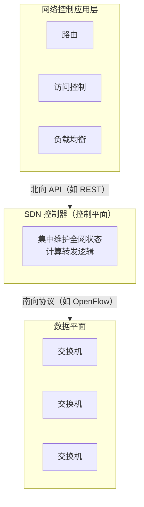
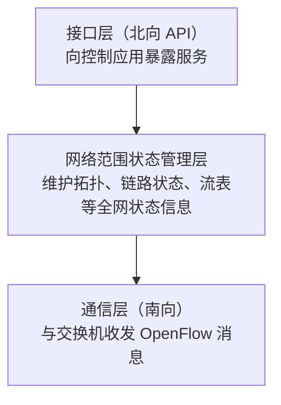
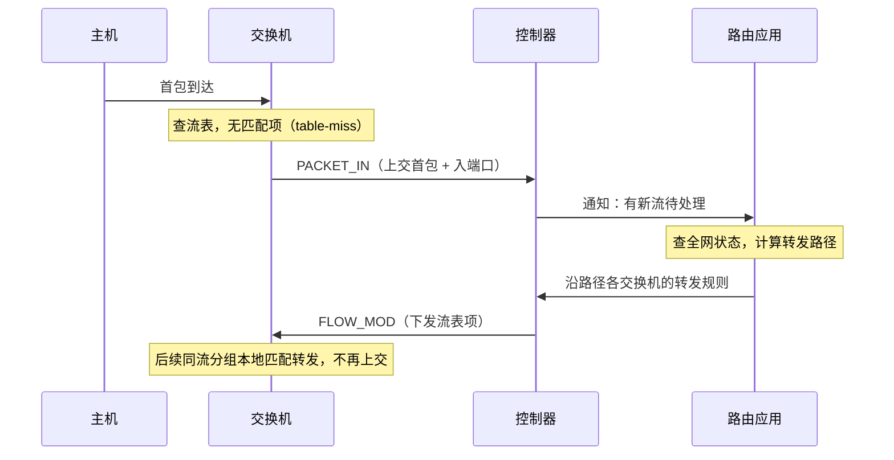

# 5.5 网络层：SDN控制平面

> 4.4 已讲数据平面侧的通用转发与 OpenFlow 流表，本节聚焦控制平面侧：SDN 控制器的内部结构、它与交换机的交互、以及其上的网络控制应用。两节配合阅读。

## 目录

1. [SDN控制平面架构](#sdn控制平面架构)
2. [SDN控制器](#sdn控制器)
3. [控制器与交换机的交互（OpenFlow）](#控制器与交换机的交互openflow)
4. [SDN网络控制应用](#sdn网络控制应用)
5. [发展与挑战](#发展与挑战)

---

## SDN控制平面架构

### 集中式控制 vs 传统分布式控制

传统网络中，每台路由器都自带控制平面，各自运行路由算法（如 OSPF、BGP），靠分布式协议交换信息、各自算出转发表。SDN 把控制逻辑从设备中抽出、上提到一个逻辑集中的控制器，交换机退化为只执行流表的数据平面设备。

```
传统（每台设备各算各的）        SDN（逻辑集中）

┌────────┐  ┌────────┐         ┌──────────────┐
│控制平面│  │控制平面│         │   SDN 控制器  │ 全局视图、集中算路
│数据平面│  │数据平面│         └──────┬───────┘
└───┬────┘  └───┬────┘                │ OpenFlow（南向）
    └─分布式协议─┘            ┌────────┼────────┐
                          ┌───┴──┐ ┌───┴──┐ ┌──┴───┐
                          │交换机│ │交换机│ │交换机│ 只做转发
                          └──────┘ └──────┘ └──────┘
```

注：这里的"逻辑集中"指控制器在逻辑上是单一决策者；物理上为可靠性和扩展性，常由多台服务器组成集群（见后文）。

> **SDN 的四个关键特征**（Kurose & Ross）
>
> 1. **基于流的转发**：交换机按流表的"匹配-动作"规则转发，匹配字段可跨多层（见 4.4）。
> 2. **数据平面与控制平面分离**：交换机只剩数据平面；控制平面逻辑移到外部控制器。
> 3. **网络控制功能外置**：路由计算、访问控制等以软件应用形式运行在控制器之上，而非烧死在设备里。
> 4. **网络可编程**：控制应用通过北向 API 操纵网络，使网络像软件一样可编程。

### 三层结构

SDN 整体可分为三层，自下而上是数据平面、控制器、网络控制应用：



- **北向接口**：控制应用调用控制器的服务（如查询拓扑、下发流表），通常是 RESTful API。
- **南向接口**：控制器与交换机通信，下发流表项、收集状态，典型协议是 OpenFlow，也有 NETCONF/SNMP 等。

易混：应用层在控制器**之上**，交换机在控制器**之下**。北向朝应用，南向朝设备。

---

## SDN控制器

### 控制器的三个子层

控制器内部自下而上同样分三层（Kurose & Ross）：



| 子层 | 职责 |
|------|------|
| 通信层 | 控制器与交换机间收发消息（OpenFlow 等），是 SDN 的"南向接口"。事件可双向流动：控制器下发流表，交换机上报本地事件 |
| 网络范围状态管理层 | 维护网络状态信息：链路、交换机、主机、已安装的流表等。控制应用的决策依赖这些全局信息 |
| 接口层 | 向上为控制应用提供 API（北向接口），应用借此读写网络状态、操纵网络行为 |

注：控制器维护的网络状态是控制应用做决策的依据，因此控制器有时被描述为"网络操作系统"——它把底层设备的复杂性抽象掉，向应用提供统一接口。

### 主流控制器

| 控制器 | 语言 | 特点 | 典型场景 |
|--------|------|------|----------|
| OpenDaylight (ODL) | Java | 模块化、插件丰富 | 企业/运营商 |
| ONOS | Java | 高可用、支持集群 | 运营商网络 |
| Floodlight | Java | 轻量、易扩展 | 小型网络、教学 |
| Ryu | Python | 上手简单、API 丰富 | 原型与研发 |

注：ODL 与 ONOS 都为可靠性和扩展性设计成分布式（多服务器集群），对外仍呈现为逻辑集中的单一控制器。

---

## 控制器与交换机的交互（OpenFlow）

OpenFlow 是控制器与交换机之间的标准南向协议，运行在两者之间的 TCP 连接（通常加 TLS）之上。消息按方向分三类（详见 4.4 的消息表），这里关注它们如何在一次交互中协同。

### 一个交互示例：新流首包的处理

下图是一条新流的首包到达交换机后的处理过程：流表未命中，交换机上交控制器，控制器算出路径并下发流表，后续分组即可本地转发。



注：OpenFlow 只规定控制器与交换机间的消息格式与语义；"路径怎么算"由控制器之上的应用决定，不属于 OpenFlow 本身。

### 控制器内部的事件驱动

控制器对交换机上报的事件（如 PACKET_IN、端口状态变化）通常按"事件 → 通知关注该事件的应用 → 应用决策 → 下发流表"的方式处理。这使得多个控制应用可以各自响应自己关心的事件。

---

## SDN网络控制应用

控制应用是 SDN 的"大脑"：它们通过北向 API 读取控制器维护的网络状态，做出决策，再经控制器下发到交换机。控制应用与控制器逻辑上可分离，甚至可由第三方提供。

两个典型应用（与 4.4 呼应）：

- **拓扑发现**：控制器周期性令交换机从各端口发出 LLDP 探测帧（PACKET_OUT），相邻交换机收到后经 PACKET_IN 上交，控制器据此推断链路、构建全网拓扑图，供其他应用查询。
- **最短路径路由**：收到新流的 PACKET_IN 后，应用解析源/目的地址，在拓扑图上用 Dijkstra 算出路径，再请控制器沿途各交换机下发流表项。

其他常见应用：访问控制（基于流的过滤，即软件实现的防火墙）、服务器负载均衡（按策略把请求分发到不同服务器）、流量工程（在全局视图下统一优化路径）。

注：这些功能在传统网络中往往是独立的专用设备或路由器内置功能；SDN 把它们统一为控制器之上的软件应用，共享同一份全网视图。

---

## 发展与挑战

### 发展脉络

- **起源**：2008 年前后斯坦福等校提出 OpenFlow，将"网络可编程"的理念落地。
- **标准化**：开放网络基金会（ONF）成立，推动 OpenFlow 规范（1.0 至 1.x）演进。
- **落地**：谷歌的 B4 广域网、各大云数据中心网络是 SDN 大规模部署的代表案例。
- **演进**：与网络功能虚拟化（NFV）配合——SDN 管"流量怎么走"，NFV 管"用什么软件功能处理流量"；SD-WAN 将 SDN 思路用于广域网。

### 主要挑战

| 问题 | 表现 | 缓解手段 |
|------|------|---------|
| 性能 | 控制器是集中瓶颈；reactive 方式下新流首包需上交控制器，增加首包时延 | 控制器集群；proactive 预先下发流表 |
| 可靠性 | 逻辑集中带来单点风险，控制器或控制通道故障影响范围大 | 主备/多控制器、分布式共识 |
| 安全 | 控制器成为集中攻击目标 | 控制通道加密认证、应用间权限隔离 |

注：流表下发分两种方式——**reactive**（首包触发 PACKET_IN，控制器再下发）表项少但首包时延高；**proactive**（预先下发）首包无需上交，时延低但需预先规划。两者常混合使用。

---

**[下一节：5.6 网络层：ICMP协议](5.6网络层：ICMP协议.md)**
