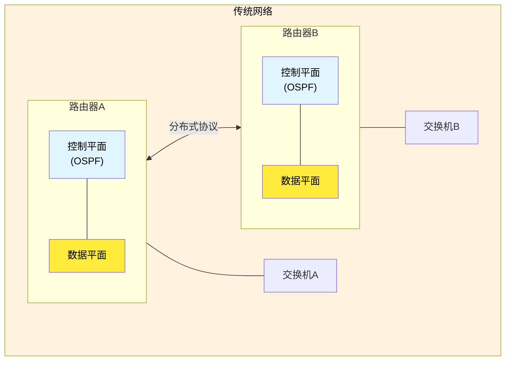
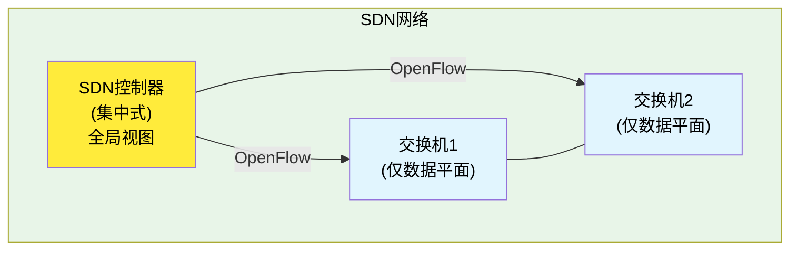
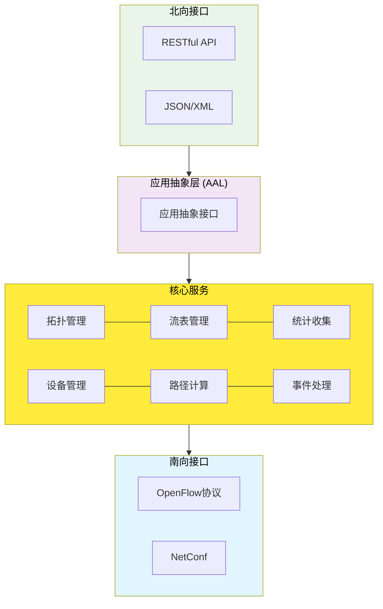

# 5.5 网络层：SDN控制平面

## 本章目录

1. [SDN控制平面架构](#sdn控制平面架构)
2. [SDN控制器详解](#sdn控制器详解)
3. [SDN网络应用程序](#sdn网络应用程序)
4. [控制平面与数据平面交互](#控制平面与数据平面交互)
5. [SDN的过去、现在与未来](#sdn的过去现在与未来)

---

## SDN控制平面架构

### SDN控制平面概述

> **SDN控制平面**
> 
> SDN架构中负责网络控制决策的逻辑层，通过集中式控制器管理整个网络的路由、流量工程和策略执行，与分布式数据平面协同工作。

#### 控制平面分层结构

**SDN三层架构回顾**：

```mermaid
graph TD
    subgraph AL ["应用层 (Application Layer)"]
        RA["路由应用"]
        FW["防火墙"]
        LB["负载均衡"]
        QoS["QoS管理"]
        
        RA --- FW
        FW --- LB
        LB --- QoS
    end
    
    subgraph CL ["控制层 (Control Layer)"]
        SDN_C["SDN控制器<br/>(Controller)"]
    end
    
    subgraph IL ["基础设施层 (Infrastructure Layer)"]
        SW1["SDN交换机 1"]
        SW2["SDN交换机 2"]
        SW3["SDN交换机 3"]
        
        SW1 --- SW2
        SW2 --- SW3
    end
    
    AL -->|北向API| CL
    CL -->|南向API<br/>(OpenFlow)| IL
    
    style AL fill:#e8f5e8,color:#000
    style CL fill:#ffeb3b,color:#000
    style IL fill:#e1f5fe,color:#000
    style SDN_C fill:#fff3e0,color:#000
```

**与第4章的关系**：
- 第4章 (4.4): 数据平面 - OpenFlow交换机、流表
- 第5章 (5.5): 控制平面 - SDN控制器、网络应用

### SDN控制平面特性

**集中式控制优势**：

```
传统分布式 vs SDN集中式控制：

**传统网络**：


**SDN网络**：


**SDN控制平面优势**：
- 全局网络视图和优化
- 统一策略制定和执行
- 快速业务创新和部署
- 集中故障检测和恢复
```

---

## SDN控制器详解

### 控制器核心架构

#### 控制器功能模块

**SDN控制器内部结构**：



**核心服务功能**：
- **拓扑发现**：LLDP协议发现网络拓扑
- **设备管理**：维护交换机连接状态
- **流表管理**：安装、修改、删除流表项
- **路径计算**：基于拓扑计算最优路径
- **统计收集**：收集流量和性能统计
- **事件处理**：处理网络事件和告警

#### 主流SDN控制器对比

**控制器技术选型**：

| 控制器 | 开发语言 | 架构特点 | 性能 | 应用场景 |
|--------|----------|----------|------|----------|
| **OpenDaylight** | Java | 模块化插件 | 高 | 企业/运营商 |
| **ONOS** | Java | 微服务架构 | 高 | 运营商网络 |
| **Floodlight** | Java | 单体架构 | 中 | 小型网络 |
| **Ryu** | Python | 轻量级 | 中 | 研发测试 |
| **POX** | Python | 教学导向 | 低 | 学习实验 |

### 控制器核心服务

#### 1. 拓扑发现服务

**网络拓扑构建**：

```mermaid
sequenceDiagram
    participant Controller as SDN控制器
    participant SwitchA as 交换机A
    participant SwitchB as 交换机B
    
    Note over Controller: 1. LLDP数据包生成
    Controller->>SwitchA: PACKET_OUT(LLDP)
    
    Note over SwitchA, SwitchB: 2. LLDP数据包转发
    SwitchA->>SwitchB: LLDP数据包
    
    Note over SwitchB: 3. 上报未知数据包
    SwitchB->>Controller: PACKET_IN(LLDP)
    
    Note over Controller: 4. 解析LLDP构建拓扑
    Controller->>Controller: 解析LLDP，发现A-B链路
    
    style Controller fill:#ffeb3b,color:#000
    style SwitchA fill:#e1f5fe,color:#000
    style SwitchB fill:#e1f5fe,color:#000
```

**拓扑信息维护**：
- **节点信息**：交换机DPID、端口状态
- **链路信息**：带宽、延迟、利用率
- **主机信息**：MAC地址、IP地址、位置

#### 2. 路径计算服务

**最短路径算法**：

```
路径计算实现：
def calculate_path(src, dst, topology):
    # 使用Dijkstra算法
    graph = build_graph(topology)
    path = dijkstra(graph, src, dst)
    return path

def install_path(path, flow_match):
    for i in range(len(path)-1):
        switch = path[i]
        next_switch = path[i+1]
        out_port = get_port(switch, next_switch)
        
        flow_mod = create_flow_mod(
            match=flow_match,
            action=output(out_port)
        )
        send_flow_mod(switch, flow_mod)
```

#### 3. 流表管理服务

**流表生命周期管理**：

```
流表管理功能：
1. 流表安装:
   • 主动安装：预置静态流表
   • 被动安装：响应PACKET_IN事件
   
2. 流表更新:
   • 修改已有流表项
   • 调整匹配条件或动作
   
3. 流表删除:
   • 超时自动删除
   • 主动删除过期流表
   
4. 流表统计:
   • 定期收集流表统计信息
   • 监控流表使用情况
```

---

## SDN网络应用程序

### 网络应用类型

#### 1. 基础网络功能应用

**核心网络服务**：

```
基础应用类别：

1. L2 Learning Switch:
   功能：MAC地址学习和转发
   实现：维护MAC-Port映射表
   
2. L3 Router:  
   功能：IP路由和转发
   实现：维护路由表，ARP处理
   
3. DHCP Relay:
   功能：DHCP消息中继
   实现：修改DHCP包并转发

4. 负载均衡器:
   功能：服务器负载分担
   实现：基于多种算法分发请求
```

#### 2. 高级网络应用

**企业级网络功能**：

```
高级应用示例：

1. 防火墙应用:
   • 基于5元组的访问控制
   • 状态防火墙功能
   • DPI深度包检测
   
2. QoS应用:
   • 流量分类和标记
   • 带宽限制和保证
   • 队列调度策略
   
3. 网络监控:
   • 流量统计和分析
   • 网络性能监控
   • 异常检测和告警
   
4. 流量工程:
   • 路径优化和选择
   • 负载均衡策略
   • 拥塞避免机制
```

### 应用开发接口

#### 北向API设计

**RESTful API接口**：

```
典型北向API示例：

1. 拓扑查询API:
   GET /api/topology/nodes
   GET /api/topology/links
   GET /api/topology/hosts

2. 流表管理API:
   POST /api/flows/switch/{dpid}
   GET /api/flows/switch/{dpid}  
   DELETE /api/flows/switch/{dpid}/{flow-id}

3. 统计查询API:
   GET /api/statistics/flows/{dpid}
   GET /api/statistics/ports/{dpid}
   GET /api/statistics/tables/{dpid}

API调用示例：
# 安装流表项
curl -X POST http://controller:8080/api/flows/switch/1 \
  -H "Content-Type: application/json" \
  -d '{
    "priority": 100,
    "match": {"eth_type": 2048, "ipv4_dst": "10.1.1.1/32"},
    "actions": [{"type": "OUTPUT", "port": 1}]
  }'
```

---

## 控制平面与数据平面交互

### OpenFlow交互流程

#### 典型交互场景

**新流处理过程**：

```
首包处理流程：

1. 数据包到达交换机
   Host A ──► Switch (DPID=1)
   
2. 流表查找失败
   Switch: 查找流表，无匹配项
   
3. 上报控制器
   Switch ── PACKET_IN ──► Controller
   消息内容：
   • Packet data
   • Input port  
   • Reason (TABLE_MISS)
   
4. 控制器处理
   Controller:
   • 解析数据包
   • 查找目标主机位置
   • 计算转发路径
   • 生成流表项
   
5. 下发流表
   Controller ── FLOW_MOD ──► Switch
   • 匹配条件：src/dst MAC
   • 动作：OUTPUT到指定端口
   • 优先级：默认100
   
6. 转发数据包
   Controller ── PACKET_OUT ──► Switch
   • 指定输出端口
   • 原始数据包

7. 后续数据包直接转发
   Switch根据安装的流表项直接转发
```

### 控制平面性能优化

#### 1. 流表预置策略

**主动流表管理**：

```
流表预置优势：
• 避免首包延迟
• 减少控制器负载
• 提高转发性能
• 保证服务质量

实现策略：
1. 静态路由预置:
   基于网络拓扑预先计算路由
   安装基础连通性流表

2. 基于模式的预置:
   分析历史流量模式
   预置高频使用的流表

3. 应用驱动预置:
   应用启动时主动安装相关流表
   如VM迁移时的流表更新
```

#### 2. 批量操作优化

**提高控制效率**：

```
批量操作技术：
1. 流表批量安装:
   OFPT_FLOW_MOD bundled messages
   减少消息往返次数

2. 统计批量收集:
   定期批量请求统计信息
   降低控制开销

3. 事件批量处理:
   聚合相似事件统一处理
   减少处理延迟
```

---

## SDN的过去、现在与未来

### SDN发展历程

#### 历史发展阶段

**SDN技术演进**：

```
SDN发展时间线：

2008-2009: SDN概念提出
├─ 斯坦福大学OpenFlow项目启动
├─ 第一个OpenFlow规范发布
└─ 网络可编程概念兴起

2010-2012: 标准化阶段  
├─ ONF (Open Networking Foundation) 成立
├─ OpenFlow 1.1-1.3版本发布
├─ 主要设备厂商支持OpenFlow
└─ 第一批商用SDN产品

2013-2015: 商业化部署
├─ 谷歌B4网络大规模部署SDN
├─ 微软Azure网络采用SDN
├─ 企业数据中心开始采用
└─ SDN创业公司涌现

2016-2020: 成熟发展
├─ 云计算平台广泛采用SDN
├─ NFV与SDN融合发展
├─ SD-WAN市场快速增长  
└─ 5G网络采用SDN架构

2021-至今: 全面普及
├─ Intent-based Networking兴起
├─ AI/ML与SDN结合
├─ 边缘计算中的SDN应用
└─ 网络自动化和智能化
```

### SDN现状分析

#### 部署现状

**SDN采用统计 (2024)**：

```
SDN市场现状：
• 全球SDN市场规模: ~200亿美元
• 年增长率: 15-20%  
• 数据中心采用率: >70%
• 企业网络采用率: ~40%
• 运营商网络采用率: ~60%

主要部署场景：
1. 云数据中心: 90%+ (AWS、Azure、阿里云)
2. 企业园区网络: 35%
3. 广域网 (SD-WAN): 25%
4. 5G核心网: 80%+
5. 边缘计算: 45%

| 技术领域 | 成熟度 | 采用率 |
|----------|--------|--------|
| 数据中心SDN | 成熟 | 很高 |
| SD-WAN | 成熟 | 高 |
| 网络虚拟化 | 成熟 | 高 |
| NFV | 较成熟 | 中等 |
| Intent-based | 发展中 | 较低 |
```

### SDN未来发展

#### 技术发展方向

**下一代SDN技术**：

```
SDN未来趋势：

1. Intent-based Networking (IBN):
   特点：
   • 意图驱动的网络配置
   • 自然语言策略表达  
   • 自动化策略转换
   • 持续验证和优化
   
   示例：
   "确保财务部门与研发部门网络隔离"
   ↓ AI解析
   "创建VLAN、配置防火墙规则、设置QoS策略"

2. AI/ML增强SDN:
   应用方向：
   • 智能路径选择和优化
   • 异常检测和自动修复
   • 预测性网络维护
   • 自适应QoS调整
   
   技术实现：
   • 强化学习路由算法
   • 机器学习流量预测
   • 深度学习异常检测
   • 自动化运维决策

3. 边缘计算SDN:
   需求：
   • 超低延迟网络服务
   • 动态资源编排
   • 移动边缘优化
   • 多接入边缘计算 (MEC)
   
   技术特点：
   • 分布式控制架构
   • 边缘智能决策
   • 云边协同控制
   • 5G网络切片

4. 量子网络SDN:
   前瞻性技术：
   • 量子密钥分发网络
   • 量子安全通信
   • 量子网络拓扑管理
   • 量子-经典混合网络
```

#### 面临的挑战

**SDN发展障碍**：

```
技术挑战：
1. 性能和延迟:
   • 控制器性能瓶颈
   • 首包处理延迟
   • 大规模网络扩展性
   
2. 可靠性问题:
   • 控制器单点故障
   • 控制通道可靠性
   • 故障恢复时间
   
3. 安全威胁:
   • 控制器安全防护
   • 控制通道加密
   • DDoS攻击防护

商业挑战：
1. 技能缺口:
   • SDN专业人才短缺
   • 传统网络工程师转型
   • 培训和认证体系
   
2. 投资回报:
   • 初期部署成本高
   • 运维复杂性增加
   • 投资回报周期长

3. 生态系统:
   • 标准化仍需完善  
   • 多厂商互操作性
   • 应用生态建设
```

### 与传统网络的融合

#### 混合网络架构

**渐进式演进策略**：

```
SDN演进路径：

Phase 1: 边缘SDN化
┌─────────────────────────────────────┐
│        传统核心网络                  │
│     (OSPF/BGP路由)                 │
└──────────┬──────────────────────────┘
           │
┌──────────┴──────────┐ ┌─────────────┐
│   SDN数据中心        │ │  SD-WAN     │
│  (OpenFlow)         │ │  (边缘SDN)   │
└─────────────────────┘ └─────────────┘

Phase 2: 核心网络SDN化
┌─────────────────────────────────────┐
│         SDN核心控制器                │
│      (集中式路由控制)                │
└──────────┬──────────────────────────┘
           │ 南向API
┌──────────┴──────────┐ ┌─────────────┐
│   SDN数据中心        │ │   SDN WAN   │
│                     │ │             │
└─────────────────────┘ └─────────────┘

Phase 3: 全网SDN化
┌─────────────────────────────────────┐
│        统一SDN控制平面               │
│     (Multi-domain Control)         │
└─────────────────────────────────────┘
```

### 本章小结

#### SDN控制平面价值

1. **集中式管理**：全局网络视图实现统一策略控制
2. **业务敏捷性**：快速部署新业务和网络服务  
3. **运维简化**：自动化配置和故障处理
4. **创新平台**：开放接口支持网络功能创新

#### 关键技术要点

- **控制器架构**：模块化设计支持灵活扩展
- **北向接口**：RESTful API提供应用开发接口
- **南向协议**：OpenFlow等协议实现设备控制
- **应用生态**：丰富的网络应用和服务

#### 发展前景

SDN作为网络架构的革命性变革，正在从数据中心向全网扩展。未来的网络将更加智能、自动和可编程，SDN控制平面技术将在其中发挥关键作用，推动网络向意图驱动和AI增强的方向发展。

---

**[下一节：5.6 ICMP：控制报文协议](5.6网络层：ICMP协议.md)**
