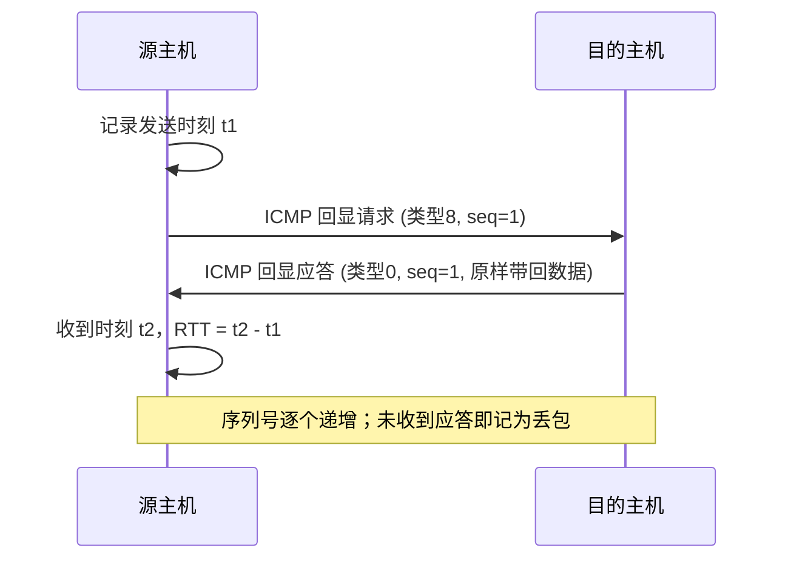
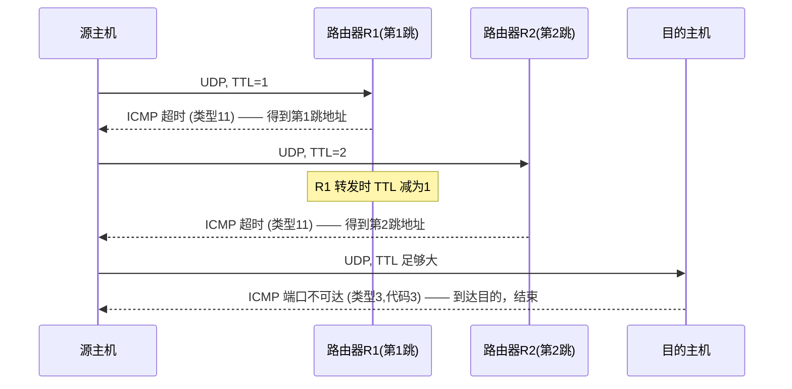

# 5.6 网络层：ICMP协议

## 目录

1. [ICMP概述](#icmp概述)
2. [ICMP报文格式](#icmp报文格式)
3. [ICMP差错报告报文](#icmp差错报告报文)
4. [ICMP查询报文](#icmp查询报文)
5. [ping与traceroute](#ping与traceroute)
6. [本章小结与考点分析](#本章小结与考点分析)

---

## ICMP概述

> **ICMP (Internet Control Message Protocol，Internet控制报文协议)** 是网络层的辅助协议，由主机和路由器用来彼此沟通网络层信息，最典型的用途是差错报告。

最常见的差错报告是"目的不可达"：当一个 IP 数据报因找不到路由、协议或端口而无法投递时，途中的路由器或目的主机会用 ICMP 把这一情况通知源主机。

### ICMP与IP的关系

ICMP 报文承载在 IP 数据报中，作为 IP 的载荷传输——即 ICMP 报文先封装上 IP 首部，再交给链路层。从这个角度看 ICMP "位于" IP 之上，类似上层协议；但 ICMP 不为应用提供数据传输服务，它传递的是网络层自身的控制与差错信息，因此通常把它归为网络层协议。

IP 首部中协议字段值为 **1** 时，表示其载荷为 ICMP 报文（TCP 为 6，UDP 为 17）。

```
┌──────────────── IP 数据报 ────────────────┐
│  IP 首部 (协议字段=1)  │   ICMP 报文        │
└────────────────────────┴───────────────────┘
```

注：尽管 ICMP 封装在 IP 之上，习惯上仍把它划入网络层，因为它服务于网络层而非传输层应用。

### ICMP报文的两大类

| 类别 | 作用 | 典型报文 |
|------|------|----------|
| 差错报告 | 报告 IP 数据报在传输中遇到的问题 | 目的不可达、超时、重定向、参数问题 |
| 查询（询问） | 主动探测网络状态 | 回显请求/应答、时间戳请求/应答 |

---

## ICMP报文格式

所有 ICMP 报文都以相同的 8 字节首部开头：前 4 字节固定为**类型、代码、校验和**，后 4 字节因报文类型而异。

```
 0          7 8         15 16                    31
┌────────────┬────────────┬───────────────────────┐
│   类型     │    代码     │       校验和           │
├────────────┴────────────┴───────────────────────┤
│        其余部分（随类型而定，如标识符/序列号）    │
├──────────────────────────────────────────────────┤
│        数据部分（差错报文中为出错IP报文片段）     │
└──────────────────────────────────────────────────┘
```

- **类型 (Type)**：标识报文大类，如 8=回显请求、0=回显应答、3=目的不可达。
- **代码 (Code)**：在同一类型下进一步细分原因，如类型 3 下 code 0=网络不可达、code 1=主机不可达。
- **校验和**：覆盖整个 ICMP 报文，算法与 IP 校验和相同（16 位反码求和）。

差错报告报文的数据部分有一个固定约定：**装入引发差错的那个 IP 数据报的首部，外加其数据的前 8 字节**。前 8 字节通常正好包含 TCP/UDP 的源端口与目的端口，使源主机能判断是哪个进程、哪条连接出的错。

### 常见类型与代码

| 类型 | 代码 | 名称 | 含义 | 类别 |
|------|------|------|------|------|
| 0 | 0 | Echo Reply | 回显应答（ping 的响应） | 查询 |
| 3 | 0–13 | Destination Unreachable | 目的不可达 | 差错 |
| 5 | 0–3 | Redirect | 重定向 | 差错 |
| 8 | 0 | Echo Request | 回显请求（ping 的发起） | 查询 |
| 11 | 0–1 | Time Exceeded | 超时（TTL 耗尽等） | 差错 |
| 12 | 0–2 | Parameter Problem | 参数问题（IP 首部出错） | 差错 |
| 13 | 0 | Timestamp Request | 时间戳请求 | 查询 |
| 14 | 0 | Timestamp Reply | 时间戳应答 | 查询 |

注：类型 4（源点抑制 Source Quench）曾用于拥塞控制，现已废弃；拥塞控制由 TCP 在端到端层面完成。

---

## ICMP差错报告报文

### 目的不可达 (类型 3)

数据报无法送达目的地时产生，代码区分具体原因：

| 代码 | 名称 | 产生原因 |
|------|------|----------|
| 0 | 网络不可达 | 路由器无到达目的网络的路由 |
| 1 | 主机不可达 | 目的网络可达，但主机无响应 |
| 2 | 协议不可达 | 目的主机不支持该上层协议 |
| 3 | 端口不可达 | 目的端口无进程监听 |
| 4 | 需分片但置了 DF | 报文超过 MTU，但设置了"不分片"标志 |
| 6 | 目的网络未知 | 路由表中无相关条目 |
| 7 | 目的主机未知 | 无法解析目的主机 |
| 13 | 通信被管理性禁止 | 防火墙等策略阻止 |

易混：**端口不可达 (3/3)** 是 traceroute（UDP 方式）判断"已到达目的主机"的关键信号，详见后文。

### 超时 (类型 11)

| 代码 | 名称 | 产生条件 |
|------|------|----------|
| 0 | 传输中 TTL 超时 | IP 数据报的 TTL 递减到 0 |
| 1 | 分片重组超时 | 分片未在规定时间内全部到达 |

TTL 超时机制是 traceroute 的原理基础：

```
IP 数据报每经过一台路由器，TTL 减 1。
当某台路由器把 TTL 减为 0 时：
  1. 丢弃该数据报；
  2. 向源主机发回 ICMP 超时报文 (类型 11, 代码 0)；
  3. 报文中带回出错 IP 报文的首部和前 8 字节。
源主机据此得知"在第几跳被丢弃"以及"是哪台路由器丢的"。
```

### 重定向 (类型 5)

当主机选错了下一跳路由器时，路由器用重定向报文告知更优的下一跳，主机据此更新路由缓存。

```
       ┌────────┐         ┌────────┐
       │  R1    │────────▶│  R2    │──▶ 目的主机B
       └────┬───┘         └────────┘
            │  ① A 默认网关是 R1，把发往 B 的包交给 R1
       ┌────┴───┐  ② R1 发现去 B 应直接走 R2（R2 与 A 同一子网）
       │ 主机A  │  ③ R1 向 A 发重定向：去 B 请直接交给 R2
       └────────┘  ④ A 更新路由缓存，后续包直接发 R2
```

注：重定向只在主机与路由器同处一个子网时使用，且出于安全考虑现代系统常默认忽略它。

---

## ICMP查询报文

### 回显请求/应答 (类型 8/0)

这是 ping 使用的报文。回显请求/应答在固定首部之后带有 **标识符** 和 **序列号** 两个字段：

```
 0          7 8         15 16                    31
┌────────────┬────────────┬───────────────────────┐
│ 类型(8/0)  │   代码(0)   │       校验和           │
├────────────┴────────────┼───────────────────────┤
│      标识符 (16位)       │     序列号 (16位)      │
├──────────────────────────┴───────────────────────┤
│         数据（原样回送，常含发送时间戳）          │
└──────────────────────────────────────────────────┘
```

- **标识符**：区分不同的 ping 进程，通常填进程 PID。
- **序列号**：同一进程内每发一个请求递增，用于匹配请求与应答、检测丢包与乱序。
- **数据**：由发送方填入，接收方在应答中原样返回。

收到回显请求（类型 8）的主机，把类型改为 0、重算校验和、原样带回数据，即构成回显应答。

### 时间戳请求/应答 (类型 13/14)

携带三个 32 位时间戳，可用于估算单向延迟与时钟偏差，但因 NTP 等专用协议更精确，现已少用：

- **源时间戳**：请求方发出的时刻；
- **接收时间戳**：应答方收到请求的时刻；
- **传输时间戳**：应答方发出应答的时刻。

---

## ping与traceroute

### ping

ping 通过"发回显请求、收回显应答"来测试连通性并测量往返时间 (RTT)。



输出中的关键指标：

- **RTT**：往返时延，反映网络延迟；
- **TTL**：应答报文剩余的 TTL，可粗略推断经过的跳数；
- **丢包率**：发送与收到的比例，反映链路质量。

注：ping 不通不代表主机宕机——许多主机或防火墙会默认丢弃回显请求，但其业务端口仍正常工作。

### traceroute

traceroute 用来发现源到目的之间路径上的每一跳路由器，其核心技巧是**逐步增大 TTL，借助返回的 ICMP 超时报文定位每一跳**。

Unix/Linux 默认实现：源主机向目的主机一个**不太可能被使用的高端口**（约 33434 起的 UDP 端口）连续发送数据报，第 1 个 TTL=1，第 2 个 TTL=2，依次递增。



两类 ICMP 报文分别扮演不同角色：

- 路径中每一跳因 **TTL 超时 (类型 11)** 返回报文，源主机据其源地址得到该跳路由器的地址，据 RTT 得到该跳时延；
- 数据报最终到达目的主机时，由于高端口无进程监听，目的主机返回 **端口不可达 (类型 3，代码 3)**，源主机据此判断"已到达目的"，停止递增 TTL。

易混：traceroute 真正依赖的是**中途路由器返回的"超时"报文 (类型 11)**，而非目的主机的应答；目的主机返回的"端口不可达"只是用作结束标志。Windows 的 `tracert` 改用 ICMP 回显请求探测，到达目的时收到的是回显应答而非端口不可达。

输出中 `* * *` 表示该跳未返回报文，常见原因是路由器被配置为不发送 ICMP 超时报文，或防火墙将其丢弃，并不一定代表链路中断。

---

## 本章小结与考点分析

### 核心要点

- ICMP 是网络层的辅助协议，由主机与路由器用来传递控制与差错信息；报文封装在 IP 数据报中（IP 协议字段=1），习惯上归为网络层。
- 报文统一以 8 字节首部开头：**类型 + 代码 + 校验和**。差错报文的数据部分携带**出错 IP 报文的首部 + 前 8 字节**，便于源主机定位出错进程。
- 两大类：差错报告（目的不可达 3、超时 11、重定向 5、参数问题 12）与查询（回显 8/0、时间戳 13/14）。
- ping 基于回显请求/应答 (8/0) 测连通性与 RTT。
- traceroute 基于**逐跳 TTL 超时 (类型 11)** 发现路径，以**端口不可达 (3/3)** 作为到达目的的结束标志。

### 易错点

- **ICMP 的层次归属**：封装在 IP 之上，但属于网络层，不属于传输层。
- **traceroute 的工作机理**：靠中途路由器的 TTL 超时报文逐跳定位，而非目的主机的应答；目的应答只用于结束。
- **类型与代码不要混淆**：超时是类型 11；目的/端口不可达是类型 3（端口不可达为代码 3）。
- **源点抑制 (类型 4) 已废弃**，拥塞控制不依赖 ICMP。

---

**[下一节：5.7 网络层：网络管理与SNMP](5.7网络层：网络管理与SNMP.md)**
