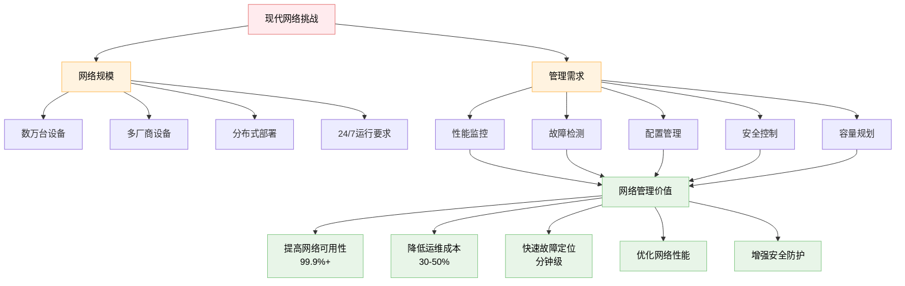
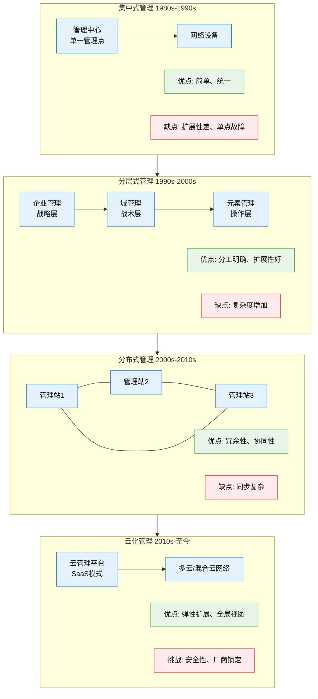
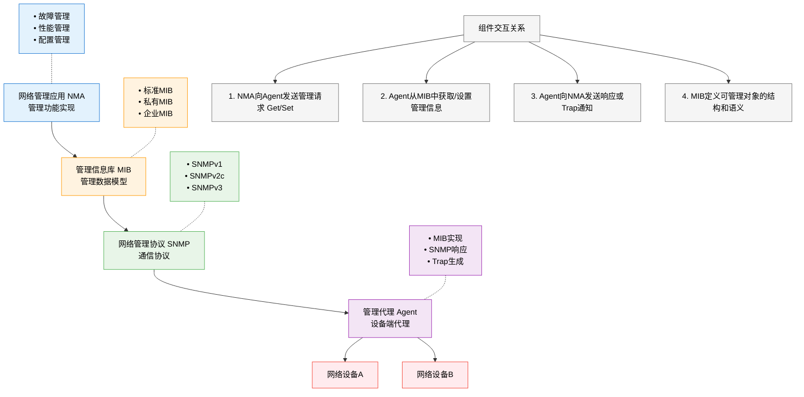
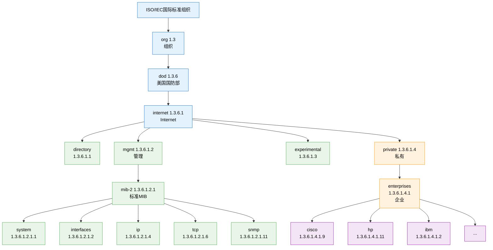
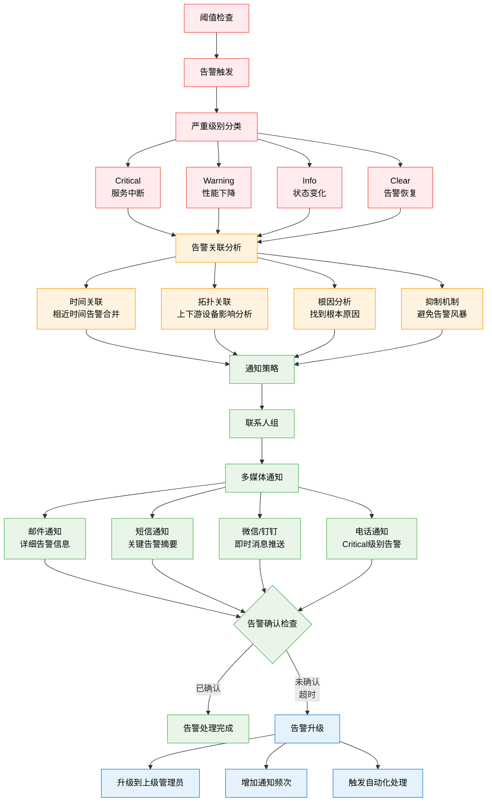
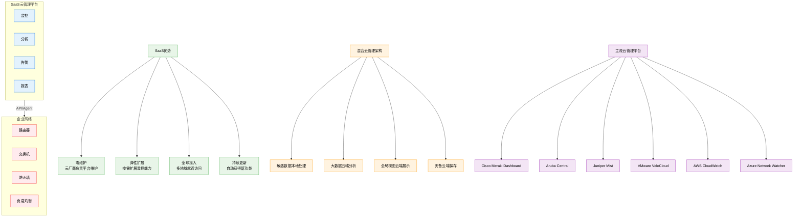
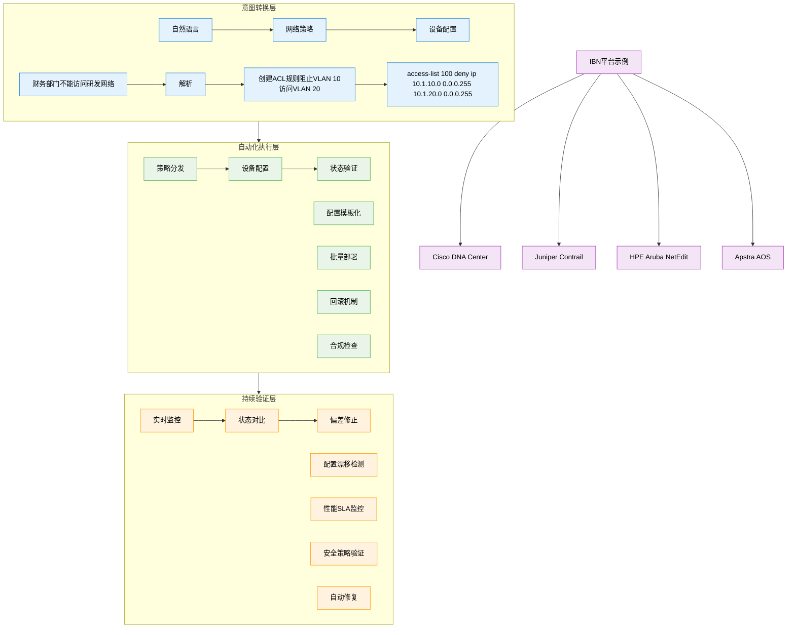

# 5.7 网络层：网络管理与SNMP

## 本章目录

1. [网络管理基础](#网络管理基础)
2. [网络管理框架](#网络管理框架)
3. [SNMP协议详解](#snmp协议详解)
4. [管理信息库MIB](#管理信息库mib)
5. [网络管理系统实现](#网络管理系统实现)
6. [现代网络管理技术](#现代网络管理技术)

---

## 网络管理基础

### 网络管理概述

> **网络管理 (Network Management)**
> 
> 通过监控、配置和控制网络设备和服务，确保网络高效、可靠、安全运行的一系列活动和技术。

#### 网络管理的必要性

**网络复杂性挑战**：



#### 网络管理功能分类

**ISO网络管理功能模型 (FCAPS)**：

```
网络管理五大功能：

1. 故障管理 (Fault Management):
   ├─ 故障检测：实时监控网络状态
   ├─ 故障隔离：定位故障发生位置
   ├─ 故障诊断：分析故障产生原因
   ├─ 故障修复：自动或手动恢复
   └─ 故障记录：维护故障历史数据

2. 配置管理 (Configuration Management):
   ├─ 配置发现：自动发现网络拓扑
   ├─ 配置备份：保存设备配置信息
   ├─ 配置变更：批量配置更新
   ├─ 版本控制：配置文件版本管理
   └─ 合规检查：配置合规性验证

3. 计费管理 (Accounting Management):
   ├─ 使用统计：收集资源使用数据
   ├─ 成本分配：按使用量分配成本
   ├─ 账单生成：生成用户账单
   ├─ 配额管理：设置使用配额限制
   └─ 审计跟踪：维护使用审计记录

4. 性能管理 (Performance Management):
   ├─ 性能监控：实时性能指标收集
   ├─ 趋势分析：历史性能数据分析
   ├─ 阈值告警：性能异常及时告警
   ├─ 容量规划：基于趋势的容量预测
   └─ 优化建议：性能优化方案推荐

5. 安全管理 (Security Management):
   ├─ 访问控制：用户权限管理
   ├─ 安全监控：安全事件检测
   ├─ 密钥管理：加密密钥生命周期
   ├─ 审计日志：安全审计记录
   └─ 安全策略：统一安全策略执行
```

### 网络管理架构

#### 管理模式演进

**网络管理架构发展**：



---

## 网络管理框架

### 管理系统组件

#### 核心组件架构

**网络管理系统架构**：



#### 管理信息模型

**管理对象标识**：



**OID表示法**：
- **数字形式**: 1.3.6.1.2.1.1.1.0
- **符号形式**: iso.org.dod.internet.mgmt.mib-2.system.sysDescr.0
- **混合形式**: .1.3.6.1.2.1.system.sysDescr.0

---

## SNMP协议详解

### SNMP基本概念

#### SNMP版本演进

**SNMP协议版本对比**：


SNMP版本特性比较：

| 特性 | SNMPv1 | SNMPv2c | SNMPv3 |
|------|--------|---------|--------|
| 发布年份 | 1990 | 1993 | 1999 |
| 安全机制 | Community | Community | USM/VACM |
| 认证 | 明文 | 明文 | MD5/SHA |
| 加密 | 无 | 无 | DES/AES |
| 错误处理 | 基本 | 增强 | 增强 |
| 批量操作 | 无 | GetBulk | GetBulk |
| 部署难度 | 简单 | 简单 | 复杂 |
| 安全级别 | 低 | 低 | 高 |

版本选择建议：
• SNMPv1: 遗留系统兼容
• SNMPv2c: 生产环境主流 (80%+)
• SNMPv3: 安全要求高的环境


### SNMP操作类型

#### 基本操作命令

**SNMP PDU类型**：

```
SNMP协议数据单元 (PDU)：

1. Get Request (获取请求):
   功能：获取单个或多个MIB对象的值
   格式：Get-Request(OID列表)
   
   示例：
   snmpget -v2c -c public 192.168.1.1 1.3.6.1.2.1.1.1.0
   # 获取系统描述信息

2. Get-Next Request (获取下一个):
   功能：获取MIB树中下一个对象的值
   用途：MIB遍历和发现
   
   示例：
   snmpgetnext -v2c -c public 192.168.1.1 1.3.6.1.2.1.1
   # 获取system分支下的下一个对象

3. Get-Bulk Request (批量获取) - SNMPv2c+:
   功能：高效获取大量连续MIB对象
   参数：non-repeaters, max-repetitions
   
   示例：
   snmpbulkget -v2c -c public -Cn0 -Cr10 192.168.1.1 1.3.6.1.2.1.2.2.1
   # 批量获取接口表信息

4. Set Request (设置请求):
   功能：设置MIB对象的值
   权限：需要写权限Community
   
   示例：
   snmpset -v2c -c private 192.168.1.1 1.3.6.1.2.1.1.6.0 s "New Location"
   # 设置系统位置信息

5. Response (响应):
   功能：对Get/Set请求的响应
   内容：请求的OID-Value对或错误信息

6. Trap (陷阱) / Inform (通知):
   功能：Agent主动向Manager发送事件通知
   区别：Trap无需确认，Inform需要确认
   
   Trap示例：
   - linkDown: 接口down事件
   - linkUp: 接口up事件
   - authenticationFailure: 认证失败
   - coldStart: 设备冷启动
   - warmStart: 设备热重启
```

#### SNMP消息格式

**SNMP消息格式 (ASN.1 BER编码)**：

**SNMPv1/v2c消息结构**：

```
┌─────────────────────────────────────────────────────────┐
  SNMP Message - 完整的SNMP协议数据单元
├─────────────────────────────────────────────────────────┤
  Version (INTEGER) - SNMP版本号 (0=v1, 1=v2c)
├─────────────────────────────────────────────────────────┤
  Community (OCTET STRING) - 社区名字符串(如"public")
├─────────────────────────────────────────────────────────┤
  PDU (SEQUENCE) - 协议数据单元
  ├─ Request ID (INTEGER) - 请求标识符
  ├─ Error Status (INTEGER) - 错误状态码
  ├─ Error Index (INTEGER) - 错误索引
  └─ Variable Bindings (SEQUENCE OF) - 变量绑定列表
      ├─ OID (OBJECT IDENTIFIER) - 管理对象标识符
      └─ Value (ANY) - 对象值
└─────────────────────────────────────────────────────────┘
```

**SNMPv3消息结构**：

```
┌─────────────────────────────────────────────────────────┐
  SNMPv3 Message - 增强安全的SNMP消息格式
├─────────────────────────────────────────────────────────┤
  msgVersion (INTEGER) - 版本号，固定为3
├─────────────────────────────────────────────────────────┤
  msgGlobalData - 全局消息数据
  ├─ msgID (INTEGER) - 消息标识符
  ├─ msgMaxSize (INTEGER) - 最大消息大小
  ├─ msgFlags (OCTET STRING) - 消息标志
  └─ msgSecurityModel (INTEGER) - 安全模型
├─────────────────────────────────────────────────────────┤
  msgSecurityParameters - 安全参数 (如USM参数)
├─────────────────────────────────────────────────────────┤
  msgData - 消息数据
  └─ Scoped PDU - 作用域PDU (可能加密)
└─────────────────────────────────────────────────────────┘
```

### SNMPv3安全机制

#### 用户安全模型 (USM)

**SNMPv3安全特性**：

```
SNMPv3安全级别：

1. noAuthNoPriv (无认证无加密):
   安全级别：最低
   使用场景：内网测试环境
   配置：仅需用户名
   
   snmpget -v3 -u testuser -l noAuthNoPriv 192.168.1.1 sysDescr.0

2. authNoPriv (认证无加密):
   安全级别：中等
   认证算法：MD5 or SHA-1/SHA-256
   使用场景：安全要求一般的内网
   
   snmpget -v3 -u secureuser -l authNoPriv \
           -a SHA -A myauthpass 192.168.1.1 sysDescr.0

3. authPriv (认证+加密):
   安全级别：最高
   认证算法：MD5/SHA-1/SHA-256
   加密算法：DES/3DES/AES128/AES192/AES256
   使用场景：高安全要求环境
   
   snmpget -v3 -u secureuser -l authPriv \
           -a SHA -A myauthpass \
           -x AES -X myprivpass 192.168.1.1 sysDescr.0

**USM配置示例**：

```bash
# 创建SNMPv3用户
net-snmp-create-v3-user -ro -a SHA -x AES myuser myauthpass myprivpass

# 设备配置 (Cisco)
snmp-server user myuser mygroup v3 auth sha myauthpass priv aes 128 myprivpass
```

#### 视图访问控制模型 (VACM)

**访问控制机制**：


VACM访问控制组件：

1. Security Model → Security Name → Group Name
   └─ 将安全模型和用户名映射到组

2. Group Name → Access → View Name  
   └─ 为组分配对不同MIB视图的访问权限

3. View Name → MIB Subtree
   └─ 定义MIB子树的包含/排除规则

**访问控制配置示例**：

```bash
# 定义视图
snmp-server view READONLY iso included
snmp-server view READONLY 1.3.6.1.2.1.11 excluded

# 定义组
snmp-server group ROGROUP v3 auth read READONLY

# 关联用户到组
snmp-server user rouser ROGROUP v3 auth sha mypass
```

**访问控制流程**：

```mermaid
sequenceDiagram
    participant U as 用户请求
    participant USM as USM用户认证
    participant VM1 as VACM组映射
    participant VM2 as VACM视图检查
    participant D as 访问决策
    
    U->>USM: 发送SNMP请求
    Note over USM: 验证用户身份<br/>检查认证/加密
    USM->>VM1: 认证通过
    Note over VM1: 用户→组映射<br/>确定用户组
    VM1->>VM2: 获取组权限
    Note over VM2: 检查MIB视图权限<br/>验证访问范围
    VM2->>D: 权限验证结果
    
    alt 访问允许
        D-->>U: 执行操作并返回结果
    else 访问拒绝  
        D-->>U: 返回权限错误
    end
    
    classDef auth fill:#e8f5e8,stroke:#4caf50,color:#000000
    classDef check fill:#fff3e0,stroke:#ff9800,color:#000000
    classDef decision fill:#e3f2fd,stroke:#1976d2,color:#000000
    
    class USM auth
    class VM1,VM2 check
    class D decision
```

---

## 管理信息库MIB

### MIB结构与语法

#### 标准MIB-II对象

**核心MIB组详解**：

```
MIB-II标准对象组 (RFC 1213)：

1. System组 (1.3.6.1.2.1.1):
   ├─ sysDescr (1) - 系统描述
   ├─ sysObjectID (2) - 系统对象标识
   ├─ sysUpTime (3) - 系统运行时间
   ├─ sysContact (4) - 系统联系人
   ├─ sysName (5) - 系统名称  
   ├─ sysLocation (6) - 系统位置
   └─ sysServices (7) - 系统服务

2. Interfaces组 (1.3.6.1.2.1.2):
   ├─ ifNumber (1) - 接口总数
   └─ ifTable (2) - 接口表
       ├─ ifIndex - 接口索引
       ├─ ifDescr - 接口描述
       ├─ ifType - 接口类型
       ├─ ifMtu - 最大传输单元
       ├─ ifSpeed - 接口速度
       ├─ ifPhysAddress - 物理地址
       ├─ ifAdminStatus - 管理状态
       ├─ ifOperStatus - 操作状态
       ├─ ifInOctets - 输入字节数
       ├─ ifInUcastPkts - 输入单播包数
       ├─ ifInErrors - 输入错误数
       ├─ ifOutOctets - 输出字节数
       ├─ ifOutUcastPkts - 输出单播包数
       └─ ifOutErrors - 输出错误数

3. IP组 (1.3.6.1.2.1.4):
   ├─ ipForwarding (1) - IP转发状态
   ├─ ipDefaultTTL (2) - 默认TTL
   ├─ ipInReceives (3) - 接收IP包数
   ├─ ipInDelivers (4) - 成功交付包数
   ├─ ipOutRequests (5) - 输出请求数
   ├─ ipReasmTimeout (6) - 重组超时
   ├─ ipFragOKs (7) - 成功分片数
   ├─ ipFragFails (8) - 分片失败数
   ├─ ipRoutingTable (9) - 路由表
   └─ ipNetToMediaTable (10) - ARP表

使用示例：
# 获取系统信息
snmpwalk -v2c -c public 192.168.1.1 1.3.6.1.2.1.1

# 获取接口统计
snmpwalk -v2c -c public 192.168.1.1 1.3.6.1.2.1.2.2.1.10
# 获取所有接口的输入字节数
```

#### 企业MIB

**私有MIB扩展**：

```
企业MIB示例：

Cisco私有MIB (1.3.6.1.4.1.9):
├─ products (1) - 产品标识
├─ local (2) - 本地变量
├─ temporary (3) - 临时变量
├─ pakmon (4) - 包监控
├─ workgroup (5) - 工作组产品
├─ otherEnterprises (6) - 其他企业
├─ ciscoAgentCapability (7) - Agent能力
├─ ciscoConfig (8) - 配置
├─ ciscoMgmt (9) - 管理
│   ├─ ciscoMemoryPoolMIB (48) - 内存池
│   ├─ ciscoCpuMIB (109) - CPU统计
│   ├─ ciscoEnvMonMIB (13) - 环境监控
│   └─ ciscoFlashMIB (10) - Flash信息
└─ ciscoExperiment (10) - 实验性

企业MIB使用：
# Cisco CPU利用率
snmpget -v2c -c public router.example.com \
1.3.6.1.4.1.9.2.1.56.0

# Cisco内存利用率
snmpget -v2c -c public router.example.com \
1.3.6.1.4.1.9.2.1.8.0

# Cisco接口描述
snmpwalk -v2c -c public switch.example.com \
1.3.6.1.4.1.9.2.2.1.1.28
```

### MIB编译与加载

#### MIB文件结构

**MIB定义语法 (SMI)**：

```
MIB文件结构示例：

EXAMPLE-MIB DEFINITIONS ::= BEGIN

IMPORTS
    MODULE-IDENTITY, OBJECT-TYPE, Counter32, Gauge32,
    Integer32, TimeTicks, Counter64, Unsigned32
        FROM SNMPv2-SMI
    TEXTUAL-CONVENTION, DisplayString, TruthValue
        FROM SNMPv2-TC
    MODULE-COMPLIANCE, OBJECT-GROUP
        FROM SNMPv2-CONF;

exampleMIB MODULE-IDENTITY
    LAST-UPDATED "202401010000Z"
    ORGANIZATION "Example Corporation"
    CONTACT-INFO "support@example.com"
    DESCRIPTION "Example MIB for demonstration"
    REVISION "202401010000Z"
    DESCRIPTION "Initial version"
    ::= { enterprises 12345 }

-- MIB对象定义
exampleObjects OBJECT IDENTIFIER ::= { exampleMIB 1 }

exampleTemperature OBJECT-TYPE
    SYNTAX      Gauge32 (-40..125)
    UNITS       "degrees Celsius"
    MAX-ACCESS  read-only
    STATUS      current
    DESCRIPTION "Current temperature reading"
    ::= { exampleObjects 1 }

exampleFanSpeed OBJECT-TYPE
    SYNTAX      Gauge32 (0..10000)
    UNITS       "rpm"
    MAX-ACCESS  read-write
    STATUS      current
    DESCRIPTION "Fan speed control"
    ::= { exampleObjects 2 }

-- 表定义示例
exampleTable OBJECT-TYPE
    SYNTAX      SEQUENCE OF ExampleEntry
    MAX-ACCESS  not-accessible
    STATUS      current
    DESCRIPTION "Example table"
    ::= { exampleObjects 3 }

exampleEntry OBJECT-TYPE
    SYNTAX      ExampleEntry
    MAX-ACCESS  not-accessible
    STATUS      current
    DESCRIPTION "Example table entry"
    INDEX       { exampleIndex }
    ::= { exampleTable 1 }

ExampleEntry ::= SEQUENCE {
    exampleIndex    Integer32,
    exampleName     DisplayString,
    exampleStatus   INTEGER
}

END

MIB编译与加载：
# Net-SNMP MIB编译
mib2c -c mib2c.scalar.conf exampleTemperature

# 加载MIB文件
export MIBS=+EXAMPLE-MIB
snmpwalk -v2c -c public device.example.com exampleMIB
```

---

## 网络管理系统实现

### 开源网络管理平台

#### 主流开源解决方案

**开源NMS平台对比**：

```
开源网络管理系统：

1. Nagios:
   特点：
   ├─ 专注于监控和告警
   ├─ 插件架构，扩展性强
   ├─ 主动检查和被动检查
   └─ 强大的通知机制
   
   适用场景：
   ├─ IT基础设施监控
   ├─ 应用服务监控
   └─ 小到中型企业

   配置示例：
   define host {
       host_name       router1
       address         192.168.1.1
       check_command   check-host-alive
       notification_interval   30
   }

2. Zabbix:
   特点：
   ├─ 完整的网络管理平台
   ├─ 数据收集、可视化、告警
   ├─ 支持多种数据收集方式
   ├─ Web界面友好
   └─ 自动发现功能强大
   
   优势：
   ├─ 集成度高，功能完整
   ├─ 支持大规模监控(数万设备)
   ├─ 丰富的图形化界面
   └─ 强大的报表功能

3. LibreNMS:
   特点：
   ├─ 基于PHP的网络监控平台
   ├─ 自动发现网络设备
   ├─ 支持200+设备类型
   ├─ RESTful API接口
   └─ 社区活跃，更新频繁
   
   适用场景：
   ├─ 网络设备监控专用
   ├─ ISP和电信运营商
   └─ 网络运维团队

4. Pandora FMS:
   特点：
   ├─ 企业级网络管理平台
   ├─ 网络、系统、应用一体化监控
   ├─ 强大的事件关联分析
   └─ 商业支持可选
```
| 设备数量 | < 100 | 100-1000 | > 1000 |
|----------|-------|----------|--------|
| 推荐方案 | Nagios | Zabbix<br>Pandora | LibreNMS<br>Zabbix |


#### 网络管理系统架构

**企业级NMS架构设计**：

```mermaid
graph TD
    subgraph mgmt [管理层 Management]
        A1[Web GUI] 
        A2[Mobile]
        A3[API]
    end
    
    subgraph app [应用层 Application]
        B1[故障管理]
        B2[性能管理] 
        B3[配置管理]
        B4[安全管理]
        B5[报表系统]
    end
    
    subgraph svc [服务层 Services]
        C1[数据分析]
        C2[告警引擎]
        C3[发现服务]
        C4[采集引擎]
        C5[存储引擎]
    end
    
    subgraph data [数据层 Data]
        D1[时序数据库<br/>InfluxDB]
        D2[关系数据库<br/>MySQL]
        D3[文档数据库<br/>MongoDB]
    end
    
    subgraph dev [网络设备层 Devices]
        E1[路由器]
        E2[交换机]
        E3[防火墙]
        E4[负载均衡器]
    end
    
    mgmt --> app
    app --> svc
    svc --> data
    data -->|SNMP/SSH/API| dev
    
    classDef management fill:#e3f2fd,stroke:#1976d2,color:#000000
    classDef application fill:#e8f5e8,stroke:#4caf50,color:#000000
    classDef service fill:#fff3e0,stroke:#ff9800,color:#000000
    classDef database fill:#f3e5f5,stroke:#9c27b0,color:#000000
    classDef device fill:#ffebee,stroke:#f44336,color:#000000
    
    class A1,A2,A3 management
    class B1,B2,B3,B4,B5 application
    class C1,C2,C3,C4,C5 service
    class D1,D2,D3 database
    class E1,E2,E3,E4 device
```



**关键技术组件**：

1. **数据收集引擎**：
   - SNMP轮询调度
   - 多线程并发处理
   - 失败重试机制
   - 数据质量检查

2. **告警引擎**：
   - 规则引擎 (Rule Engine)
   - 阈值监控
   - 事件关联分析
   - 告警抑制和合并
   - 通知分发 (邮件、短信、微信)

3. **自动发现**：
   - 网段扫描 (ICMP/TCP)
   - SNMP Walker
   - CDP/LLDP邻居发现
   - 拓扑关系构建

### 性能监控与分析

#### 关键性能指标 (KPI)

**网络性能监控指标**：

```
网络KPI监控体系：

1. 接口性能指标：
   ┌─────────────────────────────────────┐
           接口监控指标               
   ├─────────────────────────────────────┤
   • 带宽利用率 (Utilization)          
     计算：(InOctets + OutOctets) * 8  
            / (Interval * ifSpeed) * 100%
                                     
   • 数据包速率 (PPS)                  
     输入PPS：InUcastPkts/Interval     
     输出PPS：OutUcastPkts/Interval    
                                     
   • 错误率 (Error Rate)               
     输入错误率：InErrors/InUcastPkts   
     输出错误率：OutErrors/OutUcastPkts 
                                     
   • 丢包率 (Drop Rate)                
     输入丢包率：InDiscards/InUcastPkts 
     输出丢包率：OutDiscards/OutUcastPkts
   └─────────────────────────────────────┘

2. 系统性能指标：
   ├─ CPU利用率：5分钟平均负载
   ├─ 内存使用率：已用内存/总内存
   ├─ 温度：设备内部温度传感器
   ├─ 风扇转速：散热系统状态
   └─ 电源状态：冗余电源工作状态

3. 协议性能指标：
   ├─ ARP表大小：ip.ipNetToMediaEntries
   ├─ 路由表大小：ip.ipRouteEntries  
   ├─ BGP邻居状态：bgpPeerState
   ├─ OSPF邻居数量：ospfNbrRtrId
   └─ STP收敛时间：dot1dStpTopChanges

监控脚本示例：
#!/bin/bash
# 接口利用率监控脚本

DEVICE="192.168.1.1"
COMMUNITY="public"
INTERFACE="2"  # ifIndex

# 获取接口速度
SPEED=$(snmpget -v2c -c $COMMUNITY -Oqv $DEVICE 1.3.6.1.2.1.2.2.1.5.$INTERFACE)

# 第一次采样
IN1=$(snmpget -v2c -c $COMMUNITY -Oqv $DEVICE 1.3.6.1.2.1.2.2.1.10.$INTERFACE)
OUT1=$(snmpget -v2c -c $COMMUNITY -Oqv $DEVICE 1.3.6.1.2.1.2.2.1.16.$INTERFACE)
TIME1=$(date +%s)

# 等待采样间隔
sleep 60

# 第二次采样
IN2=$(snmpget -v2c -c $COMMUNITY -Oqv $DEVICE 1.3.6.1.2.1.2.2.1.10.$INTERFACE)
OUT2=$(snmpget -v2c -c $COMMUNITY -Oqv $DEVICE 1.3.6.1.2.1.2.2.1.16.$INTERFACE)
TIME2=$(date +%s)

# 计算利用率
INTERVAL=$((TIME2 - TIME1))
IN_BITS=$(((IN2 - IN1) * 8 / INTERVAL))
OUT_BITS=$(((OUT2 - OUT1) * 8 / INTERVAL))
UTILIZATION=$(((IN_BITS + OUT_BITS) * 100 / SPEED))

echo "Interface utilization: ${UTILIZATION}%"
```

#### 告警与通知机制

**智能告警系统**：



告警配置示例 (Zabbix)：
# 接口利用率告警
{Template Net Generic SNMPv2:net.if.util[{#SNMPINDEX}].avg(5m)} > 80

# CPU利用率告警  
{Template OS Linux:system.cpu.util[,avg1].avg(5m)} > 85

# 内存使用率告警
{Template OS Linux:vm.memory.pused.avg(5m)} > 90

# 接口状态变化告警
{Template Net Generic SNMPv2:net.if.status[{#SNMPINDEX}].diff()} = 1


---

## 现代网络管理技术

### 基于云的网络管理

#### 云原生网络管理

**云管理平台架构**：



#### Intent-based网络管理

**意图驱动网络 (IBN)**：



### AI驱动的网络管理

#### 机器学习在网络管理中的应用

**AI网络管理应用场景**：

```
AI/ML网络管理技术：

1. 异常检测：
   算法：无监督学习 (Isolation Forest, One-Class SVM)
   数据：流量模式、设备性能、用户行为
   
   应用：
   ├─ 网络攻击检测：DDoS、扫描、渗透
   ├─ 设备故障预测：基于历史数据预测故障
   ├─ 性能异常识别：自动识别性能瓶颈
   └─ 用户行为分析：识别异常访问模式

2. 智能告警：
   算法：深度学习 (LSTM, CNN)
   功能：告警降噪、根因分析、影响预测
   
   效果：
   ├─ 告警数量减少60-80%
   ├─ 误报率降低70%+
   ├─ 故障定位时间缩短50%
   └─ 运维效率提升3-5倍

3. 自动化运维：
   算法：强化学习 (Deep Q-Network)
   应用：配置优化、故障自愈、容量调度
   
   场景：
   ├─ 负载均衡自动调整
   ├─ 路由路径自动优化  
   ├─ 带宽资源自动分配
   └─ 安全策略自动更新

AI平台示例：
• Cisco ThousandEyes (路径可视化)
• Juniper Mist AI (Wi-Fi优化)
• Aruba AI Insights (用户体验)
• Huawei iMaster NCE-I (智能运维)
```
**实施建议**：

```mermaid
gantt
    title AI项目实施路径
    dateFormat X
    axisFormat %s
    
    section Phase 1 数据收集和清洗
    建立数据湖       :phase1a, 0, 3
    数据质量保证     :phase1b, 1, 4
    特征工程        :phase1c, 2, 6
    
    section Phase 2 模型训练和验证  
    算法选择和调优   :phase2a, 6, 9
    模型训练和测试   :phase2b, 8, 11
    准确率验证      :phase2c, 10, 12
    
    section Phase 3 生产部署和优化
    在线推理系统     :phase3a, 12, 16
    持续学习机制     :phase3b, 14, 20
    效果评估和调优   :phase3c, 16, 24
    
    section 时间节点
    3-6个月完成数据基础   :milestone, milestone1, 6, 0
    6-12个月完成模型验证  :milestone, milestone2, 12, 0
    12个月后生产部署     :milestone, milestone3, 24, 0
```



### 网络管理发展趋势

#### 未来技术方向

**网络管理技术演进**：

```
网络管理未来趋势：

1. Zero Touch Provisioning (ZTP):
   特点：设备自动配置，无需人工干预
   技术：DHCP Option、TFTP、Cloud Redirection
   
   流程：
   设备上电 → DHCP获取配置服务器 → 下载配置文件 → 自动配置完成

2. 数字孪生网络：
   概念：网络的虚拟副本，用于仿真和优化
   应用：
   ├─ 变更前仿真测试
   ├─ 故障场景模拟
   ├─ 性能优化验证
   └─ 容量规划分析

3. 边缘计算管理：
   挑战：
   ├─ 边缘设备数量爆增
   ├─ 分布式管理复杂
   ├─ 网络延迟要求高
   └─ 资源受限环境
   
   解决方案：
   ├─ 分层管理架构
   ├─ 本地智能决策
   ├─ 云边协同管理
   └─ 轻量级管理协议

4. 5G/6G网络管理：
   新特性：
   ├─ 网络切片管理
   ├─ 移动边缘计算
   ├─ 超低延迟要求
   └─ 大规模IoT接入
   
   管理需求：
   ├─ 切片生命周期管理
   ├─ 服务质量保证
   ├─ 动态资源调度
   └─ 端到端可视化

技术成熟度时间线：
2024-2025: AI异常检测、云原生管理普及
2026-2027: IBN大规模部署、数字孪生应用
2028-2030: 边缘智能管理、6G网络管理
2030+: 量子网络管理、全自治网络
```
 

 