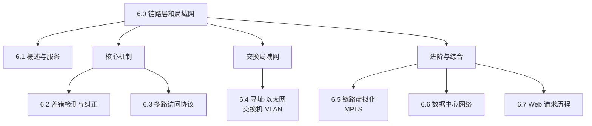

# 6.0 链路层和局域网

> 前几章自顶向下走到了网络层，分组已能跨网络从源主机送到目的主机。但每一跳的底层——分组怎样真正从一个节点送到物理上相邻的下一个节点——靠的是链路层。本章讲清这一跳：先看链路层提供哪些服务、在何处实现；再展开它的两类核心机制——差错检测、以及多个节点共享同一信道时的多路访问；然后落到最常见的局域网技术（以太网、交换机、VLAN）；最后是链路虚拟化、数据中心网络，并以一次完整的 Web 请求历程把全书各层串起来。

## 链路层在协议栈中的位置

链路层位于网络层之下、物理层之上，是协议栈自顶向下的倒数第二层。它负责把网络层交下来的分组封装成**帧（frame）**，在一条链路上从一个节点送到相邻节点；物理层再负责把帧中的比特变成介质上的信号。

```
   应用层
   传输层
   网络层    分组（datagram）
 ─────────────────────────────
   链路层    帧（frame）   ← 本章
   物理层    比特 / 信号
```

> 注：网络层关心的是"端到端、跨越多跳"的路径；链路层只关心"一跳"——把分组从当前节点交到沿途下一个节点。一条端到端路径上的不同链路，可能用不同的链路层协议（如 WiFi、以太网、点对点链路）。
>
> 易混：**节点（node）** 指运行链路层协议的设备（主机、路由器、交换机、WiFi 接入点等）；**链路（link）** 指沿途相邻节点间的通信信道。"一段链路 + 两端节点"是链路层处理的基本单位。

链路层的服务并非每条链路都全部提供，常见的有：

| 服务 | 说明 | 是否必备 |
|---|---|---|
| 组帧（framing） | 把网络层分组封装进帧，加上首部/尾部 | 基本都提供 |
| 链路接入（MAC） | 共享介质时，协调多个节点对信道的访问 | 共享链路需要 |
| 差错检测与纠正 | 检测（有时纠正）传输中比特出错 | 普遍提供 |
| 可靠交付 | 在链路上确保无丢失地交付 | 可选（如以太网不提供，无线链路常提供） |

链路层主要由**网络适配器（网卡 / NIC）** 实现，多数功能落在硬件上。

## 本章脉络



> 阅读顺序：6.1 先把链路层的服务、实现位置、节点-链路术语讲清楚；6.2、6.3 是两类核心机制——差错检测解决"比特传错怎么办"，多路访问解决"多个节点抢同一条信道怎么办"；6.4 是本章主体，把前面的机制落到真实的交换局域网上（MAC 地址与 ARP、以太网、交换机、VLAN）；6.5、6.6 是进阶——把整个网络当作一条链路（MPLS、隧道）、以及数据中心内部的网络组织；6.7 用一次完整的 Web 页面请求，把 DHCP、ARP、DNS、TCP、HTTP 各层动作串成一条端到端的线。
>
> 注：6.2 的差错检测（CRC、检验和）与 3.x 传输层的检验和目的相同、所处层次不同；6.3 的多路访问（MAC）与第 7 章无线信道共享同源，可对照来看。

## 章节目录

- **[6.1 链路层：概述与服务](6.1链路层：概述与服务.md)**
  - 链路层提供的服务
  - 链路层在何处实现
  - 网络适配器与接口

- **[6.2 链路层：差错检测纠正](6.2链路层：差错检测纠正.md)**
  - 奇偶校验
  - 检验和（checksum）
  - 循环冗余检测（CRC）
  - 前向纠错（FEC）

- **[6.3 链路层：多路访问协议](6.3链路层：多路访问协议.md)**
  - 信道划分 MAC 协议
  - 随机访问 MAC 协议
  - 轮流 MAC 协议
  - 电缆接入网 DOCSIS

- **[6.4 链路层：交换局域网](6.4链路层：交换局域网.md)**
  - 链路层寻址与 ARP
  - 以太网
  - 链路层交换机
  - 虚拟局域网（VLAN）

- **[6.5 链路层：链路虚拟化](6.5链路层：链路虚拟化.md)**
  - 多协议标签交换（MPLS）
  - 网络作为一条链路
  - 隧道技术原理

- **[6.6 链路层：数据中心网络](6.6链路层：数据中心网络.md)**
  - 数据中心架构
  - 负载均衡与流量工程
  - 数据中心互联

- **[6.7 链路层：Web请求历程](6.7链路层：Web请求历程.md)**
  - DHCP 获取 IP 地址
  - ARP 获取 MAC 地址
  - DNS 解析域名
  - TCP 连接与 HTTP 传输

---

**开始学习：[6.1 链路层：概述与服务](6.1链路层：概述与服务.md)**
