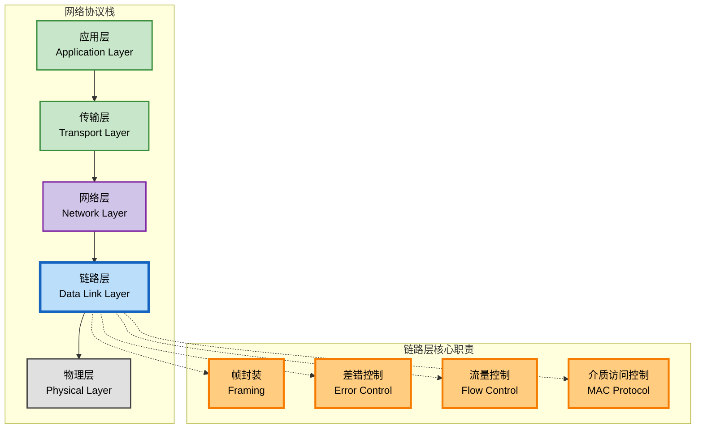
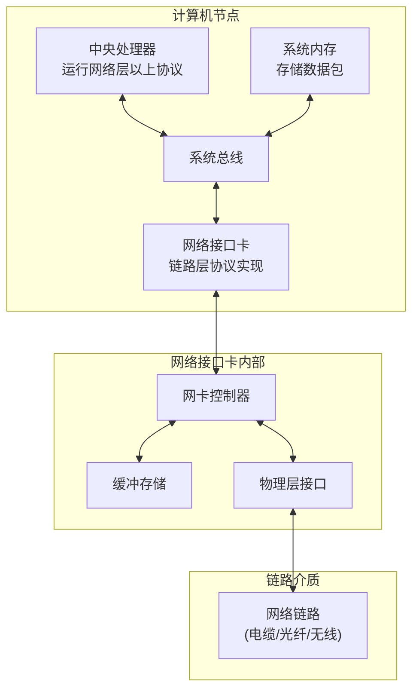
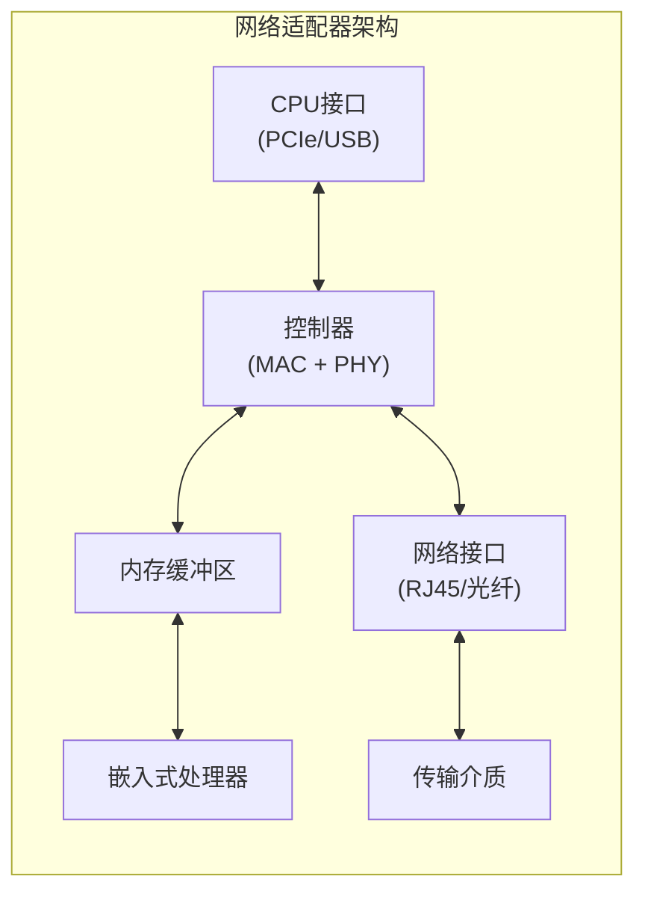

# 6.1 链路层：概述与服务

## 目录

1. [链路层基本概念](#链路层基本概念)
2. [链路层提供的服务](#链路层提供的服务)
3. [链路层在何处实现](#链路层在何处实现)
4. [网络适配器与接口](#网络适配器与接口)
5. [链路层协议分类](#链路层协议分类)

---

## 链路层基本概念

### 链路层的定位与作用

> **链路层（Data Link Layer）**
> 
> 计算机网络体系结构中的第二层，负责在直接相邻的网络节点之间提供可靠的数据传输服务，确保网络层分组能够无差错地从一个节点传递到相邻节点。

#### 网络分层架构中的链路层



#### 基本术语定义

**链路（Link）**：
- **有线链路**：以太网电缆、光纤等
- **无线链路**：WiFi、蜂窝网络等
- **点到点链路**：PPP协议链路
- **广播链路**：共享介质链路

**节点（Node）**：
- **主机**：运行应用程序的端系统
- **路由器**：转发分组的网络设备
- **交换机**：链路层转发设备
- **接入点**：无线网络设备

---

## 链路层提供的服务

### 基本服务功能

#### 1. 成帧（Framing）

> **成帧服务**
> 
> 将网络层传递下来的数据报封装到链路层帧中，添加帧头和帧尾信息。

**帧结构组成**：
```

| 帧头部  | 地址    | 数据载荷  | 帧尾部  |
| Header | Addr   | Payload  | Trailer|

```

**成帧方法**：
1. **字符计数**：在帧头指示帧长度
2. **字符填充**：使用特殊字符标记帧边界
3. **比特填充**：使用特定比特模式定界
4. **物理层编码违例**：利用编码规则标记

#### 2. 链路接入（Link Access）

> **介质访问控制（MAC）**
> 
> 控制多个节点如何访问共享的广播链路，协调节点间的传输时机。

**链路类型与访问控制**：

| 链路类型 | 特点 | 访问控制需求 | 典型协议 |
|---------|------|------------|---------|
| 点到点链路 | 单一发送方和接收方 | 无需MAC协议 | PPP |
| 广播链路 | 多个节点共享介质 | 需要MAC协议 | CSMA/CD, 令牌环 |

#### 3. 可靠交付（Reliable Delivery）

> **可靠交付服务**
> 
> 确保帧能够无差错地从发送节点传递到接收节点，通过确认和重传机制实现。

**可靠交付机制**：
- **自动重传请求（ARQ）**：检测错误并请求重传
- **正向纠错（FEC）**：接收方直接纠正错误
- **混合ARQ**：结合检测和纠错技术

#### 4. 差错检测和纠正

> **差错控制**
> 
> 检测和纠正由于信号衰减、噪声干扰等原因造成的比特错误。

**差错控制技术**：
- **检测技术**：奇偶校验、CRC
- **纠错技术**：海明码、里德-所罗门码
- **混合技术**：检测+重传，纠错+检测

**差错控制的实现层次**：

1. **硬件实现**：
   - CRC校验由网卡硬件完成
   - 计算速度快，不占用CPU资源
   - 适用于高速网络环境

2. **软件实现**：
   - 检验和由协议软件计算
   - 灵活性高，易于修改
   - 适用于传输层和应用层

**比特差错率（BER）影响**：
- **有线链路**：BER通常为 $10^{-6}$ 到 $10^{-9}$
- **无线链路**：BER通常为 $10^{-3}$ 到 $10^{-5}$
- 链路质量直接影响差错控制策略选择

---

## 链路层在何处实现

### 实现层次结构

#### 1. 硬件实现



#### 2. 软硬件协同

**硬件部分**：
- **网络接口卡**：执行链路层功能
- **专用芯片**：实现MAC协议、差错检测
- **缓冲存储**：暂存待发送和接收的帧

**软件部分**：
- **设备驱动**：操作系统与网卡接口
- **协议栈**：实现高层协议功能
- **应用程序**：生成和处理网络数据

---

## 网络适配器与接口

### 网络适配器架构

#### 典型网络适配器组成



#### 适配器主要功能

**发送过程**：
1. 从主机内存获取数据报
2. 添加链路层头部信息
3. 执行差错检测编码
4. 将帧转换为物理信号
5. 通过介质传输到目标

**接收过程**：
1. 从介质接收物理信号
2. 转换为数字帧格式
3. 执行差错检测验证
4. 提取网络层数据报
5. 中断通知主机处理

### 现代适配器技术

#### 1. 高速以太网适配器

| 标准 | 速度 | 介质 | 最大距离 | 编码方式 | 典型应用 |
|-----|------|------|---------|---------|---------|
| Fast Ethernet | 100 Mbps | 双绞线 | 100m | 4B/5B | 桌面接入 |
| Gigabit Ethernet | 1 Gbps | 双绞线/光纤 | 100m/5km | 8B/10B | 企业网络 |
| 10 Gigabit Ethernet | 10 Gbps | 光纤 | 40km | 64B/66B | 数据中心骨干 |
| 25/40/100 GbE | 25/40/100 Gbps | 光纤 | 10km | 64B/66B | 云计算中心 |

**适配器性能参数**：
- **缓冲区大小**：影响突发流量处理能力
- **DMA支持**：直接内存访问，减少CPU负担
- **中断合并**：减少中断次数，提高效率
- **校验卸载**：硬件完成CRC校验

#### 2. 无线网络适配器

**WiFi适配器技术演进**：

| 标准 | 频段 | 最大速率 | 核心技术 | 发布年份 |
|-----|------|---------|---------|---------|
| 802.11a | 5GHz | 54Mbps | OFDM | 1999 |
| 802.11b | 2.4GHz | 11Mbps | DSSS | 1999 |
| 802.11g | 2.4GHz | 54Mbps | OFDM | 2003 |
| 802.11n | 2.4/5GHz | 600Mbps | MIMO | 2009 |
| 802.11ac | 5GHz | 6.9Gbps | MU-MIMO | 2013 |
| 802.11ax | 2.4/5/6GHz | 9.6Gbps | OFDMA | 2019 |

**关键技术特性**：
- **MIMO技术**：多输入多输出，提高空间复用
- **波束成形**：定向传输，增强信号强度
- **信道绑定**：使用更宽的频带，提高速率
- **QAM调制**：高阶调制，提升频谱效率

**蜂窝网络适配器**：
- **多模支持**：兼容2G/3G/4G/5G
- **载波聚合**：同时使用多个频段
- **软件定义无线电**：通过软件更新支持新标准

---

## 链路层协议分类

### 按链路类型分类

#### 1. 点到点协议

> **点到点协议（PPP）**
> 
> 用于两个节点之间直接连接的链路层协议，无需介质访问控制。

**PPP特点**：
- 简单高效，开销小
- 支持多种网络层协议
- 提供认证和压缩功能
- 广泛用于拨号和专线接入

#### 2. 广播协议

> **广播链路协议**
> 
> 用于多个节点共享同一物理介质的情况，需要介质访问控制机制。

**主要协议**：
- **以太网（Ethernet）**：CSMA/CD机制
- **令牌环（Token Ring）**：令牌传递机制
- **无线LAN**：CSMA/CA机制

### 按功能特性分类

#### 服务功能对比

| 协议类型 | 可靠交付 | 流量控制 | 差错纠正 | 帧定界 | 应用场景 | 典型速率 |
|---------|---------|---------|---------|--------|---------|---------|
| 以太网 | 无 | 无 | 检测 | 前导码+SFD | 局域网 | 10M-100G |
| WiFi | 有 | 有 | 检测+重传 | 前导码+定界符 | 无线局域网 | 11M-10G |
| PPP | 可选 | 有 | 检测 | 标志字段 | 广域网接入 | 56K-10M |
| HDLC | 有 | 有 | 检测+重传 | 标志字段 | 专线连接 | 64K-2M |

**协议选择依据**：

1. **链路质量**：
   - 高质量链路（有线）：简单协议，如以太网
   - 低质量链路（无线）：复杂协议，如WiFi的CSMA/CA

2. **应用需求**：
   - 实时应用：尽力交付，延迟优先
   - 数据传输：可靠交付，准确性优先

3. **网络规模**：
   - 局域网：广播协议，如以太网
   - 广域网：点到点协议，如PPP

**链路层协议的性能权衡**：
- **可靠性 vs 效率**：可靠交付增加开销，降低吞吐量
- **复杂性 vs 功能**：功能丰富的协议实现复杂
- **延迟 vs 准确性**：重传机制增加延迟但提高可靠性

---

**下一节内容**：[6.2 链路层：差错检测纠正](6.2链路层：差错检测纠正.md) - 深入学习差错控制技术的原理和算法。
