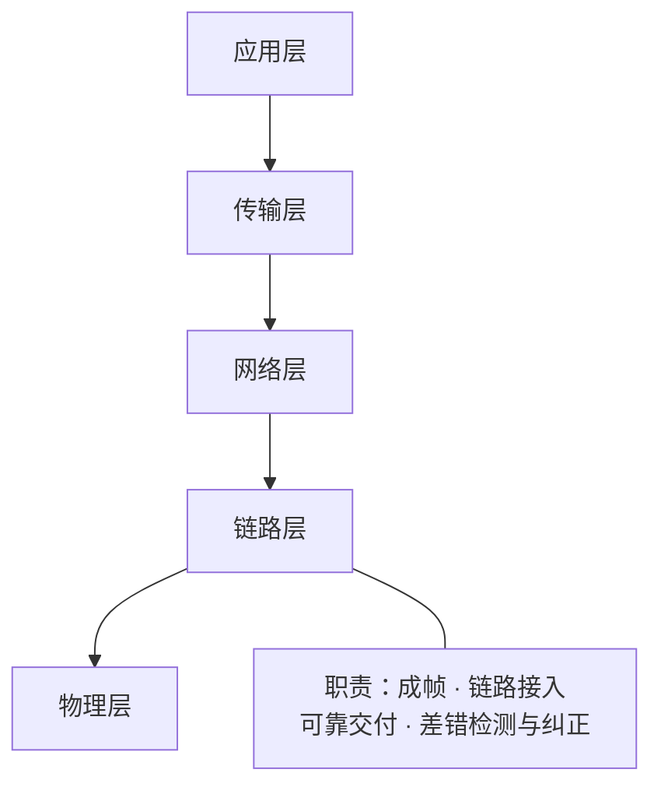
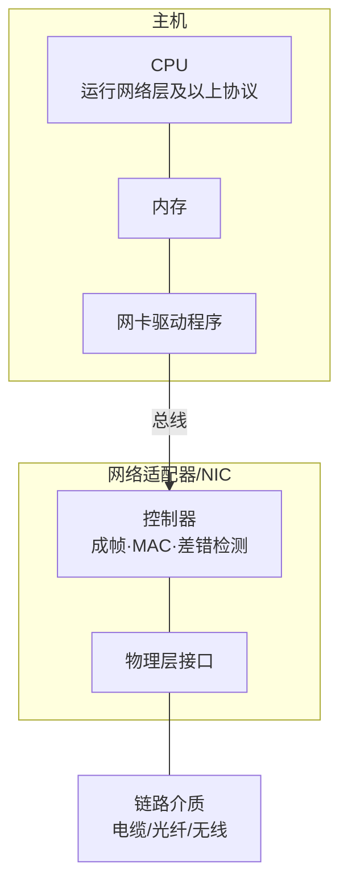
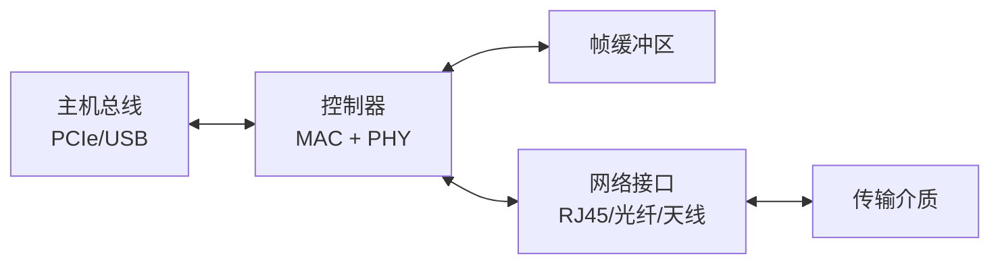

# 6.1 链路层：概述与服务

## 目录

1. [链路层基本概念](#链路层基本概念)
2. [链路层提供的服务](#链路层提供的服务)
3. [链路层在何处实现](#链路层在何处实现)
4. [网络适配器与接口](#网络适配器与接口)
5. [链路层协议分类](#链路层协议分类)

---

## 链路层基本概念

### 链路层的定位与作用

> **链路层（Data Link Layer）**
> 
> 协议栈的第二层，负责把网络层分组（数据报）从一个节点经过一段链路送到相邻节点。它工作在两个直接相连的节点之间，不关心端到端的整条路径。

链路层在协议栈中的位置与核心职责：



注：网络层管"端到端的路径选择"，链路层只管"相邻一跳的传输"。同一个数据报在不同链路上可能由不同的链路层协议承载（如先走以太网，再走 WiFi）。

#### 基本术语定义

**链路（Link）**：沿通信路径连接相邻节点的通信信道。
- 有线链路：以太网电缆、光纤
- 无线链路：WiFi、蜂窝网络
- 点到点链路：单一发送方与单一接收方，如 PPP
- 广播链路：多个节点共享同一介质

**节点（Node）**：运行链路层协议的设备。
- 主机：运行应用程序的端系统
- 路由器：转发分组的网络设备
- 交换机：链路层转发设备
- 接入点（AP）：无线网络中的接入设备

注：把数据报沿一条链路从一个节点送到相邻节点，称为一次**链路层帧的传输（一跳）**。

---

## 链路层提供的服务

不同的链路层协议提供的服务各不相同，下面四项是常见的核心服务（具体协议可只实现其中一部分）：

```
              网络层数据报
                   │
                   ▼
        ┌──────────────────────┐
        │ ① 成帧：封装为帧      │  加帧头/帧尾
        │ ② 链路接入：MAC 协调  │  共享介质时决定何时发
        │ ③ 可靠交付：确认+重传 │  保证逐跳无差错送达
        │ ④ 差错检测与纠正      │  发现并（可选）改正比特错误
        └──────────────────────┘
                   │
                   ▼
              交给物理层发送
```

### 成帧（Framing）

> **成帧**
> 
> 把网络层数据报封装进链路层帧，在数据前后加上帧头和帧尾。几乎所有链路层协议都要成帧。

帧的一般结构：

```
+--------+----------+--------+
|  帧头   |  数据载荷  |  帧尾   |
| Header | Payload  |Trailer |
+--------+----------+--------+
   ↑                    ↑
 地址等控制字段        差错检测字段（如 CRC）
```

注：链路层地址（如 MAC 地址）位于帧头，用于在同一链路上标识相邻节点，与网络层的 IP 地址是不同层的寻址机制。

常见的帧定界方法：

1. 字节计数：帧头给出帧长度
2. 字节填充：用特殊字节标记帧边界，载荷中出现该字节时转义
3. 比特填充：用特定比特模式（如 `01111110`）定界
4. 物理层编码违例：利用编码中不会出现的信号组合作为边界

### 链路接入（Link Access）

> **介质访问控制（MAC）协议**
> 
> 在多个节点共享同一广播介质时，规定每个节点何时可以发送帧，以协调冲突。

| 链路类型 | 特点 | 是否需要 MAC | 典型协议 |
|---------|------|------------|---------|
| 点到点链路 | 单一发送方与单一接收方 | 不需要 | PPP、HDLC |
| 广播链路 | 多个节点共享介质 | 需要 | 以太网（CSMA/CD）、WiFi（CSMA/CA） |

注：点到点链路两端独占信道，MAC 协议很简单甚至省略；广播链路才是 MAC 协议要解决的核心场景（详见 [6.3 多路访问协议](6.3链路层：多路访问协议.md)）。

### 可靠交付（Reliable Delivery）

> **可靠交付**
> 
> 保证每个网络层数据报无差错地通过这一段链路，通常通过确认（ACK）与重传机制实现。

- 多用于**易出错的链路**（如无线），就近重传比留给端到端的传输层重传更高效
- 在**低误码率的有线链路**（以太网、光纤）上常被省略，因为它带来的开销不值得

注：链路层可靠交付是"逐跳"的，传输层（TCP）可靠交付是"端到端"的，两者层次不同、可以并存。

易混：可靠交付靠"确认+重传"（ARQ）来纠正错误；而下面的"差错纠正"是接收方利用冗余位**直接改正**错误（FEC），不需要重传。两者是不同的纠错思路。

### 差错检测与纠正

> **差错控制**
> 
> 检测（并在可能时纠正）由信号衰减、噪声干扰等造成的比特差错。

- **差错检测**：发送方加入冗余位，接收方据此判断帧是否出错；只能发现错误，不能定位。常用奇偶校验、检验和、CRC
- **差错纠正（FEC）**：接收方不仅能发现错误，还能直接定位并改正，无需重传。常用海明码、里德-所罗门码

链路层的差错检测通常由网卡硬件完成（如 CRC），速度快、不占用 CPU；传输层和应用层的检验和则多由软件计算，灵活但较慢。

不同链路的比特差错率（BER）差别很大，这也决定了是否值得开启可靠交付与纠错：

| 链路类型 | 典型 BER |
|---------|---------|
| 有线链路（以太网、光纤） | $10^{-9} \sim 10^{-6}$ |
| 无线链路（WiFi、蜂窝） | $10^{-5} \sim 10^{-3}$ |

差错检测与纠正的具体算法见 [6.2 差错检测纠正](6.2链路层：差错检测纠正.md)。

---

## 链路层在何处实现

链路层主要实现在**网络适配器（network adapter）**中，也称**网络接口卡（NIC, Network Interface Card）**。它一头连接主机总线，一头连接链路介质，链路层的大部分功能（成帧、MAC、差错检测）由网卡上的专用芯片以硬件完成。



注：网络层及以上的协议是纯软件，运行在主机 CPU 上；链路层则跨越软硬件边界——大部分逻辑在网卡硬件里，少部分（如驱动响应中断、组装帧前的准备）由软件完成。物理层基本全在网卡硬件上。

软硬件分工：

- **硬件（网卡）**：成帧/拆帧、执行 MAC 协议、CRC 差错检测、收发帧的缓冲
- **软件（驱动 + 协议栈）**：把数据报交给网卡、响应网卡的收帧中断、把数据报上交网络层

---

## 网络适配器与接口

### 节点经链路传输帧

两个节点通信时，发送方网卡把数据报封装成帧并转为物理信号发出，接收方网卡收到信号后还原成帧、校验、再把数据报交给网络层：

```
发送节点                                   接收节点
┌──────────┐                            ┌──────────┐
│  网络层   │ 数据报                       │  网络层   │
└────┬─────┘                            └────▲─────┘
     │ 下传                                  │ 上交（校验通过）
┌────▼─────┐      帧（含 CRC）   ┌──────────┴───────┐
│ 网卡：成帧 │ ─────────────────▶ │ 网卡：拆帧、差错检测 │
│  转物理信号 │                   │     还原数据报     │
└────┬─────┘                    └────────▲─────────┘
     └──────────── 链路介质 ──────────────┘
```

发送方网卡的步骤：取数据报 → 加帧头帧尾、算 CRC → 转为物理信号 → 经介质发出。
接收方网卡的步骤：收物理信号 → 还原为帧 → CRC 校验 → 取出数据报、中断通知主机。

### 网络适配器架构



### 半双工与全双工

链路按同一时刻能否双向传输分为两种工作方式：

| 工作方式 | 含义 | 是否会冲突 | 例子 |
|---------|------|----------|------|
| 半双工（Half-duplex） | 同一时刻只能单向传输，收发交替 | 共享介质时会冲突 | 早期总线式以太网（用 CSMA/CD） |
| 全双工（Full-duplex） | 收发各用独立信道，可同时双向传输 | 不冲突 | 交换机端口间的以太网链路 |

注：现代交换式以太网的端到端链路普遍工作在全双工，发送方与接收方各占一对线，因而不再需要 CSMA/CD 来仲裁冲突。CSMA/CD 只在半双工的共享介质上才有意义。

### 高速以太网适配器

| 标准 | 速率 | 介质 | 编码方式 |
|-----|------|------|---------|
| Fast Ethernet（100BASE-TX） | 100 Mbps | 双绞线 | 4B/5B |
| Gigabit Ethernet（1000BASE-T） | 1 Gbps | 双绞线 | 4D-PAM5 |
| Gigabit Ethernet（1000BASE-X） | 1 Gbps | 光纤 | 8B/10B |
| 10 Gigabit Ethernet | 10 Gbps | 光纤 | 64B/66B |
| 25/40/100 GbE | 25/40/100 Gbps | 光纤 | 64B/66B |

注：双绞线上的千兆以太网（1000BASE-T）用 4D-PAM5 多电平编码，4 对线同时收发；8B/10B 是光纤的 1000BASE-X 所用编码。两者常被混为一谈。

现代以太网网卡常见的卸载特性：DMA（直接内存访问，减少 CPU 拷贝）、中断合并（多帧一次中断）、校验和卸载（CRC 等由硬件计算）。

### 无线网络适配器

WiFi（802.11 系列）主要标准：

| 标准 | 频段 | 最大速率 | 核心技术 | 年份 |
|-----|------|---------|---------|------|
| 802.11a | 5 GHz | 54 Mbps | OFDM | 1999 |
| 802.11b | 2.4 GHz | 11 Mbps | DSSS | 1999 |
| 802.11g | 2.4 GHz | 54 Mbps | OFDM | 2003 |
| 802.11n | 2.4/5 GHz | 600 Mbps | MIMO | 2009 |
| 802.11ac | 5 GHz | 6.9 Gbps | MU-MIMO | 2013 |
| 802.11ax | 2.4/5/6 GHz | 9.6 Gbps | OFDMA | 2019 |

注：表中为标准的理论峰值速率，实际吞吐受信道质量、距离、并发节点等影响，通常远低于此值。

无线适配器的关键技术：MIMO（多天线空间复用）、波束成形（定向增强信号）、信道绑定（更宽频带）、高阶 QAM 调制。蜂窝适配器还支持多模（2G/3G/4G/5G）与载波聚合。

---

## 链路层协议分类

按链路类型，链路层协议大致分为两类：

- **点到点协议**：用于只有两个节点的链路，无需 MAC。代表是 PPP——开销小，支持多种网络层协议，可提供认证和压缩，常用于拨号与专线接入。
- **广播协议**：用于多节点共享介质的链路，需要 MAC 协议仲裁。代表有以太网（CSMA/CD）、WiFi（CSMA/CA）、令牌环（令牌传递）。

几种常见协议的服务对比：

| 协议 | 可靠交付 | 差错处理 | 帧定界 | 典型场景 |
|------|---------|---------|--------|---------|
| 以太网 | 无 | 检测 | 前导码 + SFD | 局域网 |
| WiFi | 有 | 检测 + 重传 | 前导码 + 定界符 | 无线局域网 |
| PPP | 可选 | 检测 | 标志字段 | 广域网接入 |
| HDLC | 有 | 检测 + 重传 | 标志字段 | 专线连接 |

注：是否提供可靠交付，主要看链路误码率——有线链路（以太网）误码率低，省去可靠交付以提高效率；无线链路（WiFi）误码率高，就近重传比交给端到端更划算。

---

**下一节**：[6.2 链路层：差错检测纠正](6.2链路层：差错检测纠正.md)
