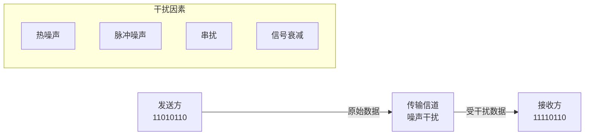
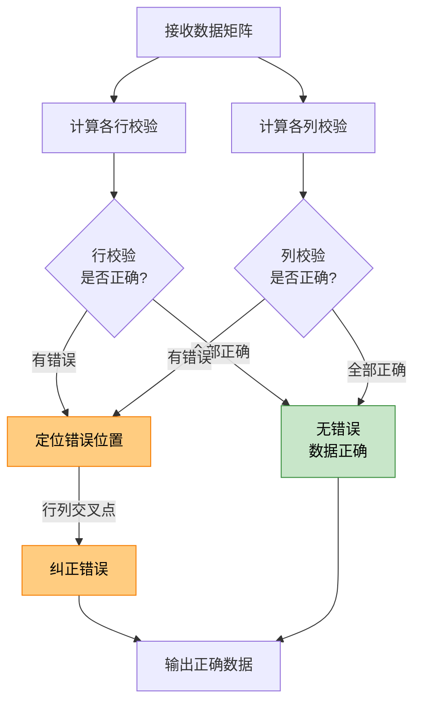
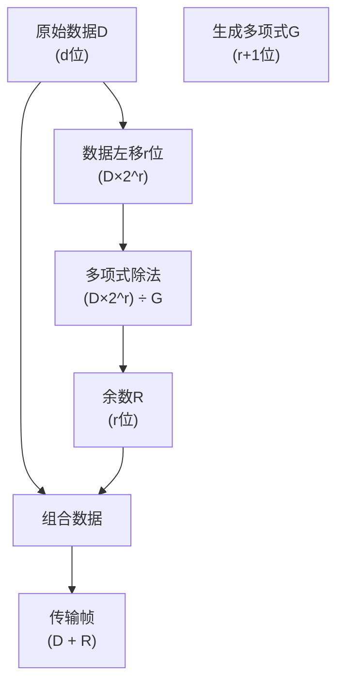

# 6.2 链路层：差错检测纠正

## 目录

1. [差错产生与类型](#差错产生与类型)
2. [奇偶校验技术](#奇偶校验技术)
3. [检验和方法](#检验和方法)
4. [循环冗余检测CRC](#循环冗余检测crc)
5. [前向纠错FEC技术](#前向纠错fec技术)
6. [差错控制技术对比](#差错控制技术对比)

---

## 差错产生与类型

### 差错产生的原因

> **传输差错**
> 
> 数字信号在物理介质中传输时，由于各种干扰因素导致接收端收到的比特与发送端不同的现象。

#### 差错产生机制



**主要干扰源**：
- **热噪声**：电子元件热运动产生
- **脉冲噪声**：瞬时强干扰信号
- **串扰干扰**：相邻信道信号泄露
- **信号衰减**：长距离传输功率损失

### 差错类型分析

#### 1. 按错误模式分类

**单比特差错**：
- 只有一个比特发生错误
- 在高质量传输介质中较常见
- 相对容易检测和纠正

**突发差错**：
- 连续多个比特发生错误
- 在无线和长距离传输中常见
- 检测和纠正难度较大

#### 2. 差错分布特性

| 差错类型 | 特征 | 产生原因 | 检测难度 |
|---------|------|---------|---------|
| 随机差错 | 分布均匀 | 热噪声 | 中等 |
| 突发差错 | 集中分布 | 脉冲干扰 | 较高 |
| 周期差错 | 规律出现 | 时钟漂移 | 较低 |

---

## 奇偶校验技术

### 单比特奇偶校验

> **单比特奇偶校验**
> 
> 在数据比特后添加一个校验比特，使整个数据（包括校验比特）中1的个数为奇数（奇校验）或偶数（偶校验）。

#### 工作原理

**偶校验示例**：
```
原始数据: 1101001  (1的个数: 4个，偶数)
校验比特: 0        (保持偶数特性)
发送数据: 11010010

原始数据: 1101011  (1的个数: 5个，奇数) 
校验比特: 1        (变为偶数)
发送数据: 11010111
```

**奇偶校验计算**：
- **偶校验**：P = d₀ ⊕ d₁ ⊕ ... ⊕ d_{n-1}
- **奇校验**：P = d₀ ⊕ d₁ ⊕ ... ⊕ d_{n-1} ⊕ 1

#### 检错能力分析

**检测能力**：
- 能检测所有奇数个比特错误
- 不能检测偶数个比特错误
- 检错率约50%

**局限性**：
- 无法纠正错误
- 对突发错误效果差
- 不能检测偶数位错误

### 二维奇偶校验

> **二维奇偶校验**
> 
> 将数据排列成二维矩阵，分别对行和列进行奇偶校验，能够检测和纠正单比特错误。

#### 实现方法

**数据排列示例**：

**4×4数据矩阵及校验位**：

|   | 列1 | 列2 | 列3 | 列4 | **行校验** |
|---|-----|-----|-----|-----|-----------|
| **行1** | 1 | 0 | 1 | 1 | **1** |
| **行2** | 1 | 1 | 0 | 1 | **1** |
| **行3** | 0 | 1 | 1 | 0 | **0** |
| **行4** | 1 | 0 | 0 | 1 | **0** |
| **列校验** | **1** | **0** | **0** | **1** | **0** |

**校验位计算说明**：
- 行校验：每行数据位的异或结果
- 列校验：每列数据位的异或结果  
- 右下角：所有校验位的异或（总校验）

**错误检测示例**：

假设接收到的数据第2行第3列发生错误（1→0）：

|   | 列1 | 列2 | 列3 | 列4 | **行校验** | **校验结果** |
|---|-----|-----|-----|-----|-----------|------------|
| **行1** | 1 | 0 | 1 | 1 | **1** | ✓ 正确 |
| **行2** | 1 | 1 | **0** | 1 | **1** | ❌ 错误 |
| **行3** | 0 | 1 | 1 | 0 | **0** | ✓ 正确 |
| **行4** | 1 | 0 | 0 | 1 | **0** | ✓ 正确 |
| **列校验** | **1** | **0** | **0** | **1** | **0** |   |
| **校验结果** | ✓ | ✓ | ❌ | ✓ |   |   |

**错误定位原理**：
- **行校验失败**：第2行校验错误 → 错误在第2行
- **列校验失败**：第3列校验错误 → 错误在第3列  
- **错误位置**：第2行第3列的交叉点
- **纠正方法**：将该位取反（0→1）

**工作流程图**：



#### 纠错能力

**纠错能力**：
- 能纠正任意单比特错误
- 能检测任意两比特错误
- 能检测部分多比特错误

---

## 检验和方法

### Internet检验和

> **Internet检验和**
> 
> 将数据分组看作16比特字的序列，计算所有字的二进制反码求和作为检验和。

#### 计算过程

**发送端计算**：
1. 将数据分割为16比特字
2. 对所有字进行二进制求和
3. 对求和结果取反码作为检验和
4. 将检验和加入数据中发送

**示例计算**：
```
数据字1: 0100010101000100
数据字2: 0101010101010101
数据字3: 1000111100001111

求和过程:
  0100010101000100
+ 0101010101010101
+ 1000111100001111
  ________________
= 1110001010100010  (注意进位处理)

检验和: 0001110101011101  (取反码)
```

#### 检错原理

**接收端验证**：
1. 对接收数据（含检验和）求和
2. 结果应全为1（全1检测）
3. 若不全为1则存在传输错误

**检错特性**：
- 能检测所有单比特错误
- 能检测大部分多比特错误
- 计算简单，硬件实现容易
- 不能纠正错误

---

## 循环冗余检测CRC

### CRC基本原理

> **循环冗余检测（CRC）**
> 
> 基于多项式运算的强大检错技术，将数据看作二进制多项式的系数，通过多项式除法计算冗余码。

#### 数学基础

**多项式表示**：
- 数据位串对应多项式系数
- 例如：110001 → x⁵ + x⁴ + x⁰

**生成多项式**：
- 预定义的r+1位二进制模式
- 决定CRC码的检错能力
- 常用标准：CRC-8, CRC-16, CRC-32

#### CRC计算过程



### CRC编码实现

#### 发送端编码

**步骤详解**：
1. **数据准备**：原始数据D（d位）
2. **左移操作**：D左移r位得到D×2^r
3. **多项式除法**：(D×2^r) ÷ G，得余数R
4. **组合传输**：发送D+R（d+r位）

**计算示例**：
```
数据D: 1101 (4位)
生成多项式G: 1011 (4位，度数r=3)

步骤1: 数据左移r位（3位）
1101 左移3位 → 1101000

步骤2: 模2除法 (异或运算)
        1001
       ______
1011 ) 1101000
       1011
       ----
       1000
       1011
       ----
       0110
       0000
       ----
       1100
       1011
       ----
       111

余数R: 111 (3位)

传输帧: 1101111 (原数据1101 + CRC码111)
```

#### 接收端检验

**验证过程**：
1. 接收完整帧（D+R）
2. 用相同生成多项式G除接收帧
3. 余数为0则无错，非0则有错

### 常用CRC标准

| CRC标准 | 多项式长度 | 生成多项式 | 应用场景 |
|--------|-----------|-----------|----------|
| CRC-8 | 8位 | x⁸+x²+x+1 | 简单应用 |
| CRC-16 | 16位 | x¹⁶+x¹⁵+x²+1 | 磁盘存储 |
| CRC-32 | 32位 | IEEE 802标准 | 以太网、ZIP |

### CRC检错能力

**理论保证**：
- 能检测所有单比特错误
- 能检测所有双比特错误  
- 能检测所有奇数个比特错误
- 能检测长度≤r的所有突发错误

**概率保证**：
- 对于长度>r的突发错误，检出概率为 $1-2^{-r}$
- 对于随机错误模式，检出概率为 $1-2^{-r}$

### CRC计算典型例题

#### 例题1：CRC编码计算

> **题目**：设数据为101001，生成多项式 $G(x) = x^4 + x + 1$，求对应的CRC码。

**解题步骤**：

**步骤1**：确定生成多项式的二进制形式
- $G(x) = x^4 + x + 1$ 对应二进制 10011（5位）
- 生成多项式阶数 $r = 4$

**步骤2**：数据左移r位
- 原始数据：101001（6位）
- 左移4位：1010010000（10位）

**步骤3**：模2除法计算余数
```
        101110
       ________
10011 ) 1010010000
        10011
        -----
        00111
        00000
        -----
        01110
        00000
        -----
        11101
        10011
        -----
        11100
        10011
        -----
        11110
        10011
        -----
        11010
        10011
        -----
        10010
        10011
        -----
        00010
        00000
        -----
        00100
        00000
        -----
        01000
        00000
        -----
        1000
```

**步骤4**：得到CRC码
- 余数：1000（4位）
- CRC码 = 原数据 + 余数 = 1010011000

**验证**：接收端用1010011000除以10011，余数应为0

#### 例题2：CRC检错验证

> **题目**：接收到的数据为1010011001，生成多项式为10011，判断是否有错。

**解题步骤**：

**步骤1**：用生成多项式除接收数据
```
        101110
       ________
10011 ) 1010011001
        10011
        -----
        00111
        00000
        -----
        01110
        00000
        -----
        11100
        10011
        -----
        11111
        10011
        -----
        11000
        10011
        -----
        10110
        10011
        -----
        01011
        00000
        -----
        10110
        10011
        -----
        01011
        00000
        -----
        1011
```

**步骤2**：判断结果
- 余数为1011 ≠ 0
- **结论**：数据传输有错误

#### 例题3：408真题风格计算

> **题目**：数据1101011，生成多项式G(x) = $x^3 + x + 1$，求：
> 1. 发送的CRC码字
> 2. 若接收码字为1101011110，判断是否正确

**解答**：

**第1问**：计算CRC码字

生成多项式二进制：1011（4位），r=3

数据左移3位：1101011000

模2除法：
```
        1110101
       _________
1011 ) 1101011000
       1011
       ----
       1100
       1011
       ----
       1111
       1011
       ----
       1001
       1011
       ----
       0101
       0000
       ----
       1010
       1011
       ----
       0010
       0000
       ----
       0100
       0000
       ----
       100
```

余数：100
CRC码字：1101011100

**第2问**：验证接收码字

用1011除1101011110：
```
余数计算后得：011 ≠ 0
```

**结论**：接收数据有错误

---

## 前向纠错FEC技术

### FEC基本概念

> **前向纠错（FEC）**
> 
> 在发送端添加足够的冗余信息，使接收端能够不仅检测错误，还能直接纠正错误，无需重传。

#### 基本思想


### 海明码原理

> **海明码**
> 
> 一种能够纠正单比特错误的线性分组码，通过在特定位置插入校验比特实现错误定位和纠正。

#### 海明码构造

**校验比特位置**：
- 校验比特放在位置2^i (i=0,1,2,...)
- 即位置1,2,4,8,16,...

**7位海明码示例**：
```
位置:    1  2  3  4  5  6  7
类型:    P1 P2 D1 P3 D2 D3 D4
功能: 校验1 校验2 数据1 校验3 数据2 数据3 数据4
```

**校验关系**：
- P1校验位置1,3,5,7 (二进制表示中第1位为1的位置)
- P2校验位置2,3,6,7 (二进制表示中第2位为1的位置) 
- P3校验位置4,5,6,7 (二进制表示中第3位为1的位置)

**位置二进制表示**：
- 位置1: 001₂ → 参与P1校验
- 位置2: 010₂ → 参与P2校验  
- 位置3: 011₂ → 参与P1,P2校验
- 位置4: 100₂ → 参与P3校验
- 位置5: 101₂ → 参与P1,P3校验
- 位置6: 110₂ → 参与P2,P3校验
- 位置7: 111₂ → 参与P1,P2,P3校验

#### 编码过程

**信息位设置**：假设要传输数据1011
```
位置:    1  2  3  4  5  6  7
内容:   P1 P2  1 P3  0  1  1
```

**校验位计算**：
- P1 = D1⊕D2⊕D4 = 1⊕0⊕1 = 0
- P2 = D1⊕D3⊕D4 = 1⊕1⊕1 = 1  
- P3 = D2⊕D3⊕D4 = 0⊕1⊕1 = 0

**最终码字**：0110111

#### 纠错过程

**接收码字**：假设收到0010111（第3位出错）

**校验计算**：
- S1 = P1⊕D1⊕D2⊕D4 = 0⊕0⊕0⊕1 = 1
- S2 = P2⊕D1⊕D3⊕D4 = 1⊕0⊕1⊕1 = 1
- S3 = P3⊕D2⊕D3⊕D4 = 0⊕0⊕1⊕1 = 0

**错误定位**：S3S2S1 = 011₂ = 3₁₀，指示第3位出错

**错误纠正**：将第3位取反，恢复原码字

---

## 差错控制技术对比

### 技术特性对比

| 技术 | 检错能力 | 纠错能力 | 冗余开销 | 计算复杂度 | 检测延迟 | 应用场景 |
|-----|---------|---------|---------|-----------|---------|----------|
| 奇偶校验 | 弱(50%) | 无 | 低(1比特) | O(n) | 极低 | 简单系统 |
| 检验和 | 中等(>90%) | 无 | 中等(16-32位) | O(n) | 低 | Internet协议 |
| CRC | 强(>99.9%) | 无 | 中等(8-32位) | O(n) | 低 | 数据链路层 |
| 海明码 | 强(100%) | 单比特 | 高(log n位) | O(n log n) | 中等 | 存储系统 |

**性能分析**：

1. **冗余率计算**：
   - 奇偶校验：$\frac{1}{n}$，数据越长，冗余率越低
   - CRC-32：$\frac{32}{n}$，对长数据帧效率高
   - 海明码：$\frac{\log_2 n}{n}$，短数据效率较低

2. **检错概率**：
   - 奇偶校验：只能检测奇数个错误，概率50%
   - CRC-r：随机错误检出概率 $1-2^{-r}$
   - 海明码：可检测所有单比特错误

### 选择策略

#### 应用环境考虑

**高质量链路**（BER<10⁻⁶）：
- 优先选择CRC检错+重传
- 简单奇偶校验足够
- 重点考虑效率和开销

**中等质量链路**（BER≈10⁻⁴）：
- CRC检错+ARQ重传
- 或使用简单纠错码
- 平衡效率和可靠性

**低质量链路**（BER>10⁻³）：
- 强纠错码（如卷积码）
- 交织技术对抗突发错误
- 可靠性优先于效率
 
**下一章预告**：[6.3 链路层：多路访问协议](6.3链路层：多路访问协议.md) - 学习如何在共享介质上协调多个节点的访问。
