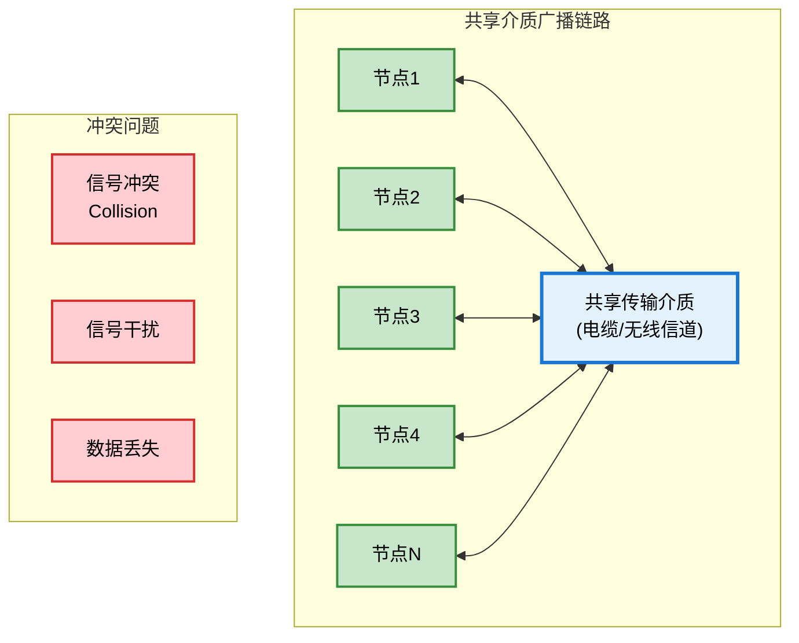
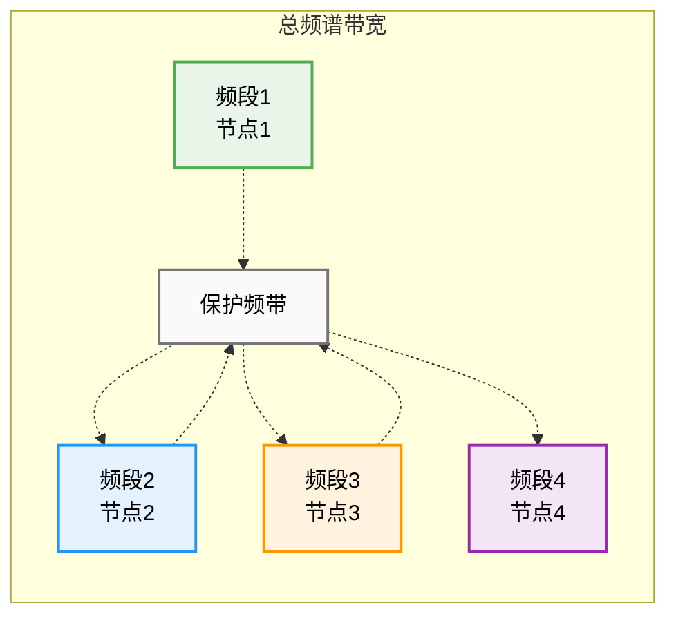
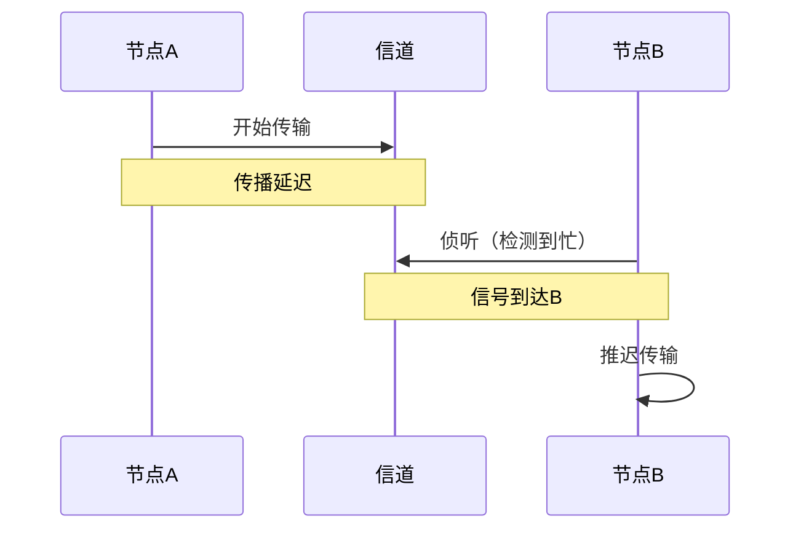
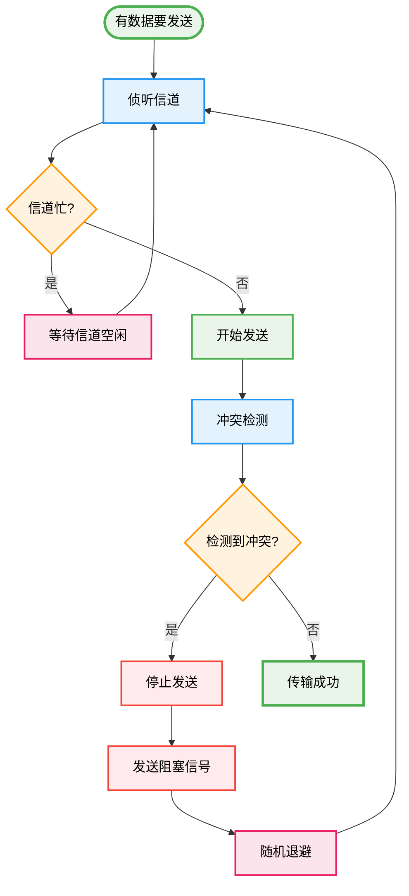
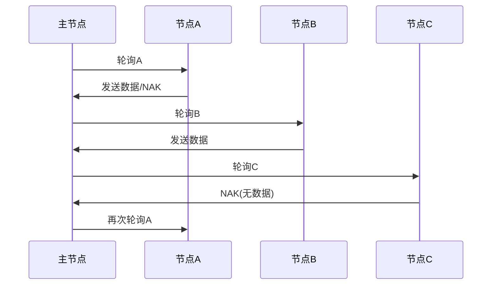
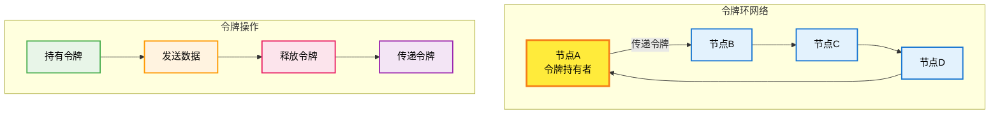
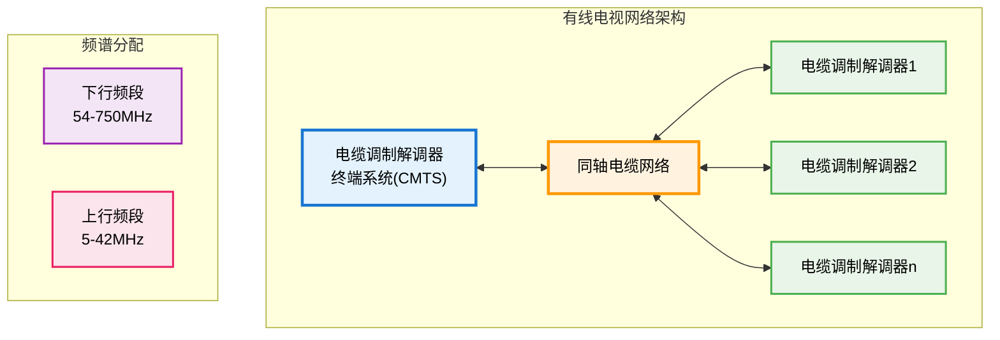
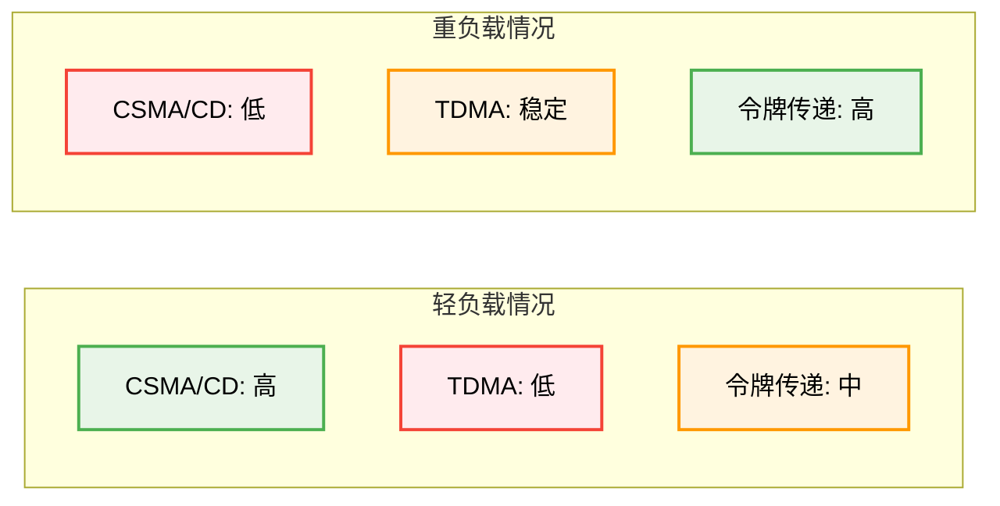

# 6.3 链路层：多路访问协议

## 目录

1. [多路访问问题](#多路访问问题)
2. [信道划分MAC协议](#信道划分mac协议)
3. [随机访问MAC协议](#随机访问mac协议)
4. [轮流MAC协议](#轮流mac协议)
5. [电缆接入网DOCSIS](#电缆接入网docsis)
6. [MAC协议性能比较](#mac协议性能比较)


---

## 多路访问问题

### 广播链路特性

> **广播链路（Broadcast Link）**
> 
> 多个节点共享同一物理传输介质，任何节点的传输都能被其他所有节点接收到的通信链路。

#### 广播链路模型



### 多路访问问题的挑战

#### 1. 冲突问题

> **冲突（Collision）**
> 
> 两个或多个节点同时发送数据时，信号在共享介质中相互干扰，导致所有传输都失败的现象。

**冲突发生条件**：
- 多个节点同时发送
- 传播延迟导致的隐藏冲突
- 节点间缺乏协调机制

**冲突后果**：
- 信号混合无法解码
- 传输带宽浪费
- 网络性能下降

#### 2. 理想MAC协议特性

> **MAC协议设计目标**
> 
> 设计高效的介质访问控制协议，协调多个节点对共享信道的使用。

**性能指标**：
- **信道利用率**：有效数据传输时间比例
- **公平性**：各节点获得相等的传输机会
- **延迟特性**：数据传输的平均延迟
- **稳定性**：负载变化时的性能表现

**理想特性**：
1. 单节点使用时获得全部带宽R
2. M个节点使用时每个获得R/M带宽
3. 完全分布式控制，无需中央协调
4. 协议简单，实现成本低

---

## 信道划分MAC协议

### 时分多路访问TDMA

> **时分多路访问（TDMA）**
> 
> 将时间分割成固定长度的时间片，各节点轮流在分配的时间片内独占信道进行传输。

#### TDMA工作原理

```mermaid
%%{init: {
  'theme': 'base',
  'themeVariables': {
    'primaryTextColor': '#000000',
    'sectionTextColor': '#000000',
    'taskTextColor': '#000000',
    'taskBkgColor': '#e3f2fd',
    'gridColor': '#e0e0e0'
  }
}}%%
gantt
    title TDMA时间片分配
    dateFormat X
    axisFormat %L
    
    section 节点1
    时间片1    :t1, 0, 100
    时间片5    :t5, 400, 500
    
    section 节点2  
    时间片2    :t2, 100, 200
    时间片6    :t6, 500, 600
    
    section 节点3
    时间片3    :t3, 200, 300
    时间片7    :t7, 600, 700
    
    section 节点4
    时间片4    :t4, 300, 400
    时间片8    :t8, 700, 800
```



**TDMA特点**：
- **优点**：无冲突，公平性好，稳定可靠
- **缺点**：有数据等待延迟，信道利用率可能较低
- **应用**：GSM移动通信，卫星通信

### 频分多路访问FDMA

> **频分多路访问（FDMA）**
> 
> 将可用频谱分割成多个子频段，每个节点分配固定的频段进行通信。

#### FDMA频谱分配



**FDMA特点**：
- **优点**：无时间同步要求，持续传输
- **缺点**：频谱效率受限，保护频带开销
- **应用**：传统电话系统，FM广播

### 码分多路访问CDMA

> **码分多路访问（CDMA）**
> 
> 给每个节点分配唯一的编码序列，所有节点可以同时使用整个频谱，通过编码区分不同用户。

#### CDMA基本原理

**编码分配**：
- 每个节点分配唯一的码片序列
- 码片序列相互正交
- 数据比特与码片序列相乘

**编码示例**：
```
节点A码片: [-1, -1, +1, +1]
节点B码片: [-1, +1, -1, +1]

发送数据1: 使用原码片序列
发送数据0: 使用码片序列的负值
发送空闲: 发送全零序列
```

**接收解码**：
- 接收信号与目标节点码片进行内积
- 内积结果判断发送的数据位

**CDMA特点**：
- **优点**：抗干扰能力强，保密性好，频谱效率高
- **缺点**：实现复杂，功率控制要求高
- **应用**：3G移动通信，卫星通信

---

## 随机访问MAC协议

### 时隙ALOHA协议

> **时隙ALOHA**
> 
> 将时间分成等长时隙，节点只能在时隙开始时发送数据，冲突时随机选择重传时机。

#### 工作机制

**时隙同步**：
- 所有节点时钟同步
- 数据包长度等于时隙长度
- 只能在时隙边界开始传输

```mermaid
%%{init: {
  'theme': 'base',
  'themeVariables': {
    'primaryTextColor': '#000000',
    'sectionTextColor': '#000000',
    'taskTextColor': '#000000',
    'doneTaskBkgColor': '#c8e6c9',
    'critTaskBkgColor': '#f5f5f5',
    'gridColor': '#e0e0e0'
  }
}}%%
gantt
    title 时隙ALOHA传输示例
    dateFormat X
    axisFormat %L
    
    section 节点A
    成功传输    :done, a1, 0, 100
    冲突       :crit, a2, 200, 300
    重传成功    :done, a3, 500, 600
    
    section 节点B
    空闲       :100, 200
    冲突       :crit, b2, 200, 300
    重传成功    :done, b3, 400, 500
```



**性能分析**：
- **最大吞吐量**：1/e ≈ 0.368（37%）
- **冲突处理**：随机退避重传
- **同步要求**：需要全网时钟同步

### 纯ALOHA协议

> **纯ALOHA**
> 
> 节点有数据时立即发送，不需要等待时隙边界，冲突后随机延时重传。

#### 特点对比

| 协议 | 同步要求 | 最大吞吐量 | 冲突窗口 | 实现复杂度 |
|-----|---------|-----------|---------|-----------|
| 纯ALOHA | 无 | 1/(2e)≈18% | 2T | 简单 |
| 时隙ALOHA | 需要 | 1/e≈37% | T | 中等 |

### CSMA协议族

> **载波侦听多路访问（CSMA）**
> 
> 发送前先侦听信道，如果信道空闲才发送数据，显著减少冲突概率。

#### CSMA基本思想

**载波侦听原理**：
- 发送前侦听信道状态
- 信道空闲时才开始发送
- 信道忙时推迟发送

**传播延迟影响**：


#### CSMA协议变种

**1. 1-坚持CSMA**：
- 信道空闲立即发送
- 信道忙时持续侦听
- 冲突概率相对较高

**2. 非坚持CSMA**：
- 信道忙时随机延时后重新侦听
- 减少冲突但可能降低信道利用率

**3. p-坚持CSMA**：
- 信道空闲时以概率p发送
- 以概率(1-p)推迟到下一时隙
- 平衡冲突和延迟

### CSMA/CD协议

> **带冲突检测的CSMA（CSMA/CD）**
> 
> 在CSMA基础上增加冲突检测能力，发现冲突后立即停止传输并执行冲突处理过程。

#### 工作流程



**关键技术要素**：

1. **冲突检测**：
   - 比较发送和接收信号
   - 检测到差异表明发生冲突
   - 对无线网络难以实现

2. **最小帧长限制**：
   - 确保在最坏情况下能检测到冲突
   - 最小帧长 ≥ 2 × 传播延迟 × 传输速率

3. **二进制指数退避**：
   - 第k次冲突后从{0,1,...,min(2^k-1, 1023)}中随机选择
   - 退避时间 = 选择值 × 512位时间（对于10Mbps以太网）
   - 最大重试次数为16次，超过后丢弃帧
   - 成功传输后重置退避参数

#### CSMA/CD性能分析

**效率公式**：
$$\text{效率} = \frac{1}{1 + 5t_{prop}/t_{trans}}$$

其中：
- $t_{prop}$：传播延迟（端到端传播时间）
- $t_{trans}$：帧传输时间

**效率影响因素**：
- 网络跨度（传播延迟）
- 帧长（传输时间）
- 网络负载程度

### CSMA/CD效率计算典型例题

#### 例题1：效率计算基础

> **题目**：某以太网长度为2km，信号传播速度为 $2 \times 10^8$ m/s，数据传输率为10Mbps，帧长为1000字节。求信道效率。

**解题步骤**：

**步骤1**：计算传播延迟 $t_{prop}$
$$t_{prop} = \frac{2000}{2 \times 10^8} = 10^{-5} \text{秒} = 10 \mu s$$

**步骤2**：计算帧传输时间 $t_{trans}$
$$t_{trans} = \frac{1000 \times 8}{10 \times 10^6} = 8 \times 10^{-4} \text{秒} = 800 \mu s$$

**步骤3**：计算效率
$$\text{效率} = \frac{1}{1 + 5 \times \frac{10}{800}} = \frac{1}{1 + 0.0625} \approx 0.941 = 94.1\%$$

**结论**：信道利用率为94.1%，较高的效率表明网络配置合理。

#### 例题2：最小帧长计算

> **题目**：以太网长度为5km，信号传播速度为 $2 \times 10^8$ m/s，数据传输率为100Mbps。求最小帧长。

**解题步骤**：

**步骤1**：计算往返传播时间RTT
$$RTT = 2 \times t_{prop} = 2 \times \frac{5000}{2 \times 10^8} = 5 \times 10^{-5} \text{秒} = 50 \mu s$$

**步骤2**：计算最小帧长
- 为保证能检测到冲突，最小帧传输时间应≥RTT
$$L_{min} = RTT \times R = 50 \times 10^{-6} \times 100 \times 10^6 = 5000 \text{比特} = 625 \text{字节}$$

**结论**：最小帧长为625字节。

**关键原理**：
- 发送站必须在帧发送完毕前检测到冲突
- 最坏情况：信号传播到最远端时发生冲突
- 冲突信号需要再传播回来才能被发送站检测到

#### 例题3：408真题风格计算

> **题目**：某CSMA/CD网络，传播延迟为10μs，帧传输时间为40μs，求：
> 1. 信道利用率
> 2. 若要使利用率达到90%以上，帧长至少应为多少（假设传输速率为10Mbps）

**解答**：

**第1问**：计算当前利用率
$$\text{效率} = \frac{1}{1 + 5 \times \frac{10}{40}} = \frac{1}{1 + 1.25} = \frac{1}{2.25} \approx 0.444 = 44.4\%$$

**第2问**：计算所需最小帧长

设新的帧传输时间为 $t'$，要求效率≥90%：
$$0.9 = \frac{1}{1 + 5 \times \frac{10}{t'}}$$

解得：
$$1 + \frac{50}{t'} = \frac{1}{0.9} = 1.111$$
$$\frac{50}{t'} = 0.111$$
$$t' = \frac{50}{0.111} \approx 450 \mu s$$

最小帧长：
$$L_{min} = t' \times R = 450 \times 10^{-6} \times 10 \times 10^6 = 4500 \text{比特} = 562.5 \text{字节}$$

**结论**：帧长至少应为563字节（向上取整）。

### 二进制指数退避算法详解

#### 算法原理

> **二进制指数退避（Binary Exponential Backoff, BEB）**
> 
> 当发生冲突时，站点随机选择一个退避时间，退避时间从指数增长的时间槽范围中选择。

#### 详细算法步骤

**算法流程**：

1. **确定冲突次数** $k$：
   - 第1次冲突：$k=1$
   - 第2次冲突：$k=2$
   - ...
   - 第n次冲突：$k=n$
   - $k$ 的最大值为10（即 $k = \min(n, 10)$）

2. **确定退避范围**：
   - 从集合 $\{0, 1, 2, ..., 2^k-1\}$ 中随机选择一个数 $r$
   - 例如第1次冲突：$r \in \{0, 1\}$
   - 例如第2次冲突：$r \in \{0, 1, 2, 3\}$
   - 例如第3次冲突：$r \in \{0, 1, 2, ..., 7\}$

3. **计算退避时间**：
   - 退避时间 $T_{backoff} = r \times 2\tau$
   - 其中 $\tau$ 为传播延迟（争用期）
   - 对于10Mbps以太网：$2\tau = 51.2 \mu s$（512比特时间）

4. **执行退避**：
   - 等待 $T_{backoff}$ 时间
   - 重新侦听信道
   - 若空闲则重新发送

5. **重传限制**：
   - 最多重传16次
   - 超过16次则放弃并报告错误

#### 退避算法计算例题

> **题目**：某站点连续3次发生冲突，传播延迟为25.6μs。求：
> 1. 第3次冲突后可能的退避时间范围
> 2. 平均退避时间

**解答**：

**第1问**：退避时间范围

第3次冲突，$k=3$：
- 随机数 $r \in \{0, 1, 2, 3, 4, 5, 6, 7\}$
- 退避时间 $T_{backoff} = r \times 2\tau = r \times 51.2 \mu s$
- 最小退避时间：$0 \times 51.2 = 0 \mu s$
- 最大退避时间：$7 \times 51.2 = 358.4 \mu s$

**第2问**：平均退避时间

$$\bar{T}_{backoff} = \frac{0 + 1 + 2 + ... + 7}{8} \times 51.2 = \frac{28}{8} \times 51.2 = 179.2 \mu s$$

#### 退避算法性能分析

**优点**：
- 轻载时快速恢复（小的退避范围）
- 重载时减少冲突（大的退避范围）
- 公平性较好（随机选择）

**缺点**：
- 后退站点的重传概率降低（捕获效应）
- 高负载时效率下降
- 不适合实时应用

**退避次数与范围表**：

| 冲突次数 | k值 | 退避范围 | 最大退避时间(512位时) |
|---------|-----|---------|---------------------|
| 1 | 1 | 0-1 | 1×51.2μs |
| 2 | 2 | 0-3 | 3×51.2μs |
| 3 | 3 | 0-7 | 7×51.2μs |
| 4 | 4 | 0-15 | 15×51.2μs |
| 5 | 5 | 0-31 | 31×51.2μs |
| 10 | 10 | 0-1023 | 1023×51.2μs |
| 11-15 | 10 | 0-1023 | 1023×51.2μs |
| 16 | - | 放弃 | 报告错误 |

---

## 轮流MAC协议

### 轮询协议

> **轮询协议**
> 
> 指定一个主节点，主节点轮流"邀请"从节点发送数据，避免冲突但存在轮询开销。

#### 轮询机制



**特点分析**：
- **优点**：无冲突，可控制，支持优先级
- **缺点**：轮询延迟，主节点故障风险
- **应用**：集中控制系统，蓝牙piconet

### 令牌传递协议

> **令牌传递**
> 
> 在节点间传递特殊的令牌帧，只有持有令牌的节点才能发送数据。

#### 令牌环网络



**令牌协议特点**：
- **优点**：分布式控制，无冲突，公平性
- **缺点**：令牌维护开销，单点故障
- **应用**：令牌环网络，FDDI

### 协议对比分析

| 协议类型 | 延迟特性 | 吞吐量 | 公平性 | 复杂度 | 适用场景 |
|---------|---------|--------|--------|--------|---------|
| 轮询 | 高 | 中等 | 可控 | 中等 | 集中管理 |
| 令牌传递 | 中等 | 高 | 好 | 高 | 高可靠性 |
| CSMA/CD | 低 | 高 | 相对公平 | 中等 | 局域网 |

---

## 电缆接入网DOCSIS

### DOCSIS技术概述

> **数据电缆服务接口规范（DOCSIS）**
> 
> 用于有线电视网络提供宽带互联网接入服务的链路层协议标准。

#### 系统架构



### DOCSIS协议机制

#### 频分双工

**频谱分配**：
- **下行方向**：使用高频段（50-750MHz）
- **上行方向**：使用低频段（5-42MHz）
- **频段分离**：避免上下行干扰

#### 多路访问控制

**下行传输**：
- CMTS广播下行数据
- 每个CM提取自己的数据
- TDM方式共享下行带宽

**上行传输**：
- 多个CM竞争上行信道
- 使用时隙ALOHA机制
- CMTS集中调度和控制

#### 服务质量保证

**服务等级**：
- **尽力而为服务**：无保证的数据传输
- **保证服务**：带宽和延迟保证
- **实时服务**：低延迟应用支持

**流量管理**：
- 基于用户的带宽限制
- 动态带宽分配
- 服务等级协议执行

---

## MAC协议性能比较

### 性能指标分析

#### 吞吐量对比



#### 延迟特性

| 协议 | 轻负载延迟 | 重负载延迟 | 延迟稳定性 |
|-----|-----------|-----------|-----------|
| CSMA/CD | 很低 | 很高 | 差 |
| TDMA | 中等 | 中等 | 好 |
| 令牌传递 | 高 | 中等 | 好 |

### 应用场景选择

#### 局域网应用

**以太网（CSMA/CD）**：
- 适用于突发数据传输
- 成本低，实现简单
- 性能随负载变化大

#### 实时系统

**TDMA/令牌传递**：
- 提供可预测的延迟
- 保证服务质量
- 适用于控制系统

#### 无线网络

**CSMA/CA**：
- 冲突检测困难
- 使用冲突避免机制
- RTS/CTS握手协议
 
 

**下一章预告**：[6.4 链路层：交换局域网](6.4链路层：交换局域网.md) - 学习以太网技术和交换机工作原理。
