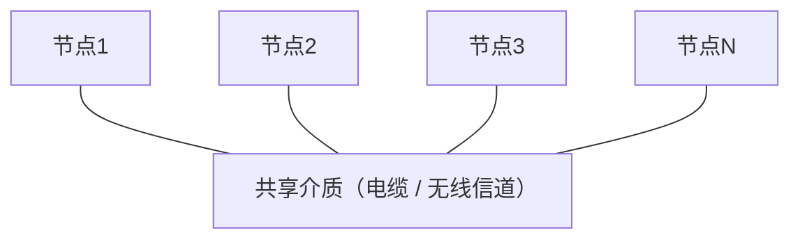
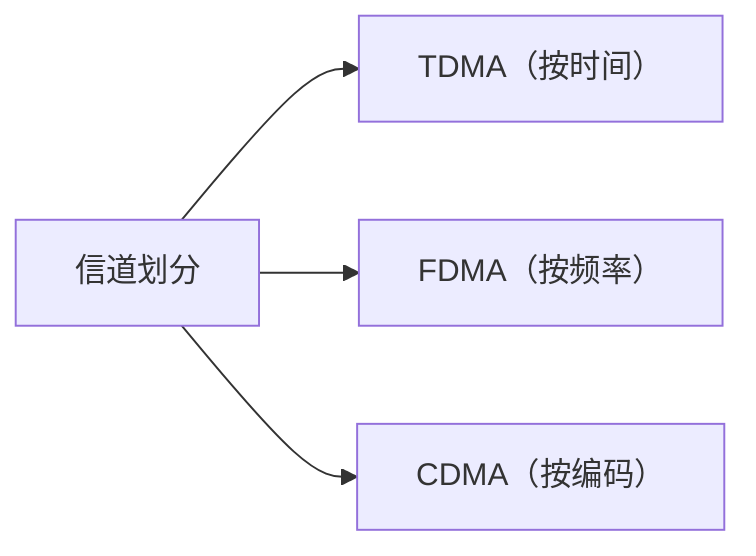
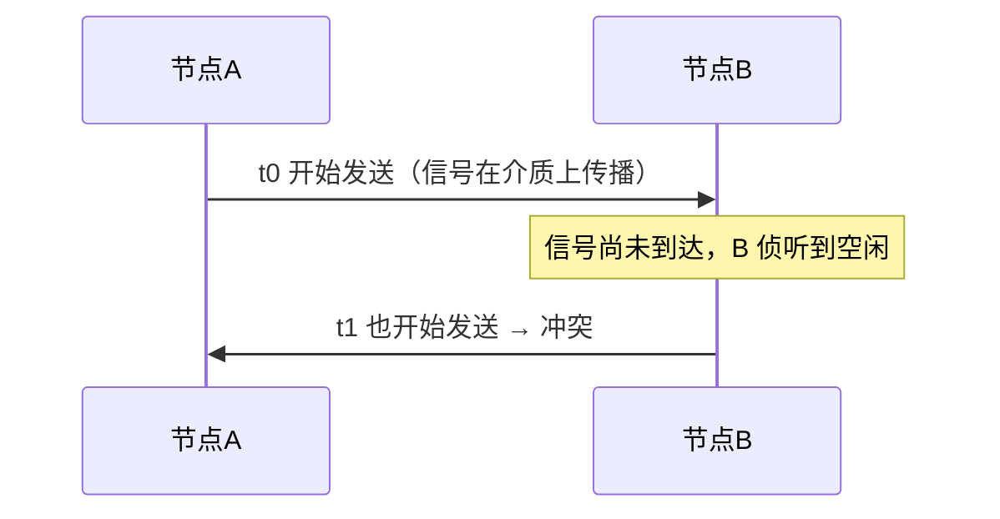
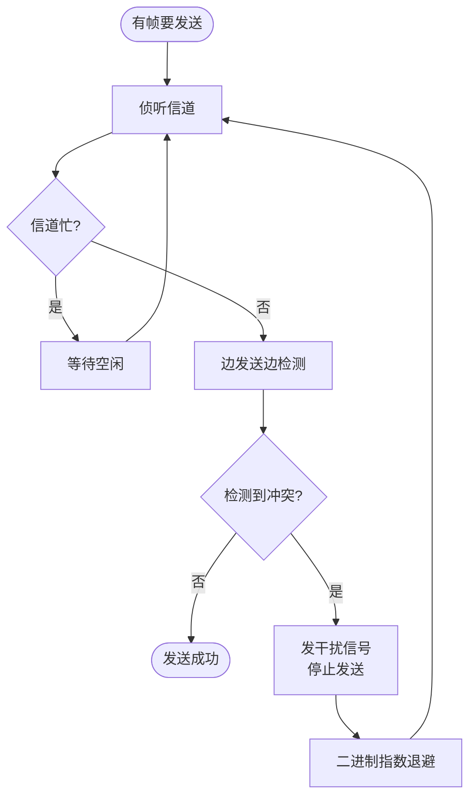
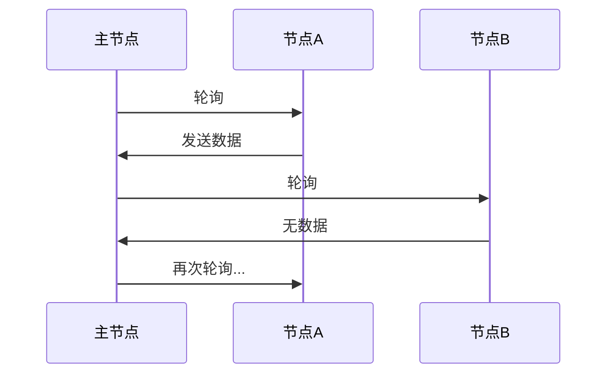
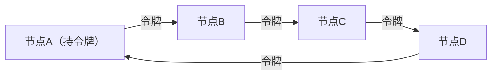
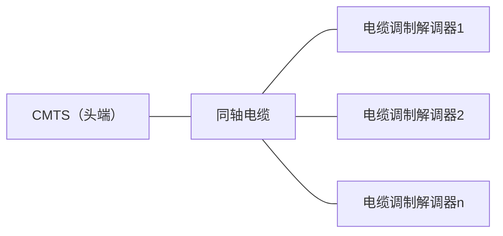

# 6.3 链路层：多路访问协议

> 本节是《计算机网络：自顶向下方法》6.3 节的学习笔记。多个节点共享一条广播信道时，需要一套规则协调谁在何时发送，这就是多路访问控制（MAC）协议。本节按三类思路展开：信道划分（TDMA/FDMA/CDMA）、随机访问（ALOHA、CSMA 系列）、轮流（轮询、令牌），其中 CSMA/CD 是以太网的核心。

## 目录

1. [多路访问问题](#多路访问问题)
2. [信道划分MAC协议](#信道划分mac协议)
3. [随机访问MAC协议](#随机访问mac协议)
4. [轮流MAC协议](#轮流mac协议)
5. [电缆接入网DOCSIS](#电缆接入网docsis)
6. [MAC协议性能比较](#mac协议性能比较)

---

## 多路访问问题

**广播链路**：多个节点共享同一物理介质，任一节点发送的信号能被所有其他节点收到。点到点链路只连两个节点，不存在介质争用；广播链路则要解决"多个节点同时想发"的问题。



**冲突（collision）**：两个或多个节点同时发送时，信号在介质上相互叠加，接收方无法正确解码，所有相关传输都失败。冲突浪费了发送时间，是广播链路的主要开销来源。

MAC 协议要做的就是协调对信道的访问。一个理想协议在带宽 R 的信道上应满足：

1. 只有一个节点发送时，该节点独占速率 R
2. 有 M 个节点发送时，每个平均获得 R/M
3. 分布式：无需中央节点协调，也无需时钟同步
4. 简单、低成本

三类设计思路各自侧重不同目标：信道划分追求无冲突，随机访问追求轻载高效，轮流则在两者间折中。

---

## 信道划分MAC协议

把信道按时间、频率或编码静态划分给各节点，从根本上避免冲突。



### 时分多路访问TDMA

把时间分成固定长度的时间片（slot），每个节点轮流在分配给自己的时间片内独占整个信道。N 个节点就把时间分成 N 份循环使用。

```
时间轴 →
┌────┬────┬────┬────┬────┬────┬────┬────┐
│节点1│节点2│节点3│节点4│节点1│节点2│节点3│节点4│
└────┴────┴────┴────┴────┴────┴────┴────┘
   一个周期(N=4)        下一个周期
```

- 优点：无冲突，公平，延迟有上界
- 缺点：节点没数据时其时间片被浪费；每个节点的速率上限只有 R/N，即使其他节点空闲
- 应用：GSM、卫星通信

### 频分多路访问FDMA

把信道总带宽分成 N 个子频段，每个节点固定占用一个频段，可持续发送。相邻频段间留**保护频带**防干扰。

```
频率 →
┌──────┬──────┬──────┬──────┐
│ 频段1 │ 频段2 │ 频段3 │ 频段4 │   各频段间有保护频带
└──────┴──────┴──────┴──────┘
 节点1  节点2  节点3  节点4
```

- 优点：无需时间同步，可持续传输
- 缺点：与 TDMA 同样的问题——频段空闲时带宽被浪费，单节点速率上限 R/N
- 应用：传统电话、FM 广播

注：TDMA 按时间切、FDMA 按频率切，本质都是把资源静态分给固定节点，因此轻载时利用率都不高。

### 码分多路访问CDMA

给每个节点分配一个唯一的码片序列（chip sequence），各节点可同时占用整个频段、同时发送，接收方靠码片序列把目标节点的信号从叠加信号中分离出来。

编码原理：

```
节点A码片: (-1, -1, +1, +1)
节点B码片: (-1, +1, -1, +1)

发送比特 1：发送原码片序列
发送比特 0：发送码片序列取反
```

各节点信号在信道上叠加。接收方将收到的叠加信号与目标节点码片做内积并归一化，即可还原该节点发送的比特（码片序列相互正交，其他节点的贡献相互抵消）。

- 优点：多节点同时全速发送，抗干扰、保密性好
- 缺点：实现复杂，对功率控制要求高
- 应用：3G（如 CDMA2000、WCDMA）、卫星通信

---

## 随机访问MAC协议

随机访问不预先分配信道：节点想发就发，发生冲突后各自随机等待一段时间再重发。轻载时几乎能独占信道，是局域网的主流思路。

### 纯ALOHA协议

最早的随机访问协议（夏威夷大学，1970s）：节点一有帧就立即发送，不侦听、不分时隙。冲突后随机退避一段时间再重发。

由于发送不对齐时隙边界，只要某帧的发送时间与当前帧有**任何重叠**就会冲突。设帧传输时间为 T，则某帧 $t_0$ 开始发送，凡是在 $[t_0-T,\ t_0+T]$ 这段长为 **2T** 的窗口内开始的其他帧都会与它冲突。

```
        ←─── 2T 易冲突窗口 ───→
   ──────┬──────────┬──────────┬──────
         │  其他帧A  │  本帧 t0  │
         └──────────┴──────────┘
       只要落在 2T 窗口内即冲突
```

最大吞吐量 $\frac{1}{2e}\approx 18.4\%$。

### 时隙ALOHA协议

在纯 ALOHA 上加时间同步：把时间切成等长时隙（一个时隙 = 一帧传输时间 T），节点只能在时隙开始时发送。这样要么两帧落在同一时隙完全冲突，要么完全错开，易冲突窗口从 2T 缩短到 **T**。

```
时隙:   |  1  |  2  |  3  |  4  |  5  |
节点A:  | 成功 |     |冲突 |     | 重传 |
节点B:  |     |     |冲突 | 重传 |     |
                    ↑同一时隙两帧→都失败
```

最大吞吐量 $\frac{1}{e}\approx 36.8\%$，是纯 ALOHA 的两倍——代价是需要全网时钟同步。

易混：两个最大效率不要记反。**纯 ALOHA 1/(2e)≈18.4%，时隙 ALOHA 1/e≈36.8%**；时隙版把易冲突窗口减半，效率正好翻倍。

| 协议 | 时钟同步 | 易冲突窗口 | 最大吞吐量 |
|------|---------|-----------|-----------|
| 纯 ALOHA | 不需要 | 2T | $1/(2e)\approx 18.4\%$ |
| 时隙 ALOHA | 需要 | T | $1/e\approx 36.8\%$ |

### CSMA协议族

ALOHA 不管信道是否空闲就发，冲突多。**载波侦听多路访问（CSMA）**在发送前先侦听信道，空闲才发，忙则等待——"先听后说"。

但侦听不能完全消除冲突：信号传播需要时间，A 刚开始发送、信号还没传到 B 时，B 侦听到的是空闲，于是也开始发送，两者就冲突了。**传播延迟越大，冲突可能性越高。**



按"侦听到信道忙时怎么办"，CSMA 分三种坚持策略：

- **1-坚持 CSMA**：持续侦听，一旦空闲立即（以概率 1）发送。响应快，但多个等待节点会同时抢发，冲突概率高。（以太网采用）
- **非坚持 CSMA**：发现忙就放弃侦听，随机等一段时间后再重新侦听。冲突少，但信道可能空闲了也没人马上用，利用率偏低。
- **p-坚持 CSMA**：用于时隙信道，侦听到空闲时以概率 p 发送、以概率 1−p 推迟到下一时隙。通过调 p 在冲突与延迟间折中。

### CSMA/CD协议

**带冲突检测的 CSMA（CSMA/CD）**在 CSMA 基础上增加一条：发送的同时持续检测信道，一旦发现冲突就**立即停止发送**，不再把已经撞坏的帧发完——这样省下被浪费的传输时间。以太网用的就是 CSMA/CD。

工作流程：



关键技术要素：

1. **冲突检测**：发送方边发边把介质上的信号与自己发出的比较，不一致即说明发生冲突。这在有线介质上容易实现，但无线介质上发送信号会淹没接收信号（近强远弱），很难做到，所以无线网络改用 CSMA/CA（冲突避免）。

2. **最小帧长**：发送方必须在帧发完之前就检测到冲突，否则它会误以为发送成功。最坏情况是冲突发生在最远端、冲突信号再传回来，耗时一个往返（$2t_{prop}$）。因此帧传输时间必须 ≥ $2t_{prop}$，即

   $$L_{min} \ge 2 \times t_{prop} \times R$$

   10Mbps 以太网由此规定最小帧长 64 字节（512 比特）。

3. **二进制指数退避**：见下文专节。

易混：**CSMA/CD 用于有线（以太网），CSMA/CA 用于无线（WiFi）**。有线能检测冲突所以"撞了就停"；无线检测不了冲突，只能事先尽量"避免"冲突。

#### CSMA/CD效率分析

以太网信道效率（轻负载下的近似公式）：

$$\text{效率} = \frac{1}{1 + 5\,t_{prop}/t_{trans}}$$

其中 $t_{prop}$ 为端到端最大传播延迟，$t_{trans}$ 为帧传输时间。

由公式可知：
- $t_{prop}\to 0$（网络跨度极小）时效率 → 1
- $t_{trans}\to\infty$（帧很长）时效率 → 1
- 即**网络越短、帧越长，效率越高**；反之传播延迟占比大则效率低

#### 例题1：效率计算

> 某以太网长 2km，信号传播速度 $2\times 10^8$ m/s，数据率 10Mbps，帧长 1000 字节。求信道效率。

传播延迟：
$$t_{prop} = \frac{2000}{2\times 10^8} = 10^{-5}\text{ s} = 10\,\mu s$$

帧传输时间：
$$t_{trans} = \frac{1000\times 8}{10\times 10^6} = 8\times 10^{-4}\text{ s} = 800\,\mu s$$

效率：
$$\text{效率} = \frac{1}{1 + 5\times \frac{10}{800}} = \frac{1}{1.0625} \approx 94.1\%$$

#### 例题2：最小帧长

> 以太网长 5km，传播速度 $2\times 10^8$ m/s，数据率 100Mbps。求最小帧长。

为在帧发完前检测到冲突，帧传输时间须 ≥ 一个往返时间：
$$2t_{prop} = 2\times \frac{5000}{2\times 10^8} = 5\times 10^{-5}\text{ s} = 50\,\mu s$$

$$L_{min} = 2t_{prop}\times R = 50\times 10^{-6}\times 100\times 10^6 = 5000\text{ 比特} = 625\text{ 字节}$$

#### 例题3：由效率反求帧长

> 某 CSMA/CD 网络，传播延迟 10μs，帧传输时间 40μs。求：(1) 信道利用率；(2) 若要利用率达 90% 以上，帧长至少为多少（数据率 10Mbps）。

(1) 当前利用率：
$$\text{效率} = \frac{1}{1 + 5\times \frac{10}{40}} = \frac{1}{2.25} \approx 44.4\%$$

(2) 设新帧传输时间 $t'$，令效率 = 0.9：
$$0.9 = \frac{1}{1 + 5\times \frac{10}{t'}} \;\Rightarrow\; 1 + \frac{50}{t'} = \frac{1}{0.9} \;\Rightarrow\; t' = \frac{50}{1/0.9 - 1} = 450\,\mu s$$

$$L_{min} = t'\times R = 450\times 10^{-6}\times 10\times 10^6 = 4500\text{ 比特} = 562.5\text{ 字节} \to 563\text{ 字节}$$

### 二进制指数退避算法

**二进制指数退避（Binary Exponential Backoff, BEB）**决定冲突后等多久再重发：冲突越多，退避范围指数级扩大，从而在轻载时快速恢复、重载时自动分散重发以降低再次冲突的概率。

设第 $n$ 次冲突，取 $k=\min(n,10)$，从 $\{0,1,\dots,2^{k}-1\}$ 中**随机**取整数 $r$，退避时间为

$$T_{backoff} = r \times 2\tau$$

其中 $2\tau$ 是争用期（一个端到端往返时间），10Mbps 以太网为 $51.2\,\mu s$（512 比特时间）。等待 $T_{backoff}$ 后重新侦听并尝试发送。

退避范围随冲突次数指数增长：

```
第1次冲突  k=1  r∈{0,1}          范围 0~1
第2次冲突  k=2  r∈{0,...,3}      范围 0~3
第3次冲突  k=3  r∈{0,...,7}      范围 0~7
 ...                            （范围每次翻倍）
第10次起   k=10 r∈{0,...,1023}   范围封顶 0~1023
第16次冲突       放弃该帧，报告上层
```

注：$k$ 在第 10 次冲突后封顶（范围最大 0~1023），但**重传最多 16 次**，超过即丢弃并报错——两个上限（10 和 16）不要混淆。

| 冲突次数 $n$ | $k$ | 退避范围 $\{0,\dots,2^k-1\}$ |
|:---:|:---:|:---:|
| 1 | 1 | 0~1 |
| 2 | 2 | 0~3 |
| 3 | 3 | 0~7 |
| 4 | 4 | 0~15 |
| 5 | 5 | 0~31 |
| 10 | 10 | 0~1023 |
| 11~15 | 10 | 0~1023 |
| 16 | — | 放弃 |

#### 例题：退避时间范围

> 某站点连续 3 次冲突，$2\tau = 51.2\,\mu s$。求第 3 次冲突后的退避时间范围与平均退避时间。

第 3 次冲突 $k=3$，$r\in\{0,1,\dots,7\}$：
- 范围：$0 \sim 7\times 51.2 = 0\sim 358.4\,\mu s$
- 平均：$\dfrac{0+1+\dots+7}{8}\times 51.2 = \dfrac{28}{8}\times 51.2 = 179.2\,\mu s$

BEB 的局限：先成功的站点下次冲突计数被清零、退避范围小，反而更容易抢到信道（**捕获效应**），对长期退避的站点不公平；且退避时延不确定，不适合实时业务。

---

## 轮流MAC协议

轮流协议兼顾信道划分的"无冲突"与随机访问的"按需分配"：节点轮流取得发送权，但只有真正有数据的节点才占用信道。

### 轮询协议

指定一个**主节点**，由它依次邀请（轮询）各从节点发送。被轮询的节点有数据就发，没有就回应"无数据"，主节点接着轮询下一个。



- 优点：无冲突，可按需分配，支持优先级
- 缺点：轮询本身有开销和延迟；主节点是单点故障
- 应用：蓝牙 piconet 等集中控制场景

### 令牌传递协议

无主节点。一个特殊的**令牌**帧在节点间按固定顺序循环传递，只有持有令牌的节点才能发送数据，发完（或到达持有时限）后把令牌交给下一个节点。



- 优点：分布式、无冲突、公平（轮流持有）
- 缺点：令牌丢失或持有节点故障会使全网瘫痪，需要恢复机制
- 应用：令牌环、FDDI

### 三类协议对比

| 协议 | 延迟（轻载） | 吞吐量（重载） | 公平性 | 适用场景 |
|------|:---:|:---:|:---:|------|
| 轮询 | 较高 | 中等 | 可控 | 集中管理 |
| 令牌传递 | 中等 | 高 | 好 | 高可靠局域网 |
| CSMA/CD | 低 | 中等偏低 | 相对公平 | 通用局域网 |

---

## 电缆接入网DOCSIS

**DOCSIS（数据电缆服务接口规范）**让有线电视的同轴电缆网络兼做宽带接入。它综合运用了 FDM、TDM 与随机访问，是多种 MAC 思路结合的一个实例。



**频分双工**：上下行用不同频段，互不干扰（FDM）。
- 下行（CMTS → 各 CM）：高频段，约 54–750MHz
- 上行（各 CM → CMTS）：低频段，约 5–42MHz

**下行**只有 CMTS 一个发送方，无需竞争：CMTS 广播，各 CM 取出属于自己的数据（TDM 共享）。

**上行**有多个 CM 竞争，是真正的多路访问问题。CMTS 把上行划分为时间小段（minislot），CM 在 CMTS 分配的时隙里发送；申请发送权的请求帧采用类似时隙 ALOHA 的方式竞争，可能冲突，由 CMTS 集中调度解决。

---

## MAC协议性能比较

三类协议各有适用负载区间：

- **随机访问（CSMA/CD）**：轻载时延迟极低、几乎独占信道；重载时冲突增多、效率下降。适合突发流量的通用局域网。
- **信道划分（TDMA/FDMA）**：负载无关、延迟稳定有上界，但轻载时大量资源闲置。适合流量稳定、要求可预测延迟的场景。
- **轮流（令牌/轮询）**：折中——重载时接近信道划分的高吞吐，又能按需分配；代价是协议复杂、有单点故障风险。

| 协议 | 轻载延迟 | 重载吞吐 | 延迟稳定性 |
|------|:---:|:---:|:---:|
| CSMA/CD | 很低 | 偏低（冲突） | 差 |
| TDMA / FDMA | 中等 | 稳定 | 好 |
| 令牌 / 轮询 | 中等偏高 | 高 | 好 |

无线网络无法可靠检测冲突，因此不用 CSMA/CD，而用 **CSMA/CA**（冲突避免）：发送前侦听，并辅以 RTS/CTS 握手等机制尽量避开冲突（详见 WiFi 一节）。

---

下一节：[6.4 链路层：交换局域网](6.4链路层：交换局域网.md)，讨论以太网帧格式、交换机的自学习与转发。
