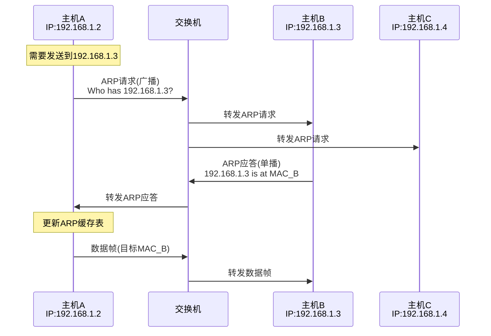
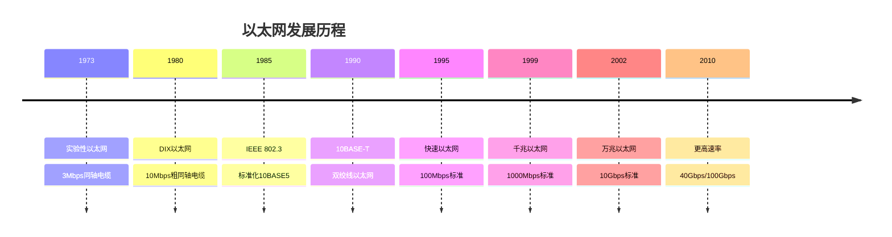
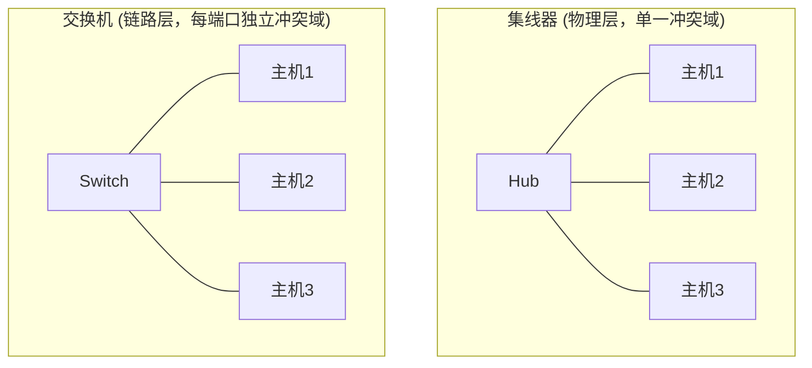
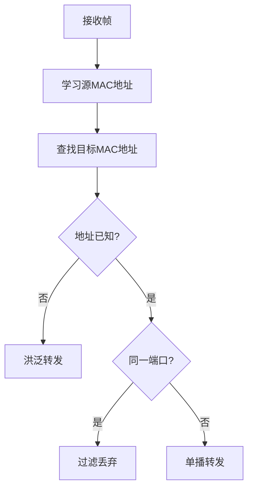
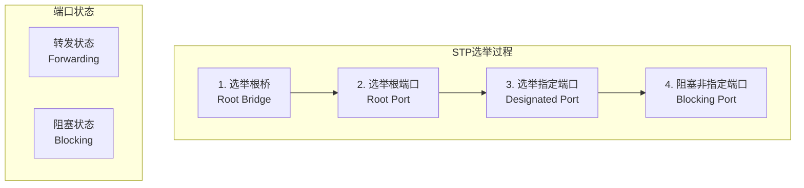
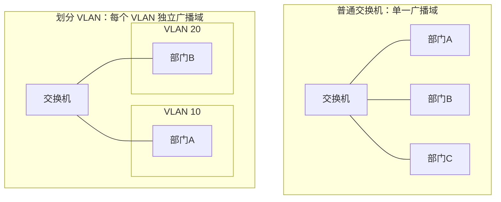
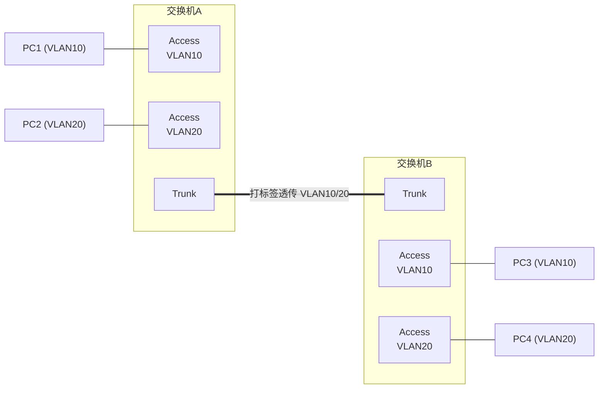
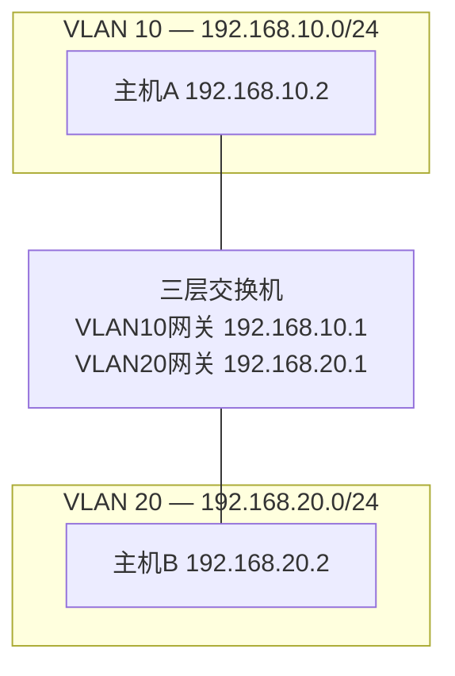

# 6.4 链路层：交换局域网

## 目录

1. [链路层寻址和ARP](#链路层寻址和arp)
2. [以太网技术详解](#以太网技术详解)
3. [链路层交换机](#链路层交换机)
4. [虚拟局域网VLAN](#虚拟局域网vlan)
5. [现代以太网发展](#现代以太网发展)

---

## 链路层寻址和ARP

### MAC地址基本概念

> **MAC地址 (Media Access Control Address)**
> 
> 网络适配器的链路层标识符，48位（6字节），用于在同一链路上唯一标识一个网络接口。也称物理地址、硬件地址。

#### MAC地址格式

地址写作 6 组十六进制数，如 `00:1B:44:11:3A:B7`。48 位分为两部分：前 24 位由 IEEE 分配给厂商（OUI），后 24 位由厂商自行分配给设备。

```
     第1字节                         48位 = 6字节
┌──────────────────┐
│ b7 b6 ... b1 b0  │   00:1B:44 : 11:3A:B7
│        │   │  │  │   └──┬───┘   └──┬───┘
│        │   │  └─ I/G   OUI(前24位)  设备标识(后24位)
│        │   └──── U/L   厂商唯一      厂商分配
│        ...
└──────────────────┘

I/G (最低位): 0=单播  1=组播/广播
U/L (次低位): 0=全局唯一(IEEE分配)  1=本地管理
```

注：I/G 与 U/L 是第一字节的最低两位，传输时字节内低位先发。

#### 地址类型

- **单播**：第一字节最低位（I/G）为 0，标识单个接口。
- **组播**：第一字节最低位为 1，标识一组接口。
- **广播**：`FF:FF:FF:FF:FF:FF`，链路上所有接口都接收。

> 易混：广播地址 `FF:FF:FF:FF:FF:FF` 全 1，其第一字节最低位也是 1，因此广播是组播的特例。

### ARP协议原理

> **地址解析协议 (Address Resolution Protocol, ARP)**
> 
> 在同一局域网内，将网络层 IP 地址解析为链路层 MAC 地址。

ARP 只在一个广播域内工作。主机发送前先查本机 ARP 缓存：

- **目标在同一网段**：解析目标主机的 IP→MAC，直接封装发往目标。
- **目标在不同网段**：解析默认网关的 IP→MAC，封装后发往网关 MAC（目的 IP 仍是最终目标）。

> 易混：ARP 解析的是"下一跳"的 MAC，不是最终目标的 MAC。跨网段时下一跳是网关，所以数据帧的目的 MAC 是网关 MAC，而目的 IP 不变。

#### ARP工作机制（同网段）



#### ARP报文格式

**ARP报文的标准格式 (28字节固定长度)**：

```
 0                   1                   2                   3
 0 1 2 3 4 5 6 7 8 9 0 1 2 3 4 5 6 7 8 9 0 1 2 3 4 5 6 7 8 9 0 1
┌───────────────────────────────┬───────────────────────────────┐
│ 硬件类型 (16位)                │ 协议类型 (16位)                │
│ Hardware Type                 │ Protocol Type                 │
│ 1=以太网, 6=IEEE802网络       │ 0x0800=IPv4, 0x0806=ARP      │
├───────────────┬───────────────┼───────────────────────────────┤
│硬件地址长度    │协议地址长度    │ 操作码 (16位)                  │
│(8位)          │(8位)          │ Operation Code                │
│6=以太网MAC长度 │4=IPv4地址长度  │ 1=ARP请求, 2=ARP应答          │
├───────────────┴───────────────┴───────────────────────────────┤
│ 发送方硬件地址 (48位，6字节) - Sender Hardware Address        │
│ 发送方的MAC地址                                               │
├───────────────────────────────────────────────────────────────┤
│ 发送方协议地址 (32位，4字节) - Sender Protocol Address        │
│ 发送方的IP地址                                                │
├───────────────────────────────────────────────────────────────┤
│ 目标硬件地址 (48位，6字节) - Target Hardware Address          │
│ 目标的MAC地址（ARP请求时为全0）                                │
├───────────────────────────────────────────────────────────────┤
│ 目标协议地址 (32位，4字节) - Target Protocol Address          │
│ 目标的IP地址                                                  │
└───────────────────────────────────────────────────────────────┘
```

关键字段：

- **操作码**：1 = 请求，2 = 应答。
- **目标硬件地址**：请求时填全 0（正是要查的内容），应答时填入被查到的 MAC。
- 硬件/协议地址长度（6、4）使 ARP 不限于以太网+IPv4，可适配其他链路与网络层协议。

### ARP缓存管理

#### ARP表结构

| IP地址 | MAC地址 | 类型 | 生存时间 |
|--------|---------|------|----------|
| 192.168.1.1 | 00:1B:44:11:3A:B7 | 动态 | 120秒 |
| 192.168.1.3 | 00:22:19:5B:2C:8F | 动态 | 180秒 |
| 192.168.1.10 | 00:15:5D:00:04:02 | 静态 | 永久 |

**缓存管理策略**：
- **动态条目**：通过ARP学习，有生存时间
- **静态条目**：手动配置，永久有效
- **老化机制**：定期清除过期条目

#### 免费ARP

> **免费ARP (Gratuitous ARP)**
> 
> 主机发送以自己 IP 为目标的 ARP 请求（或应答），用途：
> - 检测 IP 地址冲突：若收到应答说明该 IP 已被占用。
> - 更新其他主机缓存：接口启动或 MAC 变化时主动通告。

---

## 以太网技术详解

### 以太网发展历程

#### 以太网标准演进



#### 技术演进的四条主线

| 维度 | 早期 | 现代 |
|------|------|------|
| 介质 | 同轴电缆 | 双绞线、光纤 |
| 速率 | 10 Mbps | 最高 400 Gbps |
| 拓扑 | 总线型（共享） | 星型（交换） |
| 双工 | 半双工（CSMA/CD） | 全双工（无冲突） |

注：交换式全双工以太网中每个端口独占链路、收发分离，不再发生冲突，CSMA/CD 已无用武之地。

### 以太网帧格式

#### 标准以太网帧

以太网帧各字段及其长度（字节）：

```
┌──────────┬─────┬──────────┬──────────┬──────┬─────────────┬──────┐
│  前导码  │ SFD │ 目的MAC  │  源MAC   │ 类型 │    数据     │ FCS  │
│ Preamble │     │  Dest    │  Source  │ Type │  Payload    │ CRC  │
├──────────┼─────┼──────────┼──────────┼──────┼─────────────┼──────┤
│    7     │  1  │    6     │    6     │  2   │   46~1500   │  4   │
└──────────┴─────┴──────────┴──────────┴──────┴─────────────┴──────┘
└──── 物理层添加 ───┘└──────────────── 帧 = 64~1518 字节 ──────────┘

前导码 10101010 ×7，SFD 10101011：供接收方时钟同步并定界帧起始，
                              由物理层产生，不计入帧长。
```

**字段说明**：

| 字段 | 长度 | 说明 |
|------|------|------|
| 目的 MAC | 6 字节 | 单播 / 组播 / 广播 |
| 源 MAC | 6 字节 | 始终是单播地址 |
| 类型/长度 | 2 字节 | ≥1536(0x0600) 为类型，≤1500 为数据长度 |
| 数据 | 46~1500 字节 | 不足 46 字节用 0 填充 |
| FCS | 4 字节 | CRC-32，覆盖目的 MAC 到数据字段 |

常见类型值：`0x0800` IPv4、`0x0806` ARP、`0x86DD` IPv6、`0x8100` 802.1Q VLAN 标签。

**帧长度**：

- 最小帧 **64 字节**（不含前导码和 SFD）。数据不足 46 字节时填充，以保证最小帧长——这是 CSMA/CD 正确检测冲突的下限。
- 最大帧 **1518 字节**（数据 1500 即 MTU）；带一个 802.1Q 标签时为 1522 字节。
- 巨型帧（Jumbo Frame）可达约 9000 字节，非 IEEE 标准。

> 注：FCS 仅做差错检测，发现错误即丢弃，不纠错；前导码和 SFD 不在 CRC 校验范围内。

---

## 链路层交换机

### 交换机基本原理

> **以太网交换机 (Switch)**
> 
> 工作在数据链路层的设备，依据 MAC 地址表对帧进行存储转发。每个端口是独立的冲突域，但所有端口默认同属一个广播域。

#### 交换机 vs 集线器

集线器（Hub）工作在物理层，把收到的比特原样广播到所有其他端口，所有主机共享带宽、同处一个冲突域，只能半双工。交换机按帧的目的 MAC 选择性转发，每端口独立冲突域、可全双工、带宽独享。



> 易混：交换机隔离冲突域，不隔离广播域——广播帧仍会洪泛到（同一 VLAN 的）所有端口。要隔离广播域需用 VLAN 或路由器。

### 交换机工作机制

#### 帧处理过程



**自学习与转发决策**：

1. **学习**：收到帧时，把"源 MAC → 入端口"记入地址表（并刷新时间戳）。表项靠这种被动学习自动建立，无需配置。
2. **查表转发**，按目的 MAC 分情况：
   - **目的在表中，且出端口 ≠ 入端口**：仅向该端口单播转发（过滤其余端口）。
   - **目的在表中，且出端口 = 入端口**：丢弃。源与目的在同一段上，转发无意义。
   - **目的不在表中（未知单播）**：洪泛到除入端口外的所有端口。
   - **广播 / 组播**：洪泛到除入端口外的所有端口。

#### 交换表（MAC地址表）

每条表项记录"MAC 地址 → 端口"映射，附时间戳用于老化：

```
┌────────────────────┬─────────┬───────────┬─────────┐
│ MAC 地址           │ 端口    │ 时间戳    │ 类型    │
├────────────────────┼─────────┼───────────┼─────────┤
│ 00:1A:2B:3C:4D:5E  │ Port-1  │ 15:30:25  │ 动态    │
│ 00:2B:3C:4D:5E:6F  │ Port-3  │ 15:32:10  │ 动态    │
│ 00:15:5D:00:04:02  │ Port-4  │ —         │ 静态    │
└────────────────────┴─────────┴───────────┴─────────┘
```

**老化机制**：每当交换机再次收到以某 MAC 为源的帧，就刷新对应表项的时间戳；超过老化时间（典型 300 秒）未刷新则删除该项。这样主机迁移端口后旧表项会过期，在新端口发一帧即被重新学习。静态表项手工配置，不老化。

### 交换机性能特性

#### 关键性能指标

| 指标 | 说明 | 典型值 | 计算方法 |
|-----|------|-------|---------|
| 交换容量 | 各端口同时通信的总带宽 | 48Gbps | 端口数×端口速率×2 |
| 包转发率 | 每秒处理的数据包数量 | 35.7Mpps | 线速转发能力 |
| MAC地址表容量 | 支持的地址条目数量 | 8192条 | 硬件限制 |
| 缓冲区大小 | 数据包缓存容量 | 4MB | 突发流量处理 |
| 端口密度 | 单设备端口数量 | 24/48口 | 连接能力 |
| 背板带宽 | 内部总线带宽 | 96Gbps | 无阻塞转发 |

**性能计算示例**：

> **例题**：某24口千兆以太网交换机，求理论交换容量和线速包转发率。

**解答**：

1. **交换容量**：
   - 全双工模式下每端口需要上下行各1Gbps
   - 交换容量 = 24端口 × 1Gbps × 2 = 48Gbps

2. **包转发率**（按最小帧计算线速）：
   - 每个最小帧在线路上占用 = 最小帧 64 + 前导码与 SFD 8 + 帧间隙 12 = 84 字节
   - 单端口线速 = $\dfrac{1 \times 10^9}{84 \times 8}$ ≈ 1.488 Mpps
   - 总转发率 = 1.488 × 24 ≈ 35.7 Mpps

#### 交换方式对比

| 交换方式 | 转发时机 | 延迟 | 错误处理 | 适用场景 |
|---------|---------|-----|---------|---------|
| 存储转发 | 接收完整帧后 | 高(>100μs) | 可检测错误 | 高可靠性要求 |
| 直通交换 | 读取目标地址后 | 低(10-15μs) | 无法检错 | 低延迟要求 |
| 无碎片交换 | 接收64字节后 | 中等(30-40μs) | 过滤碎片帧 | 平衡方案 |
| 自适应切换 | 根据错误率动态 | 可变 | 智能切换 | 现代交换机 |

**转发延迟对比**：

存储转发要收完整帧才转发，引入的串行化延迟正比于帧长 $L$：

$$T_{sf} = \frac{L}{R} + T_{proc}$$

直通交换读到目的 MAC（帧的前 6 字节）即开始转发，串行化延迟与帧长无关：

$$T_{ct} = \frac{6 \times 8}{R} + T_{proc}$$

其中 $R$ 为端口速率，$T_{proc}$ 为处理时间。以 1518 字节帧、1 Gbps 端口为例（暂不计 $T_{proc}$）：

- 存储转发：$\dfrac{1518 \times 8}{10^9} ≈ 12.1\ \mu s$
- 直通交换：$\dfrac{6 \times 8}{10^9} ≈ 0.05\ \mu s$

帧越长，两者差距越大；代价是直通交换在转发后才可能发现 FCS 错误，无法拦截坏帧。

### 生成树协议（STP）

#### STP基本概念

> **生成树协议（Spanning Tree Protocol, STP）**
> 
> 用于在具有冗余链路的交换网络中消除环路，通过阻塞某些端口来构建无环的树形拓扑。

#### 网络环路问题

交换网络为可靠性常设冗余链路，但二层没有 IP 那样的 TTL，环路上的帧不会自然消亡，会引发：

- **广播风暴**：广播帧在环中无限循环并被不断复制，迅速耗尽带宽，使网络瘫痪。
- **MAC 表抖动**：同一源 MAC 从不同端口反复出现，地址表频繁翻动，转发决策错乱。
- **重复帧**：目的主机收到同一帧的多个副本。

STP 通过有选择地阻塞部分端口，把带环的物理拓扑裁剪成一棵无环的转发树，从而既保留冗余链路（故障时再启用），又避免环路。

#### STP工作原理

**STP构建过程**：



**STP选举规则**：

1. **根桥选举**：
   - 选择桥ID（优先级+MAC地址）最小的交换机
   - 默认优先级32768
   - 可手动配置优先级

2. **根端口选举**（每个非根桥选一个）：
   - 到根桥路径开销最小的端口
   - 路径开销相同时比较对端桥ID
   - 对端桥ID相同时比较对端端口ID

3. **指定端口选举**（每个网段选一个）：
   - 到根桥路径开销最小的端口
   - 根桥的所有端口都是指定端口

**端口开销表**：

| 链路速度 | STP开销(IEEE 802.1D) | RSTP开销(IEEE 802.1w) |
|---------|-------------------|---------------------|
| 10 Mbps | 100 | 2,000,000 |
| 100 Mbps | 19 | 200,000 |
| 1 Gbps | 4 | 20,000 |
| 10 Gbps | 2 | 2,000 |
| 100 Gbps | 1 | 200 |

#### STP计算示例

> **例题**：有3台交换机SW1、SW2、SW3，桥ID分别为8000.0001、8000.0002、8000.0003，链路开销如下图。确定根桥、各交换机的根端口和被阻塞的端口。

```
      SW1
     /   \
   19    19
   /      \
 SW2------SW3
      4
```

**解答**：

**步骤1**：选举根桥
- SW1桥ID最小(8000.0001)
- **SW1为根桥**

**步骤2**：确定根端口
- SW2到SW1开销：19（直连）→ **SW2根端口：连SW1的端口**
- SW3到SW1开销：19（直连）→ **SW3根端口：连SW1的端口**

**步骤3**：确定指定端口
- SW1的所有端口都是指定端口
- SW2-SW3链路：
  - SW2到根桥开销19 + 链路开销4 = 23
  - SW3到根桥开销19 + 链路开销4 = 23
  - 开销相同，比较桥ID，SW2桥ID小
  - **SW2连SW3的端口为指定端口**
  - **SW3连SW2的端口被阻塞**

#### 快速生成树协议（RSTP）

**RSTP改进**：

| 特性 | STP | RSTP |
|-----|-----|------|
| 收敛时间 | 30-50秒 | <6秒 |
| 端口状态 | 5种状态 | 3种状态 |
| 端口角色 | 根/指定/阻塞 | 根/指定/替代/备份 |
| 链路类型 | 无区分 | 点到点/共享 |
| BPDU处理 | 根桥产生 | 所有桥产生 |

RSTP 加快收敛的关键在于：边缘端口（直连终端）跳过监听/学习直接转发；点到点链路用提议-同意（Proposal/Agreement）握手即时确定端口角色，无需像 STP 那样固定等待计时器。

---

## 虚拟局域网VLAN

### VLAN基本概念

> **虚拟局域网 (Virtual LAN, VLAN)**
> 
> 在一台（或多台）物理交换机上，用软件配置把端口划分到不同的逻辑组，每个组是一个独立的广播域。

一台普通交换机的所有端口同属一个广播域，广播帧波及全网。划分 VLAN 后，广播被限制在本 VLAN 内，不同 VLAN 之间在二层互相隔离，相当于把一台物理交换机分成若干台逻辑交换机。



**VLAN 的作用**：
- 缩小广播域，抑制广播流量。
- 二层隔离不同用户组，提升安全性。
- 分组按软件配置，主机换位置无需改布线。
- 一台物理交换机当多台逻辑交换机用，省设备。

### VLAN实现技术

#### 802.1Q标准

> **IEEE 802.1Q**
> 
> 在以太网帧的源 MAC 与类型字段之间插入 4 字节 VLAN 标签，标识帧所属的 VLAN。插入标签后最大帧长由 1518 增至 1522 字节。

标签插入位置：

```
┌──────────┬─────────┬──────────────────┬──────┬──────┬─────┐
│ 目的MAC  │  源MAC  │ 802.1Q标签(4字节)│ 类型 │ 数据 │ FCS │
└──────────┴─────────┴──────────────────┴──────┴──────┴─────┘
                              ↑ 在这里插入
```

4 字节标签的内部结构：

```
 0                   1                   2                   3
 0 1 2 3 4 5 6 7 8 9 0 1 2 3 4 5 6 7 8 9 0 1 2 3 4 5 6 7 8 9 0 1
┌───────────────────────────────┬───┬───┬───────────────────────┐
│ TPID = 0x8100 (16位)          │PCP│DEI│   VLAN ID (12位)      │
└───────────────────────────────┴───┴───┴───────────────────────┘
                                 └────── TCI (16位) ─────────────┘
```

| 字段 | 位数 | 取值 | 说明 |
|------|------|------|------|
| TPID | 16 | 0x8100 | 固定值，标识这是带 VLAN 标签的帧 |
| PCP | 3 | 0~7 | 优先级，用于 QoS |
| DEI | 1 | 0/1 | 丢弃指示，拥塞时可优先丢弃 |
| VID | 12 | 1~4094 | VLAN 编号，0 和 4095 保留 |

#### 端口类型

| 端口类型 | 连接对象 | 所属 VLAN | 对标签的处理 |
|---------|---------|-----------|-------------|
| Access | 终端设备（PC、服务器） | 单个 VLAN | 入向打标签，出向去标签；终端看不到标签 |
| Trunk | 交换机之间、交换机-路由器 | 多个 VLAN | 透传并保留标签，跨链路区分 VLAN |

跨交换机时，同一 VLAN 的帧经 Trunk 链路传输，靠帧中的 802.1Q 标签在对端还原到正确 VLAN。

> 注：Trunk 上有一个本征 VLAN（Native VLAN），属于它的帧默认不打标签发送；两端本征 VLAN 须一致，否则会串 VLAN。



### VLAN间通信

不同 VLAN 是不同的广播域，二层无法直接互通，必须经过三层（路由）转发：

- **三层交换机（SVI）**：为每个 VLAN 配一个虚接口作网关，路由在硬件中完成，线速转发，是企业网主流做法。
- **单臂路由**：路由器一个物理口划分多个子接口（各对应一个 VLAN）经一条 Trunk 连交换机；配置简单，但所有 VLAN 间流量挤在同一条链路上，是性能瓶颈。

| 方案 | 转发性能 | 适用场景 |
|-----|---------|---------|
| 三层交换机 | 硬件线速 | 企业网络 |
| 单臂路由 | 受单链路带宽限制 | 小型网络 |



**通信流程**（主机 A `192.168.10.2` 访问主机 B `192.168.20.2`）：

1. A 比较目的 IP 与本网段，判断 B 不在同一子网，须经默认网关。
2. A 用 ARP 解析**网关**（`192.168.10.1`）的 MAC。帧的目的 MAC = 网关 MAC，但 IP 数据报的目的 IP 仍是 `192.168.20.2`。
3. 三层交换机收下该帧，剥掉二层封装，按目的 IP 查路由，命中 VLAN20 直连网段。
4. 交换机以网关身份用 ARP 解析 B 的 MAC，重新封装（源 MAC = 网关 MAC，目的 MAC = B 的 MAC），从 VLAN20 送出。

> 易混：跨 VLAN 通信中，源/目的 IP 始终是两端主机，全程不变；而二层目的 MAC 在每一跳都改变——先是网关 MAC，路由后变成目标主机 MAC。这正是"IP 标识端点、MAC 标识下一跳"的体现。

---

## 现代以太网发展

### 高速以太网技术

#### 速率演进

| 标准 | 速率 | 介质 | 距离 | 应用 |
|-----|------|------|------|------|
| 10BASE-T | 10Mbps | 双绞线 | 100m | 传统LAN |
| 100BASE-TX | 100Mbps | 双绞线 | 100m | 快速以太网 |
| 1000BASE-T | 1Gbps | 双绞线 | 100m | 千兆以太网 |
| 10GBASE-T | 10Gbps | 双绞线 | 100m | 万兆以太网 |
| 25GBASE-T | 25Gbps | 双绞线（Cat8） | 30m | 数据中心 |
| 40GBASE-T | 40Gbps | 双绞线（Cat8） | 30m | 数据中心短距 |

注：长距离、超高速场景（如 40G/100G 骨干）一般用光纤标准（如 40GBASE-SR4、100GBASE-LR4），而非双绞线。`-T` 后缀代表双绞线，传输距离随速率上升而急剧缩短。

### 数据中心以太网

数据中心对以太网提出了普通局域网少见的需求：极低且确定的延迟、高密度端口、近乎不丢包。两项有代表性的技术：

- **数据中心桥接（DCB）**：在标准以太网上增加基于优先级的流量控制（PFC）等机制，实现"无损以太网"，避免拥塞丢包。
- **以太网光纤通道（FCoE）**：把存储网络（FC）封装进以太网帧，存储流量与数据流量共用一套网络，简化布线与设备。

---
 
**下一章预告**：[6.5 链路层：链路虚拟化](6.5链路层：链路虚拟化.md) - 学习MPLS等链路虚拟化技术。
