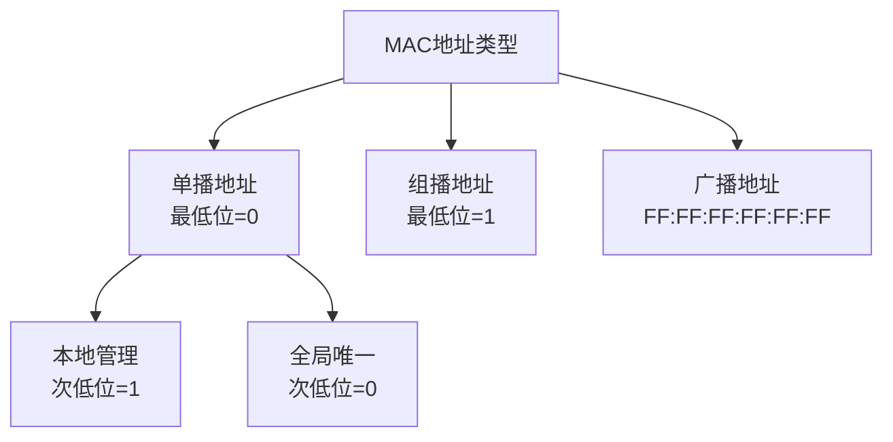
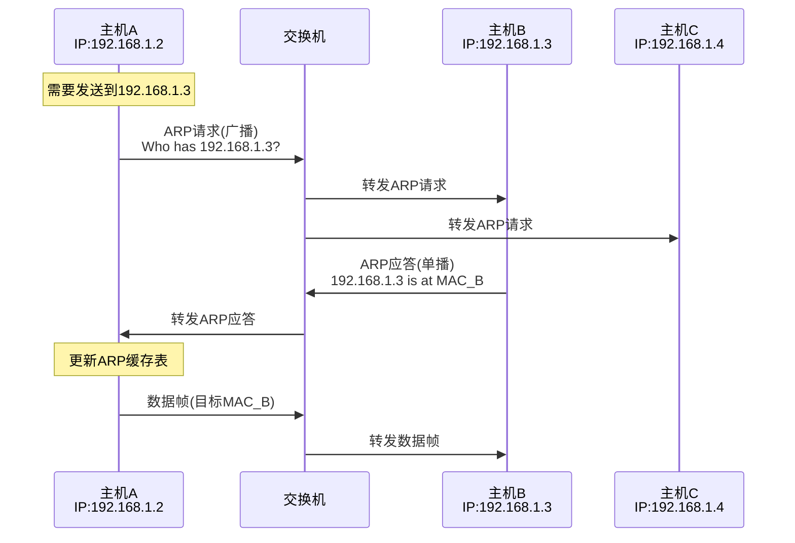
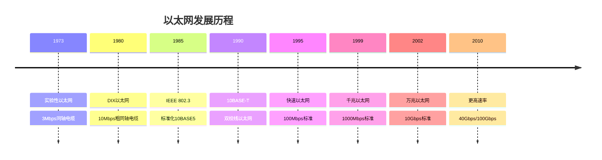
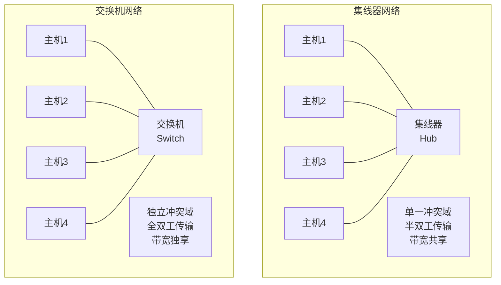
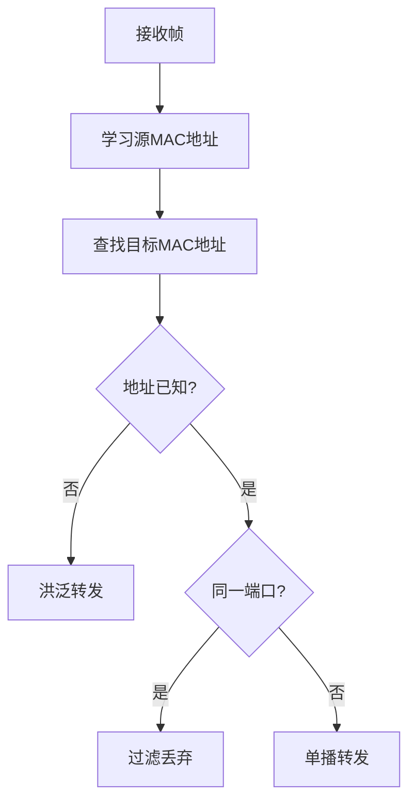
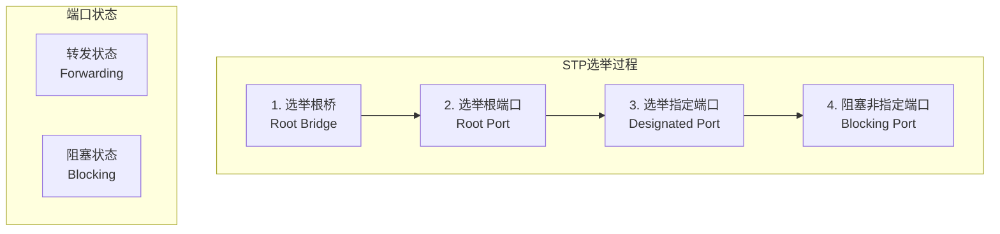
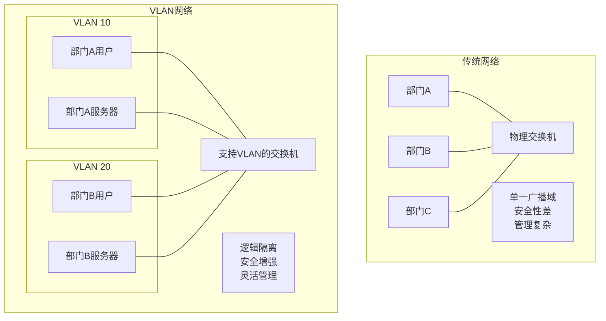
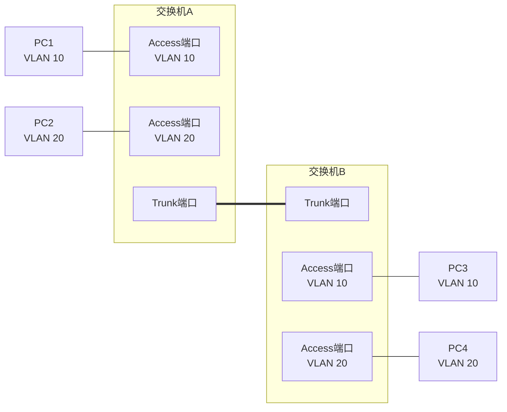
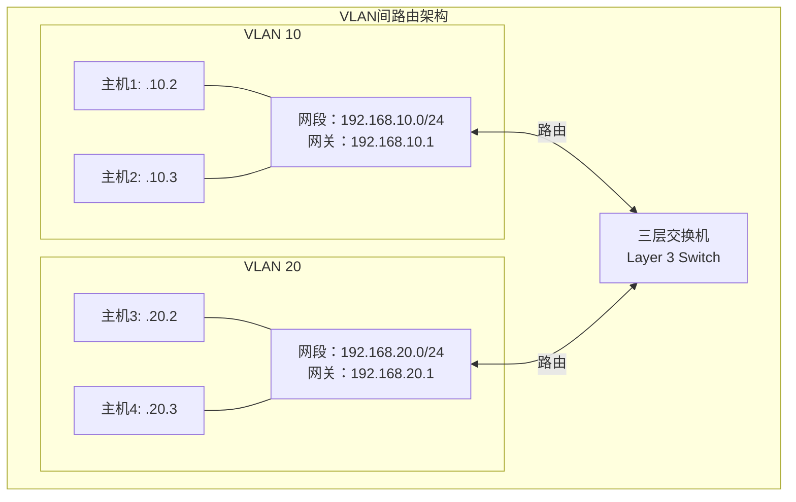

# 6.4 链路层：交换局域网

## 目录

1. [链路层寻址和ARP](#链路层寻址和arp)
2. [以太网技术详解](#以太网技术详解)
3. [链路层交换机](#链路层交换机)
4. [虚拟局域网VLAN](#虚拟局域网vlan)
5. [现代以太网发展](#现代以太网发展)

---

## 链路层寻址和ARP

### MAC地址基本概念

> **MAC地址（物理地址）**
> 
> 网络适配器的唯一标识符，由48位二进制数组成，用于在链路层唯一标识网络接口。

#### MAC地址格式

**地址结构**：
```
MAC地址: 6字节 = 48位
格式: XX:XX:XX:XX:XX:XX (十六进制)
示例: 00:1B:44:11:3A:B7
```

**地址分配**：
- **前24位**：组织唯一标识符（OUI）
- **后24位**：网络接口控制器标识符
- **IEEE负责**：统一分配和管理

#### 地址类型



**特殊地址**：
- **广播地址**：FF:FF:FF:FF:FF:FF
- **组播地址**：第一字节最低位为1
- **零地址**：00:00:00:00:00:00（无效）

### ARP协议原理

> **地址解析协议（ARP）**
> 
> 将网络层IP地址解析为链路层MAC地址的协议，实现网络层到链路层的地址映射。

#### ARP工作机制



#### ARP报文格式

**ARP报文的标准格式 (28字节固定长度)**：

```
 0                   1                   2                   3
 0 1 2 3 4 5 6 7 8 9 0 1 2 3 4 5 6 7 8 9 0 1 2 3 4 5 6 7 8 9 0 1
┌───────────────────────────────┬───────────────────────────────┐
│ 硬件类型 (16位)                │ 协议类型 (16位)                │
│ Hardware Type                 │ Protocol Type                 │
│ 1=以太网, 6=IEEE802网络       │ 0x0800=IPv4, 0x0806=ARP      │
├───────────────┬───────────────┼───────────────────────────────┤
│硬件地址长度    │协议地址长度    │ 操作码 (16位)                  │
│(8位)          │(8位)          │ Operation Code                │
│6=以太网MAC长度 │4=IPv4地址长度  │ 1=ARP请求, 2=ARP应答          │
├───────────────┴───────────────┴───────────────────────────────┤
│ 发送方硬件地址 (48位，6字节) - Sender Hardware Address        │
│ 发送方的MAC地址                                               │
├───────────────────────────────────────────────────────────────┤
│ 发送方协议地址 (32位，4字节) - Sender Protocol Address        │
│ 发送方的IP地址                                                │
├───────────────────────────────────────────────────────────────┤
│ 目标硬件地址 (48位，6字节) - Target Hardware Address          │
│ 目标的MAC地址（ARP请求时为全0）                                │
├───────────────────────────────────────────────────────────────┤
│ 目标协议地址 (32位，4字节) - Target Protocol Address          │
│ 目标的IP地址                                                  │
└───────────────────────────────────────────────────────────────┘
```

**ARP报文字段详解**：

| 字段 | 长度 | 典型值 | 功能说明 |
|------|------|--------|----------|
| **硬件类型** | 16位 | 1 | 指定链路层协议类型（1=以太网） |
| **协议类型** | 16位 | 0x0800 | 指定网络层协议类型（IPv4） |
| **硬件地址长度** | 8位 | 6 | MAC地址长度（以太网为6字节） |
| **协议地址长度** | 8位 | 4 | IP地址长度（IPv4为4字节） |
| **操作码** | 16位 | 1或2 | 1=ARP请求，2=ARP应答 |
| **发送方硬件地址** | 48位 | 实际MAC | 发送ARP报文的主机MAC地址 |
| **发送方协议地址** | 32位 | 实际IP | 发送ARP报文的主机IP地址 |
| **目标硬件地址** | 48位 | 00:00:00:00:00:00 | 请求时为0，应答时填入实际MAC |
| **目标协议地址** | 32位 | 目标IP | 要查询或响应的IP地址 |

### ARP缓存管理

#### ARP表结构

| IP地址 | MAC地址 | 类型 | 生存时间 |
|--------|---------|------|----------|
| 192.168.1.1 | 00:1B:44:11:3A:B7 | 动态 | 120秒 |
| 192.168.1.3 | 00:22:19:5B:2C:8F | 动态 | 180秒 |
| 192.168.1.10 | 00:15:5D:00:04:02 | 静态 | 永久 |

**缓存管理策略**：
- **动态条目**：通过ARP学习，有生存时间
- **静态条目**：手动配置，永久有效
- **老化机制**：定期清除过期条目

#### 免费ARP

> **免费ARP**
> 
> 主机发送自己IP地址的ARP请求，用于检测地址冲突和更新其他主机的ARP缓存。

**应用场景**：
- 检测IP地址冲突
- 通知MAC地址变化
- 网络接口启动时的地址验证

---

## 以太网技术详解

### 以太网发展历程

#### 以太网标准演进



#### 现代以太网特点

**技术演进**：
- **介质**：从同轴电缆到双绞线和光纤
- **速度**：从10Mbps到400Gbps
- **拓扑**：从总线型到星型交换
- **双工**：从半双工到全双工

### 以太网帧格式

#### 标准以太网帧

**以太网帧的标准格式**：

```
┌─────────────────────────────────────────────────────────┐
  以太网帧 (Ethernet II Frame) - IEEE 802.3标准
├─────────────────────────────────────────────────────────┤
  前导码 (7字节/56位) - Preamble
  ├─ 模式: 10101010 × 7
  ├─ 功能: 接收方时钟同步
  └─ 说明: 由物理层添加，不算入帧长度
├─────────────────────────────────────────────────────────┤
  帧起始符 (1字节/8位) - Start Frame Delimiter (SFD)
  ├─ 模式: 10101011
  ├─ 功能: 标识帧的开始边界
  └─ 说明: 与前导码共同实现帧同步
├─────────────────────────────────────────────────────────┤
  目标MAC地址 (6字节/48位) - Destination MAC Address
  ├─ 格式: XX:XX:XX:XX:XX:XX（十六进制）
  ├─ 单播: 第一字节最低位=0
  ├─ 组播: 第一字节最低位=1
  ├─ 广播: FF:FF:FF:FF:FF:FF
  └─ 作用: 标识接收方网络接口
├─────────────────────────────────────────────────────────┤
  源MAC地址 (6字节/48位) - Source MAC Address
  ├─ 格式: XX:XX:XX:XX:XX:XX（十六进制）
  ├─ 全球唯一: 由IEEE分配给厂商
  ├─ OUI: 前3字节为厂商标识
  ├─ 设备标识: 后3字节为设备序号
  └─ 限制: 总是单播地址
├─────────────────────────────────────────────────────────┤
  类型/长度 (2字节/16位) - Type/Length Field
  ├─ 类型模式 (≥1536, 0x0600): 上层协议类型
  │   ├─ 0x0800: IPv4
  │   ├─ 0x0806: ARP
  │   ├─ 0x86DD: IPv6
  │   └─ 0x8100: VLAN标签
  ├─ 长度模式 (≤1500): 数据字段长度
  └─ 作用: 多路复用/解复用到上层协议
├─────────────────────────────────────────────────────────┤
  数据/载荷 (46-1500字节) - Data/Payload
  ├─ 最小长度: 46字节（保证最小帧长64字节）
  ├─ 最大长度: 1500字节（MTU限制）
  ├─ 填充: 不足46字节时用0x00填充
  └─ 内容: IP数据报、ARP报文等
├─────────────────────────────────────────────────────────┤
  帧校验序列 (4字节/32位) - Frame Check Sequence (FCS)
  ├─ 算法: CRC-32
  ├─ 检测范围: 目标地址到数据字段所有内容
  ├─ 生成方式: 多项式 x³²+x²⁶+x²³+...+x²+x+1
  ├─ 校验: 接收方重新计算并比对
  └─ 错误处理: 不匹配则丢弃帧
└─────────────────────────────────────────────────────────┘

帧长度限制:
├─ 最小帧长: 64字节（不含前导码和SFD）
├─ 最大帧长: 1518字节（标准以太网）
├─ 巨型帧: 可达9000字节（Jumbo Frame）
└─ 带VLAN标签: 1522字节
```

**字段详解**：

1. **前导码（Preamble）**：
   - 7字节，模式：10101010
   - 用于时钟同步和帧定界

2. **帧起始符（SFD）**：
   - 1字节，模式：10101011
   - 标识帧的开始

3. **目标MAC地址**：
   - 6字节接收方地址
   - 可以是单播、组播或广播

4. **源MAC地址**：
   - 6字节发送方地址
   - 总是单播地址

5. **类型/长度字段**：
   - ≥1536：表示上层协议类型
   - ≤1500：表示数据字段长度

6. **数据字段**：
   - 46-1500字节有效载荷
   - 不足46字节需要填充

7. **帧校验序列（FCS）**：
   - 4字节CRC-32校验码
   - 覆盖除前导码外的所有字段

#### 以太网地址学习

**交换机地址学习过程**：


---

## 链路层交换机

### 交换机基本原理

> **以太网交换机**
> 
> 工作在数据链路层的网络设备，根据MAC地址表进行帧的存储转发，为每个端口提供独立的冲突域。

#### 交换机vs集线器



### 交换机工作机制

#### 帧处理过程



**处理流程详解**：

1. **帧接收和学习**：
   - 接收入端口的帧
   - 学习源MAC地址和端口映射
   - 更新MAC地址表

2. **目标地址查找**：
   - 查找目标MAC地址
   - 确定出端口

3. **转发决策**：
   - **已知单播**：直接转发到对应端口
   - **未知单播**：洪泛到所有端口（除入端口）
   - **广播/组播**：洪泛到所有端口（除入端口）
   - **同端口**：过滤丢弃（避免环路）

#### 交换表管理

**MAC地址表数据结构**：

```
交换机转发表项结构 (每条记录的字段组成)
┌─────────────────────────┬─────────────┬─────────────────┬──────────────┐
│ MAC地址 (48位)          │ 出端口号     │ 时间戳          │ 状态标识     │
│ MAC Address             │ Port ID     │ Timestamp       │ Status Flag  │
├─────────────────────────┼─────────────┼─────────────────┼──────────────┤
│ 00:1A:2B:3C:4D:5E      │ Port-1      │ 15:30:25       │ Dynamic      │
│ 00:2B:3C:4D:5E:6F      │ Port-3      │ 15:32:10       │ Dynamic      │
│ 00:3C:4D:5E:6F:AB      │ Port-2      │ 15:35:45       │ Dynamic      │
│ 00:15:5D:00:04:02      │ Port-4      │ Static         │ Static       │
└─────────────────────────┴─────────────┴─────────────────┴──────────────┘

表项字段说明:
• MAC地址: 6字节唯一标识符，学习得到的源MAC地址
• 出端口号: 与该MAC地址关联的交换机物理端口
• 时间戳: 表项最后更新时间，用于老化处理
• 状态标识: Dynamic(动态学习) 或 Static(静态配置)
```

**表项管理策略**：
- **老化时间**：通常300秒
- **容量限制**：硬件限制条目数量
- **学习算法**：最新优先替换

### 交换机性能特性

#### 关键性能指标

| 指标 | 说明 | 典型值 | 计算方法 |
|-----|------|-------|---------|
| 交换容量 | 各端口同时通信的总带宽 | 48Gbps | 端口数×端口速率×2 |
| 包转发率 | 每秒处理的数据包数量 | 35.7Mpps | 线速转发能力 |
| MAC地址表容量 | 支持的地址条目数量 | 8192条 | 硬件限制 |
| 缓冲区大小 | 数据包缓存容量 | 4MB | 突发流量处理 |
| 端口密度 | 单设备端口数量 | 24/48口 | 连接能力 |
| 背板带宽 | 内部总线带宽 | 96Gbps | 无阻塞转发 |

**性能计算示例**：

> **例题**：某24口千兆以太网交换机，求理论交换容量和线速包转发率。

**解答**：

1. **交换容量**：
   - 全双工模式下每端口需要上下行各1Gbps
   - 交换容量 = 24端口 × 1Gbps × 2 = 48Gbps

2. **包转发率**：
   - 最小帧长64字节 + 8字节前导码 + 12字节帧间隙 = 84字节
   - 单端口线速 = $\frac{1 \times 10^9}{84 \times 8}$ = 1.488 Mpps
   - 总转发率 = 1.488 × 24 = 35.7 Mpps

#### 交换方式对比

| 交换方式 | 转发时机 | 延迟 | 错误处理 | 适用场景 |
|---------|---------|-----|---------|---------|
| 存储转发 | 接收完整帧后 | 高(>100μs) | 可检测错误 | 高可靠性要求 |
| 直通交换 | 读取目标地址后 | 低(10-15μs) | 无法检错 | 低延迟要求 |
| 无碎片交换 | 接收64字节后 | 中等(30-40μs) | 过滤碎片帧 | 平衡方案 |
| 自适应切换 | 根据错误率动态 | 可变 | 智能切换 | 现代交换机 |

**交换延迟分析**：

1. **存储转发延迟**：
   $$T_{sf} = \frac{L}{R} + T_{proc}$$
   其中 $L$ 为帧长，$R$ 为端口速率，$T_{proc}$ 为处理时间

2. **直通交换延迟**：
   $$T_{ct} = \frac{14 \times 8}{R} + T_{proc}$$
   只需接收目标MAC地址（14字节）

3. **延迟差异示例**（1518字节帧，1Gbps端口）：
   - 存储转发：$\frac{1518 \times 8}{10^9} = 12.1 \mu s$
   - 直通交换：$\frac{14 \times 8}{10^9} = 0.11 \mu s$
   - 延迟差异：约12μs

### 生成树协议（STP）

#### STP基本概念

> **生成树协议（Spanning Tree Protocol, STP）**
> 
> 用于在具有冗余链路的交换网络中消除环路，通过阻塞某些端口来构建无环的树形拓扑。

#### 网络环路问题

**环路产生的问题**：

1. **广播风暴**：
   - 广播帧在环路中无限循环
   - 消耗所有网络带宽
   - 导致网络瘫痪

2. **MAC地址表不稳定**：
   - 同一MAC从不同端口接收
   - 地址表频繁更新
   - 转发决策错误

3. **重复帧接收**：
   - 目标主机收到多个相同帧副本
   - 上层协议处理异常

#### STP工作原理

**STP构建过程**：



**STP选举规则**：

1. **根桥选举**：
   - 选择桥ID（优先级+MAC地址）最小的交换机
   - 默认优先级32768
   - 可手动配置优先级

2. **根端口选举**（每个非根桥选一个）：
   - 到根桥路径开销最小的端口
   - 路径开销相同时比较对端桥ID
   - 对端桥ID相同时比较对端端口ID

3. **指定端口选举**（每个网段选一个）：
   - 到根桥路径开销最小的端口
   - 根桥的所有端口都是指定端口

**端口开销表**：

| 链路速度 | STP开销(IEEE 802.1D) | RSTP开销(IEEE 802.1w) |
|---------|-------------------|---------------------|
| 10 Mbps | 100 | 2,000,000 |
| 100 Mbps | 19 | 200,000 |
| 1 Gbps | 4 | 20,000 |
| 10 Gbps | 2 | 2,000 |
| 100 Gbps | 1 | 200 |

#### STP配置示例

> **例题**：有3台交换机SW1、SW2、SW3，桥ID分别为8000.0001、8000.0002、8000.0003，链路开销如下图。确定根桥、各交换机的根端口和被阻塞的端口。

```
      SW1
     /   \
   19    19
   /      \
 SW2------SW3
      4
```

**解答**：

**步骤1**：选举根桥
- SW1桥ID最小(8000.0001)
- **SW1为根桥**

**步骤2**：确定根端口
- SW2到SW1开销：19（直连）→ **SW2根端口：连SW1的端口**
- SW3到SW1开销：19（直连）→ **SW3根端口：连SW1的端口**

**步骤3**：确定指定端口
- SW1的所有端口都是指定端口
- SW2-SW3链路：
  - SW2到根桥开销19 + 链路开销4 = 23
  - SW3到根桥开销19 + 链路开销4 = 23
  - 开销相同，比较桥ID，SW2桥ID小
  - **SW2连SW3的端口为指定端口**
  - **SW3连SW2的端口被阻塞**

#### 快速生成树协议（RSTP）

**RSTP改进**：

| 特性 | STP | RSTP |
|-----|-----|------|
| 收敛时间 | 30-50秒 | <6秒 |
| 端口状态 | 5种状态 | 3种状态 |
| 端口角色 | 根/指定/阻塞 | 根/指定/替代/备份 |
| 链路类型 | 无区分 | 点到点/共享 |
| BPDU处理 | 根桥产生 | 所有桥产生 |

**RSTP快速收敛机制**：
- 边缘端口快速进入转发状态
- 点到点链路快速切换
- 提议-同意机制加速收敛
- 拓扑变化处理优化

---

## 虚拟局域网VLAN

### VLAN基本概念

> **虚拟局域网（VLAN）**
> 
> 在物理局域网基础上，通过软件配置将网络划分为多个逻辑上独立的广播域。

#### VLAN优势



**VLAN优势**：
- **广播域控制**：减少不必要的广播流量
- **安全性增强**：逻辑隔离不同用户组
- **灵活管理**：软件配置，便于调整
- **成本节约**：减少物理设备需求

### VLAN实现技术

#### 802.1Q标准

> **IEEE 802.1Q**
> 
> 在以太网帧中插入4字节VLAN标签，用于标识帧所属的VLAN。

**IEEE 802.1Q VLAN标签格式 (4字节固定长度)**：

```
 0                   1                   2                   3
 0 1 2 3 4 5 6 7 8 9 0 1 2 3 4 5 6 7 8 9 0 1 2 3 4 5 6 7 8 9 0 1
┌───────────────────────────────┬───────────────────────────────┐
│ TPID (16位)                   │ TCI (16位)                    │
│ Tag Protocol Identifier       │ Tag Control Information       │
│ 0x8100 (固定值标识VLAN标签)   │ 优先级+VID控制信息             │
└───────────────────────────────┴───┬───┬───────────────────────┘
                                   │   │   VLAN ID (12位)
                                   │   │   1-4094 (有效VLAN范围)
                                   │   │
                                   │   DEI (1位)
                                   │   丢弃指示位
                                   │
                                   PCP (3位)
                                   优先级代码点 (0-7)
```

**TCI字段位域分解**：
```
 0   1   2   3   4   5   6   7   8   9  10  11  12  13  14  15
┌───┬───┬───┬───┬───────────────────────────────────────────┐
│ P │ P │ P │ D │               V L A N   I D               │
│ C │ C │ C │ E │           (12位，范围1-4094)                │
│ P │ P │ P │ I │                                           │
└───┴───┴───┴───┴───────────────────────────────────────────┘
```

**802.1Q标签字段详解**：

| 字段 | 位数 | 位置 | 取值范围 | 功能说明 |
|------|------|------|----------|----------|
| **TPID** | 16位 | 0-15 | 0x8100 | 标签协议标识符，标识VLAN帧 |
| **PCP** | 3位 | 16-18 | 0-7 | 优先级代码点，QoS流量分类 |
| **DEI** | 1位 | 19 | 0/1 | 丢弃指示位，拥塞时优先丢弃 |
| **VID** | 12位 | 20-31 | 1-4094 | VLAN标识符，0和4095保留 |

#### 端口类型

**Access端口**：
- 连接终端设备
- 只属于一个VLAN
- 移除/添加VLAN标签

**Trunk端口**：
- 连接交换机间链路
- 承载多个VLAN流量
- 保持VLAN标签



### VLAN配置和管理

#### 基本配置步骤

1. **创建VLAN**：
   ```
   vlan 10
   name Engineering
   vlan 20  
   name Marketing
   ```

2. **分配端口**：
   ```
   interface FastEthernet0/1
   switchport mode access
   switchport access vlan 10
   
   interface FastEthernet0/2
   switchport mode access
   switchport access vlan 20
   ```

3. **配置Trunk**：
   ```
   interface GigabitEthernet0/1
   switchport mode trunk
   switchport trunk allowed vlan 10,20
   ```

#### VLAN间通信

**问题**：不同VLAN之间默认不能通信

**解决方案**：

1. **三层交换机（推荐）**：
   - 硬件实现路由功能
   - 高速VLAN间转发
   - 配置简单，性能高
   
   ```
   interface vlan 10
   ip address 192.168.10.1 255.255.255.0
   
   interface vlan 20
   ip address 192.168.20.1 255.255.255.0
   
   ip routing
   ```

2. **单臂路由**：
   - 使用路由器连接交换机
   - 通过Trunk链路传输多个VLAN
   - 路由器子接口配置
   
   ```
   interface GigabitEthernet0/0.10
   encapsulation dot1Q 10
   ip address 192.168.10.1 255.255.255.0
   
   interface GigabitEthernet0/0.20
   encapsulation dot1Q 20
   ip address 192.168.20.1 255.255.255.0
   ```

**VLAN间路由性能对比**：

| 方案 | 转发性能 | 延迟 | 成本 | 适用场景 |
|-----|---------|-----|------|---------|
| 三层交换机 | 线速转发 | <10μs | 高 | 企业网络 |
| 单臂路由 | 受限于链路 | 50-100μs | 中 | 小型网络 |
| 独立路由器 | 软件转发 | >100μs | 低 | 测试环境 |



**VLAN间通信流程示例**：

> **场景**：VLAN10中的主机192.168.10.2访问VLAN20中的主机192.168.20.2

**步骤1**：源主机发现目标不在同一网段
- 源IP：192.168.10.2
- 目标IP：192.168.20.2
- 判断：不同子网，需通过网关

**步骤2**：发送到默认网关
- ARP解析网关MAC地址（192.168.10.1）
- 源MAC：主机MAC，目标MAC：网关MAC
- 源IP：192.168.10.2，目标IP：192.168.20.2

**步骤3**：三层交换机路由
- 接收VLAN10的帧
- 查看目标IP：192.168.20.2
- 查路由表：属于VLAN20网段
- 决策：转发到VLAN20

**步骤4**：发送到目标主机
- ARP解析目标主机MAC地址
- 源MAC：网关MAC，目标MAC：目标主机MAC
- 通过VLAN20接口发送

---

## 现代以太网发展

### 高速以太网技术

#### 速率演进

| 标准 | 速率 | 介质 | 距离 | 应用 |
|-----|------|------|------|------|
| 10BASE-T | 10Mbps | 双绞线 | 100m | 传统LAN |
| 100BASE-TX | 100Mbps | 双绞线 | 100m | 快速以太网 |
| 1000BASE-T | 1Gbps | 双绞线 | 100m | 千兆以太网 |
| 10GBASE-T | 10Gbps | 双绞线 | 100m | 万兆以太网 |
| 25GBASE-T | 25Gbps | 双绞线 | 30m | 数据中心 |
| 40GBASE-T | 40Gbps | 光纤 | 10km | 骨干网络 |

### 数据中心以太网

#### 特殊需求

**低延迟要求**：
- 高频交易系统
- 实时视频处理
- 云计算应用

**高密度连接**：
- 服务器虚拟化
- 容器化应用
- 微服务架构

**可靠性要求**：
- 99.999%可用性
- 故障快速恢复
- 冗余设计

#### 技术创新

**数据中心桥接（DCB）**：
- 无损以太网
- 优先级流控制
- 增强传输选择

**以太网光纤通道（FCoE）**：
- 存储网络融合
- 统一网络架构
- 降低复杂性

---
 
**下一章预告**：[6.5 链路层：链路虚拟化](6.5链路层：链路虚拟化.md) - 学习MPLS等链路虚拟化技术。
