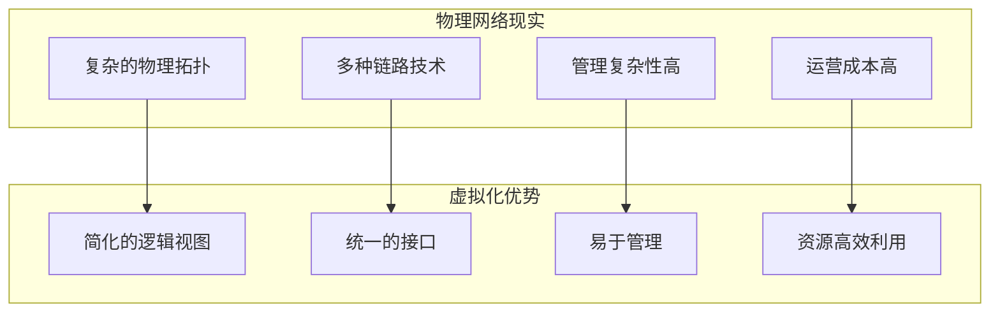
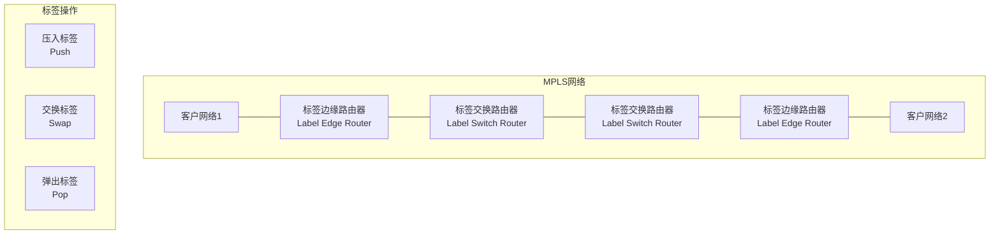
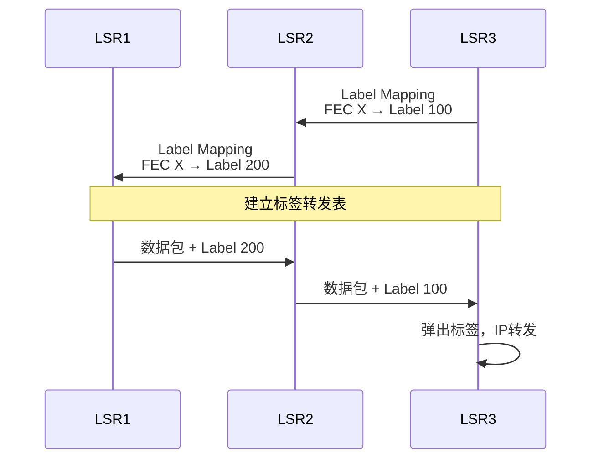
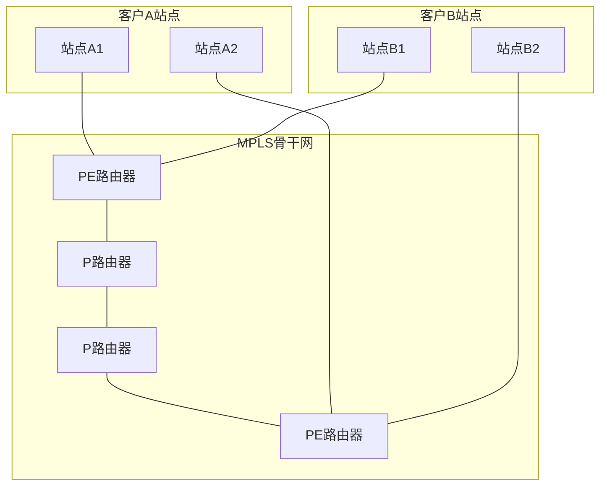
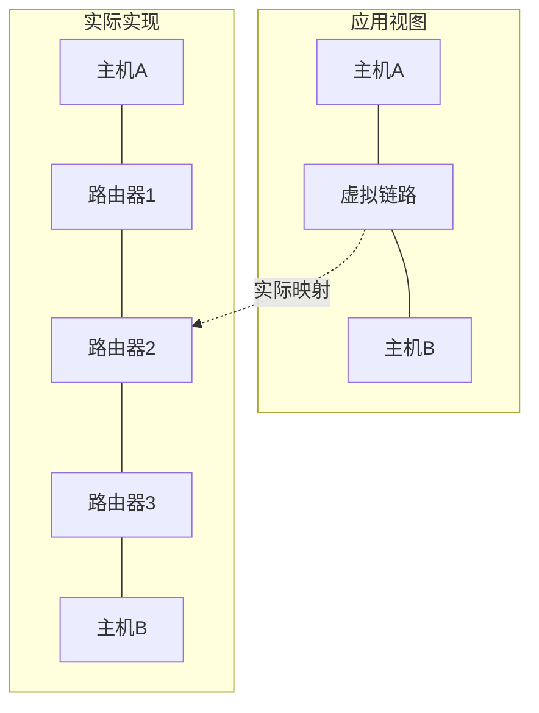
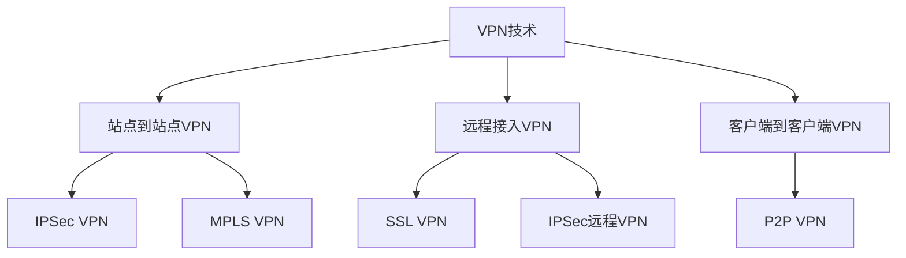
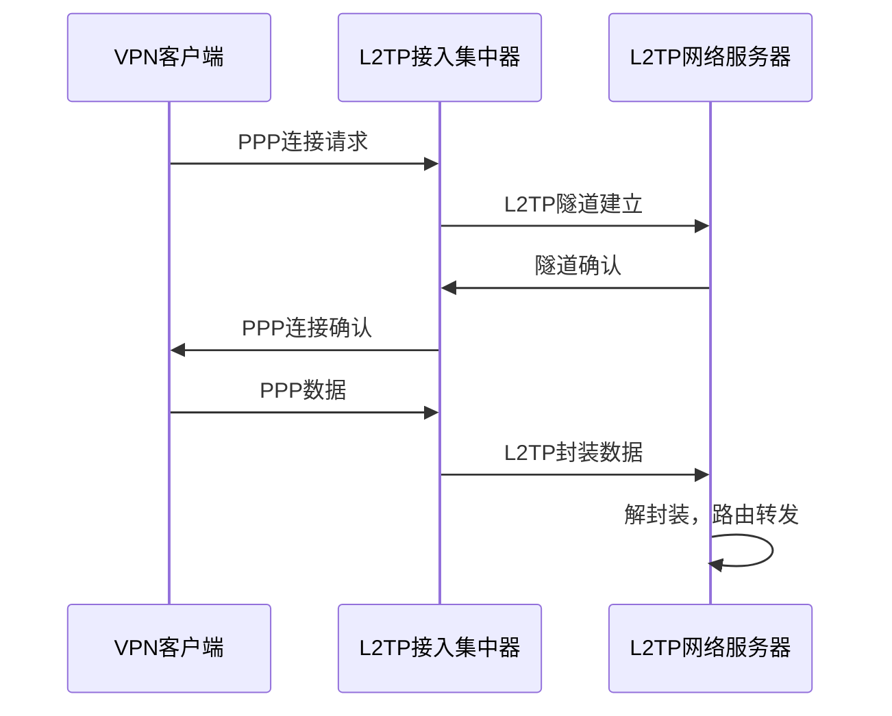
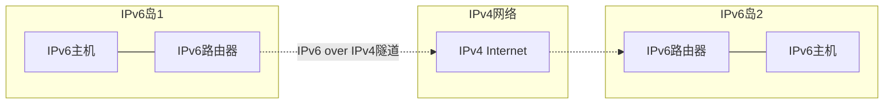

# 6.5 链路层：链路虚拟化

## 目录

1. [链路虚拟化基本概念](#链路虚拟化基本概念)
2. [多协议标签交换MPLS](#多协议标签交换mpls)
3. [网络作为链路层](#网络作为链路层)
4. [虚拟专用网VPN](#虚拟专用网vpn)
5. [隧道技术原理](#隧道技术原理)

---

## 链路虚拟化基本概念

### 虚拟化定义与动机

> **链路虚拟化**
> 
> 将复杂的物理网络基础设施抽象为简单的虚拟链路，为上层提供统一的网络服务接口。

#### 虚拟化动机



**核心优势**：
- **简化复杂性**：隐藏底层网络细节
- **统一接口**：提供一致的服务模型
- **资源共享**：多个虚拟网络共享物理基础设施
- **灵活配置**：动态创建和调整虚拟网络

---

## 多协议标签交换MPLS

### MPLS基本原理

> **MPLS（Multi-Protocol Label Switching）**
> 
> 在网络层分组前添加短标签，根据标签而非IP地址进行快速转发的技术。

#### MPLS网络架构



### MPLS标签格式

#### 标签结构

```
MPLS标签 (4字节，32位)
+----------+----------+----------+----------+
|   标签值Label     |Exp|S|  TTL   |
|     (20位)        |3位|1位| 8位   |
+----------+----------+----------+----------+
```

**字段说明**：
- **标签值**：20位，用于转发决策
- **Exp**：3位实验字段，用于QoS
- **S**：栈底指示位，标签栈的最后一个标签
- **TTL**：8位生存时间，防止环路

### MPLS转发机制

#### 标签分发协议

> **LDP（Label Distribution Protocol）**
> 
> 用于在MPLS网络中分发标签绑定信息的协议。

**标签绑定过程**：


#### 标签交换路径LSP

> **标签交换路径（LSP）**
> 
> 数据在MPLS网络中沿着预定义路径传输的虚拟连接。

**LSP建立过程**：
1. **FEC分类**：将具有相同转发特性的包分类
2. **路径计算**：确定LSP的物理路径
3. **标签分配**：沿路径分配标签
4. **转发表建立**：配置各节点转发表

### MPLS应用场景

#### 流量工程

**问题**：传统IP路由基于最短路径，可能导致链路拥塞

**MPLS解决**：
- 显式路径指定
- 负载均衡
- 带宽预留
- 快速重路由

#### VPN服务

**MPLS VPN架构**：


---

## 网络作为链路层

### 抽象概念

> **网络作为链路层**
> 
> 将整个网络（可能包含多个路由器和链路）抽象为单一的链路层连接。

#### 抽象层次



### 实现技术

#### 1. ATM网络

**ATM作为链路层**：
- 53字节固定长度信元
- 虚电路交换技术
- QoS保证机制

#### 2. 帧中继网络

**帧中继特性**：
- 面向连接服务
- 虚电路标识（DLCI）
- 简化的错误处理

#### 3. MPLS网络

**MPLS抽象**：
- 标签交换路径LSP
- 端到端QoS保证
- 流量工程能力

---

## 虚拟专用网VPN

### VPN基本概念

> **虚拟专用网（VPN）**
> 
> 在公共网络基础设施上构建的专用网络连接，通过加密和隧道技术保证数据安全。

#### VPN类型分类



### 隧道协议

#### L2TP协议

> **二层隧道协议（L2TP）**
> 
> 将PPP帧封装在IP数据报中传输的隧道协议。

**L2TP工作原理**：


#### GRE协议

> **通用路由封装（GRE）**
> 
> 将多种网络层协议封装在IP隧道中传输的协议。

**GRE封装格式**：
```
GRE封装结构
+----------+----------+----------+----------+
| IP头部   | GRE头部  | 载荷协议 | 载荷数据 |
+----------+----------+----------+----------+
```

---

## 隧道技术原理

### 隧道基本概念

> **隧道技术**
> 
> 将一种网络协议封装到另一种协议中进行传输的技术，实现协议的透明传输。

#### 隧道分类

**按封装层次**：
- **二层隧道**：封装链路层帧（L2F、L2TP）
- **三层隧道**：封装网络层分组（GRE、IPSec）
- **应用层隧道**：基于应用协议（SSL VPN）

**按配置方式**：
- **手动配置**：静态隧道参数
- **自动建立**：动态协商建立

### IPv6 over IPv4隧道

#### 过渡技术需求



**隧道实现**：
1. **6to4隧道**：自动隧道配置
2. **6in4隧道**：手动配置隧道
3. **Teredo**：穿越NAT的隧道技术

#### 封装过程

**IPv6 in IPv4封装**：
```
封装前: [IPv6头部|载荷数据]
封装后: [IPv4头部|IPv6头部|载荷数据]
```

---
 
**下一章预告**：[6.6 链路层：数据中心网络](6.6链路层：数据中心网络.md) - 学习现代数据中心的网络架构。
