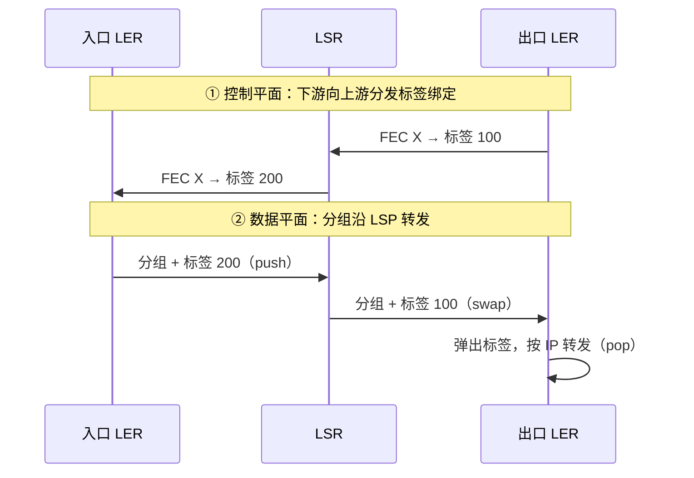
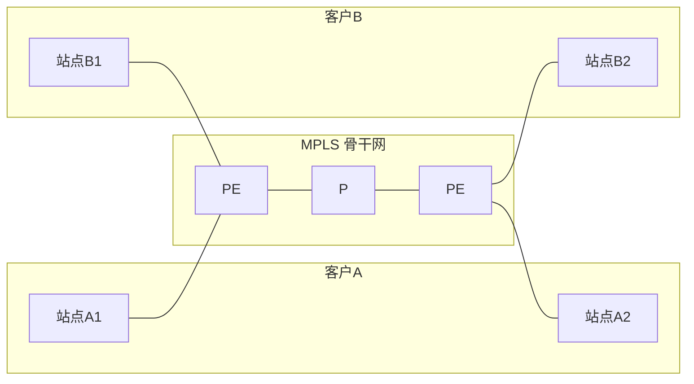

# 6.5 链路层：链路虚拟化

> 本文对应《计算机网络：自顶向下方法》中"链路虚拟化：网络作为链路层"一节，主线是 MPLS。VPN 中网络层的 IPsec、L2TP/GRE 等隧道技术见 [4.6 网络层：IPsec 与 VPN](4.6网络层：IPsec与VPN.md)，本文只讲与 MPLS 紧密相关的 MPLS-VPN。

## 目录

1. [链路虚拟化的含义](#链路虚拟化的含义)
2. [多协议标签交换 MPLS](#多协议标签交换-mpls)
3. [MPLS 标签与转发](#mpls-标签与转发)
4. [MPLS 的应用](#mpls-的应用)

---

## 链路虚拟化的含义

到目前为止，我们把链路层看成一段连接相邻节点的物理线缆（以太网、WiFi 等）。但从上层协议的视角，"相邻"只是逻辑概念：只要两端能直接交换帧，中间是一段网线，还是一整张运营商网络，并无区别。

> **网络作为链路层（A Network as a Link Layer）**
>
> 把一个完整的网络（含多台交换设备）整体抽象为上层眼中的"一条链路"，对上层隐藏内部拓扑与转发细节。

这一思想在历史上有多种实现：早期的 ATM、帧中继把分组交换网当作 IP 的链路层；如今最主流的是 **MPLS**。它们的共同点是用**虚电路 / 标签交换**在网络内部建立面向连接的转发路径，对外只暴露一条逻辑链路。

注：本节讨论的是"用一张网络充当另一张网络的链路层"，与 6.4 节交换机连成的局域网不同——后者仍是真实的二层广播域。

---

## 多协议标签交换 MPLS

> **MPLS（Multi-Protocol Label Switching，多协议标签交换）**
>
> 在网络层分组前加一个定长标签，路由器据**标签**而非 IP 地址做转发的技术。

**"介于 2.5 层"**：MPLS 标签插在链路层帧头与 IP 头之间，既不属于纯链路层，也不属于网络层，故常称其工作在"2.5 层"。

```
+-----------+-----------+--------------+
| 链路层帧头 | MPLS 标签  | IP 头 + 载荷  |
+-----------+-----------+--------------+
            \___________/
             插在二者之间 → 2.5 层
```

### 网络组成

MPLS 网络由两类路由器构成：

| 角色 | 全称 | 位置 | 职责 |
|------|------|------|------|
| **LER** | Label Edge Router，标签边缘路由器 | 网络入口/出口 | 入口压入标签、出口弹出标签（入口 LER 也叫 **入站 PE**） |
| **LSR** | Label Switching Router，标签交换路由器 | 网络内部 | 只按标签交换转发，不查 IP 路由表 |

分组在入口被打上标签，沿一条预先建立的路径逐跳交换，在出口被剥去标签恢复为普通 IP 分组。这条路径称为 **LSP（Label Switched Path，标签交换路径）**，是一条单向的虚连接。

```
客户网络A          MPLS 网络（标签交换）           客户网络B
   │          ┌─────────────────────────┐          │
   ▼          │                         │          ▼
[ IP 分组 ]──►LER──►LSR──►LSR──►LSR──►LER──►[ IP 分组 ]
            压入标签  按标签交换标签   弹出标签
            (push)    (swap)         (pop)
            └──────────── 一条 LSP ───────────┘
```

注：LSP 是单向的，A→B 与 B→A 是两条独立 LSP。

---

## MPLS 标签与转发

### 标签格式

MPLS 标签固定 4 字节（32 位），叠加在帧头与 IP 头之间，可压入多个形成**标签栈**：

```
 0                   20  23 24       31
+----------------------+----+--+--------+
|        Label         | Exp| S|   TTL  |
|        (20 位)        |3 位|1位| 8 位  |
+----------------------+----+--+--------+
```

| 字段 | 位宽 | 含义 |
|------|------|------|
| **Label** | 20 | 标签值，转发决策的依据 |
| **Exp** | 3 | 实验/流量类（TC），用于 QoS 优先级 |
| **S** | 1 | 栈底标志：=1 表示这是栈底（最后一个）标签 |
| **TTL** | 8 | 生存时间，逐跳减 1，防环路 |

**标签栈**：当 MPLS 嵌套（如 MPLS-VPN）时，分组可携带多个标签，靠 S 位标识栈底。转发只看**栈顶**标签。

### 转发：标签交换 vs IP 最长前缀

传统 IP 转发：每台路由器对目的 IP 做**最长前缀匹配**，查找代价随路由表规模增长。

MPLS 转发：LSR 用栈顶标签做**精确匹配**查标签转发表，得到出接口与新标签，执行 swap 后转发——是固定开销的查表。

| 对比 | 传统 IP 转发 | MPLS 标签转发 |
|------|-------------|--------------|
| 转发依据 | 目的 IP 地址 | 标签值 |
| 查表方式 | 最长前缀匹配 | 精确匹配 |
| 决策范围 | 仅按目的地 | 可按路径/QoS（同一目的地可走不同 LSP） |

易混：最长前缀匹配是按地址"找最具体的网段"；标签交换是按标签"查固定表项"，二者不是一回事。MPLS 的关键优势不在转发更快（现代硬件查 IP 已足够快），而在于**转发可与路由解耦**——能按非目的地因素（流量工程、VPN）选择路径。

### 标签的分发

LSP 上各跳的标签绑定（哪个 FEC 用哪个标签）需要事先分发。

> **FEC（Forwarding Equivalence Class，转发等价类）**
>
> 一组按相同方式转发的分组（如目的地相同的所有分组）。入口 LER 把分组归入某个 FEC，再映射到对应标签。

> **LDP（Label Distribution Protocol，标签分发协议）**
>
> 在 MPLS 网络内分发"FEC ↔ 标签"绑定的协议。



---

## MPLS 的应用

### 流量工程

传统 IP 路由只按最短路径转发，热点链路易拥塞而旁路链路闲置。MPLS 把转发从"按目的地"解耦出来，可显式指定 LSP 走哪条路径，从而实现负载均衡、带宽预留与故障时的快速重路由。

### MPLS-VPN

运营商在 MPLS 骨干网上为多个客户提供互不可见的专用网络。



- **PE（Provider Edge）**：骨干网边缘路由器，连接客户站点，按客户维护独立的路由表（VRF），实现地址与路由的隔离。
- **P（Provider）**：骨干网内部路由器，只做标签交换，不感知具体客户。

实现隔离靠**两层标签栈**：外层（栈顶）标签指明到达哪个出口 PE，由 P 路由器交换；内层标签指明出口 PE 上对应哪个客户的哪个站点。即便两个客户使用相同的私有地址段，凭内层标签也能正确区分。

易混：**MPLS-VPN 提供的是"隔离"，不是"加密"**。它靠标签隔离不同客户的流量，数据在骨干网内并不加密，安全性建立在对运营商的信任之上。若需端到端加密，应叠加网络层的 **IPsec-VPN**（见 [4.6](4.6网络层：IPsec与VPN.md)）。二者常配合使用：MPLS-VPN 做隔离与互通，IPsec 做机密性。

---

**下一节**：[6.6 链路层：数据中心网络](6.6链路层：数据中心网络.md)
