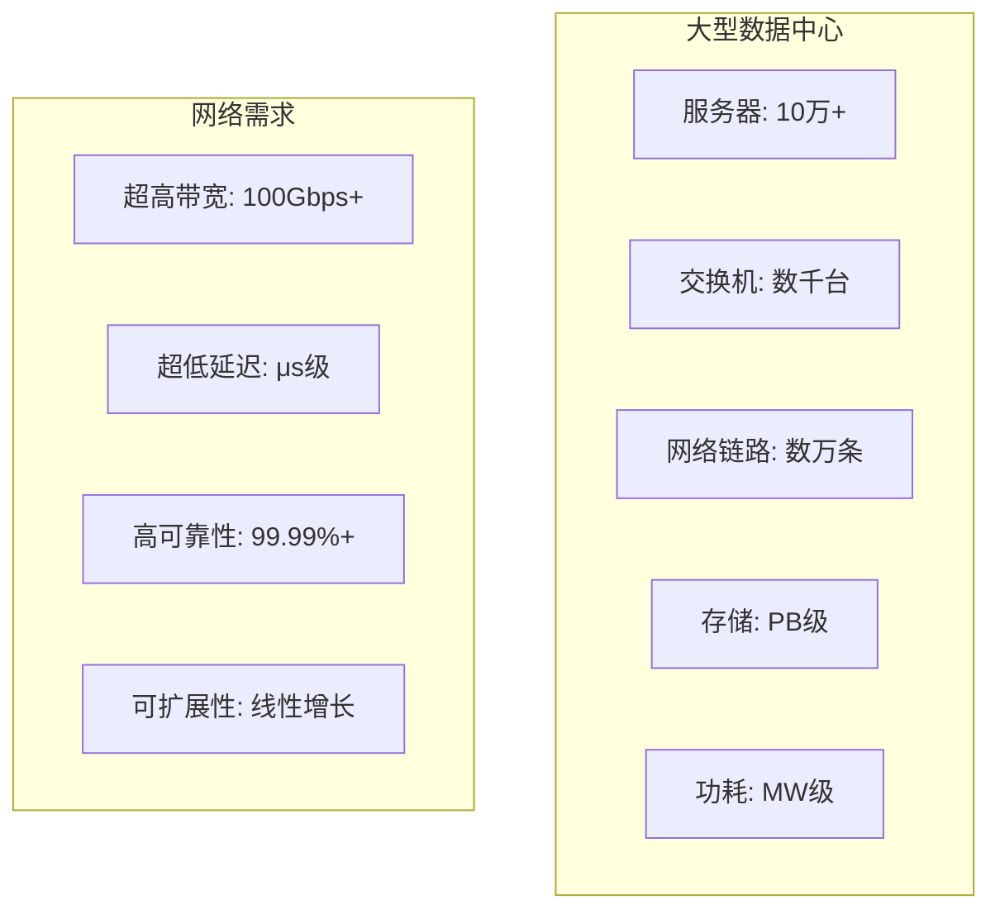
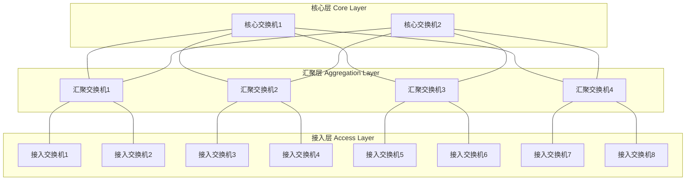
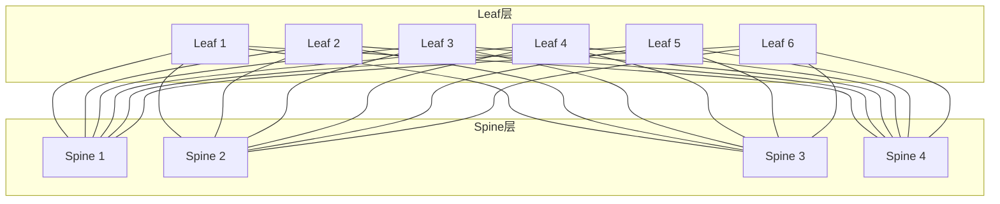
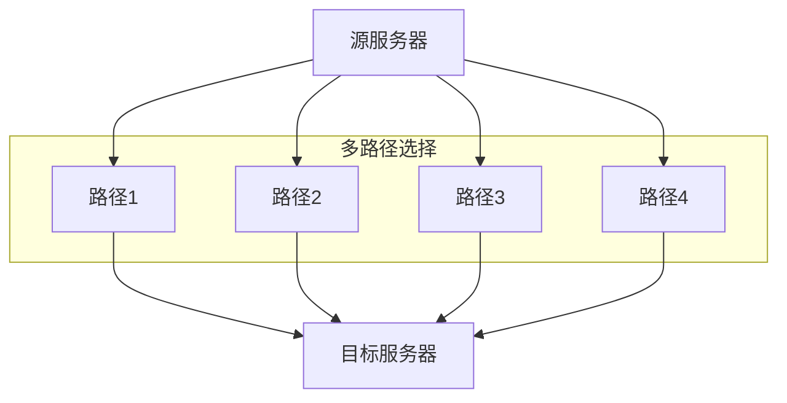
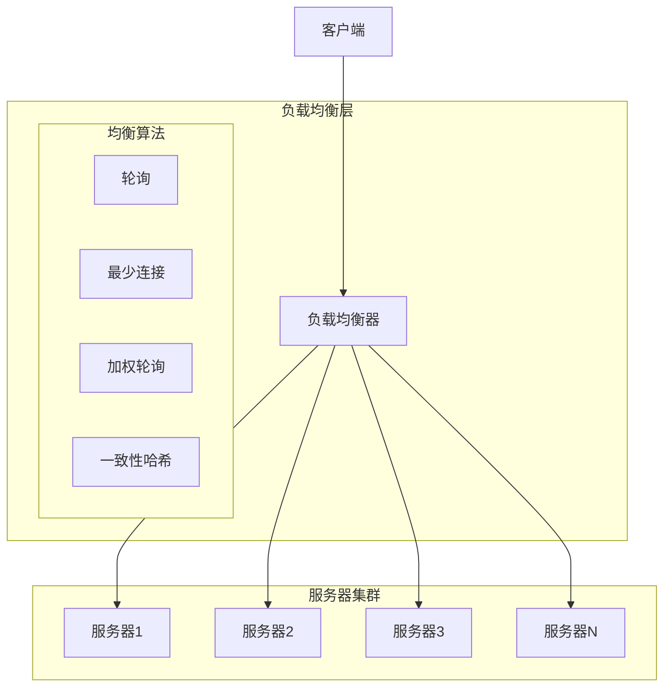
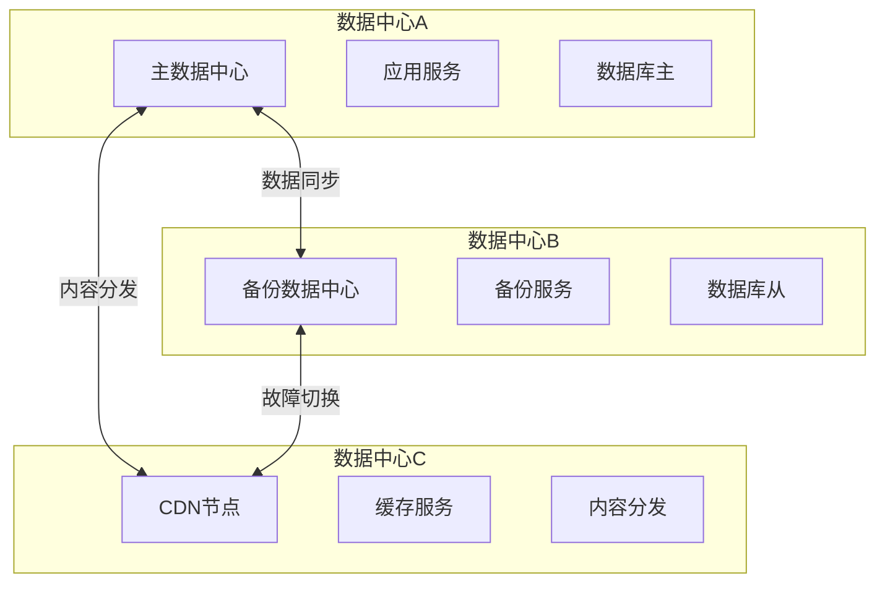
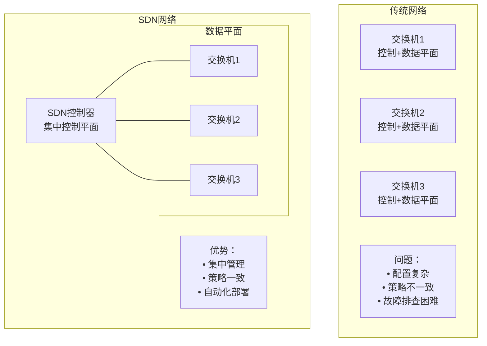
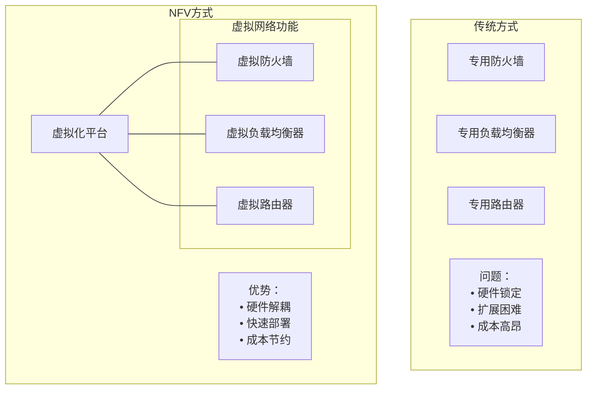

# 6.6 链路层：数据中心网络

## 目录

1. [数据中心网络概述](#数据中心网络概述)
2. [数据中心架构设计](#数据中心架构设计)
3. [负载均衡技术](#负载均衡技术)
4. [数据中心互联](#数据中心互联)
5. [软件定义数据中心](#软件定义数据中心)

---

## 数据中心网络概述

### 数据中心特点

> **数据中心网络**
> 
> 为大规模计算和存储资源提供高性能、高可靠网络连接的专用网络基础设施。

#### 现代数据中心规模

### 数据中心网络挑战

#### 技术挑战

**流量特性**：
- **东西向流量**：服务器间大量数据交换
- **南北向流量**：与外部网络的通信
- **突发性流量**：瞬间高负载需求
- **多样化应用**：不同QoS要求

**性能要求**：
- **高吞吐量**：支持大规模并行计算
- **低延迟**：实时应用需求
- **高可用性**：7×24小时服务保证
- **可扩展性**：灵活应对业务增长

---

## 数据中心架构设计

### 传统三层架构

#### 分层设计模型

**各层功能**：

**接入层（ToR - Top of Rack）**：
- 连接服务器到网络
- 通常48端口1GbE + 4端口10GbE
- 二层交换功能

**汇聚层**：
- 连接多个接入交换机
- 路由和策略实施
- VLAN间路由

**核心层**：
- 高速数据转发
- 连接到WAN
- 最小延迟设计

### 现代架构演进

#### 脊叶架构（Spine-Leaf）

> **Spine-Leaf架构**
> 
> 两层扁平化网络架构，所有叶子交换机都连接到所有脊柱交换机，提供一致的延迟和带宽。

**Spine-Leaf优势**：
- **可预测性能**：一致的延迟和带宽
- **无阻塞**：足够的上行链路带宽
- **易于扩展**：添加Spine或Leaf节点
- **故障隔离**：单点故障影响有限

#### Fat-Tree架构

> **Fat-Tree拓扑**
> 
> 基于多级交换机的树型结构，上层链路带宽逐级增加，提供高聚合带宽。

**设计特点**：
- 递归结构设计
- 多路径冗余
- 等价多路径路由
- 高聚合带宽

---

## 负载均衡技术

### 链路层负载均衡

#### ECMP（等价多路径）

> **等价多路径路由**
> 
> 在多条等价路径间分散流量，提高网络利用率和可靠性。

**负载均衡算法**：
- **轮询（Round Robin）**：依次分配
- **哈希算法**：基于流标识计算
- **最少连接**：选择负载最轻路径
- **带权重**：根据链路容量分配

#### 链路聚合LAG

> **链路聚合组**
> 
> 将多条物理链路捆绑成一个逻辑链路，提供更高带宽和冗余。

**IEEE 802.3ad标准**：
- 动态链路聚合协议LACP
- 负载均衡和故障切换
- 最多8条活跃链路

### 应用层负载均衡

#### 负载均衡器类型

**负载均衡器分类**：

| 类型 | 工作层次 | 特点 | 性能 | 功能 | 应用场景 |
|-----|---------|------|------|------|---------|
| L4负载均衡 | 传输层 | 基于IP和端口 | 极高(Mpps) | 简单转发 | 高性能场景 |
| L7负载均衡 | 应用层 | 基于HTTP内容 | 中等(Kpps) | 智能路由 | 复杂路由需求 |
| DNS负载均衡 | 应用层 | 域名解析 | 高 | 地理分布 | 全球分布 |
| GSLB | 应用层 | 全局负载 | 中 | 多数据中心 | 灾备切换 |

**负载均衡算法详解**：

**1. 轮询（Round Robin）**：
- 按顺序依次分配请求
- 适用于服务器性能相同的场景
- 实现简单，分布均匀

**2. 加权轮询（Weighted Round Robin）**：
- 根据服务器权重分配
- 权重比例：2:1，则2个请求到服务器1，1个到服务器2
- 适用于服务器性能不同的场景

**3. 最少连接（Least Connections）**：
- 选择当前连接数最少的服务器
- 动态适应服务器负载
- 适用于长连接场景

**4. 一致性哈希（Consistent Hashing）**：
- 基于客户端IP或Session ID计算哈希
- 同一客户端总是分配到同一服务器
- 适用于需要会话保持的场景

### 数据中心性能计算

#### 网络性能指标

**1. 带宽需求计算**：

> **例题**：某数据中心有1000台服务器，每台服务器网卡速率1Gbps，采用Spine-Leaf架构。求Spine层所需带宽。

**解答**：

**假设**：
- 超额订阅比1:3（常见配置）
- 每个Leaf交换机连接40台服务器
- 每个Leaf需要上行带宽：$\frac{40 \times 1Gbps}{3} = 13.3Gbps$

**Leaf数量**：
$$N_{leaf} = \frac{1000}{40} = 25\text{台}$$

**Spine总带宽需求**：
$$B_{spine} = 25 \times 13.3Gbps = 332.5Gbps$$

**Spine交换机配置**：
- 假设使用40Gbps端口
- 每个Spine需要端口数：$\lceil \frac{25}{1} \rceil = 25$个
- Spine交换机数量：根据冗余需求，通常4-8台

**2. 延迟分析**：

**端到端延迟组成**：
$$T_{total} = T_{serialization} + T_{propagation} + T_{switch} + T_{queue}$$

其中：
- $T_{serialization}$：序列化延迟 = $\frac{L}{R}$
- $T_{propagation}$：传播延迟 = $\frac{d}{v}$（d为距离，v为光速）
- $T_{switch}$：交换延迟（1-10μs）
- $T_{queue}$：排队延迟（0-100μs，取决于负载）

**典型数据中心延迟**：
- 机架内通信：<10μs
- 跨机架通信：<50μs
- 跨POD通信：<100μs

**3. 吞吐量计算**：

**有效吞吐量**：
$$S_{eff} = \frac{L_{data}}{L_{data} + L_{overhead}} \times R \times (1 - P_{loss})$$

其中：
- $L_{data}$：数据负载长度
- $L_{overhead}$：协议开销
- $R$：链路速率
- $P_{loss}$：丢包率

**示例计算**：
- 数据负载：1460字节（典型TCP数据）
- 协议开销：54字节（以太网14+IP20+TCP20）
- 链路速率：10Gbps
- 丢包率：0.001%

$$S_{eff} = \frac{1460}{1514} \times 10Gbps \times 0.99999 = 9.64Gbps$$

#### 资源利用率分析

**服务器利用率**：
$$U_{server} = \frac{T_{busy}}{T_{total}} \times 100\%$$

**网络利用率**：
$$U_{network} = \frac{B_{actual}}{B_{capacity}} \times 100\%$$

**目标利用率**：
- CPU利用率：60-70%（保留处理突发的能力）
- 内存利用率：70-80%
- 网络利用率：40-60%（避免拥塞）
- 存储利用率：70-80%

---

## 数据中心互联

### DCI技术需求

> **数据中心互联（DCI）**
> 
> 连接地理分布的多个数据中心，实现数据和应用的协同工作。

#### 互联需求分析

**DCI应用场景**：
- **灾难恢复**：数据备份和业务连续性
- **负载分担**：地理负载均衡
- **数据同步**：实时数据复制
- **资源共享**：计算和存储资源池化

### DCI技术方案

#### 光传输技术

**DWDM（密集波分复用）**：
- 单光纤承载多个波长
- 高带宽长距离传输
- 适用于城域和长途DCI

**CWDM（粗波分复用）**：
- 较少波长数量
- 成本相对较低
- 适用于短距离DCI

#### 以太网扩展

**OTN（光传送网）**：
- 提供透明传输服务
- 强大的OAM功能
- 支持多种客户信号

**MPLS L2VPN**：
- 二层VPN服务
- VPLS（虚拟专用LAN服务）
- E-LINE（点到点以太网服务）

---

## 软件定义数据中心

### SDN在数据中心的应用

#### SDN架构优势

#### OpenFlow在数据中心

**OpenFlow优势**：
- **精细流控制**：基于任意字段匹配
- **编程灵活性**：动态流表配置
- **集中管理**：统一网络视图
- **快速创新**：软件定义功能

### 网络功能虚拟化NFV

#### NFV基本概念

> **网络功能虚拟化**
> 
> 将传统网络功能（如防火墙、负载均衡器）虚拟化为软件，运行在标准硬件上。

**NFV关键技术**：
- **虚拟化技术**：容器、虚拟机
- **服务链**：VNF的组合和编排
- **资源编排**：自动化部署和管理
- **性能优化**：DPDK、SR-IOV等加速技术

---
 
**下一章预告**：[6.7 链路层：Web请求历程](6.7链路层：Web请求历程.md) - 综合分析Web页面请求的完整过程。
