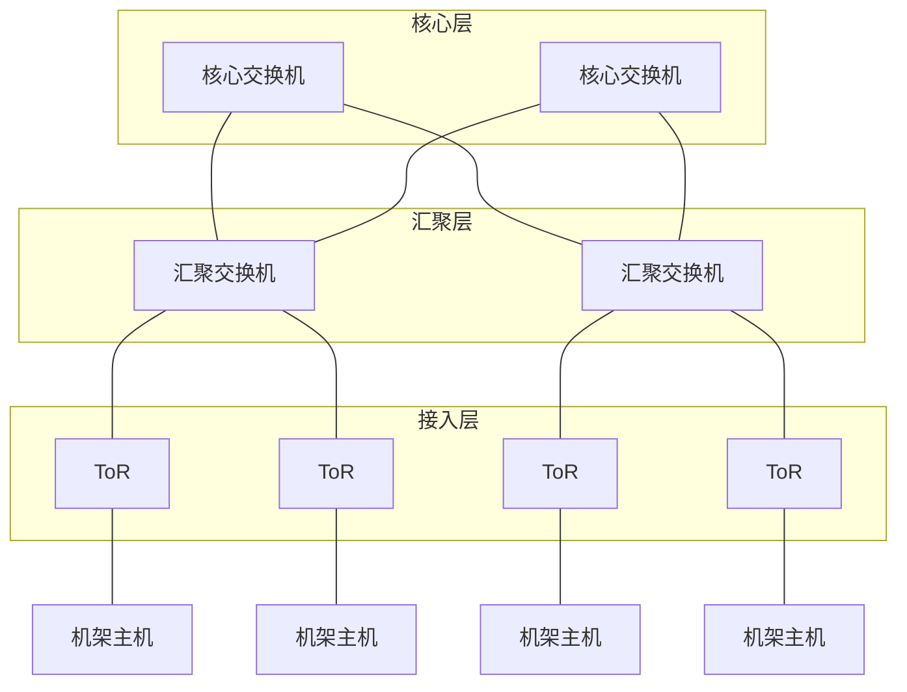

# 6.6 链路层：数据中心网络

## 目录

1. [数据中心网络概述](#数据中心网络概述)
2. [分级拓扑结构](#分级拓扑结构)
3. [负载均衡](#负载均衡)
4. [流量特性与多路径](#流量特性与多路径)
5. [发展趋势](#发展趋势)

---

## 数据中心网络概述

数据中心承载了搜索、社交、电商、云计算、大数据分析等大量网络应用。一个大型数据中心可包含数万到数十万台主机，这些主机通过**数据中心网络（Data Center Network，DCN）**互联，并经边界路由器接入外部互联网。

与广域网不同，数据中心网络的设计目标集中在两点：

- **主机间高带宽**：大量应用需要在主机之间搬运海量数据（如 MapReduce 的洗牌阶段、分布式存储的副本同步）。
- **低成本扩展**：用大量廉价的商用交换机（commodity switch）构建，而非少数昂贵的高端设备。

> **数据中心网络要解决的核心问题**
>
> 如何把成千上万台主机用商用交换机组织起来，既支持外部用户访问，又支持主机之间的大规模数据交换。

数据中心内部流量可分为两类，二者的区分是后续拓扑设计的出发点：

- **南北向流量（North-South）**：数据中心与外部互联网之间的流量，如用户请求与响应。
- **东西向流量（East-West）**：数据中心内部主机之间的流量，如分布式计算、存储复制。现代数据中心中东西向流量通常远大于南北向流量。

```
            互联网
              │  南北向流量（用户请求/响应）
        ┌─────┴─────┐
        │  边界路由器 │
        └─────┬─────┘
   ┌──────────┼──────────┐
 ┌─┴─┐      ┌─┴─┐      ┌─┴─┐
 │主机│◄────►│主机│◄────►│主机│   东西向流量（主机间数据交换）
 └───┘      └───┘      └───┘
```

注：南北向、东西向只是按流量方向的习惯叫法，与机房物理朝向无关。

---

## 分级拓扑结构

### 传统三层拓扑

数据中心通常采用**分级（hierarchical）拓扑**组织交换机，自底向上分为接入层、汇聚层和核心层。主机按机架（rack）摆放，每个机架顶部放一台交换机直连本机架主机，这台交换机称为**机架顶交换机（Top of Rack，ToR）**。



各层职责：

| 层次 | 别名 | 职责 |
|------|------|------|
| 接入层 | ToR 交换机 | 直连同一机架的主机，是主机的网络入口 |
| 汇聚层 | 第 2 层交换机 | 汇聚多个 ToR，连通不同机架 |
| 核心层 | 第 1 层交换机 | 连接各汇聚交换机，并经边界路由器对接外部网络 |

### 超额订阅与瓶颈

这种树形拓扑存在固有问题：越往上链路越"细"。底层主机的总接入带宽很高，但通向核心的上行链路数量有限，于是出现**超额订阅（oversubscription）**。

> **超额订阅比**
>
> 主机侧可能产生的峰值带宽，与上行链路实际能提供的带宽之比。例如 ToR 下接 40 台主机各 10 Gbps（合计 400 Gbps），而上行只有 4 条 10 Gbps（合计 40 Gbps），则超额订阅比为 $10:1$。

后果：处于不同机架（尤其跨汇聚交换机）的主机之间，可用带宽远低于同机架内主机之间的带宽。这对东西向流量很不友好——分布式应用恰恰需要任意两台主机之间都有高带宽。

注：经核心层转发的跨机架通信不仅带宽受限，时延也更高；同机架内通信只经过一台 ToR，时延最低。

### Fat-Tree 拓扑

为缓解超额订阅，数据中心广泛采用**胖树（Fat-Tree）**拓扑。其核心思想是：越靠近根部，等效链路越"粗"——通过增加上层交换机数量、让每条上行都有多条并行路径，使任意两台主机之间都能获得接近线速的带宽（理想情况下无阻塞）。

```
                 核心交换机
            ┌────┬────┬────┬────┐
            │    │    │    │    │      每台 ToR 到核心
        ┌───┴──┐ │    │ ┌──┴───┐      都有多条等价路径
      汇聚交换机 ····· 汇聚交换机
        ├──┬──┤        ├──┬──┤
       ToR ToR        ToR ToR
        │   │          │   │
       主机 主机        主机 主机
```

特点：

- **多路径冗余**：任意两台主机之间存在多条等价路径，既提升聚合带宽，也提供容错。
- **用商用交换机堆叠**：不依赖少量高端设备，靠数量换带宽，成本可控。
- **配合等价多路径转发**：多条路径要真正用起来，需要 ECMP 等机制把流量摊到各条路径上（见下文）。

易混：胖树仍是分级拓扑，并非"扁平"；它通过增加路径数量来逼近无阻塞，而不是减少层数。

---

## 负载均衡

### 负载均衡器

外部用户的请求先到达数据中心的**负载均衡器（load balancer）**，再由它分发给内部的某台主机处理。负载均衡器对外是一台主机（一个公开的 IP 地址），对内则在大量主机间分担工作。

```
   互联网请求
      │
┌─────┴─────┐
│  负载均衡器 │  对外暴露单一 IP，对内分发请求
└─────┬─────┘
 ┌────┼────┬────┐
主机1 主机2 主机3 主机4   各主机处理被分到的请求
```

负载均衡器的两个作用：

- **分担负载**：把请求摊到多台主机，避免单台过载。
- **类 NAT 功能**：对外隐藏内部主机的 IP，将外部请求的目的地址改写为内部某台主机的地址，并把响应改回。

> 注：这里的"负载均衡"指**外部请求在主机之间的分发**，与下文 ECMP 在网络内部多条链路间的流量分摊是两回事。

常见分发策略：

- **轮询（Round Robin）**：依次分给各主机，适合主机性能相近。
- **最少连接（Least Connections）**：分给当前连接数最少的主机，适合长连接。
- **哈希**：按客户端 IP 等字段哈希，使同一客户端落到同一主机，便于会话保持。

---

## 流量特性与多路径

### 东西向流量主导

如前所述，数据中心内部以东西向流量为主。一个搜索查询、一次 MapReduce 作业，往往要在大量主机之间反复交换中间结果。因此，主机间能否获得高且稳定的带宽，直接决定应用性能——这也是采用 Fat-Tree 等多路径拓扑的根本原因。

### 等价多路径 ECMP

Fat-Tree 提供了多条等价路径，但要让带宽真正"叠加"，必须把流量分散到这些路径上，这就是**等价多路径（Equal-Cost Multi-Path，ECMP）**。

> **ECMP**
>
> 当源、目的之间存在多条代价相同的路径时，交换机按一定规则把不同的流分配到不同路径上，从而同时利用多条链路。

实现要点：

- **按流哈希**：通常对五元组（源/目的 IP、源/目的端口、协议）做哈希来选路，保证**同一条流走同一条路径**，避免分组乱序影响 TCP。
- **粒度问题**：哈希以"流"为单位，若恰好几条大流（elephant flow）哈希到同一条路径，仍可能造成局部拥塞而其他路径空闲——这是 ECMP 的固有局限。

```
       主机 A ──► 交换机
                 ╱  │  ╲
              路径1 路径2 路径3   不同的流被哈希到不同路径
                 ╲  │  ╱
       主机 B ◄── 交换机
```

注：ECMP 在交换机层面分摊流量；另有**链路聚合（Link Aggregation，IEEE 802.1AX / LACP）**把两台设备间的多条物理链路捆成一条逻辑链路，作用相近但范围限于点对点的相邻设备之间。

---

## 发展趋势

### SDN 集中控制

数据中心规模庞大、配置频繁变化，逐台手工配置交换机难以维护。**软件定义网络（SDN）**将交换机的控制平面集中到一个**控制器**，由它统一计算转发规则并下发给各交换机（数据平面），交换机只负责按规则转发。

```
        ┌──────────┐
        │  SDN 控制器 │   集中计算转发策略
        └────┬─────┘
      ┌──────┼──────┐
   交换机   交换机   交换机    仅按下发的流表转发
```

好处是配置集中、策略一致、便于自动化。控制器与交换机之间常用 **OpenFlow** 等协议交互，按分组的多个首部字段匹配并执行转发动作。SDN 的原理已在网络层控制平面一章详述，见 [5.5 网络层：SDN控制平面](5.5网络层：SDN控制平面.md)。

### 其他趋势

- **网络功能虚拟化（NFV）**：把防火墙、负载均衡器等原本由专用硬件实现的功能，改为运行在通用服务器上的软件，便于按需部署和弹性伸缩。
- **模块化数据中心**：把若干机架与配套交换机预装进标准集装箱，整箱运输、即插即用，简化建设与扩容。

---

**下一章预告**：[6.7 链路层：Web请求历程](6.7链路层：Web请求历程.md) —— 综合分析一次 Web 页面请求所经历的完整过程。
